# 学完血赚！最强人工智能数据挖掘实战【Python金融量化分析】，非常适合新手！即练即会！！！ - P25：25-股票池筛选 - 迪哥小助手 - BV1URsfeqEQ5

然后这里啊就是哎这个日期咱后续都能调在这块刚开始咱们就不调了，就是你的一个即日资金，然后一个呃咱就按这个每日每分钟咱就不说了，这些咱后续都能调我就不管了。咱们先来写这个代码。好。

首先第一步在什么在我们的一个勾造函数当中啊。😊，我们要写什么呢？我说我现在啊不是这个S一了，它叫什么这个沪人300是不是？或者300啊，直接用名字来写也行，你用代码写也行。呃。

把这个沪深300给它写进来。哎，这个是我们当前要的一个池子吧。好了，然后这打印信息我不需要了。那在这个池子当中，那接下来我们来写这个预处理。写这个预处理啊，就是咱们来说了。

要获取哎他每天的一些财务的数据。那这些东西怎么去做啊？来看这里啊，这有一个帮助文档啊，大家用的时候啊，把这个帮助文档啊全打开。所有咱们哦不是这个所有啊咱们的一些指标啊，都在哪儿啊。

都是在这些帮助文档当中啊，咱来去看的啊，其实说白了所有你要获取的一些结果，不是我列的，也不是谁说的啊，都是在这个文档当中，人家会给你详细的去写。哎，咱们怎么样去查询呢，怎么样得到结果啊，来看吧。😊。

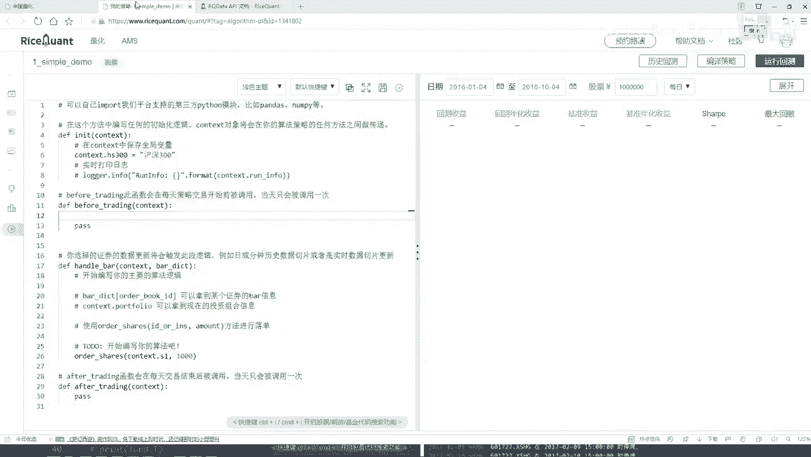

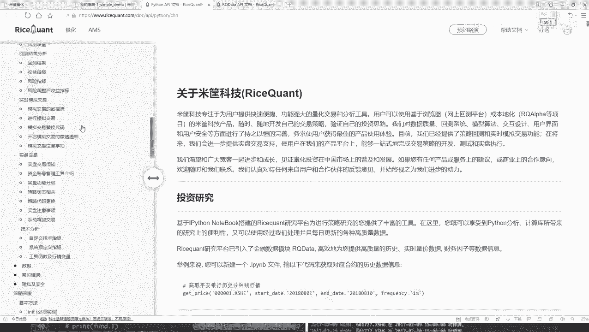

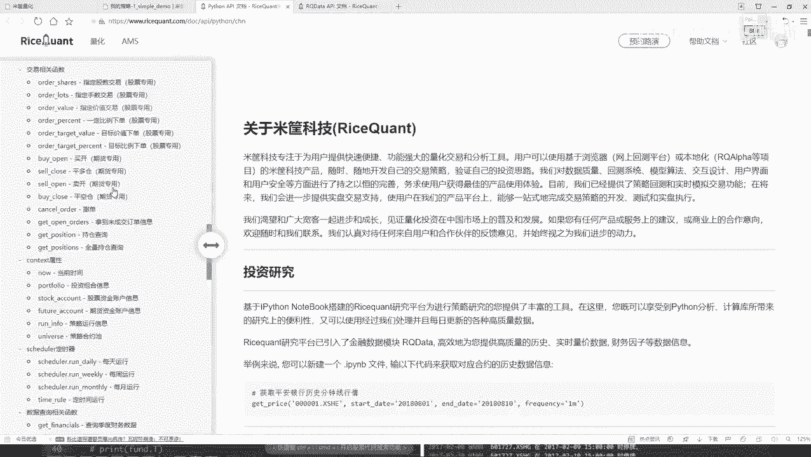

我们先开始说什么，哎看是不是说咱们要去查询一些指标啊，那比如好比说你要查询一些什么，你看这里有好多啊查询什么财务数据啊，各种各样指标都有吧。所以我说这像什么，咱最开始说了，量话交易者的东西。

说白了就是一个数据挖掘吧，里边涉及到的数据啊太多了，各个指标哎呀都有，是不是？所以说能做的事还蛮多的。咱们今天啊这个小例子就给大家举一个例子啊，咱们不用太多指标。

咱直接看这个就是查询一下它的一个财务数据。😊。

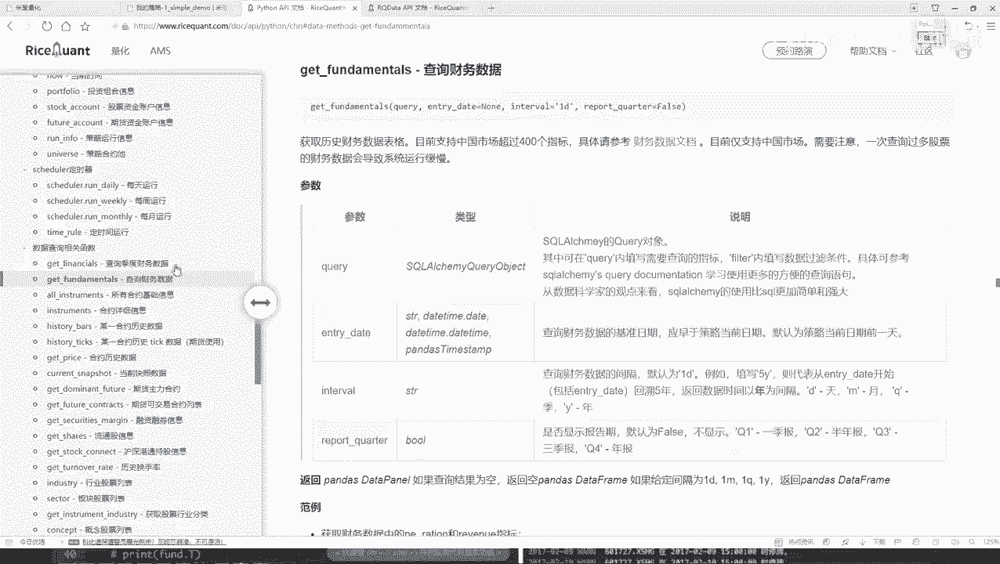

然后呢大家用的时候一定是这样，就是你先读一读哎，人家这个东西啊，它是呃怎么样去写的。你看这一块他说了，哎，当前也用这个函数当中啊，你得第一个参数给我传建一个qui，就是一个查询。查询什么意思呢？

就在这块，他说了，哎，他说这个query当中啊，你可以去填写。你要查询的指标，并且呢可以用这个filter去过滤一些条件。哎，那跟咱们的需求来说，是不是挺像的呀。

所以这样我直接啊把这个呃函数直接复制过来，复制到咱们这个策略当中。😊，我说在这里啊，首先第一步哎，我说我要去做一个查询，然后呢，后面这个东西咱先把这个东西都去掉，先写这个queryquery等于什么？

现在你要查询哪些个东西了吧。好了，快手当中我就写一下吧。在我们大概快手当中，那我要去查了查什么呢？我刚才说了，查我的一个财务的它的一个收它的一个收入情况吧。那比如说我现在想看这个财务的收入情况。

那怎么看呢？在这里我们来点一看，点开看一下。

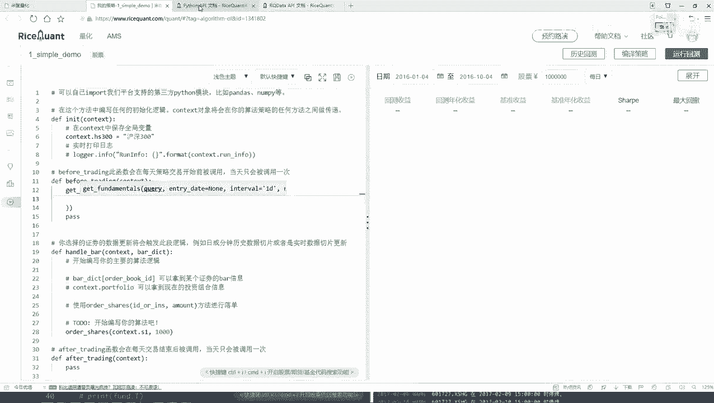

这里还有它的一些具体啊财务的文档，就是点开之后啊，他会告诉你哎，咱们的数据当中啊，你都有哪些个字段可选，这个就被大家一个去看了。到时候大家想看哎各种各样的字段。然后比如说技术财务数据当中啊。

我们可能要的就是呃它的一个营业的总收入，哎，咱们用这个指标加指标咱们就暂时不看了。这里咱来直接写一下。好了，在我们的查询当中，首先第一个。

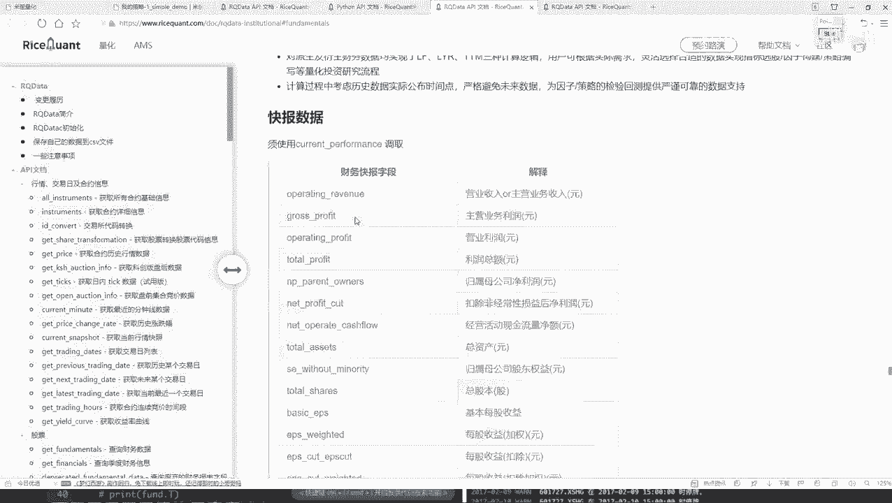

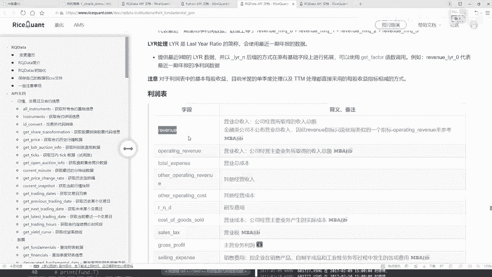

要查他的理项啊，查他的一个呃基础的一个营收的一个指标。然后找一下，就是在这里它的一个营收的指标。哎，好，这里应收为指标。那我们来想一想啊，就是对于它的一个应收指标。那现在好比说我查到手了。

那查完之后干什么，那查完之后还没完，咱该说什么？哎，是不是说我要去过滤一下，过滤什么。首先你现在去查的东西啊好像有点多是吧？哟你要查的东西，你告诉我了，查谁的呀，你是还没指定啊。好了。

咱们这块要指定一下，你在哪些个股票当中执行这样一个查的操作。所以说这里我要写一个filterfilter当中啊，相当于呃你自己啊要去做一些判断了。好了，首先我们来判断一下，就是当前我们查的这个东西。😊。

把它给它复制过来。当前我们要查的这个结果。它怎么样？是不是在我们的一个股钥式当中吧。好了，对它啊做一个判断。那也就是说啊现在我们找到了，然后以及再找到它的一个代码。我看看这个啊，应该是一个扣代码。

看一下它的扣代码是否是在，应该是一个in，我看看呃应该是一个in就可以了。然后。哦，对，就这个印。in就可以了。然后呢看一下它的一个呃股票代码是不是啊在我们的一个股票式当中股票值啊。

咱刚才是不是已经设定好了，就是一个互联300是吧？好了，这给它复制过来这就行了。然后呢，现在我们做了一个判断，判断完之后我们要干什么？哎呦，现在只是做一个判断，那我说接下来我们还要干什么，做一个排序吧。

可能判断完之后，我们现在拿到多少个300个300个不如想要的，我要做一个order呃，我看一下啊DRorder下排个序排哦，不是order，我看那名字好像变了，应该是一个alder by。

der一下alder什么呢？你是不是得告诉我哎，现在你是按照一个升序还是按照一个降序来玩这个东西啊。好了，我说现在按照这个东西，按照谁呢？按照呃这个吧，就是它的一个营收，然后按照营收的一个降序吧。

咱是选什么选最好的嘛，所以说此时我说给它指定成一个降序是不是可以啊？那现在alder buy做完了，那还差什么？我说这里啊降序完之后，可能哎呦这么多，那你不一定全用吧，好了。

我说咱们来限制一下limit一下，我们选多少个，那你选10个是不是可以啊？相当于在这里我说只选10个，我最想要的一个股票是不是就完事了呀？这个给大家看了一下，就是我们第一步啊先写了一下。😊。

在be复垂顶之前啊，我们先做了一个呃基本的一个筛选吧，并且给它排序好了，拿到了10个我想要的呃这里咱给它起个名字。就叫做它的一个d frame吧，因为它返回时也是给我一个de frame。

然后把这个东西加入到contestt当中，一会儿再还要再去用的。行了，这个这样吧，我先给大家打印一下，看一看它能不能啊把当前我们这个结果给它做出来呃print一下，然后其他的其他咱们暂时先不用不用的。

我暂时给它先pass掉，然后运行一下吧，先看一看能不能把这个结果给我打印出来。

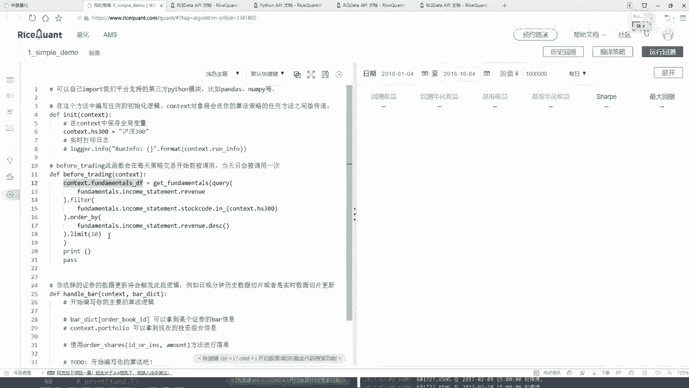

这个打印出来的结果应该就是呃每一天他会都去打印。因为你看这个be付 trading这个东西，它是每一天都要执行这样一个操作的。所以说哎呀这块有点小问题，他怎么没给打印出来呢？

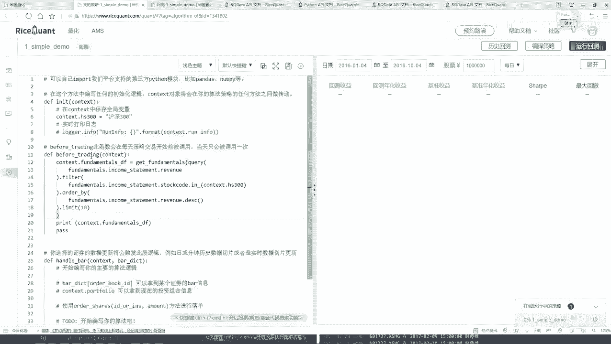

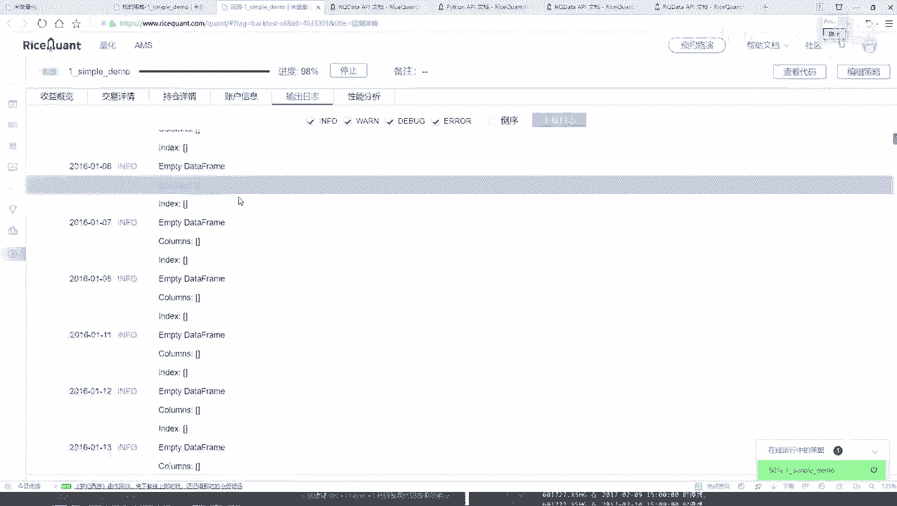

来看一看打印日志当中哦，它都是打印个空的，我再往下来了，看是不是都是空的，都是个空的，没有打印出来。行，咱们检查一下这个函数当中有没有什么问题啊。首先第一步，我们把函数写出来了。

然后写了一个queryque当中，然后我说去查哪个指标就查它的一个财务的营收的指标没问题啊，然后指定个filter当中，我说我去判断一下当前这个股票是否是在我的一个沪深300当中。

然后如果说是啊然后就是把沪300当中所有股票都拿出来。然后接下来我说做了一个排序啊，检查没有什么小问题，打印为空的，说明在这个沪深300中应该没找到这块咱们刚才怎么想的怎么怎么样了。

这块是不是写沪不行啊，你是指数当中去找啊，以这块我们之前少写一个index当中，我看一看它的名字。果大家把它的一个名字忘了，没关系啊，你都可以在AP当当中给它找到。你看这是股票债券。

然后找咱们找这个指数。这的把这个指数这个。😊。

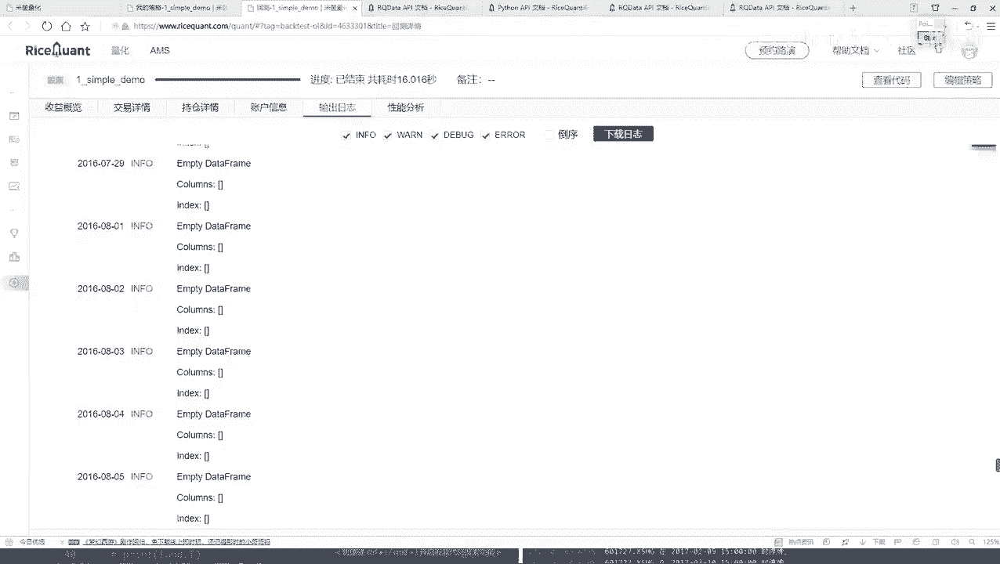

到手，然后给它复制过来。好了，这是在指数当中。呃，然后写一下我的一个名字，就要沪是300就行了。然后重新的咱们再来运牙回测，看看这回的结果。这回应该也没什么问题了。刚才我们的一个股票池子啊没指定出来啊。

这回咱们重新来看一下，看一下它的输入输出日志吧啊。😊。

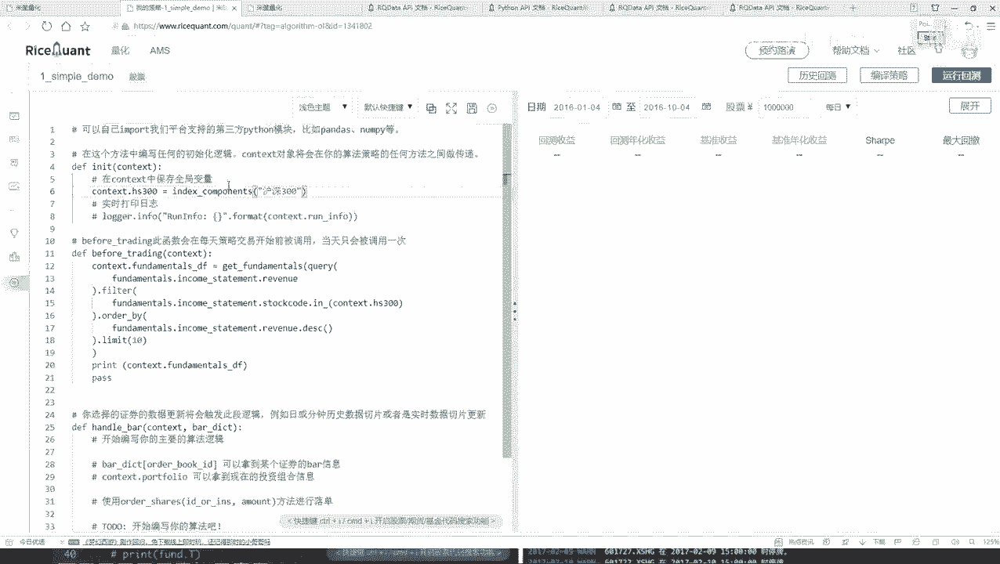

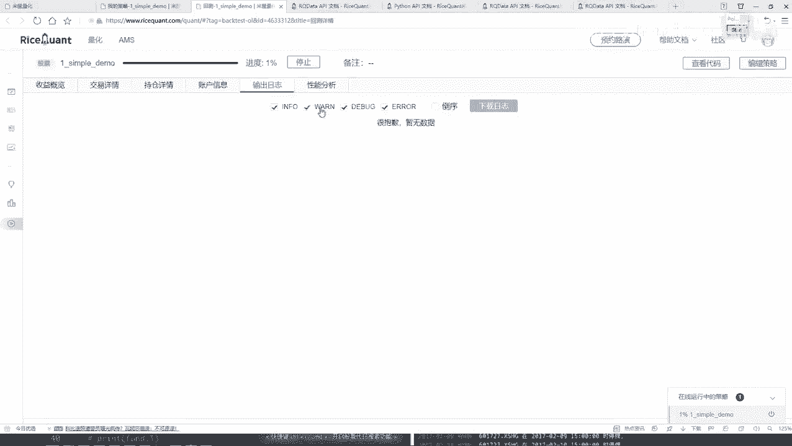

你看这日子当中是不是有了第一天的，然后这个20从这个2010年1月4号咱没改时间啊，这是他默认时间。然后有哪个，你看第一次有这个呃，后几次哎呀，这个看起来其实不是特别好看吧。

这个他给出来这个结果是呃这种情况就是。横着是一个呃股票的一个名字，然后下面它是一个就是每个股票，它的一个指标跟我们的一个想法不太一样。

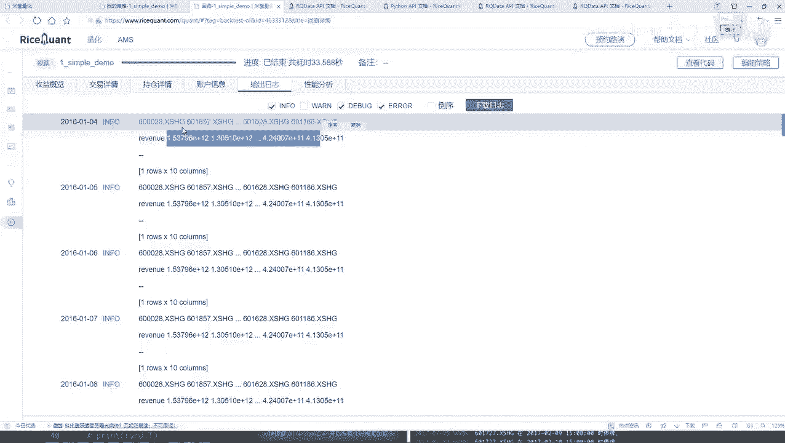