# 学完血赚！最强人工智能数据挖掘实战【Python金融量化分析】，非常适合新手！即练即会！！！ - P41：41-Alphalens工具包介绍 - 迪哥小助手 - BV1URsfeqEQ5

然后一会儿啊我们在做过程当中，哎，不是在我们这个noable当中去写啊，是在我们的平台当中啊，平台当中去写。一会儿大家演示一下，在平台当中啊，咱们怎么写。因为这里啊咱想去拿一些指标太麻烦了。

咱一会儿直接到平台当中去做。然首先把这个再再介绍完，然后咱们就写代码。还有一个东西啊就给大家介绍，就是叫做阿尔法 lens啊，这个东西很好用啊，相当于就是接下来我们所有的计算操作以及所有的画图操作啊。

你省事了，你不用自己去做了，有现成的工具包帮我们去完成，我们来点开看一下吧。

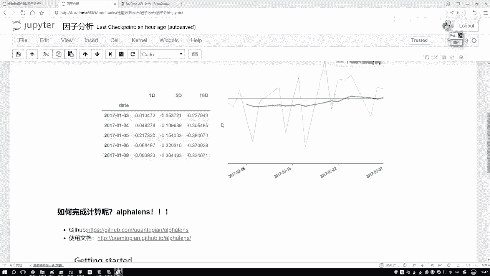

点去看一下，这个是它的一个链接啊，这个然后呢它就是专门啊去做这个因子分析的。但是它里边功能可能是比较多的。呃，咱们这节课可能给大家讲一些最核心的，然后剩下其他的，大家就是可以自己哎按照自己的喜好了。

然后大家用这个工具包啊，就是第一步啊，你需要去先装一下装这个工具包其实很简单，你看这它这个我这个链接给大家列出来了，一个是它的gi的一个网址，一个是它的一个使用文档，在它当中啊，他会告诉你啊。

怎么去安装 installstore一下是就行了。打开你IP install一下啊，这就完事了，安装非常简单。但是大家其实你也可以不用去装了。因为一会儿我们是用人家现成的平台，人家已经帮我们装好了。

如果大家想在本地玩，那你自己装一下，然后装完之后呢，我建议这样。

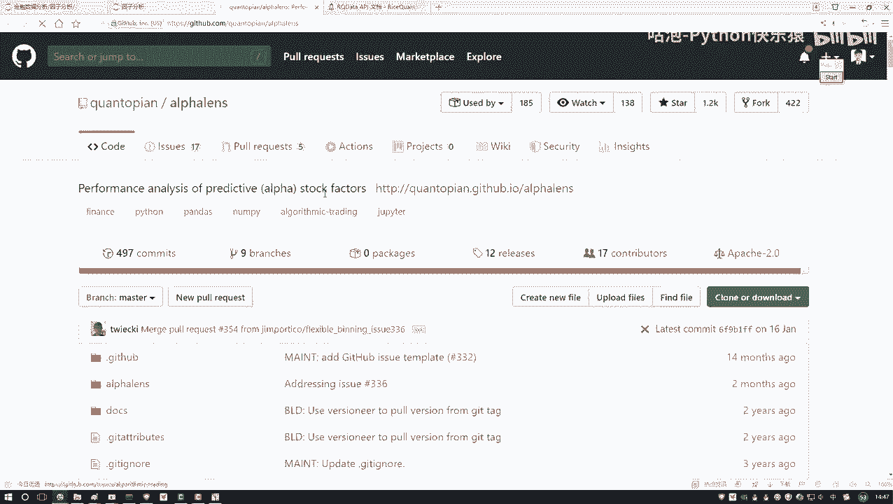

就是可以看一看它的一个使用文档啊，然后它的一些example，建议大家看什么，你可以看一看这里它有很多个小例子的。你点去之后啊。

这块啊哦这块哦不不是这个不是这个咱们看这个看这里看这块它得有一些examples，我找一找这块啊，它有一些说用文档。

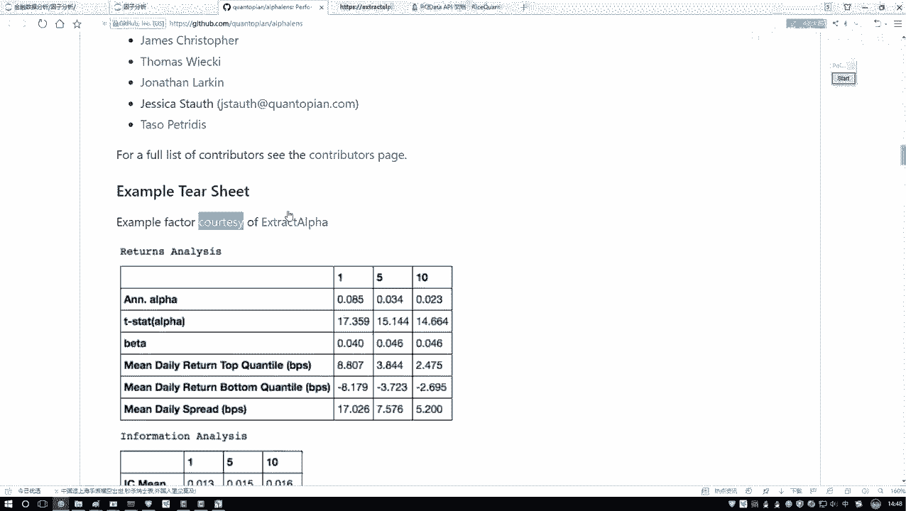

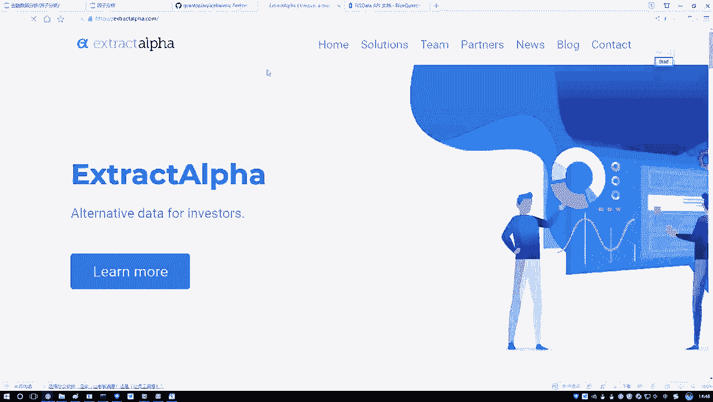

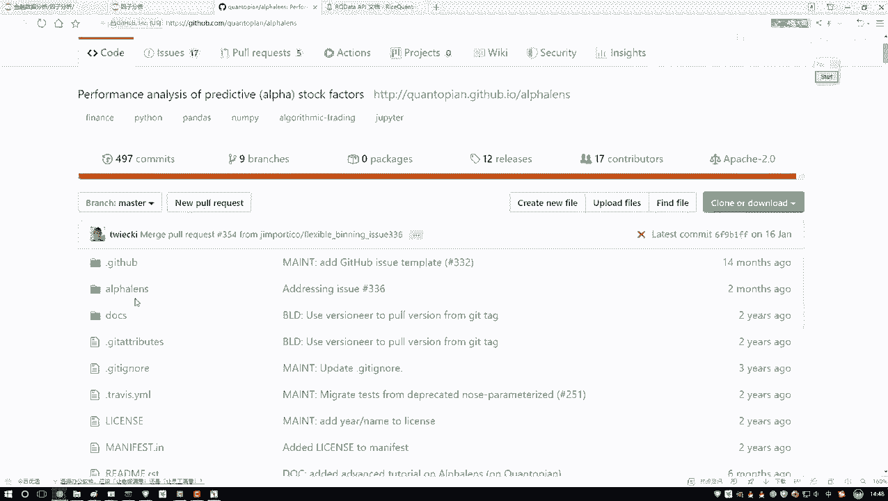

在这些数据文档当中啊，它会有哎不是这里。在他的我看看这个当中有没有这个ex exampleamp这里了，在这里它有一些呃写的还不错的一些实例文档，相当于啊就是教你一些哎最基本的使用方法。

然后大家如果说你想看这些文档来去简单学讲也行。或者说一会儿听我讲也行。我这些东西哪来的，基本上所有东西啊都是参考人家的一个官方的小例子啊，看一看它怎么去做的。然后我照着人家学一学，我再怎么给大家去讲啊。

其实啊就是我觉着最好的学些东西，就是官方文档啊，还有一些官方的小例子，这里啊他介绍的比较详细，咱们内容啊相当于就是把它给你介绍的，到时候都给大家去说啊，这些图什么意思，把它给你介绍这些所有东西啊。

咱们给大家总结起来了啊，然后咱们一步一步照着去做，这里它有一个非常详细的小例子呃，我不给大家一个去读了，读的太花太太花时间了。你想深入去学习，你可以去看一看啊它的一些具体的一些描述。

如果说呢你想只哎只想去做。

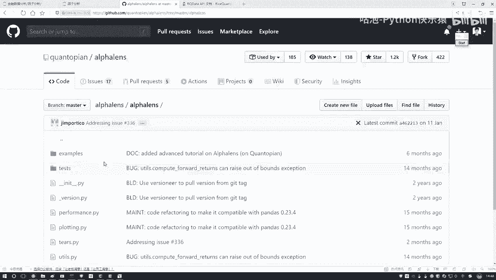

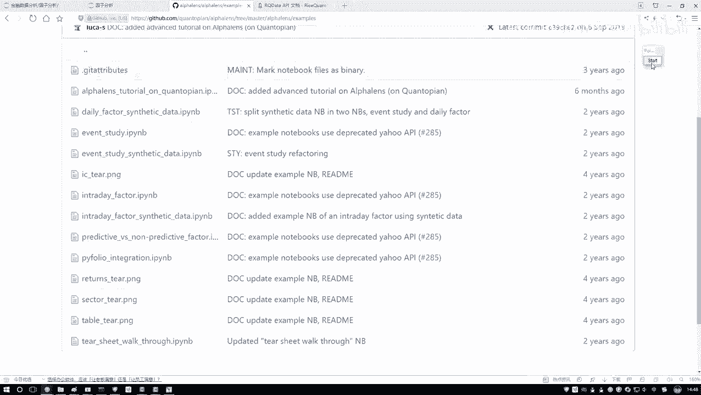

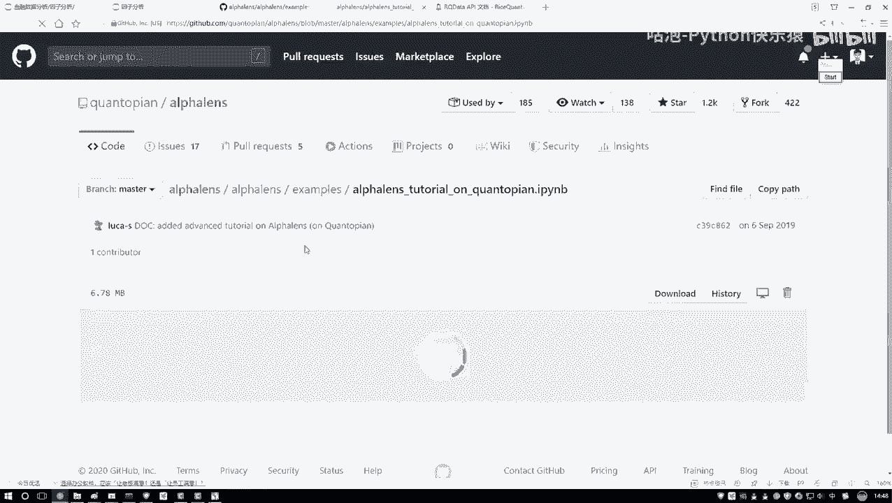

咱们课程当中啊完成了任务，看我给大家准备的一个小例子，哎，给大家准备的案例就行了。这个是它的一个文档里边教程还是不错的。然后呢，第二个还有使用文档使用文档就是它的一些API说明了。点进去之后啊。

你可以看一下，在这里哎它会有一些简单的介绍，然后下面还有一些哎就是基本的说明吧。然后这里你想看它的一些各种各样的API其实我们主要的就用这几个你想看的时候，这块有些说明啊，看他听他说也行。

然后一会听我说也行啊，这是人家的一个文档，然后大家用的时候啊，这是哎先把这个简单看一下就行，知道有一个叫阿尔法 learn的东西帮助我们去计算啊，我们要的，比如说这个IC值，比如说我们要画这个图。

这个是一会儿啊咱要用到的一个工具。

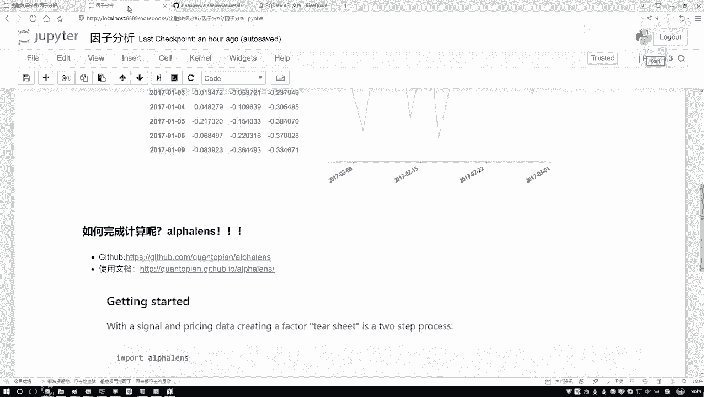

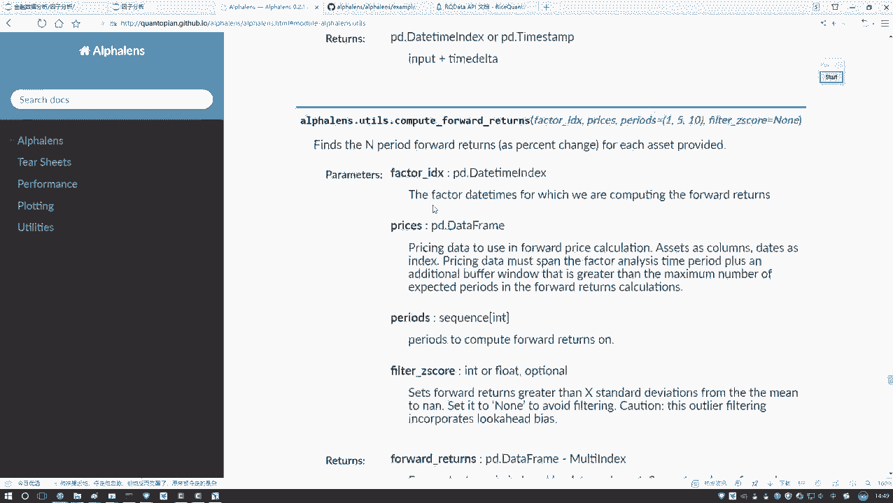

然后介绍另一个呃，还有个工具啊，在这里在这个这个就是进入到我们PI当中了吧。在这个PI当中啊，咱之前哎是不是说我们去新建一个策略，然后我们去跑一些回测啊？呃，今天咱们先不用跑回测。

因为我们现在要看什么对我们数据来做一些分析，对我数据做一些处理的操作吧。所以这里啊咱来看这块啊，有这个有叫做一个投资研究啊，就是做在左边的时候啊，有一个东西叫投资研究，咱来点一下。

就是进入到你的策略当中啊，然后这块有投资研究，咱不跑回测了，所以说点来点开一下看一看。😊，点开完之后呢，它这块哎你看像不像跟我们那个note book启动的画面一样的呀。好了，这里我说我新建一个哎。

新建一个python3。😊，新建一个意思啊，就是说这里哎你去呃在人家的一个服务器上去写啊，因为你在自己电脑上去写，你数据获取不了啊，必须在人家服务器上去写。行了，咱来写一下吧。

这个我们就叫做一个因子分析。

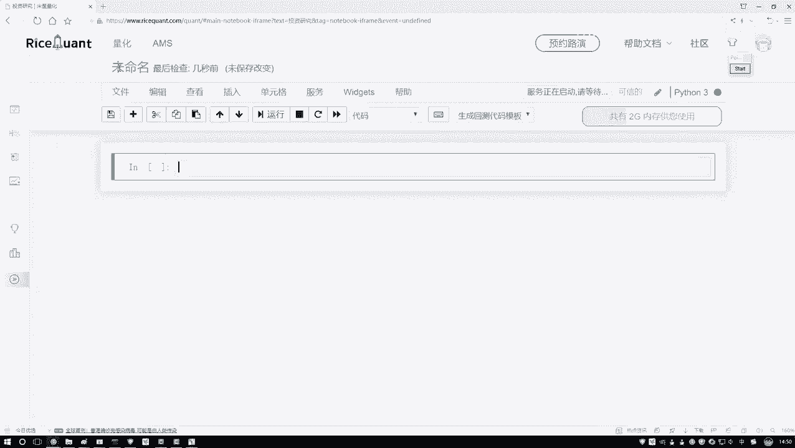

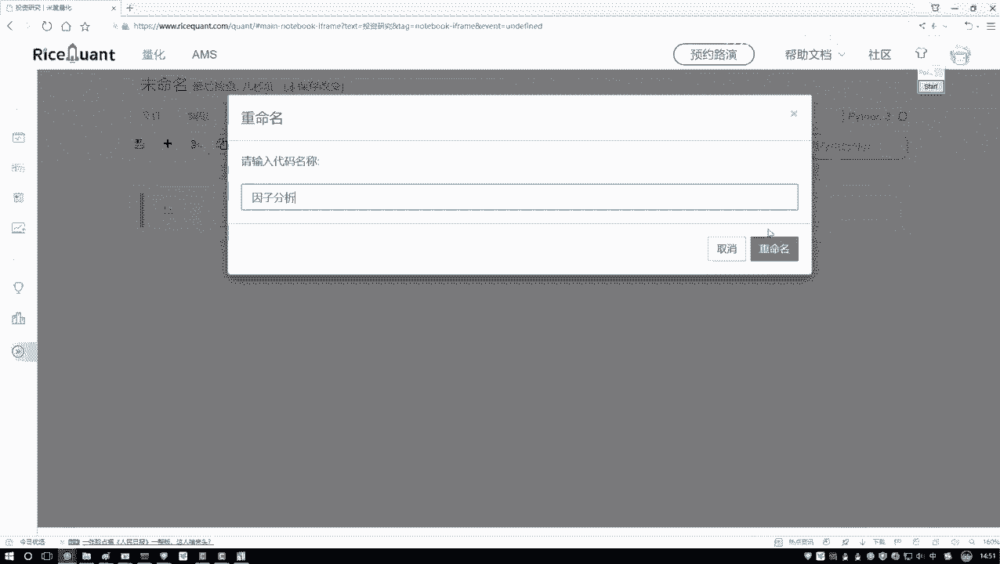

好，然后重命名一下。在这里呢，我们需要一会儿呃就是一会儿咱们代码在这里写啊，到时候我会把代码拷贝给大家一份。到时候大家用的时候啊，你可以去上传到，或者是你复制到你的这个平台当中啊。

或者说照着咱们视频哎自己写也行。这个是一会儿啊我们要用到的一个写代码这个工具啊。其实说白了就是在人员服务器上去写啊，跟我们自己写，其实没什么区别啊。

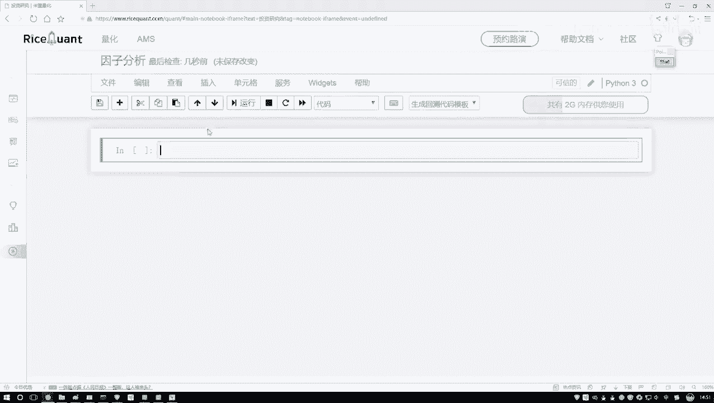