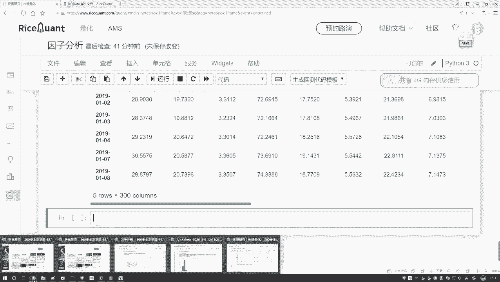
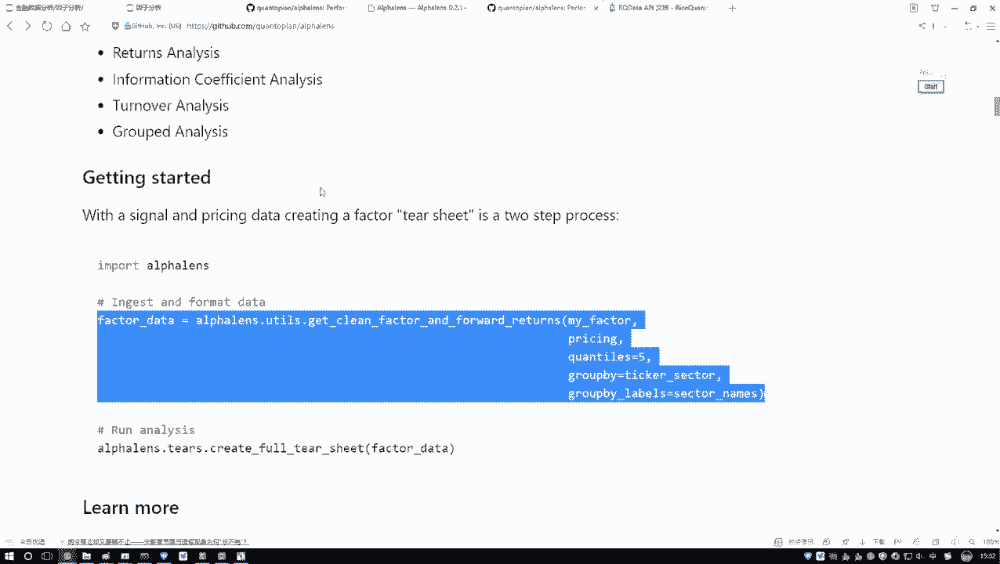
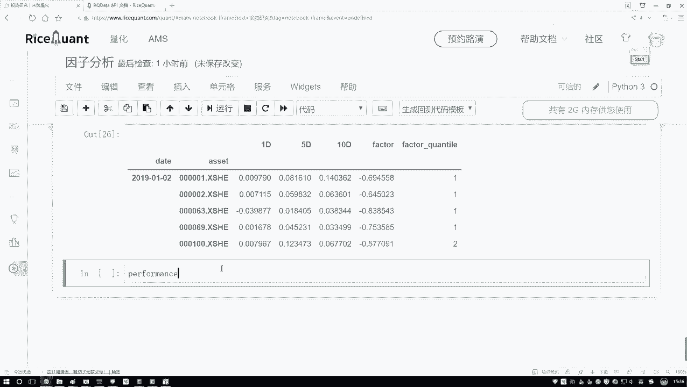
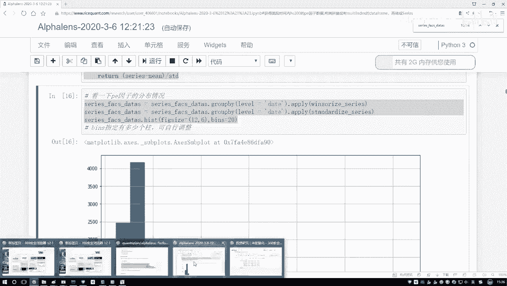
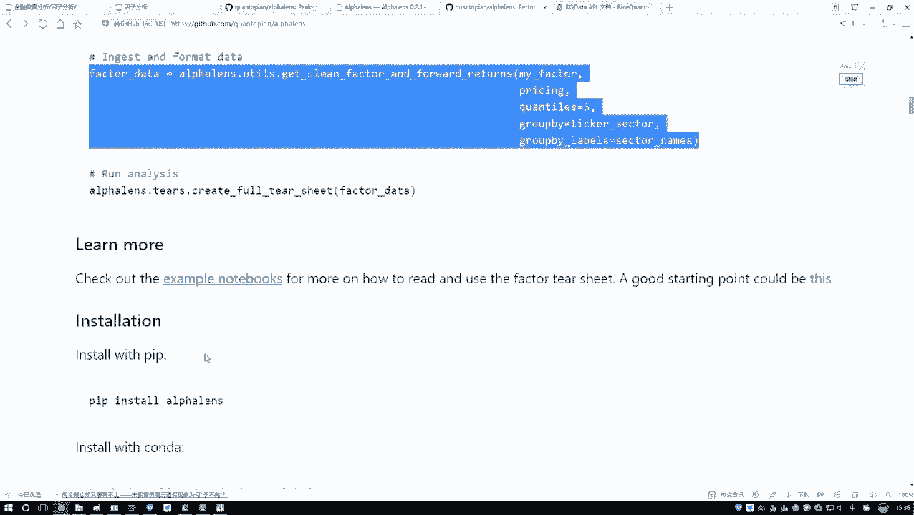
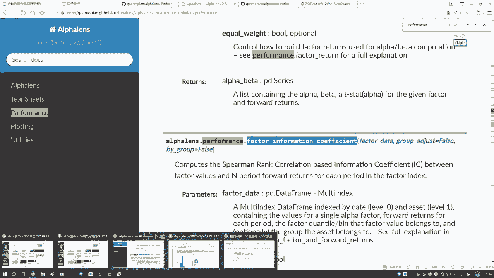

# 学完血赚！最强人工智能数据挖掘实战【Python金融量化分析】，非常适合新手！即练即会！！！ - P45：45-IC指标值计算 - 迪哥小助手 - BV1URsfeqEQ5

现在啊我们要算什么，是不是这个IC值啊，IC值哎跟就是谁跟谁去算啊，是不是当前我们的一个指标值跟它实际的一个收益率来去做计算吧。

那我们是不是知道哎呀当前我们每一天它的一个价格或者每一天它的一个实际收盘价格等于多少，然后我们好算那个收益率吧。好了，这里我们再来获取呃获取。😊，获取收盘价吧，获取收盘价获取收盘价。

这个就是直接用这个get price函数。在pri当中啊，就是你需要去写啊，你要获得哪些个股票，这里咱来写吧。呃，我获取哪些个股票，我的股票池子呢往上找呃，我写到哪去了？嗯，啊。

这里啊咱们这个股票池子是吧？好了，把咱们的股票池子写进来，然后以及我们的还有两个参数。第二参数就是一个start start一个起始日期，起始日期咱们的任务刚才说是从2019年，然后1月1号。

然后接来有一个under date。到这个2020年，然后它的一个月1号是月行了。这个就是当前我们会去获取啊，它的一个价格呃，会价格当中它会给你拉出来一堆指标。我先看一下啊这块它给我返回的一个结果。

应该默认啊是有好多种好多个价格的pri一下。priice PIE等于带这指标，然后看一看吧，pri当中的前几条。呃，我看一下啊。呃，get price get price当中，然后PRAE。没问题啊。

然后我的一个看顺。点head哦，他没有点head是吧？正好把它打印一下吧，它可能是一个list，打印前5个。它这个index它是应该是个三维的，我看一看它的一个点ship值呃。

点ship值这个三维的是吧？那咱这里直接取一个吧，为了给它转成二维的，所以这里我们只取这个收盘价得了，然后再执行一下，这回它就变成二维了。二维就是一个 frame我们就可以来去看一下了。行。

这里咱把这个收盘价格全要拿到手了吧。然后然后它的一个缩引就是每一天，然后这一块对应的就是呃它的一个股票，每个股票名字，然后以及每天它的一个价格，咱是不是全部啊给它指定好了。哎。

这里咱们就把这个数据做完了。然后这块还做的不太完善，我们再稍微指定一下，在这个pri当中，我说我自己指定一下吧。指定一下它的一个索引。😊，index，然后它点它的一个name等于我当前的这个date。

然后呢，接下来我指定一个列名，指定个列名叫做一个code吧。就是我的一个股票是就是它是什么股票。呃，它的一个列名，然后再点令一下，等于咱们当前的股票名字再执行一下。行了，这回有了。

就是我们现在把咱们的一个收盘价数据啊都有了。那接下来呢咱们要用啊一个非常神奇的函数了。呃，在这里哎呀我得去看一看。

呃，在咱们那个哎在咱们那个诺簿当中呢，在咱们录簿当中啊，这一块有它的一个哎直接上kit号吧，kt号当中啊，找一下哎，这里找一下它是怎么去用的。特别长的一个函数啊，记就是肯定记不下来了。找一找这里呃。

尤 test斯当中哎，对，就这个就这个东西特别长。你得把当前你的数据啊做一个呃格式的转换，这里就需要咱们传建两个参数。第一个咱们处理好的一个呃就是因子的数据是吧？

第二个处理好的咱的那个什么就是一个价格的数据，咱现在是不是都有了。好了，我直接把它复制过来全复制过来，这太长了，不可能记录的呃，复制过来。然后在我们这里来，咱们写一下。😊。

这块我写一下，就是格式转换吧，就是人家要求你必须这么去做呃，格式转换直线一下，把它复制过来。然后哦我看啊这里咱直接就是utt该导进来了，前面不用了。然后这一块几个参数啊，咱也用不了这么多。

其他的我先都去掉吧。咱先主要用这么前三个，其他的对咱们边没有用，就两个参数，第一个参数啊就是咱处理好的数据啊，找一下。刚才咱处理好的这个数据哎给它复制过来。第二个就是pri这个东西，我们刚才也写好了。

也给他拿过来。行了，这就是咱现在需要的一个数据，然后呢给它指定成一个名字吧，就是呃写一下换一个名字。factoracts当中，然后我的一个data我要去对它呀啊做一个啊分析了。等于当前我的一个结果行了。

然后执行一下，做一个转换，转换完之后给大家看一下吧，它长什么样子。这个就是咱们现在得到的一份结果了。呃，在这个结果当中啊，就是它会给你打印出来的一些东西，给大家来说一说。

当前的这个东西就是呃一个date啊，相当于你的一个日期，然后这个它自己起个名字，它没叫这个code，这个是你的股票名字。然后这个1D5D10D就是呃你可以按一期来5期来还是1期来。咱们刚才是怎么算的？

我们刚才是不是说咱们按一期就等于今天的一个收盘价，减昨天收盘价比上昨天收盘价，当然你也可以把这个五期来实期来这也行啊，然后这块就是factor，你实际的一个因子，它的一个值是吧？

然后这个呢就是呃它把你的因子啊自动的做了一个划分，它是这样默认它是有55个区间的。😊，什么叫五个区间呢？就是呃它按照百分位来的，比如这样，他说呃分了几个值，比如说你的因子从小到大进行排序，然后0。2的。

然后有这个0。4的，然后有这个0。6的，然后有这个0。8的，它看一看啊你的因子的一个数值，落到了你整体到是哪一部分。然后这一部分我拿黑笔写这一部分就是0到0。2的是一，然后这是二，这是3，然后这是4。

这是5啊，相当于一会儿咱们有个图，它会给你统计啊，就是不同的一个分组区间，这里它的一个一2，相当于就是呃根据它数值的一个大小，然后把它落到它的一个对应的等级当中，你看前面写的都是一。

因为它的一个负的都是比较大的是吧？然后呢下面。这个二这个二相当于呃怎么怎么说呢？就是从左到右吧，做一个就是这样式的一个顺序啊，这是一个负的，这是一个正的做了一个排序，看一看它落到哪个区间上了。

这个意思区间的数越大，代表它的数值越大，区间数越小，像一的，代表它实际的数值哎，是一个越小的这个意思。行了，这个就是咱当前啊把我们的一个数据哎给它全部的做完了。然后这个ED的咱主要用这个ED的。

ED是什么？ED就是咱们刚才在那个诺布当中，呃，不是说一个收益率嘛，咱们算完实际的一个比值吧啊，说今天收盘价减昨天收盘价比昨天收盘价啊，咱们主要用这个ED来给大家做一个解释。那现在我们已经有了。

就是想要的东西了吧，有什么了，一会儿咱用这个东西和谁和你的这个东西是不是就够了，能算什么，能算咱们这个卖相关系数了吧。好了，我们来算一下。😊，在这里咱来写一下呃。

我看一下啊它的1个API在它这个performance当中啊，有performance里边performance里边，然后我去计算它的相关系数来看一看人怎么列的吧，又忘了。

啊，在这里在这里找一找它的一个相关系数。我看这块他有没有去说啊，呃，这块没说，在他API文档当中找一找吧。在它API文文档当中，然后呃ctrl加F一下。

performance当中来找看一看它写在哪儿了。performance啊，这个不是这个这个也不是这个也不是。啊，这个也不是，哎，我看一下这个这个描述啊，这个描述也不是。

它是一个factor开头的factor它的一个计算。哎，这个值是吧？你看这个值factorctor，哎，对你的一个因子做什么，做它的一个相关系数计算吧。好了，我说我把它复制过来吧，给它复制过来就行了。

然后里边有参数啊，就是你把你刚才就是转好格式，咱刚才看那个数据传进去就行了啊。好了，我把它复制过来。

然后在这里我们来写一下啊，直接复制管来了，太长了，记不住名字。再把我们的一个数据数据就是刚才咱做好这份数据给它写一下，他没给我要返回值啊，返回值就是这个IC值IC我说等于当前我的一个结果。然后呢。

我这个IC啊来去点head一下吧。呃，看一看咱们单研结果，就是现在你看我们关注的这一列是什么？这一列就是我们实际啊刚才算的一个IC指标值了啊，它的一个呃值咱们就算出来了。

