# 学完血赚！最强人工智能数据挖掘实战【Python金融量化分析】，非常适合新手！即练即会！！！ - P51：51-因子打分与排序 - 迪哥小助手 - BV1URsfeqEQ5

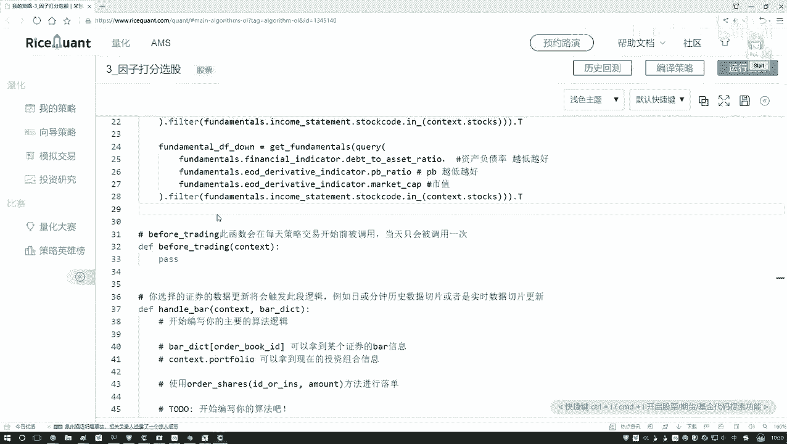

接下咱们就要去遍利啊，我们现在做出来两个data frame。因为一个是越高的，一个是越低的，所以说咱们得分别去呃遍利这个date frame。然后呢对其中的因子做排名做打分吧。

来咱来完成这样一个操作啊，首先呢咱来写下吧，就是我做一个遍利，遍利啊，我就要拿到其中的每个因子是吧？好了，在这个因子在我们的dta frame当中，先从这个up来吧，先从越高越好的来，我们要遍利什么？

这个dta frame，它的结构多少，是1个300乘上1个三的吧。哎，我们是遍利数据还是遍于因子啊，是要遍利这些因子吧。所以说现在我要拿到每一个因子名字，在这里的因子名字就是当前啊我拿到这个。😊。

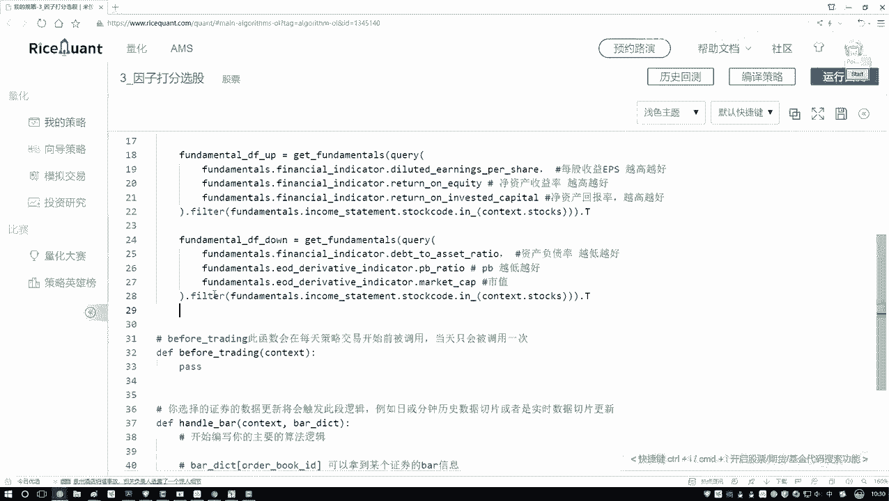

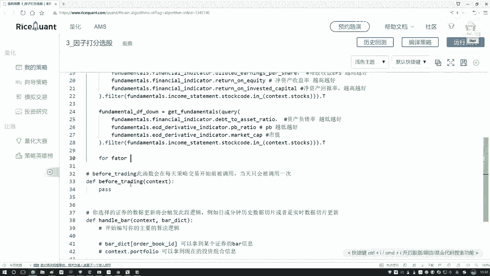

d frame来说，哎，它的一个列名，我把这个列名转换成一个列子的，哎，这样我就可以去遍利其中的每一列了吧。就是每一个因子。然后呢，我拿到啊当前的一个因子数据，我要对当前的结果做一个排序吧。好了。

在当前的de frame当中，我说呀我现在啊要去做一个排序啊，在这里咱们做这个排序。做排序过程当中啊，它是一个st videos。

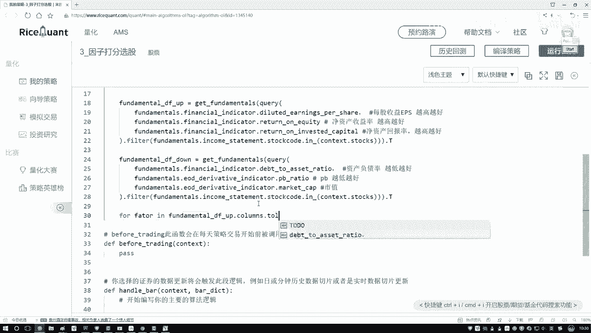

拿进来，那现在好了，这个d frame你要排序啊，你是不是得说你要按照哪个列做这样一个排序啊？那现在我们有三个列，那就是按照当前的我的一个feter做这样一个排序，指定好你的一个参数就行了。

然后排序完之后，这块我就不给它返回值了，直接在这块咱写了一个inplace等于一个t就行。inplace这个意思啊，就是呃如果说你不写这个inplace等于 true，相在没有这个参数。

你只执行这样一个语句，那它就是一个打印的操作，它在原始数据当中啊，就是不会把你的一个排序结果保留下来，除非你做一个负值，哎，你说这个fumental再等于一个fumental，然后做一个赋值才行。

如果说你不想做这个负值，你直接指定成一个inplace等一个 true，哎这也行啊，这是咱们现在做一个排序。

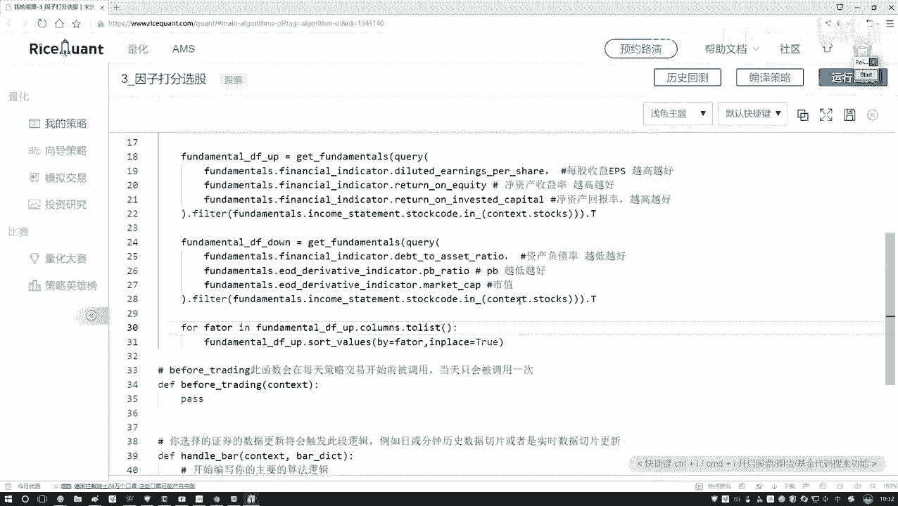

盘序完之后啊，我们还得做一个打分呃，这个打分啊，咱这个简单起见，我就不分组了，直接按照排名顺序啊，就是第一名一分，第二名2，就是第一名300分，第二名299。因为咱一共300股票嘛。

所以说在指定我们当前的一个评分，那就是在我这个分利票手当中。😊，对于我们当前这个因子，对它这个因子，它是什么，那其实也不重要了。我它是我直接把它改成什么，改成它的一个评分值就行了。评分值。哎。

这块这样吧给大家先看一下呃，咱们这个n排这个函数，然后它的个用法，在这里啊就是给大家看一下inport一下这个n排还1个NP。

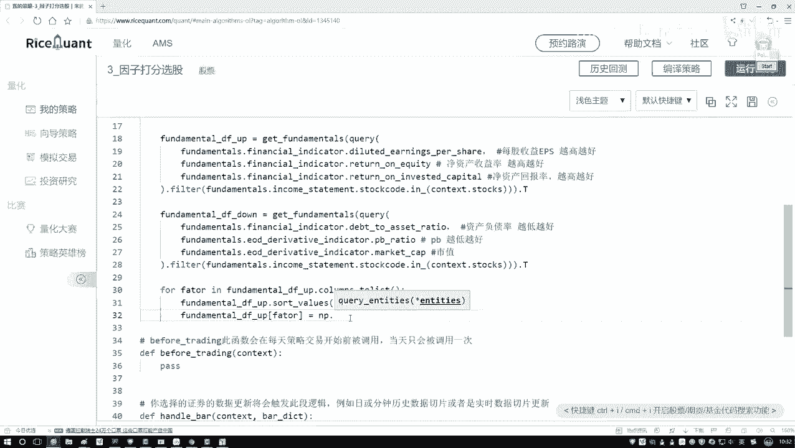

在这里我这接给大家打印一下n当中啊有一个叫let space方法啊，这给大家写一下let space当中啊PElets space当中啊有三个参数哦，我先把这三个参数给大家写出来。

然后呢我们来去看一看啊，就是当前咱得到的一个结果。比如说我传进来1个13300，我们来看一下。

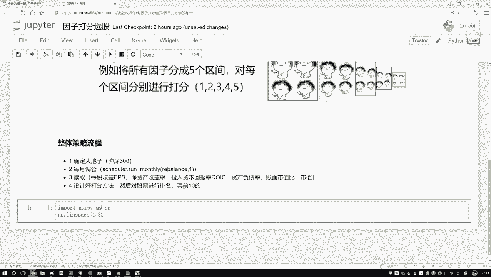

到什么从1到300选了多少个数，哎，就是取值范围是从1到300，然后选了300个数嘛。那所以说得到结果就12346789一直到这个300。那我们一会儿啊干什么？

通过这个nad点 lessspace当中啊，我们去做一个打分啊，就是排序完之后，那我们按照如果说它是一个越大越好的那越大的值，我给它1个300分，如果越小越好的，我越小的值给300分。

那怎么样描述的越大越小呢？还有这个越小越好呢？你把这个顺序稍微换一换，在这里哎这是一个1要300是吧？那好了，下1个300到1。😊。

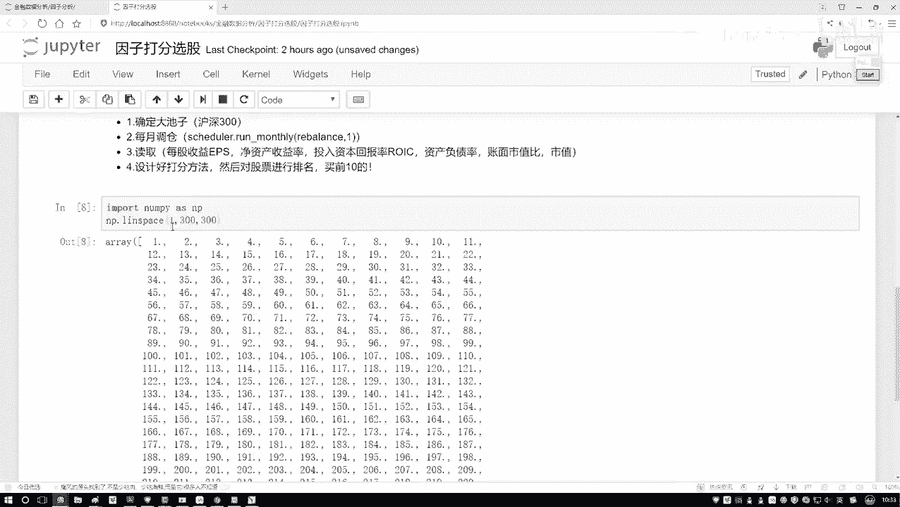

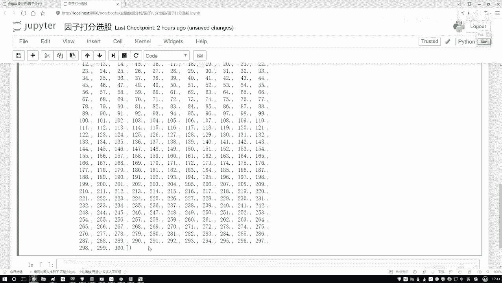

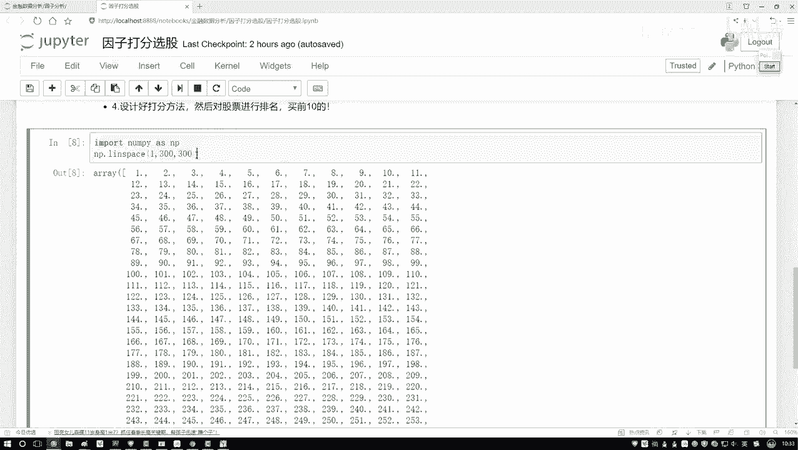

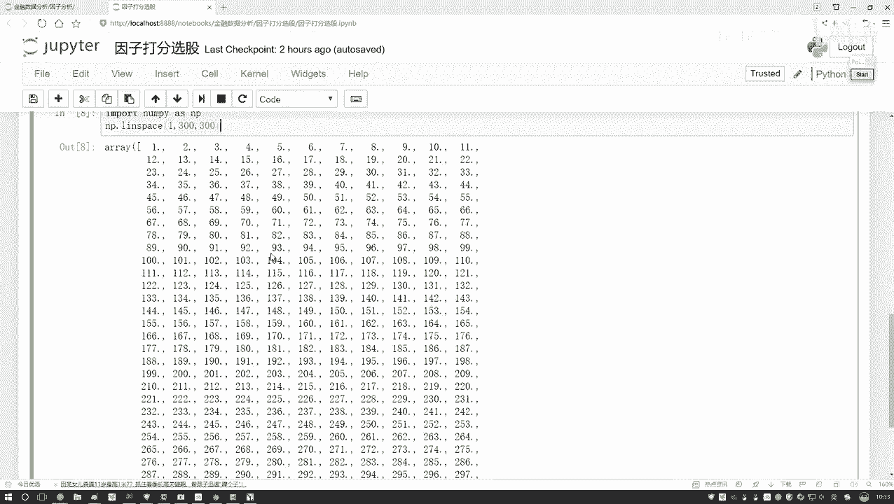

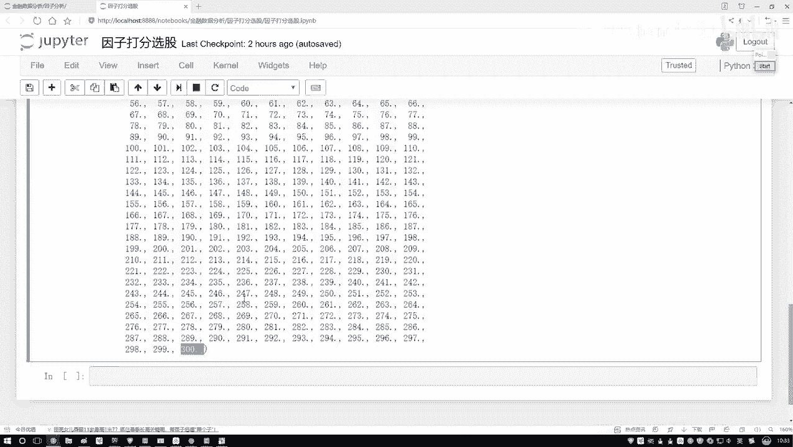

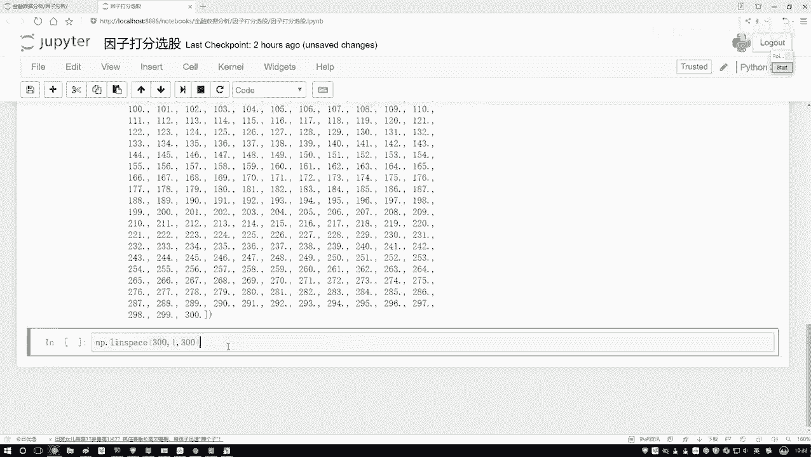

是不是这样我们可以自己去控制。在当前我们的打印的一个结果，哎，是从这个12300的，还是从1个300到1的let space当中，咱直接的就可以去做吧。非常方便，还是啊咱就能帮助我们完成这样一个事儿。

然后行了，回来我们写一下吧，在这里。😊。

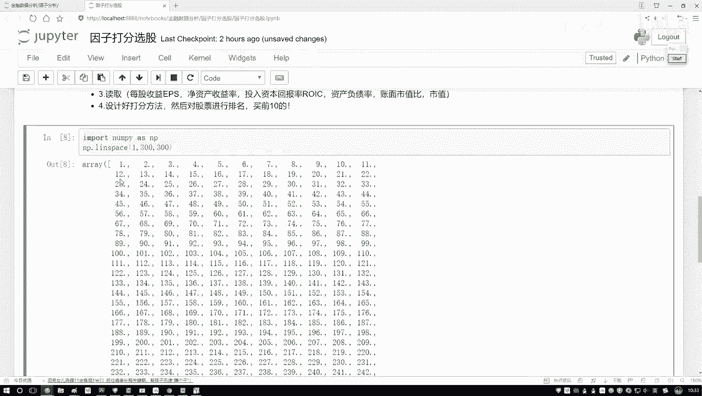

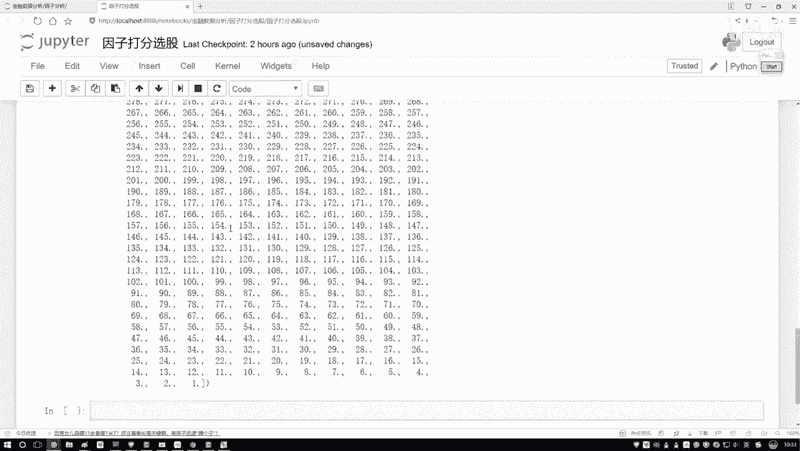

咱们现在要得到这个得分了，那就是n派点啊，那随此当中。

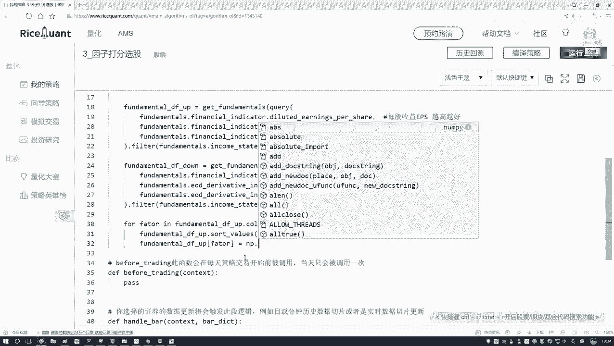

在这个lets当中SPHE。

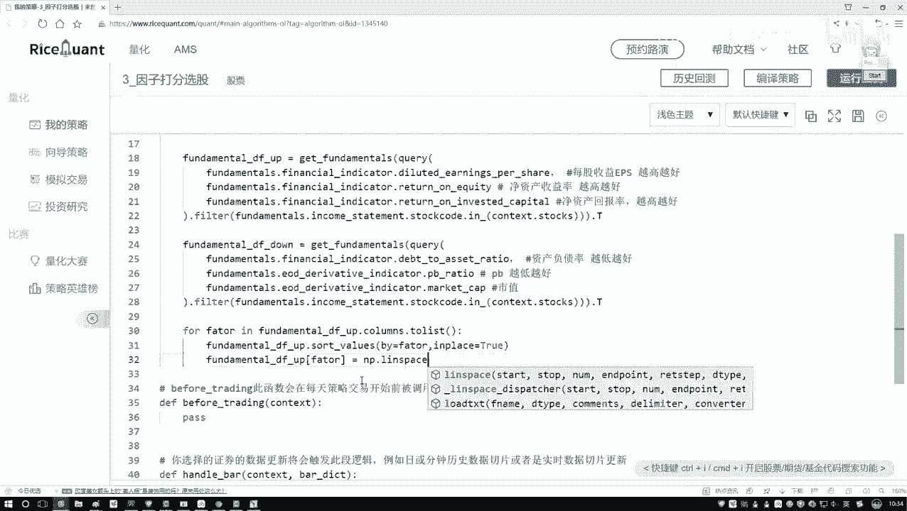

我看之前工具包，唉，之前工具包还没导入，咱这一块我们得自己写一下inport一下这个nad艾一个NP，我再把这个padandas也导进来吧，inport一下我们的一个pandas。

然后艾1个PD啊就行了。这是我们要用到两工具包。在这里咱们先是nad点n当中呃，第一个。😊。

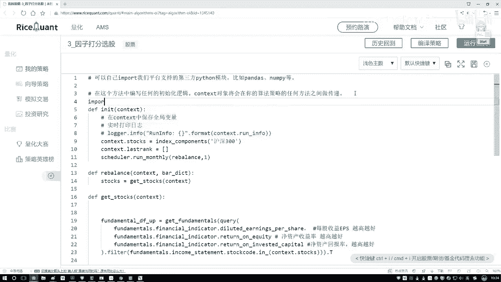

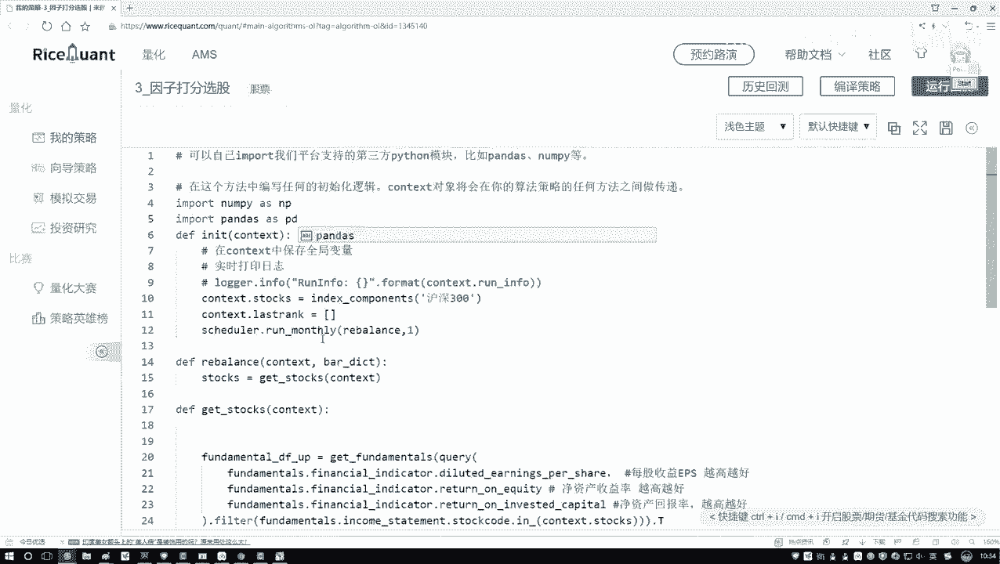

就是一个呃我们现在是希望它是一个我看周长值是越高越好的吧。那也就是从一到上咱们的1个300，然后这一块我不写300了，我就写咱们一共有多少股票。呃，一共就是有这么多个股票，然后其中我们取的是一个。啊。

这个一共有300个数，相当于就是排名，一会我是从小到大个去排啊，这是因子最小的因子中间的因子最大的。然后我们这得分就是这样是一，然后中间可能是150。然后这块是个300啊，这是咱们的一个排名。

直接啊做这样的一个n拍点let space，相当于啊我给他设计了一个打分。好了，那咱们现在啊做完了这个打分操作之后。接下来打完分之后，哎，我看一下这里这一块怎么也又写这个300了呢？把这个参数改一改。

咱不用300，用一共的个数，哎，这样是比较靠谱的。行，那现在我们得到了一个越高越好的这一块，我写一下，就是呃对越高越好进行打分。然后呢，接下来我复制一下，咱还有什么，是不是还有一个越低越好啊。

把它也拿过来，还是一个负循环。在这里我说改一改啊，这是越低。😊。

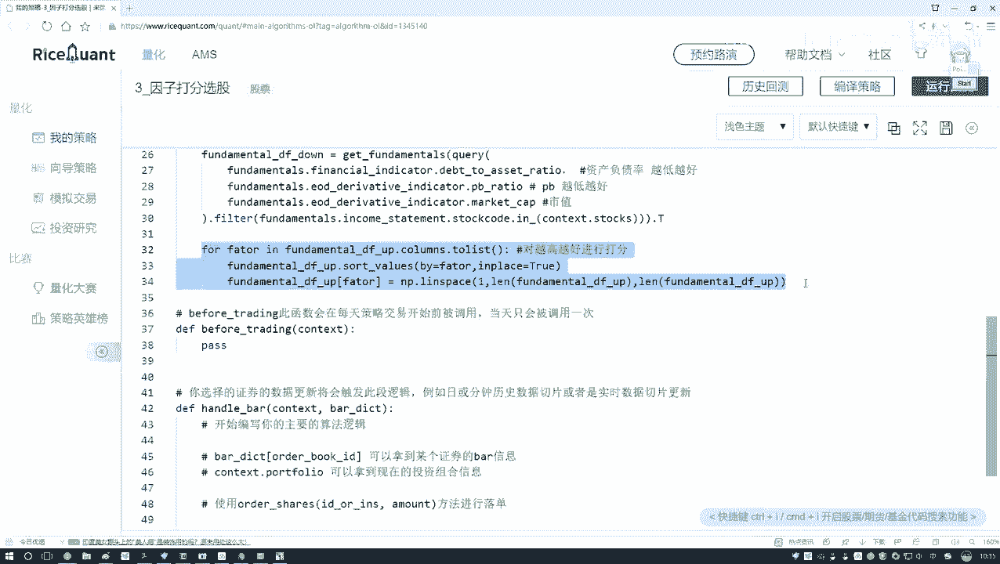

越好做个打分，越低越好的时候，我们把这个d frame稍微改一改。这里咱们要去遍利只down这个dta frame了。然后它的一个算的value啊，这个东西都没有去变的啊，在这块做的参数，哎。

对我们来说都一样的。然后这里我们改一改，之前是从这个要300是吧？那现在既然越低越好了。那越低的，那肯定有多少越低的应该是一个300，然后把这个参数去掉，然后把这个E放到这个中间。

相当于从这个300到1，咱要这么去打分，哎，这就完事了吧。这里啊我们写了两个顺序，就是要是越低越好，还是一个越越高越好，哎，咱们把这两个得分分别算出来了。那现在相当于我们还是一个呃一个表300乘3的。

然后两个表嘛都是300乘3的。那接下来啊一会儿我要去做这个汇总总分，所以说呢我们得把这两个表怎么样，先合并一下吧，然后去算我的一个总分属完事了，来咱来去合并啊，然后算总分。😊。

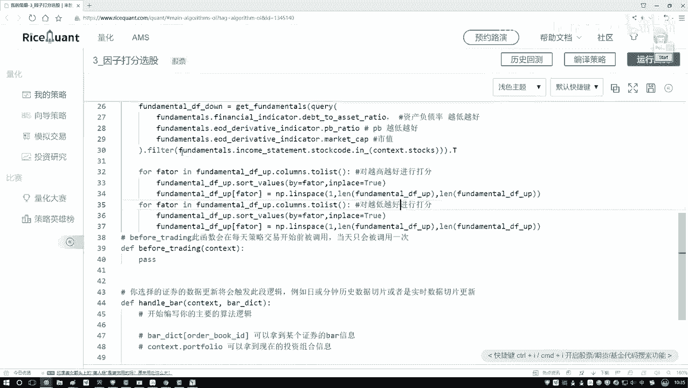

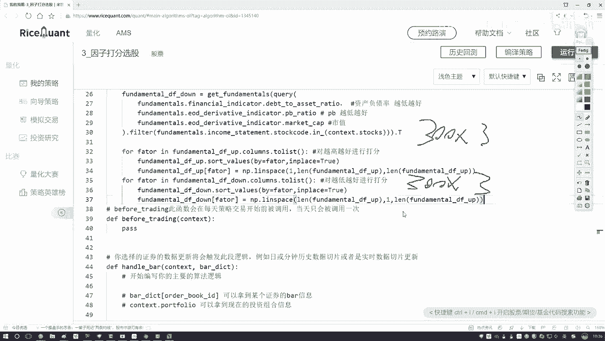

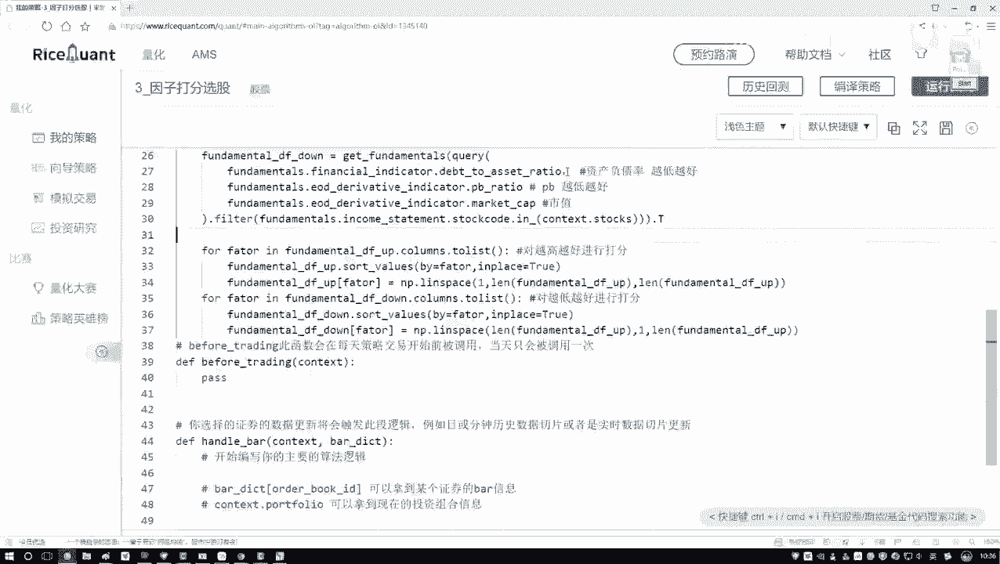