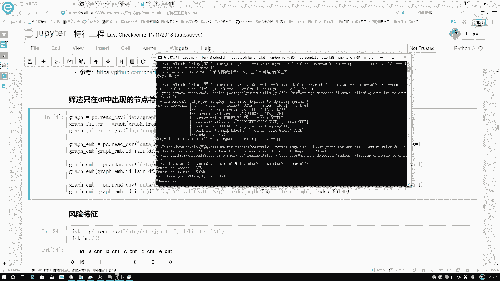
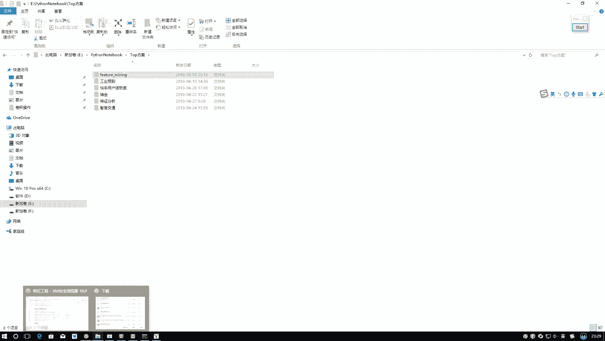
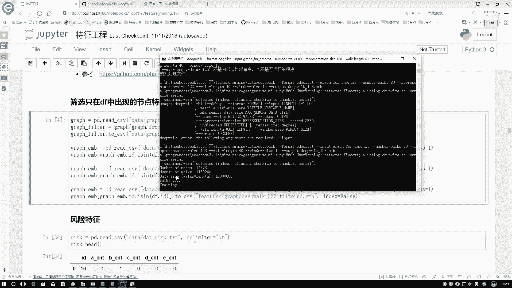
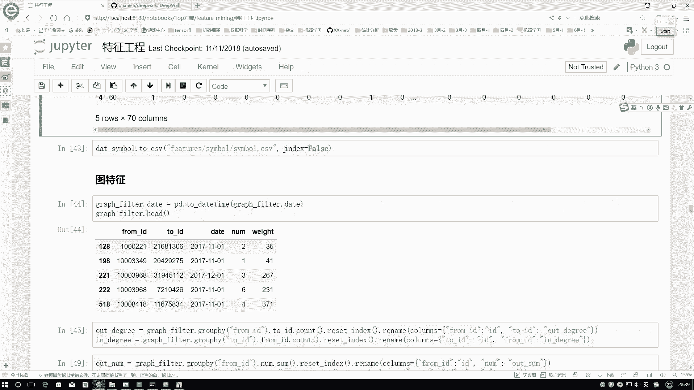

# 完全可自学！人工智能金融领域知识图谱+Python金融分析与量化交易实战全套课程！入门真的超级简单！——机器学习／深度学习／NLP自然语言处理 - P14：5-各项统计特征 - AI算法-漆漆 - BV1Wgz3YVEx1

到时候指定完之后给大家来看一下吧。

咱会得到这样一个数据嗯，E盘当中，然后找到top方案，然后我们的一个feature manning，然后data当中，data当中我看一下叫什么来着，data里边叫做一个嗯点embedding来找一下。

之前训练好的呢，看在这里，看一下之前有没有训练好的一个数据，给大家看下什么样子，这一滴也没有，这些都不是，那应该是还在data当中，这是还没有生成的，这个也不是，看原始文件当中啊。

之前有没有存过一些位置哦，存到了features graph当中，Features，graph当中我的图解啊，这里有这里有咱之前训练好的，然后咱们可以来给大家打开来看一下，其实这里就是这样的一个结构。

咱们给它就是做成一个类似，也是一个data frame，然后第一个就是当前的一个id，然后第二个就是当前对于这个id，它的第一个维度，然后第二个维度，第三个维度就是跟上面它这个列名，是一对应起来的。

这里边就得到所有向量，你看最后一个是DP127吧，因为咱是从零开始的，所以这就是一个128维的向量，128维向量当中，我们第一个点表示当前这个顶点，后面呢就表示当前这个顶点啊。

它的一系列向量得到之后的一个结果，这个数据集啊就是我们就这个特征啊，就是我们打开的刚给大家制作的，咱怎么样用这个DEVOE，所有所用方法去构建咱当前每一个顶点啊，它的一个特征。

结果的这个啊就是我们一会要去做的。

在这里啊就不给大家一个去等了，你看这个walk完了，先把所有的VOX走了一遍，然后他会再进行一个训练，这个训练过程相对来说比较漫长。

在这里就不给大家去等了，给大家演示一下，结果咱知道这个东西怎么去做的就可以了，先装一下这个DEVOE，然后我们用它配置环境变量，这里有他们的一个命令，到时候大家直接复制这个命令到我们的命令行。

就一定是就是控，就是构建完环境变量之后再复制它，要不然可能说找不到，deep or这个命令的构建完之后，咱就得到咱当前所有的一个id，在图当中，它对应的一个特征应该是什么，然后这里我们又进行了一个筛选。

相当于最开始咱不是2万8000多个吗，这里啊我们还是只选那么2万8000多个啊，其他的我们就统统给去掉了，这个就是我们构建了一个当前顶点啊，它的一个特征的表示，然后对于特征表示。

我们是构建了几种不同的方案啊，在这里，到时候大家你可以，就是我觉得暂时构建一种就行了，构建多种特征，然后进行一个融合，这也是可以的，在这里给大家演示了一下，再怎么样啊。

对图当中一个顶点做它的一个呃vector，它的一个特征的方法，数据集当中还提供了其他几个报表，我们再给大家来一一展示，看一看其中还有哪些特征，咱们能利用起来，然后呢其中有表叫做一个风险特征。

这个也是经验当中啊给我们提供的，但是这个风险当中啊，他没有去给你进行一个详细的描述啊，只是列出来上一个表而已，比如说啊对于某一个id，然后它的一个A项B项CDE项，然后它就是告诉你有五项风险特征。

它的一个值分别是多少，但是呢脱敏接触当中啊，看着没什么太大的一个意思，咱只能通过这个数值啊，然后计算它的统计特性了，这里我先拿到它风险的这个数表，然后在这个数表当中我们去计算了几个结果。

计算结果当中我们可以计算几个值，第一个就是五项，它的一个风险，它的一个总和，以及呢其中每一项占总体的一个份额，就是这样的一个比例，这些都是比较基本的一些统计特性，由于脱敏特征啊。

咱这个特征就是风险当中实在没有太多可玩的，所以说啊对于风险呢，咱做的比较简单，直接做了一些他基本的统计特征，然后拿过来用就可以了，然后另外一个是一个类别特征，类别特征啊，是这样。

就是当前对于就是对于这个id吧，然后它有这样一些类别的一个划分，在画面当中啊，其实也是差不多的，在这里一个id对应一个symbol，symbol当中它有两项，其中有的还不止两项，我可以给大家来看一下。

在这里它是这一块，比如说有个count值counter是我自己统计的，它你看这块一个是什么互金公司b to b，然后贷款类，然后其他这东西啊，它正常应该有分隔符的表示，这这个东西它是一个两类的意思。

我们对这里数据当中还做了一个预处理，预处理当中啊，就是它啊，如果说有两种情况，我们把这两种情况分别给它拿出来啊，是这样一个意思，然后呢接下来我们对它再进行一个统计，统计过程当中啊，我们借鉴了一种。

就是文本预处理当中的一个方法，问预处理啊，是这样，比如现在这个词当中，我想统计这个词它的一个特征，比如说在这里吧，我们统计其中某一个词的一个特征的时候，我需要怎么办。

我需要统计一下当前这个词它的一个词频，以及所有词整个语料库里一个大表吧，说白了呀就是一个n gram模型吧，只不过出n gram n值等于一个一啊，是这个意思，在这里啊，我们也是既然这种方法。

首先呢在sk learn当中啊，工具包当中，我们先把咱当前的一个词频模型啊，给它导入进来，接下来去fit transform一下，咱当前里边所有的一个symbol，它就是这个意思，相当于啊。

就是之前我们去做的是不是一些新闻数据当中，我把这样一篇文章拿出来，然后统计一下语料库的长度，它是有多少的，然后对于每个词算一下它在语料库当中啊，每个位置出没出现出现标一。

没出现标零出现两次标二是不是这个意思啊，在这里啊也是做相同的一个操作，还是fit transform一下，非常的，放完之后，我们可以把当前就是统计完，向量结果进行一个展示。

这个就是我们得到当前的一个特征结果，其中呢一共是有44种不同的词啊，这是我们拿到的44种不同的词，接下来就是由于这里边它是有两个的，这你看这个杠前面它是一种类别，看后面又是一种类别吧。

在这里我们分别对前面后面分别可以进，就是一个level two level，一分别可以进行当前的一个解释的，然后呢我们有了两个解释之后，我把当前的两个解释合在一起啊，就可以了。

这个就是我们当前拿到的就是一句话当中诶，然后它出现的一个你可以把它当做是一个呃，把后腿扣脸型，你可以把它当做是一个咱的一个词向量模型，而不是词向量模型，就是一个count vector模型啊。

也是可以的，这个就是我们对啊，当前的一个他的一个类别，做了这样一个统计特征出来啊，非常简单，一个统计特征之前大家就想想跟文本数据当中。

