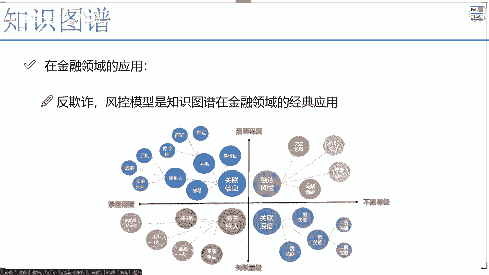
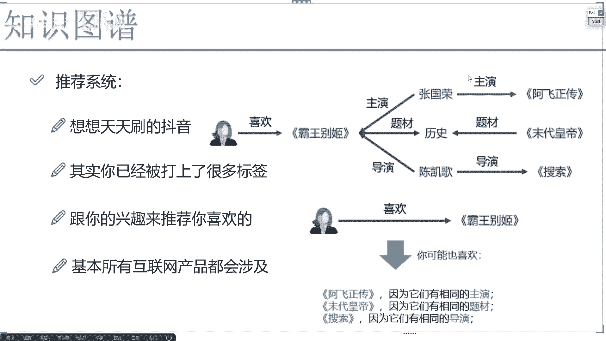
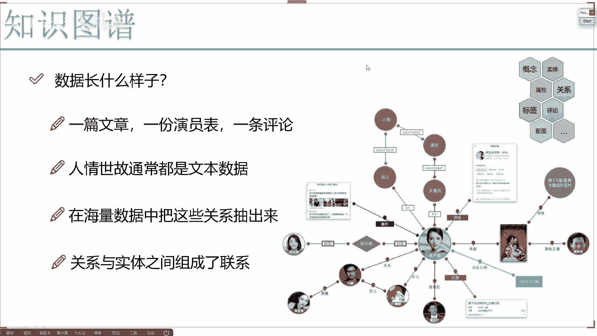

# 完全可自学！人工智能金融领域知识图谱+Python金融分析与量化交易实战全套课程！入门真的超级简单！——机器学习／深度学习／NLP自然语言处理 - P2：2、金融与推荐领域的应用 - AI算法-漆漆 - BV1Wgz3YVEx1

还有一个这个我估计大家大家应该比较熟悉了，就是在这个金融领域当中进入当中啊，哎你说我们什么时候会提到这个知识图谱啊，金融其实就是举个简单例子啊，咱们借钱我不知道大家借没借过，借钱的时候。

因为我虽然没借过钱啊，但是我给一些金融公司啊，做过一些他们实际的项目嘶金融公司啊，大家如果说你们玩过一些借贷app，他们肯定会有一些就是当你下载这个app的时候，当你使用的时候。

人家要访问你手机当中各种各样的数据，比如他们要求要求允许访问你的一个照片，允许访问你的通讯录，允许访问你各种各样的东西，那他在干什么呀，他在找你的个人信息呀，但大家可能觉着哎呀这个个人信息有什么用。

我估计大家现在都能想到一点，就是先把你这个个人信息拿过来，当做一个要挟啊，比如说你现在不还钱了，那我就给你爸你妈打电话啊，可能给你爸你妈都打不好使啊，给你们学校老师打，给你们单位领导打，可不可以。

这样能迫使你还钱，当然这个我觉得是大家想到的啊，就是只是其中的一个层面，另一个层面他能干什么，所有的这些金融公司啊，或者说这个贷款公司吧，他们都要做一个风控模型，还有一个反欺诈，什么叫反欺诈。

大家可以想一想，经常带咱们听到一句话吧，哎在抖音当中，我听到一个其实挺有道理的话，就是很多人都说啊，就是凭自己本事去借的钱，我凭什么要还啊，诶怎么仔细想，好像也是这么事，凭自己本事借来了，人家借我了。

那你说还不还，反正是由我来决定的，但如果说这个公司啊，有人想搞他，有人想给他搞事情，大量的就是一些人啊，说在这个过程当中，我借钱借完钱就失联就跑路，我就不还这个钱，那这公司如果说很多人都这样。

那这公司不就黄了吗，那他咋办，他要做一个风控，什么叫风控呢，给大家举个例子，咱们来说一些最简单的例子啊，在后续我们的课程任务当中啊，咱们会做一些实际的啊，就是拿到这些金融数据，你会看到这些联系人信息。

我们怎么样去构建一些啊稍微复杂一些，实际能用的一些风控模型啊，比如像这里有A这个人，有B这个人有C这个人好了，他们之间是有些联系的，比如说A和B和C之间啊，他们都是互相是朋友吧，啊都互相是朋友。

然后呢现在有这样，C这个人在我这个黑名单库当中出现了，C这个人已经逾期很长时间都没有还钱了，那怎么办，那我说现在啊你这个B我就不用说了，因为B和C有直接关系的，那B我觉得我也不能借他钱。

那A呢是不是说A跟B有关系，B跟C有关系，如果他们的关系比较强烈，A这个人来借钱，我也不能借了吧，是不是这样一件事啊，还有什么，我再给大家去说一说，我当时啊就是拿到这个风控的一些数据当中啊。

不光有大家想象的什么通讯录啊，什么照片啊，还有什么，还有你跟其他app的一些交互情况，比如说你微信的使用时间啊，你下载过哪些个软件，各个软件你使用的时间啊，各个软件你大概做哪些事，这些数据咱全有啊。

那咱们举个例子，比如说你在这个C这个人来说，C这个人下的软件来说啊，有很多呀，什么这个贷那个贷的什么，你我贷什么什么关联贷啊，什么什么什么各种贷款啊，下了100多个贷款软件，那好了。

那我发现这样一个现象，C这个人首先就有黑名单了，他进我黑名单，这个人存在这样一个现象，下载大量的这样的app，那如果说他下载这个app啊，比如说举个例子，C这个人啊下了这个app啊，下这个app。

这个app他是不是都没还，然后B怎么样，B这个人他他也下载这个app，那是不是说明这个app可能很多人下这个app，因为这个app就是他风控做的不好，这app可能就是大家觉得带钱挺容易的。

都是觉得凭自己带的钱凭什么要还啊，所以说带跟这个app有关系的啊，跟这个app但没有关系的，我说我就都不能借他钱了，可不可以啊，这也可以，这里我只给大家先举一个非常简单的例子啊，就在金融领域当中。

所谓金融领域啊，就是人和人之间的一些交易吧，在这些交易当中啊，知识突破就显得尤为重要了，因为咱们来想借一个人，借不借他的钱，不光是由于他自身的一些属性，身高年龄体重收入，这只是一个基本层面上的。

它的基本信息吧，当我去决定要不要借他钱的时候，不光啊只是一个基本层面当中，哎我说对这个基本层面我去判断一下到底是啊，就是做一个分类吧，借还是不借，我还应该根据什么，它很复杂的一个关系网络。

在这个关系网络当中，他做了哪些个行为，有了哪些个事来综合去判断一下到底怎么样。

是不是，所以说在这个支柱当中啊，金融领域也是非常典型的一个应用啊，好啦再给大家说一个最后一个叫推荐系统，推荐系统估计不用给大家太太深，就说了，咱们大家天天啊你们都在使用推荐系统，比如举个例子。

你天大家天天天天刷抖音，是不是，我估计刷抖音已经成谜了，都已经着魔了，刷到抖音过程当中啊，你会发现你越看什么东西，他就给你越推荐什么东西吧，我这个抖音啊，现在就是你刷啊，不是NBA，就是CBA。

再不就是一些跟篮球相关的，因为我就对篮球感兴趣，其他的可能不太感兴趣，我已经把这个抖音当做是我看篮球app，就是我把它当做是一个篮球短视频的app了，那这块是不是说每天你做的事情越多。

他就给你推荐的东西也越多呀，那比如这样，你说你现在啊一个用户诶，他说喜欢这个霸王别姬，那你说当我在推荐的时候，当我给他推荐什么呀，我天天给他推荐霸王别姬嘛，就因为他喜欢这个庞王别姬这个电影。

我天天推荐这个东西，同样的东西他看着100遍，他不烦吗，肯定烦吧，但是我们来想一想，他喜欢霸王别姬，可能什么可能喜欢里边演员可能喜欢这个题材，是不是，所以说啊我通过这个霸王别姬，它是一个实体。

这个实体它有很多关系，比如说啊我能找到他的主演，能找到的T，他的题材能找到他的导演至少什么了，找到了另外的一些实体了吧，好了，基于这个实体，基于张国荣这个实体，我还可以找张国荣诶。

在他的关系网络当中找一找他主演过什么，他不可能只主演过这个霸王别姬，还有比如说一些其他的啊，还有一些历史题材当中，还有一些其他的这个导演，他也可能演过一些其他的，那此时呢我说我在推荐的时候。

我能不能把这三个再给这个用户推荐回去啊，是不是也可以啊，大家现在可能想唉，哟推荐系统真的做的这么简单吗，好像说不是的，真正推荐系统啊，其实做的非常非常复杂呀，而且现在都已经我们更强调什么叫做一个跨域。

什么叫跨域呢，只在这个app当中去玩啊，只在某一个app当中去玩，显得有点low了，现在你但咱们就想你们生活当中，是不是出现这样一件事，有些时候我就觉着就是我拿手机，因为我现在我手机这个照片啊。

我会自动的上传百度网盘，还有一些自动备份的一些功能，我有时候拿手机在街上去拍个照片啊，就有就有一天啊，我我家楼下开了一个热干面，然后我就拍了一下，给我朋友去发了，我就拍了这么照片。

然后它会自动保存到一些网盘当中，然后接下来我在抖音当中，我竟然是搜到了啊，就不是这样搜，竟然他给我推荐了一些，就是关于热干面的一些产品，让我去买呀，我这个东西大家想一想，感觉挺恐怖的呀。

感觉就是你生活当中啊，你每一个足迹，你干的每一件事，好像背后都是要有个天眼似的在监视着你，再把你的数据收集起来，好，用你的数据做分析，哎，要就是用你的数据做完分析之后，再拿你啊去给他们挣钱啊。

相当于你的数据不光是在一个app当中会存在的，我估计所有app可能都是互通的啊，因为只有互通才能让数据，让整个庞大的网大网络做得更大，做得更宽，推荐的面儿才会更庞大一些吧，看似互联网大格局啊。

这些大佬之间是一个竞争的关系，其实他们也是什么，也是互相利用的关系吧，利用什么，利用他们的用户。

是不是好了，这里给大家看了一下，就是啊知识图当中啊。

