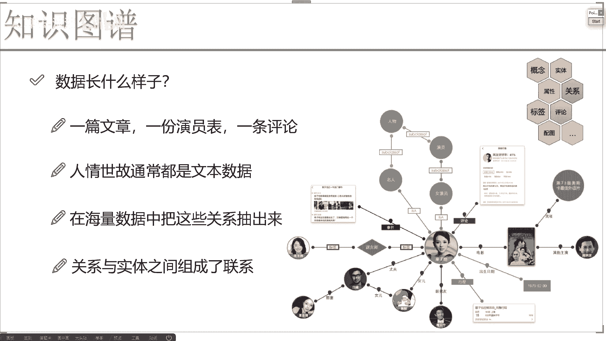
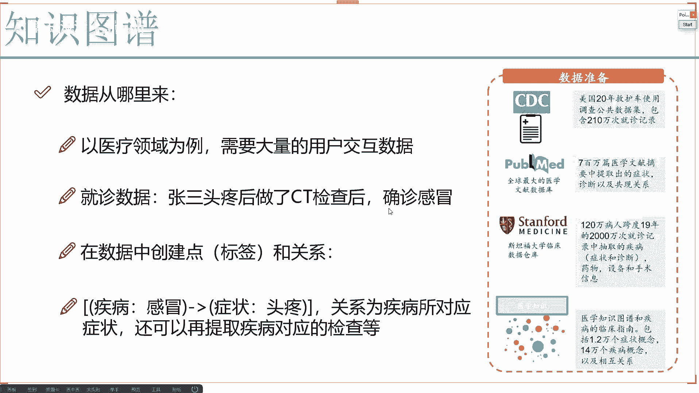
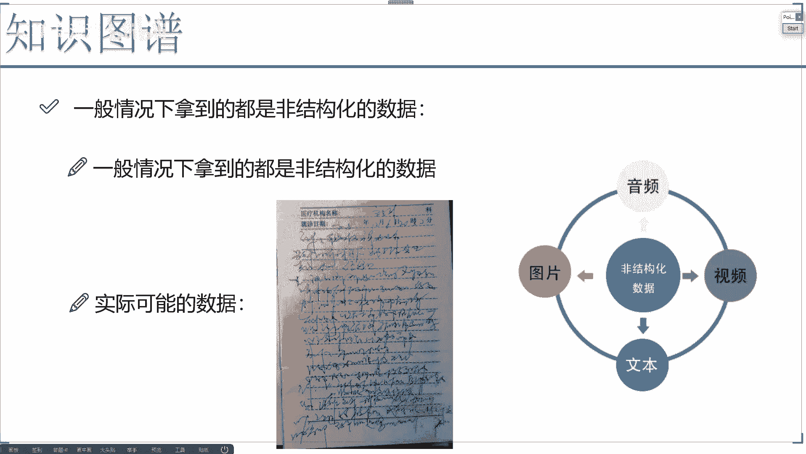
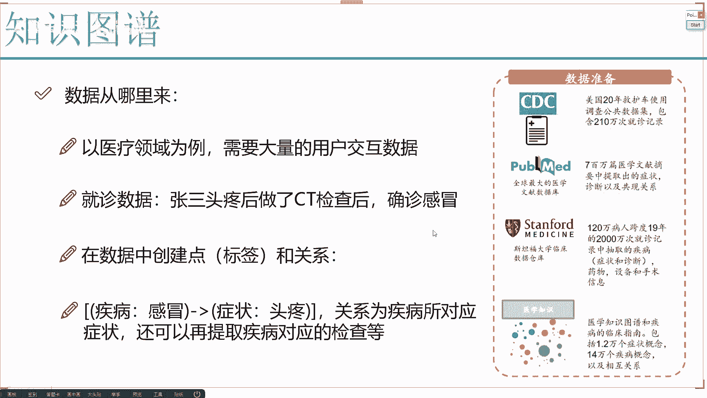
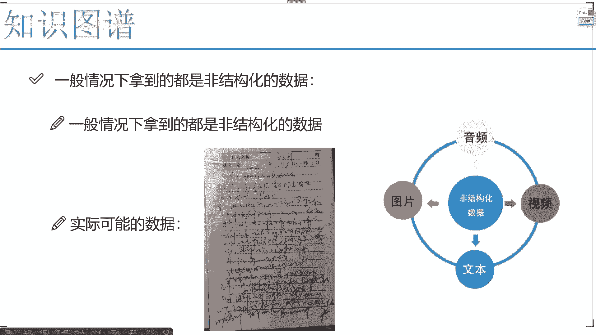

# 完全可自学！人工智能金融领域知识图谱+Python金融分析与量化交易实战全套课程！入门真的超级简单！——机器学习／深度学习／NLP自然语言处理 - P3：3、数据获取分析 - AI算法-漆漆 - BV1Wgz3YVEx1

说完做哪些事之后啊，我们还希望大家想一点，咱们刚才给大家画了好大的一个饼啊，我说这个饼啊能做这么多个东西，但是我们现在要落到实例当中了，怎么来的呀，我们这个知识图谱咱们该怎么去做呀。

什么东西能形成我们这样一个庞大的网络呀，大家可能说哎这不就是用户的一些数据吗，用户的数据通常是什么，我现在写了一篇文章，是不是一个数据，我拍了一个短视频，它是不是一个数据啊。

我拿到我现在我去看网上有些人发了一个言论，我不喜欢他，我给他发表了一条评论，这是不是一个数据啊，都是吧，那为什么咱们经常把这个知识图谱，我说归结到在远处理当中，很多人都说啊，NLP领域当中啊。

比较有名的是知识图谱哎，为什么，但是这个东西我觉得其实不是太准确啊，那为什么咱们一般把知识图谱哎，归到NLP当中呢，因为一般情况下咱们能利用的数据啊，或者说利用最多最多的数据是什么。

就是我们的文本数据吧，所以说啊这块我该说一下，我说咱们现在这个江湖哎是我们人情世故，人情世故呢通常情况下都是我们的文本数据啊，那这些文本数据我们要对它做什么呢，大家可以想一想，我现在发表了啊。

一篇文章在这篇文章中啊当中啊，我可以说哎今天晚上我吃饭了，我吃了什么东西，那你说我拿到这样一篇文章之后，我需要干什么，这篇文当中有，比如说我我和我老婆晚上吃了武汉热干面，是不是有几个实体。

主要是我和我老婆啊，这两个实体是吧，干什么了，是不是吃了吃什么，吃了一个热干面吧，那这样我们的一些关系是不是能做出来啊，所以说啊现在我们还需要做这样一件事儿，在海量数据当中啊。

咱们得想办法把这些关系抽出来，那比如这里你看这一块儿，我们说这个章子怡啊，他演过很多电影，然后呢哎呀还有一些评，关于网友对他的一些评论啊，就是说这个让人怡这人怎么样，只要她有她的女儿，她的丈夫。

她们这个就是朋友之间的关系，唉那你说这个网络怎么来的呀，是说我们这个后台啊，有一个就是有一个产品经理，或者说有一个运营啊，他说他自己来去创建啊，自己创业很简单，先创建了一个实体叫做章子怡。

然后再创建一个实体，比如说叫做这个汪峰吧，然后把他们之间关系给打上吗，啊看起来是能做的，但是大家想一想，咱们整个的互联网当中啊，我们的数据有多庞大呀，非常非常大吧。

你想通过这些外界数据找一个人去做现实吗，肯定不现实吧，我们得想一些办法，自动的把这些个实体以及关系给它抽取出来吧，这些抽取的东西啊，通常情况下咱们都得用到自然语言处理当中，哎各种各样的一些知识点了。

比如给大家举个例子，我说现在啊就是我说了啊，就章子怡今天晚上跟汪峰干了件什么事，那我别的不说，我说首先我肯定得抽出来两个实体，一个是章子怡，一个是汪峰啊，就是人名再有时间，再有地点，再有干什么。

最少是这些东西吧，那这些怎么去做呀，好啦这个也是咱们后面会讲的一种啊，叫做一个命名实体识别，所谓命名实体识别啊，就是说在文本数据当中我要抽取出来啊，我关注的比如说人名地点，时间场景啊。

还有事件是不是可以啊，那这也就是为什么咱们经常会把知识图谱啊，当做是LP当中一部分，因为你要做这个知识图谱，咱们得用到大量的NLP的技术啊。

这些LP的东西，全部是为了我这个图谱来去做服务的呀，那数据咋来呢，数据咋来啊，可以这么说吧，一切都是我们的数据啊，像我刚才以那个医疗为例的，用户的交互数据多不多啊，那你看这块儿。

我说现在啊就是咱们公开数据，就是这些啊，可能有很多数据集啊，并不是一个公开的，但是你说虽然说它不是公开的，在各个地方的或者政府的或者机构的，它的数据库当中有没有啊，肯定有吧，只要有这个数据。

你说我能不能用，比如在这里，咱们现在有各种各样病人就诊的数据，像我刚才给大家拿到的，我刚才拿到的是爬虫啊，咱们基本上排了一些比较简单的啊，就是一些数据，那我们再拿一些实际啊，一些病人的数据去做的时候。

只要有数据了，我说在这个数据当中，我去抽取一些关系，比如这个意思，我说现在啊有一条数据啊，就是张三啊头疼后做了ct检查啊，确诊他是感冒，感觉好像就是一个头疼，还做个ct，最后确诊个感冒。

好像这钱花点冤枉，没关系，咱拿他为例子看一看，就是这么一句话啊，这么一小条文本数据我们能得到哪些事儿，首先第一点我们发现了啊，就是当你做了一些LP技术手段之后啊，这咱们会不会说啊。

我们要去提取他们的关系，据说关系呢我可能发现这样，我说这一块儿有一个感冒，我说这个感冒我给他打，给他打上个标签啊，它是属于疾病的好，所以说首先我第一个节点啊，第一个实体做出来了，第一个实体啊。

它是个感冒，并且呢它属于标签是一个疾病这个类别当中的，接下来呢我又提取一个实体，这个实体啊，它是头疼头疼所对应的标签，它是一个症状是吧，好了它们之间怎么样，是不是有这样一个关系啊。

这个关系也就是疾病所对应的病症状是什么，那有这样一条数据之后，咱们现在是不是能做出来了我们的一条关系啊，那其实这里大家想一想，我们只能做一条关系吗，不一定吧，这个疾病感冒应该适合做什么样的一个检查。

是不是也能有啊，只要你数据当中有的信息，咱可以把它们之间的关系全部给它统一出来吧，也就是说啊，我们一般数据啊都是从文本当中去来的，文本数据拿到手之后啊，咱们要做很多很多事儿，关于文本的预处理。

关于怎么样在其中提取实体，怎么样提取关系啊，其实这个方法有很多，但是我们希望的是不是说能提取的更准确一些，能你这个图造得更漂亮更准确，咱到时候用起来的时候才能会更方便诶。

更好用啊，好了，这是我们的数据啊，大的情况下都是从文本当中去来的，但是文本当中来的数据啊一定是没那么简单的，跟大家想象的可能不太一样啊，就是你认为拿到的数据是这样啊。

张三头疼之后做了ct检查，确诊感冒，要是都是这种数据，那就是所有的做知识图谱的工程师啊，那都乐坏了，这数据太漂亮了太干净了，我天就跟怎么形容呢。

就是1米7大个儿吧，长得特别漂亮啊，这种感觉，但实际当中呢你拿到的数据是那样的吗，可能不是的，实际上就诊啊，一般情况下我拿到我的一些，就是那个记录医生给我写的东西，如果我觉着当时我不问清楚了。

我回家之后，我100%，我不知道他说的是什么东西，那实际当中你看大部分情况下，这种数据你说好认吗，不光来说你不好认啊，咱们作为人类都不好认，让这个计算机它能好认吗，也够呛吧，所以说啊咱们遇到最大的问题。

就是我们拿到的数据啊，一般情况下可能都不是结构化的数据，所以结构化数据什么叫结构化数据，就是像我这里给大家准备好的，准备好的一个疾病啊，所对应的很多字段适合吃什么呀，适合做哪些检查呀。

哎这就你就当做结构化数据就行了，这就把字一个个字段给你做好了，就相当于把现成的东西，就是呃一会儿你要做一个考试，我把这个考试步骤都告诉你了啊，你就照着这么写就行了，这是非常漂亮的一份数据。

也就是我们所谓的一个结构化数据，每个字段都给列出来了，但是现在呢我们拿到的数据，一般情况下什么不是结构化的数据啊，可能是一个图片，可能是一个视频，也可能是个文本，也可能是个音频，在这里边大家想一想。

这些个东西你在用的时候容易吗，怎么样从图片当中提取出来，我想的东西，比如说我说我之前在楼下照相，我照了一个武汉热干面，它是一个图片啊，图片当中它是不是有一些就是OCR。

所以OCR就是定位到图片当中有哪些个文字啊，这样计算机才知道这图片它是要去干什么，有了武汉热干面这几个字儿，是不是音频当中呢，说了一些话，我给我给我问，我问这个呀，这个可能就是我举例子啊。

我问这个医生哎，我说我还能我还我还有我还有多长时间啊，医生可能告诉我就这两天完事了啊，这不是音频，数据音频，我们得想办法把它里边的东西提出来吧，啊其实一般我们会把这个音频先转文本。

然后再从文本当中去提吧，那视频是不是也一样，视频其实做起来很难，我们一般也是先把视频截成一帧一帧的图像，再由图像啊，从图像当中提现数据吧，那这些所有东西啊，大家一综合来看有什么样的感觉。

我们说这个知识图谱啊，你说你还能把它归结到自然处理当中吗，好像来说就不是了吧，像我最开始说的，我说咱们这个知识图谱啊，它应该是一个非常综合的，并且呢还有很多学科交叉的内容啊。

因为这里涉及到大量的业务的工作呀，怎么样去处理图片，怎么处理文本，怎么处理音频，这些个都是我们创建一个图模型当中，非常重要的一部分吧，所以说啊知识图谱是非常庞大，非常综合的领域，在这个领域当中。

AI的一切技术我觉得都可以融入进去啊，后续咱们会说哎咱们可以，咱们怎么去处理图片啊，怎么处理音频，怎么处理视频和文本啊，咱们都怎么去做，但是可能呢我们重点还是要落到这个文本当中。

因为文本数据啊是比较好做的，也是能做的比较好的，也是现在来说市面上有的比较多的啊。

