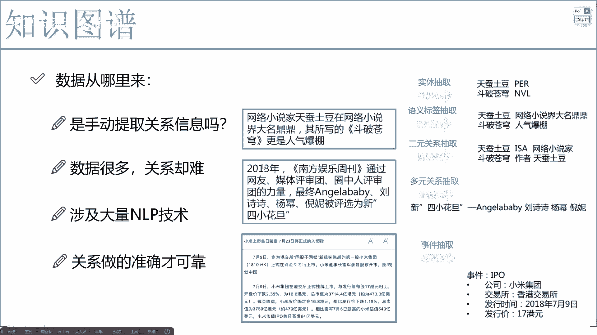
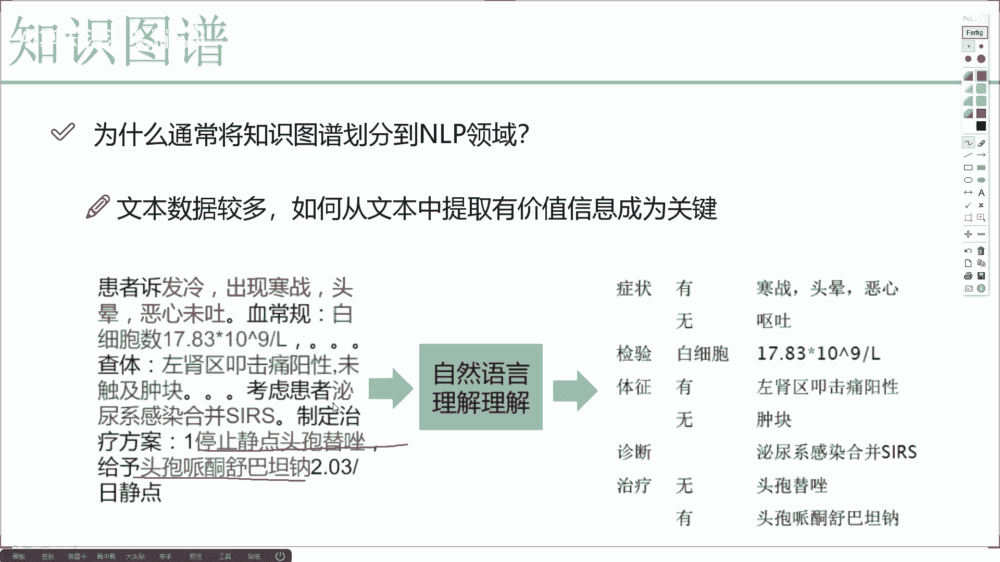
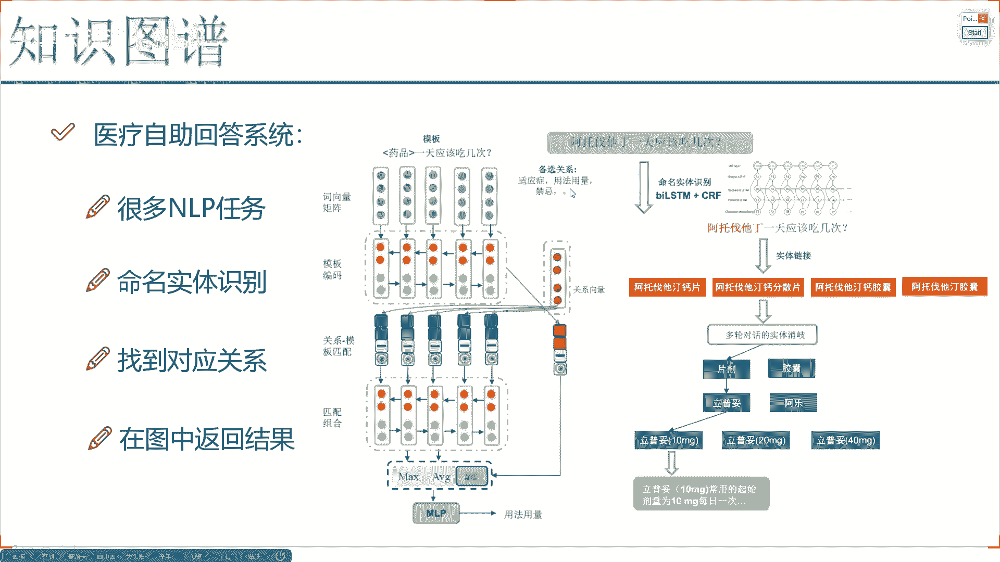
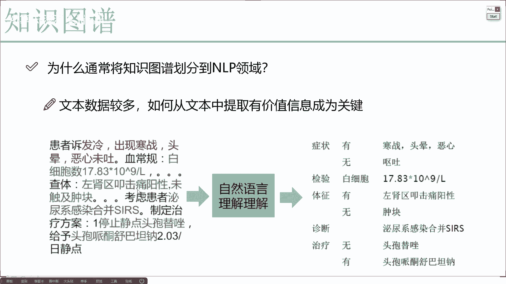

# 完全可自学！人工智能金融领域知识图谱+Python金融分析与量化交易实战全套课程！入门真的超级简单！——机器学习／深度学习／NLP自然语言处理 - P4：1-数据关系抽取分析 - AI算法-漆漆 - BV1Wgz3YVEx1

首先啊咱们来想一个问题，我们的数据啊是从哪儿来的呀，要构建一个这么复杂的模型，那我说我现在肯定我手里有一批数据，这个数据呢可能是结构化的，也可能是非结构化的，但是大部分情况下。

咱们想一想我们拿到的数据啊，不像大家想象似的诶，那么完美，一个字段一个字段的，通常呢我们拿到的是一些文本数据吧，啊，因为很多人也把这个知识图谱归到这个，NLP当中。

那我们现在就拿这个文本数据给大家举个例子，看一看，现在啊如果说哎我有了一篇文本之后，我该怎么样去构造这样一个图谱，那我们来看现在看这样第一句话吧，在对话当中啊，他描述这样一个信息啊。

他说有一个网络小说家啊，不管是谁了，然后在网络上哎，然后他这个名气怎么样，并且他还写了一本小说啊，这小说卖的挺好的，是不是描述了这样一个信息啊，那在当前这个信息当中，我拿到的是一个文本数据。

那我现在要做的可不是这个文本数据啊，我希望把它其中的实体抽取出来，并且呢把它们之间的关系也要抽取出来吧，那我们来看一下在当前这句话当中，那我们来看一看有哪些是实体，首先第一个这个作家啊。

别别管他什么什么土豆啊，反正他是一个实体，这是一个人吧，并且呢还有什么他写的一本小说啊，斗破苍穹这本小说吧，那我们来看现在我是不是可以创建两个实体啊，我用不同颜色吧，红色代表这个作家，蓝色代表他的小说。

它们之间会有这样一个关系，作家创作了当前的这个小说吧，这是他们的关系，那现在我是不是就是能创建两个实体，并且他们的关系我也做好了呀，好了，但是问题来了，现在我们拿到问卷数据之后。

怎么样能把这个作者拿找到，怎么样能把斗破苍穹诶这本书找到，这些就需要我们做一些实体抽取的方法了，在后续啊我们的实验课程当中，我也会给大家去说啊，拿到一个文本之后，我们怎么样去做当前的关系抽取。

这其中啊涉及的呃NLP的技术就比较多了啊，你看这块也写了，由于啊咱们这个数据比较多，并且关系是非常复杂的，这里边需要我们用的LP技术也会比较多的，我先给大家提几个，比如现在我们可以做一些最基本的。

像是分句和分词，然后呢我们还可以做一些词性的标注，哎比如说只有一个词哎呀它是一个名词啊，还是一个形容词之类的，那接下来呢我们可以做句法分析吧，看一看它们之间的关系，哎比如说是一个主谓的关系呢。

还是个动宾的关系呢，比如说作家创作了小说诶，这是标准的一个主谓关系吧，一旦你发现了有这样一个主谓的关系，那是不是能提取在主谓关系当中，我们两个实体以及它们之间的关系啊，好这种方法还有什么鱼的角色的标注。

什么叫角色标注呢，后续我会给大家拿例子来去说啊，大家可以先了解一下角色标注是这样，比如说在一句话当中啊，有一些谓语啊，奥巴马今天在白宫发表了演讲，那在这在这句话当中啊，你说谁是关键词，肯定是个谓语吧。

发表啊是这样一个关键词，奥巴马昨天在白宫发表了演讲啊，发表这个关键词谁发表的呢，奥巴马发表的，奥巴马在这句话当中充当了一个就是呃事件的，就是事件的什么触发者吧，啊就是事件的发动者。

所以说他啊是有一个鱼的角色发表了演说，演说是一个结果，他也会有一种角色，所以说啊在后续我们进行关系抽取过程当中，咱们会涉及到很多NLP的技术，这些个LP的方法都是啊。

为了方便我们在原始数据当中能抽取信息，抽取得更好，其实我们现在可以想一个问题，要构建这样一个图谱啊，需要的是什么，最难的一点其实是业务，当你把业务确定好之后，剩下的是不是。

就是说我们该用什么样的技术来去做这件事啊，接下来呢我会大家来去阐述一些啊，咱们常见的一些技术方法，当然就是啊在咱们今天这个课程当中，大家只需要去了解就可以了，后续啊我们实战项目里边会给大家去说啊。

怎么样，我们具体去做啊，这里边给大家列了一些，就是啊抽取关系的过程当中，哎我们是怎么进行抽取的。

然后呢我们来看这里吧，啊为什么说将知识图谱，通常我们说它是一个在外处理哎，划分到NLP领域当中，拿这个例子大家来看一看，诶你说要做这件事容易还是难呢，首先第一点你看啊，这比如说是一个呃用户。

或者说一个病人，他的一个就诊数据啊，就是医生给他打字，还写了一些他的一个症状，还有解决方案，那我们来看一下患者啊，他说他这个发冷，然后出现怎么怎么样的一些现象，那我们来看这些是什么。

这些是不是一个症状啊，我们需要把症状提取出来吧，然后呢下面哦比如说有做了这个血常规，有做了一些东西，这是不是做了什么检查，这也是我要的一个字段吧，并且呢检查完之后它有一些检查的结果。

这些东西我们是不是都要提取出来啊，那我们现在可以考虑了，怎么样在这个文本当中，把我想要的这些信息全部提取出来，说白了我现在要构建一个模型输入啊，输入是当前就是完整一句话，输出呢就像是我结构化的一个数据。

症状是什么啊，要做什么检查，它的体征诊断该怎么治疗，一旦我把右边这个东西诶，你说我做出来了，咱们是不是就有知识图谱啦，当前的这个症状对应该做什么检查，并且该进行怎么样的治疗啊，对应什么诊断。

对应着吃什么药物做治疗，这是不是咱们就全匹配上了一个图文形当中，这些实体以及它们之间的关系，我们是不是就都有了，但是难点来了，这件事我们怎么去做呀，好啦，咱们先来看啊，这里边有些关键词。

并且呢你看这些词不仅仅像是时间地点啊，一些场景那么简单的专有名词吧，有一些是药物的，有一些是症状的。

这其中啊就涉及到一个非常关键词啊，叫做命名实体识别。

所谓命名实体识别啊，它是这样一件事，在这句话当中啊，哎我想找一找我关注的信息是什么，但是现在来说啊，市面上常见的一些命令实体识别都是去识别啊，他是个人名，他是个地点，是个组织机构，是个什么事件。

但是现在呢我们来看，当我们拿到这份数据之后，我们关注的可能不是人名地点事件，而是什么药物症状检查，是不是，所以说啊现在我们拿到这份数据之后，你说我们要不要重新的去训练模型，让他去做进行命名，实体识别呢。

好识别出来，每一个词属于哎什么样的一个标签啊，比如说这个灯它是这个意思啊，比如说现在有个发冷，它会对发冷这个词啊做一个就是往简单的说啊，它是做一个分类任务，看一看它是属于症状还是属于检查，还是属于体征。

还是属于诊断还是属于治疗啊，这样一件事，对每一个词都进行一个识别，看看它属于哪一种标签的，但是这些数据啊，大家可以想象一下，你说训练起来容易吗，不太容易，一个简单的啊，人名时间地点场景事件。

这些个已经做烂大街了，非常容易去做，但是现在呢我们拿到这些医疗数据，特别专业的数据做起来啊，相对就没那么容易了，并且我们在训练数据的前提是什么，数据得有标签啊，你要自己先打好啊，比如说发冷这个词。

我先给它打上个标签，我说它是二啊，表示是个症状，这个也打成二，这样也打成二，你想象一下一句话当中，你要对每一个词都要打标签儿啊，那如果说你的样本还比较多，有10万个样本，打标签，这件事儿。

是不是都是非常麻烦的一个解决的思路啊，但是也没办法，咱这个任务必须我们也得打标签去做吧，所以说啊也就是现在啊，为什么说这个NLP这个技术啊，发展的没有视觉那么好呢，其实我觉得在很大程度上。

都是由于我们数据所导致的，今天这个患者说他发冷，明天那个患者说他有一些冷，虽然说都是同样一件事，但是呢在计算机看来是完全不同的字符吧，所以说这些事啊做起来都会是一些挑战的，后续呢我也会给大家去说啊。

比如说命令实体识别哎。