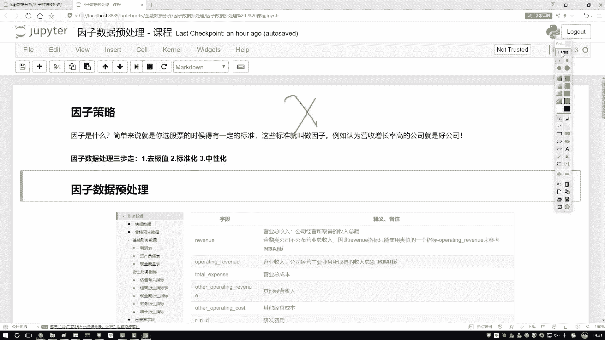
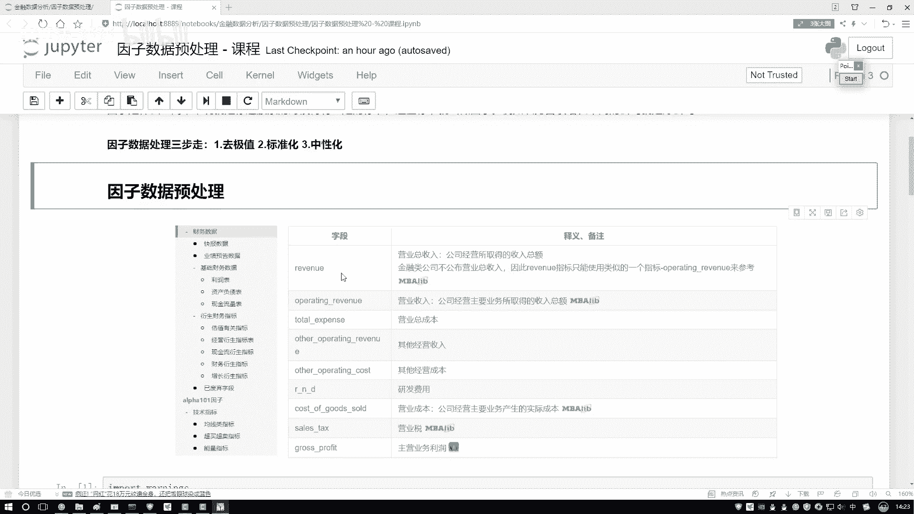
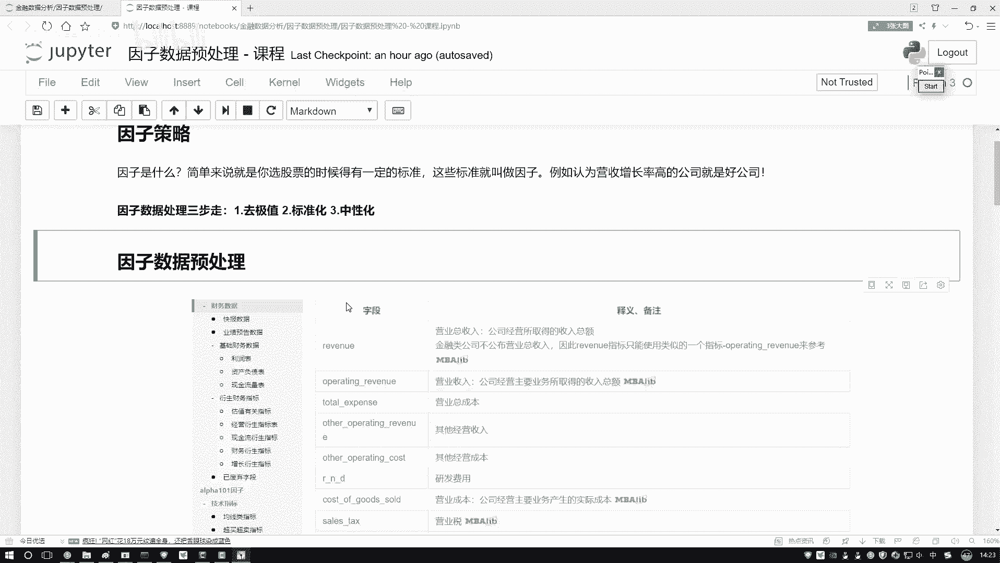
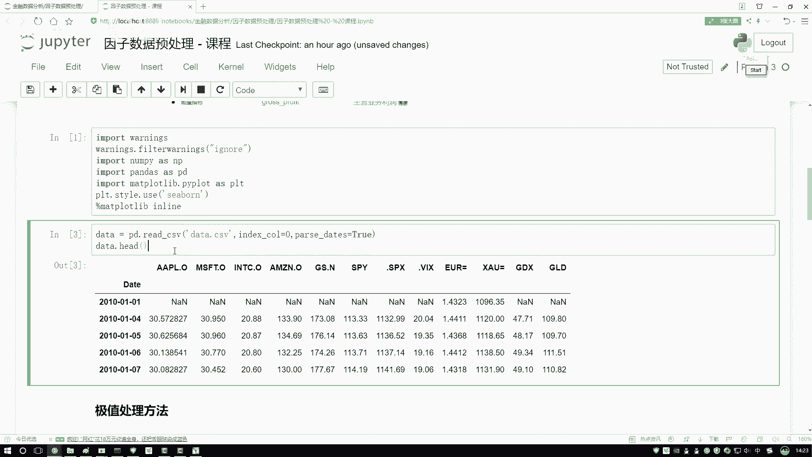
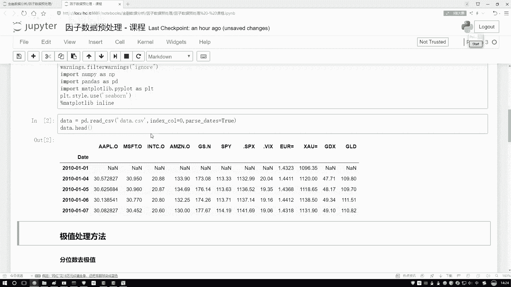
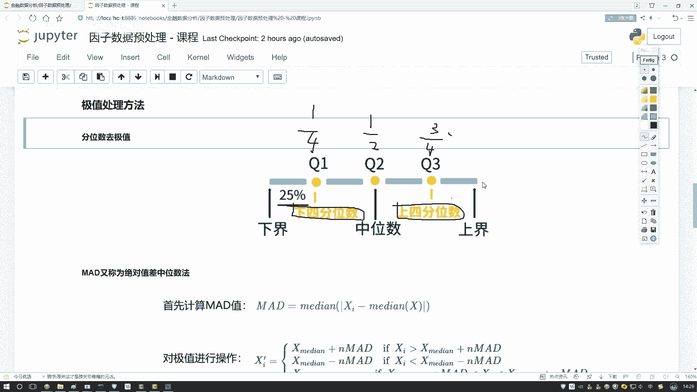

# 完全可自学！人工智能金融领域知识图谱+Python金融分析与量化交易实战全套课程！入门真的超级简单！——机器学习／深度学习／NLP自然语言处理 - P40：01-1-百分位去极值方法 - AI算法-漆漆 - BV1Wgz3YVEx1

这节课啊咱们来说一说啊，该怎么样对因子数据做预处理，操作好了，第一个词来了，因子数据哎，什么叫做一个因子啊，好比这么说吧，哎我说你现在要去买股票了，那在买股票过程当中啊，你肯定不是大海捞针的。

我随便买一个，那你自己心里还是有些想法的，按照我某种想法，按照我某个标准，我说我去选一选，筛一筛符合我标准的，我买下来是不是咱们经常有这样一个操作呀，那好了，刚才我们提到一个词叫做一个标准吧。

这个标准就是我们现在所说的一个因子，比如现在这样，我说啊大家在买股票的时候，可能都知道一个常识啊，就是对于市净率呃，对于这个市净率来说，那低的相对来说买起来比较合适，因为市盈率低的值哎。

它的一个涨幅空间相对来说比较大吧，对我来说我的收益可能也比较高吧，那再比如说呢我说财务当中的信息也可以，哎，比如说我现在这样一些公司当中啊，如果说它的营收增长率比较高，那我认为这个公司那可能是好公司。

那我就买他们的股票，我可能去赚钱吧，其实因子啊理解很简单，对你最终结果有影响的这些个指标啊，就是咱们要来今天讨论的这个因子那行，因此咱们既然说到了，那当我们拿到这个因子数据之后啊。

该怎么样去处理这批数据呢，给我们感觉像这样哎现在有一个要列个大方程，我说最终啊我的一个收益，那可能是一个Y是吧，好了，那我说我现在因子因子来说，那比如说是我的输入吧，我说这因子有挺多，X1X2X3X4。

2。1堆是吧，那我们现在要干什么，好像是做一个数据挖掘问题，看一看每个因子哎，对最终结果有产生什么样的影响，我该怎么样在这些个因子当中去做一个选择吧，好了这节课讲完之后会给大家举个例子。

就是呃怎么在因子因子策略当中啊，选择诶我们合适的股票，使得咱们收益啊能够更高一些啊，那现在我们要做的事是这样诶，先想一想，因此数据我们该怎么样去处理，那比如这样，咱先不说多因子，咱就说单现在一个。

那比如现在你拿到一个因子之后，它是什么，它是一个数据吧，那拿到数据之后诶，咱直接的做一些建模吗，直接的拿数据去用吗，好像不一定吧，我们得对数据做一些预处理操作吧，好了。

今天咱们主要来说一说预处理操作当中。

我们都有哪几个做法，这里呢列出来三个叫做哎第一步，那你看这里我写了一个三步走，第一步啊，咱们就是去极值啊，第二步叫标准化，第三步叫做中性化，如果说啊大家以前对机器学习哎，还有数据挖掘比较熟悉的话。

前两个是不一打二就明白了，哎取极值有一些可能离群点有些异常点，我给它规范一点，标准化呢数据啊在各个维度当中，可能诶它这个数值取值范围是不同的，那比如说哎咱们的一些有些指标，取值范围是0~10的。

有些指标取值范围是零到1万的，那你看它们取值范围是不同，那好像数值对结果有很大的一个差异吧，咱尽可能让不同的数值在相同的一个，浮动范围区间吧，比如说都是一到正一啊，都是0~1啊。

哎这个东西啊就叫做一个标准化，这两个都是数据挖掘当中啊常见的一些概念，然后第三个叫中性化，可能这个词啊大家以前没用过啊，因为一般数据挖掘任务当中啊，还用不到中心化这个东西，但是呢在我们的因子策略当中啊。

咱得来说一说了啊，这个中性化他做了一件什么事，接下来咱们就这样哎，按照我们的三步走策略，先说极值怎么处理，再说从标准化，最后来说中性化，哎咱们该怎么样去做啊，这个是我们讲的一个顺序。

然后呢大家如果想看啊，就是有什么样的因子，在那个米框那个平台当中啊，哎它有各种各样的指标吧，那你就去扫一遍吧，所有的指标当中那字段多了去了，可能每一个字段都会对我结果产生影响吧。

好了今天一会啊，咱们来分析那个市净率啊，拿市盈率来举例子，因为这个相对来说会更直观一些，大家可能对它啊会更了解一些哦。

第一步啊咱们跟之前一样，还是啊先导进来，我们所需要的这些工具包。

工具包都没变，然后这里呢给大家先举例子，一会儿啊。

咱们再去那个平台上让我们自己写个策略，我现在这里啊，把咱们的一些处理方法，以及咱们的一些知识点讲完了，咱们再去写策略啊。

在这个notebook当中，我们先说知识点，一会儿咱们再来玩个策略啊，好了，读数据。

这个数据大家很熟悉了，都已经不用解释了，一会咱就拿这个苹果股价啊当做一个举例子了，大家可能说这个苹果股价它也不是一个因子啊，你拿它举例子可以吗，因为这样啊就是呃我现在不是在本地去写的吗。

没有连那个连接平台吧，所以说获取数据啊稍微麻烦一些，一会儿咱在pi当中啊，咱们去获取实际你要做的，比如说一些市净率啊，市值啊，哎这些指标在这里啊，咱们就随便拿一个数值给大家举个例子，主要讲一讲啊。

这咱们的这些操作啊该怎么去做一会呢，咱们拿实际因子啊去做好了，第一步就是极值的一个处理，极值处理方法其实有蛮多的，那我问大家最常见的一件事，那你说现在啊一个数据当中，比如这是一个数据吧。

那绝大多数的数据点，可能都浮动在中间范围当中了，是不是没有少部分怎么样，你看有个黑点在这里在这里在这里在这里哎，有两个极值吧，啊左边和右边，那你说对这个极值怎么办呢，大家可能第一个想法可能离群点啊。

那我就不要了吧，啊这些数据我就全扔了啊，好是一种想法，或者说咱们扔了说点可惜啊，我们能不能给他劝一劝，让他迷途知返一点啊，我说这个哥们儿在这儿，我说你劝一劝，我告诉你，我说你越界了，然后呢。

那哥们问我说你借在哪啊，我给他画了一下，我说我借在这，那比如这个值它是一个十吧，然后我的界限是一个五，那我说行，咱界限是五，我把他拉回来，当前这个数值它越界了，我不给它丢掉，我把它的数值改成什么。

改成我的一个下界，还有上界当中自己指定啊，可以自己指定一个上界和下界，把这个十改成五，它是不是就没越界了，相当于啊我们要做这样一件事啊，不是直接去删除了，而是把它大于我界限的给它拉回来。

让它成为我的临界点的一个数值啊，这就行了，这个是咱们的一个做法啊，不是给它丢了，那怎么去做呢。

给大家说几种啊，先来说第一个叫分位数，分位数这个东西啊，其实挺直接的啊，先说一下吧，哎分位数如果大家不太了解，那中位数总了解吧，哎大家可能说那你说中位数为什么不说均值啊，因为均值这个东西怎么样。

均值这个东西不好用啊，尤其是在我们的数据挖掘任务当中，哎你说当你去填充一些缺失值的时候，经常用什么中位数吧，而不用均值吧，有什么问题啊，咱们我前几天看那个好长时间，好几个月前我看那个腾讯。

然后他们那个微博说，腾讯员工的一个月工资达到了7万多哦，大家想，这工资怎么可能达到月工资达到7万多呀，后来啊大家一看是把这些高管的工资，把这些人上层的，人家股东的工资可能都算进去了啊。

一算的平均可能是7万多，但是你说这个平均它有代表性吗，好像没有什么代表性吧，因为里边它的一个分布可能有一些头重脚轻，哎这样有感觉是吧，行了，这是一个均值，然后呢说完均值之后，咱来说中位数。

那你说中位数怎么样，哎中间那个人怎么样，我用中间这个去看一看，整体感觉是不是更靠谱一些啊，所以说啊咱们来看一下啊，我们的一个分位数，分位数就是这样啊，这里你可以把整个的数据吧分成几个位置。

你看这里中位数咱刚说过了，中位数挺好解释的吧，就是中间那个位置它的一个值七个人来说啊，七个人中间位置是谁啊，这是123，这是456，中间谁啊，这是不是中间这块是567，中间是谁啊，中间就是四吧。

那如果说这块八个数呢，八个数中间是四和五，那你可以四和5+1起除以个二，是不是就行了啊，这个就是我们的一个中位数，然后呢你看这里啊，我们不光列了一个中位数，还列什么四分位，两个四分位吧。

相当于Q1和Q3，你就当做这块是1/4的啊，这块是一半的1/2的，这一块是一个3/4的，是不是就可以啦，这个啊就是咱们现在列了一下，我们的一个分数当中有三个指标诶，Q1Q2Q三。

它们都表示啊在我整个数据当中啊。

