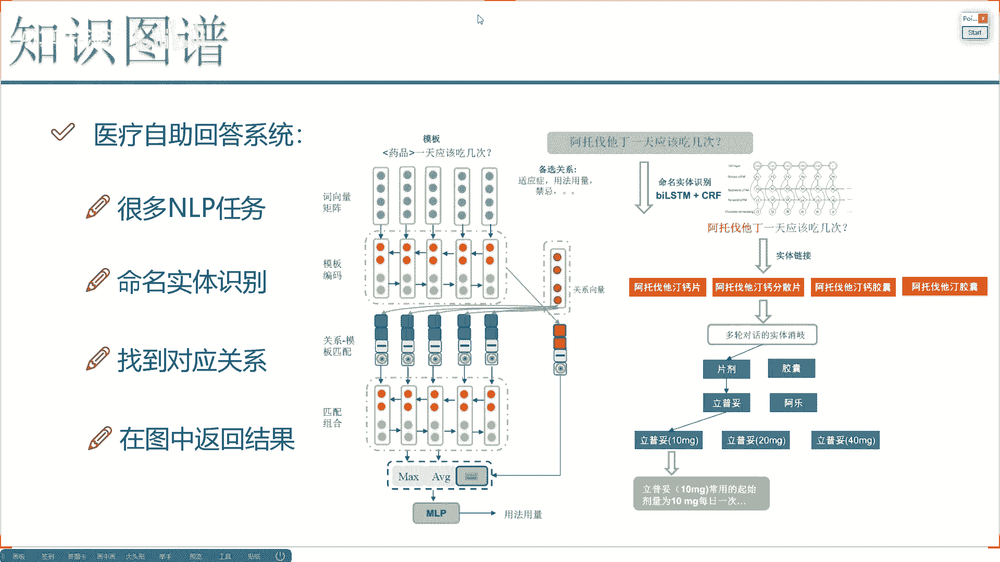
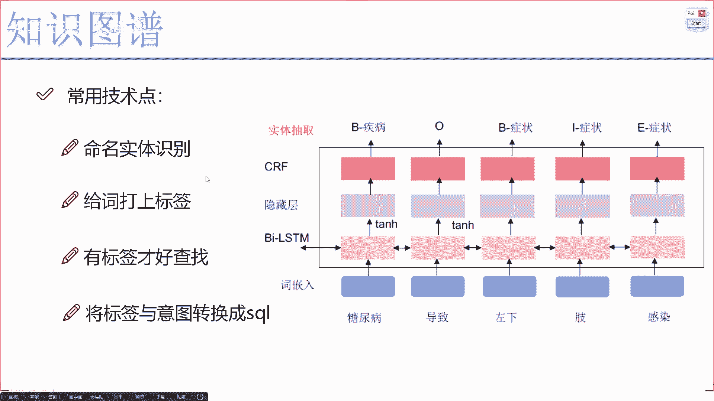
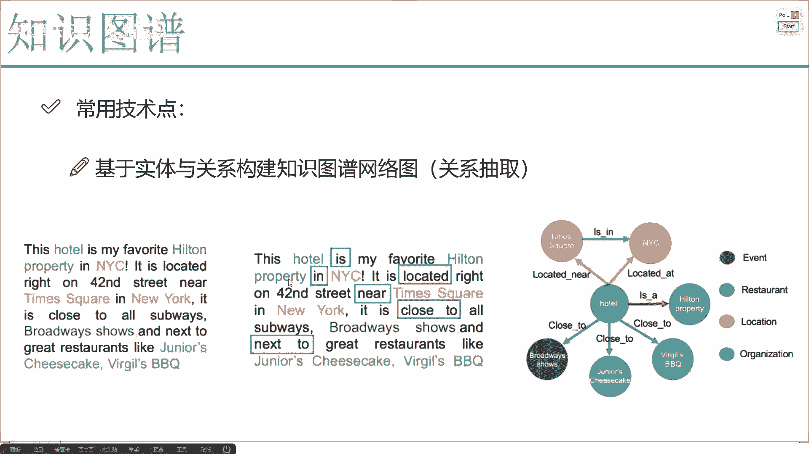
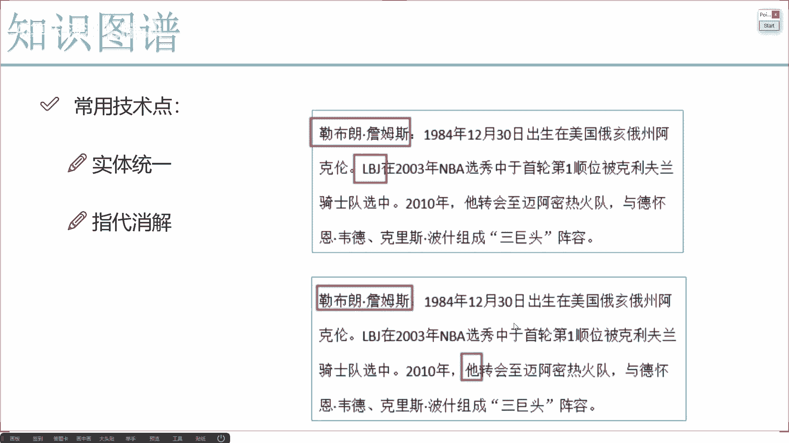
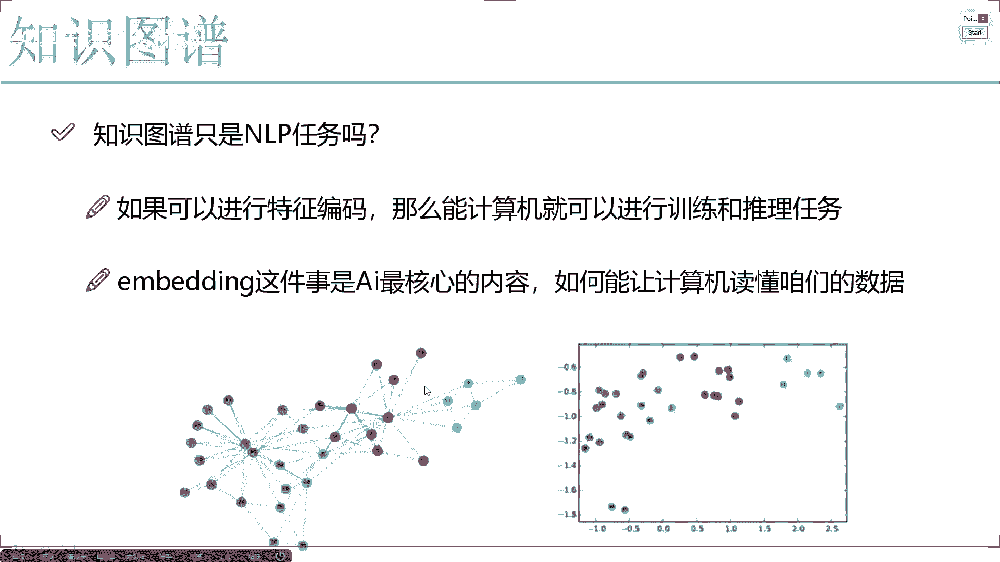
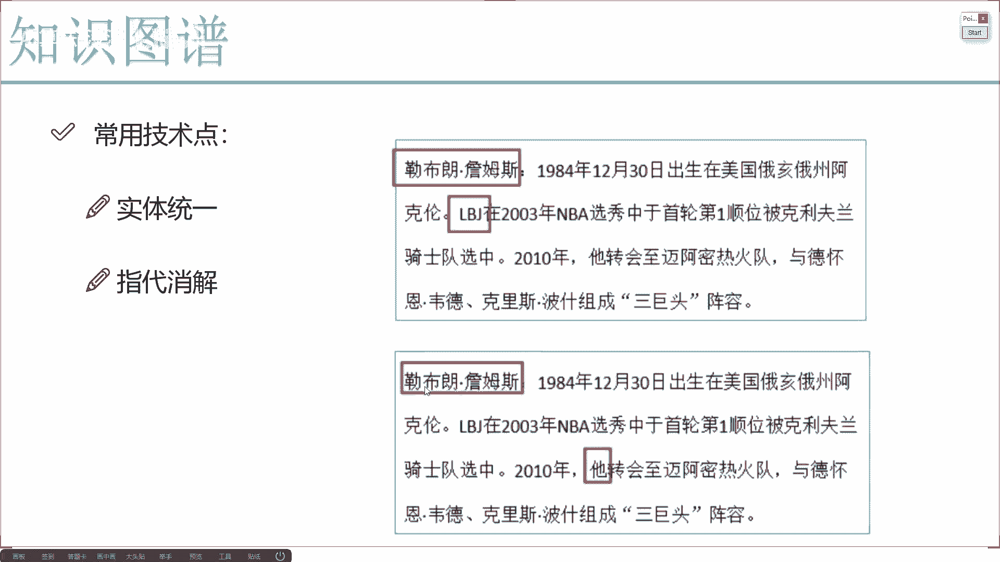

# 完全可自学！人工智能金融领域知识图谱+Python金融分析与量化交易实战全套课程！入门真的超级简单！——机器学习／深度学习／NLP自然语言处理 - P5：2-常用NLP技术点分析 - AI算法-漆漆 - BV1Wgz3YVEx1

那好了，最开始的时候我也给大家说了，哎在这个医药当中啊，我们可以做一个自助回答系统输入的啊，比如说病人去问啊，今天我这个肺比较难受，我应该做什么样的检查，那你说在当前这个系统当中唉。

我们得需要做哪些事儿啊，是不是说我得先看一看用户啊，他有一个这个这个图啊，大家简单了解一下就行啊，我们先从这个业务场景，我们简单点就行，后续咱们再来看具体怎么去做啊，比如拆他现在有这样一个问题啊。

他说了就是一个药啊，他一天应该吃多少次，那你想象一下，当我要去回答他这个问题的时候，首先我得去识别出来啊，当前这个药是不是啊，这是第一点，通过命名实体识别，哎我也知道当前这个药啊，它是什么。

像这个啊LTM加CRF田园随机场，加上一个啊双向的递归神经网络，这个后续我们会给大家去说啊，咱们怎么去做，那现在呢我是不是说哎通过命令实际识别，咱能找到当前这个药哎是什么。

并且呢我们来看当前这个药来说呀，我还要做分析了，当前这个药里边我要通过一些规则来匹配啊，它是一个片剂的还是胶囊的，还是一些其他的好，给它返回一个对应的结果吧，所谓返回对应结果就找什么。

这不就是一个实体吗，在我的关系的网络，在我的知识图谱当中去找当前这个节点，它所对应的一个节点啊，比如说他们有个关系叫做用法啊，可以吧，通过这个circle我查一下啊，找到这个用法。

这个关系我就能得到哎它具体的一个使用方法，然后呢给用户返回来这样一个使用方法，是不是就可以了好了，这一块我只是给大家先简单看了一下，咱们的一个回答系统当中啊，其实啊你要想去做一个简单的，其实挺容易的。

只需要去根据一个规则做匹配就行了，但如果说你想把这件事哎，你说做的比较好啊，做的比较完善的一个系统，那这里边你需要考虑的东西就特别特别多了，而且大部分情况下都会应用到我们各种各样的，NLP任务啊。

这些个LP的方法，但是现在好在啊，就是后续给大家去说LP当中啊，好在什么，好在有很多的方法都不用你自己去实现了，哎比如说一个句法分析，比如说一个角色标注，词性标注。

这些东西还需要我们自己训练模型来去做吗，这可不用了吧，有太多的一些就是开源的工具包了，还有一些科研团队，像是比较有名的韩工大啊，韩红大可能做LP做的比较不错，他们有很多开源的LP产品吧。

可以快速的帮我们去做啊，像是明文设计识别啊，语义就是角色标注啊，还有句法分析哎，这些东西啊，其实对我们来说啊，咱们都可以直接用现成的工具包啊来去做，一定程度上是方便我们了，但是有个问题哎。

你说对于一个命名实体识别来说啊，人家工具包可能只是能做到时间地点啊，人名之类的，咱们现在呢应用场景是不一样了，我们要一应用在这个医疗系统当中，要识别这些药啊，是不是跟人界应用场景是不一样的。

我们要不要自己去做啊，显然也需要自己去做的吧，因为不同的业务，不同的场景。

咱们用到的方法也会不同啊，很多还是需要咱们得亲力亲为，哎我们得自己来去做的，你看这一块我就给大家先来介绍一下，也是后续我们会给大家说的啊，一些关键点将是比较关键的，咱们这个NER啊。

所以NER就是一个命名实体识别，我需要知道输入的这一句话当中哎，比如说糖尿病导致啊，左下肢感染好了，那首先我得看一看糖尿病，首先我要把它当做一个实体，当我们去构建一个实体啊，就是在这个呃网络当中。

在我们图模型啊，new fj图模型当中，我要创建一个实体，是不是一般我们在创建实体的时候，我都给它打上一个标签，好知道这个实体啊，他是个人呐，是个车啊，还是个疾病。

那这里咱们来看我通过这个NER就能发现啊，糖尿病属于什么，属于的是一个疾病，是不是，然后呢这个感染属于什么，属于的是一个症状吧，好了，我可以知道当前每一个词所对应的标签是什么，一旦一个词的标签我知道了。

我说我创建实体的过程当中，给它打上这样一个标签，创建好这样一个实体是不是就可以了，所以说啊命令设计识别哎，在咱们整个的知识图谱当中啊，是非常重要的一点，可以帮助我们啊快速的诶去定位好，当前每一个词。

它的标签是什么啊。

就是给我们的输入文本哎，咱们要进行一个打标签操作嘶，还有一个啊就是更难的，这个我为什么说它更难呢，因为对于啊就是我们的一个呃命令设计识别，好像是让网络直接去做就完事了。

但是接下来这个把我们的关系该怎么定义，当你拿到一些实体之后，哎，比如现在我有了一些实体啊，像这里边啊，你看我列出来这些实体，这些实体之间啊，它们都有关系，在句话这句话当中我们也看到啊，比如说说了啊。

咱们这个一些城市是坐落啊，就是一些医院或者是一些个场所，是坐落于哪个城市的啊，在哪个街道上，然后它附近有什么东西，当你看啊，就是这里有些关键词是不是有个as，还有in啊。

还有这个坐落于near close to之类的啊，nice to这些词是什么，这些词，它是不是表示的是我们实体之间的一个关系啊，那当我们第一步哎，我说我用命名实体识别抽取出来了啊。

比如当前的有什么这个铝点啊，这个旅店，然后还有一些这么一些商场之类的，还有一些就是啊事件一些组织机构，当我把这些实体抽取完之后，我是不是还要看一看它们之间的关系是什么呀，因为在我们整个图模型当中。

很重要的一点就是，不光啊我们要创建出来这个实体，还要把这个实体连在一起，你就像是右边这个，我们要创建它们之间的一个联系啊，连线是不是由一条边组成的，边上面描述的就是它们的关系到底是什么吧，那好了。

这一点你说好不好做呀，我觉得非常难的一点，你要想把他们关系做好，先把他们关系抽取出来，这里边需要什么，其实这里边我觉着，如果说你从技术角度来去说啊，是需要一些技术。

但是更多的啊实际上是从业务角度去出发的，因为不同的数据，你要构建的网络肯定不一样，你会基于的规则也肯定是不同的，我跟大家简单唠一唠，这里边呢会需要你啊，先基于你的业务场景来设计一些规则。

什么叫规则呢啊主谓关系的我需要去用啊，在角语义角色标注过程当中，我的一个主体和谓语和一个事件之间，这样的关系我要去要，说白了我们要自己建立好这个关系，在我们设计这个关系当中诶。

把我需要的关系全部拿到手啊，也就是说所有的关系我们可以自己来定义规则，通过规则把这些关系来匹配出来，只有有这个关系，你说我们这个图谱咱才能玩起来吧，所以说啊不要把知识图谱想象的太简单。

实际做起来是非常非常难的一件事啊。

因为这里边涉及到的一些LP方法啊，太多太多了，还有什么再给大家举几个例子吧，比如现在啊我说这个罗马詹姆斯啊，就是非常牛的一个NBA球员是吧，那你看我现在啊，我说这个勒布朗詹姆斯哎，表示是这个人。

那我说这个LBJ呢，是不是也是表示上一个人啊，实体之间我们还有一些统一吧，那你看现在我进来又说什么，又说了，他咱们知道这个他是谁，计算机能知道这个他是谁吗，不一定吧，所以说啊当我们实际处理问题的时候。

你会发现我们一开始啊，就是可以先列出一个大框架，在这个大框架我可能一刚开始做哎，我觉得还挺顺利的，你越深入你会发现细节是越来越多的，所以说啊知识图谱啊做出来很容易，很容易就创建实体，创建关系呗。

但是想做好就很难了。

因为这里边的细节是非常非常多的啊，然后呢刚才我给大家去分享了一下。

就是在蜘蛛舞当中啊，我们常会用到的一些方法啊。

