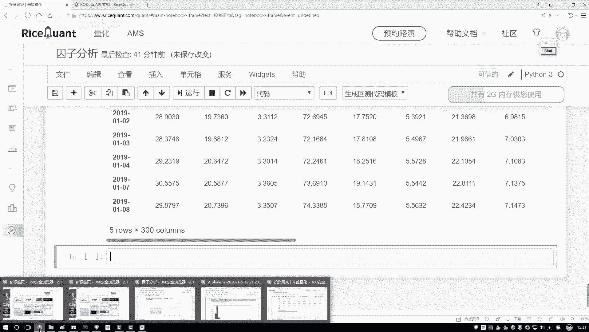
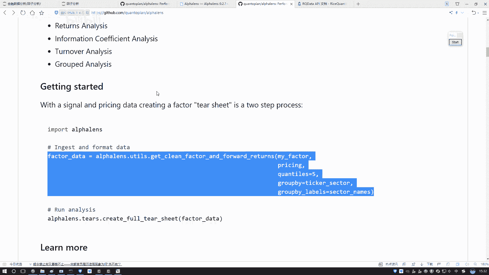
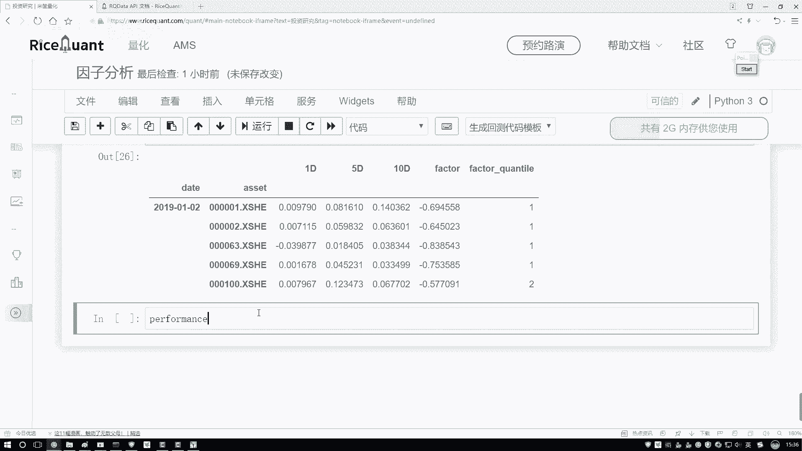
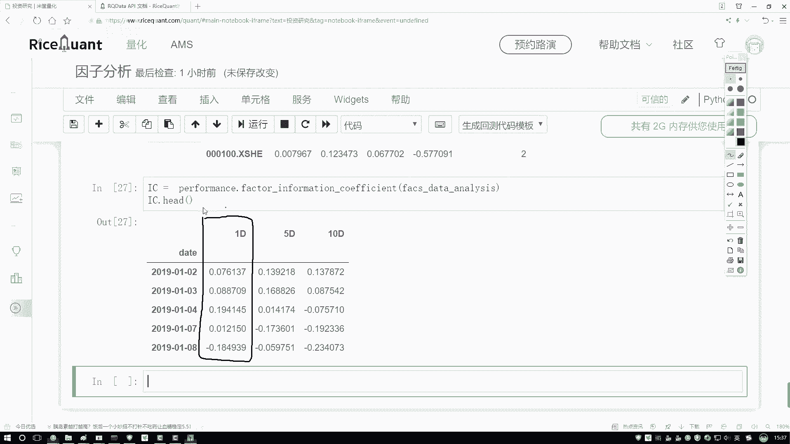

# 完全可自学！人工智能金融领域知识图谱+Python金融分析与量化交易实战全套课程！入门真的超级简单！——机器学习／深度学习／NLP自然语言处理 - P57：06-6-IC指标值计算 - AI算法-漆漆 - BV1Wgz3YVEx1

现在我们要算什么，是不是这个IC值啊，IC值哎跟谁就是谁跟谁去算啊，是不是当前我们的一个指标值，根据它实际的一个收益率来去做计算吧，那我们是不是知道哎呀，当前我们每一天它的一个价格。

或者每一天它的一个实际收盘价格等于多少，然后我们好好算那个收益率吧，好了这里我们再来获取额，获取获取收盘价吧，获取收盘价，获取收盘价，这个就是直接用这个get price函数，get press当中啊。

就是你需要去写啊，你要获得哪些个股票，这里咱们来写吧，呃我获取哪些股票，我的股票池子呢往上找哦，我写哪儿去了，嗯啊这里啊咱们这个股票池子是吧，好了，把咱们的股票池子写进来，然后以及我们的还有两个参数。

第二个参数就是一个start start，一个起始日期，起始日期，咱们这任务刚才说是从2019年，然后1月1号，然后接下来有一个update到这个2020年，然后他的一个呃1月1号睡就行啦。

这个就是当前我们会去获取啊，它的一个价格呃，汇率价格当中它会给你拉出来一堆指标，我先看一下这块，他给我返回的一个结果，应该默认啊是有好多种好多个价格的。

price一下price p r s e等于带这个指标，然后看一看吧，price当中的前几条呃，我看一下哦，吼呃get price，get price当中，然后PRISE没问题啊。

然后我第一个看顺点head的哦，他没有点head是吧，这样我把它打印一下吧，它可能是一个list，打印前五个，他这个index它是应该是个三维的，我看一看它的一个点shift值呃。

点是不值这个三维的是吧，那咱这里直接取一个吧，为了给它转换成二维的，所以这里我们只取这个收盘价得了，然后再执行一下，这回它就变成二维了，二维就是一个data frame，我们就可以来去看一下了，行了。

这里咱把这个收盘价格全拿到手了吧，然后然后他的一个索引就是每一天，然后这一块对应的就是呃它的一个股票，每个股票名字，然后以及每天它的一个价格，咱是不是全部啊给它指定好了，哎这里咱们就把这个数据做完了。

然后这块还做的不太完善，我们再稍微指定一下，在这个press当中，我说我自己指定一下吧，呃指定一下它的一个索引index，然后它点它的一个name等于我当前的这个date，然后呢接下来我指定一个列名。

指定列名叫做一个code吧，就是我的一个股票是就是他是什么股票嘶，呃它的一个列名，然后再点name下，等于咱们当前的股票名字再执行一下行了，这回有了，就是我们现在把咱们的一个收盘价数据啊，都有了。

那接下来呢，咱们要用完一个非常神奇的函数了哦，在这里哎呀我得去看一看呃。

在咱们那个哎在咱们那个notebook当中呢，在咱们notebook当中啊，这块有他的一个哎直接上GITHUB吧，GITHUB当中啊，找一下哎，这里找一下他是怎么去用的，特别长的一个函数啊。

记是肯定记不下来了，找一找这里呃，UTUS当中哎对就这个就这个东西特别长，你得把当前你的数据啊做一个呃格式转换，这里就需要咱们传递两个参数，第一个咱们处理好的一个呃，就是因子的数据是吧。

第二个处理好的咱的那个什么，就是一个价格的数据，咱现在是不是都有了好了，我直接把它复制过来啊，全复制过来，这太长了。

不可能记住的呃，复制过来，然后在我们这里来，咱们写一下这块，我写一下就是格式转换吧，就是人家要求你必须这么去做额格式转换，执行一下，把它复制过来，然后哦我看啊，这里咱直接就是UTILS，该导进来了。

墙面不用了，然后这块几个参数啊，咱也用不了这么多，其他的我先都去掉吧，咱先主要用这么前三个，其他的对咱们来说没有用，就两个参数，第一个参数啊就是咱处理好的数据啊，找一下刚才咱处理好的这个数据哎。

给他复制过来，第二个就是price这个东西我们刚才也写好了，也给它拿过来行了，这就是咱现在需要的一个数据，然后呢给它指定成一个名字吧，就是呃写一下，换个名字，factors当中。

然后我的一个data我要去对它呀啊，做一个啊分析了，等于当前我的一个结果行了，然后执行一下做一个转换，转换完之后给大家看一下吧，它长什么样子，这个就是咱们现在得到的一份嗯结果了呃，在这个结果当中啊。

就是他会给你打印出来的一些东西，给大家来说一说当前的这个东西，就是呃一个data啊，相当于你的一个日期，然后这个他自己起个名字啊，他没叫这个code，这个是你的股票名字。

然后这个1D5D10D就是哦你可以按E期来，五七来还是17来，咱们刚才是怎么算的，我们刚才是不是说咱们按一期，就等于今天的一个收盘价减昨天收盘价比，上昨天收盘价，当然你也可以把这个五七来，17来。

这也行啊，然后这一块就是factor，你实际的一个因子，它的一个值是吧，然后这个呢就是呃它把你的因子啊，自动的做了一个划分，它是这样默认它是有五五个区间的，什么叫五个区间呢，就是呃它按百分位来的。

比如这样，他说呃分了几个值，比如说你的因子从小到大进行排序，然后0。2的，然后有这个0。4的，然后有这个0。6的，然后有这个0。8的，它看一看啊，你的因子的一个数值，落到了你整体当中哪一部分。

然后这一部分我拿黑笔写，这一部分就是零到0。2的是一，然后这是二，这是三，然后这是四，这是五啊，相当于一会儿咱们有个图，它会给你统计啊，就是不同的一个分组区间，这里它的一个一二。

相当于就是呃根据它数值的一个大小，然后把它落到它的一个对应的等级当中，你看前面几个都是一，因为他的一个负的都是比较大的是吧，然后呢下面这个二这个二相当于呃，怎么怎么说呢，就是从左到右吧。

做一个就是这样式的一个顺序啊，这是一个负的，这是一个正的，做了一个排序，看一看它落到哪个区间上了，这个意思区间的数越大，代表它的数值越大，区间数越小，像一的代表它实际的数值，而是一个越小的。

这个意思行了，这个就是咱当前啊把我们的一个数据哎，给他全部都做完了，然后这个ed的咱主要用这个ed的ed是什么，Ed，也就是咱们刚才在那个notebook当中，而不是说一个收益率吗。

咱们算完实际的一个比值吧，啊说今天收盘价减昨天收盘价比昨天收盘价啊，咱们主要用这个ED来给大家做一个解释，那现在我们已经有了就是想要的东西了吧，有什么了，一会儿咱用这个东西和谁。

和你的这个东西是不是就够了，能算什么，能算咱们这个cp r ma切换系数了吧，好了，我们来算一下，在这里咱们也写一下哦，我看一下啊，它的一个API在它这个performance当中啊。

有performance里边，performance里边。

然后我去计算它的相关系数，来看一看人家怎么列的吧，又忘了。

啊在这里在这里找一找它的一个相关系数。

我看这块他有没有去说啊，哦这个没说在他API文档当中找一找吧，在他API文档当中，然后呃CTRL加F1下performance当中来找，看一看他写在哪了，performance啊。

这个不是这个这个也不是这个也不是啊，这个也不是，哎，我看下这个这个描述哦，这个描述也不是，它是一个factor开头的factor，它的一个计算哎，这个值是吧。

你看这个值factor哎对你的一个因子做什么，做它的一个相关系数的计算吧，好了，我说我把它复制过来吧，给它复制过来就行了，然后里边有参数啊，就是你把你刚才就是转好格式啊，咱刚才看那个数据传进去就行了啊。

好了，我把它复制过来。

然后在这里我们来写一下啊，直接复制过来了，太长了，记不住名字，再把我们的一个数据数据，就是刚才咱做好这份数据给它写一下，它会给我个返回值啊，返回值就是这个IC值IC，我说等于当前我的一个结果。

然后呢我这个IC啊来去点HIIT一下吧，嘶呃看一看咱们当前结果啊，就是现在你看我们关注的这一列是什么，这一列就是我们实际啊，该算的一个IIC指标值了哦，它的一个呃值。

