# 完全可自学！人工智能金融领域知识图谱+Python金融分析与量化交易实战全套课程！入门真的超级简单！——机器学习／深度学习／NLP自然语言处理 - P11：2-图模型信息提取 - AI算法-漆漆 - BV1Wgz3YVEx1

接下来啊咱们的目标就是深入到数据集当中，提取出来啊，最合适的特征，首先呢我们先来看一下数据集当中啊。

给我们提供了三份文件，分别叫做一个train validation，还有个test，它这三个文件啊不是数据特征的一个文件，而是数据当中的一个id文件。

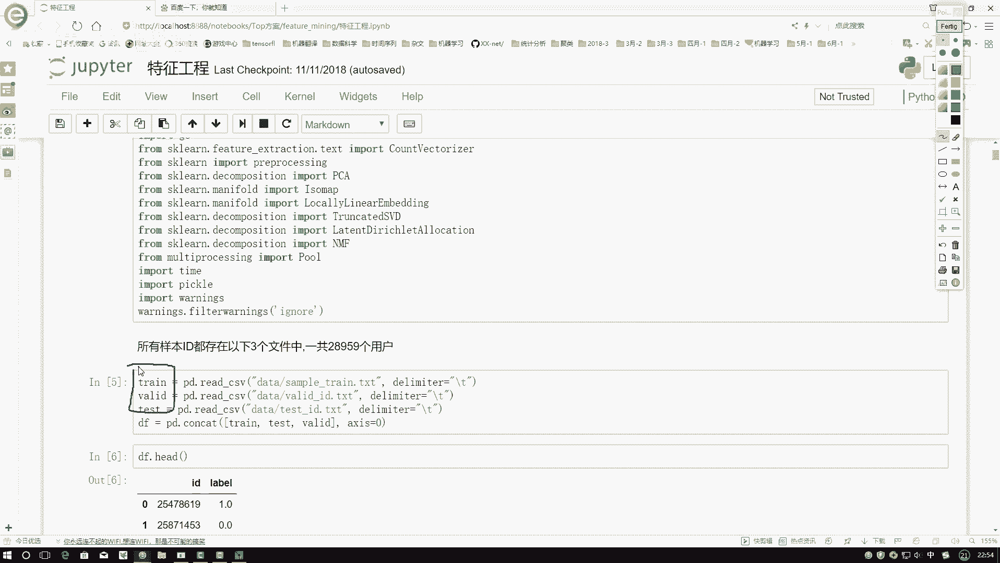

是这样的，就是在这个文件当中啊，它只包含了一个id，还有一个label在这里给大家打开来看一下，首先分别进行一个读取，它不是一个逗号的一个分隔符，它是一个杠T的，咱用这个略CSV来读的时候。

无论是一个点CSV文件还是一个点TXT文件，咱都能读取进来哦，只不过说不同的文件，它可能的分隔符是不一样的，这里能给大家看一下，比如说我先把这三个文件读进来，然后呢，既然他们都是ID文件。

我先想看一看一共有多少个id，或者说一共咱的id的大列表，现在统计好，那无非啊就是把它们就是叠加在一起，pandas点contact一下，把我的train validation test拼在一起啊。

竖着这么一拼，比如说这样，第一个是我的一个train，第二个是我的validation，最后一个就是我的一个test啊，给他们按照一个也没有什么顺序吧。

直接拼在一起就可以了，接下来点还得来看一下当前这份id文件，它长什么样子，其中就包含了第一列就是每一个样本，它第一个id谁去借了哪个钱啊，这样一个事，这是一个id。

第二个就是一个label label里啊，它有一个一和一个零，分别表着它是可不可能是不还钱的，其实在这个数据集当中啊，绝大多数还是还钱的，少部分来说它是一个不还钱的。

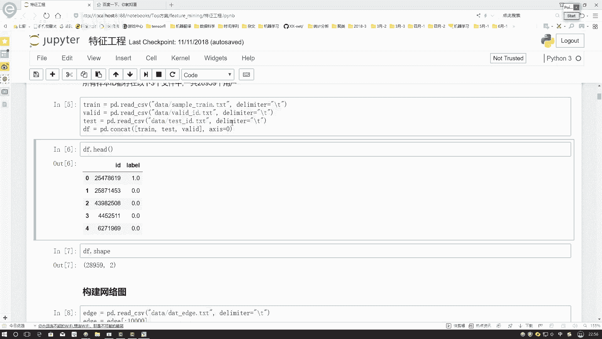

这是我们标签，当然咱这个任务来说啊，我们并不关注于这个标签，因为我们只是想在原始数据当中提取出来，更合适的特征，所以说标签这点咱们暂时不用管就可以，也就是说当前我们有的是id，一共是有2万8959个。

看着的数量其实不太多，但是啊如果说大家把这个东西再想一想，想什么，想一个交互的感觉，我们这2万8000人啊，他们之间可能有些交互的，那比如说我2万8000多，可能咱算不出来，我说十个人，十个人之间吧。

十个人之间最多可能有多少种交互，每个人都跟另外十个都有可能进行交互吧，那他就是一个10×10等于多少，等于100吧，那2万多和2万多之间，也可能产生这样的信息吧，如果说啊用一种图的形式表现出来。

这个图啊相对来说就已经比较大了，虽然说2万多人看着不是特别大。

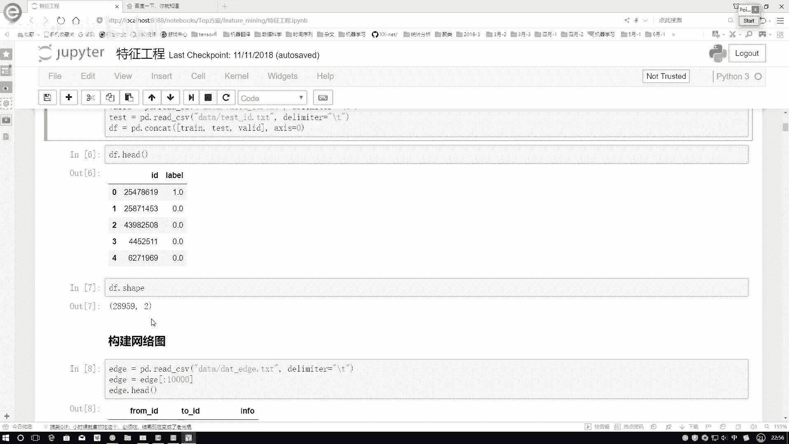

但是呢一旦他们交互的信息比较多啊，他整个图结构还是比较大的，所以说啊，大家呃先得对我们接下来程序有个数啊，接下来我们的程序处理起来，速度会相对来说比较慢，因为我们的交互信息是比较多的。

咱一共呢是有2万8000多个人，或者说有2万8000多个顶点这个意思。

那我们第一步就要构建一个网络图，为什么构建一个网络图啊，是这样，像我刚才给大家说的，咱现在要构建一个风控模型，在风控模型当中啊，如果说你只考虑这个点自身的一个行为，看起来不扣的。

因为我们自身的行为当中啊，可能挖掘不到它特殊一些东西，为大家举个例子啊，你说什么时候可能出现一些异常异常，可能说哎呀有些人他想想通过一些不法途径，然后到我这里来去套现，或者来坑我一下子。

那可能有这样的事，比如说现在有个黑中介，我拿黑色来画啊，这块有个黑中介来了，这黑中介呢他手里联系一堆人，可能联系一堆，或者他骗了一堆人吧，骗了这个人，他说这些人，比如说啊这几个吧，我多列几个。

他让这几个红圈吧，他分别到就是同一时间到我这片台上借钱，就比如说给他们去蒙骗他们会怎么样，反正这中介找了一堆人，比如说他骗了一个大学生吧，让大学生告诉他们去这平安带钱，带完钱不用还。

那是不是说这个中介他会联系很多人，那大家来想一想，你说这个贷款行为，正常情况下应该是个个人的行为吧，但是一旦涉及到一些中介的感觉，或者说一旦某个id跟其他的用户之间，频繁的进行联系。

是不是说明当前这个人有问题，第一点说明当前这个中介有问题，这是第一个事吧，那中介联系这些人是不是也会有问题啊，所以说我们要构建的是一个图的一个结构，在图当中，我们能挖掘到它们之间的一些联系的信息。

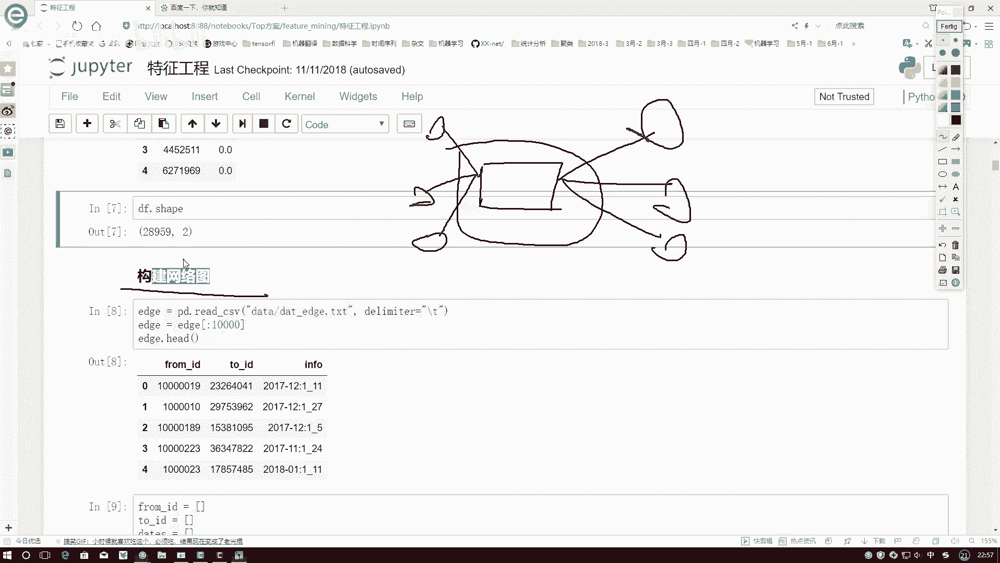

像我给大家给大家举的哎呀，只是一个中介的一个感觉，像是这样一个事吧，其实啊，图当中有很多个这样可以筛选出来的特征，帮助我们解决。

哪些就是id，它可能是有问题的，所以说我们一定要考虑是一个交互啊，咱就不得不构建这样一个图文结构了，在这份CSV文件不是点TXT文件当中啊。

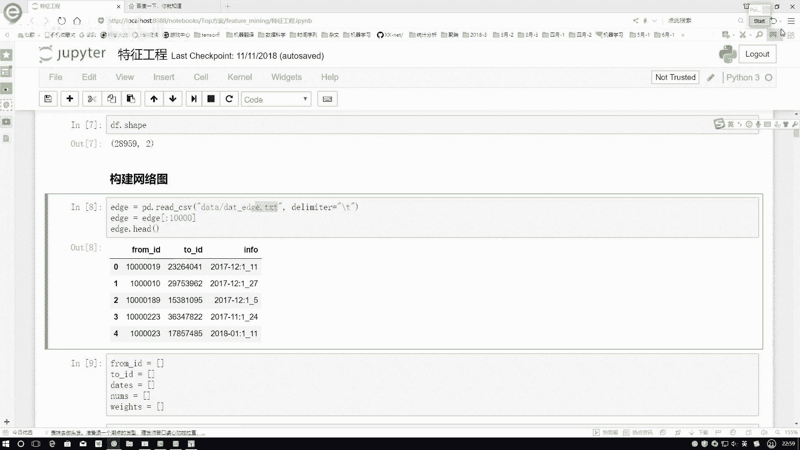

呃我们有一个好处，就是它明确的告诉我们咱当前的一个图啊，它的一个边还有一个点分别是什么，我们来看一下pandas点略CSV一下，这里呢就是data a点当中有个data age点TXT。

还是杠T的分隔符啊，来看一下它长什么样子，这里我是只选了其中的1万个，因为它是一个编的一个数据集啊，像我刚才说的，咱一个点有2万8000多个，这个边那太大了，这个东西。

咱如果说给大家选的太多的这个程序啊，可能接下来每个CEL你运行了三四个点，一个CEL运行三四个点，那整体啊这份代码执行完之后可能要好几天了，咱花时间太多了，我估计大家笔记本跑起来也比较麻烦。

所以说在这里啊，我们就不给大家举完整的例子了，咱直接啊看一下用其中部分数据集展示的结果，其实咱做法是一样的，只不过说我们数据用的稍微少一点。

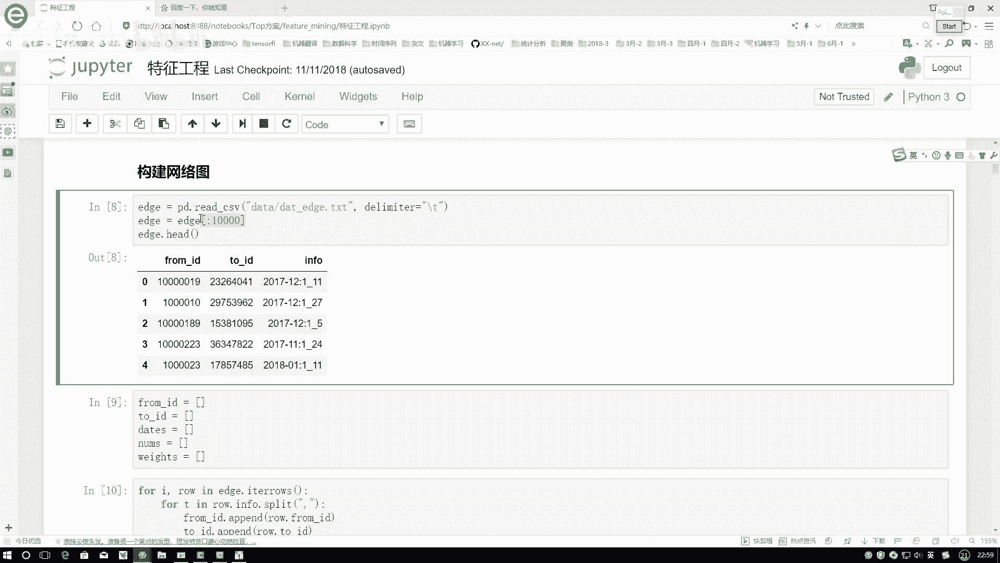

该给大家解释了，他们之间的边啊，数量比较多啊，所以说我们只选了其中一部分，在这边数据当中啊，有几个属性，第一个from id，还有个to id，说白了从谁到谁的这样一条边啊，然后呢还有个信息。

这个信息啊它可以当做一个属性，比如这条边这条边发生的时间啊，在这里它是好几年前了，2017年12月这样一个意思，然后这块有个一杠，11就冒号，后面冒号后面这个一表示是它的一个number。

这条边比如说这个点访问这个点，它的一个数量，比如说数量是一个一，后面的11，11表着它的一个权重项是等于11的，在这里就是原始数据当中它进行了脱敏，没有去解释当前这个权重具体表示着哪方面。

它衡量出来的权重，但是没关系啊，我们就把它当做这条边，它重要的一个程度，直接当做一个属性特征来用就可以了，这里呢后面这个info就是一个时间。

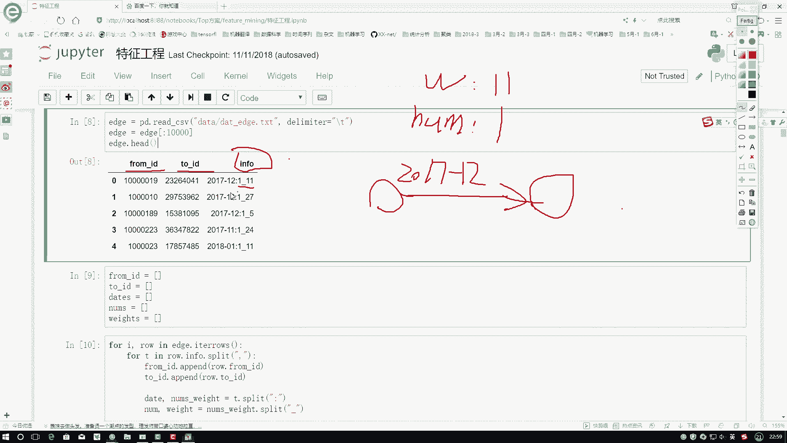

一个次数，一个权重，这个意思，那通过咱当前edge这个点TXT文件，我们就可以把这个图构建出来了吧，因为这个图当中它存储的全是边的信息，把所有的边我都给它对应的搭好，是不是整个的一个图大概这个样子。

我连这个点这个点连这个点，这个点连这个点，这个点连这个点，这个点还可能连这么点啊，咱就哎比如这么连吧，咱这样就可以把整体的一个大图，给构建出来了吧，所以说我们现在啊有了一些点和边。

还有它的信息，我们就可以来构建图了，在构建图的过程当中啊。

嗯暂时先这样，就是我们先做一个小预处理啊，因为这个info里边看着比较乱，他是把这三个属性写在一起了，这是一个日期，这是一个number。

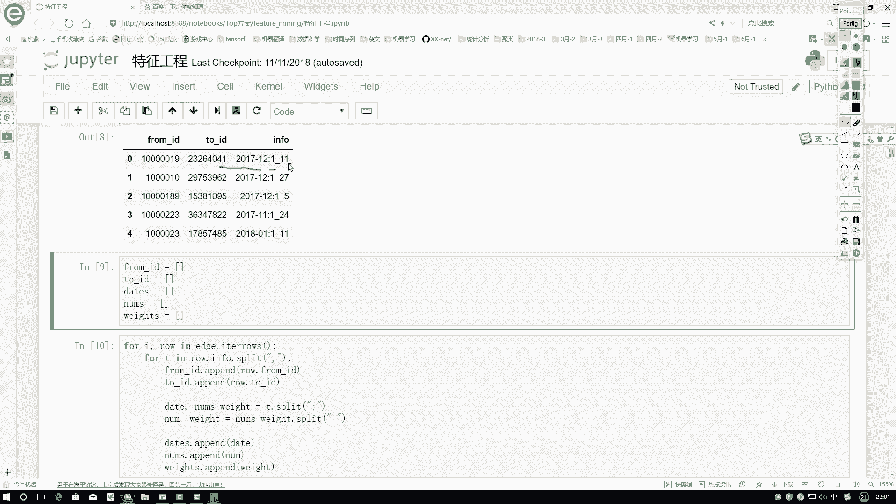

这是一个全网，一个vs一个权重项，所以说第一步我们先把它进行一个拆分，我们来看一下，在这里呢我分别列出来几点，第一个form id to id分别是第一列，第二列这个days子分别是我第三列当中的。

前面这个是冒号，后面的第一个，这个是最后一个啊，分别把它们展示出来，在这里呢我就遍历一下咱当前的所有的边啊，这是进行一个遍历所有的边，然后呢先按照逗号进行一个分割，分割完之后。

from id to id分别拿出来，然后呢再按照冒号。

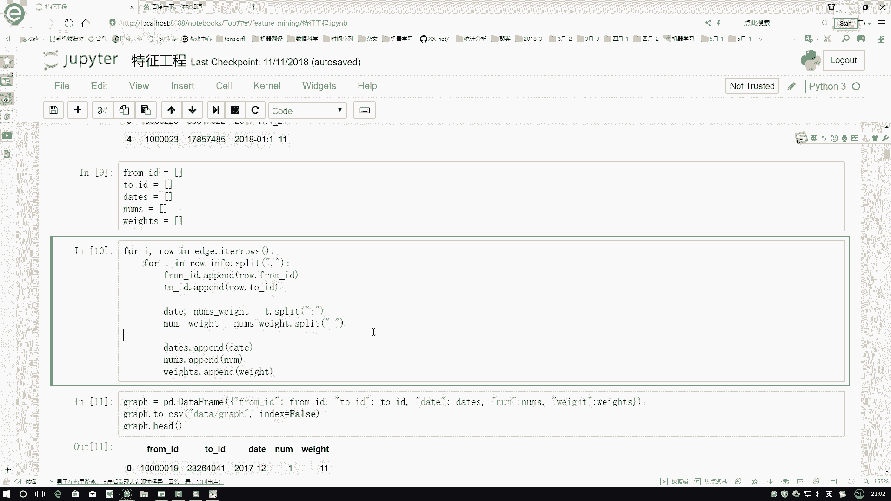

再按照一个杠进行分割，说白了就是把咱当前几个特征给它切分出来。

就可以了，第一步先对我们的数据集进行一个小预处理，包括需要特征啊。

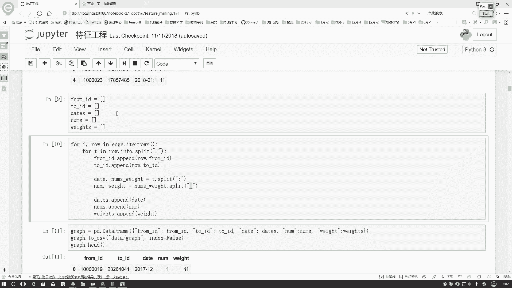

先切分出来，一会儿呢我要用它做一些事情，做什么事啊，看一下吧，这是我现在切分完的结果，然后我重新的创建了这样一个data frame，在这里重新创建data frame，几个名字分别列出来了。

From id to id date，还有一个number。

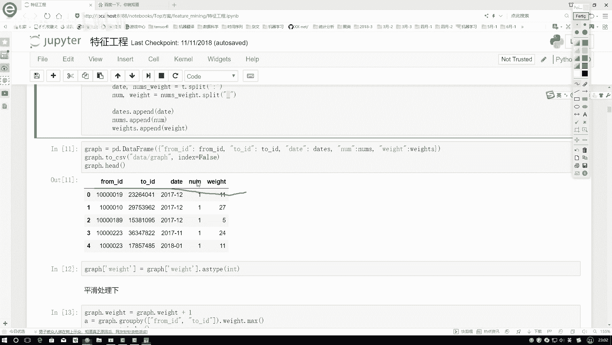

一个weight啊，咱们先把所有特征拿到手，然后呢在这一块我先进行一个保存啊。

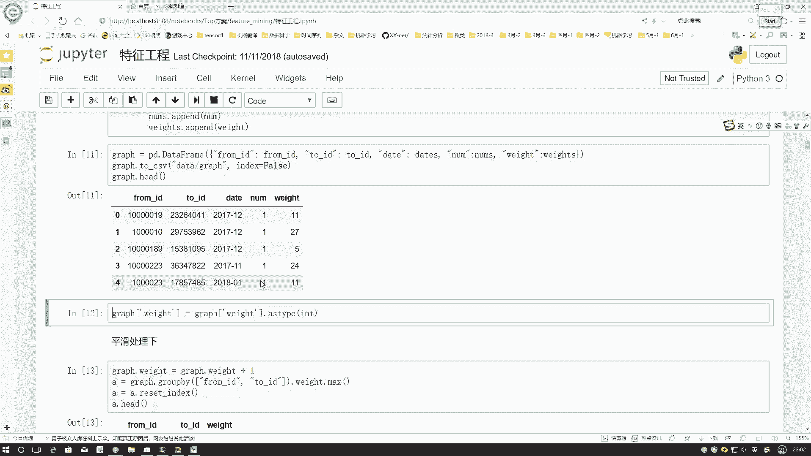

就是在这里啊，在保存之前还做了额外的一个事儿哦。

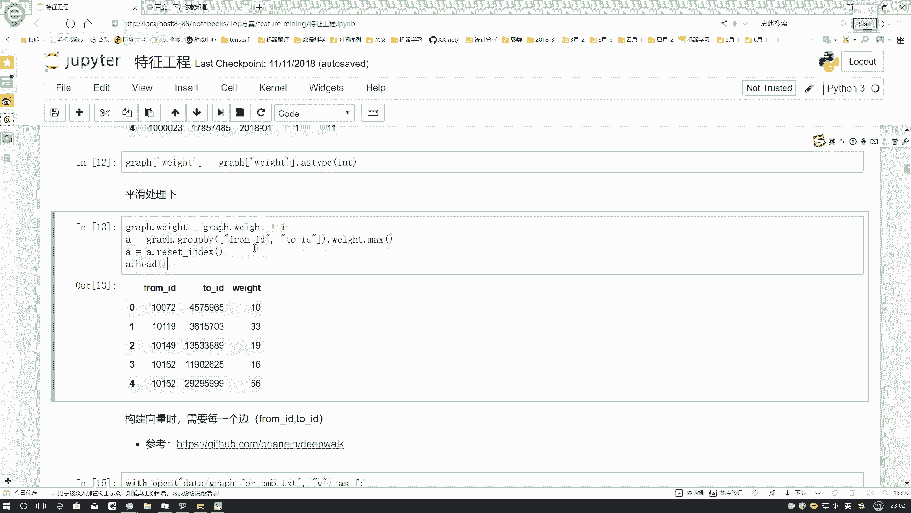

在这里还加了一个一，因为是这样一件事，我们一会儿呢可能做一些权重的一个对比，比如说权重占可能要涉及到一些除法啊，所以说在这里有些权重项如果是零的前提下，它是没办法进行计算的，咱加上一个一。

相当于是做了一个平滑处理啊，然后加一之前我还把它转换成一个int类型。

原始类型它不是int类型，因为这是字符串切分，它是一个object类型或者string串儿。

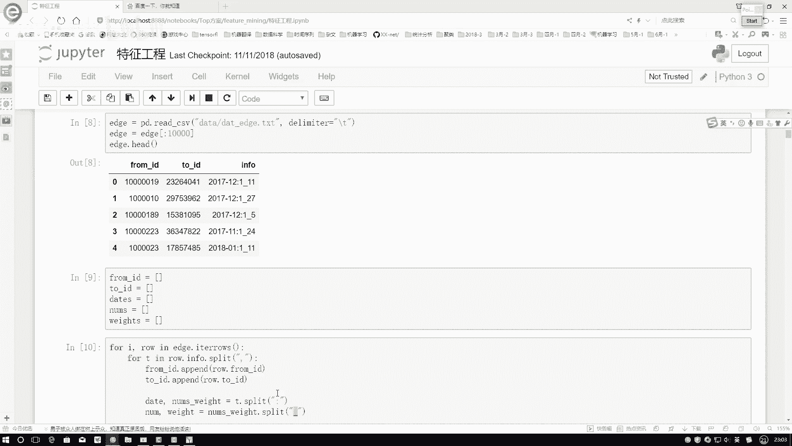

这个类型咱先把它转换成咱的一个int类型。

然后呢再做一个平滑处理，在所有的权重项后面加上一个一同时啊。

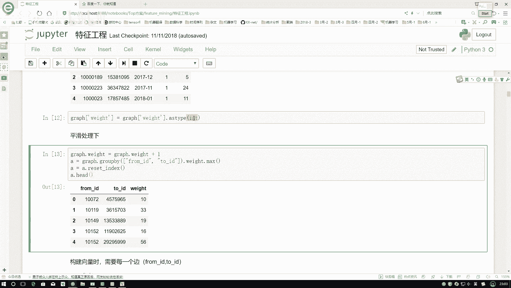

都加一，对我结果不会有太大影响的，在这里啊做了这样一个加一的操作，下面呢就是我处理完之后他的一个结果，这里我们只要其中几个就够了，一个是form id，一个to id，一个权重项，因为一会儿啊。

咱要用到的这些图模型当中一些算法，所以说一个边from和to，这两个比较有用的一个权重项。

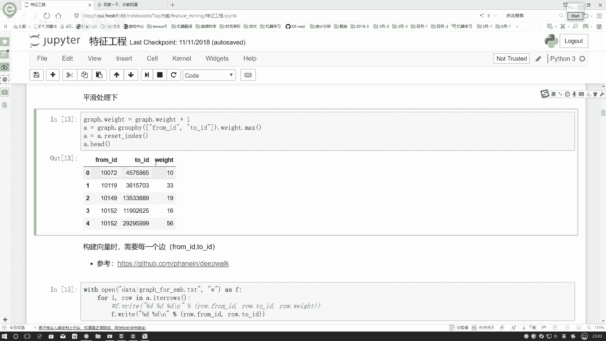

这也是比较有用的。