# 完全可自学！人工智能金融领域知识图谱+Python金融分析与量化交易实战全套课程！入门真的超级简单！——机器学习／深度学习／NLP自然语言处理 - P12：3-节点权重特征提取(PageRank) - AI算法-漆漆 - BV1Wgz3YVEx1

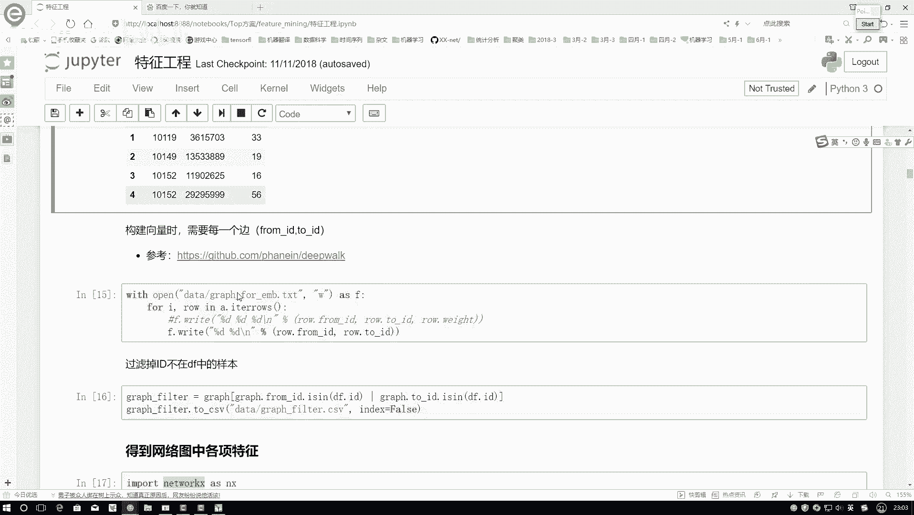

然后这一块啊，这一块我还把咱中间结果进行了一个保存，专业基础保存当中我只选择了一个form id和to id，这里是这样，一会儿我们还要做一件事，比如说在这一块我先画一个图吧，嗯简单画一画。

比如这个图它长这个样子啊，随便画一个图吧，这个图是这个样子，比如说我写个写个123吧，我说这是一号点，2号点，3号点4号五号，大概这样，咱就随便画五个吧，以前啊咱们在讲算法的时候讲过什么东西啊。

是不是讲过一个word to vector啊，Word to writer，大概东西是这样，就是当前我对于一篇文章当中的每一个词，我能把这个词构建成一个向量吧，比如说在一篇文章当中。

哎呀我有出现100个词，我可以把每个词转成300维的向量，这个咱之前都讲，大家估计比较熟悉了，那我们先来看这个任务，首先我们现在拿到的不是一篇文章，我们拿到的是一个图，诶，大家来想一想。

一个图和一个文章看起来像不像是一个整体，比较像吧，文章当中我有一个词，我的图当中我有一个顶点，看起来它们结构是类似的，那对于文章当中的词我能转成向量，对于我现在这个图结构当中这些什么。

我们图球队列当中的顶点，我说我能不能给它转成300位向量，这也转成300维向量，能不能啊，其实也是可以的，但是咱们想一想缺什么东西了，文章当中啊，我们说要的是一句一句的话，通过一句话当中传送窗口。

我来构建训练集，然后用神经网络去构建一个，就是训练一个词向量吧，那在这里哎我们少了个东西，文章当中啊，我是由词词，由句子，词又句子，我们今天去打篮球，由这样的先后顺序，我能训练一个词向量。

但是我这个图模型当中诶，这个模型当中我们该怎么样训练一个向量啊，原始的比如说我们来求我说啊，我说一这个位置它是一个五，然后设置我们吧，然后二这个位置它是一个打，然后呃这是二这个位置它是一个打。

然后这块假设它又连到三了，这块它是一个篮球，可不可以啊，看起来如果说在文在一篇文章当中，它可能是这样一个感觉，但是呢在我们图当中，你看一走到了二，二，走到了三，三，走到了四，给我的感觉像什么。

如果说你把123当成一个词，它是不是也在说一句话呀，所以说我们现在可以构建一个序列，哎一三你看按照图这样来说，我们是不是也能构建出一个序列出来啊，1234构建数据列还能构建什么。

比如这块我再来一条125，它是不是也是一个序列啊，咱现在是不是可以通过一个序列，把我顶点按顺序进行一个排列，你看1234我当成一句话，125当成一句话，然后下面再再来一堆，当成一句话。

我把它们整体拿过来，这不就是一篇文章吗，所以说啊我对一篇文章能做word writer，对于一个图我可以做一个啊，比如说一个note to vector，相当于我把一个点转换成一个向量。

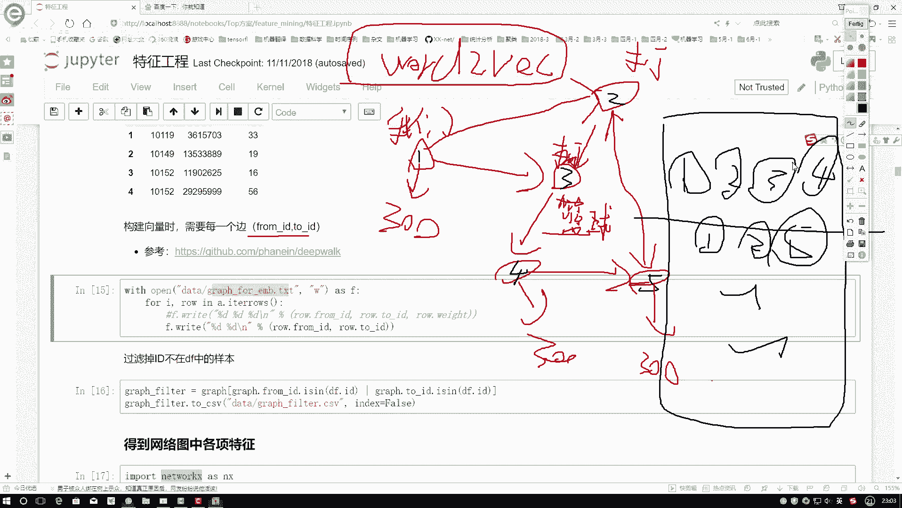

这个也是我们能去做的，一会儿我跟大家说一下，咱在PON当中啊，怎么样执行这样一个操作啊，方法原理大家参考word to letter行，基本的原理都是差不多的，所以说呢像我刚才说的呀。

咱刚才做了一件事儿，我得把这个图当中一个由哪个点到哪个点，这样每一条边都记录下来吧，这里我们就不需要这个权重项了，所以说我又重新的在这里写了一个GRAFFLE，咱们的一个embedding点。

TXT文件当中写上一个form id，再写一个to id，方便咱们一会儿做词向量要去用的这一步，主要是为了后续做打算的，咱在这一步当中啊，就是我们现在构建一个图模型当中，构建边的特征当中。

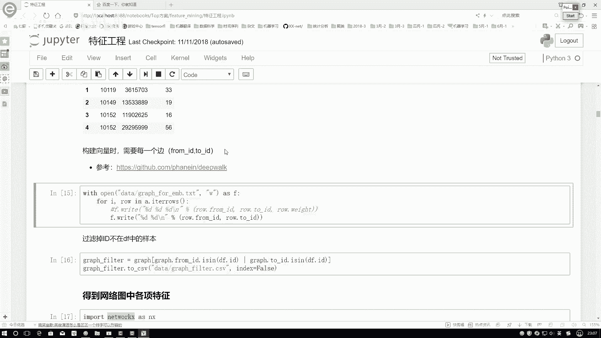

咱们用不上一会呢，在构建顶点特征的时候，我们要用上这样一个事，下一步做一个过滤过滤，啥意思啊，是这个数据当中这样啊，就是它这个边当中。

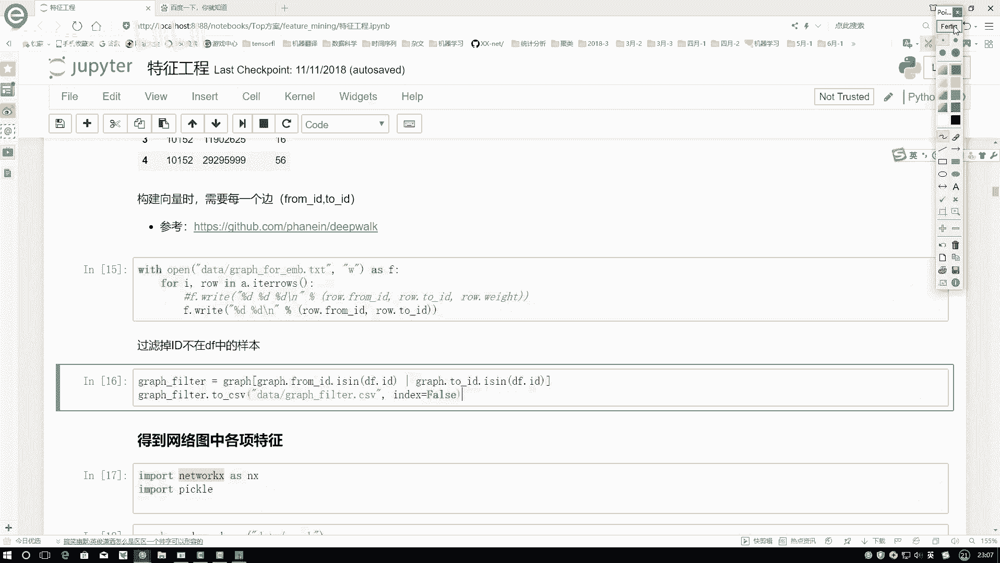

它这个边当中的特征其实挺就是边挺多的，然后呢我们刚才是不是说在之前我算了一下呃。

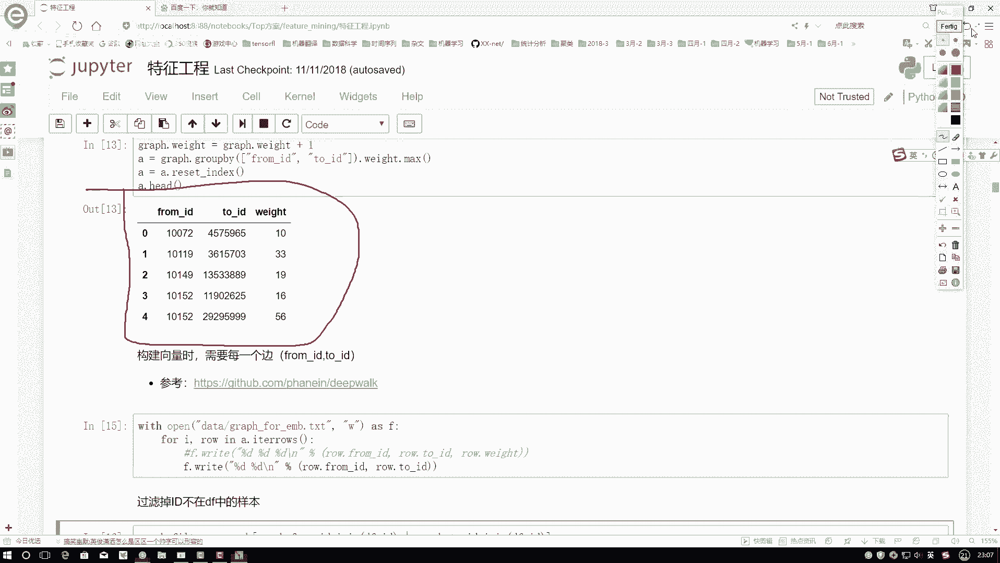

这个train还有一个validation，还有个test当中所有的一个id是有多少个。

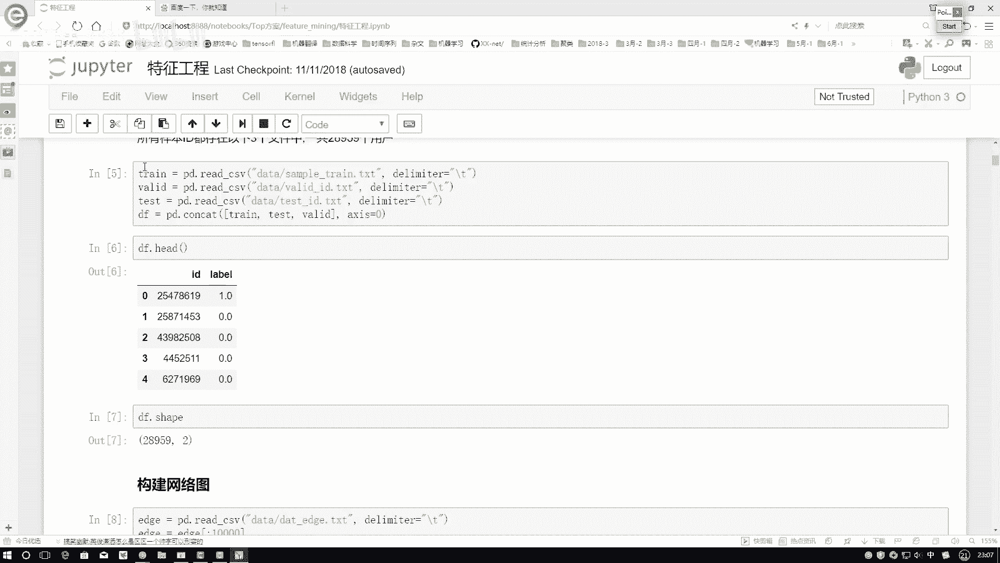

2万8000多个吧，在这块我们做了这样一个过滤啊。

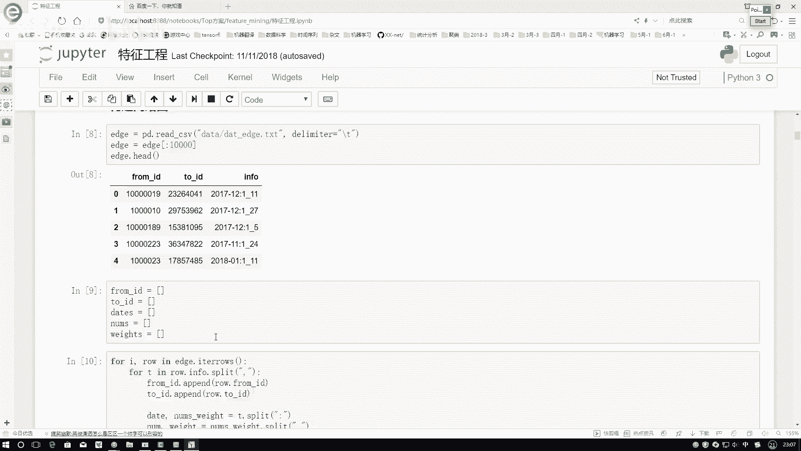

就是你在这些编当中拿到的这些拿到这些id，如果说编当中拿到这些id不在哪啊，不在我当前那个train test validation当中，id就是原始数据当中给定你的这些id当中。

因为我们后续观察只想观察这些id，所以说既然编当中不在的，我就通通的把这一条这条边给它去掉就可以了，只选择这些边，是包含我们上面给定的那2万8000多个id，这样一个意思，相当于啊。

这块儿对我们的图进行一个过滤的操作。

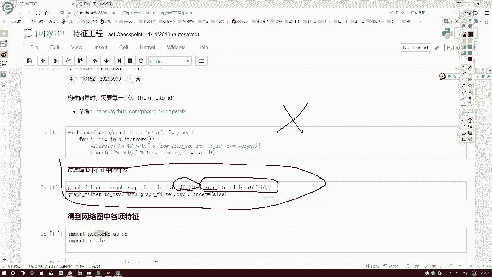

剔除掉一下我不在数据点当中的id，因为那些点可能是我们不需要的啊，咱们给它剔除掉了，这样呢我们就现在拿到了啊，所有的一条边构建好了当前的一个图。

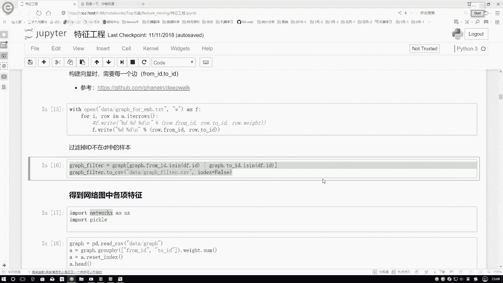

接下来，接下来，我们是不是要在图当中去寻找一些特征啊。

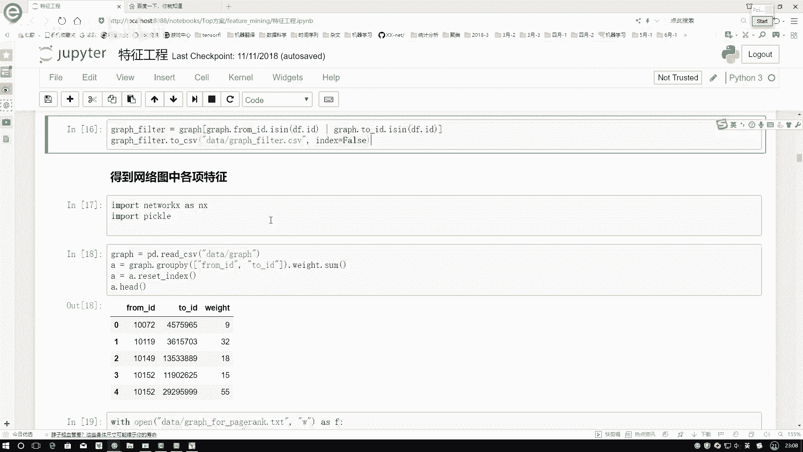

那你看我构建出来一个图之后，我说这个点一号点和这个2号点，还有3号点，它们之间肯定有一些联系的关系，这个图往复杂了，画可能画的非常大，那这里1234哪个点比较重要，哪个点不太重要啊。

这东西它该怎么样进行考虑啊，这里能给大家介绍一个东西，可能大家都以前都听过叫做一个page rank，page rank什么意思啊，这个是一个就是搜索引擎吧，它排名的一个依据，大家可以搜索一些关键字。

排名就除了百度推广啊，咱不看那些广告的，他排名是哪个是第一条，哪个是第二条，哪个第三条，Peter run，啥意思啊，他是最早谷歌发明的一个东西啊，是这样一个意思，他在排名的时候，他说了这样一件事。

如果说一个网站诶它是比较好的，那我应该给他排名较高，怎么情况下是排名比较好的，很多个网站都有连到这个网站的链接，比如说现在哪个网站呢，比如说哎比如说什么网站呢，一时想不到，比如说一个搜狐吧或者一个网页。

或者一个什么微博之类的，你看微博，比如说就是微博那个网站吧，对于微博这个网站，是不是好多都能连到这个微博这个网站啊，这个微博登录那个微博，登录这个热点那个关键字之类的，全能连到这样一个地方吧。

那我们来看这个一，比如说这个微博好多站点能连到它，你说它是不是比较重要的，像我刚才说的，什么时候好多站友能连到他呀，是不是说这个人有问题的情况下，才能好多人都联系到这一个人啊。

要不然咱各个贷款应该是都是没什么关系的，一旦有关系了，可能就有些猫腻吧，这是第一个事，那什么时候还有第二个事呢，第二个事，比如说这个站点连了好多个站点，那可能这个站点也比较重要吧，比如哪个呢。

比如说那个好123好123，或者是一些呃，或者一些其他的吧，或者360导航之类的一些导航网站，它能连到好多个站点吧，那这个站点它是不是也像是个中介似的，它也会比较重要啊，所以在这里给大家说一下。

一会儿呢我们用配置rank去提取一下什么，咱既然把图构建出来了，我们可以把这个图当做是哎，你的一个浏览器当中不同的网页吧，它就是互相链之间的这样一个，就是它这个浏览器当中。

互相链就跟我这条边互相连接是一样的吧，所以说在这里啊，我们是要用配置rank去计算一下，当前我们每个节点啊，它的一个特征，或者你叫做一个权重项也可以，咱要做这样一件事，在这里我们看第一步。

第一步我们需要导进来一个工具包啊，network x这是这样一个意思，这个network叉当中啊，它会有很多个，咱一会儿会利用到的一个算法都给你封装好了，这里呢不用大家自己写什么配置。

rank这类算法了，咱直接把工具包导进来啊，没装完，同学大家自己pip store，先装一下这个工具包当中啊。

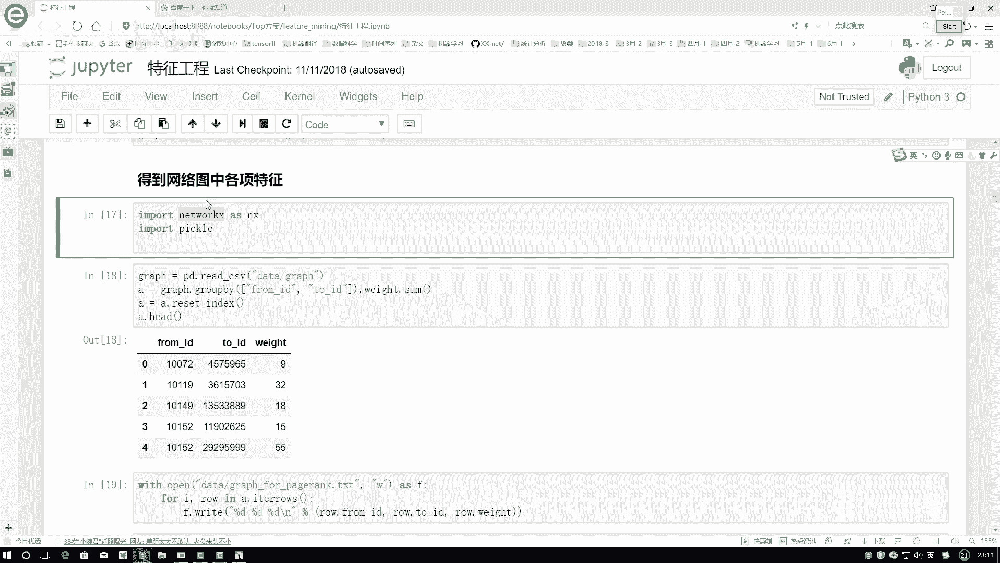

一会儿能帮我直接计算啊，所有节点它的一个权重项的。

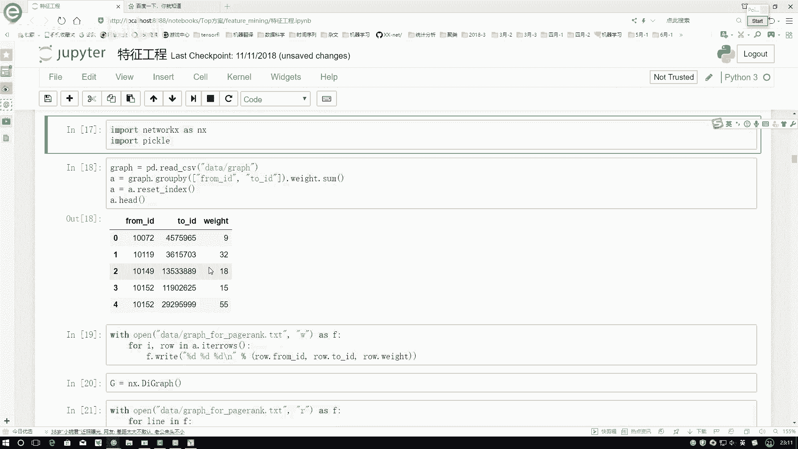

首先咱来看吧，咱要算节点它的一个权重项，我们需要哪些个指标，在这里我们大概需要这几个啊，你看这块我写了一个啊，graph for pyrg点TXT，这里呢是这样，就是一会儿我要去往这。

就是从这当中去读数据啊，读数据过程当中，我先把需要信息写进来，需要这三个，一个是这条边啊，比如说一个form id和一个to id，这是form id，这是to id，这条边不就有了吗。

还有这条边它的一个权重项，这三个属性是我一会儿要计算咱的一个配置，rank算法当中啊，咱必须所需要的三项啊。

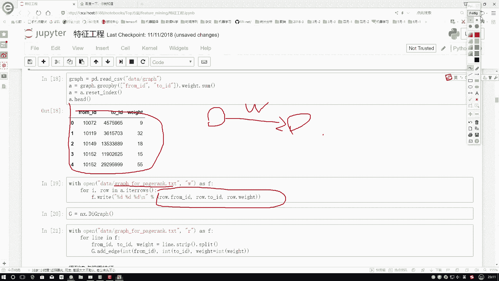

现在能写出来，然后呢有这三项之后，哎这块咱先给他保存一个TXT啊，因为就是你如果这里给，如果大家自己执行的时候，你取前1万个数据来做，其实挺快的，如果说你取所有数据计算起来非常慢啊。

所以大家尽可能把咱的一些中间结果，咱能保存下来，这样呢咱做起来的时候是比较方便的，首先构建一个网络图，在网络图当中我要去一条边一条边的往里去加，这样我们来看对于网络图，我先实例化出来一个g graph。

在G当中我要添加这个图了，这一点AI的edge一下，我去一条边一条边去添加，第一个它是我的一个int，就是from id，我不要忘记转成int类型，这是我from id，从谁到谁，From id。

第二参数是一个to id，第三个参数就是它的一个权重项，当咱执行完这样一个for循环之后，我整个的网络图就给它做出来了，这样这个G，它就是有了咱当前数据做好的一个网络图，因为你把边都填充进去了。

它会按照边from my id to id，自动的把整个网络图都连接在一起。

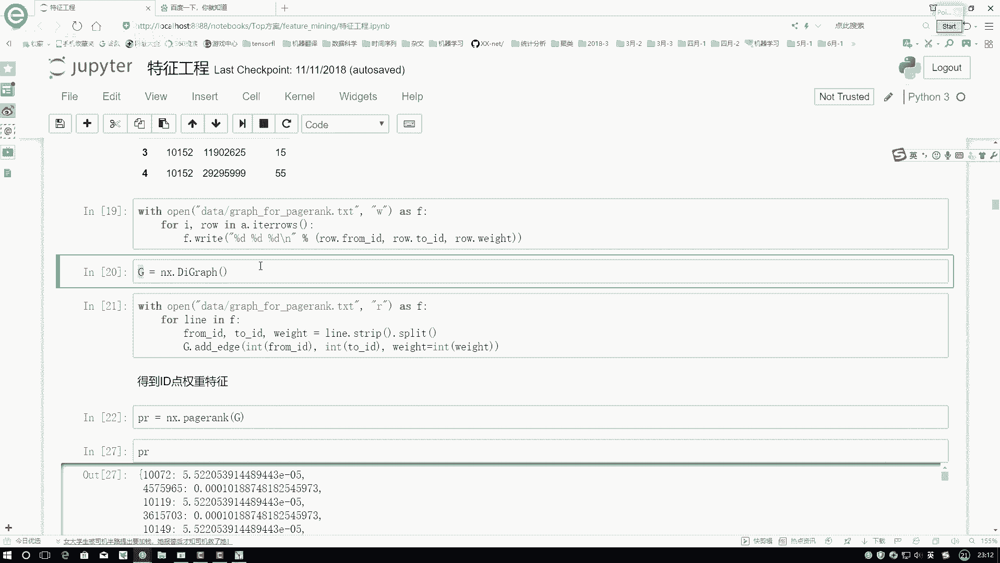

现在这个G就是我啊，要构建的一个网络的大表了，那接下来咱是不是只想知道这个大表当中，每一个点它的一个权重是等于多少的呀，咱要做这样一件事吧，咱们来看一下，首先我们要对NX，就是咱之前导家工具包对照它啊。

其中一个算法叫做我们刚才说的配置rank，连它的比较多，它连出去的比较多，而且呢它要连高质量的，连它高质量的连出去，当前这个节点就是比较重要的，大家感兴趣可以先看一下配置配置rank。

百度一下里边很多讲讲，这个不给大家一个去说了，基本上就是像是中介那些点，它的权重是比较重要的，咱直接把这个G传进去，我们就可以得到当前每个点。

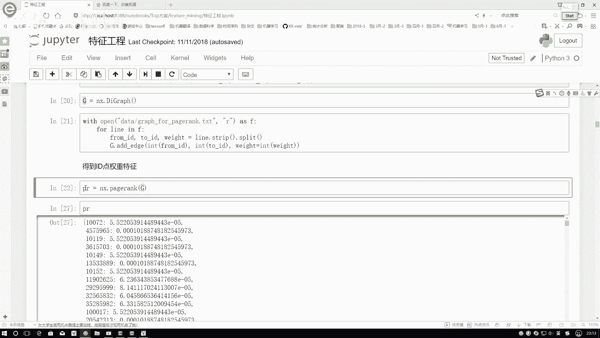

它配置rank得分的一个结果，下面我打印出来了啊，这里边打印的比较多啊。

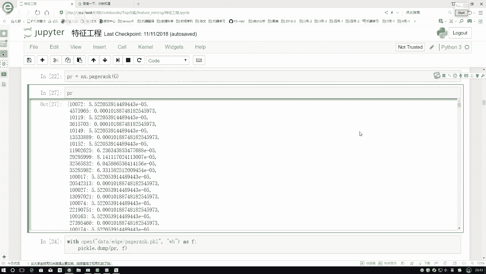

就是当前这个点它得到的一个特征，咱就把它当做一个特征结尾就行了。

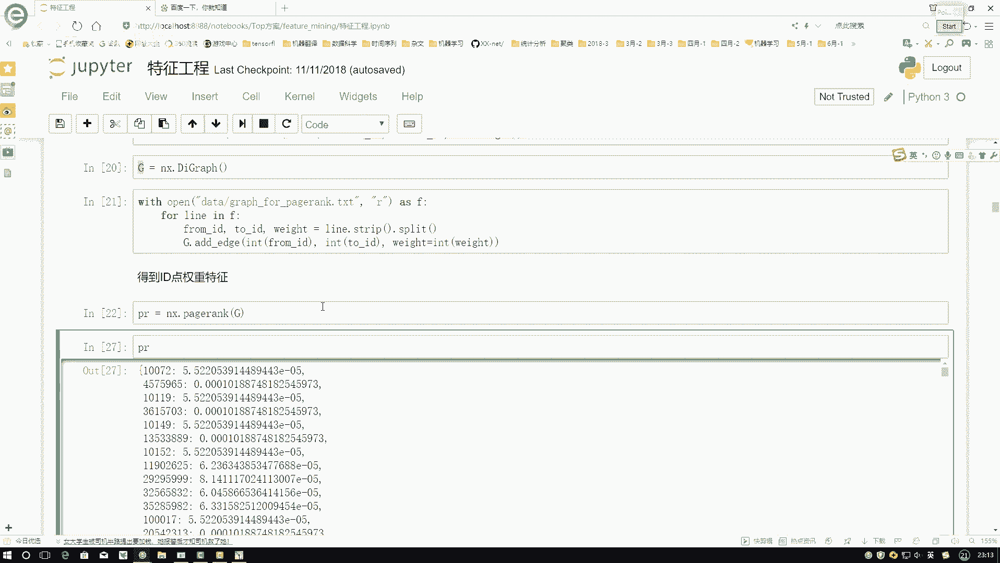

在这里我们不需要做一些对比啊，我们直接把它当做一会儿。

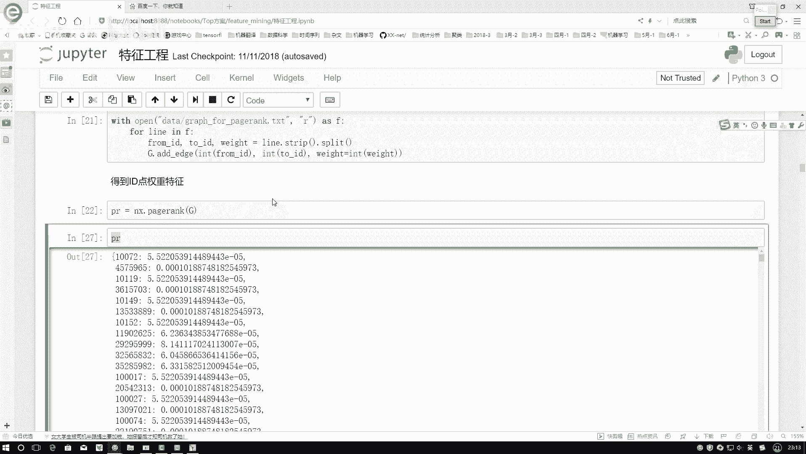

我要去依赖的一个特征，相当于每个点它的特征，暂时啊咱就给它拿到手了，这个是我当前的一个啊特征结果了。

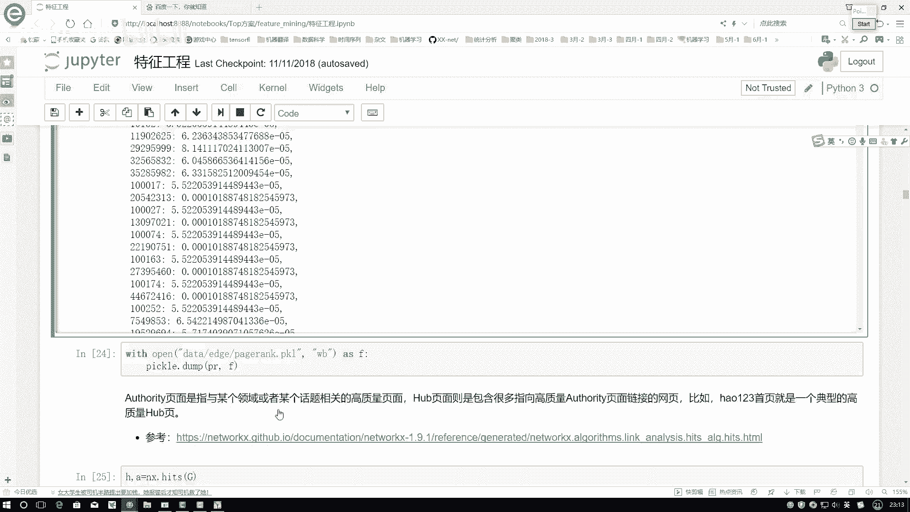

把当前特征结果给它保存下来。

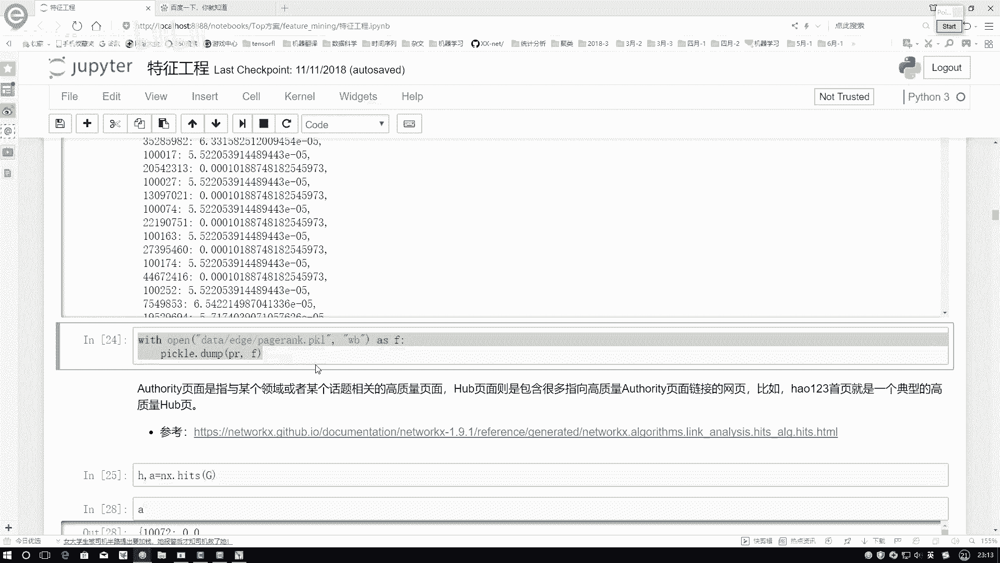