# 完全可自学！人工智能金融领域知识图谱+Python金融分析与量化交易实战全套课程！入门真的超级简单！——机器学习／深度学习／NLP自然语言处理 - P13：4-deepwalk构建图顶点特征 - AI算法-漆漆 - BV1Wgz3YVEx1

接下来我们还可以提取网络当中啊，像我刚才说的两种不同的特征，分别叫authority和一个HARB特征，他是这样就是authority啊，它是比如说它这个界面啊。

与就是你他这在在在这一节上是我直接摘抄的，一个在浏览器当中一个介绍，在图当中解释，大家也可以类似做一个类比啊，assert页面表示着与某个领域，就是搜索或者某个话题相关，质量较高的一个界面。

这个就是一个SORTY的感觉，然后还有个东西叫做一个hub界面，hub界面相当于这样，就是它是指定了，或者说它是包含了很多高质量的authority界面，比如说咱刚才说的呃，要这个好123。

它就是一个好高号的一个界面，因为这里它的一个好验三当中，连接到很多高质量站点，它的一个就是地方是比较多的，所以说好123他这个Harp得分值会比较高，然authority呢这个界面相当于嗯。

它是比如说它已经是很高的一个界面了，比如说它是搜狐诶，他就是当前这个领域搜索比较高的，或者权重比较高的这样一个界面，对于当前我这个图模型当中呃，我们刚才直接算的是他配置rank的一个得分。

他会综合进行考虑，N就是他的一个SORTY得分，这样我们就可以又分别把网络图当中啊，又提出来两种不同的结构，分别是H特征啊，还有一个A特征，咱给大家解释过在浏览器当中啊是什么意思。

然后大家如果说想去啊详细的看一下咱当前啊，比如说这个算法大致的一个解释这一块呢，我也把参考给大家列出来了，这就是咱那那那个network插当中啊，它的一个官方文档当中啊，做了这样一个解释。

到大到时候大家可以自己简单的了解一下，下面就打印了一下一个A特征，还有一个H特征，它得到的一个结果，然后下面还有一个叫做一个呃，网络节点的一个度中心性嗯，度中心性特征是这样一个意思，大家来画一下吧。

他可能这样，他可能是呃，比如说当前这个点，比如说当前我列了一个点，就是这个A点吧，这A点你看他左边只连了一个，右边也只连了一个，但你说这个点看起来连的也不多呀，它好像也不像这个中介似的。

不像是这个B和C似的，就要多画点吧，咱画的夸张一点，不像这个B和C都连这么多，那你说A级还重要吗，那这回感觉A不重要，因为它只连了两个，但实际上你看A重不重要，A像是一个桥梁的一个中心的一个感觉吧。

这叫什么，这就是它的一个度中心性，如果说某个节点它充当了起这样的一个桥梁，这样的一个感觉，比如A这样一个感觉，那你说它自然也会比较重要吧，所以说啊在这里我们又考虑了一个度中心性，这样一个感觉。

还是啊这个NE那这个network差当中，它的算法，其中啊在图形当中有很多个特征可以进行提取，在这里呢我们来提取出来，另外一个叫做度中心性，分别我们用都市中心性，H还有一个A以及配置rank pr。

它这个得分当做咱当前选择出来，网络节点当中啊，每个就是每个点它得不同的几部分特征，我一会儿在进行组合的时候，会把这几个特征全部给组合在一起，这里呢我们又创出来另外一个特征，叫做一个度中心性行了。

在这里我们就可以先把咱当前保存好的，当前几个结果存就是都存进去就可以了，第一步我们就完成了，当前我已经把网络图当中每个节点啊，通过它的一条边构建出来的图，在图当中基本的特征我们已经给他做构建好了。

接下来我们就要构建每个节点啊，刚才咱们还说了，它有一个word writer吧，或者叫做一个顶点转成向量的一种方法，这里啊我们选择的是一个devote的方法，其实这是一篇论文啊。

待会大家有时间可以先看一下devote，这篇论文就要跟大家解释的，咱怎么样在顶点当中来构建出来这样一句话呀，就这个顶点它是怎么去走的吧，123erroll，他这么走的。

我是不是它是像就是构建一篇文章当中，一句话似的，把这个123给它构建出来了，这个就是基本的一个随机游走的一个感觉，到时候大家用的时候，我们先来看一下它的一个get号文档。

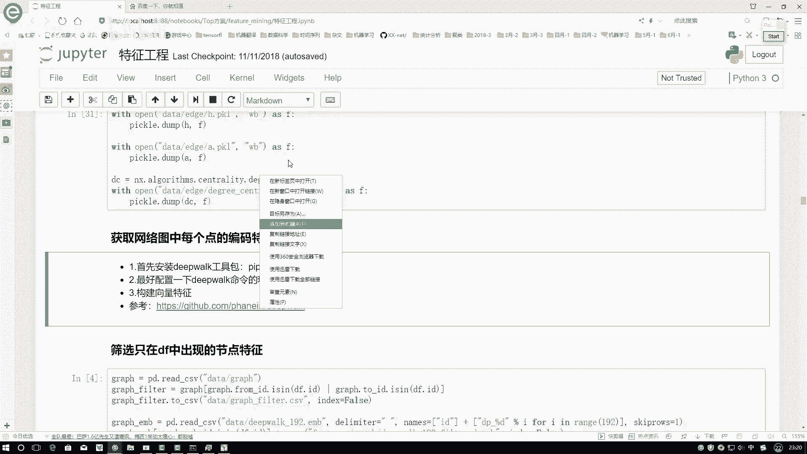

在这里就是不需要大家自己去实现，那个DEPARK的一个算法了，在这里就是GITHUB当中啊。

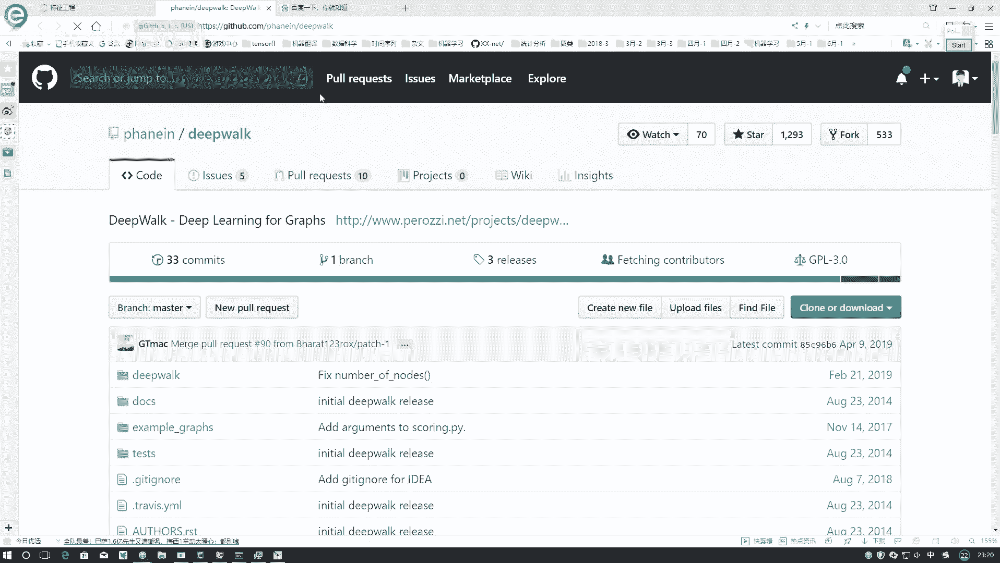

直接有工具包，叫做一个DEPULK，我们在这里直接需要大家嗯做一件事，就是先把这个工具包给它安装起来嗯，直接用那个pip store可以了，或者是咱们在这里，或者你按照它官方文档当中。

它有一些大家找一下它有一些安装方法吧，我在这里他没有给你指定安装方法，这样吧大家也不用自己去想其他方法了，就直接pip store debug，它就得装起来，然后下面是他的一些介绍，这工具包怎么去用的。

在这里我先跟大家说一下吧，就是这个工具包咱们应该怎么样进行使用，pip扫完之后需要大家再做一件事，就是由一会儿啊，它这个使用的时候，我们是一些命令行的操作，所以说为了使得咱命令行。

在哪儿都能进行一个操作的，咱得有个前提，就是你要去配置一下它的一个环境变量，你看我这里哦，在这里哎呦，我已经打开，这是我的一个环境变量文的一个文件，然后找一下就是在咱们的系统编当中有个pass。

然后编辑一下pad当中之前有添加过一个，我记得我添加过一个那个debug，来看它在什么位置啊，艾尼康A3，然后script当中给大家来看一下，在这里我是把我这个E盘的。

然后有一个呃就是我看program data，然后andy cut3，然后这个scripts这个我看下是不是这个嗯，这里我是把咱这个E盘，然后program data，然后any account。

Sin scripts，这个整个文件夹都添加到我的还原变量当中了，这样咱一会儿用那个deep pk就能直接使用起来了，到时候大家安的时候就看一下，你当前就是指定好嗯，咱第一个路径是在什么样的一个位置。

比如这里我们可以给大家看一下，这有一个DEVOE，你看这有个default点ESSEE程序吧，就是我们一会要用这个DEVOE点ESE，所以说你得把它所在的一个位置，添加到当前的你的那个还原变量当中。

到时候大家就是找到你安装完之后，deport点ESE它所在的位置，然后复制一下咱当前位置，CTRL加C1下，在我们的环境变量，环境变量不给大家打开了，环境变量当中，在你系统系统的路径下。

然后pass里边添加上咱当前这个路径就可以了。

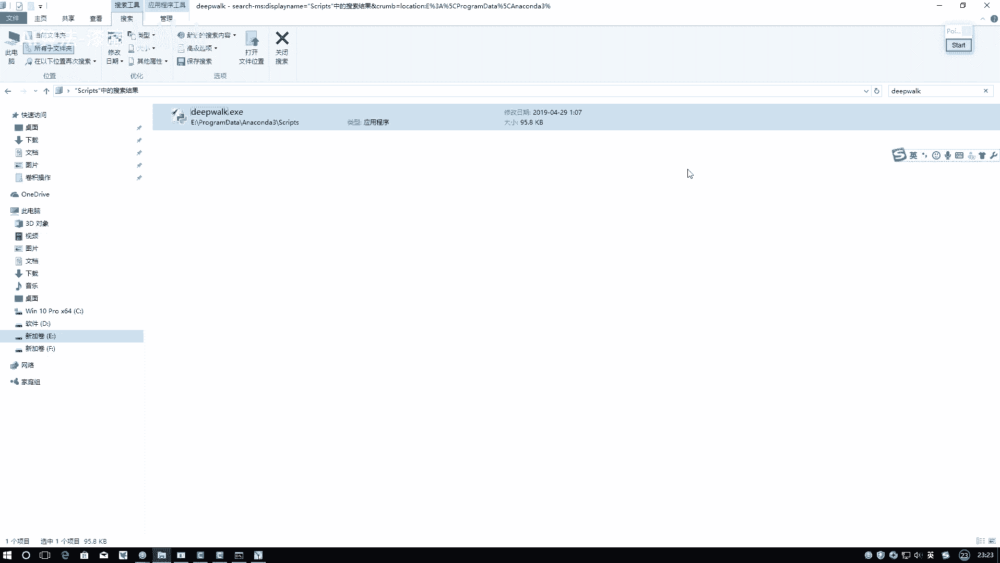

这样咱在这个呃就是命令行当中，我们就能够直接用咱当前这个工具了。

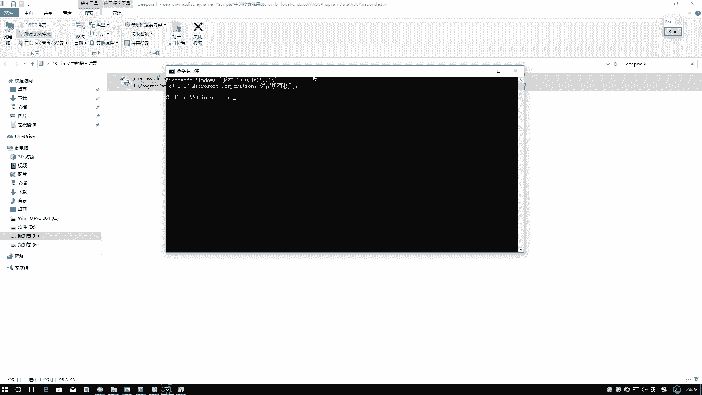

然后来看一下吧，咱这个东西该怎么去用，用的时候需要大家呃先指定一下，就是我们当前哎你看一下最开始的时候，我们是不是进行了一个文件的保存啊，在这呢嗯就在这里啊，这一块我们进行保存了是吧。

你要注意你要记住一点，就是你保存到他的一个位置，我们来进一下。

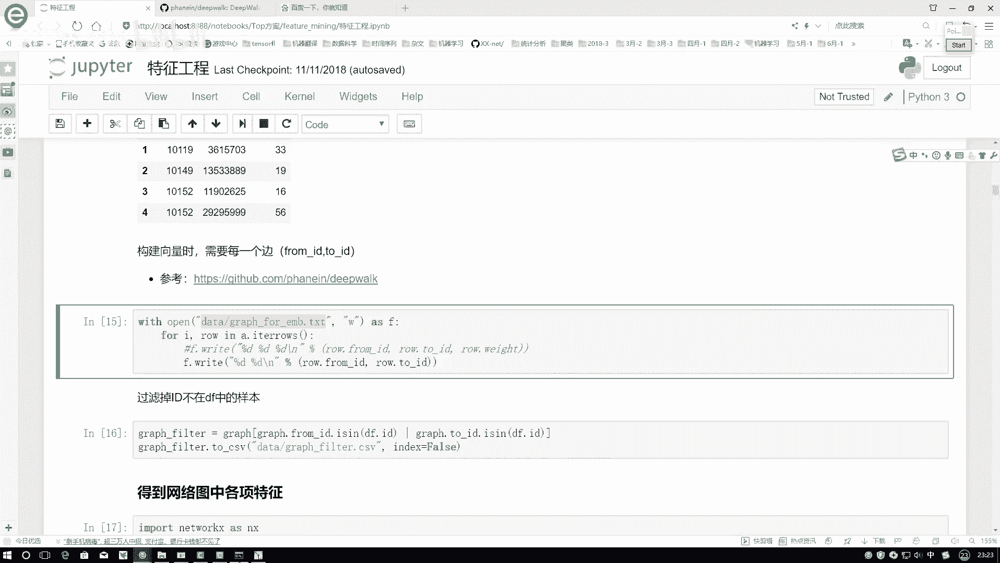

这是我打开一个命令行啊，在命令行当中，然后我要进到刚就是当前你这个graph for，咱们embedding点TIT它所在的一个位置，它是E盘，E盘当中是一个，我看一下prom data，哎。

不是prom data，叫做一个Python notebook，我的姓名，然后Python book当中叫做一个top solution套方案。

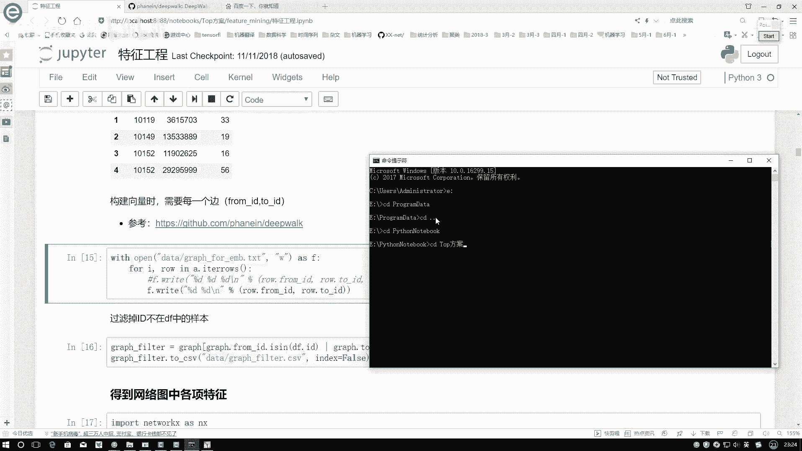

套方案当中，咱这个我看一下咱这个文件夹叫什么来着。

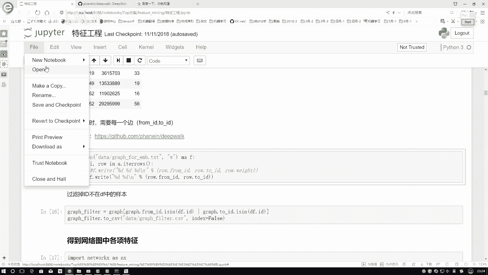

这个文件夹叫做一个feature manning，进入到咱当前的文件夹当中，然后它是存到data文件夹下的data文件夹下，然后看有没有咱当前做好的一个graph，for embedding哦。

在这里找一下啊，有的这个就是这个点TIT文件在这里啊，有这点TXT文件之后，我们来执行一下咱当前呃创建向量的一个命令。

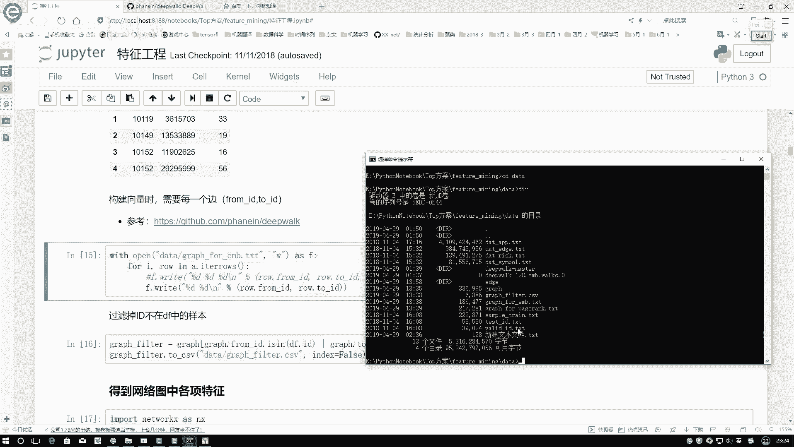

命令是在这里，就是它已经给你了一个嗯，就是这里它有个小例子啊，咱们直接把这个命令复制过来就行，但是这里我们不用这么多命令。

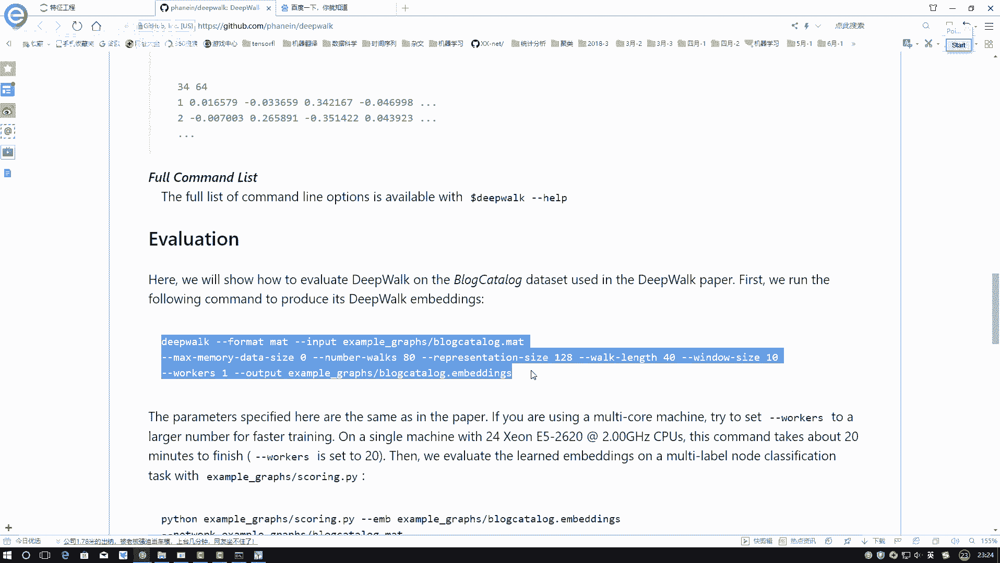

我们只用其中一部分，我先复制一下哦，这里看一下诶，他怎么没有复制过来，我重新复制一下。

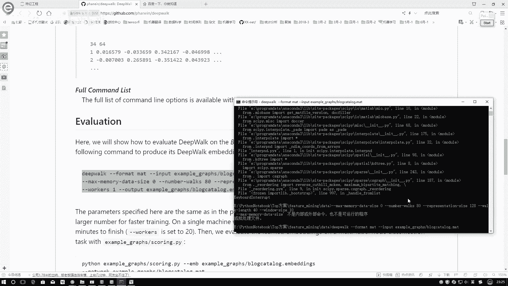

算了，我先把复制到浏览器当中。

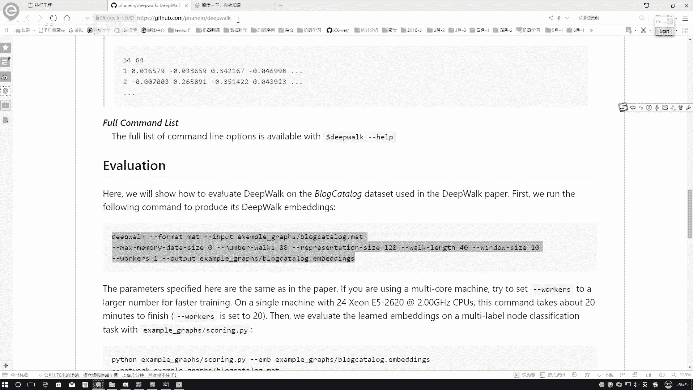

重新复制到咱这命令行里边，哎这个复制进来了，这样到时候大家指定的时候，咱们一些不用的参数我们都可以去掉了，然后需要着重的就是改几个，第一个就是一个format format。

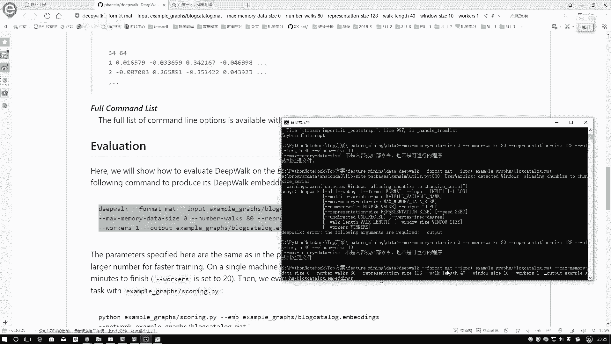

这样就是它这里边提供了几种不同的类型啊，咱们来看一下咱们是哪种类型，咱们应该是第二种类型吧，这是什么BN的类型，其他类型咱们暂时先不用了，边缘类型form my id to id。

所以说咱得把他的一个format。

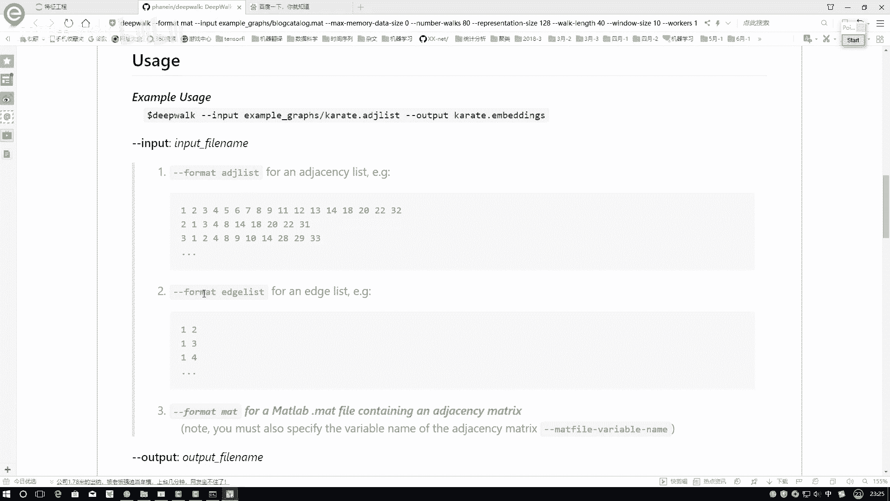

指定成咱的一种边的绿色类型，在这里我要改一下哦，跳到咱们这个点卖，这，然后后面的就是一个输入的一个数据，还有输出的一个结果，也是我们需要改的formulate，咱给他改成编的类型。

然后input input这个东西啊，就改成因为看一下当前是一个套方案，然后一个data文件夹下，我的一个输入就改成我刚才指定好这个文件，就可以指定好这个文件就叫做这个名啊，把他的名字给拿过来复制过来。

然后下面下面这些参数一会我们都不用啊，到时候大家就是用默认参数就行，这些我们都不用哦，然后电然后最后一个就是一个输出的。

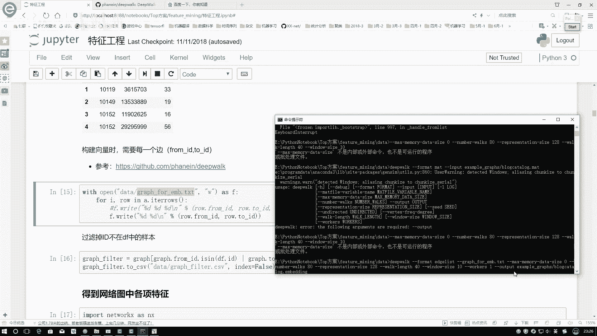

输出的就是到时候大家自己指定一个名字吧，我看一下一会咱叫什么名字啊，用的时候，一会因为我们还要把这个结果读取进来的嗯，叫做一个先叫一个128的吧，我们把它复制过来。

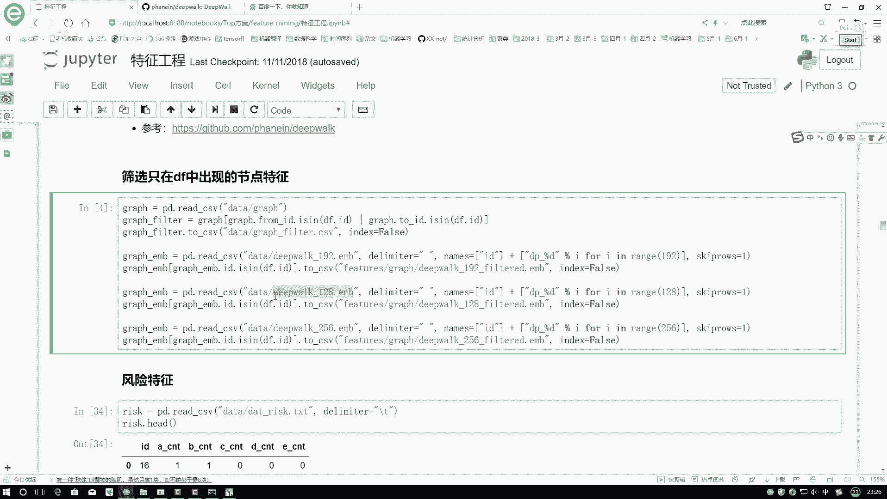

这是我输出的一个名字，然后workers这个参数我们不需要，然后我再看一下它的一个windows size，黄窗口大小，Work work klouds，这些我们不用去改了，这个是它的维度。

你看咱要做120，就是相当于一个磁向的维度，如果这里就是一个顶点，它的一个向量维度，你只能成128，它就是一个28维的这个意思，然后他的一个max memory，咱把这个去掉，要不然可能会遇到一些问题。

这个去掉不做限制，然后看一下这里基本能指定的都指定了，再执行一下，执行过程当中啊，这一步可能速度会稍微的比较慢，看一下他缺了什么东西，它缺了一个input是吧，哦这块我少写了一个。

刚才把input不小心给它去掉了，指定一下input，然后看output都有再执行一下，执行过程相对来说会比较慢啊，因为它里边的一个点比较多，而且点点多其实不要紧，你看他那个works有多少个。

有这么多个，所以说它计算起来相对来说会比较慢啊。

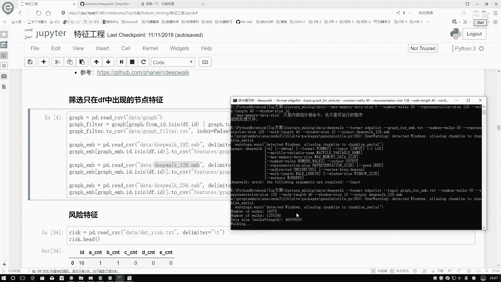

这个执行过程当中啊，就不需要大家自自己去等，如果说你觉得这一步执行太慢怎么办呢。

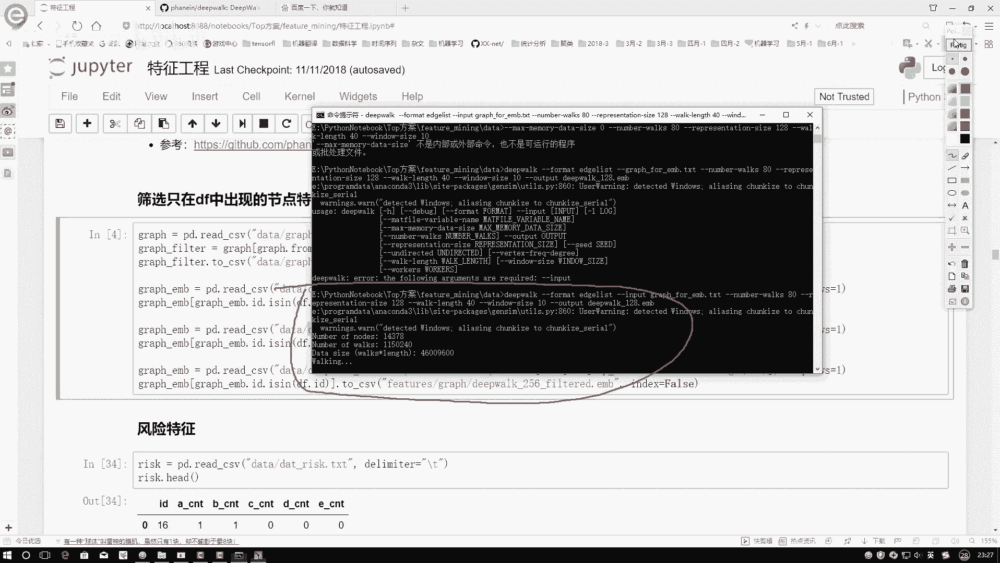

你在那个顶点筛选过程当中啊，你选择1万个可能有点多，选择1000个其实也行啊。

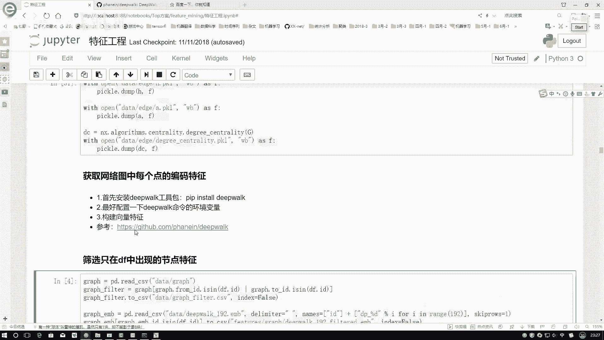