# 完全可自学！人工智能金融领域知识图谱+Python金融分析与量化交易实战全套课程！入门真的超级简单！——机器学习／深度学习／NLP自然语言处理 - P19：03-3-连续指标变化情况分析 - AI算法-漆漆 - BV1Wgz3YVEx1

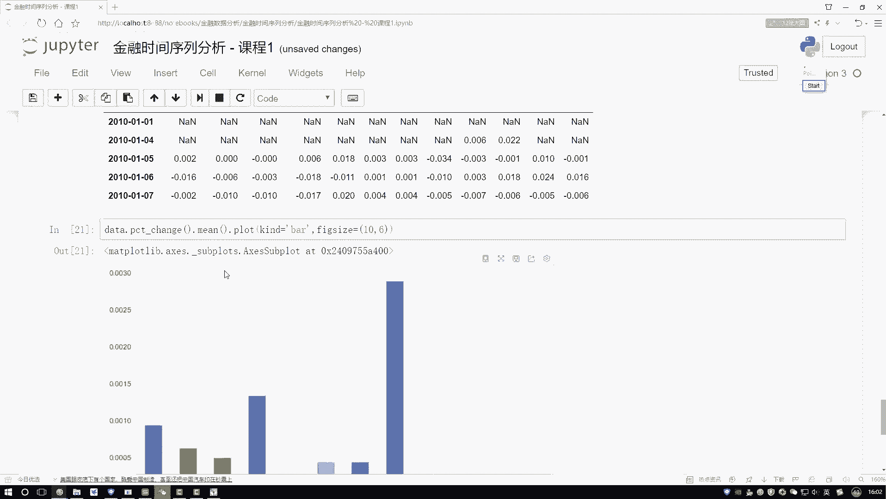

那我问大家一件事儿，诶这个平均结果啊，我可不可以做一些加法的操作呢。

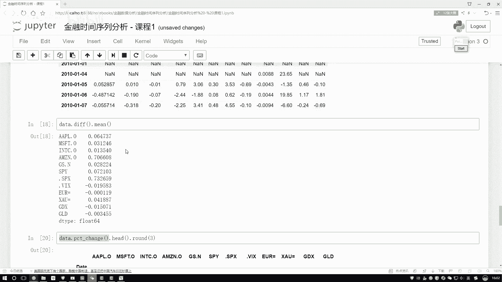

你看这里现在我们观察什么啊，是一个平均结果，那相当于一个从整体上来看啊，这样一个结果是不是，那我能不能对一个连续时间，算它的一个增长率呢，什么叫一个连续时间算它的一个增长率啊，我为大家举个例子。

比如说这样，比如这样，现在我有一只我我现在我有一只股票啊，现在这个股票是100块钱，可以吧啊，比如说是我我写个第一天的价格是100块钱，然后呢第二天第二天啊，它这个跌了啊，跌成个50块钱行吧。

那你说啊对于这个两天来说，对于这两天来说呀，我的一个增长率是多少，那是不是说用50哎减去一个100，再比什么，再比上一个100是吧，那就是负的50啊，减去比上一个100是不是那好。

第三天第三天这个东西啊，如果它涨了，涨到一个75，那你说第三天来说，那是不是用第三天减第二天的呀，那它就是一个75，减去一个50，再比谁再比上一个50吧，那咱们来看一下，对于当前这个结果来说，哎你看啊。

之前我们大家想就是增长率这个东西，我能不能把各个指标增长率，就是把咱整个这个序列啊，我算出来这个增长率，然后一个加到一起，我当做最终的一个总的增长率啊，哎我能不能这么去算啊，大家感觉好像没什么不行的呀。

增长率加呗，加完之后算完就走一，增长率总和增长率反个整体行不行，好像来说够呛啊，总总这样就不是反应，整体是反映第一天和最后一天他们的一个结果，那能加吗，再加试试吧，你看这个加法一旦做完之后，咱等于什么。

这等于一个-0。5，是不是，这等于什么，这等于一个正0。5+1起，怎么样等于零，一旦看到零，咱们可能觉着哎呦，从第一天到第三天，中间隔了两天，隔完之后呢，我算了一个累加的一个增长率等于零二。

那就说明我这个股票那就是没跌，它也没涨，但是呢我们来观察一下原始多少100，现在多少75，跌没跌啊，跌了吧，所以说对于这个增长率来说，能做加法吗，不能做吧，那这一回那大家可能想哎呦。

那我现在一个连续时间的序列，如果说我想做一些累加操作。

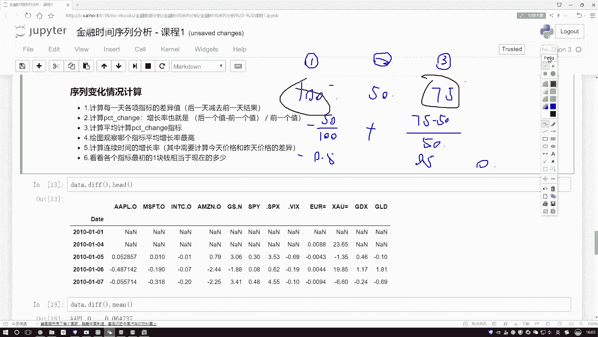

我们该怎么办呢，那对于连续的计算，我们需要借助上一个数学公式啊，就是一个对数给大家举例说明一下吧，咱们实际当中啊是怎么算的，这题啊，我们用对数对数当中呢，比如说啊我们的后一天数据，再比上前一天的数据。

那比如说刚才咱们不是说了，第一天是100，第二天是50，第三天是一个75嘛，那就是这里哎我们后一天那就是一个50，比上一个100是吧，然后呢再加上什么，再加上一个第二天的，这不是第二天的。

就是下一个序列的，下一个序列就是一个75，那比上一个50是不是就可以啦，那这回咱们来看啊，之前咱不是说了吗，我这样一个连续的一个增长率反了什么，那第一天和最后一天的结果之间，做了什么样的一个差异吧。

那怎么样描述出来这个指标呢，你看我这个对数当中，如果说咱都以E为底，可以吧，都以E为底的时候，那对数的加法那等于什么，等于对数当中里边的一个乘法吧，那就是50比上一个100，再乘上一个75。

比上一个50等于什么，等于对数当中75比上一个100相当于什么，最后一天的跟第一天之间一比，它们之间的一个差异是有多大吧，是不是这样一个指标，我们给它计算出来了，那其实这个指标你形象点说什么意思呢。

就是说比如说股票股票一开始十块钱，然后呢十块钱完之后啊，然后他经过了好多次呃，就是时间序列，然后有涨的有跌的，有涨的有跌的，你把各个值，把各个这个增长率哎，给它用对数，然后累加一起，最后相当于什么。

那不就相当于最后一天跟第一天的一个结果，之间的一个差异了吗，那这个的意思就相当于你第一天股价，这个钱相当于最后一天他是多少钱啊，说白了就是一开始股价的一块钱，110年股价是一块钱。

相当于最后一天股价是多少钱了啊，大概是这样一个意思啊，为大家写一下。

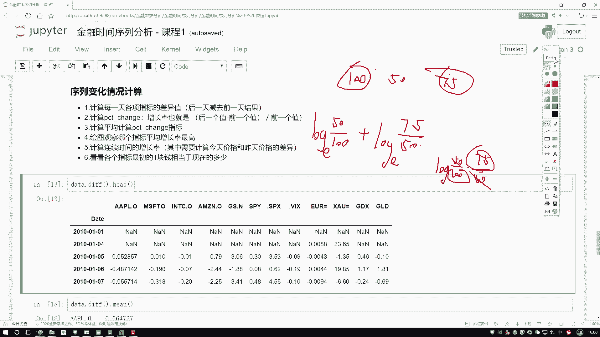

就是咱们的一个计算方法好了，这块我们计算一下连续时间哦。

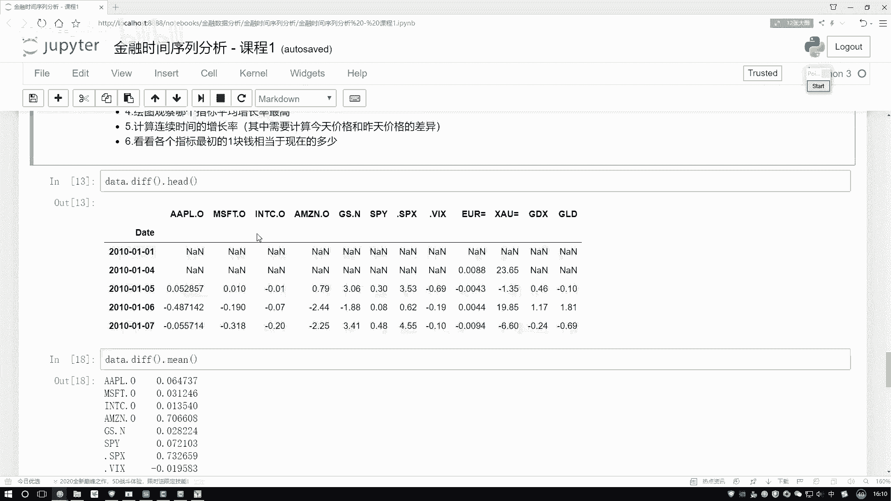

呃在这块我们来计算一下吧，这个计算呃好像没有什么特别公式，我们自己去写一下，首先呢我们来写就是data比上什么，比上它的一个前一天的吧，哎呦这个前一天数据咱怎么样能得到啊，哎这个问题来了。

前一天数据怎么得到data当中，我说我把这个数据啊，要是你看这里，如果说这个数据要是每一天啊都能往前滚一下，就是这样，一开始是这个位置，我说给它都往上移这么一格，把它移上去一下。

那当前这一天的是不是就变成前一天的了，是不是这样一个意思啊，我想把它往上移一格，是不是就行了呀，那怎么移这一格呢，嘿不用担心了，有这样一个函数来帮我去做诶，点shift一下，shift当中啊。

你可以去选哦，移几格，比如说这样吧，我先移一格给大家看一看。

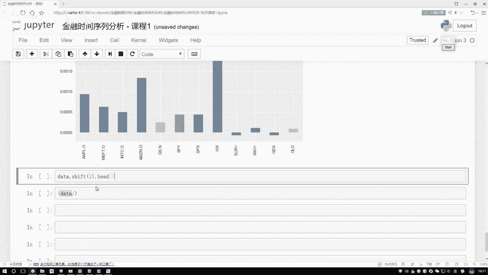

你看啊，这个1月5号来看看，这个月5号他现在是呃30。572是吧，来看1月5号30点572，30。572，其实是谁，其实是1月4号的吧，所以说我们现在这个1月5号的，是不是就表示的是前一天的数据了。

那比如说现在我们有一个data，我们还有一个data点shift完的，哎，你看这个data点我这个鼠标有点有data点shift完的，shift就是一个一的，那你说我怎么计算我这两天之间的一个差异啊。

哎这是正常的数据，这数据都往前回滚了一格，我做一个减法，是不是就直接得到了数据，两天之间的一个差异的结果啊，啊所以说我们的做法还是挺简单的，这里咱们只用data啊，我们的当天数据比上什么。

比上它前一天的数据是不是就行了，然后呢咱们之前说了，哎这块我们要怎么办，是不是你得给我引入一个对数啊，来表示当前结果啊，好了再指定个returns，等于当前我做的这样一个结果。

然后呢把这个结果展示一下吧，哦这个结果现在执行一下，执行完之后，然后给他点HIIT一下好了。

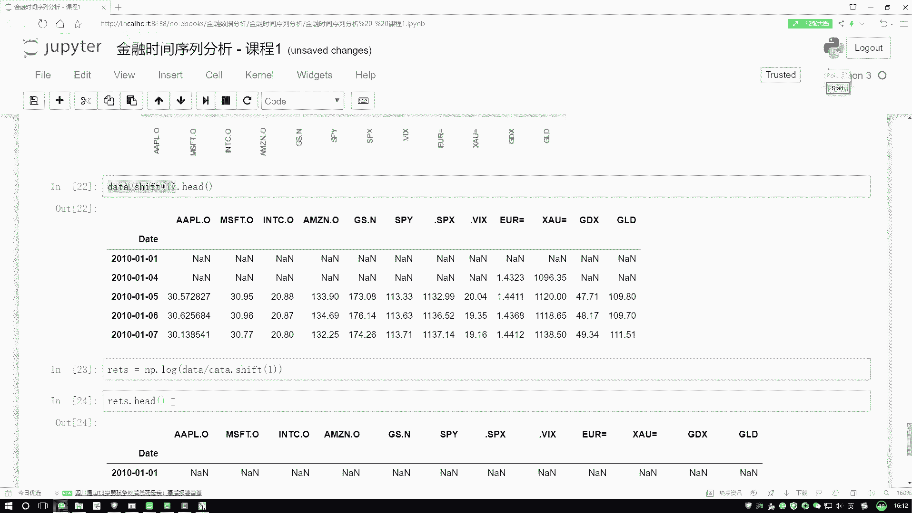

这个结果已经显示出来了哦，还是点load一下，然后只保留其中几位行。

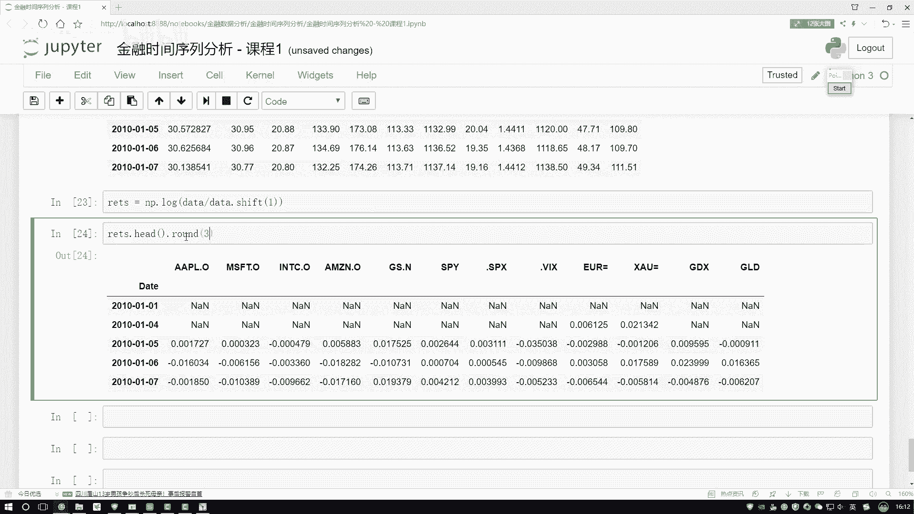

这我们是不是算出来了，当前我们的一个什么李岩续的啊。

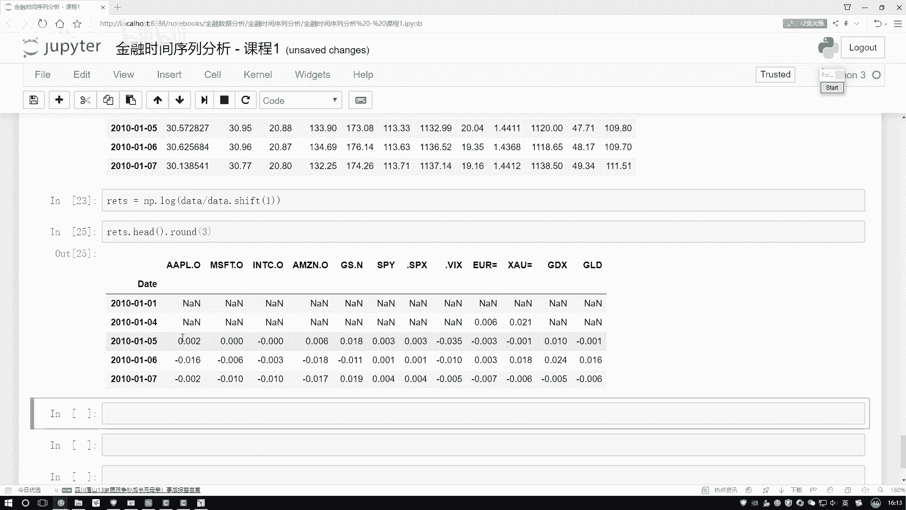

一个增长率吧，说白了就是第一天跟后面每一天的。

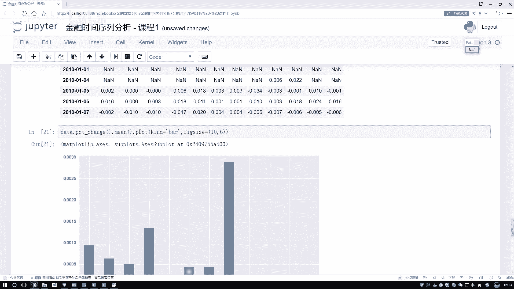

我都能算出来有第一天的价格啊，就第一天是一块钱，相当于第八天是多少钱呢。

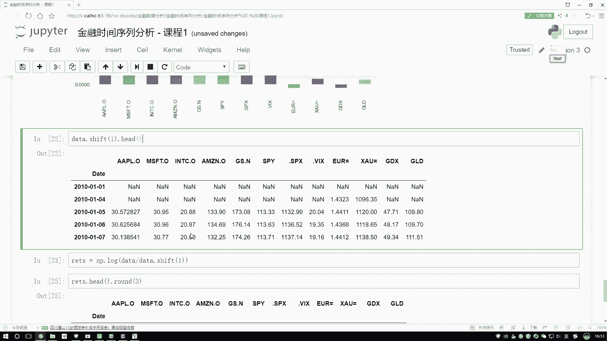

相当于第30天是多少钱呢，各个指标值咱是不是全全有了，那其实现在还没全有，现在我们只是算了一个中间结果是吧，我们还差一步还差一步，差什么，我们没有把这个结果给还原回去吧。

我们只算了一下这个连续的一个增长率。

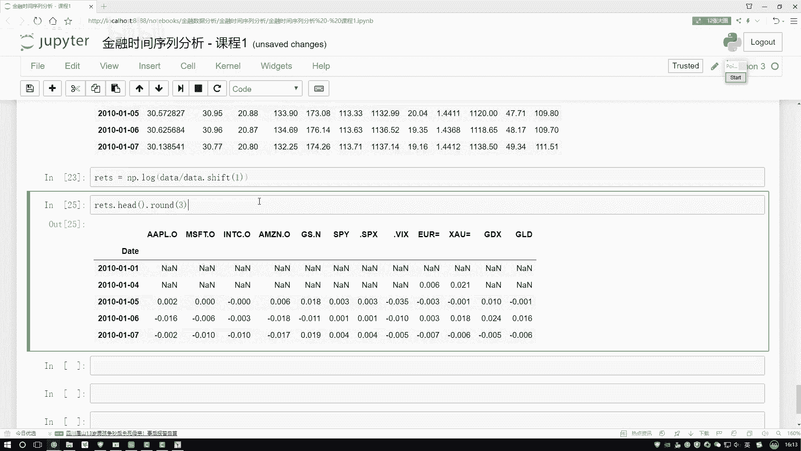

它的变化情况吧，那你说怎么样给它还原回去啊。

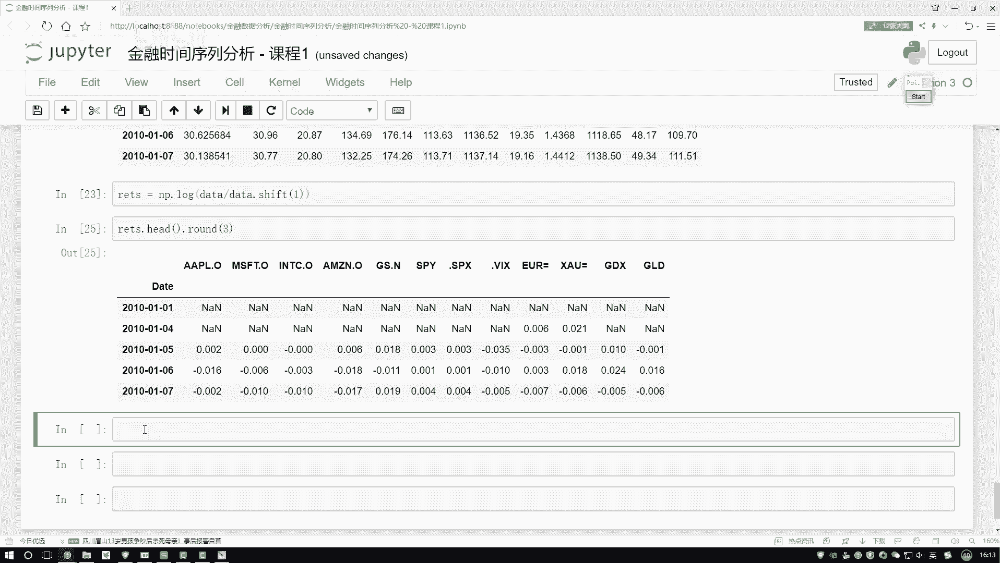

咱们实际上是不是在这里，哎我刚才还看了一下，我们有一个要求要干什么来着。

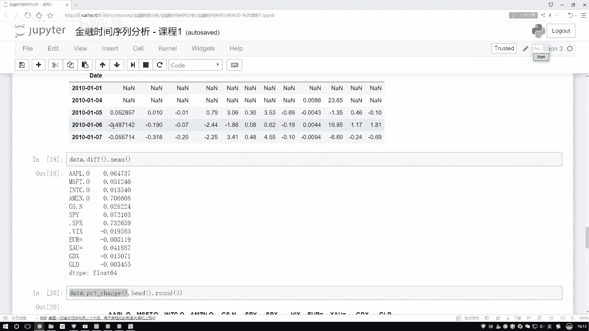

我要统计啊，看各个指标最初的一块钱相当于，比如说10年的一块钱，相当于一年多少钱，相当于12年多少钱，相当于13年。

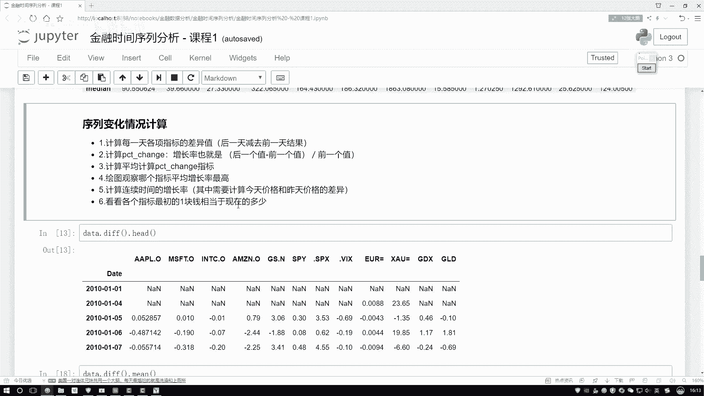

14年，18年多少钱，对于某一个股票来说，我是不是要把这个结果给他算出来啊。

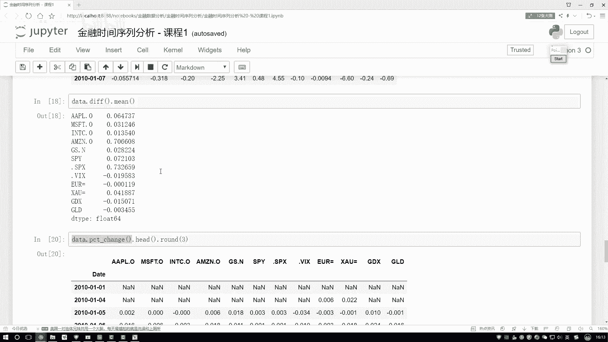

那怎么样统计这样一个指标啊，那比如说这样我要画一个图，我画一个图可能是这样啊，啊就在这个图当中，那比如说呃，这里我就画那个呃那个那个微软的股价吧，微软股价，那在这个10年的时候啊，它值一块钱是吧。

就假设它是一个单位块钱，然后呢我要知道这一块钱相当于11年的啊，比如相当于11年的两块三，然后相当于12年的四块二，然后一直点点点点点的变化，相当于比如说19年或者是20年，咱这数据没有，20年。

咱数据就到18年，我想看一看它相当于18年多少钱，是不是也是股票的一个走势啊，或者相当于我手里的股票。

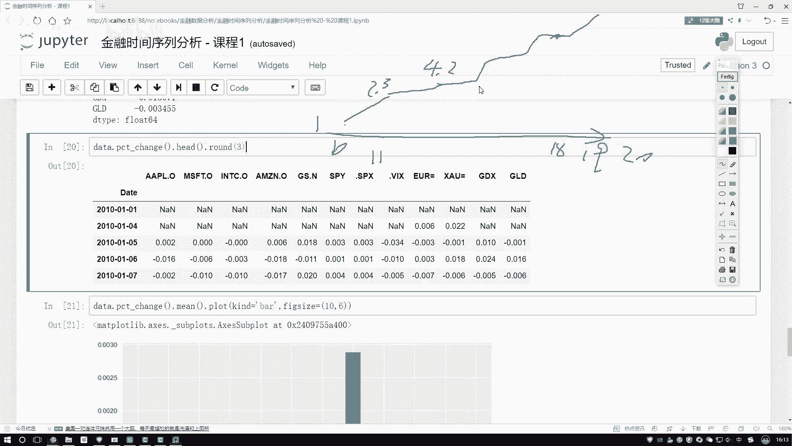

我这么多年翻了多少番吧，咱是要观察这样一个指标值啊。

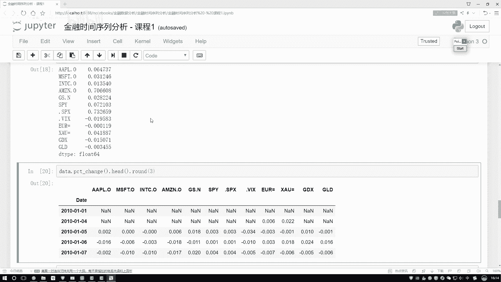

对实验学员来说挺长，统，就是经常会统计的一个值吧，怎么做怎么做这件事啊。

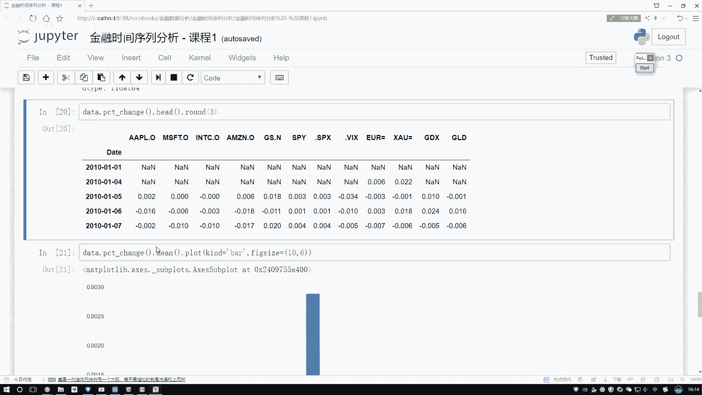

第一步，那你说我现在哎在统计过程当中，那你说这个11年的时候，你看我现在我这个10年一一年，12年，13年我就写14年得了，那对于10年来说呀，他是不是得把前面的值都加在一起呀，是不是。

那对于12年来说呢，12年来说，它得把1011和一二的都加到一起吧，哎一个做一个加法操作吧，咱之前说了对数做加法，相当于我直接得到第一个和最后的一个关系吧，是不是这样一件事，那13年呢。

13年这里我是快颜色都快快化没了，13年这里是不是要算他们的，然后最后一个红色的14年要算这样一个值啊，这是什么累加吧，那这件事怎么去做啊，怎么做，其实有函数给大家简单来看一下这个函数啊。

叫南派点CONSUM项目，嘶com sum当中给大家举个例子。

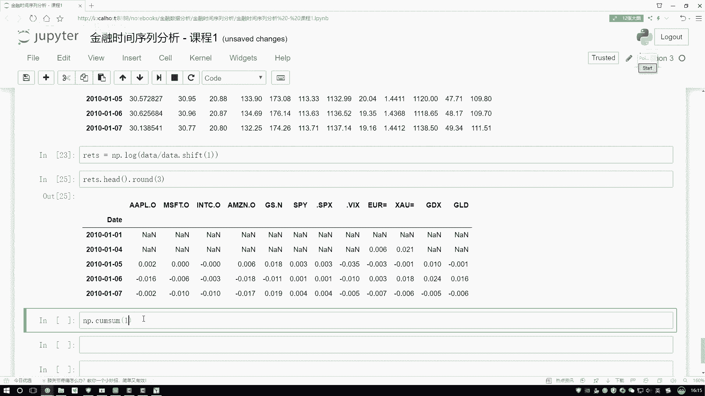

比如说1234吧，咱先来看结果，我看这个总和他有报错了哦。

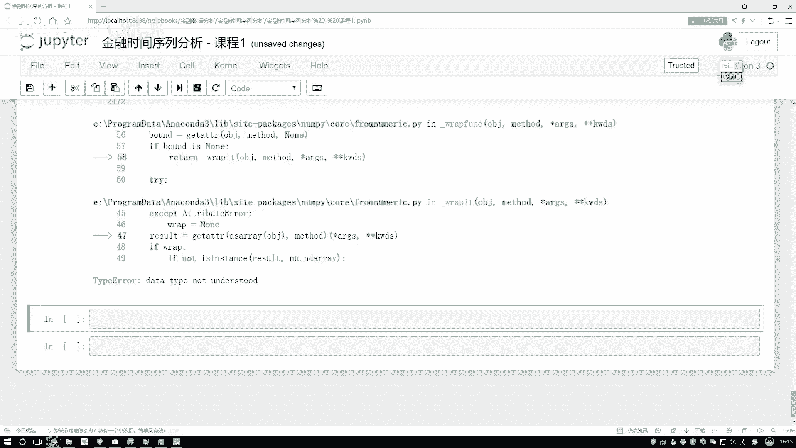

对type哦，这块我应该传一个序列啊，传一个list diss当中1234可以吧，你看他给我返回什么，136 11是什么，第一个值二呢，按第二个位置为什么是三啊，1+2=3吧，第三个位置为什么是六啊。

1+2加三等于六吧，第四个位置，为什么11+2加3+4=10吧，好了，函数给大家列出来了，那你说咱一会儿在做的过程当中，是不是也是借借助于这种CONSUM的方法。

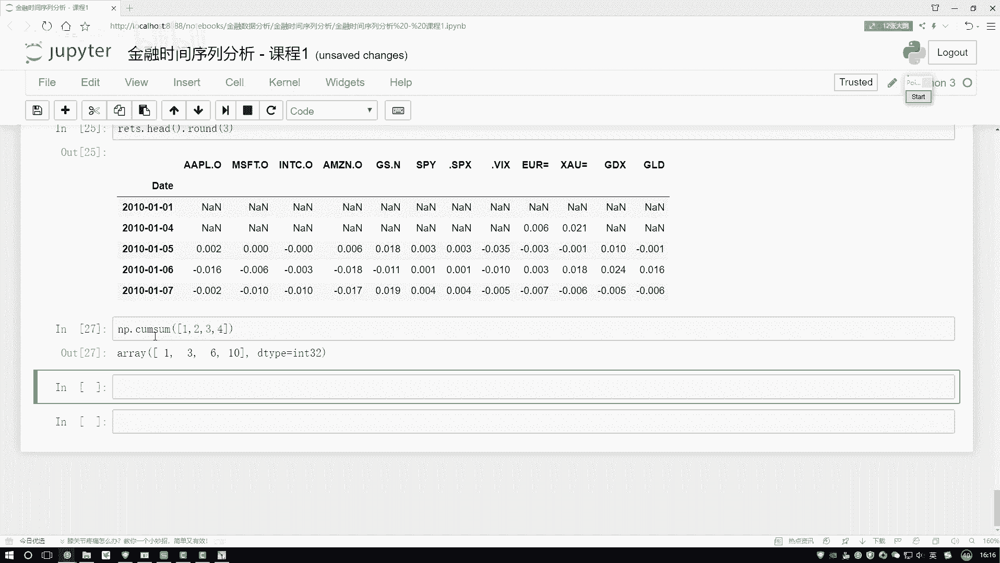

来去做呀，那对谁做操作啊，这块都给大家列出来了，这南派各个就是跟其余时间序列，哎我各个地方的值咱是不是全有啊，把他们干什么做累加不就得了吗。

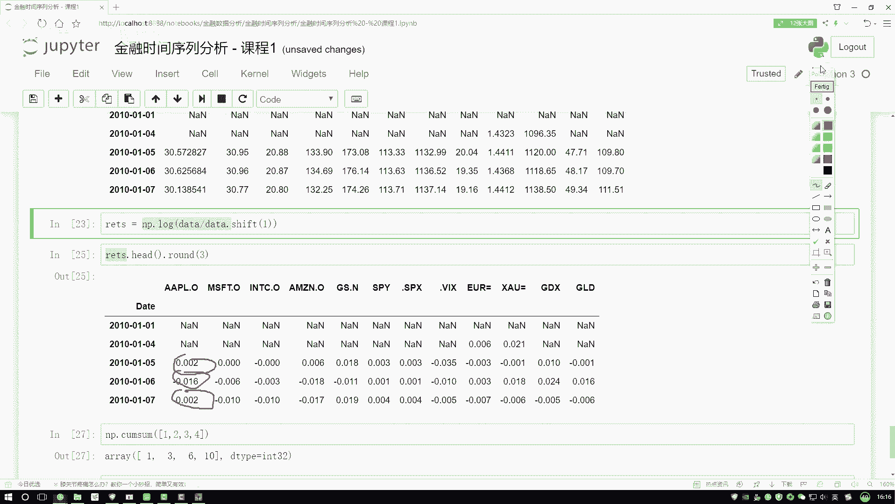

好了，把这个结果拿过来，对这个结果做什么啊，做一个com sum操作是不就行了，对它只用com sum操作，但是呢哎你看之前我说这个结果，我为了咱能实际做计算啊，引入了数学上的一个公式叫做一个对数。

是不是。

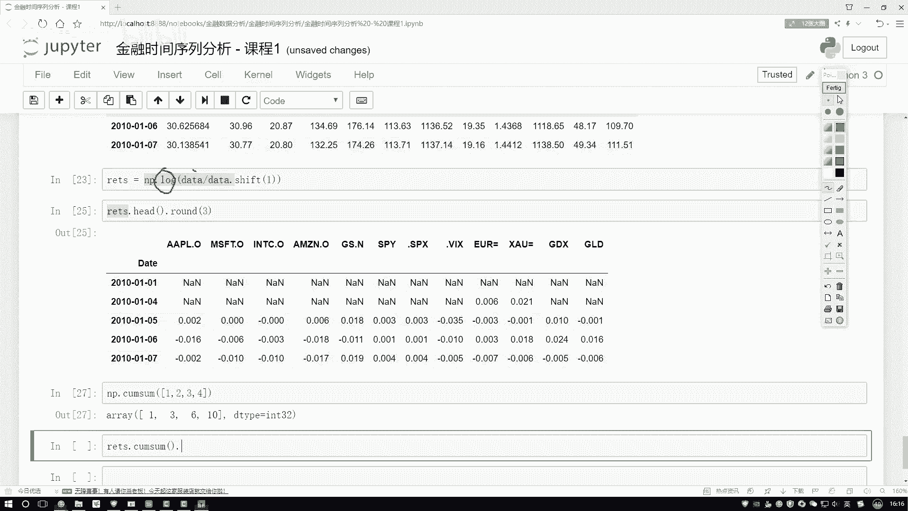

那现在你是不是讲到底你得给我还原回去了，还原回去怎么办，咱得给他怎么样做一个南派，点多少E的多少次幂吧，这是E叉，P表示E啊，咱之前默认npre log啊，就是E为底的。

所以说此时当我在执行的时候点app操作，咱之前讲那个pandas基础的时候，是不是说过了，对其中每一个都执行让操作吗，咱要还原啊，回完之后呢，我顺便把这个图给大家画出来吧，呃这个图然后它等于一个16的。

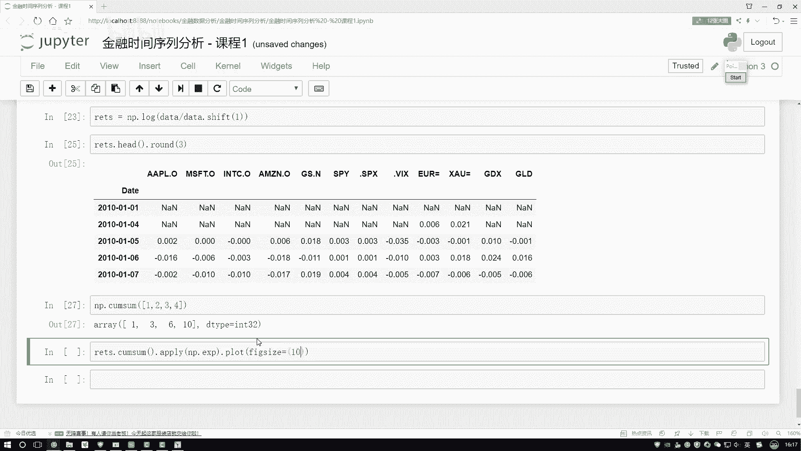

然后再来执行一下，看一下这个图的结果，你看是不是像我刚才说的，最开始就相当于这块一，也不是相当于一块钱。

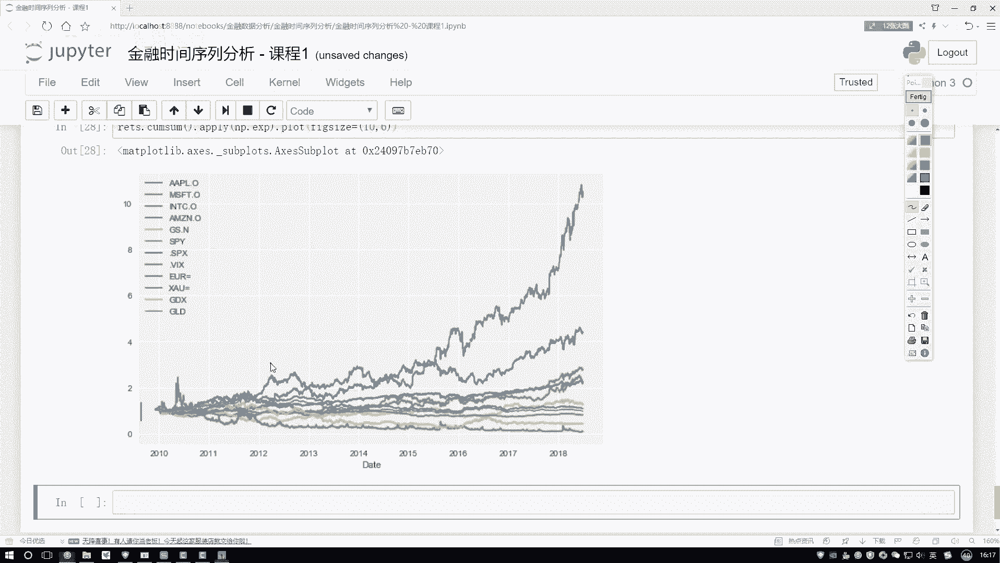

就当一个单位吧，啊其实对股票来说，你就当做一块钱吧，一块钱相当于11年多少钱，相当于12年多少钱，131415161718是不是全有了啊，我看我看最最猛的是谁啊，最猛的是啊，亚马逊这个是吧。

之前他10年的一块钱，现在已经能相当于什么了，十块钱了吧，咱是基于什么连续的一个增长率，来去做计算的吧，哦然后你看下面的第二什么，第二个第二个是苹果的是吧，苹果的大概是呃四块多是吧。

这是大概翻了多少番啊，这个意思，那你要拿拿那个茅台来说，可能翻的更多啊。

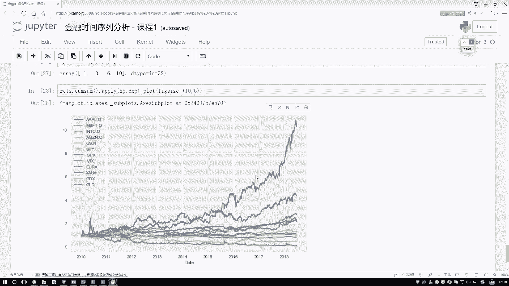

行了，这是给大家看了一下，就是对于我们的金融时间序列来说呀。

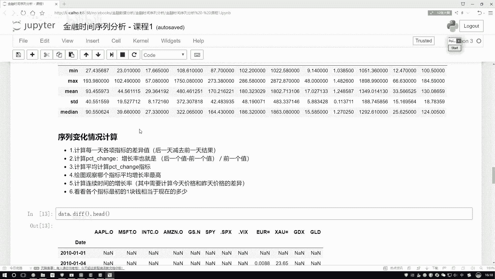

我们能统计的值其实挺多的，在这里呢是给大家列出来了一些经典的，不是说经典吧，就是常用的一些操作啊，我们怎么样计算一个差异值点difference一下，非常容易吧，差异值我就算出来了，第二点呢，增长率。

增长率啊，像我刚才说的一个差异值，可能有很多时候都是没什么价值的，多了少了一块，对于不同任务来说，对于不同的指标来说，可能你衡量起来，那这个一代到底代表什么，不好说吧，好了。

我们提到一个增长率后一个值减前一个值。

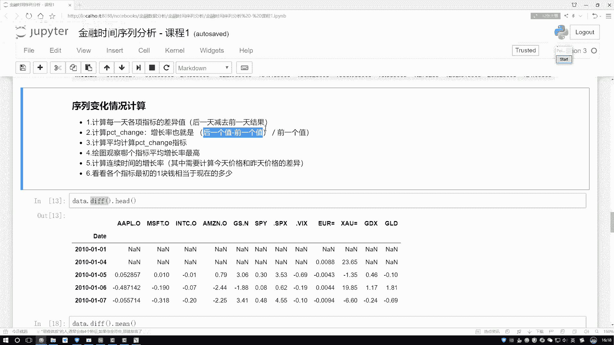

再比上前一个值很简单吧，然后呢给大家绘图啊，画了一下啊。

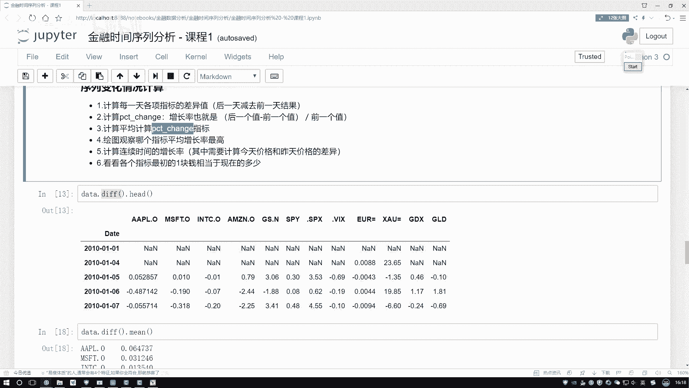

也比较直接，然后呢我又说了一下增长率这个东西啊，你算平均的行，但是你不能给我算一个累加吧，因为累加在一起它是没有意义的吧，所以大家举了个例子啊，那如果说我想算这个累加呢，我想算就是第一天啊。

相当于后面几天的多少倍，再相对于后面几天多多少倍，怎么算呢，它是不是一个连续时间增长率啊，我们引入了数学这种方法，做做什么，做一个对数吧，不要忘记啊，对数这块你做完之后，如果你想还原到实际数值。

是不是得再给它还原回去呀，啊有这样一件事吧，最初咱统计了一下，当初唉最早的一块钱相当于现在多少块钱，暑假做完了一块钱相当于多少哈。

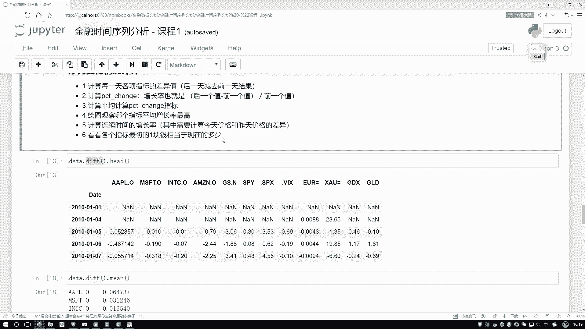

有有有比较强的公司，相当于十来十几块钱。

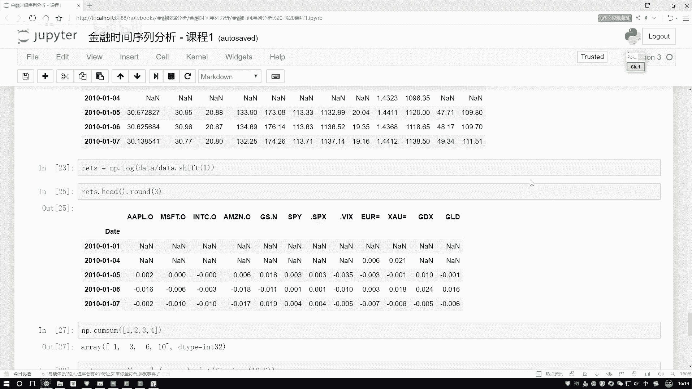

其他的那其实走势都挺高的，但是呢也有一些指标可能是下降的，可能保持不变的吧，啊反正就是当初你要买这些股票的人。

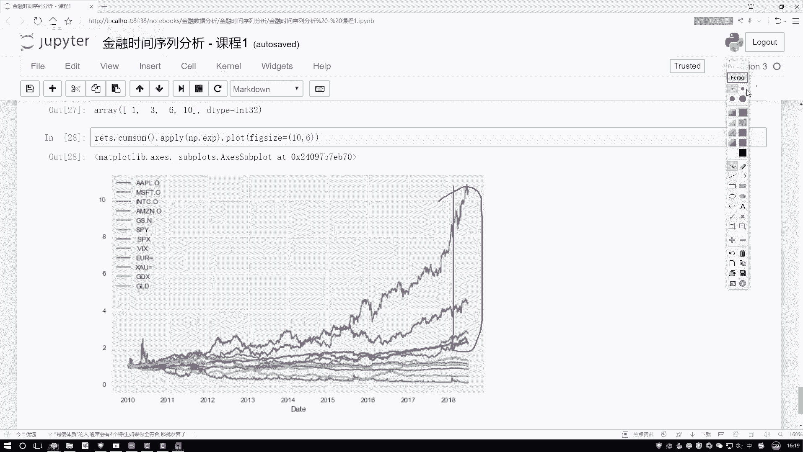

基本上都发了，是不是这个意思啊，好现在大家看了一下，就是我们对这个金融时间序列当中啊。

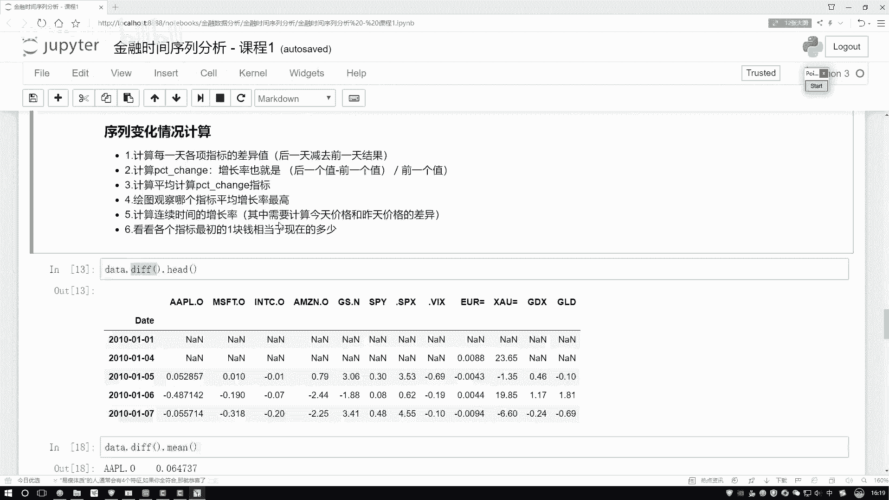

一些序列的啊，我们的计算操作都该怎么样去在pandas，还有安排当中啊。

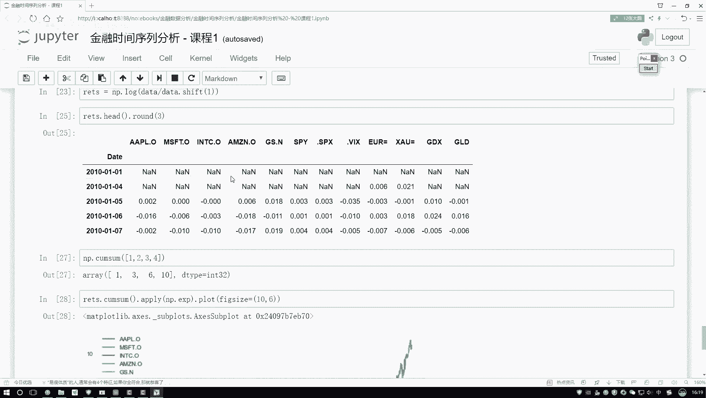

实现出来。

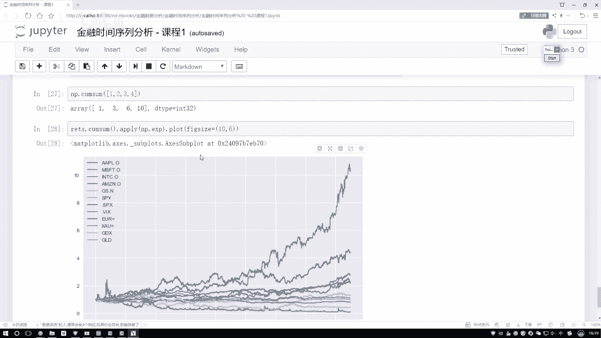