# 完全可自学！人工智能金融领域知识图谱+Python金融分析与量化交易实战全套课程！入门真的超级简单！——机器学习／深度学习／NLP自然语言处理 - P28：01-1-回测收益率指标解读 - AI算法-漆漆 - BV1Wgz3YVEx1

这节课咱们来说一下策略的评估指标啊，先说一下评估指标指的是什么东西啊，当我们做完了一个策略之后，那肯定要在历史数据当中啊进行一个测试吧，看咱们这个策略哎到底是赚了还是赔了，那赚了赔了，它并不是一个词儿。

你得告诉我哎比如说赚了多少呢，但相比于大盘来说，我们比大盘有什么样的一个优势呢，以及当我做了这样一个投资之后啊，或者说当我做了这样一个策略之后，我会遇到哪些个风险啊，我做这个风险是值得呢还是不值得呢。

以及诶我的策略跟别人的策略相比，那有什么样的一个优势啊，这个就是我们要做的一个策略评估指标了，我先给大家看一下，就是后续啊咱们要用到的一个呃策略平台。

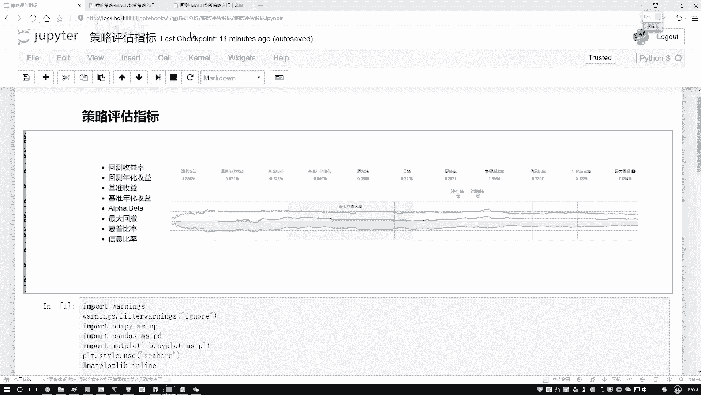

这里呢我先不介绍啊，这个平台干什么的，咱们先来简单的去了解一下我的一个结果，咱们讲这个策略评估指标主要是做这个分析的，你看这里哎咱们就其他都不管啊，就是看到几个字就行了。

你看这里是不是说当我们做了某一个策略，你不用现在去管是做什么东西，等后面课程当中我会详细给大家去解释啊，当前哎我们这个平台他做了一件什么事，以及呢我们要做什么样的策略，什么样的实验。

我们现在只需要关注啊，就是有哪几个指标，你看这里这些指标是我们最常去说的，然后一会儿呢我会在咱这个notebook当中，一个给大家去讲啊，这些基本的评估指标啊，他们都是什么意思。

以及那我们的计算公式是什么，主要啊，就是大家可能看这个计算公式看起来挺长的，挺闹心的，没关系啊，最好是去通俗的理解就可以了，我建议大家就是对这几个指标哎，一说你就知道大概什么意思就行了。

不用把公式背下来啊，公式我只是给大家简单的描述一下什么意思，主要呢，咱还是得知道这些指标表达是什么东西啊，其实说白了就是为了让大家能看懂什么，看懂就是咱的一个分析结果当中，呈现出来的各一个指标。

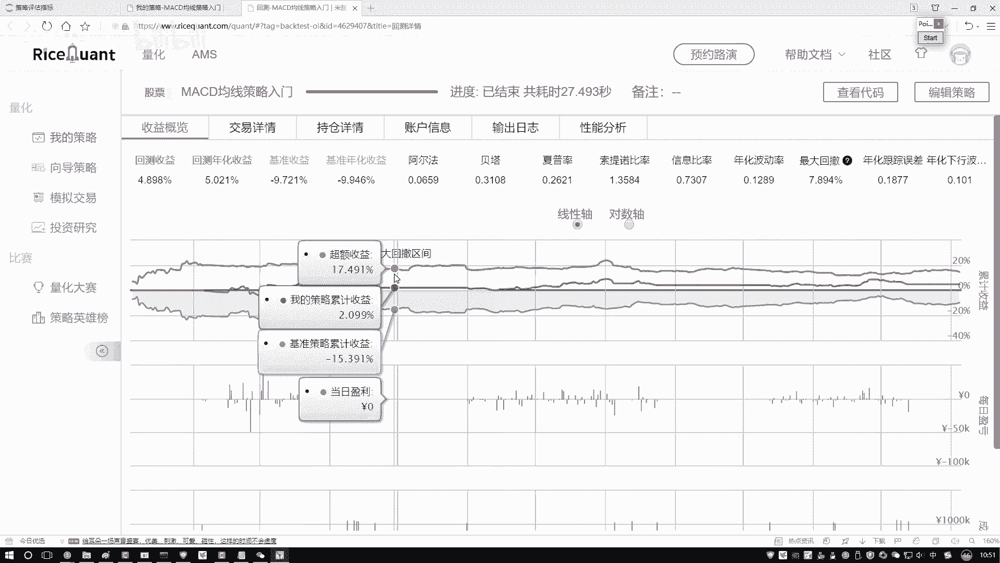

哎，它都是什么样的一个意思啊，行了，我们来看一下吧，这里有哪几个指标。

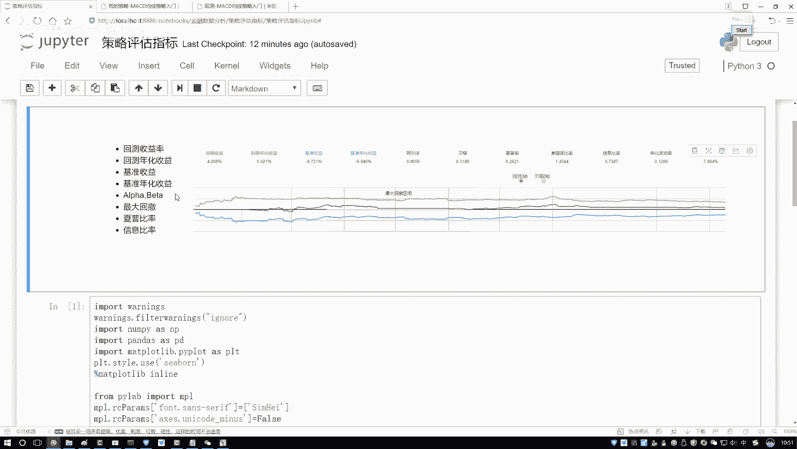

先说第一个吧，叫做一个回测的收益率，一个一个来吧。

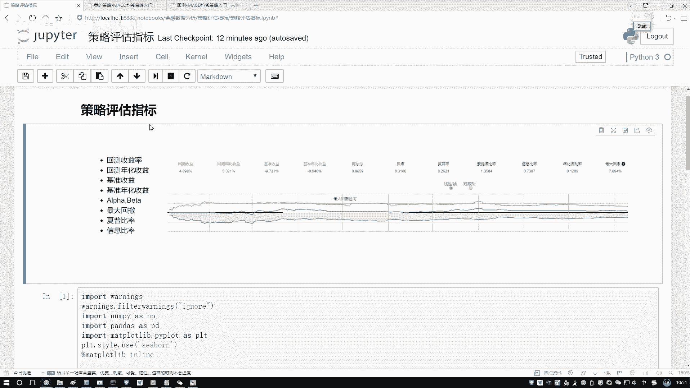

咱一个去说啊，一会儿呢，我会下面就是咱边写代码边给大家去讲啊，每一个策略，然后他都是做了一件什么事，第一步，这样咱们还是先把这个工具包给导进来啊。

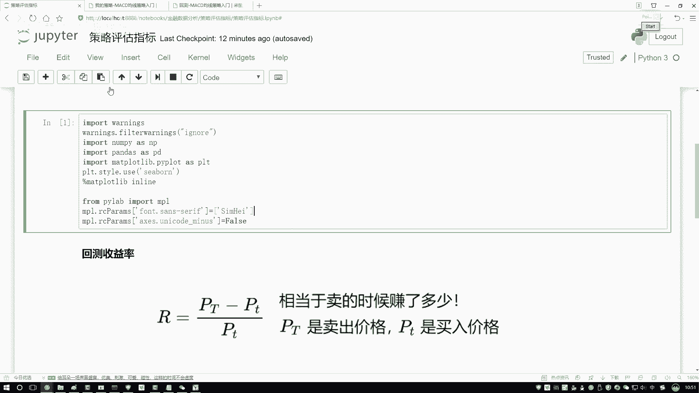

工具包导进来这块呢加上了一些字体啊，主要是呃，方便咱们去写我们的一个中文的数据啊，咱们一会可能要画图，第一步还是先把这个数据给读进来啊，然后呢，一会儿啊，咱们基于啊，我们现在的一个本地数据来做一下。

我们的一个策略，先不用咱们该给大家说这个平台啊，先用Python当中给大家捋一捋都是什么意思，等后续呢咱就不自己算了啊，全是基于这个平台，它自动啊帮我们设置出来的，读一下数据。

然后我说指定一个index啊，就是一个日期是第零个就可以了哦。

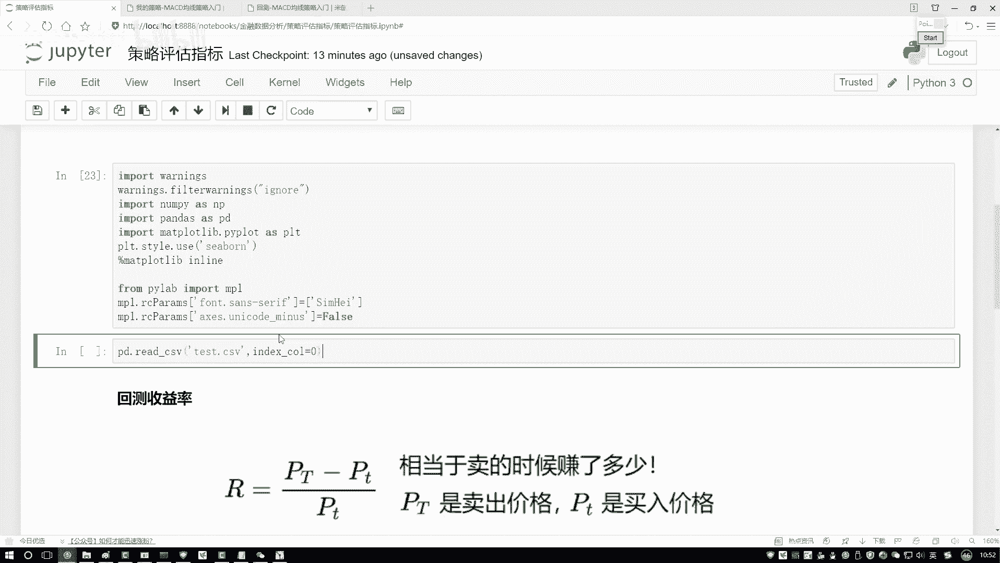

然后指定我们数据名字叫做一个data，然后呢看一下咱们的数据啊。

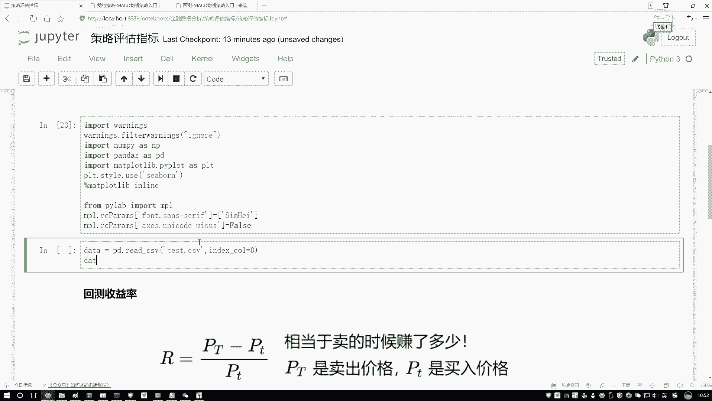

长什么样子行了，这就是我们这个数据啊，然后反正就是有些股票有一个指标啊，在这些指标当中你就看它发生一些变化，然后呢当它发生变化的时候。

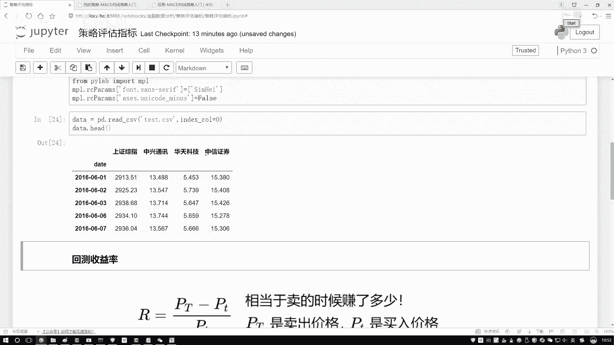

我不是想看吗，就是你的上面你不是跟我说了。

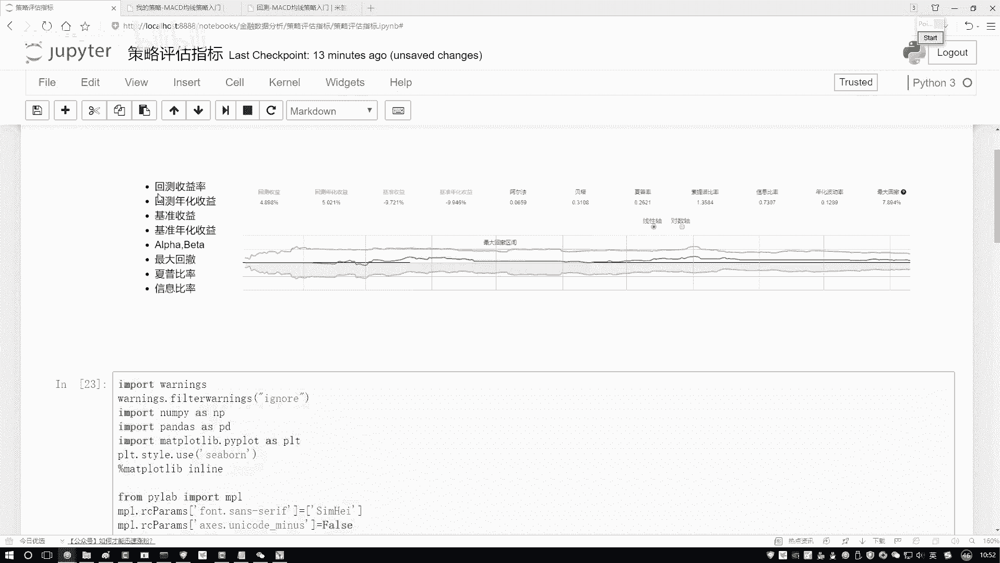

有这么多指标吗，咱来看一看这些指标啊，该怎么样去算啊。

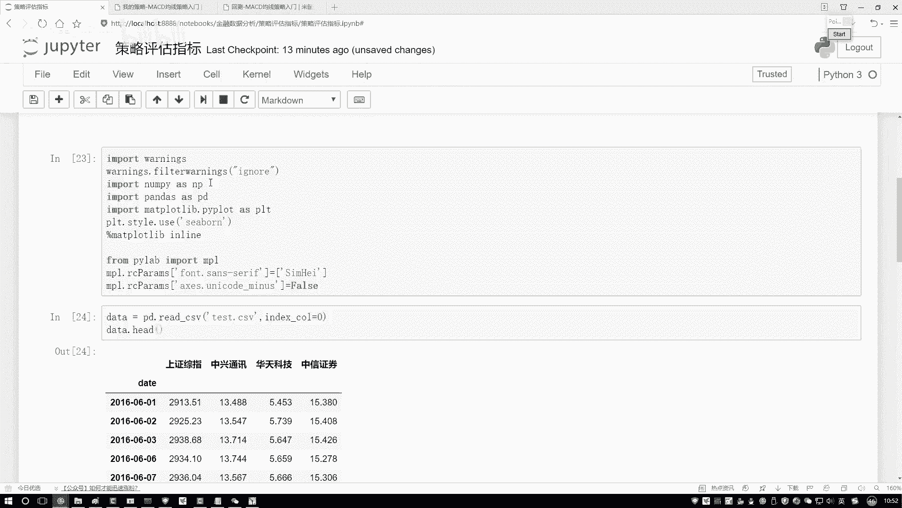

这是给大家提供的一个样例数据，然后呢我们就一个去说吧，啊，先说最重要的一个。

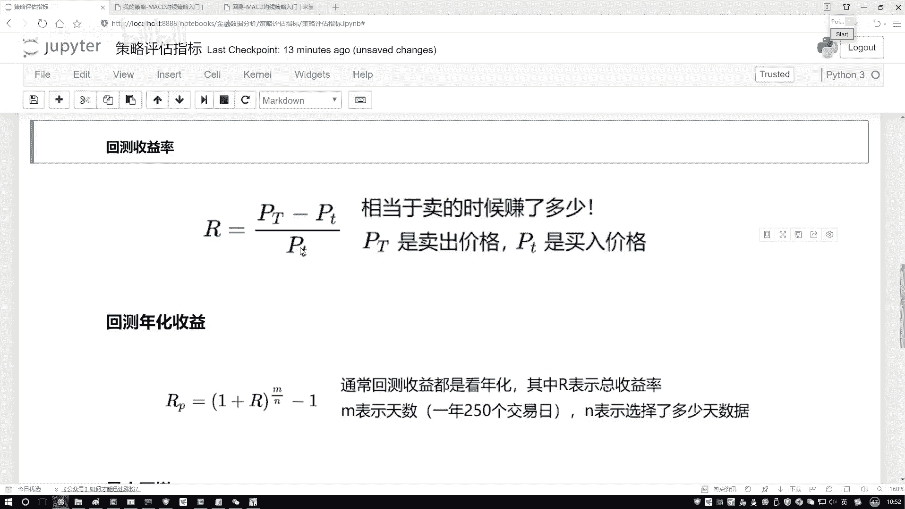

也是最基本的一个叫做回测的收益率，你看这里这块什么，第一个指标就是回测的一个收益吧，回测收益啊，它是这样一件事，就是呃当你做了一个策略之后，那你肯定也要最终知道你的策略。

比如说你说选这个从15年到这个20年的，一个某个股票，每个股某个股票的数据，然后你选了一个策略，然后什么时候买，什么时候卖，然后得到一个结果，这个结果就是哎最终你赚了多少钱啊，但是注意点他是什么。

它不是一个钱的多少吧，是相对啊，你一开始有的一个本金啊，你赚了多少，你看这点，比如说它是一个4%点多啊，你就大概知道了，哎呀我折腾多年，我大概值得我这个赚的一个钱，相对于我的本金来说多了多少啊。

大概这样一件事行。

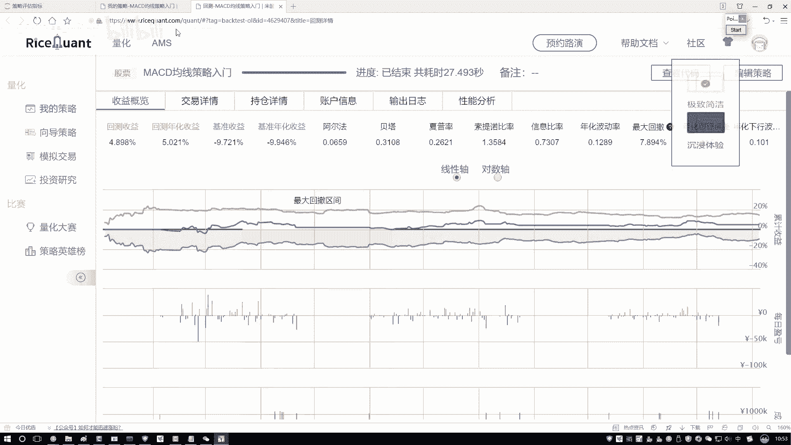

然后给大家看一下吧，就是我们的一个计算公式，计算公式啊，非常简单，回测收益率，你看这里有一个啊pt t，大体的意思就是说咱们现在的一个卖出价格啊，就相当于一开始啊你是有笔钱啊。

然后有笔有笔钱之后你去买了一些股票，这是你一开始有笔钱买了股票，然后呢后来隔了一段时间也卖出去了，我们现在啊就是分子当中，是不是相当于是你赚了多少钱啊，但是注意点赚了多少钱是相对谁来说的，是相对啊。

一开始你有多少钱啊，咱们来说的算了个什么回测的一个收益率吧。

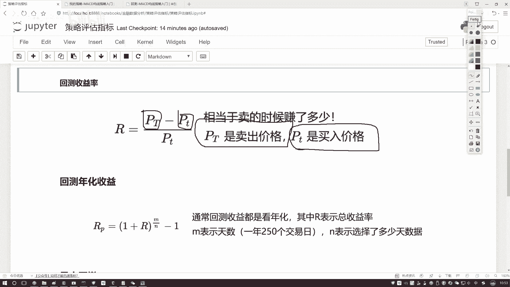

回测收益率啊是咱们呃在这个计算策略吧。

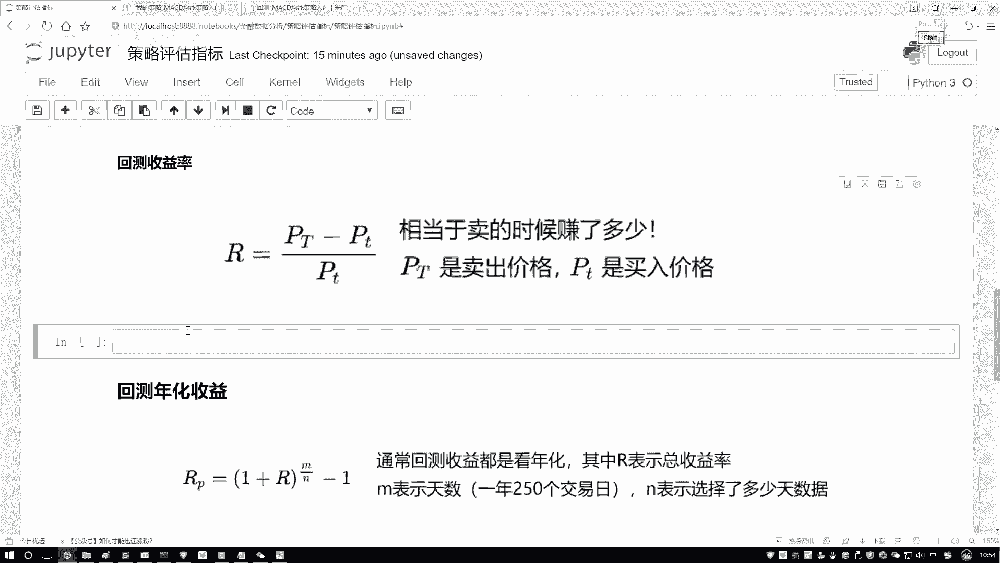

或者说做评估的时候，我们最常用的一个指标了，主要就表示着我们当前哎呀，这件事做的怎么样吧，啊这是我们的一个回测收益率，然后呢给大家来看一下吧，就是咱们这个回撤收益率啊，该怎么样去做这样一个计算。

其实这样啊，我们一块儿画图，您可以画一个图啊，比如这样，现在我们是呃从这个比如说比如说啊15年的，16年的，17年的，18年的，你可以看一下，就是随着时间的一个变化，你的一个回测收益率。

它的一个变化情况吧，我们是可以求这样一个变化情况吧，那怎么求这个事儿呢，那是不是说啊，你用每一个时间点它的一个PT值啊，比上什么，比上最开始它的一个值就可以了呀，来看一下吧，当前我们的一个做法。

后来这里我说这样，我说现在啊我构建一个data frame吧，data frame当中啊都是一些呃我的一个比值数据啊，就可以了，这里啊就是我们先不做这样一个减法，因为我们可以这样。

你看这个东西我们是不是可以这一块做什么，这块做个除法，后面减什么，减去一个一，是不是一样的呀，啊咱一会直接减一就行了，我不做那么复杂，最后减一相当于把这个公式啊，给它做了一个化简来写一下吧。

那你说第一步要算什么，是我得算一下这两个数据它的一个比值啊，怎么算，那我说我构建一个data frame吧，好了，先构建一个data frame，在这个data frame当中啊。

是不是说对于我每一个时间点我的一个结果，你看这是一个结果吧，要比上什么最开始我的一个情况吧，好了，最开始的情况，那就是我什么第一个数据就可以了吧，好了，对于data frame当中，传谁啊。

第一个数据是谁，索引为零的吧，这样我构建完之后，咱们现在得到什么，就是我当前的第一个事儿，这我就做完了吧，好了，咱们现在把这个第一件事做完了，然后呢，我给大家画个图也看一下咱当前这个结果。

对它我说我去做一个float，然后指定一个pick size，等于的稍微大一点。

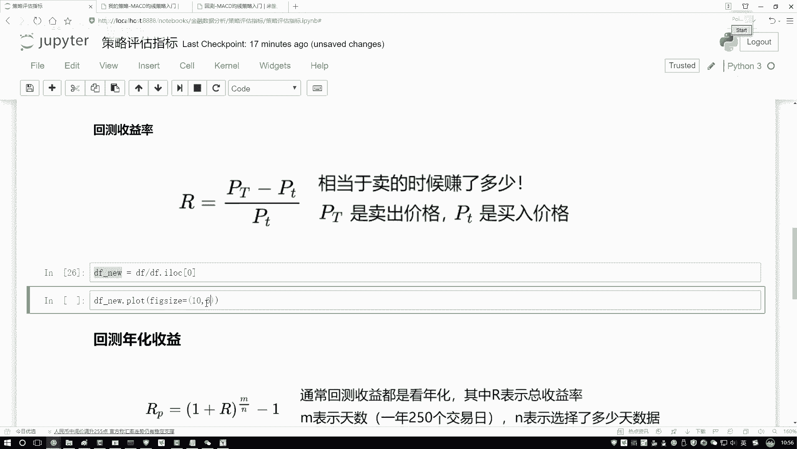

来看这个图，这是什么，这就是相对一开始啊，一开始是一的情况下，我相对于一开始比如一开始是一块钱，我现在把这一块钱变得怎么样了。

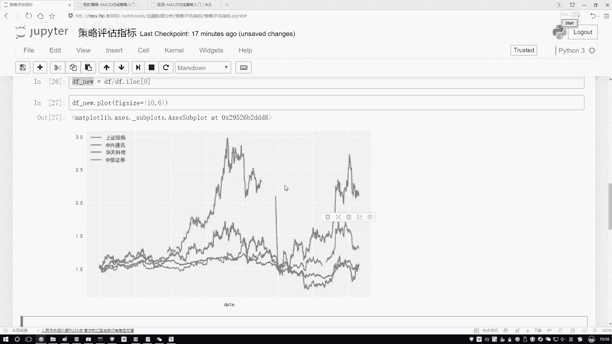

诶通过我这样一个策略是吧行了，那然后还咱还没算完，我们要算什么一个回测的收益率吧，好啦，那我说我最终啊咱的一个回测收益率。

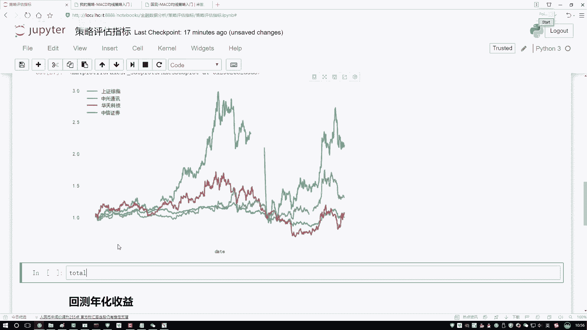

然后一个return值等于什么呢，等于在我的data frame当中去干什么。

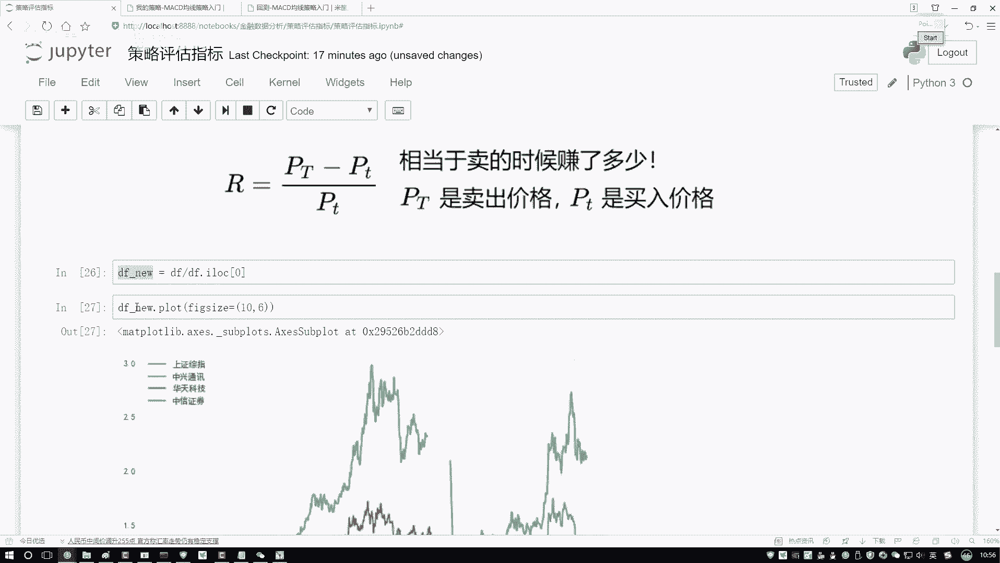

对于我的每一个哎，咱们算最终的也回得收益率啊，最终回得收益率，那就是最后一个值吧，那不要忘记还要减什么公式当中告诉我了。

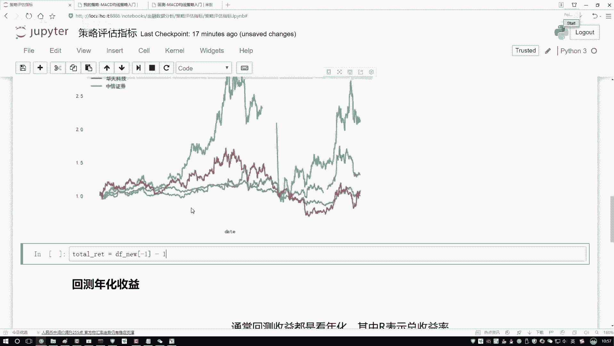

最后还要减谁，减去一个一是不是就可以了呀。

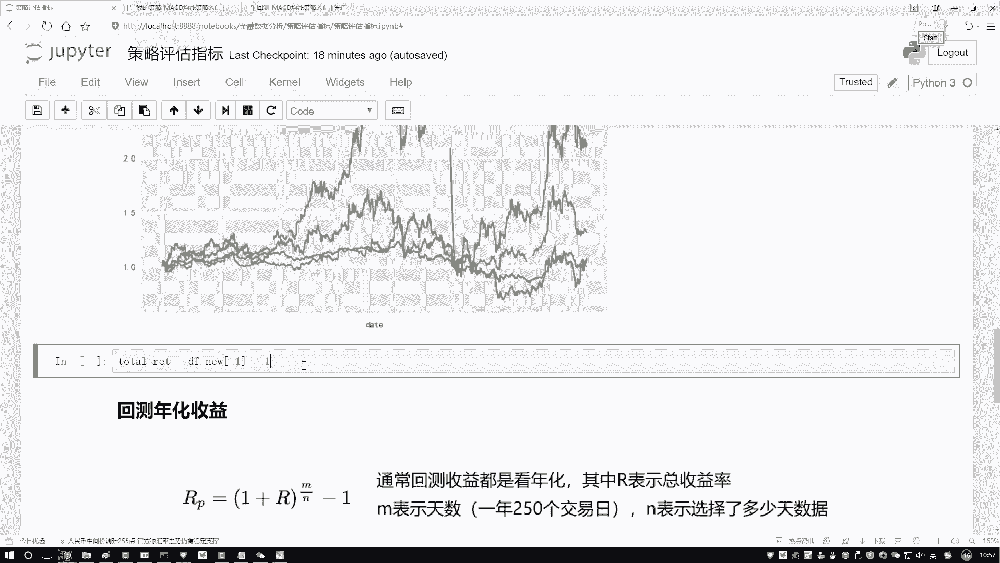

然后呢把这个东西我说做成个表格吧，咱展示起来看着好看一点，现在我说我构造一个data frame，在我当前data frame当中啊，把我的一个结果给传进去，然后用它的一个点V64，这是我的一个数值呃。

然后指定完数值之后，我说指定一个列名吧，呃我的列名我自己叫做一个名字，叫做一个回测收益率就行，好，叫做一个回测收益率行了，然后指定我的一个索引呃，指定文索引，然后就拿原始原来索引就可以。

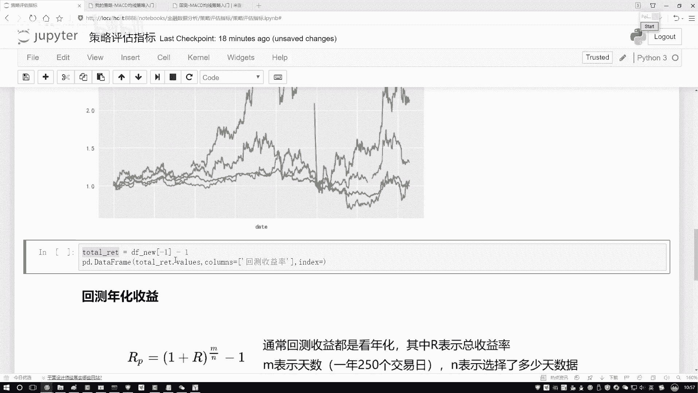

第2index就行，我们来执行一下啊，哦看一下遇到小问题。

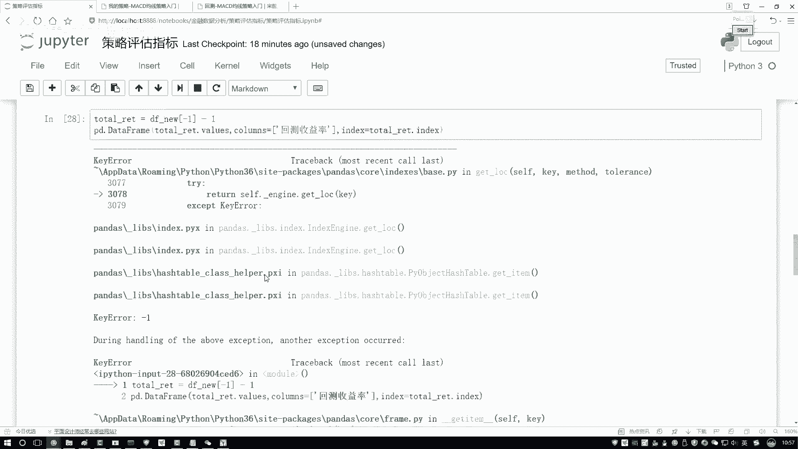

这个一没有在我的一个索引当中，我哦data frame当中。

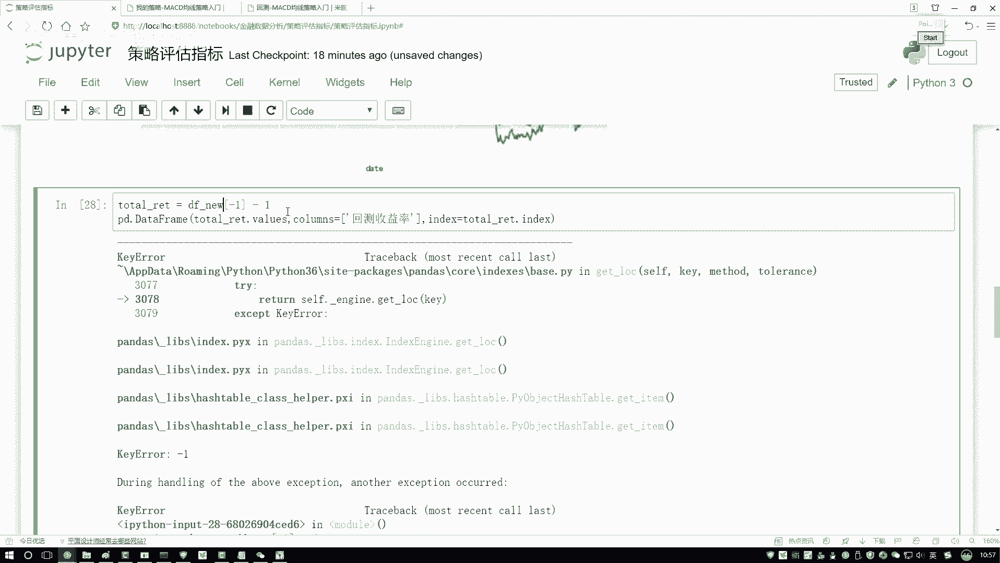

我得去点LOC一下，然后再执行一下，这样我们是不是就把这个回测收益率哎，给算出来了，相当于哎呀我跟一开始相比，我现在是赚了多少啊，通常通常赔的可能性也有啊，因为你看这里就是其实这里我们是没。

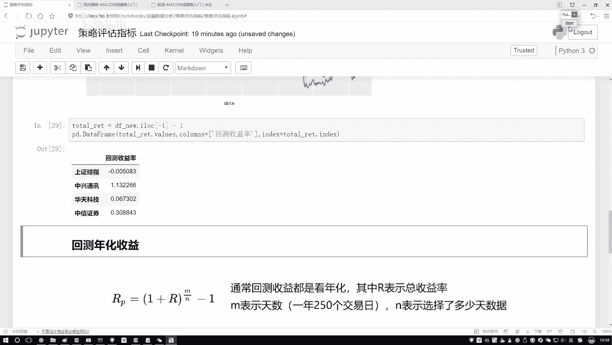

你就假装是吧，就这个数据就是我们做了一个回测之后，咱得到的结果，其实这东西啊它就是正常的一个走势啊，我们没有做东西，只是独见了，你就当做是我做了一些策略之后，哎我得到了每一天它的一个收盘价啊。

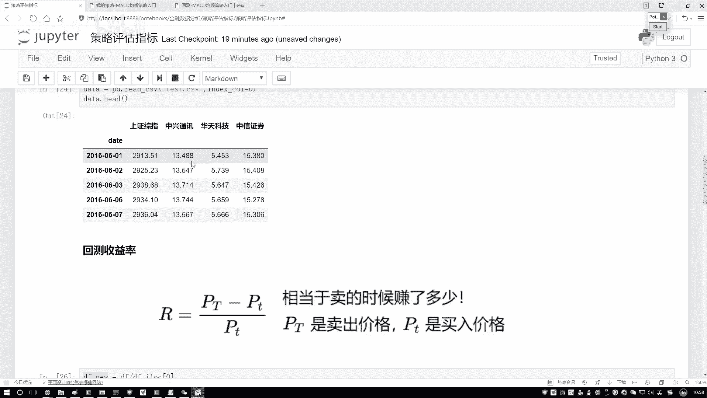