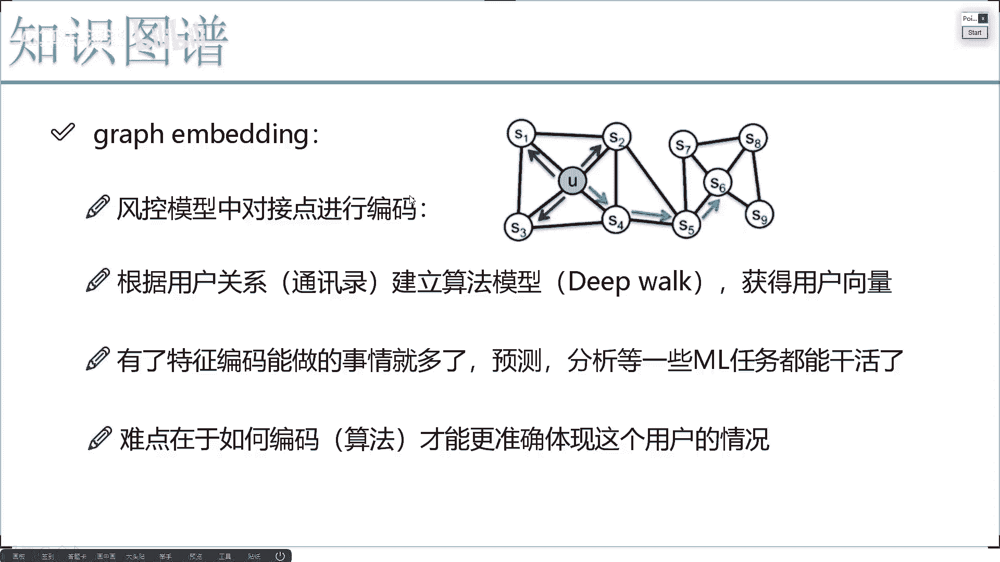
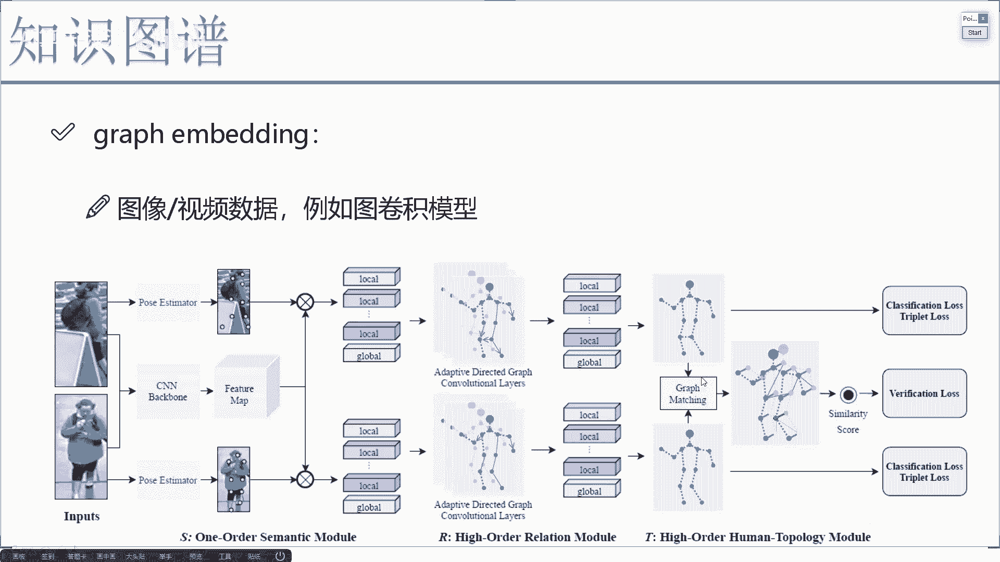
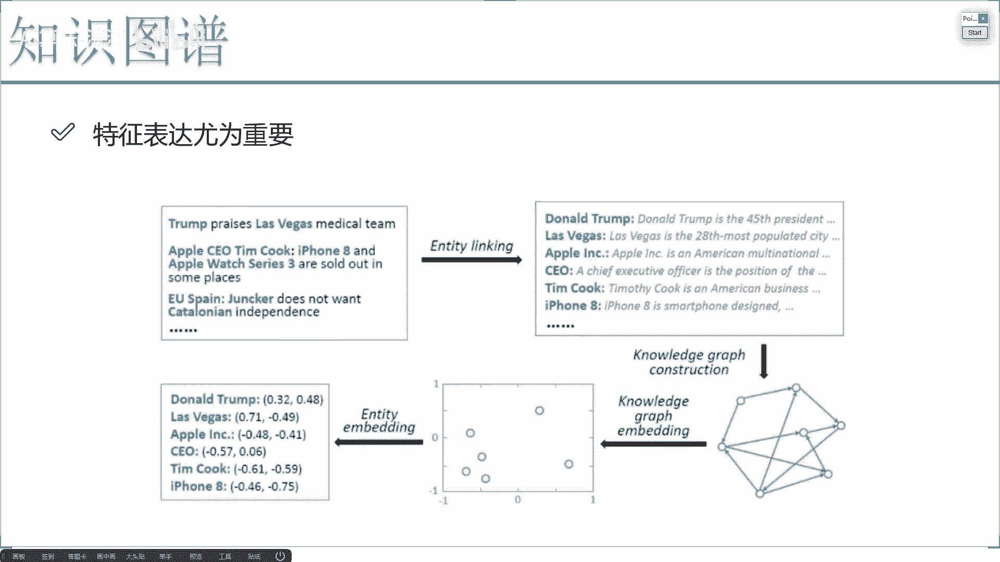
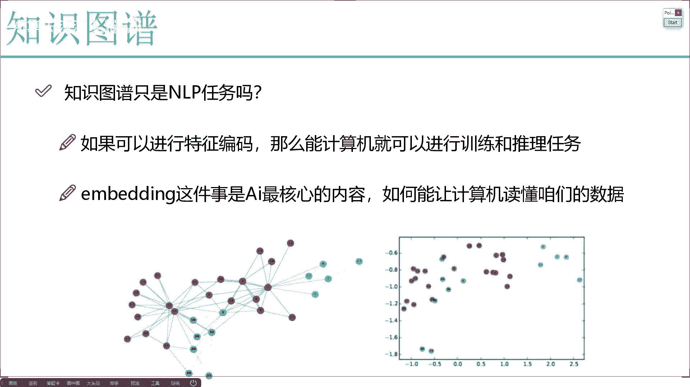
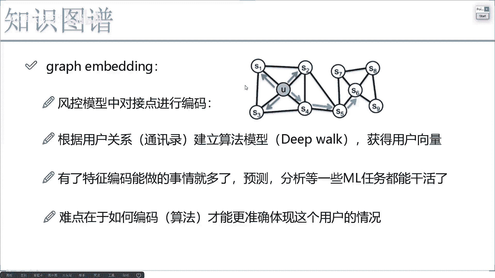
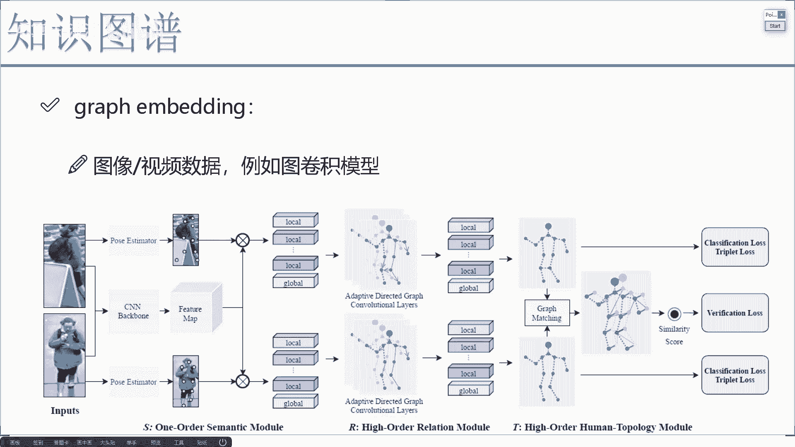
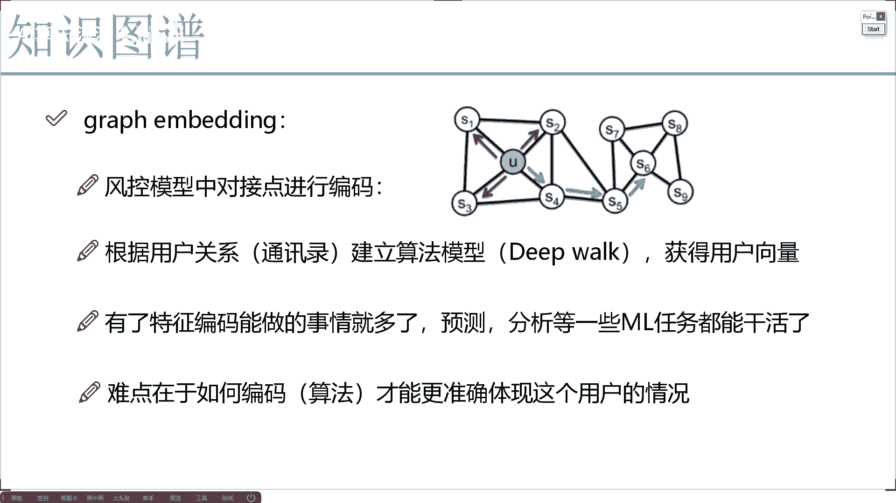

# 完全可自学！人工智能金融领域知识图谱+Python金融分析与量化交易实战全套课程！入门真的超级简单！——机器学习／深度学习／NLP自然语言处理 - P8：5-视觉领域图编码实例 - AI算法-漆漆 - BV1Wgz3YVEx1

那其他领域当中呢，比如说再给大家举一个，再给大家来看一个图像数据，图像数据这个也是我们后续啊，在项目当中哎咱们会涉及到的诶，大家可能会问唉，图像数据，这怎么会跟这个graph图这个东西连在一起。

大家可能现在一起的图像，我们经常说的就是一些什么卷积神经网络，一些深度学习，是不是，那你听过卷积神经网络，听没听过图卷积呀，什么叫图卷积啊，来我给大家先描述一这样一个呃，就是咱先来说一说这个背景吧。

先说出发点嘶出发点，这样我说现在啊我要对这个行人做识别啊，看他是谁，咱咱咱就举个简单点简单点的例子，看看这个行人是谁，那我说我是不是得呃，提取出来这个行人的一些特征啊，那我说我现在这样。

我不基于这个整个人做一些特征提取，我拿它就当做一个图像的例子啊，图像或视频，到时候大家咱们可以举一反三哦，比如现在这样，我说要对这个人进行提特征，那我说不对，这个整体我对他这些局部行不行啊。

局部特征和整体特征，我说一会我做融合呢，局部特征是什么，咱们这个人啊是不是由一些关节点组成的啊，比如举个例子，有这个头上的关节点，你看这里有些点啊，有这个头上关节点，肩膀上的关节点，胳膊膝关节，腕关节。

胳膊肘膝盖脚，我说每个地方都是一个关节点吧，那好了，我说现在这样，我可以把它的一些关节点特征全提出来，可以吧，你看这里啊，就是每个关节点我可以，咱们先不管怎么提啊，我只给大家先说这个思路。

后续会说具体项目，具体项目的时候，这个老复杂了，我得跟大家慢慢去说啊，在这里我当我把每一个局部特征提完之后，你看这块好像有这个头的特征，然后肩膀的特征，然后还有这个手的这个胳膊的啊。

然后这个反正一些其他地方特征吧，我就随便画几个，看着像个人哎，这些结构特征数都有了，但是有个问题，现在啊你说你构建设多少，我写个local啊，local1local2local三。

这个局部特征啊都是自己的一些描述，是不是都是自己是自己的，那现在有个问题诶，你说这一些结构特征啊，它是不是都是属于一个人的，如果我只看他们自己的嗯，看起来这个特征分析的可能不是太好，为什么。

因为这个人啊在行动过程当中，这个关节点你看这个图，这些关节点它是协同的，在做一些运动，是不是它们之间必然会有一些联系啊，你的头跟谁联系关系最大，那可能跟你的肩膀啊，跟你的你。

然后比如说你的手可能跟你的一个胳膊肘，跟你的肩膀哎，这也关系大，是不是，那如现在这样，我不光要拿到他们的局部特征，我说我现在我还要干什么，我做一些融合，什么融合啊，在这个图形当中我建立关系。

那比如说我这个头跟肩膀之间的关系比较大，两个肩膀互相的关系也比较大，行不行，那后续我说我在构构建这个特征的过程当中啊，一旦我形成了这样一个图模型，大家可以想象一下，一旦我形成这样一个图模型。

接下来我说我在构建特征的时候啊，比如说构建这个头的特征，你能还光用头本身的一个，就本身自身的一个特征来去做了吗，不行吧，你也需要考虑考虑当前我这个头跟谁啊，跟我的肩膀之间的关系啊。

相当于也就是我们在美处理当中上下文吧，头在中间两个肩膀两边，是不是相当于上下文那个感觉啊，重新的做一个特征融合吧，这里边我们需要用什么，就不是简单的一个卷积了，而是什么，在涂模型当中我们也要做卷积。

那是不是在这里我们说这个L1头这个特征，我们要构成成一个向量，这不也是一个graph embedding吗，它是不是我们其中的一个应用啊，当然是啦，所以说啊大家不要局限就是graph这个东西。

是不是只能在图纸当中去用呢，肯定不是的，在现在啊一些很多计算机视觉任务当中啊，我们已经大量的去使用咱们当前这个图模型，图卷机，咱们该怎么样去玩儿吧，那比如说后续我们还可以再举一些例子。

这块呢还有个图匹配的过程，我给大家简单唠一唠，什么叫做一个图匹配图匹配是这样一件事，他说现在啊你看上面这，我就说这个A图和这个B图，我想匹配一下他俩是不是一个人，但是你来观察一下。

当我们做了一些关节点信息之后啊，你看这里做了一些关键点信息之后，诶，你会发现一件事儿，有些关节点怎么样被一些背景，或者是被一些障碍物所挡住了吧，那此时如果在匹配的时候，咱们通常情况下都是一对一的匹配啊。

什么叫一对一的匹配，头和头看看是不是一个头，肩膀和肩膀，看看是不是一个肩膀，那如果有些关键点在视频当中被挡住了，哎你说我再做一个一对一的匹配，这还行吗，这都是一个板子了，它都不是人的特征了。

那这样做匹配肯定就效果不好吧，所以说我们还可以做什么，基于这个图模型，我们也看一看，如果当前这个点被挡住了，我们能不能用跟他关系比较紧密的点，来做一些替代呢，唉来把它们之间的关系。

不做成一个一对一的关系，因为如果说一个点你只是单独去看看自己，那肯定是一对一去做了，但是现在这个点是有关系的，跟其他点我们可以怎么样不做一对一吧，可以来做一个一对多的，可不可以啊。

一对多现在这样一件事儿啊，一条路你被遮挡住了，其他路可能还是通的，我们照样能去做吧，好了，大家可能现在觉着这个图做的哎呦，挺难的，我们来看有什么意思，这是后续啊，在我们的那个实战项目当中。

我会给大家讲GRAPHINMBEDDING其中的一个应用啊，做一些行人识别的时候，咱们该怎么样用我们的图模型，图卷积，还有图匹配来完成我们的实际的一个项目。

好了，这一块我给大家看了一下，在知识图谱当中，或者说整个的知识图领域当中吧，还有一个A非常重要的点，就是我们怎么样做特征，因为对于一个图谱来说，不仅仅是咱们要构建出来这样一个图。

更重要的是我能用这个图做一件什么事，如果你能把其中的每一个实体全用向量表出来，那就无敌了，那真就无敌了，你想做一件事全能去做了，只要有特征，你把它输入到计算机当中，咱们各种算法全用上去。

什么检测的分析的识别的，是不是想玩什么，咱们就玩什么了。

所以说啊归根到底，咱们就是说这么一句话，在知识图谱当中啊，不仅仅是用NLP任务要构建一个图谱，可能后续更核心的是我们怎么样去用这个图谱，帮我完成一个实际的任务，在后续的项目当中啊，我也会跟他去说啊。

咱非常重要的一点东西。

Graphing bing，咱们怎么玩，就拿这两个例子，我觉得非常经典，一个是在公共系统当中。

我们怎么做graphing bedding，一个啊是在一些图像数据当中，我们怎么做graphing bedding，其实这两个方法，相当于我举了两个不同的领域吧。

一个是啊视觉领域，一个是啊像是这个啊金融风控这样一个领域，通过这个领域啊，我估计大家能够更熟悉啊，咱们今天讲这个知识突破实际当中啊。

