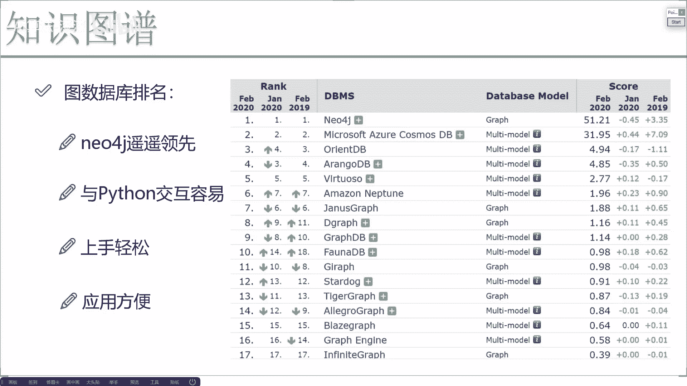
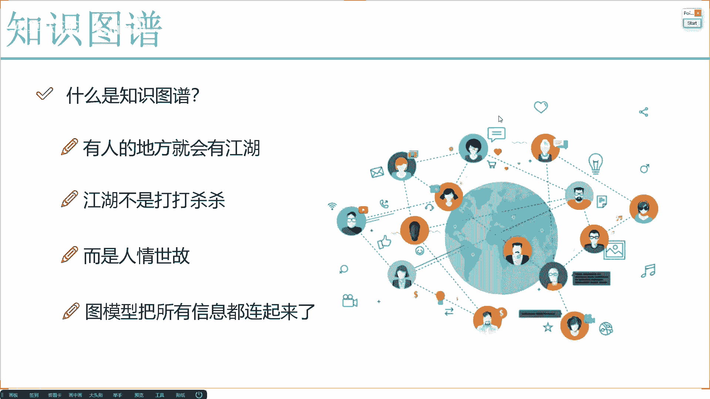

# 完全可自学！人工智能金融领域知识图谱+Python金融分析与量化交易实战全套课程！入门真的超级简单！——机器学习／深度学习／NLP自然语言处理 - P9：6-图谱知识融合与总结分析 - AI算法-漆漆 - BV1Wgz3YVEx1

最后一点就是我们的一个知识融合了，所以知识融合啊，是这样，那在图谱当中啊，我肯定希望有大量数据诶，大量的信息，那怎么样去构建出来这么多的数据呢，那我就想一想实际我们的业务场景当中，我们有什么呀。

哎比如现在这样，我们现在看到了我们业务场景当中啊，比如说是一些哦就是电商平台吧，在这个电商平台当中啊，我们有一些用户哎和一些商品，用户和商品之间本身是不是哎就是有些属性啊。

现在用户画像已经做了这么多年了，用户本身的一些标签，商品本身一些标签自身的特征，我可以很轻松就能拿到吧，并且呢用户在与商品做交互的过程当中，哎比如说用户点了某个商品，给哪个商品加入到购物车了。

购买了哪个商品，然后投诉哪个商品，这些个是不是一些行为数据啊，结尾数据就是一个关系的网络，在这个关系当中我能构建一个图模型吧，在这个图模型里边，我是不是能抽取出来一些诶。

跟图像我该说的graphy bedding当中，咱去做它的一些特征啊，那用户在买商品的时候，他可能写了一些评论，可能在搜索过程当中搜索了一些个关键词，可能在某些地方哎，跟他的一个朋友做聊天的时候，哎。

他打了一些话啊，打了一些推荐之类的东西，这是不是一些文本信息啊，文本信息我们能不能用，是不是也可以啊，文本东西咱们照样能做embedding，给它转换成向量吧，还有什么用户在看这个商品的时候。

在某一页停了特别长的时间，他可能是那一夜诶，商家给他放了一个视频，或者商家还画了一个，就是做了一个非常适合营销的一个图片，那有了这些视频，有这些图片之后，我们能不能分析什么哎，这个视频它表达什么意思啊。

这张图片它具有什么样的一个向量啊，其实给刚才给大家提这一点无外乎是什么，咱们现在啊做的更多的叫做一个知识的融合，所谓知识融合啊，就是说现在啊但凡你有的特征，但凡你有手里有的数据。

咱全能做embedding通通的，我都可以把它做成向量融入到最终啊，你说我的一个决策系统还是我的推荐系统当中，无外不就是无论什么系统，无论你用什么系统来去做的时候，咱都得有算法来支撑吧。

算法通常需要我们的输入都是啊，当前咱们的一个特征向量是什么啊，所以说知识融合啊，在这个知识图谱当中是非常庞大的一个领域，这我这也就是我说的，为什么说知识图谱啊，咱不应该只认为它是NLP领域。

它相当于是一个非常交叉的学科，在这个学科当中啊，我们会涉及到很多很多跟其他场景的交互，跟图像数据跟文本数据跟语音数据，哎，我们都该怎么样进行一些实际的交互啊，这是我们的一个知识的融合。

然后呢在知识融合过程当中啊，我还要再提最后一点就是知识图谱里边啊，到底是业务重要还是一个算法重要呢，其实这样业务和算法对我们来说都是啊，非常重要的，但是在知识图领域啊，可能会更偏业务一些。

刚才我给大家介绍一些啊，比如说像是风控的场景，还有像是一些哦金融的一些呃，图像的一些医疗领域，大家也看到不同应用场景当中啊，我们要做的一些具体任务哎，你说它们是一样的吗，那不能说是不一样啊。

好像差别都是非常非常大的呀，所以说啊当我们在做这个知识图的时候，大家要熟悉一点，业务啊，是要比算法还重要的，因为大部分情况下算法都是通用的，像我刚才说的命名设计识别。

GRAPHYMBEDDING这些东西，你说对图像，对文本，对结构化数据我要做编码，咱们大部分情况下，你说算法怎么样都是大同小异吧，主要的一点是什么，还是你应该你啊怎么样去设计哎，我们这个知识图谱。

它们之间你要什么样的关系呢，从业务角度，从结构角度咱们怎么设计，因为知识图谱当中算法通常比较固定，但是业务这就相差的太多了，业务要比算法，在我们知识图纸当中还要会重要一些。

等后续啊我给大家讲一些实际的例子，大家会发现了，我为大家讲这些例子过程当中啊，都会先讲我们的场景是什么，我们要干什么，以至于我们后面咱们去怎么设计的，所以说最难的一点还是啊，基于我们的业务去怎么设计。

接下来啊你任务的一个流程，用这些算法通常都是啊相对还算是比较固定的，这个意思，知识图组成啊，咱们之前也看过了，这个咱们就不用再去说了，然后呢后续啊在我们的一些案例当中啊。

咱们会给大家准备一些额就图数据库怎么用，这里呢先给大家提一个简单印象吧，或者说给大家做一个简单的一个推荐，在数据库当中啊，其实用的最多的也是现在最流行的啊，叫做NFJ，大家可能想有这么多数据库。

哎是不是我随便选一个就行了呢，其实是这样的，不建议大家你们随便选一个，要用就用什么要用就是用最简单的，最方便的，用的人最多的吧，你看在这里第一是谁啊，NPJ比其他呢遥遥领先的一个感觉吧。

所以说啊当大家使用过程当中啊，也不用去犹豫了，也不用去管其他是什么效果好，效果不好，咱都不用去管，不要看哪个公众号或者说哪篇新闻啊，一发哎呦，哪个公司或者说哪个机构啊，他们新开源了一个数据库。

然后怎么样的不要去用，为什么我们在使用过程当中啊，难免会出现大量的错误，你一旦报错了怎么办啊，你用一些新出的开源的东西，用一些基本没人用的，你连找错误都没法找啊，你连找一些代码的模板。

找一些就是相关的案例找都没法找，用都没法用，那和弹这个东西好不好用，实不实用啊，是不是啊，所以说建议大家就是也不用去选了，就选NFJ，后续我们的案例也是基于他去做的，并且不光啊new for j。

咱们可以直接偶基它数据库来数据库来去操作，它与Python的交互也是非常容易的，一旦这个东西与Python交互溶液，我估计大家会发现我们上手使用起来，咱实际在做应用起来是不是特别方便啊。

因为Python怎么样，万金油啊，你能跟你所有的一些业务融在一起啊，你包一个web框架行不行，你跟神经网络结合在一起行不行，跟生物学习跟视觉跟声音，跟文本我们全能结合在一起吧。

所以说啊这里边我们做一些交互非常容易哎，比如说我可以在Python当中哎做一些circle，会去取图当中的哪些指标，哪些信息，所以说做起来啊是非常容易的，到时候我给大家去说啊，图数据库哎。

咱们怎么样跟Python做一些实际的交互，这个是非常非常方便的，好了，这块给大家就是啊多介绍几点。

就是在知识图谱当中啊，后续我们要去做的一些任务啊。

先给大家做了一个简单的介绍行了，这里啊给大家来去介绍了一下，我们知识图谱当中啊，所有的啊一些基本的介绍，还有呢只是突破哎，能应用到哪些个业务，还有参考当中，并且当我们在实际使用过程当中。

我们都有哪些使用方法，最简单的做circle，做查查询，稍微复杂一点，做推断，辅助我们决策啊，再复杂一点，做编码，再做一些上层的应用哎，都是可以的，应用领域相对来说也是比较多的。

这是你从今年这个角度来看，知识图谱已经能有这么多落地的项目了，那以后呢大家想一想，鹤联网时代啊，这个信息啊，这个数据啊被卖来卖去的越来越大，越来越大，这个数据那所构建的我们的一个网络。

构建这个图模型是不是也会越来越大呀，只要有数据啊，相信就是以现在咱们人类的一个聪明，能就是聪明程度，这些东西啊应该都会发展的越来越快啊，使得咱们这个图谱构建的越好啊，你能应用的点商家互联网啊。

这些个大佬吧啊，能能点也会更多的，你会看到更多啊，跟实际生活哎所搭边的一些实际项目行了，这个就是我们知识图谱啊，先给大家做了一个整体的介绍。

