# 吹爆！这可能是B站最完整的（Python＋机器学习＋量化交易）实战教程了，花3小时就能从入门到精通，看完不信你还学不到东西！ - P11：第11节-金融时间序列分析-I - 凡人修AI - BV1Yx4y1E7LG

大家好，今天让我们来介绍金融时间序列的第一节课，那么让我们来首要介绍一下，我们本课本堂课的主要内容，定额，一开始呢，我们会介绍一下序列的相关性和随机游走，那么第二个内容呢。

我们介绍一下平稳时间序列的三个模型，分别是AAR就是自回归模型，ma滑动平均模型跟阿玛模型，也就是把嗯AAR项跟ma项结合起来的，一个平稳时间序列模型，那么第三块呢，我们引申到非平稳的时间序列模型。

包括AIA，也就是带integral项的和THEREMA，也就是结合integral跟C节性seasonal的像的，那么第四款呢，我们介绍一下E方差的时间序列模型，主要是arch和GARCH模型。

那么这个可以跟我们上堂课提到的，贝叶斯随机波动率模型进行比较，那么这是另外一种波动率预测模型，那么这个波动率呢，我们对它构建关于时间的一个时间序列，那么之后呢，得到我们条件波动率的一个瞬间序列模型。

那首先呢我们先来看一下我们关于时间序列，我们主要讨论哪几个方面的模型，那么对于线性模型呢和非线性模型，我们主要focus在linear system，那linear system的主要表达方式是如下的。

就是T加一时刻的时间序列呢，是等于呃T时刻的一个线性表示，那么再加上一个这个扰动向的时间表示，那么第二块呢是关于平稳跟非平稳的时间序列，那么我们主要是讨论啊平稳的时间序列，那么关于非平稳的呢。

我们尽量的对非平稳时间序列，进行先手的一些啊transformation，比如说去季节化，比如说去integral偶像或者是去trend等等等等，把它们变成平稳的时间序列。

当然对于有一些非平稳的system，比如说嗯这些仓量，那是随时间变换的，那我们没有办法通过上述的一些方法，把它们变成平稳时间序列，那么对于这种模型，我们考虑到使用影视，马可夫链和卡尔曼滤波进行处理。

那么我们后面会深入的介绍卡尔曼滤波，那那么对于第三类，在时间上连续和时间上的不连续的情况下呢，我们主要考虑的是离散的模型，也就是我们的time依旧是有step的，那对于连续的时间序列呢。

因为嗯delta t已经趋于零了，那我们没有办法对此类的时间序列进行建模，我们只能将平呃，这个非连续的时间序列的步长取得尽量小，让它趋近于连续的时间序列。

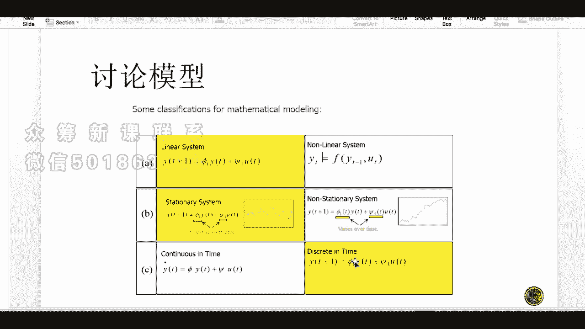

那么接下来让我们看第一话的内容，就是序列的相关性，那么首先呢我们plot，我们的XT就是我们的粒子的时间序列，那么通过这个时间序列的图呢，我们看不出序列的任何的特性，那么没有关系，我们如下呢。

画出XK时间关于K减一，也就是一阶滞后项的这个关系图散点图，那我们可以看出来啊，K减一时刻和K时刻的这个时间序列，存在着非常强的线性相关性，那么对于两间事后项呢，也是存在着一定的线性相关。

那么三阶之后呢，这个线性相关已经越来越弱了，那么关于时间时时刻啊，德尔塔T等于十的时刻呢，我们已经可以看出就几乎不存在啊，相关性，因为这是一个几乎趋于球状的一个散点图。

所以我们可以得出我们上面的这个时间序列的，这个AR的auto regression的这个阶数呢，到时间为止是可信的，那么到底取多少件数，我们后面会介绍一些分析的手段，那么我们首先要引入的是自相关函数。

就是简称ex那么全称为auto coverance function，那么它的数学定义呢是DR呃，第20课的时间序列和S时刻的时间序列，的相关系数，那么我们有如下的推导嗯，拆分，那么我们最后得出呢。

R时间的R跟S时间，时间序列的相关相关性呢是嗯，XR乘以XS的这个expectation，减去两个expectation的乘积，那么我们要注意的是，如果是临时刻的话。

那么这个时候也就是时间序列本身的方差，那么对于ACF来说，我们我们可以通过plot这个不同阶制后的，ex的图像来对时间序列的相关性进行判断，那么下面的这个例子我们可以看出。

连接也就是我们的这个correlation，在连接的时刻是一定是一的，那么一阶的时刻呢是负的，那么二阶的时刻呢，大概就是接近于0。0。40。5的这个位置，那么三阶之后呢就趋于零。

也就说明了我们的时间序列在二阶之，二阶之后之后呢都是不相关的，那这个是我们的这个sample auto coerrise function，那么我们可以看到对于白噪声来说，我们只存在着连接。

也就是自己本身的虚那个相关系数为一，那么在一阶之后呢都是不相关的，那么这个也符合我们对白噪声的intuition，也就是序列本身不存在任何的相关性，是一个在空间内的一个y noise的一个震动。

那么random work呢就刚刚好相反，这是两个极端，那么对于随机游走来说，他都exactly depend on，前一个的时间，再加上一个啊维纳过程的一个微分项，那也就说明不管是多少阶之后。

那么都存在着唯一的相关性，那么这是随机游走和白噪声两个极端的序列，相关性的一个act plot图，那么当我们看普通的时间序列，ma1MA1就是存在一阶的滑动平均，那么一阶滑动平均的ex是如下图所示。

就是一阶仍然存在着接近于0。5的相关性，那么二阶之后呢就是一个结尾的图，那么ARE呢就是一个拖尾的，就是啊是一个相当于是指数的decay的一个过程，那么我们在这里有一个先有一个intuition。

也就是ACF是有助于判断这个ma过程的呃，滞后order的，那对AR来说呢，ACF是失效的，无嗯不足以判断，那这个是ma跟A啊，但这个系数是负的情况下，那么ma呢依旧呢是在一阶之后是结尾的。

那么AAR呢是一个啊，这个叫做sin振动趋近于零，那么依旧是无法判断AAR的阶数，那么既然我们提到前面的ma跟AR过程，那么让我们来先简要介绍一下，什么叫做moving average process。

那么对于一阶movie average来说呢，我们就假设Z是一个y noise，那么均值是零，方差是西格玛方，那么一阶ma的表达式是本身的时间序列呢，是等于白噪声在当前时刻。

那么再加上呢T减10克的白噪声，前面乘以一个theta，也就是ma的这个process的一个啊可以非选参变量，那么对于Q间来说呢，以此类推，那么就从在T1直加到呢，在T减Q，那对于时间序列来说。

我们更习惯于用这个B来表示这个字，shift的best shift的operator就是滞后的一个嗯一个转换器，那么这个时候我们用B呢来表示之后，B平方呢就是二阶之后。

那么写成这样的一个表达式之后乘以一个载体，那每个B作用于代替呢就是往后置啊，滞后一项，那这时候让我们来看一个ma four，就MA4阶的一个滑动平均，那这是滑动平均本身的一个序列模式。

那么这个是这个滑动平均式子的啊，ACF的啊，Function plot，那我们可以看出在四阶之后呢是完全等于零的，那就说明当我们想判断一个ma过程的接触呢，我们只要把它的啊。

apple呃呃at auto correlation function呢给POR出来，那么破除这个表达式之后呢，我们看它在几阶之后就等于零，那比如说这里是四阶之后，我们就有理由相信。

我们的这个过程呢是ma four的，那对于AR过程来说，AR是一个自回归过程，那么顾名思义，我们的等式的左边的coefficient，应该是放在我们的本身这个process的滞后之前的。

那么对于AR1来说，就是XT等于Y乘以XT减一，那么再加上一个白噪声，跟前面的ma一样，那么对于ARP来说呢，就是从T减一阶之后，一直到T减P阶之后，那么如果我们用前面介绍过的MAQ的by shift。

operator来表示呢，就是如下这样的一个简便的表达式，那我们把所有的X和X之后都移到等式的左边，就是如下这个highlight的一个表达式，那么让我们来看一下对于AR2的时间序列。

那么它的plot是如下图所示，我们可以看到它的egg是一个拖尾的函数，形状是无法从这个AR过程的app来判断，我们这个AR过程到底是几阶的，所以我们如上面介绍，我们在这边总结一下我们的自相关函数。

egg是可以用于判断ma过程的阶数，也就是它的order，那么对于y noise来说呢，是所有的滞后都是显著等于零的，是不相关的，那么对于ma过程来说，ma的阶数就是AGF不等零的最后一个阶数。

那么对于AR来说呢，它的嗯act function的是拖尾的，或者是一个嗯sin和SN震荡的一个过程，是没有办法通过ACG来判断R过程的结束的，所以我们这里的结结论就是，对于MAQ的过程呢。

它的acg for函数的这个阶段的阶数呢，就刚刚好等于我们的这个order q，那如何判断这个AR过程的结束呢，他的判断会比ma过程稍微复杂一点，我们要引入我们的偏自相关函数，就是pg。

那我们首先先介绍一个很重要的等式，叫做your worker equation，那么首先从一个ARP过程出发，我们在等式的左右两边同时乘以XT减J，那么取一个expectation期望。

那么得到的是如下的一个关于仓量，fine和我们的这个EF，就是呃相关系数的一个等式，那么J呢是从一一直取到R而是无所谓，那么只要比拼小就可以了，那这个时候得到的是如下的这样的一个嗯，R行的一个方程组。

那我们利用矩阵呢，来解我们的这个方程组的形式，那这个时候我们称这一整个大矩阵为涛，那么fine1到fr就是我们的第二阶pack，那么把边上这个涛群逆乘到右边，可以解出我们所有的pack的啊。

参数就是coefficient。

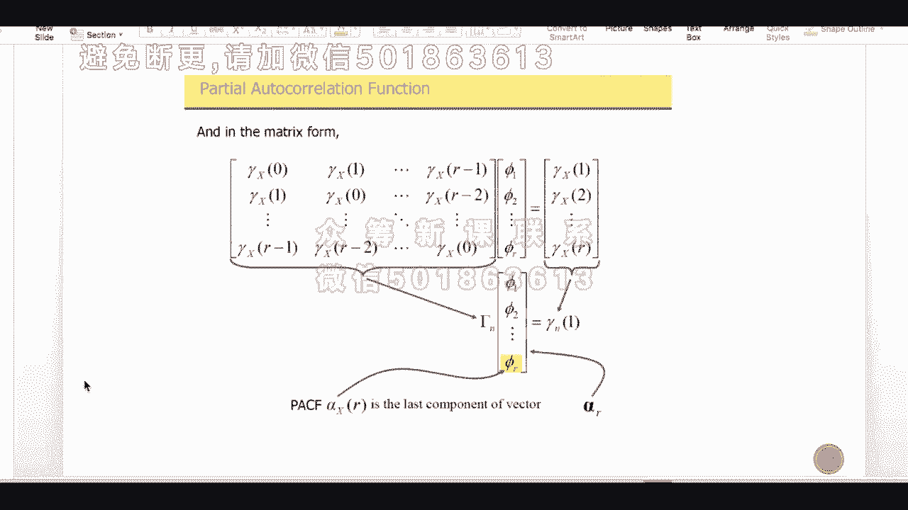

那么通过数学推导呢，我们可以得到对于AR过程来说，我们的pack for在AR的这个比如说AR是呃P接，那么就在DP阶的时候，刚刚好是结尾的过程，那么数学推导的过程呢比较复杂。

我们在这里只简单介绍我们的结论，我们的结论就是呢对于ARP的过程，那他的截断的这个point截断的地方，刚刚好是我们的这个tag的显著等于零的地方。

那让我们来看一下一个r to过程的一个例子，那么对于AR two过程来说，它的plot c嗯序列的plot如下所示，那么对于EF来说，它是一个震荡的一个嗯，拖尾趋向于零的一个过程。

所以AF是不助于判断AAR的接触的，然而对于啊片子相关函数来说呢，他刚刚好在第二阶之后就显著等于零了，就说明我们的这个AR过程是二阶的。

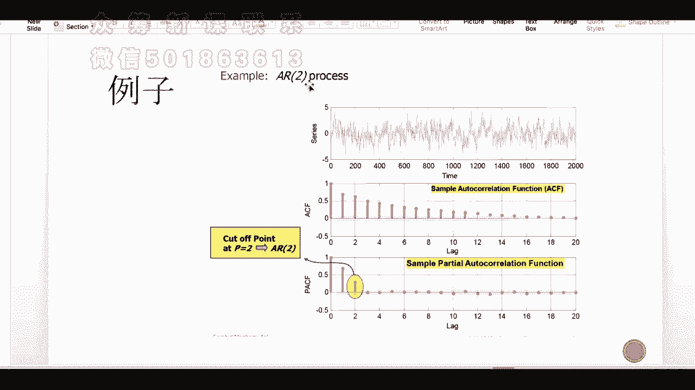

那接下来我们要介绍一下平稳性和均值回复，包括如何对是一个非平稳的序列进行变换，把它变成一个平稳性序列，再进行建模，让我们来回到我们的平稳性与均值回复的讨论。

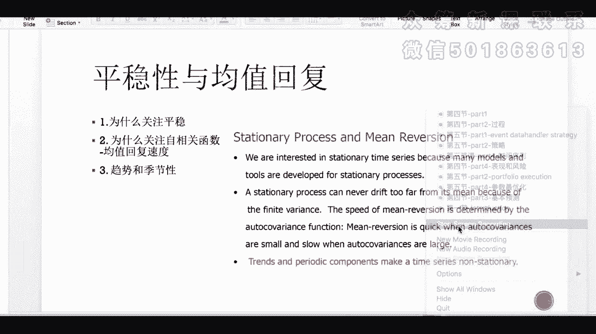

首先我们为什么要关注平稳，这是有两个主要方面的理由，第一个呢是stationary，the time service呢，是我们主要的时间序列模型的一个标杆，我们99%的时间序列模型。

本身都是基于平稳的时间序列模型而创造的，那么第二个呢就是在金融学意义上，我们对一段的时间进行建模，我们希望我们build出来的模型，对于未来的一段时间内是具有一个参考意义的。

那么如果我们的时间序列并不是平稳的，那我们前一段build出来的模型的，估计的均值和方差并不能用到后续的时间中，那么我们的模型就失去了意义，这就是为什么我们要关注平稳性，那么对于额均值回复来说呢。

为什么我们要关注自相关函数呢，因为呃一个一个自相关函数的这个speed就是speed of，它的mean reversion呢，是被这个自相关函数所取决的，那么我们前面关于AAR跟ma过程也看到了。

那么如果它的自相关函数越大呢，那么它的均值回复的速度是越慢的，因为呢他前一，它现在的时间序列会更依赖于前一段呃，前一个的时间点，那么他就并没有回复到均值的趋势，而是跟随着我前一步的时间序列的脚步。

而进行游走，那么反之，如果呢那个自相关函数是比较小的，那么它就更趋向于回到均值，而不是跟随着我之前时间序的接过而进行变动，那么关于趋势和季节性呢是我们需要避免的，当我们获得一组非平稳的时间序列的时候。

我们需要讨论它是否具有趋势性，它是否具有季节性，那么如果具有趋势呢，我们就要DETREND，我们要去趋势化，比如说我们发现它有一个向上的linear，的一个增长趋势，那我们可以通过回归获得残差。

那么残差呢大概率可能是一个平稳的，均值回复过程，那么我们就对长差进行阿玛model的建立，那么如果具有季节性呢，比如说嗯气温，那么气温大家都知道是啊，12个月一个一个季度的变化。

那么如果我们将时间序列对12，前12step做一个滞后的减法的话，那我们会得到一个去季节化的一个时间序列，那么它就更有可能是个平稳的，比如说我们举个例子，像我们这边左边的一个这个微分方程。

那么它代表的是一个啊几何布朗运动，我们可以看到它的漂移向，其实是正比于current的这个state，那么它就一定不是一个均值均值回复的过程，因为呢当我们的这个s st也就是price越高的时候。

我的这个漂移向就越大，也就是越有往向上增长的趋势，那么这边如果换成是mu乘以一个S0，一个定值减去ST括号乘以DT的话，那么它就是一个能向均值啊，偏移拉伸的一个时间序列。

那么它就是一个平稳的均值回复的时间序列，那让我们来看一下非平稳的，这是一个带趋势性的一个例子，那么这个时间序列呢是一个波动上升的，那当我们对这个时间序列，关于时间做一个回归的时候。

我们去掉了这个trend，那得到了一个诸如此类的一个时间序列，那么它就长得更具有平稳性，而且具有一个均值回复性，那我们关于时间序列建模的时候。

我们得到了这个statistationary process，我们对它进行阿玛model的建立，那么我们如何评测我们的这个model是一个好的model，不再带有任何的没有被解释的项呢。

也就是我们的残差分析，我们关于这个ma过程，我们希望我们后面的这个长差，是我们得到这个长差，ZT应该是一个白噪声，是一个y noise，那么什么是白噪声呢，它具有如下三点特性，第一点它的均值是零。

第二是它的方差是一个常数，它不能随时间变化，毕竟它的方差得是有限的嗯，第二就是它序列的自相关必须是完全无字相关，无完全无字相关性的，就如我们前面看到的why noise act的啊。

图像它只有在T等于零的时刻等于一，那别的时刻呢都是等于零的，那这是白噪声的一个图，大家可以看到它在时间上是一个，非常混乱的一个分布，非常的noisy，那么对于不同的滞后，那么滞后之间的plot呢。

一定是一个以零为中心的一个散射图，不能具有一个像线性的趋势性啊，百丈深的一阶积分呢，就是我们前面看到的随机游走，随机游走在70歌的随机游走呢，就是之前的白噪声的垒和。

所以它称为一种integral process，也就是积分过程，那么这是一个随机游走的一个路径图，那么大家可以看到，随机游走在不同的时间差之间的plot，都是一个几乎趋近于线性的关系。

也就是他们的correlation是一，那大家可以依旧记得，随机游走的act x的plot是不管滞后为多少。

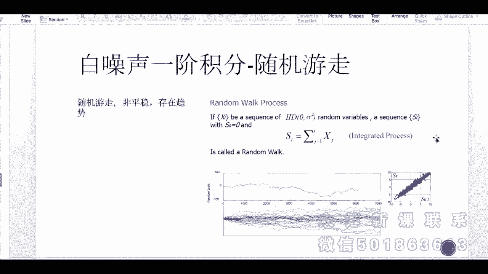

全部都是等于一的一个高峰，那现在让我们正式介绍一下，我们最general的平稳过程，称为阿玛过程，阿玛过程呢是ma过程跟AR过程的一个general的推广，那么对于ma过程来说。

就不具有序列本身自自己的滞后，只具有噪声和噪声滞后的线性组合，那么对于MMA1来说呢，啊YK跟YK减一之间的相关性是比较少的，所以对于滑动平均来说，他长得比较像白噪声。

那么对于auto regressive process来说呢，它是一个带着滞后项，带着这个呃嗯why noise，像的本身不带它的任何滞后项，但是呢却是自己序列本身，滞后下的一个线性组合。

那么大家可以看到a r e process的这个序列滞后，相关性呢比ma的相关性要来得大得多，那么嗯大家依旧可以看到，对于这个AR过程来说，它的这个均值回复的速度是取决于这个five five的。

那么five越大呢，它就越不嗯倾向于均值回复，而是跟随着我之前的这个XT减一，进行向上或者向下的一个扰动趋势，那那我们来看一下这个随机游走，包括AR过程跟这个ma过程的这个plot的图像。

大家可以看到这个翻越高呢，我的这个序列就越具有一个啊线性的关系，那么范围越小呢，它就越趋向于一个y noise和均值回复，那对于general的ma过程，就是把AR项跟ma项进行组合。

那么等式左边呢是包含着自己X本身和，减去这个X自己的之后项的线性组合，那么等式右边的是百兆真相和白噪声滞后相，的一个线性组合，这个就是ma过程。

对于这个嗯back shift operator的一个线性表示。

我们介绍完了阿玛过程，也就是最常见的平稳时间序列模型，接下来让我们介绍一下，如何把非平稳的时间序列转换，并且分解成平稳的时间序列，那么对于一个非平稳的时间序列，XT我们可以拆分为三个部分。

第一个部分是trend，也就是它的趋势有向上或者向上啊，向下的一个趋势，那么还有一个是S就是seasonal component，是一个季节性的一个因素，那么YT呢也就是我们剩余量。

那剩余量呢是一个均值为零的，一个平稳的时间序列，那下面呢就是一个关于dojos index的一个例子，我们可以看到dojs index一个向上的一个震动，向上的一个时间序列。

那么这个时候我们对它取取个lock，那么依旧能具有趋势，那这个时候我们可以将它与时间进行回归，得到了一条regression line，那么将我们将原始的数据点与regression line。

进行一阶差分，那我们得到如下的结果，那么我们看如下的plot，就比原来的时间序列来的平稳，而且更趋向于噪声一点，那么我们就可以对音阶差分结果进行，后续的阿玛模型的选择和建模。

那关于差分和季节性有什么区别呢，嗯差分是称为integral time series，那么一阶差分呢就是XT1减去XT减一，那么如果是二阶差分，也就是对它进行两次的一阶一阶减法。

也就是这个差分符号的平方倍，那么是一减去这个滞后operator的平方乘以XT，那么拆开之后呢是如下的一个表达式，但是对于季节性呃，当这个leg为D的一个季节性。

差分是XT减去XT减D那么换成back shift operator，就是一减去B的D次方乘以这个XT，所以对于低阶差分来说，是一减去B的一整个D次方乘以XT，也就是差分的第一次。

但是对于低阶的signal的差分呢，其实一减去B自己的几次方乘以XT，其实也只减了一次，所以大家要注意这个季节性与差分的区别，那我们介绍完这个非平稳如何转化成平稳，包括几种平稳的时间序列。

包括他们的order如何用ex和pack进行判定，那么我们现在同啊aggregate起来，介绍一下这个时间普通时间序列的建模过程，首先呢我们拿到一个时间序列，我们要对它进行画图plot。

那我们找出它的趋势性和季节性，那么并进行去除，那么对于趋势来说，我们可以关于时间做regression做回归，那么把原来的时间点和regression line，进行一阶差分得到平稳的时间序列。

那么对于季节性，我们依旧通过图像可以看到这个细节之间的，这个变化规律，那么对进阶进行一阶差分得到平稳的序列，那么第二步呢，根据上一步得到的平稳序列进行模型的fit嗯。

我们可以通过plot app跟pack进行定接，就是发现我们的阿尔玛PQ的，P和Q大概是取什么样的范围内是比较好的，那么当我们做完阿玛model之后呢，我们会得到这个长差。

那么阿玛model的假设是我们的长差，ZT是一个白噪声，所以我们要对长叉进行白噪声检验，正态检验，当然最重要的是它的act也就是自相关性的检验，那么我们的长差是一定不能存在正相关性的，如果存在了。

就说明我们前面FE的这个arm model还不够完全，仍然留有这个序列的相关性还没有被解释，那么第三步呢，我们对上面检验合格的这个模型进行代入预测，并把它转换成我们一开始的模型。

就是进行RETRANSFERTRANSER，到我们之前的非平稳的时间序列，那么通过这个时间序列可以做如下的几件事，第一是直接forecast我们的这个price，那第二呢可能是要对我们这个模型。

比如说我们是对呃，underlying asset price做时间序列建模，那么可以把它prog in到这个衍生品，比如说futures，比如说option，那么对option进行定价。

那么第三呢是可以得到这个啊，visneutral model的这个预测，那么这个后面这几条呢是后话。

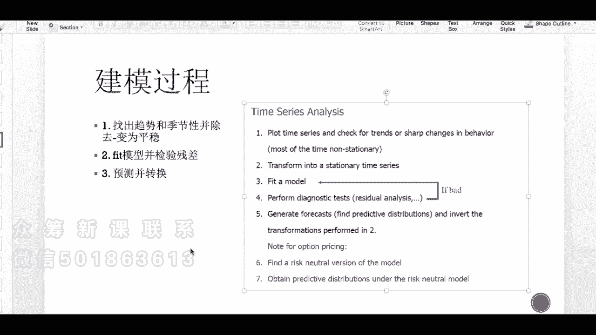

那这个是我们建模的一个啊图示，那么第一个呢是屈居室和去季节，那么第二呢是进行模型的定接和残差检验，得到呢一个最优的模型，那第三步呢是长沙检验之后，我们嗯我们对长差进行评估，评估各方面的评估合格之后呢。

在返回到在RETRANSFER到我们的模型。

那这个是我们模型选择的一个，aggregation的结果，那么对于ACG来说呢，我们是可以来判断MAQ的阶数，那么对于AAR项呢，是通过pg来判断这个P的结束，那么如果对于阿玛过程来怎么说呢。

如果对于阿玛过程，egg和pg夫之间，都不具备着这两个黄色区域的一个优秀的，这个嗯能判断结尾cut point的一个一个结论，那么我们可以这么做，对于阿玛象来说，一般我们是先build ma过程。

比如说我们猜测他们ma项是二，那么build ma项之后，我们对残差进行分析，这个时候残差表现出来的就是AR部分的，AAR部分的performance，那么在对长差进行pack for plot。

比如说发现pack夫是二阶拖尾的，那这个时候我就有理由相信，我的这个阿玛过程呢是P跟Q都取，比如说取二跟二，那我们进行查查分析，如果这个时候长沙是y noise了，那我们就可以进行进一步的建模。

那如果不是呢，我们要调整PQ的阶数，直到场差满足了y noise。

并且不具备序列的相关性，那么对于参数估计来说是嗯稍微复杂一些的，我们在这里做一个简单的介绍，那么我们一整个平稳的arm时间序列，我们是假设我们的X1和XN呢，都是一个平稳的高斯的过程。

并且满足下面的一个multi高选的表达式，那么均值呢就是mu方差呢，就是我们UNWORKER的coverence metric，大家还记得这是这个tn，如果翻到前面的slice的话。

那么我们对X1的XN做联合的PROBJOIN，probability的层级得到联合概率分布，那么对联合概率分布取log函数，就得到了likely和function，这个是初始的。

Like you for function，那我们对它取log，最后呢做这个max啊，MLE就是最大，我们上面这个零和自然，那么什么时候什么时候它的这个MLE最大呢，这个时候我们就要对这个five。

就是所有的仓量进行网格搜索，直到最优化，我们这个ME，我们就可以输出我们的Y1到YP，也就是啊AAR项的参数和这个theta1到C塔Q，也就是MA项的参数，那么西格玛方呢就是我们最后的长差。

White noise，他的呃翻差，那这个MLE的一整个S没过程呢，在Python和R的包里面都是自动实现了，所以大家不用担心，那么再谈啊，再提一个点是过拟合的问题。

也就是说对前面的这个MAPQ，有时候当我们不大确定PQ是多少的时候，有的同学会把PQ取得很大，比如说取二十二十，那这个时候获得的常态，它它大概率是白噪声，因为你的阶数取得非常高了。

等于每一个order他都estimate了。

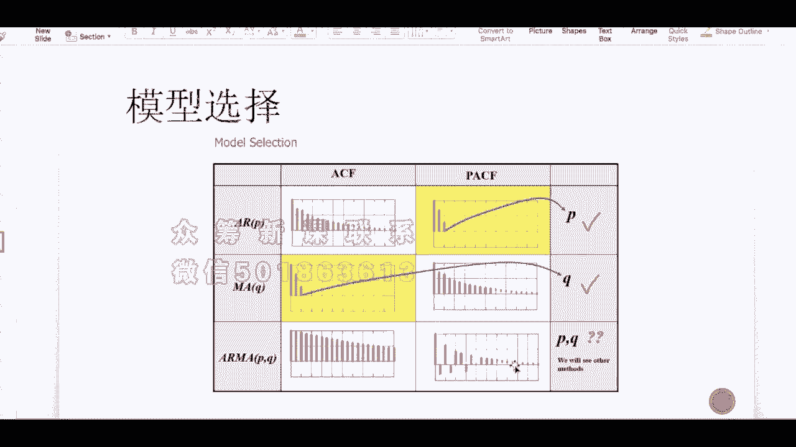

但是这样的问题是什么呢，这样的问题就是你会存在一个过拟合的现象，比如说真正的model其实是ma22，那你S每出来的是ma20，逗号20，那这个时候你其实会有很多阶的滞后项。

他的coefficient其实非常接近于零，那很接近于零呢，就说明你的这些滞后不显著，那么当你有新的input进来之后，你这个模型很脆弱，就很容易因为这些过拟合的像，而使得你的模型有很大的变化。

那么如前面所说，我需要我很希望得到的是一个很稳健的，很robust的模型，不会太受我新来的input的影响，那么我就需要我的模型越简单，越具有解释性越好，那么怎么样能够对这方面进行甄别呢。

那就引入这个AIC参变量，那么AIC参变量是我们maximum，likelihood的一项，那么加上一个惩罚项，惩罚项呢就是二乘以这个总共有多少个parameters，那么当我取了ma二十二十的时候。

我就有40一个parameters，加上那个y noise的方差项，那么这个时候你就受到了一个很大的惩罚，那么我们要选择的是最小的AIC的模型，那么嗯阿玛二十二十。

虽然这个low likely who很小了，但是因为受到后面的这个惩罚，所引的这个AIIC还是离真正的初model偏远了，所以这个是一个甄别模型的一个啊统计量，称为啊AIIC。

也就是i can t information criteria，那我们接下来呢来看一下Python跟R的实现代码。

这里呢我们以04年的黄金的daily clothes价格，举个作为举例，那么首先呢嗯按照我们的time series的建模流程，我们得先plot我们time series对它做一个直观的感受。

那我们pro的黄金的close价格，我们发现了一个明显的趋势性，那这个时候呢我们要对模型减趋势，那么有两种方法，第一种呢是对时间做回归，那么第二种呢是直接做一些查分，那我们这里先看一下这个线性模型。

也就是回归的减去式，那我们用的是这个sk learn的linear model，里面的linear regression，那么对这个package直接调用。

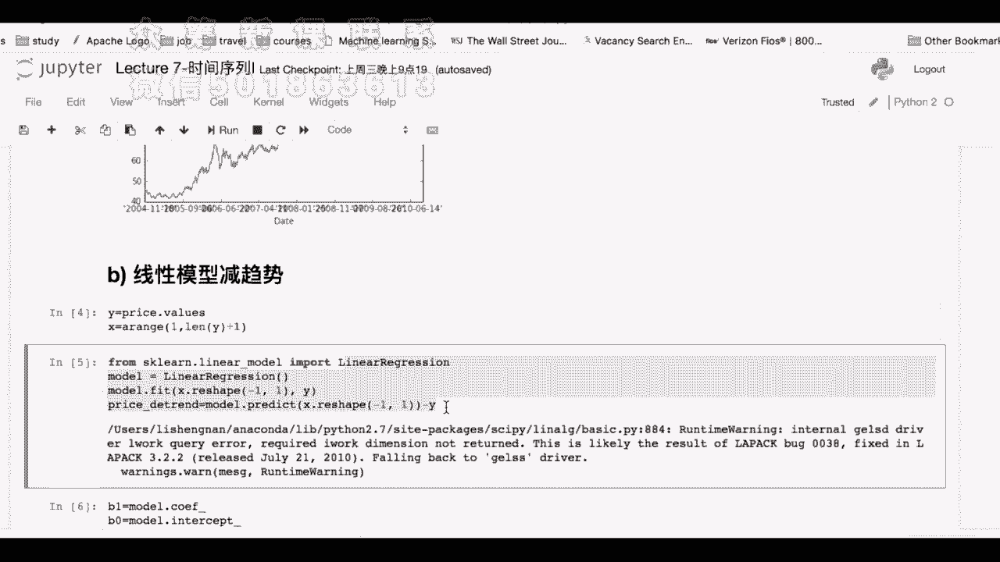

调用之后呢，我们有一个predict。

也就是predictor这条line上的y head的值，然后真实值减去y he值，得到我们去趋势化的时间序列，那么我们plot去趋势化的时间距离，我们就已经看到，它几乎不存在很明显的这个趋势性了。

那么我们来detect一下我们detrend data的act跟pack，那我们可以看到这个egg跟PC呢，就是过于的centralized aggregate了，那这个时候如我们前面所说。

但我们不是很清楚，我们这个阿玛model应该建多少阶的模型的时候，我们可以用ma项先进行尝试，所以我们可以待会可以先用ma1，对我们DETREND的这个model进行一个尝试。

来判断这个AR项进一步的AR项应该定多少节，那么这里呢先来看一下，我们通过一阶差分得到的data，那么我们就对price做一阶差分，得到的是这样的gold return time series。

那么也一样，不具备着明显的趋势性了，也没有很明显的季节性，那个是这个时候呢，我们对一阶差分的数据进行啊ACF跟pack的plot，那我们可以看出大概在六阶左右呢，都是一个显著不等于零的。

那这个时候我们有理由使用呢，AR6或者是阿玛六六，先进行一个建模来detect，我们的这个啊长差到底是否是白噪声的，那我们使用了这个嗯阿玛六六，那么得到的是如下的这个egg跟pack的长差plot。

那我们可以看出，不管是egg还是pack已经嗯全部显著等于零了，那我们就有流认为我们的这个模型，成功的把平稳的时间序列变成了一个白噪声，但是我们对我们的长叉进行了q q plot。

那我们可以看出我们的这个长差呢，还是比正态分布来的后卫很多的，那么这是什么原因呢，其实是因为我们这个模型，虽然已经被我们去造得到嗯，成为了一个y noise，但是这个时候的y noise并不满足正态。

而是一个相当厚尾的分布，比如说T分布等等等等，那么我们得用进一步的模型，比如说一方差时间序列，来改善这个样子的后尾情况，那让我们呃回过头来再看一下d trend data，做ma跟L啊。

LR线的model detect，那么我们先用MA1进行建模，那我们看到MA1建模之后的这个residual，也说是长差，那么是嗯诸如此类的app跟这个pack的model，那么说明呢。

ma1项不是很适用于我们的一些detraded data，那这个时候我们可以尝试着改用啊，嗯AR码一一项，因为这个时候的AR项呢，我们需要放一些滞后来降低我们的这个app f。

那这个时候我们使用arm1之后呢，得到了如下的模型，那这是模型的预测参数，关于AAR下跟ma项的，那我们plot我们的长差，我们可以看到我们的残差，已经不具有明显的序列相关性了。

当然当我们把我们的长叉用QQ图画出之后，这个与一阶差分的嗯，阿玛六六模型一样，它虽然是一个不字相关的序列，但是呢存在着后尾分布，那么关对于这种啊金融时间序列的严重后尾。

那我们一般呢是用待会会介绍的GARCH模型，进行处理。

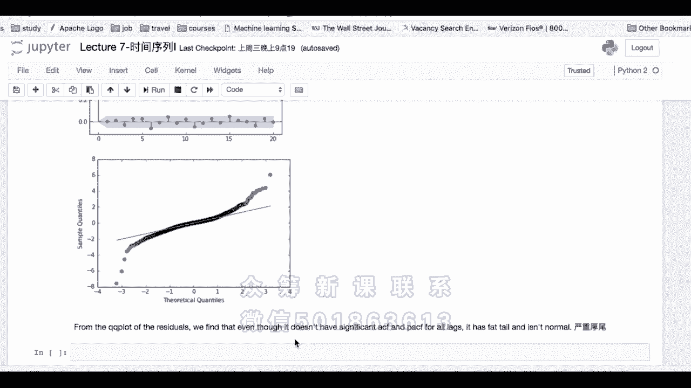

那我们来看一下这个R的建模。

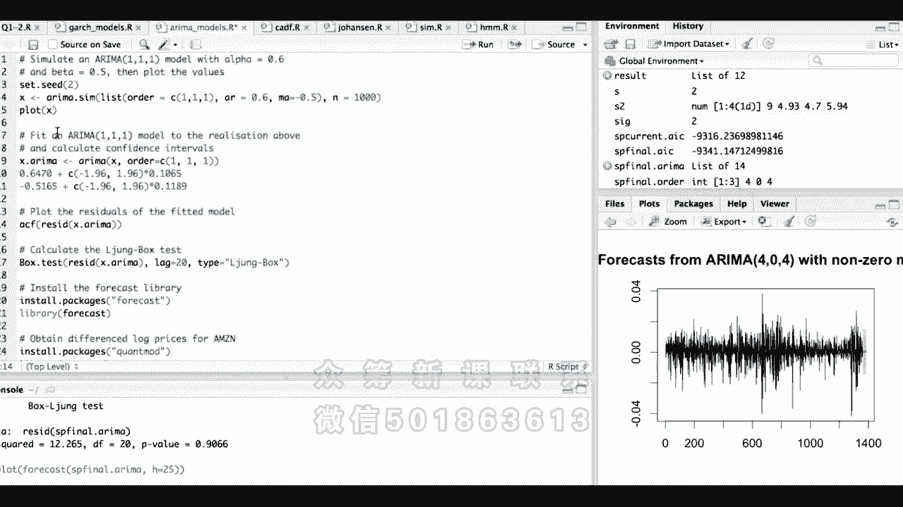

那么对于对于r studio来说呢。

我们呃具有跟Python corresponding的package，当然R呢对于做时间序列分析比Python更为强大，因为它的它的包呢更为完善。

那我们先我们先使用的是一个simulated的arm model，那我们simulate的是一个啊阿玛一一，但是存在着一阶integral的时间序列，那我们把它pull出来，它就是长如下的情况。

大家可以看到还是存在着明显的趋势性的，那这个时候假设我已经知道了，他是一个啊诸如此类大码模型猜测到了，那么我们用的是阿玛这个函数，那么第一个位置放的是sample。

第二个位置放的是我们人为猜想的order，那这个时候呢就得到了一个二维码，111的时间序列，那这个时候我们对它的长差进行plot，可以看出我们的这个app已经显著的等于零了，也就是序列不自相关。

那我们再对这个LINROBOX做一个检验，我们看到p value呢是嗯显著的高于0。05，说明呢我们有理由相信，我们的这个长差是满足y noise的，也就说明我们的这个模型是可靠的。

那接下来呢如果想做进一步的forecast，我们需要install我们的这个forecast library，并且呢进行input，然后嗯对于R里面呢，想要获取这个website上的time sch。

比如说Emo等的，比如说s m p five hundred，我们需要这个框mode，这个package需要安装。

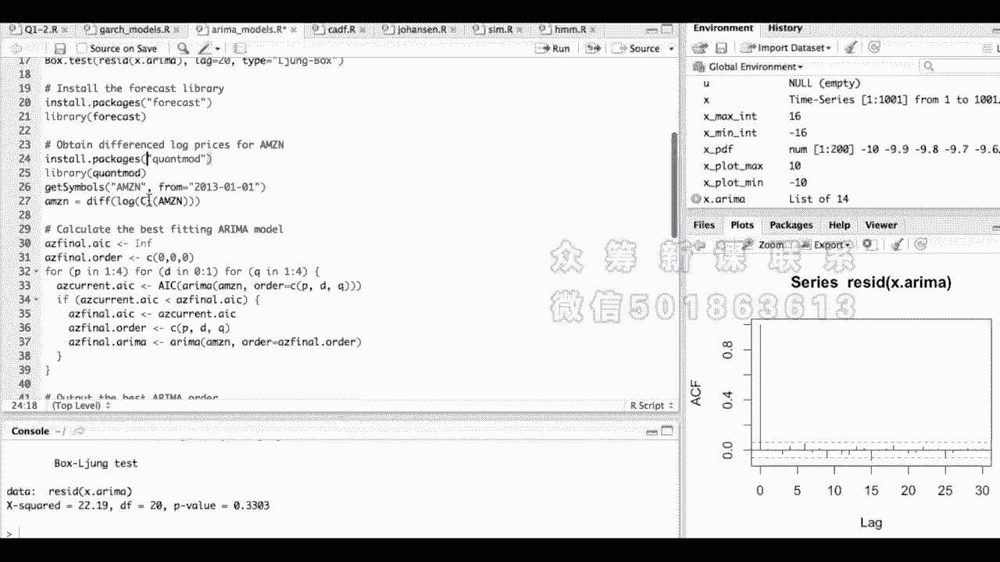

那么我们先获得这个amazon的symbol，那么我们对它呢进行这个log return的一阶差分，那得到这个之后呢，我们要对我们这个time series进行一个order的detect。

那这个这个地方呢，我们先我们先假设我们的这个order呢是000，那么由这个forecast的这个model，进行一个啊人为的自动的一个模型选择，那么使用的是AIC的方法，那这个时候呢选择完模型之后。

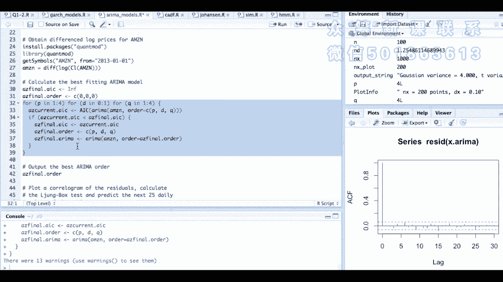

我们可以让模型告诉我们，他们通过AIC甄选，甄选出的最优的二维码的阶数，那么告诉我们的是，A2项是等于二，那么ma项是等于三的时候是他认为的最优的啊，Arena model。

那这个时候呢我们就依这个模型所选，对对这个阿玛二三模型进行拟合，那这是你和之后的残差PLOG，那大家可以看到已经不具有序列的自相关性了，那么对它进行而john box的检测发现呢，P值呢是显著的高于0。

05的，说明，我们有理由相信我们的这个长差是一个白噪声，是个y noise，那我们接下来利用这个forecast package，对我们上面建立好的remain model，进行一个25步的预测。

那么这个呢就是我们对这个amazon的logo，return的时间序列进行的古迹后嗯。

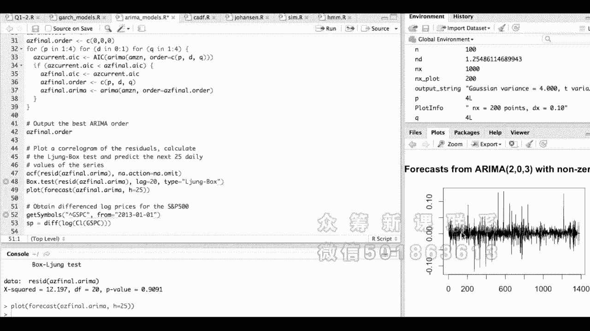

末端呢是我们的这个5G，那么那么上面的这两个区啊，区区域是什么呢，也就是在95%confidence level之间，因为我们的呃，因为我们之前会估计到sigma又是volatility。

我们的白噪声存在的volatility，那也就是我们的估计值要加减，这个volatility，乘以我们的95%的框tile，那么就得到如下的一个估计的置信区间。

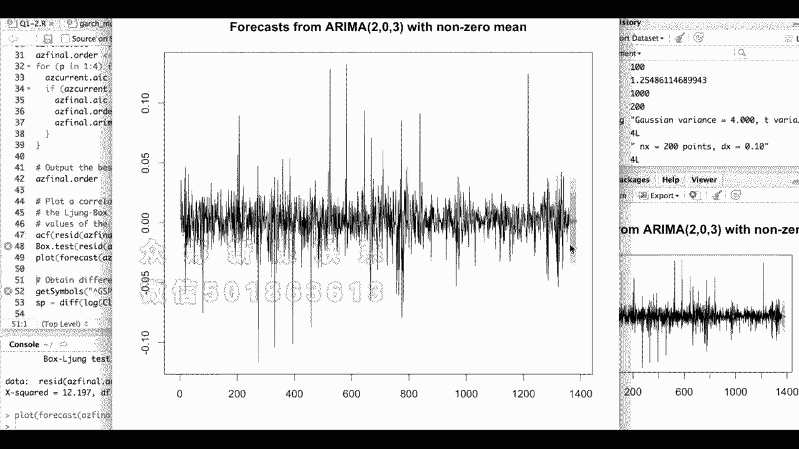

那接下来我们呃，接下来的模型呢是对SNP发判决举个例子。

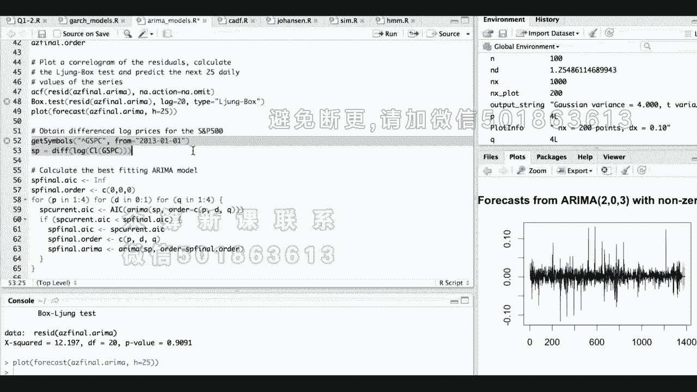

那么这个的一整个的操作流程也是类似的。

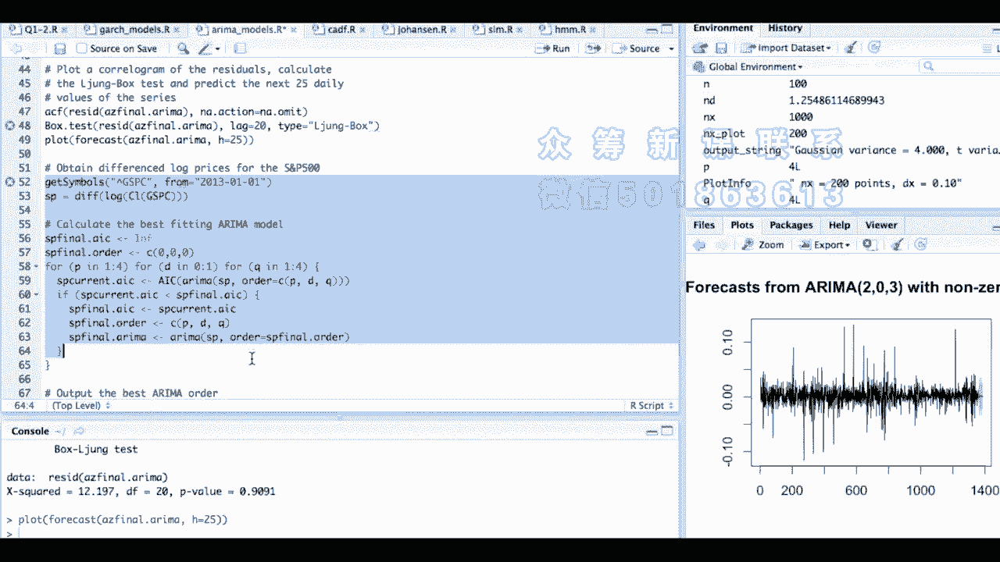

那我们就不再赘述，那么这个代码呢选同学回去可以自己看。

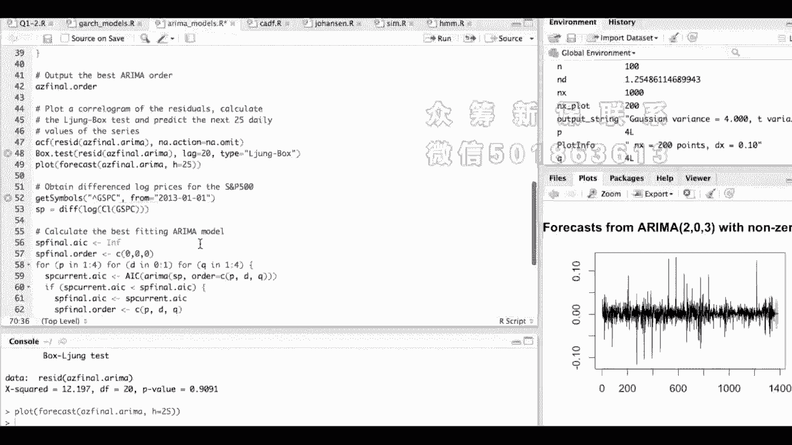

那通过我们前面在Python里对gold price的return的建模，我们可以看到，不管我们用什么样的平稳时间去，比如说阿玛六六，比如说AR6等等等等，我们建模之后得到的receive。

也就是我们的残差，虽然不已经不具备序列的相关性了，但是它的RECEDU依旧pro出来之后依旧存在着啊，波动率集群，也就是说它虽然不序列相关，但是它也并不是一个白噪声。

那这个时候我们需要对平稳时间序列的差差，进行一个啊波动率集群的一个进一步的建模，所以我们应该要考虑到，阿玛模型的长差的异方差性。

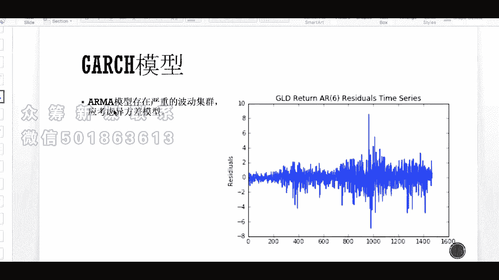

那什么是GARCH模型呢，嗯因为我们之前研究的时间序列模型，都是都是基于条件均值结构，也都是我们都是在预测我们的均值，我们也假定了我们的方差不随时间变化，当然对于这样的一种假设在时间序列。

而在金融时间序列模型上是不科学的，因为我们经常发现像股票的日收益率等等，总是在价格剧烈波动期间，比价格呢在相对平稳的时间内具有更大的方差，所以这个时候我们需要将方差随时间变化，这个特性考虑进来。

那波动集群呢给了我们一个一个启示，也就是收益率的分布并不是独立同分布的，因为当我们把我们的RECEDUPO出来之后，我们乍看觉得他的act是啊没有自相关性的，但是呢呃对于独立同分布的嗯序列来说。

不管对它做取均值还是线性变化，还是取绝对值还是取平方，它的它的transform之后的序列呢，依旧不存在任何的auto correlation，但是对于不字相关的序列来说，并不是如此的不自相关的序列呢。

取了绝对值平方之后的序列有可能具有相关性，所以这个时候，当我们对这个日收益率序列的这个样本，进行act x的point之后呢，我们发现它不具有序列的相关性，OK但是如果对它的平方跟绝对值样本。

在对x plot之后，我们就发现有一些显著不等于零的滞后了，那么这就印证了我们上面的说法，也就是我们具有波动集群的时间序列，它的序列虽然不相关，但它并不是序列独立的。

也就是它的长差并不具有白噪声的所有特性，那这个时候我们需要进一步的对这个之前啊，这个平稳时间序列得到的长差，进行进一步的建模，那么我们应该要检验我们的这个查查，是否具备的GARCH效应呢。

我们常用的是这个mac6立检验，它是构造了一个卡方分布，我们通过这个检验的P值来detect garch效应，那么我们对这个日收益率进行MACBOOK统计检验，并且呢将不同的滞后的统计量进行flow。

我们也可以看出来，当这个之后大于三的时候呢，它在5%的水平上都是显著的，那么这就印证了我们的数据，既有很强烈的GARCH特性，那么对于呃那个2H1模型呢，嗯是ego在1982年的时候。

提出了这样的一个易方差模型，那么他认为呢给给定过去的收益率啊，RT那么它的条件方差如果并非常数的情况下，那么我们将条件方差以西格玛七方进行表示，那么这个时候生育率的平方。

是这个条件方差的一个呃无偏估计量，那么那么基于这样的一个呃结论呢，我们可以写出如下的这个尬取一的收益率序列，的一个啊二取一的表达式，那么RT呢就等于啊条件方差乘以WT，那么WT呢是一个离散的白噪声。

均值是零，那方差呢是啊为一，那么对于这个条件，对于条件波动率呢，条件波动率的平方就等于一个常数，那么再加上一个COEFFICI乘以波动啊，乘以收益率的平方的阴间滞后，那么一阶之后呢。

也就是对应的RH1这边的这个order，那如果只有一阶之后的话，条件方差对波动率的记忆力比较弱，因为这个时候条件方差，只受啊收益率平方的阴间滞后所影响，那么如果想要啊进一步的update的话。

我们可以加上更高阶的这个收益率的平方，那么嗯因为条件方差呢是不能直接观测到的，所以我们不可能把这个条件方差带进去，直接进行拟合，那我们需要转换，这个时候我们用收益率的平方来替代。

我们构造这个tot等于收收入的平方，减去条件方差的平方，那么把它带回这个2H1模型的表达式，我们可以看到收益率的平方呢，是满足AR1过程的，那么这个给了我们一个很好的启示。

当我们要建立arch1模型而无法定结的时候，我们可以对生育率的平方进行建模，那我们可以plot这个pack for偏执相关函数，来detect，这个收益率平方到底应该满足多少阶的AR模型。

也就意味着条件方差，就是AR取多少阶数的这个模型，那为什么我们要刻画条件方差呢，这个是一个条件方差，对于收益率平方的一个推导，也就是为什么收益率平方是这个条件方差的，无偏估计，那对于推广的arch模型。

我们用的是GACHP，那么高举PQPQ就是不断啊，不断的是放入了这个收益率平方的滞后项，我们还放入这个呃条件方差本身的滞后项，那我们可以我们可以通过一样的推导得出，如果我们用收益率平方来替代这个。

条件方差的话，我们coach pq模型，也就等价于收益率平方的阿玛PQ，那我们可以利用收益率平方来进行啊，GSHPQ的金数的检验，那下面让我们来看一下这个R的，关于GARCH模型的代码。

我们首先呢先做一个这个啊模拟，就是我们模拟一个GARCH11的这个模型，那么阿尔法零，阿尔法一和贝塔的参数，我们先事先的设好了，那么，那我们设好之后呢，我们来plot我们的残差的。

这个残差本身和残差的平方，那我们可以看出，这个长差虽然本身不具有序列的相关性，但是长差的平方呢就显著的具备序列相关，也就印证了这我们之前提到的arch模型，它并不是序列独立，而仅仅是序列不相关。

所以对它做平方的这种transformation之后呢，就依旧是具备着平方的序列相关，所以我们需要用SCOUCH模型来建模，而不仅仅是AR码模型，因为arm模型没有办法detect。

它跟呃这种平方向的相关性，那么我们在R里面呢，用的是t time series这个package来做GTCH模型，那我们先install install之后呢，导入。

这个时候我们用我们用这个default，和GARCH模型进行建模，那default就是gtch one one，那建好模型之后呢，我们可以看一下我们这个GARCH模型，estimate出来之后的结果。

我们可以看到我们在这个执行区间内，那A呢是减去0。7，那A1呢是在一左右，那B1呢是几乎接近于零，那就跟我们上面的假设是一样的，那这个时候我们用一个额这个f t s e one。

hundred这个指数呢做一个啊金融数据的建模。

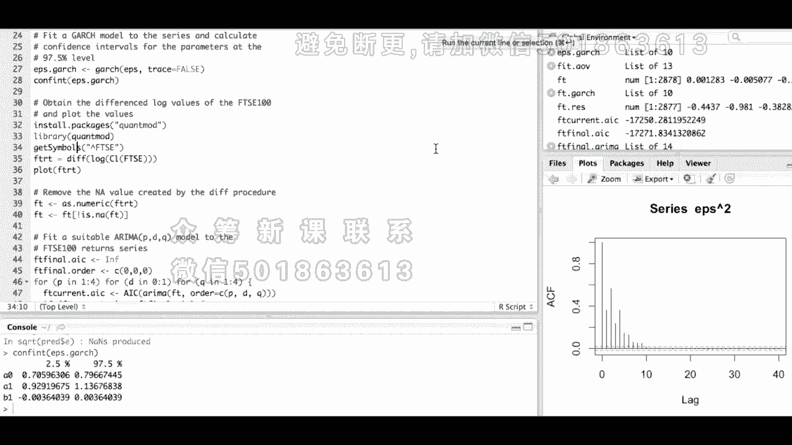

接下来呢来看一下，一个应用在金融时间序列上的，是对于f t s e one hundred卷指数，进行GTCH模型的拟合，首先呢我们导入这个qun mode package。

那我们在get这个FTICE的symbol，然后呢对它进行blog的一阶差分，那我们得plot，我们的这个金融时间序列的log difference，那我们可以看出，虽然它不具备着季节性。

也不具备着一个明显的趋势，但是我们可以看到显著的波动集群啊，像在这几块的区域中，那这个时候呢我们可以先尝试我们的嗯。

平稳神经学院模型啊，阿玛模型可以看一看，阿玛模型得到的是一个什么样的结果。

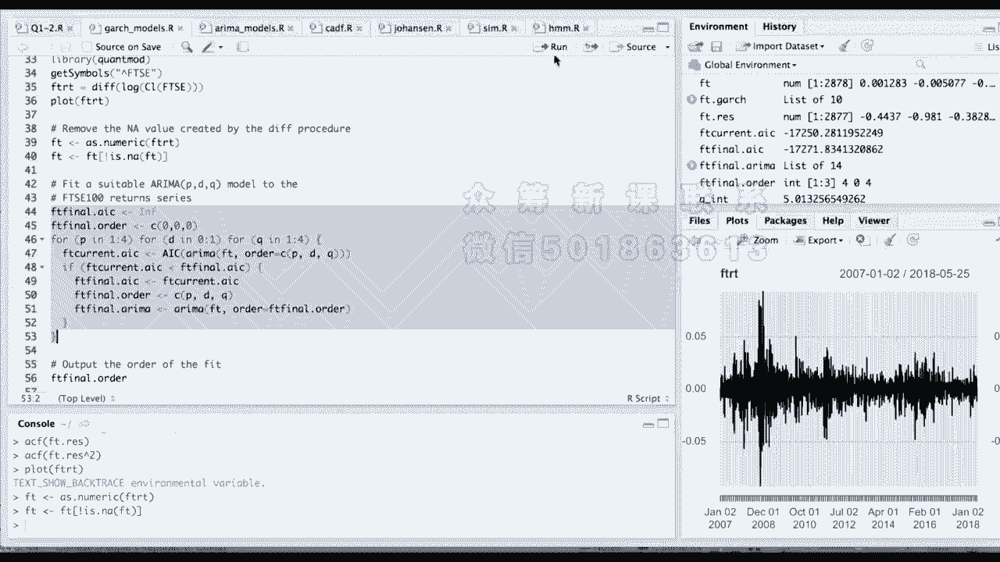

我们依旧能利用AIC进行模型的甄别。

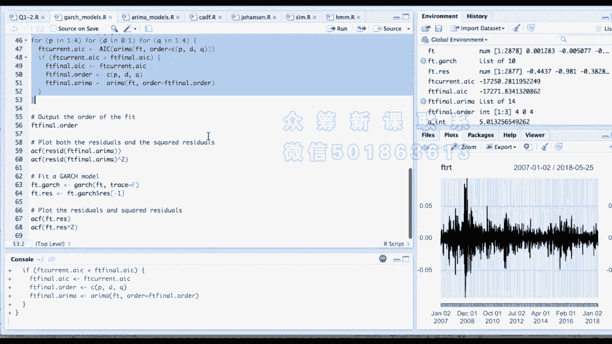

那我们得到了我们的这个final order，就是AIC甄选之后，推荐给我们的阿玛模型的阶数，那么是阿玛四四，这个时候我们基于阿玛四四模型呃，得到残差，那么对残差进行plot，那么看似一阶呃。

长差的本身呢是不具有序列的相关性的，但是长差的平方呢，却具有非常明显的序列自相关，那就印证了我们之前的想法，也就是平稳时间序列模型，得到的仅仅是一个序列不字相关的啊长差，但是它并不是序列独立的。

那至于我们对于长差是白噪声的idea是相悖的，这个时候我们得引入我们，波动集群的GARCH模型，那么对GTCH模型进行GOTCH11的拟合，那么拟合之后呢，我们再进行长沙检验。

我们会发现音阶非常成功的pass了我们act test，那我们可以看一下我们长沙的平方，那么残差的平方依旧不具备显著的相关性，那就说明我们的这个GTCH11模型，成功的对我们的这个FTSE。

one hundred指数的log呃，一阶差分进行了很完美的建模，那么下一节课呢我们会介绍写整的时间序列，包括卡尔曼滤波，也就是动态的时间序列的拟合。

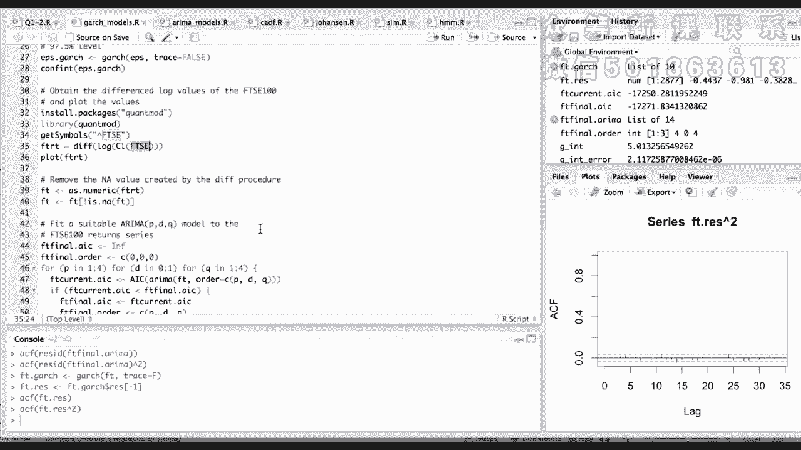