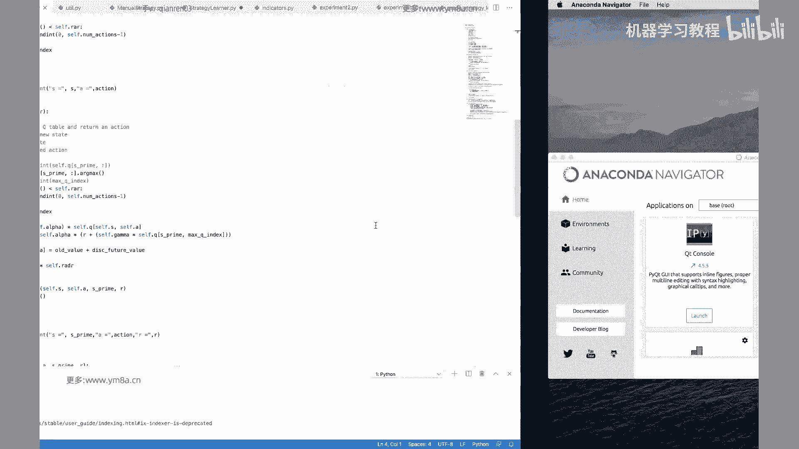
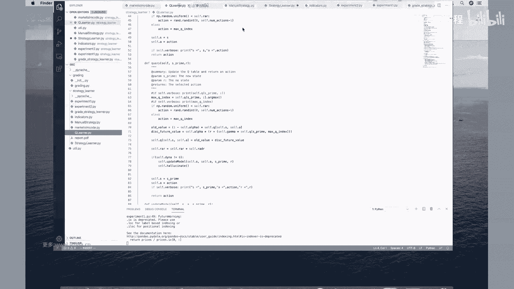
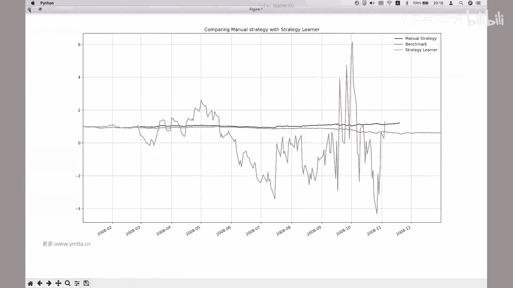
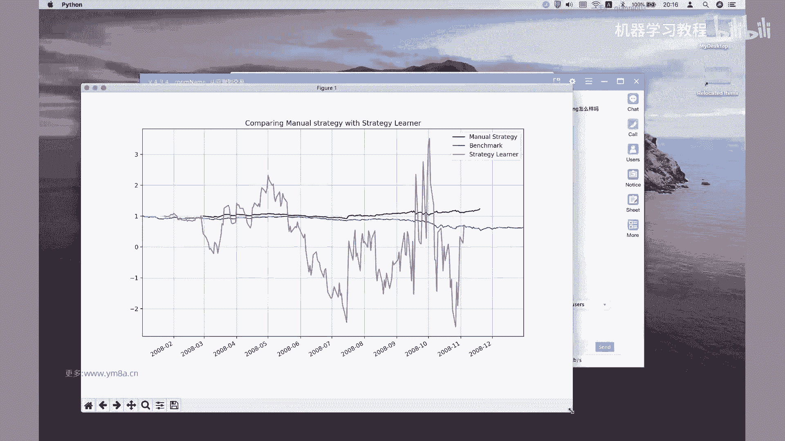
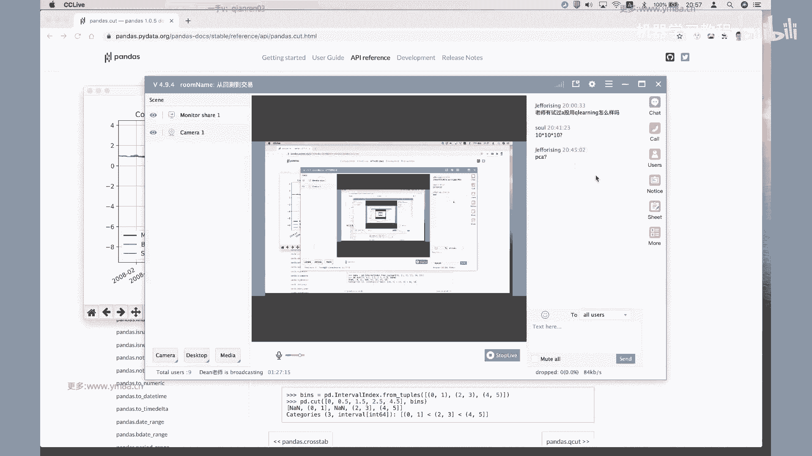
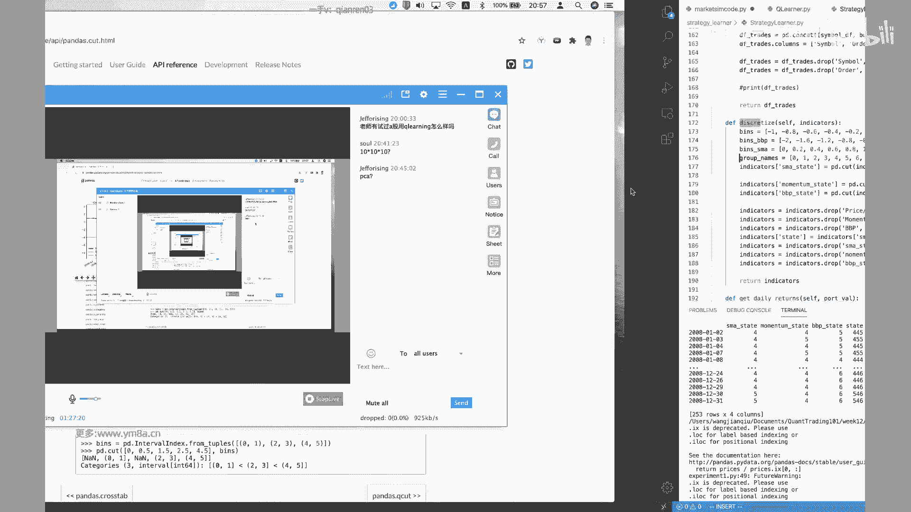
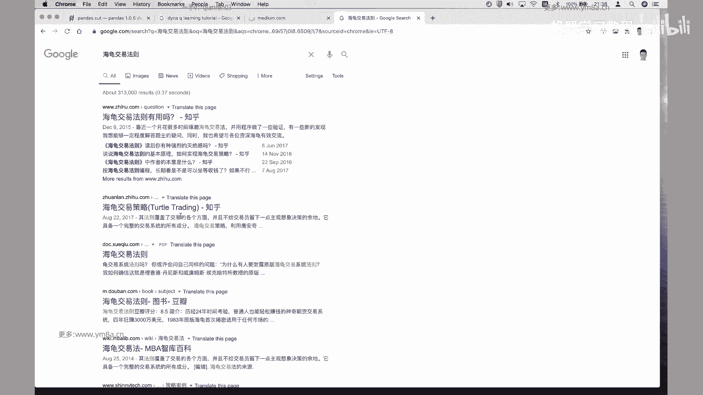
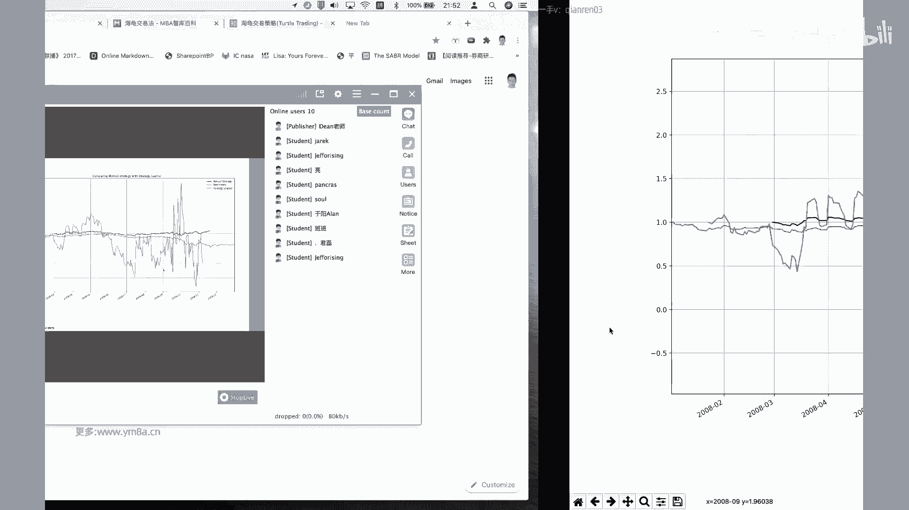
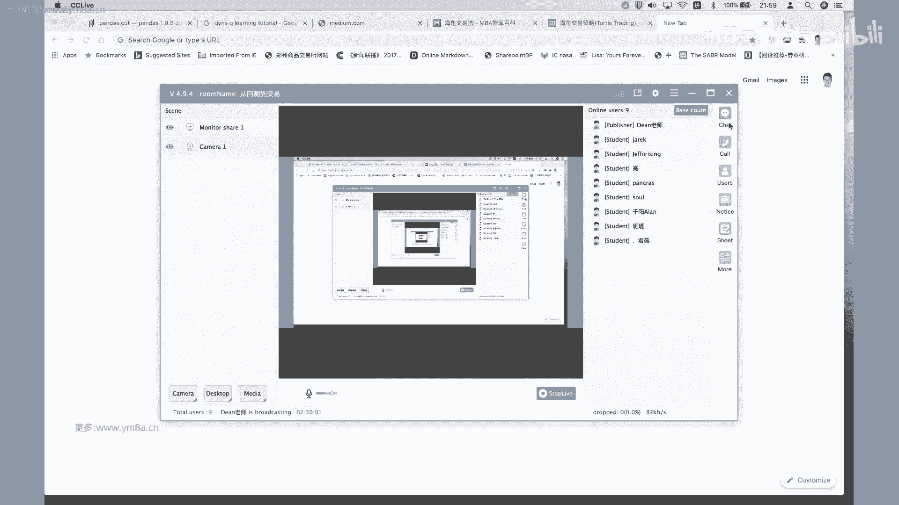

# 【比刷剧还爽！】这太完整了！AI量化交易实战课程，全程干货无废话 入门到精通一步到位！（数据挖掘分析／大数据／可视化／投资／金融／机器学习／算法） - P12：第一十二章： 从回测到交易 - 机器学习教程 - BV1Km421G7nH

OK诶各位同学们稍等一下，然后课程马上开始，来同学们稍微等一下啊，现在呃现在到的人还比较少。

哎好的嗯，那各位同学，我们今天还是就开始吧，虽然今天带的人到的人比较少，可能就三位同学，然后今天我们呃接着上一节课的内容，上一节课我们是讲到用q learning做了一个简单的。

就是说去寻找路径这样一个robot，然后呃今天我们再讲一下，就是怎么把q learning这一块，应用到实际的交易当中去，呃，其实整个这一块的q learner，仍然是上一次的q learner呃。

仅仅是有些变量的变化，整体的结构完全是一样的，就是如果上一个的上一课代码大家有仔细看过，并且把它调通的话，是可以直接用到这一课，当中来的，因为本质上q learning只是我只是定义了一系列的。

就是针对于状态不同的状态下，我应该做出怎样的action呃，对，然后我们今天这里可以看看，怎么把这个东西应用到我们实际的交易当中去，然后先看一下我们的数据呃，数据的话我们选取的是从二零呃。

08年到2012年的时候，标普500的这样一个美股的每股的一个日数据，而这个数据比较简单，只有一个只有只有量加数据，然后我们其实主要用的是就是它调整后的价格，Adjusted cose price，对。

这是在他的最后一列，然后下面是对这么多标的的额，这么多标的的额，它的价格的时，价格的时间序列，然后在刚开始的时候，我们先看一下，这里面有一系列的就是utility函数呃，我看见OK有TXT函数嗯。

这边嗯第一个是啊我们需要去load，我们的就是嗯symbol to pass load，我们这样的就是不同的价格的数据，这本质上是呃就是说去读到data文件夹，然后读到相应的symbol。

点CSV这个文件对，然后get data里面这里面有一个就叫at s spy spy，就是说我们要不要把我们的标普额，500的这样一个指数给加上去，如果是默认的话是加上去的话。

我们就把我们的SYMBOLIST里面去加上，这样一个内容对啊，然后接下来就是一个这样一个循环循环之后，然后我们会把所有的data frame啊，都给join到一起去对啊。

OK然后这里面有一个就是它是就是呃job，Dates spy，就是电脑trade对，就如果那天嗯就是说指数没有的，没有的话，我们默认为那天没有交易，然后我们最后把所有的data frame给返回回来。

返回回来，然后接下来是对一系列的，然后我们再去看，还有就是嗯这里面来说q learning的话，呃，并不会说我们的q learner，并不会说直接说，直接我们从呃最基本的量价数据，不会直接从量价数据。

然后给到最终的决策，那显然大家想一想，就是价格相对来说是一个嗯，相对来说会比较随机的呃，是一个首先它是一个连续的数据，但是我们在上一节课所学到的，就是说呃所所学到的state跟action。

其实相对来说都是会是比较离散化的对，那么就是在实际去交易的，而实际去交易的过程当中，我们是肯定是需要对价格兴趣做一样的处理，那么呃就结合我们之前课程当中，所学习到的一些东西。

我们在之前花了很多精力在讲什么是因子，到底怎么去挖掘因子，那么实际上就q learning的本质上，我们我们也是需要去借助我们现有的因子，再去呃，在计算因子值的基础上，然后这边有一个就是有一系列的。

就是啊MANU的strategy，就是本质上我们会我们今天考的考虑的是三个，就是三个的三个因子，第一个就是呃是simple moving average对，然后这个就是一个简单的那个呃。

大家看到这边有一个那个rolling的min，就是一个简单的啊，简单的就是要移动所谓的移动均线等，并等权重对，所以是啊simple movie average，然后这边是，然后接下来有一个就是布林带。

然后布林带的话呃，额布林呢，其实就是说我们在一个简单的均线上面，然后加一个加一个band，然后哦这个BBEND的BD的值是，一般来说是，就是你取决于就是说你想要想要有几倍的。

这样呃呃有有几倍的这样一个差，然后一般这个banner值其实基于布林带，你也可以去进行很多的调整，你可以用啊论价格的波动，或者是呃就是说这个带宽，你是可以自己去进行调整的对然后。

对嗯包括我们包括我们这边用的因子是呃，Simple movie average，然后如果你想要进一步去研究的话，其实我们之前已挖掘到的各种各样的因子，都可以去尝试。

那为什么挑选就是一个是moving average，然后一个是布林带，还有一个是呃，还有一个是momentum，这三个来说相对会比较经典一点对，然后然后注意的话，我们这边在呃我们这边在整个做的时候。

我们是会把价格先去做归一化的处理，比如说我要拿后面呃呃T加N的每一天的价格，我们会去除以除到我们的T0的这样一个价格，就是第第第零天的这样一个价格，这样的话我们啊，我们可以价格就是从一区开始计算呃。

然后这个是在啊normalize对，就normalize的主要做的事情，首先是嗯把价格进行补齐，前想跟呃就是跟后相对，然后然后呃其实这边就是说嗯就是向前嗯，就是把前面就是如果当天数据空缺的话。

从前向后补齐没有问题，然后呃如果就是，然后然后再用一个从后向前补齐的，可能会出现一个问题，因为本质上来说可能会用了一点未来数据，当然因为这边是日级别的，可能呃日我们本身做的是日级别的交易。

然后作为一个模型的展示来说，应该对我们的整体影响是不是特别大，所以这边就会简单的先是这样补齐啊，补完旗之后，我们会把就是price，然后除以它的价格区别，除以它第零天的这样一个呃，第零天这样一个值。

所以我们这样就得到了一个，就是把我们的所有的股票价格就是都归一到，就是从一开始，因为我们看到就是啊对，就是这边的每个股票，比如苹果的价格可能就就是比较高，然后数数值会比较大，然后有一些啊。

比如说AA的航空公司的话，那就但相对来说股价会低一点的话，那这样的话我们把都把它画成一个标准的序列，去啊，去对比研究对，OK嗯这一块就是大家有什么问题吗，这边是主要是这个function。

是里面我们会去计算三个因子对，然后就是嗯对，这个函数啊，我们是就是有data range，我们有初始额前就是起始日期，然后跟结束日期，然后那然后用pandas这样一个function。

直接就生成一个呃data range这样一个范围，然后这边再用到就是utility的呃，get data的，我把它放在右边，大家可以参照着来看，就我们会去就整个只计算因子的过程是嗯。

看着我这边写好几个方程，然后接下来是啊现漏的全部的数据，就是我们这边的get data，get data的话，然后你这边single，我们这边是只有一个JPMORGAN对呃，读完数据，读完数据之后。

同时他会把我们的呃benchmark，标普500的这样一个指数给s spy给加上去对，然后读完读完之后，我才会把所有的价格去进行normalize，然后得到了normalize价格之后。

我把它价格作为一个input区域输入到我的呃，输入到我的就是function当中，然后这边是rolling days，这边用的是20天的均线，然后呃对，然后这边他还加了一个，这边是用一个。

就是我们还用了一个，就是用price除以一个simple movie average，然后嗯然后是布林带计算布林带，对咳大家注意就是布林带的话，你是有就是呃上轨跟下轨这两个对。

所以它返回的是一个就相当于是一个结构体，或者是dictionary之类的结构对，然后这边是有一个他做了一个，就是啊我们这里做一个就是他做了一个percent，是什么意思呢。

就是拿我们的价格序列啊去减去我们的下轨，然后再去除以上轨到下轨这样一个值呃，这样一个差，本质上来说就是说嗯这样我可以说，如果说我正好在上轨的话，那如果就是我价格现在normalize就正好在上轨。

那么这个值就是一，那如果正好是在下轨的话，lower是零，那正常如果我们默认大部分的时候，价格是在上轨和下轨之间，那么这样值就是0~1，那当然说如果价格是突破下轨的时候，当价格突破上轨的时候。

所以我们这样子的话，我们得到了，price和simple movie average这样的一个比例，还有一个是momentum，I'm sorry，I'm sorry，刚刚可能还没有讲momentum。

我这边用的是什么啊，MOMMOMENTUM说从字面意义上来说是动量，然后他这边做的是我们这边做的，实际上就是说是把啊我就是动量的话，反应就是说嗯在物理上动量是反映的。

就是说是嗯物体的质量乘以它的这样一个速呃，速度，所以然后呢反映到就是价格区别上来说，我们这边因为我们讨论的是价格，然后我们看到的是，就是说我们是用多少天之后的嗯，嗯用20天之就是之后的这样一个价。

别的价格的这样一个差，然后再去除以我们就是20天呃，之前的这样一个价格，这样我们把它作为一个momentum，其实反映的就是说我在这20，在rolling days这期间之间，我价格的这样一个变化。

OK所以呃我们对于这，我们现我们今天选用研究的主要是这三个因子，所以simple2就是simple moving average，衍生出来的price跟额价格移动平均的比例，然后一个是动量因子。

然后然后一个是呃布林带对对，可要注意注注注注意一点，就是说我们这边其实都是把它，我们没有用绝对的数值，而是把它去转化成了呃嗯转化成了啥转，无论是0~1还是一附近这样一个值，这样可能会方便我们的处理。

然后那就是说也就是说然后其实想到就是说呃，我们之前有讲过，就是说怎么是去做因子的研究，那我这边只是选了三个最简单的例子，那么实际上再去说，我们在考虑把这个东西去运到，运用到交易当中的时候。

我可以是把我的呃，把我之前拿过来的因子再去做检验，作为我的这样一个输入，然后我们再去把它再进行强化，再把它放到强化学习的模型当中去，当然当然当然这里面模型相对来说，就是说我们用的不管是q learn。

Q learner，还是说我们的因子都会比较简单对嗯，然后我们再来看一看呃，到这部分就是说关于数据的import呃，导入跟呃，跟我们就是说计算因子大家有什么问题吗，嗯嗯刚刚有同学来的会比较晚。

然后再讲一下，就是这节课我们讲的是，怎么把强化学习应用到，就是额股票的交易当中去，然后我们上次我们仍然是接着，就是说我们用的是上一次完全一样的，q learner对，但是我们呃。

但是我们可以把就是说这样的q learner，是应用到呃，就是说应用到回撤跟交易当中去，我们呃就是说呃，事实上就是上次上次课我也提到，就是说这样一个q learn的这样一个class。

其实呃它是会比较一个通用的，就是说不管是我对于任何呃，对于任何我想要去建模的这样一个系统，只要我能去把它进行进行离散化的处理，我都我可以我都可以去定义我的state，我的状态。

然后嗯然后去计算我的q table，然后我也可以去，然后我也可以定义一系列的action，就是说我想要对这样的这种状态，进行什么样的反应，然后我也要去定义一系列的reward。

reward function对，所以说这这样的q learner这样一种方式，相对来说是比较通用的，很贴通用的一种方式，对那时候我可以用它做我们上一节课的啊，就是去就是做一个路径寻优的。

这样一个解决这样一个问题，然后我也可以把它应用到股票交易当中去，这是这节课的这样一个背景，嗯嗯同同学们到现在有什么问题吗，然后在这边的话，我们就是说呃我们最后是要去对比，就是说一个是。

就是说我拿人工那一个去交易的模型，效果会有什么样的区别，嗯然后这边是这边有symbol，这个选的是apple，然后start date跟end date，然后然后start value。

然后这个是选的是10万美金，OK然后就是说我们这样子做了，这边会做一个就是呃简单的simulation，我怎么去，然后怎么来去进行交易对，然后我们这边是首先还是一样的，就是呃漏的数据。

然后得到所有的price，然后去呃，然后然后去进行normalize对吧，这个完全一样，然后这边选取的是moon error，这是选取的参数是20天，然后接下来是分别计算呃。

Simple moving average，然后咳然后是计算columns额，就是计算在计算我三个这样的一个指标的，这样一个值对呃其实是跟前面的就是computer呃，在。

跟这个还function会有点像，只不过我们这边肯定有把重新，就是又重新去implement了一下，对，然后计算完这三个值之后，计算完这三个值之后，然后接下来就看到就是说呃这边是这边呃。

我们在这边做回测的时候没有考没有用，之前就是复杂的，就是说我考虑一个个event，然后就是我还要去考虑，就是说我交易什么时候成交，那这边实际上没有，因为我们日级别的交易我们都默认就是成交。

成交在就是adjusted，就是日收盘的价格上，对调整的日收盘价格上，所以这边其实简单的就是说是刚开始的时候，在啊每一天我得到这样一个价格序列的时候，我都咳咳，我都要先去得到今天的呃，这三个因子值对吧。

然后得到之后呃，然后再看就是我们这边的symbol是，比如说这边是apple的话，然后这边这是很简单的，用的是规则交易，那这个规则是啊，Sorry，规则交易就是说当我的动量值小于-0。05。

然后我的布林带小于零的时候，同时我的simple movie average小于0。95的时候，那啊那这个时候我就会把我的偷偷，而并且此时我的持仓数量是小于1000的时候。

我会把我会就是说我这个order我发出一个买单，然后如果这个持仓是等于零的话，呃，那么我会把我的持呃，把我的持仓就是说设为1000对，然后同时我总持仓加1000，然后另外的话就是说呃。

如果我这时候已经有持仓的话，我这时候会把我的嗯，就是我会我会把我的order，而是order是就是说我这个是是是进行去，相当于是去加仓，我偷偷holding，变成就是说得去额，就是说加到2000呃。

sorry不是加到2000，是加2000，然后其实这这个这个意义就是说呃，正常来说是他做的其实会有点类似于，就是说是均值回归，一般来说如果我是要去做突破的话，比如说我价格突破了。

这样我定义的一个就是区间的时候呃，呃做ct的人可能会考虑说OK这个价格，比如说出现这种现象的呃，概率会就是说如果我是做突破的话，我觉得说这个趋势可能会持续额，那其实这个时候我要做的不是去。

也不是去买回买回来，比如说价，那这个时候价格下跌的话，我可能会考虑的是进一步的去去做空，或者是保持空仓，因为这边是美股的话，我们这边实际上是考虑是能够有负的仓位的，对对，所以所以但是这边肯定考虑的是。

我们考虑的就是说啊价格，比如说是三个西格玛事件之外的事件发生了，那么我认为发生这个事件之后，大概率他还要回到正常运行的范围内，所以这个时候我考虑呃，就是说我们采取的行为是买对。

因为只是作为一个benchmark，对哦，并不是说这个策略一定是可行的，然后对同时嗯这边会，然后这边其实呃就是说我们有多个交易的，这个是多个因子的时候，或者说你一个因子，其实我完全可以把对应成。

一个一个的一个交易准则，那边用的是三个影，三个影子，当我这三个因子同时满足这个条件的时候，我才会去进行啊买买单的交易，所以嗯对这边就是说我们这这一块的相对来说，模型会就是说会偏简单一点。

我们主要是为了展示就是q learning，那么实际在去应用的时候呃，一方面是说我们可能在，就是说在因子的组合方面不会是简单的，直接说是用三个取交集的这种方式，你可能会用说是不同的因子值。

我会用呃用加权的方式，或者是怎样算出一个新的因子值，然后根据啊新的因子值的这样一个范围，再来去做交易的决策对，然后然后这边是，然后另外的话我们看就是l else，If。

这边这边就是说本质上是说我什么时候去做self，对吧，然后嗯其实其实就是说这边简单的就是说，我们来做一个就是做market simulation的时候，其实说呃就是说其实就跟我们之前会讲的，有点有点像。

就是我要去考虑我的position，然后我要去考虑我的就是trade对，然后所以我们这边要做的是trade，是把我所有的就是哼哼就是呃所有的就是，然后这边就是呃by cell都把它去呃。

都把它给都把它给抽出来，然后这边by cell是呃，就是就是就本质上就是我的，就是就其实就是我的order嘛对，然后啊把我的然后生成这样一个，然后把就是说我有去交易的这一些呃。

trade给大家去提取出来，如果没有的话，就是零对吧，然后把这样一个trade去返回呃，然后这个在跑的时候呢，呃这个function其实跟之前是重复的，这边在跑的时候其实就是额选定一个标题。

然后选取选取我们的起始时间，然后接下来我们待会再去看这样一个方式，然后去就相当于说把我整个的就是刚刚是讲了，就说我们这个function是这这这function，本章是说我的交易策略是什么样。

MANU人工的这样一个交易策略，然后这一块是就是说我们是怎么来做market simulation，就是怎么来去做这样一个回测的，其实这部分的话代码额，同学们可以之后去额自己看或者是对。

其实因为因为跟我们之前讲的，其实没有特别大的区别嗯，然后无非是这边就是说我们考虑的，就是我对于市场的Impact会有没，就是说有我可以考虑说一部分是手续费，然后一部分是我的。

相当于对市场这样一个冲击的这样一个影响，对呃，其实就是说所以我们会看到就是在，就是我在算每一次的就是cash的时候，我交易完之后这样一个cash是什么，是啊，是我之前的就是呃是我之前的就是价格产业的。

就是啊价格，然后乘以于说我的交易，然后我会去减去我的手续费，然会减去我市场冲击的这样一个影响，对这个就是跟我们之前算的就是是非常非啊，就是非常是相似的，就本质上那就是说我在算绩效的时候。

就是把我所有的order去逐渐的这里去，这样一个循环就就可以了，然后然后去啊，就是一嗯，就是一个个按照我的时间序列去更新我的，我的trade对，然后再去计算我的就是说然后根据时间，然后再去算我时间序列。

我累计的这样一个commission，然后和我的Impact对，所以这部分代码是相对比较简单，然后额然后这样这样是像holding的话，holding的话就是说后一个是就是说呃呃我持仓。

就是说我现在就是我交易是多少，然后是啊我现有的股票是多少人，那么我把交易跟股票加起来，就得到我现有的这样一个持仓，然后呃得到持仓之后再乘以股票对应的价格，就会得到我就是我这样的一个市值对吧。

那么我的portfolio的值的话，就是说把我所有的股票去加起来，就是自沿着，就是额很就是如果是一个data frame的话，每一行，我把所有的这样的股票的持仓都给加起来。

得到我总的这样一个portfolio value，然后得到portfolio value之后，我就可以去计算我的啊，cumulative的return，Cative，return的话对，这是more。

按P整个PFOLIO最后的值减去最刚开始的值，阿sir是除以最刚开始的值在于减一，或者你是对，然后你要去，然后然后这边还有就还还有一系列的，就是我们的统计。

一个是呃daily return dareturn的话呃，就是把我们的，你相当于说相当于是做了一个shift对，然后把每把每天的return给算起来，然后呃然后是average data return。

然后呃stand and standard division of delior，然后再去计算，就是sharp ratio，SHARATIO的话之前也讲过，就是我们的呃。

先是就是我们的return date return减去risk free interest，减去无风险收益率，然后再去算啊，就是然后再去算，我们的就是呃呃把这样的一个呃啊sorry，这边是对。

然后这个是就是252个交易日对，然后根号252，然后是我们的就是嗯减去我们无风险收益率的，就是调整过的这样一个return，再除以我们的就是每每天嗯每天dav return，这样一个标准差。

这样得到我们的一个就是年化的夏普率，对这边是一个基，这边是一些统计对啊，然后呃如果大家还记得，就是另外一个重要的指标是最大回撤，对这这个我怎么计算最大回撤，大家可以再复习一下。

这个我们大概是第一课还是第二课讲的，因为因为因为这个问题，我觉得还蛮经典的，就是其实我每次会面试别人写代码的时候，其实都会去让我们大家去计算，就是最大回撤，看每个人是怎么怎么把最大回收给实现出来的。

对OK这部分就是说再回到manu strategy呃，大家看到就是说其实我用两个简单的文件呃，对加上一些就是help function，我事实上是事实上是可以去做出，就是说我怎么去计算这样一个呃。

怎么去计算出这样一个绩效的，然后sorry，这边可能，额这个可能看的不是很清楚，因为就是strategy learner，待会我们会去讲，这个是因为相对来说仓位控制的会比较夸张。

然后我就简单的这样一个MANUSTRATEGY，是这条黑线，而事实上是已经就是已经打败了，我们的这样一个benchmark对，当然当然因为回撤区间比较小，也有也有存在一定的偶然因素，对呃对。

但是但是我只是想说，就是说呃就是说实际上是说做日级别的交易，我要去简单的simulation，相对来说是比较容易的对呃OK那么额啧啧额呃，大家现在有什么问题不，对呃我停下来让大家看一下，看一会对。

就是说呃，本质上我们是在就是把q learning跟我们的额，简单的基于规则的教育策略去进行一个对比，当然也不是说q learning表现一定会比他要好，但是我们考虑的是怎么去把我们之前的因子。

或者说是规则，跟我们的呃强化学习去结合到结合到一起去，对啊，对其实呃就是说我们要去自己再考虑做，就是去做事做的时候嗯，之前我们讲讲的就是在研究过程当中时候，我们可以去批量的就是把它去把它去。

就是说一个个哦我可以去测试，有不同的因子怎么样，但是实际上就是说你把它整合到你的回测里面，的时候，最好就是说呃呃是把它写成一个function，或者是嗯嗯就juvenation function来维护。

你，也可以就是说写成一个呃，对你可以用一个function，我都会存在这样一个文件当中，然后哦之后再去说再去计算的时候，我都可以去把它呃就是去调他的，就是去对去去靠这样一个function。

然后把它给算下来，但是就是说呃，呃实际交易的过程当中时候是嗯可以这么做，然后事实上我也可以，就是说呃我不用说是等到价格，就是呃还有一种方式是说呃，我把我历史上的所有的因子值，就是我做。

不管是做回测还是还是去实际交易的时候，我还去要要要获取历史，比如说历时20天的因子值，我其实都会把相应的因子值会预先给算好，然后就是存成文本文件或者是存到数据库里，但你一般在实际去交易的时候呃。

不会去再去去拉数据库，或者是去重新计算，直接可能就直接漏的这个文件，把它加载到内存里，这样说呃，在内存里我可能就已经有了，比如在第一根bar推过来的时候。

我实际上就是说就像嗯像这个simple moving average，时候，在实际交易的时候，我们可能不会就是说是去去掉这个方程，因为额考虑到性能的问题嘛，就是你我要去把20天的数据都去相加。

那可能就不会这么去算，那这边我可能比如说嗯我有20天的like，我有过去呃，19天的moving average，就是ma的值，我会直接把这样的一个值去哼，就是啊去discount乘以0。95。

然后我再去加上我最新得到的这样一个price，再去乘以0。05对，因为这这这样计算的时候，我只相当于说我这个值是呃嗯19天的呃，SMA我是已经知道的对，然后我现在又新推来了一个数据。

那么实际上我再去计算的时候，我只是计算了三部对呃，呃两个乘法加一个加法对，这个事，就是说实际去就是说我在去程序当中去啊，考虑优化我的速度的时候要去做的一些事情，当然这是这是一些小的trick。

就是说呃可能很多时候程序的就是说你的瓶颈，可能都不是说在程序当中的去优化对，但是说他如果说我其他的网络等等，所有的东西都已经优化到好了，优化到极致的时候，呃，就是说包括我所有的程序代码已经写成C加加。

去执行的时候，那么呃在最后一步的时候，可能要做的时候会去去做这些优化，甚至嗯有一些极端的可能，就是如果如果逻辑比较简单，我可能就是说并且是高频区计算，向期权去定价的话，那么可能大家都会用。

然都会都会用去用基于硬件芯片的方式去做，然后这边举的这样一个例子是嗯就是说嗯对，就是说不能去嗯，就是我们再去写计算这些因子值的时候，其实还是有不少就是说可以去优化的空间，对，这对这样一个是移动平均。

这样一个简单计算优化对，额这个是大家就是以后自己再去做交易的时候，或者是在写程序的时候是要去注意的，肯定回撤的时候无非就是啊代码写的不好的话，我也无非就是回车慢一点呗对吧，但实际交易的时候。

可能就是会会就是影响会比较大了嗯，OK那这一块大家现在有什么问题吗，啊A股的这个数据还没有试过对嗯，但是当然我是说就是说嗯那个对，就是就是q learning的话。

嗯主要是因为这样的一个q learning，相对来说待会会讲其实会比较简单，就是我我觉得还是有就是不少优化的，优化的空间，对当然当然就是对也对，是有不少优化的空间，因为首首先就是说呃。

我觉得第一个是就是说我在计算因，呃数据的数据的时候，只用量价数据对比，是因为呃都没有用量，只用了价格对不对，那那就是说都只只用了价格的话，那事实上就是说呃这一块的话，嗯嗯啧尤其就是嗯美股可能还好啊。

就是A股A股当中可能有一个比较特性，就是嗯就是经常会出现，就是说呃呃我不知道大家有没有发现，就是最近可能股市涨得还涨，涨的还挺凶的对，但但是背后就是这样的，可能牛市牛牛所谓的牛短熊长。

其实本质上来说就是说他的regime switch，就是频率会就是有这就是速度会非常的快，就是那那你说可能是说我有时候，可能大家都不知道有没有注意，就是说行情的时候可能会有一波快速的上涨。

但是让你涨了涨，等你等你要想要去上车的时候，可能它已经就快速协调而快速回调了，对，所以一方面就是说我用日记日级别的数据，是不是能够去准确刻画A股的特征，对我觉得这个是呃值得存疑。

或者说是需要去进一步去研究的，对嗯对，因为本质上是说我做q learning呃，我的一个assumption是我通过刻画市场的，用这些数据能够去刻画出市场的一个状态，当然市场本身状态是一个嗯嗯。

就是它是一个连续的值，然后我做q learning的话，肯定是无法句是会把它去做离散化的处理，对，比如说当前市场是处于到底是什么样的情况对，然后另外一个就是说呃，我所用的就是说我所谓的一些特征。

比如说我这边只用价格特征，但是呃价格当然是相对来说是最及时最有效的，这也是为什么我们就是整个在包括做，就是做期货交易，做CTA的时候，我们考虑的都是量价数据，因为我稍微高频高频率一点的话。

其实量价数据是相对来说就是说是最为准确，及时可靠的，那么如果说要考虑去做A股的话，如果是做相对来说，我想要做说说在日内去交易话，那肯定是说量价数据是没得跑对，但是如果说我做的。

就是说我持仓周期会相对会长一点对，那那么其实我觉得加入财务的因子，相对来说还是会比较有必要的，尤其是大家也知道就是呃在美股会比较明显啊，就是说我一旦是财报一发布，或者对那那股票的价格变动会非常的夸张对。

那么在A股我可能觉得这样效应不是特别明显，但是嗯但是我记得是简单来说，还是就是我记得有一篇研报里面，讲的挺有意思的，就是说他是去构建了呃，构建了嗯，公司就是A股，上市公司之间的债务的这样一个网络。

就是说当A股公司A是同时啊欠有呃同事签名，公司BCD的这样一个欠欠钱对，那么那么他这个时候做的时候，是考虑当A公司的盈利发布的时候，会对BCD公司的股价会造成什么样的影响，那这个时候他不是考虑。

直接说是不是考虑对公司A本身自己价格影响，那这个时候可能不一定能抓得住，或者说是可以说比较就是说有相当多不确定性，但是嗯但是他构建了这样一个就是说呃，公司之间相关的这样一个因子。

然后并且并且并且说这个股价影响，不是是立刻体现，而是考虑说是7~14天之后就不对，不同的七，那么不同的就是额影响时长会对于他的这样，会对于因子的表现有挺大的这样影响，那我当时看到这个因子。

我觉得还是还还还是挺有意思的对，那当然这当然这个因子构建，会就是会就是会复杂一点，我不仅仅说是量价数据，它用到的你当然你回测你肯定要用到量价，它用到更多的是A股上市之间，上市公司之间谁欠了谁的债。

那么这一部分这部分数据的话，可能就需要大家就是不仅仅是用呃，结构化的数据去处理，你肯定要去去用爬虫去去解析，各样各种各样的公告跟呃研报，甚至你要从第三方第四第三方网站去找找到。

就是说这种呃AB公司之间的债务，这样一些信息对，因为这这部分据我目前了解还没有找到，有特别好的这样结构化数据，这也是为什么，就是说因子可能会相对来说会比较稳定有效，对对。

所以所以说就是呃如果是简单的因子的话，那么显然显然来说简单的因子，那么大家都会去做，然后相对来说会去拥挤，那你简单因子，你可能只能考虑说是用复杂的模型，不管你是用机器学习还是用这样。

还是说是呃用强化学习，还是用等等一系列的方式，但如果说我这个因子本身构造就会比较复杂，那其实像那篇野猫当中，我记得都没有用什么复杂的模型，因为这直接就看这个因子本身的超额收益，就已经很高了。

对对这个这个是就是刚刚讲到的，就是说用两个公司之间的相关呃，就是债务的关系呃来做，因此我觉得是比较有意思的一个思路，因为大家可能嗯就这边就我们之前讲的，可能都是时间序列，都是拿这个公司之间去做去做。

去进行去额去交易，然后就刻画单个公司的状态，但事实上就是说整整个整个交易的世界，是大家都会去相互影响的，所以啊就就尤其是在A股比较明显，就是龙头券商上涨，那当然买不到龙头券商。

我可能会去买接下来的次龙头券商，甚至对，所以就是那就是说作为一个散户交易者的时候，都会去这么考虑，那么就是事实上就是说这这部分因子的话，嗯那么作为机构来讲，那肯定也会是去考虑。

就是说就考虑多个股票之间的协同效应，那那这里面就是有，我觉得有比较几个有意思的点，第一个就是说是啊，我怎么知道啊，哪些股票是相关的这样一些股票呢，你当你当然除了说是从万德或者是券商给的。

各个公司的板块的划分嗯，你是是可以是OK的，然后啊，然后你也你也可以考虑，说是从历史的股价的相关性去衡量对啊，这这这然后然后然后那基于这样的，就是说我不同股票之间是可以做出。

就是做出一些就是我觉得是比较呃，相对来说有一点竞争力的这样一些因子吧，就是对我们之前讲到的可能都是呃单个股票，然后单个时间序列，那么那么本质上来说就是呃试图是在，尤其尤其是低频数据。

我觉得低频数据可能现在要去做ct，拿日级别做ct可能真的还是挺困难的，不像以前就是说也不像以前就是说CCTA，大家看到的就是OK，价格就是简单的连续的上涨或者是连续的下跌。

那么那那么我去去carry这样一个risk，我是我是可以获得相相对应的这样一个回报，但是现在可能就是市场已经，结构逐渐变得不再是那么简单了，对对，尤其是就是交易竞争对手当中。

有出现了越来越多的日内跟高频的选手，所以呃就是这样，想要去简单的日级别的这样一个呃，量价指标去交易，我觉得可能可能可能会比较难哈，就是我观察到的对会比较难，当然有可能是呃。

有可能就是我我知道还可以去做什么事，那我今天就多资产之间去进行分散，对我我同时我交易CP上交易很多品种，我国债期货，然后商品期货，股指期货都会去交易，然后对我再去考虑他们之间的correlation。

然后我我这这这个可能还是可行的对，事实上就是呃WINTON应该在中国一直交易的，还挺不错的，对额OK对，然后就是关于说是用q learning这样一个，就是这个的话。

我觉得就是说我我觉得这部分是留给大家了，就是因为所有的量价数据都有，那其实就是嗯，然后我可以把它布置成这次的作业吧，就是就都不用让大家去写模型，就是简单来说你只要把我们load的数据给。

就是只要把A股的日级别的收益率的，就是价格的收益数据，价格数据给整进来，事实上就是都不用改其他代码，应该就可以去得到A股这样的一个，你就可以看到嗯，首先是用前面三个因子做的模型会怎么样对。

就是简单的基于规则的交易，当然大家注意可能就不能去卖空，那肯定要做一些调整对，但其他的话应该不用做特别的调整对呃OK对，就是这部分A股的话，就完全可以把这部分代码就是大家调整一下。

就是utility又把价格数据给漏了进来，应该就可以去做了，就这部分就是A股的话，我觉得呃就留给大家当做作业了，因为我这边是相对来说，就是美股这个数据，我获取的来说会就是整理的会比较好一点对，然后对啊。

OK那我们先休息15分钟，然后我待会把代码发给大家，大家也可以跟着我同步去看嗯。

啊OK然后好同学们，我们现在回来，然后讲一下，就是呃我们这是怎么把，然后建立这样一个strategy learner，的这样一个类对，然后怎么是把它应用到就是我们的K。

大家看到的就是我们这边import是我们的呃，q learner对，然后然后我们这边就是说嗯，然后注意的时候这边我们是number of states，变成了1000。

number of actions是三呃，为什么呃这边是三呢，就是三的话代表是说我们是可以去long，也可以去sh，然后也可以保持是空仓不去操作，然后呃这边的parameter。

我们这边上次我们讲过就是阿尔法0。2，然后伽马啊这边用0。90。8，那OK然后哦这边是0。5，然后这边这边他没有用那个就是dynamic q learning，然后我们当然也可以试一下。

就是说如果说是把这个呃，改成就是单单的q learning的话，会有什么样的额表现，我可以再测，可以测试一下，嘶啊OK先不管我们还是先默认是零吧，可能这边代码有什么问题还没有调通。

OK然后呃就是说我们再去呃，就是呃回归到就是呃q learning，然后或者是强强化学习的话，就是说我们还是要看的就是actions，然后和states，然后对。

然后我们的就是包括接下来就是reward function，怎么去设计，让我们去看，就是呃然后这sorry，就是在这边有一个就是呃ADD evidence，然后呃我们就是看。

OK我们在这边其实做的一个事情，就是说就我刚刚那个图是怎么画出来的，一个就是嗯一个是用我们的，就是strategy learner，然后再去call他这样一个呃test policy function。

然后另外一个就是说我们是就是用我们的，就是呃用我们的那个嗯就是用MANUSTRATEGY，Strategy，然后再去去呃，再去额就是基于我们的规则去交易，然后再把这样这样一个图给画出后。

去把我们的图给画出来，对，然后的话OK所以所以的话，然后人说我们再看一个是在这边，我们先看就是说呃at evidence这块，我们到底是去做了什么，然后test policy的话呃。

其实就是嗯呃是先看就是test policy对，就说前面都是完全是就是是呃一样的，就是说是去获取数据，然后就这本质上说我们怎么去来去做这样回测，然后在这边就是有一个就是说呃。

我们注意到我们的manu strategy，在这边是做decision的时候是呃是什么，然后去分别的去做额，然后同时符合条件的话，分别去long shot，然后我们这边唯一的唯一的变化。

仅仅是我们是看我们的action，就说我们这边的时候有有，然后我们根据如果action是一的话，我们去买，然后action是二的话，然后我们去卖，对他说为什么要去这么做，因为我只有就说我去这样通过啊。

我变化的仅仅是一个action，然后其他的因子的计算值等等，其他方式都没有变化，这样我们就可以形成一个apple to apple来对比一下，就是整个的performance这样一个表现对。

然后呃这部分还是说我的CURISTATE，对CURISTATE传进来是什么对，呃如果大家还记得我们上一节课所做的话，说curious day是什么事，就是说我这一步没有去更新我的呃。

没有去更新我的q table，但是我是这个还是还是说我做q learning就是什么，我本质上是做了一个查表的过程对，然后就是说我选择根据个呃，根据每一行选择最大的这样一个Q值，然后我把我这样嗯。

就是我选择选择出这样我的这样一个st对吧，我返回的是一个maximize的这样一个Q的，这样一个index，然后把它作为我的action对，但我同时没有去更新我的就是q table对，所以在这边的话。

就是说我去，每次我要去做到这样一个事情的时候，是我去去，我就我我能够就是说去cue我的呃，就计算我的呃啊q table对呃，去查我的q table，然后得到我这样一个action，Ok。

然后的话就是说我们在上面去做了一些，什么样的操作，我怎么去得到我的这样的一系列的，就是CUTABLE跟我的action，包括我的reward function怎么去呃，怎么去设计。

然后这边的reward其实会比较简单了，就是说呃是拿word就是说相当于说我daily price change，然后再去乘以乘以一个哈，乘以我的这样一个偷偷holding，相当于说呃我就拿我每天的呃。

我每天的这样一个呃钱去去，我我我的我投资和赚钱还是亏钱，去把作为一个reward就可以了，对，然后的话嗯，这边是ok at evidence呃，At evidence，我们这边做的是什么。

本质上他是做了一个，就是说我嗯呃呃，大家还记得我们上一次在去做啊，整个的过程当中，我是说是我根据我啊，就是我会做我的action，然后再去去实时的去呃，就是我，我那个我要去把一个点移动到另外一个点。

我我根据我既有的以及运动的这些数据，去实时更新，但是在这边呢我这边做的事情是什么，是说我我强化学习的时候，我不不能就是说是先去呃，先去就是而是去失去实际交易，根据我随机的交易去赚钱去亏钱。

那显然这样是呃根据实际赚钱和Q亏钱，然后来去更新我的q table，那这样代价其实是有点大的，那这边其实他做的事情是，先是去从08年到09年这样一年的时间，去把这样一个时间去。

我去来训练我的q table，就是我得到我先，我先根据我历史的数据，去得到我最优的这样一个决策的这样一种方式，其实这这会有点像类似于我们说呃，我们去呃，根据历史回测的数据去寻找最优的这样一个呃。

量化交易的参数，然后我嗯然后实际在交易的时候，我根据最新的参数去决定每天的action，对那这这边只仅仅是变成说嗯，我把现我把它用成是我用这样一个q learning的方式。

去得到我最优的这样一个action，得到这样一个参数，当然而这边不是参数，我得到的是一个就是更新的是我的这样一个，就是我需要知道的是，我的我的turn一个q table是什么样对，然后这边来看一下。

就是呃呃这边其实就非常标准的操作嗯，获取ANORMALIZE的价格数据，然后我就说这这个函数是完全一样的，所以其实就是把四就是这三个三个因子值，跟我们的价格去组合成这样一个function对。

就这样这样其实算起来会方便一点，就是对，就把我们下面三个function组成这样一个呃，然后对，然后上面是因为import时候把它import，然后这边的话呃，我因为要选取的是从我的额。

从我的就是啊从start date开始，所以呃sorry started original是对，就是我们的start date，然后呃嗯OK，然后这边实际上就是说我有一个就是lag的，这样一个天数。

就是说我把我的呃，就是嗯我会就说我原来的天数是，就是说我是从2008年1月1日开始，但是呃在这边的话，我会把我的时间向前去推40天，待会儿有什么用，我们再往下面去看，对，然后额然后注意就是为为什么要去。

就是说是去算我们的就是呃呃待会再看，就是为什么要去算，就是我们的daily price change，我们来看这个接下来比较重要的一个函数，去把它进行离散化，到底里得到的是离散化的这样一个呃。

然后然后我们得到就是说他的呃，当中有一列是我们的state状态，那么初始的第一行就是我们的初始状态好，Disctize，我们这边是，喂然后就是说OK啊，大家记得就是说我们的额价格是一个连续的。

但是我们要这边去把他去，首先看就是说sam's day是他做的是一个，就是把我们的这样一个东西去切分成这呃，SM也在这边对，因为我们就是simple moving average，然后他把这边是呃。

还记得说我们计算的是price处于simple movie average，然后我们认为range是从零到2。0，因为价格不可能啊为负嘛，就价格啊，Sorry，价格有可能为负，就是期权，就是期权的价格。

对之前就是期货的价格，告诉我们这个嗯就是原油价格是可以为负的，当然他这边因为我们是股票equity equity，不会跌到为就是为负的价格，所以说我们把就是说呃simple movie average。

从零切换到2299，这个是OK的对吧，呃呃这时候提一个问题啊，就是说大家有没有想起来，就说我们初始的状态设为1000，这个时候大家没有想起来，这是为什么，为什么是1000，再提示一下。

是说我们这边有十个状态，哪位同学能回答一下吗，为什么为什么我们初始的stage是1000，就我们怎么定义我们的额，Number of states，为什么是1000。

还记得我们上一节课就是在算这样一个额，就是N乘N的这样一个方块，然后我们要去额，看他到底处于什么样的位置对吧，那我们这边的话就是说我们之前强调过，说是市场状态是无限的。

但是我们要想一种方式去把它进行离散化，把这样因为我们去查表格的时候，总不能是从无限的表格当中去，找到对应的一个概率，应该知道那无限趋近于零对吧，那其实这种这种一种说我把市场近似的划分。

你可以理解为是说当价格处于这个区间的时候，那这样这种这这种呃，你可以理解为近似是取积分，就是说，如果我把概率密度乘以这一小段的额距离DX，那么就得到了这样一块这样一块的面积。

然后把他这个面积就作为我这种状态，然后使得对总的概率为一，你可以这样去理解类比，但是对，然后我们这边用的是，我们这边用的是三种，对，我们首先首先就是说为为什么是1000这个问题，啊呀这这是的，就是这。

这这个因子是我们现在想到我们有三种因子，每个因子的状态都是日式，那么当我市场，我我的我的三个计算出来的因子值，可能是处于就是就是10×10乘十，因为呃因为因为这三个因子呃，嗯啊不是不是严格独立。

但是是完全有可能是渠道极端的三种情况，对不对，那么像通过这种方式的话说，我认为就是说这三个因子，刻画了我市场这样一种状态，那么我用这三个因子进行组合，不就得到了我呃我得到了，就是说在我这种体系划分下。

可能的市场状态是1000对吧，所以这时候number states是1000，那么那么其实这时候，大家就可以去想一个问题了，如果如果说为什么选三个，那么呃我是不是可以选100个因子，那当然可以。

100个因子的话，只不过你这个表格会比较大吧，q table的话，那你你这个时候呃，尤其是如果你还是每个都画成十个状态的话，那那你肯定就是十的呃，sorry就是十的100次方对，那那照这样的话。

其实这样这么大的一个表格的话，应该就是以前有的算零，可能都是没有办法去计算的，对不对，呃，嗯那当然看是不是有一些其他减肥方法，比如说我我我因子是想多一点对吧，那我想要有比如说我要有十个因子。

但是哦那那既然要有十个因子的话，我十的十次方其实还是一个非常庞大的数，然后这么大的矩阵呢非常占内存的对吧，然后那那这个时候我每次去更新我q table的时候，都要去进行，都要去进行这边的。

就是去进行举证举证的这样一个计算对吧，然并并且我这边还还没有，还没有写成矩阵化的计算，我都是去取这样一个index，那么那么这个在计算机当中访问的话啊，比如说我十的十次方对，就是十的十次方是110行。

对，我如果要访问去第九十九一行当中的DX列的话，那实际上你内存你要去疯狂的去去移动，你的内存的话，那其实额开销是非常大的，那么那么有没有有没有一种可能说，我想要用多一些因子。

但是额仍然是使得我的计算是可行的呢，那那那那自然是可以的，那我不知道大家有没有什么想法对，就是说我想要多一些因子，但是同时要保证保证我的q table，就是说我这样一个state我仍然是可以去计算的对。

因为因为大家还记得，就是说我们的就是我们那一个表格是number of states，乘以就是number of factions对吧，那action因为比较简单的话。

那其实就是number states还OK了对吧，顶顶多就是说十就是说十的十次方，比如说actions就三种嘛，那十的十次方乘以三，那其实还OK对对对，但其实还是说还是还是说是比较大。

因为毕竟是对3×10的十次方，但如果说我想要去说用更多的因子，但是那那我可以考虑一下，就是我是不是要把它划分成这么详细的，这样一个区间了，对因为嗯对，那那那我是不是可以简单考虑说呃我不用十。

那我肯定用二，就是说无非就是001嘛对吧，就是说你记住，如果说是simple moving average，我觉得很简单，就是加个高于supermimovie average状态是一，然后加个低于心谱。

movie iverage是一对吧，嗯那这种情况下，我即使说是比如说我十个因子的话，那我这个时候我的状态数是二的十次方，1024对，然后我这时候再去乘以我number of actions。

那这个时候其实我这个表格只有3000对吧，那我这个时候呃，这个时候我仍然仍然是那3072对，那这个时候就现在这个表格是1000乘以三三千，其实两个是两个是处于同一个范围的对，所以你可以考虑的方式是说。

那么那么其实这个时候又回到之之前，这样一个问题来说，呃，就真的是预测能力非常强，我我做出了非常强的因子的话，那么我自然是可以说，这个因子在不同的范围之内，对于我的价格的未来预测会有比较大的影响。

那这个是可行的，那如果说我相对来说是比较弱的一些因子，那我肯定就要去增加不相关因子这样一个数量，那其实这这就是另外一种思路对，所以所以就是说对这一块，还是说我要么说是我精细的去挖掘一个因子。

要么就说是我去多多尝试各种各样的因子，但是无论如何，在这边的话，我们都没有去考虑，说是呃对，就是说我们这边还是去强，多多强调就各种因子的这样一种数量嘛，但但但还有一种其其实还还有就是要考虑的是。

如果这边是一个movie average，两个movie average，一个是20天，一个是25天，那我觉得其实两个放在一起意义就不大了，对那这边呃对，因为你两个意义的话，呃，你价格的话。

20天跟25天均值并不会有特别大的，这样一个差别，呃那么这样来做的话，可能就那种即使说你多加了我多多一个因子，我可能是我地面上会多一个，就是地面上会去多啊，我会乘以不dimension，他的维度不会变。

但是我的额number of states会乘以十对吧，那那其实意义并不是特别大，因为这两个你你可以理解为这两个是类似两两，两个两列两行的话是近似于啊线性相关，或者是对或者是对他们有非常强的线性关系。

所以呃一种思路就是说我是尽可能去找啊，不同的嗯，所以说应该是说去找不同的，尽可能有负相关，甚至是有或者是没有相关性的这样一些因子，然后我们再去拿它去做组合，这样比单纯的就是对因子的数量。

可能会更有意义一些，对呃，OK所以DISCRETIZE这一块，大家啊就是可以理解了吗，就是说我们刚开始做的事情是什么，是把它去这个function的话可以去查一下嗯，就是因为我们这次这里面用到一些。

就之前没有用到过的呃，对用到的一些方式，比如说data range对，然后pd card，然后其实可能很多东西大家都要去，就自己去读文档对吧。

然后他是把beings values into discrete，discrete intervals对，所以它本质上返回的是这样一个，不不不对，Pity card，它返回的是把它放回这样一个list。

然后category，就就这个应该就是我们的直方图，对你可以理解为是直方直播是把它是等直播，是把他是去呃均匀的这样一个切分对，嗯所以我们刚刚就是说我把它就是这个，然后除以我这样一个BS。

然后看一下它是处于呃就是处于是额，处于是哪个range对吧，哪个category，OK这块大家有问题吗，呃就是，我可以把这个，把这个print出来，对那刚刚把代码发给大家，然后要改一下路径。

大家其实自己就可以能跑了，对，对吧，这个时候就是说我们把我们的额，然后当然我们还要注意一下，我怎么去把它处理的对吧，他会把我们的state变成呃，就是那这边这边就是用了一个，相对来说比较巧妙的方法了。

就是我们不是说有零呃，应该是0~9啊，还是哦sorry，我不确定这个是有没有零，还是一就是说是呃就是不是0~9吗，那我把它变成一个string，然后我可以直接去相加，这样这样你445你其实可以知道呃。

哪两个是除以四，然后就前两个是除以四，然后第三个是除以五，那么通过这种方式的话，我就得到了这样呃，就是得到了这样一个我们的这样一个state对吧，呃其实要是要放这可能会更明显一点。

就是他是怎么把三个给合到一起去，对吧，你当然也可以说4×100，然后额加上4×10，加上五变等于445，然后用string的话，直接相加的话，可能会容易一点对呃，那其实这边这边给大家引发。

也就是提一个open question，就是说呃我有有没有更好的理想化的人，理想我的这样理想化的这种方式，然后以及为什么为什么区间是十不是五不是六，不是其他的对，就是我这这里面其实说。

其实这边我都已经引入了参数对吧，然后以及就是说all lier，all lier当然无所谓了对吧，outlier反正都把它当做就是都是极端值，那其实已经能说明一些东西了，他把GRP对。

因为我们这边label是把它定义成0~9，所以所以其实这里面我觉得就是我，就是我个人的思考是就有有有哪些关键，第一个是说呃，然后具有一定的预测能力对，然后第二个方式是。

对这个两步我觉得是就是你要把它去应用过来，应用的时候是比较重要的，所以就是我一直强调就是说嗯就是做矿trading，其实很多时候并不是说是真的说我用多fancy，多复杂的模型，然后更更更更加要注重的是。

我怎么用现有的比较好的工具，去刻画市场这样一种特征，其实本质还是要去去多多的去观察市场，然后去总结市场的规律对吧，那么那很有可能说的是，OK我的算力是比你差一点，那么我相信即使说我的就是说我模型的。

让Q强化学习做的没有你好，但是或者我本质上来说，所以不管是用q learning还是linear regression，我都能做出比较好的交易模型对吧，所以就是我个人的风格一直是强调着说是去。

就是说是去注重对于市场规律的，基本的市场基本规律的挖掘，也是寻找能够去具有可预测性的这样一些因子，对，这样是我觉得是相对来说，是可能是比较系统的一种方式对呃，因为就是从这个角度来讲说，我们是避免了。

就是尽可能的是去找到一种可以复现的一种，一种这样一种方式，OK然后DISCTIZE这个function我们就呃就讲到这里，然后大家还有什么问题吗，就我觉得这这一块是是比较重要的哈。

对嗯嗯其实就是课后作业，我觉得有两个，一个是说那位同学对A股感兴趣的，我们先把A股的数据做下来，然后另外一个就是说，去进行离散化，然后，然后然后也要注意的是嗯，我们这边都是是这样一种均匀的这样一种分布。

那我是不是得考虑对我的range为，为什么这边一定要是均匀的呢，对吧，就是我自己会觉得就是说呃比比，比如说我认为我认认为波动率有聚集效应，然后我认为就是说比如说50ETF，它的正常的就是对波动。

年化波动率是18%，那么那么那么我认为离散的时候，离散化的时候不是波动率，从18~20到22，那可能是18~20，然后20~24，24~30，30~50，50~100对。

因为因为我觉得就是说你在波动率越高的时候，你越有可能去处于那样的区间，但那就是说呃对，那这个时候就说我认为28，就是说比如说这这几天市场波动比较大，那么28跟30的波动率，我认为差别不是特别大。

就是它应该处于一个区间，但是28嗯这个时候是30跟35，甚至30跟40的额波动率，我认为这个时候才是比较有意义的，所以呃这个里面是有一些人，我觉得是可以有比较多的调整的这样一个空间。

当然我们作为最基本的这样一个benchmark，你当然可以有说我是，我就是用固定的这样一种状态对吧，嗯这边稍微多讲了一些，然后我觉得就是大家可以好好想一想，就是嗯q learning算法。

说实话呃即即使说我自己没有搞懂，你没有搞懂这个算法，你嗯去掉一个包来对吧，我我相信是应该是有成熟的，就是强化学习的包，我只要去呃就要去做，我我可能说我不是特别知道里面的细节。

但是我可以去尝试把它作为一个工具对啊，当然我个人觉得就是说你要去想要用一个算法，最好还是去把它去给它理解透彻，然后你要知道这个算法的优势跟缺点在在哪里，然后以及有可能的话，你要去对它进行相应的调整对吧。

当然就是从做量化交易，做应用角度来看的话，就是说呃，还是说是回归到用对于数据的去挖掘跟理解吧，对就是刚刚就提到了，说可能刚开始就说我都不知道那波动率，那我想当然当然认为跟价格是处于呃。

就是跟这种呃moving average ratio的话，是处于一个类似的这样一种东西对吧，但事实上来说不能有它自己的特性对吧，然后那那你说我商品期货，是不是也要跟股票都是去做一样的，这样的处理呢。

对吧呃我觉得这里面还是有挺多的，挺多可以去细细讨论的地方，OK然后这一块就呃DISCTIES讲到这边，大家呃有什么问题不。

嗯嗯这位同学说的PC是什么意思。

按你说啊，你做dimension reduction，那当然也可以啊，就是说呃你可以试试看。

就是把你的呃就是我们之前有讲到，然后去选取，就是去做做，做到一些就是找到一些就是说dm dominate1些啊，当然当真这样，我可能就是觉得嗯就是有这样一个问题啊，因为我做出来的因子的其实可能是不是。

就是说我不管是合成的因子，可能可解释性可能会相对差一点，那我再去定这个range的时候呃，我觉得可能会会会引入一些麻烦对，所以我个人建议可能说在这边的话，你最好还是选择。

就是说我知道是有明确意义的这样一个因子，当然我因为我自己也没有尝试过，把没有尝试过，就是说把复杂的因子丢到里面之后再去进行，让他去做q learning对，但其实这样点复杂度会比较大。

因为之前我们还有有之前有讲过，就说拿遗传算法去主动的去挖因子，就对尤其是把那些因子值再拿过来的时候，可能那就更麻烦了，这边的时候，因为我知道simple moving average的范围是零到2。0。

对吧，嗯嗯按照2。0不是啊，就是说当然也有可能说极端对对，就2。0相对来说是比较高的一个范围，就是我今天价格是过去20天平均价格是两倍，这是非常夸张的一个范围对，但但至少说我是知道。

他是有明确的这样一个物理意义的，呃但是如果是遗传算法挖掘出来，或者说一些奇怪的因子的话，那那那我们可能能做的事情，是只能是从historical去做了对吧，比如说我只能去按照历史上的数据的范围。

去给他做一个把，把它去切分成相应的范围，对那呃对，然后然后同样的同样可能一个强大的问题是，当这个就是超出我市场范围这个事情，嗯对就比如说真的是2。0甚至是3。0，就这种这种情况出现的时候。

我这个模型是不是还能work k对吧，呃对那这个肯定是要去大家自己去考虑的，所以对哦，我觉得这里面是有是有比较多，可以去改善跟探讨的空间对，然后因为这边其实我们讲的都是非常简单的。

这样一个q learning的这样一个模型对，但是我我觉得可能我自己还是一直强调，说是对于数据的特征的处理，我觉得会嗯更有意义一些，就是那就是可能不能埋头忙着写模型，然后把模型堆到系统里去测试，呃。

这这可能可能还是先得去看一看数据，把它破出来，然后细细的去就是统计分析，就是各个银子跟这个价格到底是有什么样的影，响对吧，这就是功夫，肯定还是要花去花在挖掘市场上面对。

OK呃那如果这个这部分的话没有问题的话，我们就到了这边，然后我们这边是得到了我们的呃，然后得到这样DK呃，然后我们也得到了知道他的状态，然后第一天的状态是什么，到后面的这一年的状态我们其实都知道了对吧。

那得到了这样状态之后的话，然后这边啊对这边先是把它都都我们就得到了，就是先初始化呗，先初始化得到了这样一些呃呃sorry by cell的话对，就是我把把所有的我的alter都都写成。

都写成是现在是买单对嗯对，然后SYMBO，然后df train，然后接下来是就是有这样一个，就是相当于一个类似训练的这样一个过程呃，test policy好，所以我应该把这个可能print出来。

可能会好一点，嗯我先我先把它，就是最后我们得到的TRA子给他打出来，然后，这OK，就是他这边默认的是by，然后得到了一些是self嗯OK嗯，然后的话，就这边这边是一个呃。

在样本内这样一个训练的这样一个过程，因为在整个过程当中我们会去呃，我们这边诶，sorry哦KY在哪里对，在这是在这一块，还记得我们之前的q learner当中，是怎么来做的吗，对吧。

我们需要在这步是去update我们的CUTABLE，然后return action，然后这边的呃这边的flow，首先还记得我们之前是传入的是一个string对吧，在这边是一个string。

所以我们要把它去变成我们的一个int，然后我们知道我们的状态数是呃，传入第一天的话，传递状态是初始状态是445，然后我的reward是什么，reward是我的total holding。

然后乘以呃data price的change对吧，价格就是我就是我第二天的，相当于就是我收益率嘛对吧，当然呃呃这边是把就是做成了是总收益，而不是收益率对，然后呃如果我是额大家想一个问题。

就是如果我是多个标底的话对吧，你可以，那你可以怎么做呢，一个是你当然最最直接的说把不同的持仓，不同的持仓就呃嗯都加起来，然后算算总收益，当你用用多个标的的话，那那我的状态空间其实又复杂了对吧。

因为呃呃sorry不是不是，状态空间是我的action会会复杂，因为action不仅仅是呃买一个卖一个，然后或者action可能是应该是六对吧，因为呃是sorry，是3×3，因为是3×3，不不是六。

不是3+3，是3×3，就是我当多一个标的的，多一个标的的时候，我对于两个标题我有不同的，各有三种选择，这个时候我是3×3对，那这边的话可能就会更复杂一点，然后当然你用单个标的的话。

我直接拿我标的就是到第二天的价格变化，作为一个reward，然后这边有一个参数，Self impact，刚讲的是市场冲击，那大家想一想，就是我为什么要把这个东西放进来，其实很简单。

就是说我在模型当中我是要考虑一点，就是咳额如果说我的就是嗯，确实我算出来能有收益，但是额那我是不是要去鼓励平盘交易呢，那本质上来说，这样一个加入这样一个self fty Impact。

我需要去把我的reward去降低，当即使说因为我每次交易都是要具有成本的，然后我我可以在这里面，就是加入这样一种一个Impact这样一个参数，其实在说我是，我希望是说不要去鼓励频繁交易对吧。

我们这边只是仅仅是考虑了呃，第二天的这样一个价格的波动呃，就是价格的第二天的，就是我今天持仓第二天会不会有收益，那么那么就是在reward这一块呢，其实大家还可以再想一想，说这真的就是我的目标了。

我只要赚第二天的钱吗，那其实我觉得可能还未必啊，那可能还考虑的是嗯，六最直观的印象说我不仅要考虑收益，我要考虑我收益的波动率对吧，我这里面只有一个啊，只有一个就是price嗯。

只有一个就是price change，那么我是不是还可以考虑，就是说呃，呃就是说我如果我是就是我是风险厌恶型的，那么我对于reword当中，当我第二天亏钱的时候，我需要给他改，给他加额外的惩罚项。

那么我觉得这个里面都是可以去考虑的，所以其实说我们还是回归到，就是强化学习的几个东西，就是我怎么去定义我的state，然后怎么去调整我的reward function，然后根据我的额做出来的。

就是哦然后我怎么去定义我的action，对我觉得归根结底它就是这些东西对吧，这是嗯就是我基于我们粗浅的了解，那么我们就是说把它应用到量化交易的时候，需要去考虑这些东西，刚刚我们讲了。

就是说就在定义我state的时候，我需要去注意哪些，那么reward的时候，其实我个人觉得这里面还是有不少空间，这边仅仅用这个可能是会有点简单，那事实上额就之前破发出来，大家也看到。

就是嗯如果我一味的追求收益的，那，其实那这样放大，就是收益的波动还是会比较大的，对吧额对，然后我们这边还提示action，然后同样的呃，就是我根据我的q learner，得到了我的这样一个action。

而这action其实比较简单嘛，就是要么是买，要么是卖，要么是空仓，嗯对那么其实其实这边还要想，就是说我买的话，是不是每次就是只能就是买，这就只能只能是买1000，我能不能买500呢，对吧。

但其实就是说强化学习，我们这里面都是用离散的状态，其实会做了比较多的限制，那我如我当然理想的状态，说是尽可能去细分去呃去就是说我是去加入你，比如说我是当我发现信号一般的时候，我可能少买一点。

但信号很强的时候去多买一点，对，但是说呃还是说回到这个简单的一个q learning，这样一个呃模拟的这样一个策略，那么我主要是来去评估他这样的，就是说这个方法，到底是不是可以应用到量化交易当中去。

我觉得这样简单做是OK的，何况之前我们也讲过，就是说额我在策略初期，其实不需要去做过多的优化，我仅仅是说我只要去看这个策略，有没有给我提供一点正确的预测的可能性，也没有把我的胜率从50提到51。

或者52，对，或者说是我的单笔盈利，有没有去稍微增加一点对，那么其实说后期的话，你要去考虑额后后期的玩家去考虑，再去考虑，说根据这样的相同的这样一个呃呃因子的话，那因子的值我到底是给他多少的仓位。

我觉得这个肯定是要去从另外的，就是从头一方面是从嗯，要从投资组合的角度去考虑的，对哦，OK然后这边的人说的撑死，就是说即使是到了500的话，然后呃就是说我每一次循环的话，我都要去。

就是说是去把我的price去做这样一个呃，去做这样一个训练对吧，然后我等于其实我这个时候没有去算我的，就是没有去算我的那个额，那当我的偷偷holding还是还是在去，就是不断去更新的对。

那相当于说把我用相同的历史数据，我还是不断的去重复的去训练，更新我的q table对吧，OK然后这一块大家有什么问题吗，因为这是我们的就是在预训练的这样一个步骤，而不是预训练，就是训练的这样一个步骤。

对就简单小结一下，就是说呃我们需要考虑的是the reward function，然后我的呃就刚开始其实是初始状态对，然后我的action，然后是我的reward function。

对然后然后接下来再去拿样本外的去测试，我们刚刚是拿了08年，现在是拿09年的数据，那么仅仅是对，然后就是我仅仅是拿到这样一个q table之后，我直接就去去算我的呃，就是直接嗯嗯呃。

然后这个时候我就没有去没有去，就说是呃再去那个咳咳咳，就这个时候直接拿我的说现有这样一个table，可能是直接就去把去应用了对，大家注意，我们这边就是没有这样一个，多重循环我们仅仅是就是一次性的。

就是我拿到了这样的一个呃这样的一个状态，然后根据这样这样的我的状态去开始，就是直接去进行simulate了，所以然后最后再去根据我们的这样的返回，到我们这样trade再去再去做进一步的评估。

所以其实整个的呃，整个的流程其实就是，我们先定义好我们的q learner，然后在在我们strategy当中，我去把我的特征去嗯，去计算好我的因子，然后把我的特征去进行离散化，得到我的初始的状态。

然后根据我的初始状态，拿另一部分的历史数据去进行训练，得到我的q table，然后再去根据我的这样得到的q table，再去拿到最新的数据去进行，就是一次性的把它去去进行。

根据这样的q table去不断的去呃去去计算我的action，但要注意的时候，这个时候就是说我事实上，我在这一年的数据里面，还是会去不断更新我的action对吧，呃就是不断去更新我的q table。

因为我这边还是呃sorry sorry，这边没有更新了，呃这里面OK当然问题也不大，就是说我这一次的我这一次呃，我们我们前面是训练了跑了500次，对不对，在我们这边只有只跑了一次。

所以其实对于整体的q table来说影响不是特别大，呃呃所以说我只是拿了过去一年的数据去进行，我的去进行去进行，我的就是prediction来去做决策了对吧，呃所以到这部分的话。

就是大家有没有什么问题呢，但我简单说一句，就是说我觉得可能实际实际当中，我们我们之前有强调是说是做滚动优化，对不对，即使说我拿了简单的这样因子，那我就说我我怎么去决决定，我第二天的就是说呃。

第二天我到底这个因子有什么参数，我们说是我们是做rolling的去计算，比如说我的窗口始终是拿过去两个月数据，那么来新的一个交易日，我就把我这两个月向后移一天，那么在强化学习的时候，如果算力允许的话。

我是不是完全也可以这么去做呢，我觉得是当然是可以OK的，就是说嗯比如说我不不一定说是我这边是一年，我不一定是每天去更新，那我是不是每到一个一个月的时候，比如说到了二零，这边是2009年的2月的时候。

那么就采用的是2008年2月，到2009年1月啊，2月1日这个时候整整新的一个12月的数据，再去重新跑上面这样一个流程，得到最新的q table，然后拿这个q table再来去跑。

我接下来一个月的这样的一个learning，这样我觉得是不是会好一些，然后这部分的话就是说怎么去怎么来，去滚动的训练，我觉得大家可以去尝试一下，因为其实我其实大家刚刚看那个回测的表现。

其实也能看得出来啊，就是尤其到了后期的时候，其实波动是非常大的，嗯对所以对，其实其实这个会有点像，这这面其实又引入了一个新的问题，我如何判断我的模型已经失效，对吧，其实前期我觉得相对来说表现还是OK吧。

就是但到了后期简直是bullshit，或者是就完全是对，所以因为我觉得这这里面还有就是一个，open的问题，不仅仅是对于我们的强化学习，包括你对应我们前面哪怕是规则型，哪怕是说是用深度学呃。

哪怕用用遗传算法得到的呃，一系列因子我们都有这样一个问题，就是说我怎么判断这个模型是失效的，对这是一个open的问题，是留给大家去思考，然后q learning的话就呃。

我觉得是到这边基本上算是作为一个用，花了两节课时间做了一个close对，对，其实这里面就是给大家提供一个，比较简单的框架，然后还是希望大家就是呃去大病，然后去仔细的去把代码里面。

就觉得自己去debug去跑一跑，我觉得可能会更有收获一点，然后呃对上一节课例子是，就是大家让大家去亲手去自己去实践一下，怎么去implement这样一个q learning这样一个算法。

然后如果你觉得呃对，然后觉得可以对照起来慢慢来理解吧，对然后如果实在理解不了的话，我觉得这节课还是大家要动手去做一做，我觉得可能会更有意思一点，因为整个process相对来说。

就是代码基本上都已经给出来了，然后跑回测结果也都可以直接去直观的看到，我觉得大家可以去尝试去，不管是调整模型还是调整之前，我们测的那些因子，你都可以拿过来去试一试，看看怎样的会好一点，对不对。

甚至说对包括规则性的交易策略，其实大家都可以去尝试，然后我不知道就是到现在为止，就是有多少人把自己的那个back tester给跑通了的，对，然后有这么就是我们也上了几个月课。

有在坚持每天的就是去尝试去研究，研究各种各样的策略，对OK额好，那我们大家先休息一下，然后大家就课间时间，把整个的就是q learning这个过程去回顾一下，然后有什么问题的话，我们再来去讨论好吧。

我们先课间休息，哎hello诶，哎同学们那个对于q learning这一块有什么疑问不，这人今天主要内容是呃就是是讲这么多，然后对，然后主要是想就是我不知道上一上一节课。

就是大家那一块就是有没有搞懂是怎么回事，就这其实核心就是还有还有上次发的那篇paper，不知道大家有没有就仔细去看，然后反正不管怎样的话，可能还是呃把他的，他的他的核心思想去理解清楚吧对吧。

就还是就是immediate reward，加加这样一个discount这样一个reward，然后你去选择你室内的这样一个呃reward呃，呃就是最大的这样一个呃action对吧。

啊大家都都都没有疑问吗，呃OK然后，对然后这边还有一个，OK然后这边的话是，对我还是希望大家就是去把那个呃给去把自己，就最好还是把那个代码可能自己去看一遍，我觉得可能会好一些。

对最好是自己能够把那个q learner的，就是这一块代码去呃给看一下，然后其实然后其实上一次还有一个，就是hallucinate这块没有讲这个对，这是什么意思呢，就是说我们上次有简单提到过。

就说当我觉得就是说在整个q learning的过程当中，其实我每一次的更新update的话，其实呃它所需要的curry是update呃，你整个计算是比较复杂的对吧。

因为你要去就算呃就是算一个啊discounted，然后跟一个current这样一个reward，然后你还把去相加对，然后这边呃所以我们这边再去做，就是就是在我每次更新完之后的时候，我能不能再去用呃。

再去用我现现有的这些这样一些，就是我去人工的去构造这样一批数据，来去更新我的q table呢，这就是说是一个DA的这样一个q table的，这样da q q learning这样一种特性，那说他这边说。

如果说我想要去说DINA这边的默认参数，我记得是，然后这边是零，OK但是说你如果说是，比如说我这边是选了20默认的这样一个呃，我们这边可能还没有加，待会可以试一下，就是加上这样一个DAQ的话。

效果会怎么样，当我加入额，就是说这样的一个呃，我写我要进入就是大量q learning这样一个过程，我会生成就是我所有的，我的我的state跟我的action都是去都是都是random的。

去生成这样一个random对吧，然后的话当然这其实我的呃s prime，这时候我是用一个就是MULTOMMIE，这样一种分布来去来去来去去随机生成的对呃，然后这个时候就是我transition啊。

transition这样一个matrix的话，就是说呃这个self f t跟上次有点不太一样，T，比如说这这这样就是我们之前的这样一个，它是一个三维的这样一个dimension的。

就是说是state action跟我的一个states呃，呃对对，然后然后就说这边的时候最大的核心是在这边，就是我们我们我们我们之前的话，就是说都是要去从我的表格里面去找到，我的这样一个呃。

就是我要去QY，然后找到我的max的这样一个Q的index对吧，那这边的话这个这边的话，其实就是我完全是采用我这样一个随机的，这样一个S和AN，然后然后是包括我的额。

包括我的就是嗯就是包括我的这是S的s prime，也是也是是也是是去用一个就是多元，多元正态的分布去随机去生成的，然后呃对，然后然后关键一步就是说，我怎么把我的这样一个就是我再去呃。

我在每一步去计算我的q learning的过程当中，如果我加入了这样一个don q的这样一个过程，我都会去做这样一种，就都会比如说我这边是参数是20的话，我可能都会去跑额外的20次循环。

然后把我这样得到的这样一个q table的时候，去更新到我这样的一个呃，更新到我这样呃，更新到我现有的这样一个q table里面去，然后从而说是呃就是说是在q learning的时候。

我希望能够得到更多的额外部的一些呃，呃引引入外部的这样一些随机性对，然后具体的话我觉得可能还是大家得去呃，我不知道有没有好的，嗯tutorial之类的，就可能大家得自己去额外的把。

把这一块的就是东西给就是给补齐吧，对，然后OK然后我还是就是上一次有问过大家，然后接下来其实就是我主要想讲的整个课程，就是到现在讲了12节课，就是很多东西都呃，我想讲的。

主要想讲的内容都其实都cover的差不多了，对，因为有一些课程，可能就是中间速度会有的会快了一些，有的会慢了一些，然后呃我是想问问，就是接下来针对性的，大家的话，就是对于这个课程有什么样的一些想法对。

或者说就觉得有哪些地方想要去再去，我们再一起去探索一下的对，呃然后我自己就是如果说大家没有更好的计划，说我自己的plan可能就是说是我们再去，就是可能是像就是像这两节课一样。

就是选选择一些相对会前沿的一些方向，但不一定有实际的应用，或者说只能是给大家说，指出一些可能去探索的方向对，然后呃就是比不管是说是偏向高频，还是说是偏向说用深度学习的方式，对，我觉得可能这样。

这样的话就是让大家就是开阔一些眼界对，然后另外一种的话方式说我们再去，就是说再去回顾一下，就是说看看业绩，现在比如说传统的，哪怕说我们基于规则的交易，我们是不是可以去做一些尝试呃，比比如说其实我自己。

我记得我最刚开始工作的时候，其实做了一个事情是嗯，应该，对就是。

这我其实刚开始是说去入门。

就是说去尝试做CD交易的时候，可能刚开始什么都不知道，但是我我我我我实习的时候，leader给我第一个任务是，你把完整的海龟交易法给去实现出来，对，那么那日海龟交易法，可能很多人都觉得。

不就是20天跟55天的均线吧，但事实上就是有一本就是海龟交易的PDF，我是把完整的那本书里面的所有讲到的呃，包括是PFOLIO的PFOO，PFOLIO的这样一些规则，就是说我到底什么时候加仓。

什么时候减仓，除了是计算，就是呃除了是对，就是这这这些我可能都把它实现出来，并且是把它在呃，并且是在就是多个contract上面去进行测试，但我觉得就是说如果就是到目前为止。

大家会觉得就是说对于整体搞得额，不是特别清楚，有概念哈，我个人的建议是可能是完整的把啊，tural trading整个的process去啊，了解清楚对，然后去把它去implement出来。

我觉得这样可能会意义会收获大一点，因为之前可能我们讲的都是一个个，模块化的东西，不管是找因子，然后是啊，然后是design design整个回测系统，然后或者是啊再去用各种各样的，不管是用遗传算法。

还是说是用机器学习的模型去挖掘因子，那么可能大家不太知道自己所做的事情，在整个process当中是有什么样的价值或者意义，那么我觉得更为明确一点的方式是说，如果是想要去检验一下自己。

整个到目前为止学习的这样一个过程啊，我我个人的建议是可以是尝试把turtle trading，整个的过程是不管是从前面的数据，然后还是说我们的策略implement回测和分析，我觉得可能都不好。

然后因为其实这个里面都去把它实现出来，因为其实我觉得这里面，我我当时实现就是做完整个project，最初感受是觉得是好像对于CTA交易，是真的是有一点不一样的感觉，除了刚开始的时候。

每天就是嗯每天就是写因子，然后是做各种各样的花式回测，那么在海龟里面就是说他提到的不仅有止盈，还有止损对，所以呃我我个人建议是，可能把那本书里面的完整内容去找出来去，然后大家去自己去测试一下。

然后我觉得可能这样收获会大一点对，然后我可以告诉大家，就是说即使到现在，他整个海龟交易还是是可以去盈利的，对，就是他作为一个，我觉得是相对来说比较初级的交易系统来说，但是最基本的是从啊他的入场点。

出场点，包括是组合的管理来说，我觉得还是相对来说是比较完备的，只不过说是基于现代的，就基于到当前为止，CCTA教育可能说是它是会有一点落后，但是它其中的很多思想，仍然是值得我们去借鉴的，对，然后对。

这是我觉得可能是就是说如果是觉得呃，呃可能是检验自己学习效果的，第一步，就是说你要去把整个的海归教育策略，去implement出来，对因因为说实话，其实你要把完整的它的呃。

整个海归策略去Impact出来，其实还没有那么容易对，因为它这里面嗯涉及到一个问题，就是说这这你可能真的得要去用，就是用一般追问的这种方式，你可能简单的用呃，用就用今天用的这种灰色框架。

你可能还不一定做得出来，因为它涉及到根据我现有的这样一日，它它会依赖于我当前的一种状态，对它会依依赖于当前PFOLIO的呃，平均的持仓成本价格之类的东西，对对他会有这样。

它会它会根据我当前的unit来去计算，所以所以说你真的可能得用一般追问的方式去，实时track，你的就是偷偷的，就是你portfolio的value是到底是多少对，所以我会觉得就是说这。

你如果能把这个project做出来，我觉得上就是对于整个课程，你上到现在，我觉得应该是，我觉得应该是会算是一个比较重要的migos stone，即使说我其他方法都没有。

但是我至少知道了怎么去SYSTEMIZE，去implement，我这样一个策略，对我觉得呃应该是是就是上课上到今天，每这门课的就坚持到现在的每一个同学，我觉得大家应该都有能力，去把这样的事情给做完，呃。

可能就是只有这种以这种方式，就是我明确的知道我的目标是，我要自己能够去implement一个策略，那么以这个作为开始，我觉得接下来才能可能再去往兰花的路上去，走得更远，对，因为事实上从我我会觉得。

就说这样一个简单的模型，其实我们能去改的事情是非常多的，对不管是说是我们除了说是我们的，就是你进场的指标，实际上这个是最好最好去改变的，我可以用尝试各种各样的，我做的因子跟呃模型去尝试我的入场。

然后另外一点可以改变的，就是说是呃我们刚刚说是日级别，但实际上是说我们那大家又不知道有没有，测试过，说在分钟级别上面是会有有怎么样的表现对，然后呃呃就然后以及还有还有一点。

就是说我们今到现在可能都没有讲，就是说呃就是策略里面我们不是有各种参数吗，事实上就是说呃，在我们平时去交易过程当中去测试参数，我们不是手动去改参数，你可能得把整个策略就完全封装好。

你应该让啊计算机去自动化的去，不管是用green search网格搜索，还是说你用模拟退火，用其他算法，可能你都要把你的策略去封装好，把你的参数作为就是你层，你你要有一个参数的选优空间。

然后根据我的参数的选优空间来去，然后去就是根据这样的空间，你需要让计算机不断的去寻找到，最优的这样一个参数，对这部分可能也是大家需要自己去补齐的，但是我觉得就是说呃可能刚开始不用想太多。

就是可能你需要先完整的，把这样一个任何一个策略去加上，我们前面所有东西把整合出来，能够让它去跑起来，能够看到一个完整的回测曲线，对根据这样的曲线之后呃，首先要确保当然要确保它是正确的。

对我建议还是说你做完了之后，需要去拿你的excel表格去对应一下，就是去看一下你实际的交易的仓位，你的pl计算是不是正确，因为这这部分是非常关键的，对做完之后，然后你可能再去尝试呃。

以此作为基础不断的去改进，对，然后对，就是今天就是主要是跟大家扯了这样一些，然后我还是想问问大家，就是呃对于哦，OK然后大家想看一些比较成熟的策略，额就是首先想说一点，就是说成熟的策略。

就是说比如之前在公司交易的模型，那么显然我是不可能说出来，但是呃如果说呃其实怎怎么说呢，就是其实我们今天课上，我们课上讲到的很多思路的话，我会说是说你可以说大家都是在。

就是不管是说因子挖掘还是说是CCTA，其实大家都是就是说整个的框架，似乎大家都是在这样子，不都是在这么走，包括说用计算机，用自动去挖掘的因子，但是但是没有提到，就是说我每次课上都提到说。

这边我们可以做怎样的改进，怎样的改进呃，就具体说我们课上讲到的就是真正的策略，可能也就是真差距在哪里，差距在于说我们有没有去去进行进一步的挖掘，有没有去尝试各种各样的参数改变周期。

然后是不是有没有对我们的因子，作为更为严格的测试，这个距离可以实盘的策，我觉得距离可以实盘的策略，可能就是说在这是这是我们的，我觉得是差的比较多的一个地方，是在这边对呃。

然后要说就说其实其实我们都甚至就是，比如说是呃，就是说想要看到那个策略的话，我其实这边有就是有历年的，就是之前有CCTA的策略，各种各样的策略，可能几百个上千个都是规则型，各种各种各样的因子。

就是完全不管是规则型的还是怎样的，其实都有既定的别人测试好参数，我觉得呃如果想要去那个的话，我可以就是下节课可以给大家讲讲几个，就是我觉得就是就是讲几个，就是我觉得是比较经典的这种策略。

然后更多的话可以就是其实把书发给大家，大家自己去研究测试，我觉得都完全都没有问题，对就是就是我还是说归根结底量化这个事情，就是说我并不会觉得说它存在，这所谓的cil bullet，就是从所谓存在的银弹。

我可以一次性的把事情做完做到位，嗯我觉得更多的可能还是去不断的去打造，自己的就是系统，然后不断的去深入的系统化的研究，然后然后对这两个是不断迭代，因为如果我系统不好。

事实上我是做不出什么有价值有意义的研究，因为我比如说我要测一个东西，我回测结果做了半天也不准确，或者说做出来的呃，或者效率比较低，那么我可能会丧失了继续研究的这样一种兴趣，另外对，所以你我的研究的。

然后另外一个说我即使有了很好的系统，结果发现可能我也没有想到什么，特别有意思的方向，也不会去尝试，那么其实你可能就浪费了这样一个系统对，所以对这两个可能是不断迭代的吧，然后当然就是说。

可能大家会基于自己的职业发展会去选择，不同的，会去选择不同的方向，因为呃在成熟的公司当中，不太可能，所有人就是不太可能一个人去cover所有的方向，但是我会觉得就是说你至少说想要。

如果想要成为一个pm的话，可能还是要去把各个方向都会去了解一些，当然pm最终你是要去嗯，你是要去作为拍板去做交易，做决策，这个人你是要去决定我当前的策略是，我应该配置哪些策略，哪些策略该停止。

哪些策略该继续运行，对然后基于当前的盈利和损失，我是否要暂停或者是启动新的策略，对这个我觉得可能是一个PM要去考虑的，那这种决策能力的话呃，我觉得可能一方面是说我去做研究。

但另外一方面可能也是需要在实际的实盘交易，当中不断的得到反馈的，对，因为我自己也是处于这样一个过程当中，就是说有一些交易OK，然后有一些交易不OK，但是就是说有时候赚钱，有时候亏钱。

那么就是还是要去处于不断的自己的进去，进行反思吧，对甚至会去就是尝试说新的方向，说这个策略如果觉得在当前不挣钱的话，是不是要去考虑我要去尝试新的策略的类别对，然后说甚至说我做了一段时间量化交易。

然后有时候就说会陷在那里，那是不是有时候我会跳出来，我去考虑一下，比如说我去看一看宏观的人再去做什么事情，他们宏观交易有有没有一些东西，我可以借鉴到我的期权的交易方向上，期权上面去对。

然后比如说我之前是做CCTA跟期做期权为主，那么我是不是考虑一下哎，其实CCTA跟期权是会有互补性，那么我把我期权的优势挪一部分到CCTA上面来，甚至说咳我之前是做期权交易。

那么CCTA的时候我们肯定是拿期货做标点，后来发现诶，那我是不是可以考虑把期货CTA对应的商品，期货对应换成相应的商品期权，那么呃这个呃会，那么这个时候我可能会发现，我比单纯做ct的人又有了一些优势。

因为我能够去利用期权的特性，即使在做出相同的方向的判断的时候，我可以选择用更优，或者说是呃成本更为低的构建构造，构造交易的这样一种方式对，那么我觉得这个过程可能是需要大家不断的去。

呃去就是说建立自己的体系，然后不断的去循环，然后拓展自己的边界，因为呃对就是拿我自己而言的话，可能刚开始的时候，我记得刚入门的时候，其实呃就是包括其实C加加写的，其实还挺一般的，但是就是后来是哦。

就这这这几年是不断的有在去，就是改进写代码的能力，对，然后呃，包括说以前说我不是很了解计算机的底层，但后来操作系统我可能也要去了解，对高频的东西也会去做一些接触，然后以前可能只懂一些期权。

对那后来还去再去看期货的模型，然后最近其实也在有去看那个，固定收益的一些模型，对其实很多东西我觉得都会都会是怎么说呢，就是大家应该都是处于一种不断保持学习状态，然后去拓展自己的边界。

然后然后关于说提升自己的决策能力，说我以后想要去做什么样的策略，做什么样的嗯，做什么样的方向，我到底是做框还是做trader，还是做呃qun developer，还是说我就想做operation。

因为啊我就想做risk，那其实我觉得这个是完全不是说有孰高孰低，我觉得是完全是看个人的兴趣呃，一方面看这些一定是看自己的，就是说能能力跟对应岗位的括就是需要的要求，是不是可以match对。

然后然后以及对对，然后我觉得只有这样的说，不断的在市场当中是得到反馈，然后再去调整自己的定位，我觉得可能长期这样来说会比较好一点对，然后我相信就是说呃上课坚持到现在的同学，应该是对量化。

我觉得还是是相对来说是会有一些兴趣的吧，对那么我觉得如果咳咳嗯大家的话，应该还是可以说是呃咳，不管是在学生，如果是学生的话，那么肯定是抓紧时间好好刷题，然后提升自己的数理功底，然后提升编程能力。

然后争取于是找到一个好的平台，开启自己的职业，那么嗯如果是工作工作当中已经工作的同学，那可能说是我OK我想要去了解一下这方向，是不是可以在我的主页之余，增加一份很新的工作。

那事实上这也是我现在自己的做的事情，因为我之前是做框research跟trading，然后后来其实我去咳做了就是做算法工程师，因为我后来发现，其实我对于那是为什么呢，因为因为我发现。

就是我在工作当中用到机器学习，其实还浅了一点，我自己对他还不是了解，但是我后来去做在做算法工程师的过程当中，又系统的把呃，深度学习跟机器学习，这些东西都慢慢的就捡起来了，然后事实上也是说也帮助了自己。

后来的就是交易当中不断去嗯，嗯就是有你就不帮助了我自己的交易，因为我可以用呃更优秀的工具，然后包括说以前也不了解GPU编程。

那么呃后来的话就是在工作当中也接触到了，GPU编程，那么也根据，然后也会把这块知识，慢慢的去迁移到量化交易当中去，所以对我是我是我是想说，就是如果大家对于呃矿车运比较感兴趣的，其实就是说这门课。

希望就是说老师能够帮大家打开一扇大门，然后让大家看到，其实这个领域是非常不明有，我觉得在中国，至少是相对来说是比较薄命的一个领域，还是会比较有意思，但是当然就是说嗯。

至于说要不要完全换到这个职业方向来去，我觉得可能是看个人对，如果你有好的平台，好的机会，我觉得OK，然后如果说是对，因为因为其实相对来说，这个他的risk还是比较大的对，然后不管是呃。

你肯定是顶级的头部的几架放的会好一些，那么呃其他如果是小一点的话，可能会我觉得就是说职业上会有相当相当的一，些风险对，所以可能得让大家自己自行去考虑对，当然做完矿之后也不一定说是一定要去做交易。

因为事实上就是说做financial engineering，在各行各业，尤其是我觉得还是有挺多的用途，包括大家有没有注意到，就是说呃就是事实上是我们理解说矿，刚开始是是为了做定价。

做PRING而出身的，但现在事实上呃，PRESSION已经应用到各种各样的领域，我呃比如说著名的呃购物网站JD对吧，他们会去怎么去根据不同人群偏好去做ping对。

然后甚至还说是p two p个人的贷款啊，美国有landing club对吧，然后中国有我们比如说陆金所，那么我针对各种各样的人群，我怎么去把我的贷款卖出最优的价格。

我觉得这里面其实都会有一些是会借鉴的，就是financial engineering的一些东西，所以量化我觉得不仅仅说就是说不单纯，不单纯是一种是只仅仅是应用在交易，它更多的是一种思维方式。

是是是建立是关于世界去建立一种定量可解释，可复现的一种方式，帮助我们去理解跟认识这个世界，这是我觉得就是是呃，我个人觉得是比较有意思的，呃，个人觉得量化比较有意思的一个地方对，嗯然后的话对。

然后觉得就是说嗯，这门课程就是75%的内容已经讲完了，话，就是说我觉得呃大家还是就是说可以把，这就不管是之前有没有完成作业，我觉得还是就是把之前的一些代码，慢慢的就是去大家就是自己去。

我觉得是不断的保持深化吧，因为我我记得还是有几个朋友，我记得还蛮不错的，就是会都不管每次作业都会就接着会去做，自己做更多的东西，对我希望就是大家继续保持，嗯咳咳，然后的话大家还有什么问题吗，对今天对。

因为我其实就是也也跟大家打声招呼，因为老师确实呃也是第一次就是上这种课程，然后有时候课程的节奏，可能会把握的不是特别好，就是有时候可能会快一点，有时候会慢一点，对，然后之前的可能大家会觉得。

就是说如果一节课可能讲写不了多少代码，那可能会觉得慢一点，然后现在可能采用的方式，说是我们把所有的代码都给出来呃，对就可能大家会觉得就是大家看起来会比较爽，但实际上写代码的时候。

debug还是我大家自己写代码也知道，就是让代码跑通，其实要花的时间远比讲代码时间要多得多，所以就可能有时候我自己节奏又把握不好，觉得写了这么久，看了就调了这么久的代码，可能大家跑起来的话可能会很快。

对对然，但是实际上讲的话，原原来预警说可能要讲三个小时，但后来发现可能两个小时也就讲完了，对呃呃不管怎样，就是我觉得就是既然是就是代码的话，我觉得呃这节课的话，作业可能大家还是要去去自己尝试一下。

就是我觉得最基本的是把整个process给跑通，然后我们现在这边不是给了几个新的，或者就去给它补上去，然后去嗯，然后去挑战，去测试一下在q learning上面的表现。

然后另外要做的事情就是呃就是大家去思考，就是整个q learning的话，我怎么去，就是在实际应用过程当中，我需要去做哪些调整，因为我觉得证明给出来的呃，还是相对来说是比较简单的，对。

就是我们没有考虑特别复杂的空间，然后对包括我decision making的话，都是一千两千整手术，那这里面是有比较多的空间的，我觉得大家也是可以去思考的，但这这个这我还是说是说一切是凭数据说话，对。

不是说我拍脑袋决定，就是说这样呃这样的划分就好，而是是就是说这里面我肯定要去，一方面说我要去做实验对，就是我完全去尝试各种各样的策略跟参数，然后凭我技巧的表现，从曲线上面来看，然后另外一方面的时候呃。

可能就如果你真的丰富了很，得到了很多的测试数据，然后发现某些参数确实OK，但是到找不到理论解释的时候，我觉得这个时候可能大家需要回过头来再去，就回到算法本身。

再去看q learning这一块本身有什么样的缺陷，然后他有对，然后这样的缺陷，会对我整个模型造成什么样的影响，那么这个时候再去考虑，就是你要去找新的paper，看他们有新的q learning的话。

哪些我是不是可以去尝试对，然后就是我自己的一个习惯，就是说就是2tap上面其实有一些新的，就是关于final shineering，一些paper，其实我还是愿意会把去抓下来的。

因为有些idea其实真的是比较简单，你不管是用METB还是Python简单跑一跑，你其实都能，我觉得会对你考虑因子会比较有好的收获对，因为word框，其实他们典型的思路就是就是。

虽然有人说他们是人肉血汗的挖因子的工厂，但其实我觉得他们的research还是比较，就是还是比较靠谱的，就是语音还是会去，比如说我们会去看paper，从paper里面去深挖一些因子。

用一篇paper除了他给到的说这个因子之外，可能还有其他的很多很多的因子都可以去，都可以从当中去得到一些想法，对O呃，所以就这节课主要是跟大家就扯了一些，闲的没的，那么还是希望大家就是说嗯对。

用好自己的时间吧，然后对就是去不管是在各个方向入，不管是想要去呃做矿的，做trader，还是说是想单纯嗯就是说增加，或是说我想要去以后做宏观交易，我都希望说这门课程能够帮助大家。

如果没有接触到这个领域的同学，可能说希望帮大家打开一扇门，但如果是想要从事这方面的学生呢，也希望呃给大家一点小小的感受，就知道以后的工作当中，我可能会在做什么样的事情。

那么我觉得这门课程的目的也就达到了好的，那如果就是没有什么问题的话，那今天的课就到这边了，那同学们还有什么问题吗，好呃辛苦大家就是对，辛苦大家每周六晚上坚持到现在嗯。

