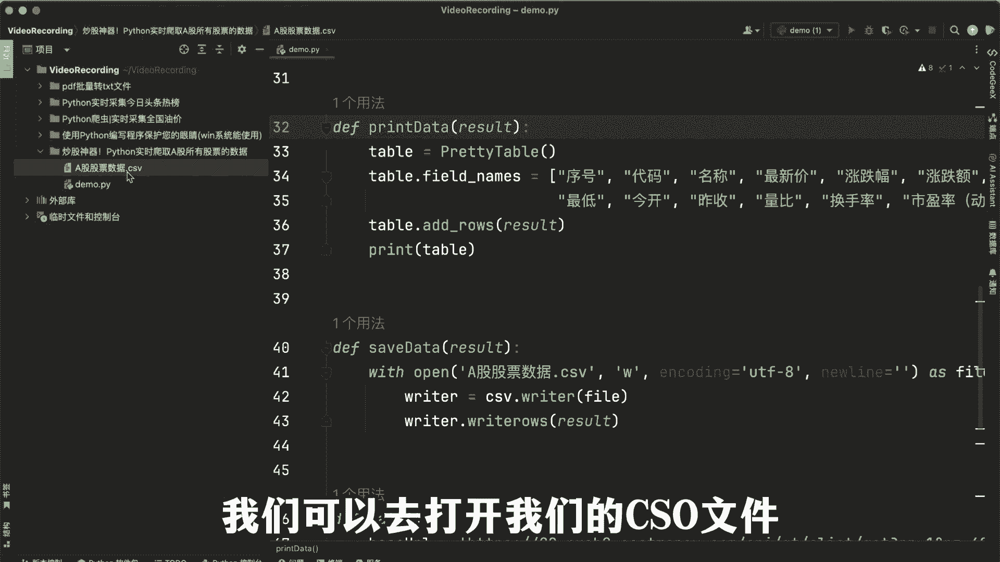

# 实现量化交易技术，让股市赚钱不再难：深入浅出的Python量化交易（附源码） - P1 - Python程序员猫仔 - BV1Np421y7sH

好OK啊，今天接着给大家分享一个，关于我们如何使用我们这个Python爬虫工具，去实时的爬取我们的A股所有的股票信息啊，那么当前呢我们这个代码呢，是给大家已经写好了，而我们只需要去右键选择我们的run。

去运行我们的DEM文件，然后它就会跟我们生成一个呃，我们的骨架的信息，那么这个时候我们可以去打开我们的cs文件。

去看看我们每日的一个股票数据信息，然后如果说我们想要在明天后天，你知大后天甚至更久的时候呢，我们只需要再次运行我们的脚本，他就会将我们的股票信息以及它对应的数据，全部给我们抓取到我们的本地过来啊。

那么到此呢，我们这一块的小视频就跟大家分享到这。

