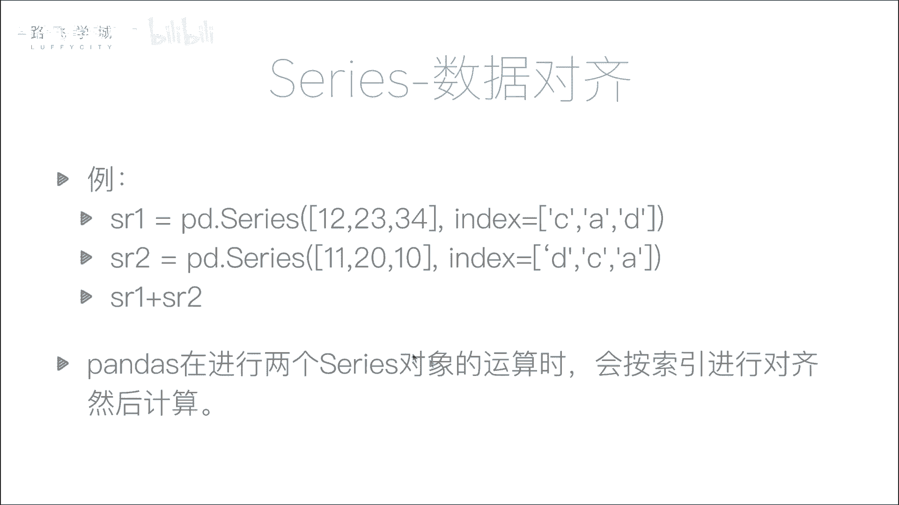
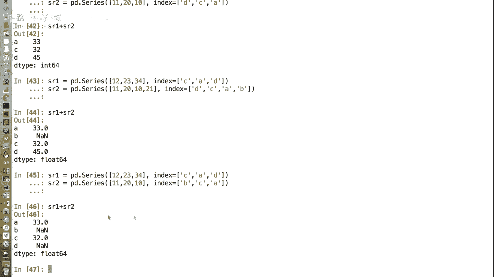
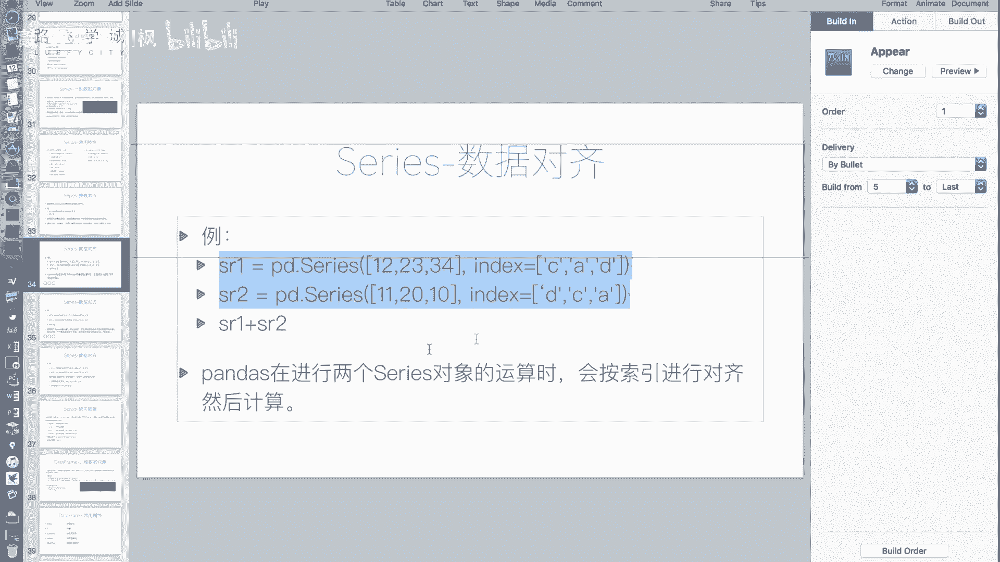
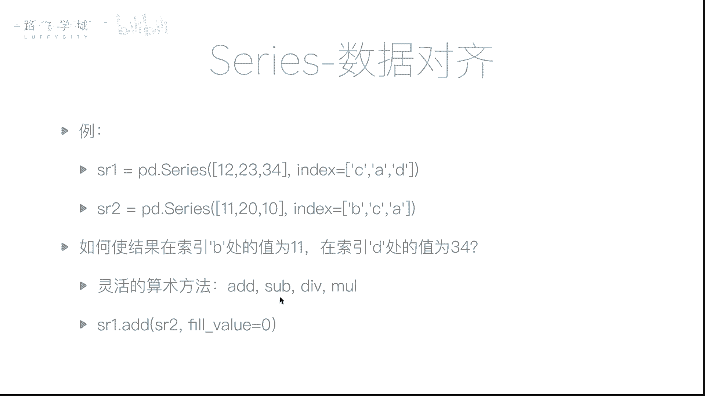
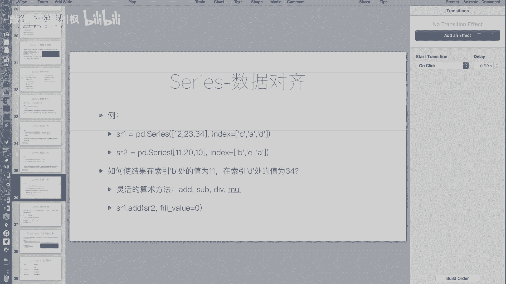
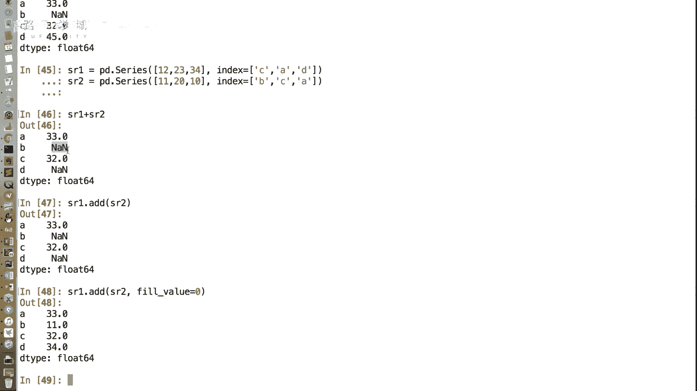

# 【2024版量化交易】全B站最实用的金融分析与量化交易实战课程，整整100集，3天从入门到项目实战，学完即可做项目，少走99%的弯路~ - P19：19 series数据对齐 - 敲代码的流川枫 - BV1uFCVYYETd

好，那接下来给大家再说一下，series里一个很重要的特性叫做数据对齐对齐，那么我看一个例子啊，我这里有一个有两个series对象嗯，第一个series对象值是十二二十三三十四嗯，它的索引是CAD。

第二个值，第二个对象它的值是十一二十十，它的索引是DCA，那首先S1SR1和S2长度是不是一样好，那如如果执行SR1加SR2会怎么样，是12+11吗，如果我们是一个数组的话，就是12+11，23+20。

34+10，but在seriously，我们要满足一个条件叫什么呢，我们更希望看到的不是按照下标对齐，而是按照标签索引对标签对，那也就是说什么呢，你两两组数据，你有可能他们的顺序是不一样的。

但是你的行名称只要一样，我就把它们加起来，这是不是你的名称对对我，因为我比如说你一个excel表格，你可以交换顺序，但是你只要有一行行名称，对不对，列名称哎，列名称不是这个吗，只有一列，所以是行名。

我们这是一点啊，它是一列，OKOK好好，那我通过行行名称，比如说哎这个是这个17年10月1号，这个也是17年10月1号，那他俩是不是要加起来对，所以我们是通过标签进行对齐了，但你这个我知道了，你先试吧。

我就先说你你即便能对齐了之后，相当于你是按标签，然后你这里指定的吗，按什么标签来加嘛，对不对，那问题在于就是说呃如果数据量特别大的时候，你怎么去指定这个标签，你记不住什么叫既指指指定这个标签哦，我懂了。

不好意思，你继续吧，哈哈数据量大量好，所以pandas在进行两个series对象做运算的时候，会按照索引，也就是这个标签进行对齐，然后就行。

我们来看一下效果，Ok。

这个引号出现了问题，四维的，我们执行SR1加SR2com的结果，A这个位置的33是怎么出现的，A不出了吗，A这个位置的33是是C加D是吧，怎么会是C加D呢，你这指定不是我不是啊，我说了要按照标签去取。

所以应该是SR1的A的这个值嗯，是23加上SR2的A的值是十哦，我靠是这样的，我还以为你是按照这个相当于额，就是就是把把把D排在前面，他就跟C加不，那还是按标标还是按标签对齐，不是按下标。

OK按标签对齐啊，就是A和A加三，23+10，C和C甲就是1220得到32，我靠这个很牛逼啊，低和低价就是34+11，你不用去管排序，这个功能很牛逼啊，你不用去买排序的，只要你的标签不变啊，你随便排序。

那相当于我要把去年的数据和今年的数据，一相加，只要他在不行，他如果我不不考虑年，只考虑天的话，就是几月几号，几月几号，他就很容易加起来都不用排序是吧，对那很牛逼啊，但你说的这个如果说考虑时间上。

时间序列，后边pandas还会有就是叫时间序列的支持，那很牛逼，也很牛逼啊，这个使用场景是什么呢，这个使用场景就是说你两两个series，两两列两个表，你想进行加，但是他们可能顺序不一样嗯。

那我们也不用管排序，也什么都不用管，只需要做加法，然后只要保证他们的index1，这个可以，我懂了啊，但是还有一个小问题，就是如果说哎我这个地方有一个看我SR，二甲都长得不一样了，我SR2是多了一个。

Ok，那我这里边也不能出现重复的呗，比如说两个B是不行的对吧，呃索引啊哈一般它允许重复，这个其实呃pandas索引允许重复，但是我们一般不让他选，那你要重复，不是找错，找重复会出现更麻烦的效果。

所以咱们一般因为咱们一般操作的时候，index也不会让他重复嘛，好其它支持重复，但是我们一般操作时候不重复，OK好好，那我们再回来看，现在这两个对象，他们两个不一样长了嗯。

我们说number py不一样长是不能加的嗯，但是series不一样长是能加的嗯，这个时候加那SR1的标签是ACDSR2，有的是ABCD，那它们两个加起来会怎么样，我们可以看一下。

等于我们看出现了一个什么东西，B是not a number，对我们之前在number py介绍过的一个特殊的值，叫做n a an，也就是not a number不是一个数，那我之前说过。

他在pandas库里被用来当做数据缺失值，哎能打白了啊，也就是说当你SR1加和S2加起来，那平时我们可能有这个好几万好几百万个数据，那他可能说诶第一个第一个表它可能多几天，第二个表它可能少几天。

但是我不能说，因为这几天他们不一致，我就其他那些列我都不加的了，对不对，那我们还是把它加起来，但是如果一个索引一个里边有一个里边没有，那怎么办，就给它设置为到了呃，确实是看了OK不能好。

那再比如如果他们两个，好如果SR1和S二两个对象是这样，SR1的标签是ACDS2是ABC，那么他们两个对他们两个在B和D上都会出现，OK好好，那别急，假如说哎有的时候我确实是需要，这个地方是NNN。

但是有的时候我不想是N，比如说什么呢，比如说我这个呃年底算算什么呢，算算你的这个出勤嗯，啊我算你这个呃呃比如说整咱们SR1和S2，咱们就不算一年了，算两个月可以吧。

好你这个ABC刚开始是第一个月是AACD，这三个员工他们分别出勤了，有点大，差别有点大，11天23天，34天34天是怎么出勤的，就举个例子啊，好那么假如说第二个月诶，这个D离职了嗯，B又进来了。

那他出钱是十一二十十，但是我可能比如说按他11年来多少钱，给他发奖金啊，那我希望这个时候我希望SR1加SR2的时候，B这个位置的值不是NN是十一十一，因为他SR1它没有来嘛，对不对。

那D我希望他是34对，那我怎么办，那你就设个参数，这个时候对，这个时候用加就不靠谱了。

那我们的name，那我们的pandas库，给我们提供了一种灵活的算术方法。

嗯就是ADD sub带五和m l more。

OK那他们四个其实什么其实就是加减乘除啊。

SR一点I的SR2如果执行它，那么和SR1加SR2是一个效果，嗯啊但是我们可以给它加一个参数叫feel value啊，所以Y就等于零，它就会把如果哎一个值一个标签的值，一个有一个没有。

那没有的那个就被few成零，就被填写成了，这个时候我们再看哎是不是B就是11了，我懂了，对这个挺挺牛逼的，挺方便的好，以上就是我们说的这个啊series的数据对齐，那我们可以看到数据对齐之后。

可能会出现一些缺失值的情况，那这些缺失值是需要我们进行处理的。

因为它不是一个数，那怎么处理，我们接下来讲缺失值的处理方法。