# 这可能是B站目前唯一能将量化交易讲清楚的教程了，不愧是计算机大佬！一天全面了解机器学习Python金融分析与量化交易实战，草覆虫都看懂了！ - P2：02量化交易系统综述 - AI知识库 - BV1x1421871N

好那么就是说今天我们是嗯相当于热身的呃，嗯这个一个模块，这个昨天是给大家，因为我看群里头又来了不少人，我跟大家嗯就是你没有看到昨天直播的同学呢，你们在下周的时候是可以看到这个录播的。

但是嗯你们今天是没有办法看到，昨天的课程内容，大致的两句话说一下，昨天就是说我大致的介绍了一下，这门课所接触的三个领域的知识，也就是说一个是金融知识，一个是编程知识，一个是机器学习的知识。

这三个知识怎么样的，在这个量化会中，他们是怎么样交互的，并且大致说了一下我们会建立什么样的模型，告诉大家利用机器学习，我们能干什么，不能干什么，然后今天的话呢我们看我们今天要讲的事情。

OK好，那么就是说这次课跟下次课的这个任务，任务目标是这样，就是说我们第二节课跟第三节课，其实是一个有机的一个整体，这个是相当于给我们这个Python，跟这个就就是利用，真正的利用程序语言来做事情。

就是说以前我们是啊觉得啊从理论上来讲，我们用一个语言能能把这个事干了，但是具体怎么干，一定要使用到啊程序的这个代码级别，在这个条件下，就是才才能够叫真正的掌握了这个知识。

就是啊要要不然的话你只能很虚头巴脑的说啊，这个事情大概用程序这么走就能走出来吧，啊啊这个是不可以的，一定要就是需要把它落实到实处，真正的跑出来东西，这个是我们这次课跟下次课两次课的任务目标。

那么本次课我们就是本次课要掌握的，一个是这个是主要是需要大家课后来做的事情，这个是课后做的事情，是因为你们花了这么多钱，我我也不希望讲，你们也不希望花这么多钱来学习一个。

使用一个语言的a files这些东西，因为这样对于大家来说肯定是不公平的，花这么大价钱学一个Python写一个排序啊，那么这个事情嗯，就就就实在是嗯很不好的一件件事情。

那么就是说也刚好利用国庆节这个假期，中间有一个比较大的gap，我希望大家利用，就是说编程语言知识不是很好的，同学利用啊，中间的这一周半的时间呢，自己努力的把Python拾起来，因为从下节课开始呢。

我们就会非常的呃严重的依赖于Python，这个平台来干事情，要不然的话你如果不进行实地的编码的话，也不是不行，但是你只能听到一个啊精气神儿，但是具体你要干活的话，你还得找一个你的朋友或者你的属下。

或者你的小弟帮你把这个程序编了，那么这个就必须得是一个teamwork了，你如果想一个人来使用这些优矿啊，什么东西的时候，你是必须得啊学会编程的，OK那么待会我会说啊，如果要学大家怎么学啊。

这个是第一个，第二个呢就是要讲从技术分析，就是说从这个所谓的technical analysis，就是从啊就是嗯比较传统的啊，技技术分析角度怎么样，是机器学习是怎么介入到技术分析，这个这个框架中去的。

就是说我会以一个非常经典的一个啊例子，大概你以前听说过啊，所谓的看盘猫model，但是呢你从来没有想过，它其实是机器学习的一个特例，OK我们会从就是最最重要的金融学，最重要的一类模型入手。

看看我们怎么样的，从经济学习研究的角度来看待这个问题，OK这个是我们今天的啊一个目标，今天的事情呢主要是为了给下次课打基础，因为下次课我给大家打个预防针，下次课的课程的这个这个呃。

就是课程的重量会非常非常非常重，就是说下次课开始，我们的这个mini project就会出来，每一次每周的这个作业量，大概需要5~8个小时的编程时间，我假设大家不是特别熟练的使用Python的话。

所以说啊今天的这个快乐时光过去之后，从下周开始，大家就需要反复的开始，做一些比较重的编程任务了，那么在下次课的时候，我会教给大家啊这么些个知识啊，就说是一个呢，就是说怎么样呢，就是说我们要做饭的话。

你总得有菜吧，就说你的这个你的数据啊，嗯嗯下次课具体安排你们看机构的网站，这个啊我还不大清楚，那么就是说就是说这个用Python爬取金融数据，就是说我这门课会给你的作业，会给一些数据，但这个肯定不够的。

你平时你要你你要做事情，你是需要自己去呃，利用API来来访问一些呃呃开源的也好，闭源的也好的这些数据库，你来建立自己的这个小型的数据库，那么这个是第一个，这个是这个这个是基本。

比如说我们需要建立一个自己的啊数据库，怎么样利用Python来自动化工作，这是第一步，第二步呢就是说第二个，第二个要讲的就是怎么样利用Python进行这个啊，最原始的这个数据啊。

金融数据的处理包括了清洗啊，这个蛮重要，就是说比如说我一个CSV表格里头有这个怒值，怎么办，有空值怎么办啊，有有你不想要的值怎么办，你怎么利用比较好的一些嗯，就是比如说你要只用Python的话。

你就能干，但是如果你有这个pandas，这些比较好的这些包的话，你干这种事情，就是一行代码就分分钟就能干掉了，OK那么这个是我们要干的第一个事情，第二个事情呢。

就是说怎么样利用Python进行特呃数据的可视化，还有一些特征提提取，怎么样计算它的平均值啊，方差呀，怎么样进行采样啊等等，就是说怎么样利用Python，来满足你心中想达到的这些啊，原始的操作。

本次课是这周的，下次下次课是下周的，OK那么水碳酸是干什么的，就是说嗯嗯因为我的教学理念是，我们从啊越早开始，你手中要有就要有一个句句提取的，机器学习的量化模型，可以很简单。

但是你心里有了一个简单的这么一个模型之后，你再听复杂的。

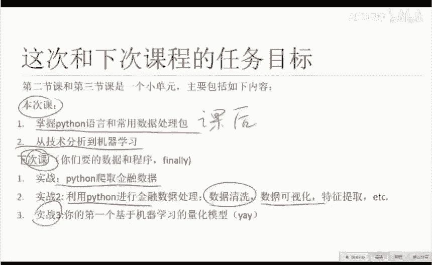

你就你就你就就当我说到一个东西的时候，你就会想到一个映射到一个具体的实物上，拿例子来说话，那么这样的话呢啊不会比较好的吸收，那么所以说我们我就在第三次课就会教给大家，怎么样有了数据了。

为了清洗了提取了特征了，我们要怎么样建立一个，第一个基于机器学习的简单的量化模型，在下次课就会就会给大家，同时呢会基于这三个小小的事情，给大家留一个嗯，呃就是呃一个嗯我们的第一次作业，就第一次编程作业。

那么就是说，所以说我再给大家啊做一个预防针工作，在下次课上课之前，Python语言一定要比较自如的掌握，OK啊关于我们这次上课的这个任务目标，大家有问题好，那么我们现在就看看我Python需要学到什么。

我需要你们帮助我把Python学到什么程度，帮帮忙好，那么大家需要掌握的Python的知识点，首先是这样，大家我建议大家的平台，一律装一个叫安娜空大的东西，这个这个是非常好的一个呃Python的平台。

因为它已经内置好了，绝大多数你所需要到的Python的包，这样的话就会免去了你的不少的安装的烦恼，然后平平时我们做一些实验的都会用，基于这就是anaconda自己带这个啊ipad notebook啊。

那么我们是会在ipad on notebook这个平台里头啊，嗯做一些编程的实验工作啊，当然最后我们在搭这个新项目的时候，嗯是嗯是另外一回事了，但是这我们的上半学期呢。

主要是在这个IPAD跟都book里头进行，我们的各类的实验活动，包括了数据交互，OKLINUX下是非常推荐的，首选LINUX或者Mac好，那么就是说ipad on notebook是我们的。

我们的这个首首选的，就是上半学期的主要的这个实验平台啊，非常推荐大家用LINUX操作系统，Mac os也很好啊，windows是最不推荐的，OK如果你不信，有了windows也不是不行。

但是嗯嗯取决于你的这个编程的啊经验吧，OK如果编程经验不是很多的话，我倒不是很推荐你用啊，windows这个很简单，OK那么我们要我需要你们掌握的Python，Python的知识点是这是这些啊。

二嗯嗯2。7啊，嗯如果你只如果我们群里头有学员宣称，只会用三的话，也问题不大，你可以单独给我写信，我告诉你怎么办啊，因为我相信我们这门课，大概80%的有Python编程经验的同学，都用的是Python。

所以说我还是选择这个python2。7，来做我们的这个嗯呃整个的这个平台，OK那么我们需要大家掌握的知识点是这样，就是我不希望大家再花钱来学这些东西了，这个嗯实在是太亏了。

那么就是说我给出了一个自自学地址，这个是你们能够最快速的学好一个语言，的一个网站，叫做学习，X在y minutes里头就learn x等于y minutes，就就相当于15分钟搞定，15分钟搞定这个。

这这个某种语言的这么一个网站，这个网站里头你们要看那个Python这个语言啊，就是说先把先先先先把这就就按图索骥吧，就是按照这篇呃小教程所教你的东西，你要了解到Python的一些方方面面。

包括了Python的数据类型，就是嗯string啊，什么整形是什么呀，你们怎么就怎么样对一个string做一些操作呀等等，还有这个Python的基本语法，就说什么分分支怎么写哈，循环怎么写。

你怎么定义一个自己的函数，再难一点的，你怎么自己写一个插入排序啊等等的一些，就是嗯大家能想到的啊，最简单的这些Python的一些函数的实现，OK然后呢就是Python的这个数据结构。

就是其实大家用的Python的数据结构最多的，一是这两个，一个是dictionary，一个是list，这个是需要大家嗯能够非常自如的啊进行啊，操作的这么一个啊东西，另外呢就是要学会灵活的运用。

这个Python的这些内置函数，就是说比如说呃因为Python里头他已经替你写好了，非常非常多的，啊已经替你写好了，非常非常多的嗯这些嗯嗯嗯嗯嗯，你可以理解为标准函数库吧。

那么就能够让你在平时的编程中呢事半功倍，就是你很多人如果刚学了Python，嗯会了前三点呢，嗯然后如果内置函数了解的不是太全的话，他经常会重复的造轮子，写了一个封闭之后。

其实人家Python已经给你写好了，比如说一个简单的问题，就是说我给你一个任意长的字符串，你怎么样的把这个字符串逆序的输出出来，比如说我输入一个啊ABCD啊，FGK点点点，大概有嗯两个外行。

最后是个IND，比如说我给你输入这个字符串，你就是今天一个小作业，就是说请你用一行的呃代码来给我返回，这个字字符串，你逆序输出出来，比如说S等于它，然后我现现在需要s inverse。

等于就是它的这个逆逆序，你能不能用用Python内内置的函数啊，你一行就能写出来呢，啊，这个也是会让大家在平时的编程中，会比较方便吧，最最后一个是比较重要的一个，就是说你需要用Python来写一个呃。

面向对象编程的这么一个呃知识，什么意思呢，就是说因为我上节课也提到了啊，我们的这个呃量化交易的平台嗯，是非常的面向编，面向对象编程的同时也是事件驱动的，事件驱动其实是一个嗯啊就是一个设计思路。

就是你都可以想成一个只要是一个啊啊，主要是一个while true的这么一个循环，这个循环里头不断的监听事件，同时把监听到的事件放到一个事件队列里头，分别的来处理这个事件。

这个就叫做呃基于事件驱动的交易平台，而我们的所有的所谓的事件和所谓的行为和和，所以处理数据的方法都是啊面向对象的，所以说嗯如果你不知道什么是面向对象，编程的话，需要吃一点苦，大概在未来的一周之内呢。

把它要学明白，同时所有东西在这个里头都会有，那么如果大家有这个我们机构的这个啊，Python的这个教学的这个课的话呢，也是非常好的一个啊，入门的这个教材，也大家也可以去看看他们的那个视频。

讲那个Python的老师啊，我都蛮熟悉，讲的很好，OK硬广哈嗯好，那么基于Python呢会有一些非常常用的，在量化交易中常用的一些库，第一个库就是所谓的number派啊。

那是一个非常好的一个呃线性代数的一个库，就是说我们呃需要你去学习，灵活的使用number派这个包，什么叫包呢，就是说别人已经用Python给你写好了很多，非常高性能的一些函数库，当你要用的时候。

你只只需要调用它的接口就行了，你只要调用它帮你写好的函数就行了，这样呢就能让你在平时的做实验的过程中呢，效率非常高啊，这个应该每个人都知道我是谁，如果没有任何编程经验的同学告诉你。

这个number派呢就是别人给你写的一个函数库，OK啊感谢李涵同学，那么我们的自学地址是这本书，这本书写的蛮好，这本书里面涉及到知识，那我也就不讲了，因为啊一一本书才七八十块钱。

而且呢最重要的是嗯嗯学一个语言不难，就是说啊如果你能自己能学明白的话呢，就希望大家去学这个东西，嗯嗯我在这个里讲的都是你有可能买了本书，你也看不明白的春水啊，那么这个是我要讲的，就是你有很多知识。

你可以买很多书，但是你你依依依然会很难看明白，是因为要么写书的人不行，要么你看的那本书跟你目前的level不是太匹配，那么但是学习一个语言的话会好说一点啊，由于咱们的时间所限，我希望大家自己去买这本书。

然后看他的第四章，Ok，那么主要是要利用南派进行，做一些什么样的事情呢，就是说我们要用南派来做这个，比如说你至少得会创建一个矩阵吧，你创建一个向量，你也得会矩阵啊，向量啊。

然后最重要的平时最实践的是这个事情，熟练的掌握矩阵的索引。

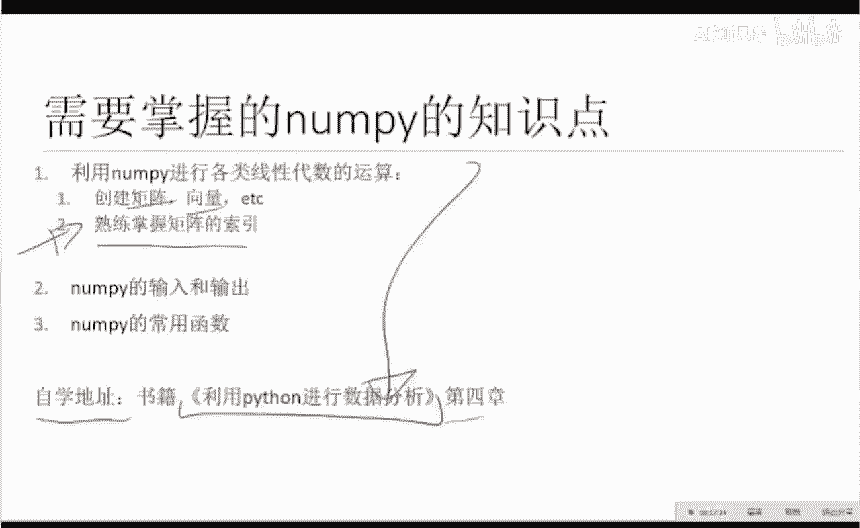

什么意思呢，就是说比如说你现在已经有一个矩阵了，OK如果我们现在有一个矩阵，比如说有一个500×700的一个矩阵了，你能不能非常快速的啊给我第八列的元素，或者说非常呃，就是说你你就我需要你非常自如的。

就是闭着眼睛都能写出来，能提取任意行或者任意列或者某一列中，满足某一个性质的所有元素，比如说你能你需要非常自如的提取出来，第八行是正的，这这个元素的id的行数的这个数目，以及行数所对应的这些元素啊等等。

那么就是说我们需要这个索引，这个index in是我们平时不会天天用到的，一个嗯嗯嗯，一个地方就需要大家非常熟练的在用这个事情，OK然后第二个就是说南派派的输入和输出啊。

第三个就是咱们派的一些常用的函数，这些东西呢在这本书的第四章里都会有，OK那么嗯嗯嗯希望大家，可以去看看啊，利益相关，我声明一点，这本书的嗯，翻译者和作者跟我都没有关系。

我只不过恰巧发现这本书还蛮好的而已。

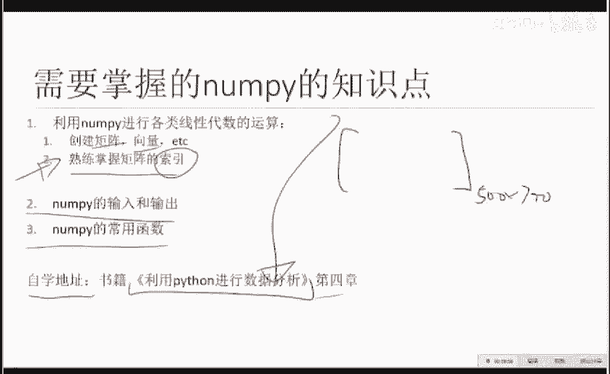

OK嗯好嗯，那么基于南派呢，就是基于pandas as，就是潘纳斯是基于南派，为了金融又再往前走，就又封装了一层，而且潘纳斯的消耗比比南派要高的很多，比如说我们有一个200兆的CSV文件。

大家可以回去做一个试验，你生成一个200兆的CSV文件，你用南派读入一下，你用pandas读入一下，它们的性能大概是呃两个数量级到三个数量级，就至少是啊两个数量级的提升，比如说你用你用南派读。

大概需要嗯30秒，你用用pandas读，就就就就你感受不到的速度，你就能读进来，OK这个是嗯，据说是好像是就是华尔街那帮人搞出来的，一个一个包吧，就是说是非常，你就你就你甚至可以当一个小型的数据库了。

就是说他是一个啊非常高效的一个处理啊，各种的啊表格数据的一个神器，这个也是需要大家熟练掌握它的内置函数的，因为你有了这个神器，你用它做这个所有的嗯，大部就你其实你做所有数据分析的。

大部分的简单的数据提取的，这些操作都不应该是自己去写一个函数的，因为90%的情况，当你自己打算写一个函数的时候，很可能是你不知道，其实在你的电脑里头已经有人帮你写好了，你只不过是不知道而已。

OK那么所以说就是说呃，希望大家会熟练应用这个谷歌浏览器，和你的英文，然后最长就是说当你要写一个函数之前，一定要在google里头搜一下，这个函数和你要干的事情，比如说你要你。

你你要写一个找一个矩阵的第八列，你就一定要最好是你先搜一下，Find the six uh，Column of pain of a matrix in python。

就是说你先把这句话先在谷歌浏览器里搜一下，一般来说别人都会告诉你用南派中的哪个函数，这个初学者的时候，这招是非常常用的，嗯但是我强烈不建议这些问题在啊群里头问，或者在论坛里头问。

因为有一个地方叫stuck over flow，那些问题都在那里，然后最好大家养成一个比较好的，和一个比较礼貌的一个习惯，OK嗯这个是作为初学者我要说的一个事情，嗯好那么，OK啊。

关于呃这个呃关于pandas as Python跟南派的使用，大家有没有问题，stack overflow这个里头是嗯可以这么说吧，就是你你你你你会你会遇到的所有的啊，编程的问题。

基本上别人都都帮你问过了，至少在我初学Python到现在我还没有嗯，就是我极少情况下发现一个啊新问题，OK嗯就是作为一个嗯编程比较稍微资深，可以自称稍微资深一点的人的话，我非常不建议大家有一个小问题。

比如说提取一个矩阵的第八列啊，把这些问题撂到群里头，或者撂到嗯任何一个人的这个小窗里头，这个是一个非常不礼貌的行为，嗯嗯也是就相当于一个业内的一个共识，就说吧，因为嗯嗯应该是先学会自己去寻找这个问题。

而这个网站呢，一般来说你寻找你想干的这类事情，它全都有，甚至于比如说我怎么样的画一个热力图，怎么样画一个漂漂亮亮的热力图，怎么样画一个股票的漂漂亮亮的热力图，各种的有多么细致的问题都有人会提出来。

那么你需要唯一的一个事情呢，就是啊英文要稍微好一点，至少你要学会把你的问题用英文的方式，在谷歌浏览器里搜一下，OK嗯就是说你你你你这个是你唯一的一个问题，OK啊你打不开，大概是你的网络的问题啊。

你可以咱们课后来嗯在交流或者你学的方向墙，但是嗯我没有翻墙，我在课前做备课的，还专门在非翻墙的这个情况下上一下吗，好像是可以上去了，好，那么我们现在看这个sk learn是Python的另一个包。

OKSK论是他呃这个Python link包他干的是什么事情，他他是把目前机器学习大部分的模型，除了深度学习，OK我说过了啊，除了深度学习啊和强化学习啊，就是大部分的传统的机器学习的模型。

它给你把函数已经写好了，你要干的事情只需要就简简单单的啊，调用这个API，你就能啊跑一个SM，OK呃呃在这个这门课程快，在今天快结束的时候，我告诉大家s k learn怎么去用。

那么我需要你们在下节课上课之前，在这个这个文档里头挑一些好一些的例子，读一读，最重要的是干这么两件事情，你要学会用sk learn做一个线性回归的模型，比如说你自己可以造出来一些数，这是X这是Y。

比如说X是1。23。6，Y是000。8，X 12。36。6，Y是比如说0。9，你自己造个100列嗯，生成一些嗯嗯嗯自己造一点数，然后学会用sk learn拟合出来一条线性的模型，因为从下节课开始。

我们就需要在真实的数据上来玩这些事情了啊，而且玩的肯定不是线性模型，那么需要大家，至少你至少要用过ISSKLEARN是个怎么回事，什么叫做啊一个model点fit。

一个叫什么叫做一个model点predict，学会用这两个函数，基本上就算是OK了，我就算是OK，你达到了这门课程要往下走的一个先修条件啊，这个是很重要的一个一个东西，sk learn他选择的模型呢。

他有个要求，就是要求好像是必须得论文发表至少两年，而且这个论文的引用率必须超过200，如果这种模型呢，它才允许被收录到这个对这个库里头去，所以说这个库里的模型都是非常经典，经过时间考验的啊。

work的模型，因为每天在经济学界都会产生大量的模型，但是具体大浪淘金有哪些能用呢，其实大家真正用的也就那么十个左右，OK嗯其实嗯再从十个再选一下，大概也就3~5个，就基本上是就。

那么其实现在全世界真正在用的，这些模型也是屈指可数的，只不过是同样的模型，不同的数据跟不同的参数而已，但是模型本身其实大差不差，就那么几句嗯，关于sk learn的使用，大家有问题的好。

那么那么我们现在就就开始看，OK那么今天我要干的事情是，因为我相信大概大概有25%左右的人，听说过这个模型，但是你听说的呢跟我今天要讲的是一个模型，但是是一个完全新的一个角度。

对于没有听说过这个模型的人呢，没有关系啊，今天我会告诉你它是什么啊，他是在这个金融学里头，相当于一个非常基础很重要的一类模型，那么我我今天想为，为什么把这个事儿拎出来给大家讲呢，是因为嗯。

嗯用这个模型能够满自如地进行，转移到经济学习这个话题中去，然后再展开我们以后会用机器学习怎么样的，基于这个啊，嗯开盘猫model来做更加嗯fancy的一些事情，那么这个是我把这个事情拎出来给大家呃。

讲的一个目的，OK嗯那我们现在开始好，那么一个跑非洲流，一个资产组合是什么呢，就比如说啊你有嗯100万嗯，你在股票里你分别买了，就说你有你有100万的资产，你这个资产呢会有一个分配的问题。

比如说你分配了百分之A买了一个股票，分配了百分之B持有的是另一个股票，你分配了百分之C，你持有的是啊另外一个第三种股票，那么呃如果你不考虑这个融券的话呢，他们都是正的。

但是你如果要做一些short之之类的事情呢，它有可能是负的，那么我们在这个一个一个自然组合的定义，就是说他的这个绝对值相加起来要为一，OK这个是一个嗯预先的一个条件，那么一个市场的一个市场的PFI6嗯。

就是所谓的大家都很清楚的这个啊，比如说SP500啊，或者沪深300，他所干的事情是什么呢，就是他们这些股指干的事情，就是说我们分别嗯选定了，比如说十个板块，每个广板块里头挑出来一些。

他们认为比较重要的股票，然后每一个股票的这个啊市值再乘以一个权重，做一个加权的和，就是分别就代表了整个这个市场，就你就可以可以看作整个金融市场的，这么一个啊健康度，或者说是一个非常重要的一个指标。

那么当这个指标往上走的时候，大概就会体现出来啊，大家的这个啊股票的市值都在往上走，你可以把它看作啊一个国就是国家的GDP，之于国家的经济状态的这么一个指标，就是说GDP啊。

能够代表的这个国家的一定的这个，这，这个就是就是说GDP是反映一个国家的一个，非常重要的一个方面，但不是全部这个啊，沪深300股指也是一样的啊，股指在往上走，并不说明每个股票都会往上走。

OK有的股票会涨的比股指高，有有的股票会涨的比股指低，没有问题吧，但是大差不差的，这个大的趋势是一个比较好的一个啊，一个判断的方式应该没有问题吧，好，Ok，那么这个是我们今天所遇到的第一个数学公式。

就是我们先看单一的单一股票呢，刚才在说一个pot fuo，刚才再说一个投资组合，我们现在先不看投资组合，我们现在先看单一股票的一个一个情况，那么这个单一股票，就是说比如说对于一个股票I。

这个cp model说的是什么呢，他说的是在T时刻，我这只股票的这个return它等于什么呢，就是T时刻这支股票的回报，或者说这支股票的收益，它等于在T时刻，整个市场的收益乘以一个贝塔的这么一个系数。

加一个P时刻，关于这只股票的阿尔法值，我再说一遍哈，就是说其实很简单，它是一个线性模型而已，在T时刻，某一只股票的回报等于这个市场的回报的乘以，一个系数加一个小的一个嗯，这个这个这个残差。

而如果相信市场有效假缩的人呢，他们会认为这个残差的期望值是零，什么意思呢，就是说当我们嗯，对这个T啊从负无穷加到正无穷，我加很多加很多，我这个阿尔法，然后发现ti啊，阿尔法FIDT等于零。

就是说比如说在T时刻它是0。6，在T减一时刻，它大概就是负的0。3，在T减20克，它大概是正的1。2，我们把这些东西全加起来，它为零，就平均而言，on average这个数目是零，这是相信有效市场假说。

就是说嗯就是不相信技术分析的人，理论上来讲，这个东西应该为零，有问题没有，这个公式蛮重要的，我希望大家提一两个问题，我来看一下，我来看一下，我来看一下阿尔法跟市场有效性有关，就如果你认为市场是有效的话。

从理论上是可以证明出来，阿尔法值的均值为零的啊，有理论依据，就是说纯纯从金融学的理论依据是，如果你基于这个市场文的讲，说你是能一步一步推出来它的，嗯啊虽然偶像，这个我们接下来会专门的说这个事情。

因为它非常重要，就是说是这样，是这样说，结论我个人是不相信它为零的，因为我们的市场不可能是有效的，而且离有效还远得很，但是一个在一个非常完美的一个世界中，On average，这个事情是可以积为零的。

而正是由于我们处在一个非有效的市场里头，它不为零，而正是因为它不为零，我们才有挣钱的可能好，那么我们现在来看，我们换一个角度来看这个事情，我们换一个角度来看这个事情，换一个角度来看这个事情是什么呢。

啊这个结论如果要推出来，这个结论我们需要两个小时的时间啊，你不需要知道这个这个是怎么推出来，当然你如果感兴趣啊，嗯在任何的一本金融学的教材里面，就纯金融的呃，书里头它都会有关于这个公式的推导，很简单。

每一个你学金融的朋友，就是你只要是科班出身的金融的朋友，他都会告诉你啊，这这个对的对的，这个是可以推出来的，但是这不是我推出这个东西，不是我们的这个重点，我我们的重点是我先告诉你，假如说别人告诉你了。

就是说有一个model叫张三，这个model这个张三的名字叫看看model，这个model说了什么呢，说了他认为就是这个model认为个股的收回忆，就个股的这个收益，跟股票大盘的走势成一个线性的关系好。

那么我们用换一个角度来看，假如说我们没学过金融学，我们是嗯从机器学习的角度来看看，这个公式的话是什么意思呢，好注意哈，那么就现在大家如果你之前学过这个，你换一种角度来看。

假如说我们你先不管这个model，假如说我们现在只想研究RIT，想研究这个变量，没有问题吧，就是说我现在想知道，OK在在2016年9月20号啊，这个招商银行这支股票，他的这个收益应该是多少。

这是个变量吧，没有问题吧，这个变量是不是可以叫做这个是我的这个目标，这个可以叫做Y吧，OK那么我们认为这个YY是不是，应该是一些输入的一些啊，这个函数加上一个小的一个噪声，这个噪声的这个均值应该为零。

就在任何条件下，我们都能建立这么一个model，没有问题吧，就说我们想我们对一个变量非常感兴趣，这个变量就是招商银行，在今天我们自己有的这么一个，就是嗯对大家先先先别问了，111问就就打到咱重来说啊。

就是说我们重新重新看这个问题，这个问题是这样，我想知道招商银行在每一天的，这就招商银行这支股票在每一天的回报跟收益，这是一个这是一个随机变量，这个随机变量是Y，就是说我们感兴趣的一个目标。

我们想知道Y是谁的函数，就是说我们想知道是什么因素影响了，我今天招商银行的回忆呃，的的收益是正的还是负的，这个问题是一个非常非常统一的，一个就是非非常general的一个问题，这个函数长的什么样子。

也是你可以是非常复杂的一个函数，也可以是非常简单的一个函数，但是做任何模型的时候呢，都要加一个小的一个term，这一项呢就叫做就是说这一项要求是什么，一般来说这一项是正态分布中的一个随机采样。

而且正态分布它的均值为零，就是说我这个模型没有没有capture到的一些啊，嗯啊随机的一些噪声在里头，就假如说我的模型是完美的，我在观测的时候，我在实际观测的时候啊，也会有一些小的这个扰动。

有任何模型都会有这么一项的这个假设，那么这个看盘猫model说的什么呢，看盘model说的就是说相信这个model的人，他认为影响招商银行今天的return的变量只有一个，这一个变量是什么呢。

就是今天的大盘，而这个大盘跟Y的关系呢，看盘model认为是线性的，好了，我说完了，大家现在可以问了，对每一个股都有自己的阿尔法跟贝塔，就是说你从统计学，你从你从计量经济学或者机器学习的。

这个角度看这个问题就是这么理解的，OK这个大概是也，也许是你所听到过最容易理解的看盘model，你可以去查别的任何书上，他的解释都会很虎的嗯，为什么是线性的，是他认为是线性的，我不认为是线性的。

你也可以认为是非线性，你可以认为它满足一个SVM的这么一个model，你可以吗，你可以认为他们这个函数是非完全，一个非线性的一个非常复杂的一个函数，就可以，每个不是你看啊。

主要这个下标这个贝塔I对于对于每一个股票，它都有不同的贝塔I，如果贝塔I都一样了，那就麻烦了啊，那你就不用炒股了，然后机器学习要干的事情，就是说我要通过大量的历史数据来学出来，做一个线性拟合。

学出来这个贝塔是多少，好，接着这个模型我们往下走啊，这个模型是我们今天转向机器学习的一个，非常好的，就是我不能找到再好的一个例子了，OK你要你要你要你要你要觉得有更好的例子，你一定要告诉我好。

那么我们看一个graphical interpretations，就是说我们怎么样用图来解释，刚才这个这个模型好不好好，我们准备上车哈，用图来解释是这样，相信看盘model的人。

这波人他们认为这个世界应该是什么样子的呢，他们认为这个世界应该是这个样子的，我们的X值，我们的我们的X的值。

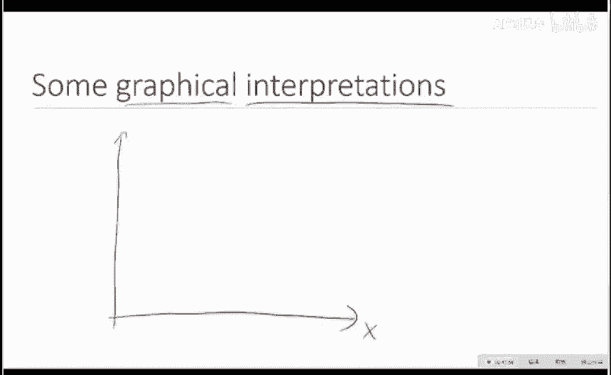

就是我们这个整个的就是就是它就是RM，就是说我们这个market整个的市场，它的回报在某时某刻的回报，然后我们这个Y值呢，就是说我某一只股票的，某一只股票的这个这个return。

这看model就是说他认为世界应该是这样子的，一个线性的一个模型，比如说当X为它的时候，它为它，它为它，当当X为这个数的时候，它为这个数，这个贝塔是什么呢，这这个线的斜率就是贝塔阿尔法就是它的截距。

请看这是贝塔吧，这是阿尔法吧。

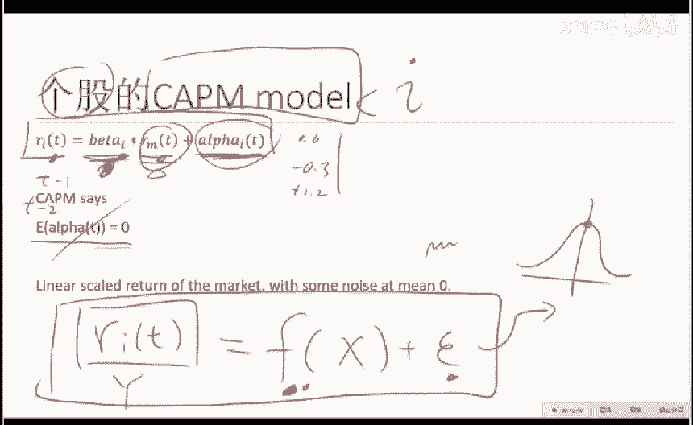

那么分别就是斜率和截距，啊如果你截句都忘了的话，嗯就是需要复习一下线性代数的问题，但是我相信大家啊都还记得这个事情，那么不同的股票呢，它的线是不一样的，怎么样做机器学习呢。

或者说我怎么样学出这个看盘model呢，我这样问，我就从我的金融数据库里头，从金融数据库里头，我总会得到很多的历史的一些点吧，比如说这个点就是2016年1月1号的，这个点是2016年1月2号的。

这个点是2016年1月3号的，这个点是2016年1月4号的，这个点是2016年1月5号的，你总能把它画出来吧，我强烈建议大家画一下，你们自己一画，你就知道它是不是线性的，大概大概它长的就是这个样子的吧。

你把历史数据你全部都画出来，都划到你这块来，然后呢你用sk learn做一个线性回归，这个线性回归，你学出来的这条线，就是这个看看盘model里头所对应的一些参数。

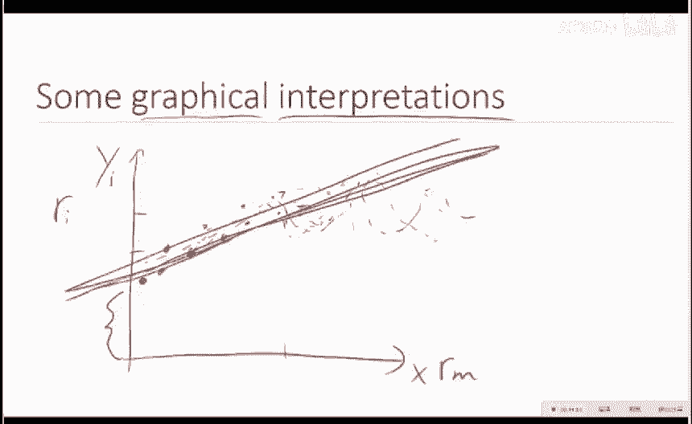

那么问题就在于什么呢，问题就在于世界真的有这么简单吗。

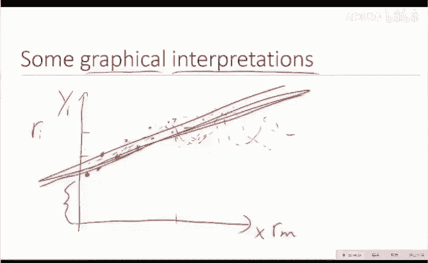

就是说你真的认为，真的认为阿尔法这个它为零吗。

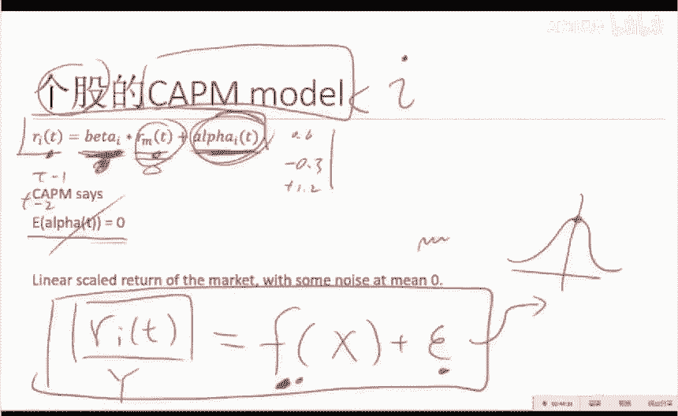

如果你真的认为阿尔法它为零的话，所有线都应该长的，都都应该过原点，现实生活中是这样吗，卧槽肯定不是啊，你随便拿一个。

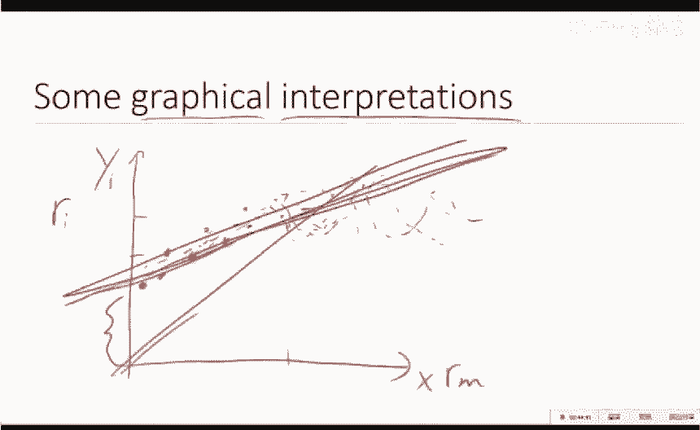

你画一画你就知道了呀，对不对，那么这个是一个非常漂亮的一个理论的，一个模型，也有也有很多的这个对冲基金在用，但是他们用的呢是嗯不是这么用的啊，以后会说并不是说这个模型不重要啊。

这个模型是金融的基石之一啊，不是说它不重要，而是说你从机器学习的角度来看的话，什么看model，它不就是一个线性模型吗，对不对，就是说而且这个线性模型你的假设是，我只假设这个X的feature是一维的。

我X我分分钟能给他造到十维去，对不对，我这个F我分分钟能给它变成一个非线性的，也没有问题，那就只不过叫另外一个名字而已，叫了一个张三模型或者李四模型，而已，但是看model从机器学习人的角度来看的话。

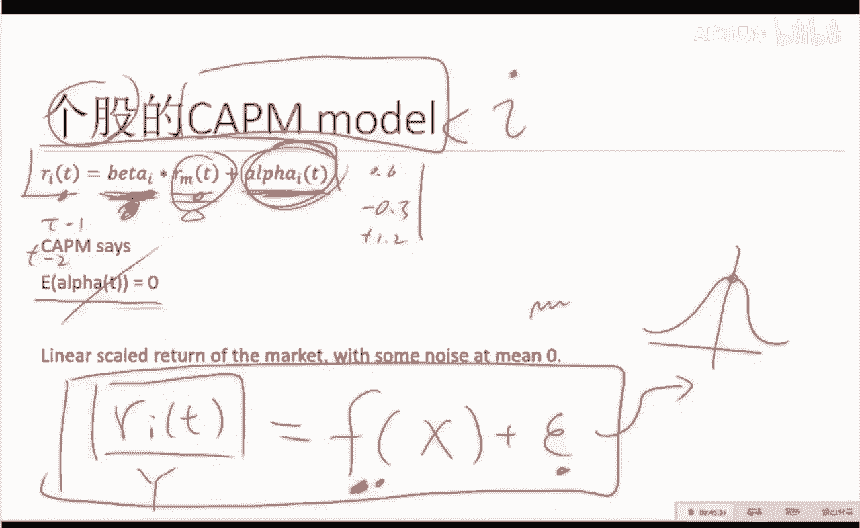

它其实就是说嗯他认为世界是这样子的，但是他世界真正是不是呢，那不好说，你得用数据来说话对吧，嗯有问题没有，再给大家几分钟的时间提提问题，阿尔法的积分为零，阿尔法也就是说你每在每一个时间点上。

阿尔法可以不为零。

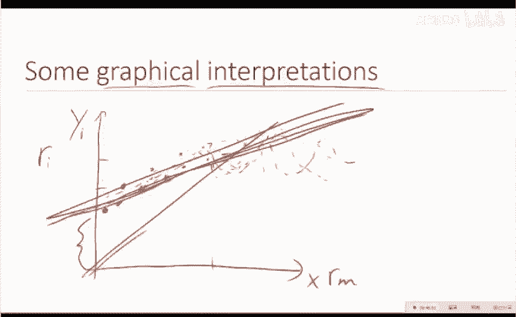

但是你从你in the long term，你在每一个时间点上阿尔法是一个数，是一个0。2或者0。1或者负的0。3，但是你当你时间足够多的时候，你把这些阿尔法值加起来，你就会发现它为零。

是这个模型说的啊，不是我说的，我不信这个事，但是有很多人信啊，巴菲特信巴菲特是信的，嗯因为巴菲特认为你对这个对吧，嗯嗯你这个技术分析是扯的，嗯是的是的嗯，谭同学非常从金融角度呃解释了一下。

我可以从金融角度解释，但是我不解释是因为我今天要讲机器学习，OK嗯就是说我不想解释它背后的金融学的阐释，我现在就更我。

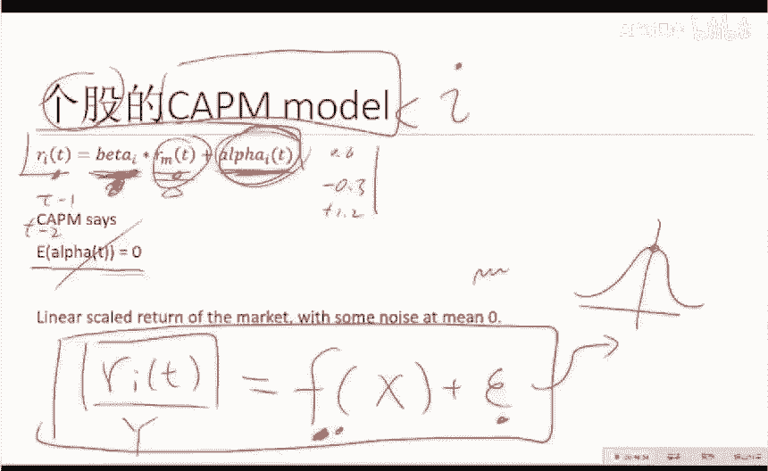

我现在想告诉你的是，它是斜率跟截距，我可以完全从金融学推一遍，但是这不是咱们这门课啊，有很多金融学的很棒的课，大家可以去听一听，蛮有意思，理论很漂亮啊，嗯如果要推的话，我我建议大家上这个嗯，好推一个吧。

反正这个主IDU也没开，所以福来不会骂我，这里头有些呃，关于这个投资跟investment的一些课啊，我建议大家去学一下，蛮蛮蛮蛮好的，然后还有就是这个耶鲁有一个公开课，做的也不错啊。

那么这个被动式管理跟主动式管理是这样，OK被动式管理呢就是说，我认为这个有被动式管理的人，认为你没有办法beat the market嗯，你只要买了这么一沪深，你就沪深300股指期货是什么股。

我就持有什么股，要死一块死，要好一好好，你，你是没有办法来找出来一个好的一个贝塔值嗯，就他认为大大概就是你，你没有办法很有效的找出来一些离群的贝塔值，来让你进行这个嗯投机套利。

而主动式管理呢就是说我选择一些个股，我频繁的来这个啊交交交易，那么就是两个截然不同的思路，那么他们的关键的分歧就在于，他们对世界的理解，就是说被动式管理，他认为这个东西是一个随机变量。

而且是一个期望为零的随机变量，就说明我们做的所有事情都是hopeless的，被用公式管理的人认为上帝就认为这个事情，他们就是一个线性的这么一个简单的关系，你任何的其他的信息。

就比如说我们证监会今天发了一篇文章等等的，这些信息，没有办法再加一些额外的term在里头，就是说就这个信息已经完全解释了，所有市场内所有的information都在里头了，嗯如果你相信这件事情的话。

一般来说你就会去做一些被动式管理的事情，如果你不相信，像很多人，包括我嗯，那么呢我们就会有走这个主动式管理，就是说我们认为我们可以把这个阿尔法这一项，再拆开，或者说我们就会找到一些更多的一些变量。

就就是说我们不认为它仅仅是一个，RM的一个函数，我们现在认为它是RM没有问题，我大概还有ma，对不对，我还有很多其他的，我有很多变量的一个共同的函数，来影响了我的啊。

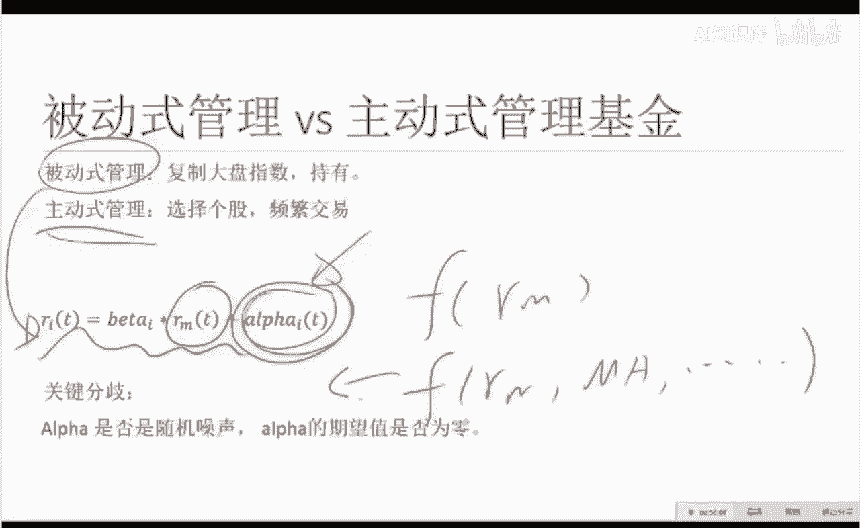

或者说一些其他的东好，那么嗯因为不好意思，今天这个嗯电脑是借鉴的，所以我这个写在纸上拍了一下，那么作为作为投资组合的这个看盘model呢。

也是一样的啊，关于个股的这个大家有问题没有，好好好，我们接着走哈。

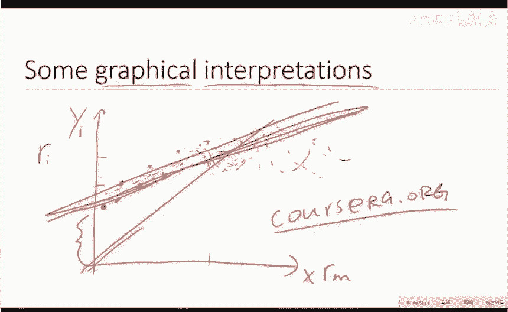

感觉没有什么太多的其他的一些问题了，好那么投资组合的也一样，就是说我们比如说我们自己有一个port fire，我刚才说到的这个port fo就可以，比如说是你持有的三只股票没有问题吧，你可以持。

你可以持有三只股票吧，嗯你持有三只股票在T时刻的时候，他的回报我们看看能不能就基于这个线性模型，我们往下推一推，那么我们这个投资组合在T时刻的回报，是不是就等于一个SAM，就是说这个投资组合的这个权重。

就是百分之A还是百分之B，还是百分之C，乘以这个投资组合的乘以这支股票的回报，而你把就是说我再多写一项吧，整个投资组合在T时刻的回报，就应该是IWI乘以这支这支单独的股票。

在T时刻的回报的一个加权的一个和，没有问题吧，那么我们把这个东西，就是说我们把在T时刻T时刻的时候，这支股票它的回报根据看模型，我们给它展开写，就是这个东西，然后我们把这个WI这个这个权重给它乘进去。

就是这个东西，然后由于这个这个求和的符号就是两个和的，求和，可以等于求和的两个和，你就你就把它加进去就行，恒等变换就可以写成这一项，加这一项，如果我们令你注意啊，好玩的地方就在于这。

如果我们令这个他的这个权重WI乘以贝塔I，叫做贝塔P，就是说我们这个PCL的一个贝塔值，我们同样能够推出来一个线性的一个关系，跟非呃跟跟这个单一股票的是一模一样的，换句话说。

我们认为你这个投资组合的回报，是大盘回报的一个线性的一个关系，那么这个参数是就就就就是另外一个贝塔了，就是说嗯，就是这个大概贝塔以前的贝塔是这样子的，现在贝塔大概就是这样子。

就是说它仍然是一个你线性的线性，当然还是线性吗，那就只不过就给你推了一下，就就是说长得还是蛮像的，就是说就是说作为一个投资组合来说，它的开盘猫model你也能做一个fit，对历史数据做一个拟合。

拟合完了之后，你就能求出来那个贝塔是多少，有问题没有，好那么作为啊有基础的一些东西，比如说你已经曾经嗯做过一点量化的事情的人，我非常建议你今天回去做一下这件事情，就我建议大家做一下这件事情。

就是说你自己把这个事情plot一下。

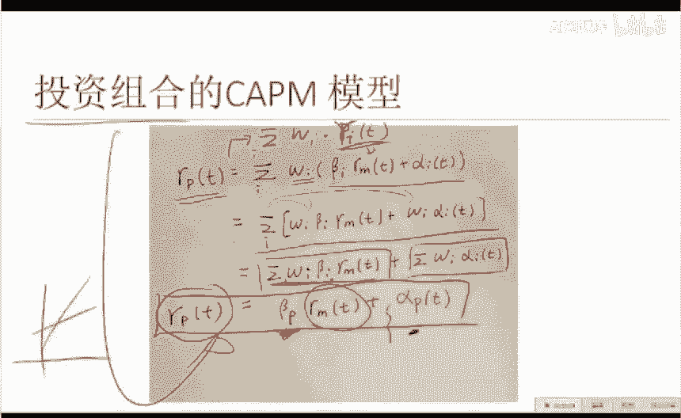

你自己看一下，它就是说你自己画一个叫做scatter plot。

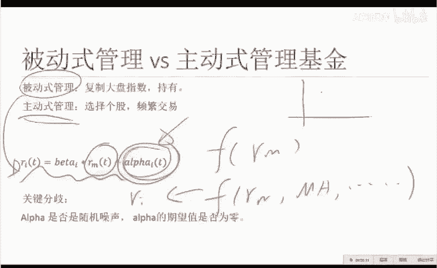

你自己画一下，某你感兴趣的一只股票跟沪深300股指，他们的return之间的关系，你画一下，你看看你觉得是不是线性的，这个是一个蛮好的一个编程锻炼，同时呢为我们今后的一些事情。

也会把一个比较好的一个基础啊，没有没有编程背景的，或者说嗯觉得这个事情太困难的，同学可以先放一下，但是如果你已经用过一些恐怖片啊，或者说优矿啊，或者说什么什么什么的啊，你可以试一下这个视频好吧，数据啊。

如果问这个问题的人呢，那你就不用了，你就不用管了啊，就是说嗯嗯以后我会教你怎么下，下节课我会告诉你从哪弄出去，但是如果你等不及的话，你可以自己用就可以做这件事情嗯，OK那么基于差盘model呢。

就说我这个E拉法值为零，这个期望值大家嗯如果统计忘了的话，不要害怕这个嗯期望值呢就是说，期望值就是说我在嗯嗯，在它在这个分布中采样很多之后，他的一个平均数就是说嗯比如说我有阿尔法一，阿尔法二，阿尔法三。

一直到阿尔法N，我把它求和，我求FMATION，阿尔法I再求一个平均数，它是为零的，当N趋近于无穷大的时候，这个阿尔法是一个是一个随机变量，对不对，这个阿尔法值它是一个随机变量。

它是满足一个distribution的，那么每一个阿尔法I呢，就是从这个distribution中进行的一次采样，然后这个E阿尔法等于零的意思说的就是它，那么那么这个推论。

就是说我们顺着这个看盘猫的往下说哈，就是说我们假如我们知道了这个嗯，RI等于啊贝塔i RM加上阿尔法I，假如说我们知道了这个东西的话，那么我们显而易见要干的事情呢，就是说我们当牛市的时候。

就是说当这个玩意儿往大于零往上走的时候呢，我们要选择一个大点的贝塔，就是挣的要比市场要多啊，这比较好，对不对，当熊市当跌的时候呢，我这个数小一点要跌的，别比他们，别比大盘就跌的要，第六嗯。

不要比大盘跌的多，而且如果他为负的话呢，那更好，熊市都小的贝塔或者甚至于负的这个贝塔值，这个是非常好的一个事情，那么但是呢如果有市场有效假说成立的话呢，这件事情是没有没有办法找到的。

但是核心的问题就在于，你是否相信市场有效假说呢，如果你相信时尚伟跳讲说，你就会知道，没有办法从历史数据中挑选出来一些股票，可以赢过这个market，如果你不相信市场有效假说呢。

你总有些方法就把这个阿尔法I再拆开，或者说就是说其实把阿尔法I拆开的意思，就是说我们又引入了一些其他的变量，让这个函数更呃更更更更复杂，来得到这个这个这个这个这个一个比较好的。

这么一个嗯可以套利的一只单一的股票，Ok，啊课上了一半了，大家有问题吗，啊不相信市场讲说什么预测，那就是你建立一个新的模型呗，你认为比如说举个最简单的例子，就是说我认为啊。

我认为这个阿尔法等于贝塔i RM，再加上这个伽马I，比如说是ma5，这是一个新的模型啊。

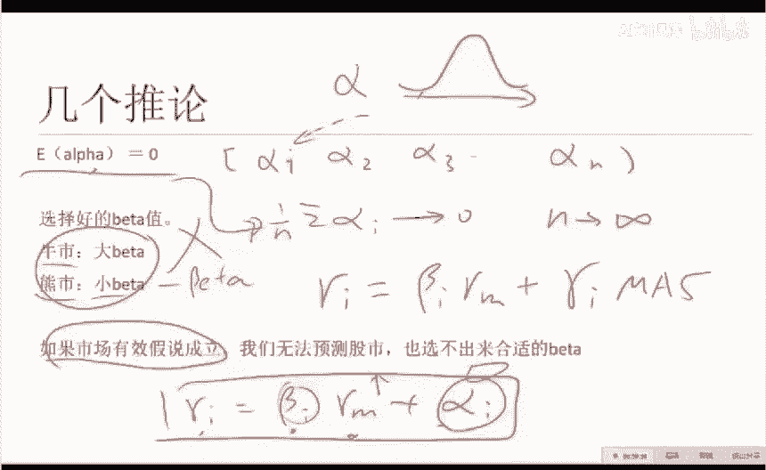

啊我我我我认为是这两个变量共同决定的啊，可不可以啊，没没有问题啊，啊这个问题非常棒，但是同样是一个纯金融学的问题，我们需要蛮长的时间来解释这个问题，你不需要管，因为其实并不会影响我们做的每一件事情。

嗯啊行，那么我们接下来接下来的事情，我们现在知呃呃呃给大家3分钟的休息时间，同时呢有问题的同学请留言好吧，OK啊，贝塔高不一定是牛股，因为当当熊市的时候，你贝塔高不是什么好事，熊市大盘跌一个点。

你这只股票要跌十个点，就是说金融学理论有一套非常完美的理论，把各种的这个背后的金融学的意义，那你能以非常漂亮的公式啊来进行这个表达，是一个啊很很很可以说完美嗯，蛮美丽的一个一个学问，但是同样的情况啊。

这门课我会尽量的减少这个讲它，我不是不能讲，但是就是跟我们要做的事情其实关系不大，嗯阿FI从模型的角度来说，它是一个随机变量，再稍微介绍一下这个apt啊，因为绕不过去的，如果你要在这行的话。

你总会总会听到这个词，它是什么呢，就是说我你看哈对于每一只股票来说，我们以前的这个贝塔，是不是就是一个斜率而已呢，对不对，那么这个应该是在70年代吧，在70年代提出来，那么因为统计学已经上百年了。

你这个线性模型一提出来，很多人就会跳出来说啊，这个不一定吧，他是这个APT他是怎么假设的呢，这个app它假设的是这样，他APD假设的是我们这个看的不是大盘吗，这个东西是大盘呀，这个是market。

对不对，但是我这是一只个股啊，就是这个我这个个股跟这个market，他这个关系也许不能只通过一个数来形容，就是我把这个market我给它分解成为哎，不是不要画到这，我把这个贝塔呀，我把这个贝塔。

这个贝塔本身就是另外一些变量的啊，这个这个这个这个啊啊啊啊啊Y值啊，这个贝塔是什么，就是说贝塔可以是每一个板块，return的一个线性回归，就是说我还能把贝塔再再拆开，就就比如说是啊这个嗯贝塔啊。

KI然后乘以RK，然后这这个是贝塔这个啊，嗯嗯LI乘以这个RL就这是每一个板块的，是有一个贝贝塔值的，没有问题，对不对，就是说那么这个APP，就相当于把这个线性的这个关系再给他，再给他细分了。

让寻找出来这个股票跟每一个板块的这个啊，多变量的这么一个啊线性回归模型，但是呢它归根结底呢，他还是一个线性的这么一个模型，我们看哈，比如说一个一个非常简单的一个例子，就是说我们假如说，一个股票。

如果你通过了一些嗯嗯机器学习的知识也好，或者说你做了个梦，你梦见了呃，这个股票它在未来会比这个呃market会高1%，然后他的贝塔值是一个点呃，是是1111。0，然后如果这个stop b呢。

他会比这个market跌啊，11%，它的这个贝塔B呢12。0，那么基于这两个知识呢，我希望大家就会很快的能够想明白，我们要做的事情，就是long long a跟硕B，然后今天要干的事情呢。

就是说我就会有一个很很好的一个模型，来推出来，就能算出来这个A跟B的A跟B，你所需要的这个就是这个资产的这个，allocation的这个百分比是多少，能够完美的把这个问题做做完优化。

这个是完全另另就是另外一件事情，我跟大家可以做一个简单的一个展望，就是说你居你居于这个就可以，就同样是能推出来一大坨嗯，简单啊，就是简单优雅的一些啊，套利模型的一些公式，OK好，那么跳了技术分析哈。

我们刚才说到了，我们这个其实的我们这个干这个事情的，所有事情，其实它关键就在于学一个FX等于Y，其实我们就是说就是想知道这个F是什么，当然也包括了X是什么，对吧，就是说我们做做量化的这个本质。

其实就是干这个事情没有问题吧，啊阿尔法跟贝塔没有任何的关联度，你就想成你你你你你把这个阿尔法，你你你如果是真正的看模型的人，阿尔法他他认为的阿尔法是这个ACS的好，那么我们这个技术分析的事情是什么呢。

技术分析认为就是技术分析，相信的是，我这些X可以从这个历史数据中进行一些提取，提取出来的东西呢就叫做所谓的啊从啊，搞机器学习的人呢喜欢把它叫features，不同的名字而已，他们都是什么呢。

他们就都是这个所谓的这个X，这个X是一个向量，它可以是多变量的，也可以是单一变量的，如果是单一变量的，那么那么开盘model呢它就是一个那么多变量的呢，你就你那就由那就由你来定义了。

不同的人会定义不同的X，而不同的X呢，会直接影响到你这个模型的预测的准确度，明白了吗，那么就是说而这个X呢技术分析的人，一般X就就仅从历史的价格跟交易量，进行一某些组合。

然后怎么样选择这些features，是里头的一个非常大的一个学问，一般是有经验，通过经验来选，没有问题啊，通过机器学习的方式自动的来选出来，一些也没有问题，这个就是我们在这门课中，要反复锻炼的一个本领。

那么也有很多书来，也有很多论文，每个人就八仙过海吧，你说X这么选，我说X这么选都行，那么选出来的一系列的X，或者比如说你最懒的方法，你用这个一个所谓的叫遗传算法，这个我会讲。

接下来我会讲用比如说用遗传算法，用遗传算法来找出来，你从非常多的一些啊这个指标中来，自己来找出一个比较硬，比较优优秀的这么一个指标的这么一个组合啊，来建立你的模型，有问题没有好。

那么就是说技术分析什么时候有用呢，技术分析一般来说一定要多个指标，就是说你X最好别一个变量，一个变量不好弄，因为一个变量嗯，就是说就是说你你认为这个股价的这个price，仅仅仅取决于一个参数。

然后那这个是太难做的一个事情了，而且也很难有，就他的这个每一个feature的这个predictive power，它是很小的，比如说你在金融学里头，你做这个R方值一般来说都是0。0几啊。

你们你你你你要做其他的机器学习的一些任务，这个R方值你至少你0。80。9都没有问题，这个R增值我在今后的这个课程选择的课程中，就会专门告诉，就是说评价一个，评价。

你这个X跟Y关系的这么一个这么一个函数吧，就是说X跟Y值到底是相关的还是不相关的，比如说这个Y值是今天的股票价格，这个X值如果是我今天早上吃了吃了几碗饭，那么它这个R方值就会很低啊。

但是呢如果他两个比较有关的话呢，这个X的值就会比较高啊，啊，那么就是说技术分析呢，一般来说一定要多个指标的啊啊啊非线性组合，当然线性组合也可以，也不是不行，互信息也是一个评价的方法，没有问题，可以啊。

但是一般来说你玩的稍好一些，第二个是短时，这个也蛮重要的，就是说我们技术分析一般就是说嗯，你很难听到谁说我技术分析，分析明年的这个大盘的涨跌，这分析不拉，嗯就一般来分析是微观尺度的啊。

就是嗯顶顶多到天了，撑死哈，就是说你最最能日内最好日内啊，就是说我在短时间内的这个是可以的，长时间内的并不适合，举个简单的例子，就是说嗯因为技术分析人比较相信趋势，这个事情，比如说我有一个人。

我一拳打出去了，我打到一半我就能猜出来啊，他大概是要打拳，但是我现在在打拳，你说这个人现在在打拳，打了一半，他明天再干什么，你别说就比较难了，你明白吗，嗯嗯嗯用贝叶斯的，这个用用贝叶斯这个角度来说的话。

就是说比如说我现在的股价到了这了，我预测这个是T时刻哈，我想预测接下来的股价，我用机器学习的方式，我可以预测到天荒地老，但是我这个信心呢就逐渐的就就变小了，就是说我们这个信息，比如说这个就是。

比如说你可以把它看作我的置信区间，那么我预测出来的这个东西随着时间的增长，我这个信心就越来越小，就说它都有它在这个区间内，跟这个区间内它都有可能，但是在极短时间内呢，我是蛮相信他是这个棒子。

就是它的这个界是比较小的，所以说技术分析呢，一般来说是在短时间内的这个尺度上啊，做的比较好，第三个技术分析什么时候能works呢，是一些异类检测，就是说比如说我们找来了一些股票，跟大盘很一致啊。

这个不是本事，你这个没有任何用，但是如果我能通过你技术分析的手段，我找来一些股票跟大盘很不一致啊，这个事情就值钱了，因为只有不一致的时候，你才有可能套利，那么你就应该在不一致的这些股票上啊，再下点功夫。

看看有没有可能，来挣钱，就是说他对异类检测也是蛮有帮助的，OKOK就是这个trading time好，horizon是什么意思，就是说比如说这个是啊时间的话，技术分析是短时间内非常值钱。

长时间内就就就不大值钱了，比如说这个是他的啊效率吧，因为因因为套利的定义就是基于不一致的，你一致你就不好套利，这个是技术分析，另外另外技术分析的反面，我相信大家都知道叫基本面分析。

就是巴菲特就他一般持有一只股，但是他绝对不可能说是我持有一只股，然后我我我我我我明天就卖啊，就他在短时，但它在短时间内是基本上没有效的，就是说trading time horizon，就嗯怎么翻译。

就是说你就是嗯这个时间的这个尺，你从尺度上来看，技术分析的啊，是有多值钱，从时间尺度上来说，时间尺度越小，技术分析越值钱越有效，大尺度来说，技术分析就不是太有效了，而基本面分析是反过来的。

就是说在小小尺度内，比如说这一秒跟下一秒，我看公司财报它有没有区别呢，基本上没有区别，但是你今年跟明年的公司裁票啊，那这个大概就就会啊就能说明了事，比如说尺度大了，走基本面分析，尺度小的时候呢。

技术分析啊是值得去做的，这个是就是两个比较，就是说到底是你应该是做技术分析呢，还是应该做基本面分析，取决于你要做决定的时间段，那OK那么现在我们来看哈，那么技术分析的人就认为呢。

技术分析技技术技术分析认为的是什么呢，就是认为我们不能仅仅看这个RM，对不对，我也都我他妈得看点其他玩意儿啊是吧，我看点什么玩意儿呢，啊那么那个大家这么多年来啊，非常聪明的一帮人天天没事玩这个事情。

他大概能够找出来最最基本的是就最基本吧。

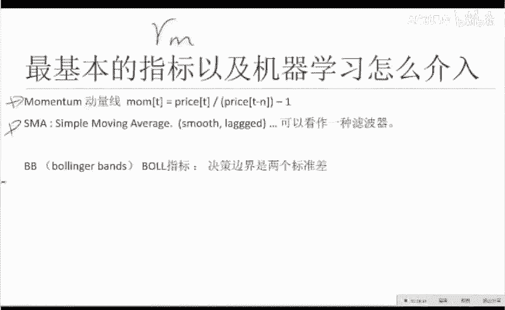

大概就是这么几件事情是什么呢，就是说一个是所谓的momentum，我不知道大家有没有人在做这个啊，深度学习啊，深度学习里头训练一个啊函数，随机梯度下降里头的一个非常重要的技巧，他也叫某门特。

跟他这个其实是一样的，叫动量线嗯，非常简单，它是什么呢，它是这样，比如说我们的骨架是嗯，这个是我们的股价对吧，我们的这个是我们的股票的价格，而这个它的动量线就是说，比如说我们从这一点到这一点啊。

它是长的，那么这个动量线呢你就可以看看作是正的，然后从这一点呢到这一点它就下去了，那么呢这个动量线呢它就是负的，这个动量线的公式就是这一时刻的价格除以上，N个时刻的价格减去一。

就是这一时刻的动量线的这种指标，这这个就是一个量化的一个公式，有很多人呢就会基于这个动量线的这个一个，阈值也好，一个啊区间也好，来判断它的这个你是否要买，或者比如说一个简单的一个技巧，就是说啊。

比如说我他们认为有人认为啊，这个动量线是正的时候呢，他会接着往上，就会接着这个趋势往这边走，所以说你就可以写出一个非常简单的一个策略，就是说当我这个动量线大于零的时候，我就满，当它小于零的时候。

我就慢啊，当然我我不推荐，因为这个动量线你只有一个变量，你都要做一个决策，那肯定是肯定是有问题的对吧，那么这个是嗯一大类的，就是一大类的这个嗯嗯嗯制造X的一个方法，比如说你这个momentum。

你你这个你这个这个N是一个超超参数啊，你这个你可以是往前看五个点，十个点，15个点，你分别就会产生三种不同的动量线的数，那么你这个X就会制造出来X1X2和X3，就能放到你的模型里面去了。

OK这个N是给定的，那么这个这个这个SMA呢，也是嗯非常简单的一个嗯，所有人如果炒股的话，都会听说过的一个东西，就叫做简单的移动平均，什么意思呢，就是说比如说再看哈，这个是我们的股票。

移动平均要干的事情是什么呢，啊这个相信大家都应该知道，移动平均看的是就这个时刻的，这个时刻的移动平均就是上几个时刻，上五个，比如说上五个时刻的一个平均值，就是这个时刻的嗯，移动平均。

那么我们对每一个时间画出来的话呢，它大概就是啊这个样子的，那么你可以把它看作一个平滑板的，就经过smooth的一个version，的这么一个股票的一个价格，那么也有一些交易员注意哈。

也有一些交易员就认为这个移动平均呢，是这个啊他的这个真实的内在价格，而这个东西就是说你你可以把移动平均看到，他这个这这支股票的真实价格，True value，然后你把此时此刻的价格。

那就是看作它的现在的市场价，那么如果它的市场价高于它的这个真实值呢，你就你就说它如果你此时此刻的价格呢，低于它的市场价格，低于它的真实值，那你就浪了，当然这个也是嗯最简单的一种交易的策略，有问题没有。

是均线，是均线moving r位置，但是这个均线这么做有很明显的一个问题，对不对，均线这么做有很明显的一个问题是什么呢，就是啊你可以，其实你主要是一种去去造的一种方法，咳咳均线这个问题就在于，比如说嗯。

嗯举这个例子，今天的问题在于什么呢，均线的问题，比如说我在于啊，我这块是比较波动性比较小的，这块呢波动性比较大，然后你比如说你在你的T时刻，你做的这个均均线，大概他是这样子的对吧，你做这个线。

你在这块比如说你设置的阈值是涨一个点，你就认为就是他在这个，就是比如说你离均线偏离某一个小阈值，你就要会触发一种交易，OK但是当我波动比较大的时候，我这个策略就会频繁的被触发，那这个事情就不太好。

就是说你没有办法来把这个，就是随着时间的变化，它它的这个价格的波动性嗯，不一样的，这个这个信息给它融合到你的这个策略里头去，那么这个BB算法呢就是嗯大家肯定都知道啊，嗯就是这个很嗯。

华尔街非常著名的一个嗯老头啊，发明了这么一个指标的方法，他什么呢，他就说你也别就是说你基于这个移动平均啊，我还能计算出另外一个指标，这个指标呢叫做就是说我在每一块，我在计算出一个角色边界出来。

这个绝对边界是什么呢，就是我这个时间序列的两个标准差，标准差，Standard deviation，这个大家嗯如果忘了，一定要回去看一下什么叫标准差，就是只要我给你八个数，你就能告诉我这八个数的平均值。

能告诉我这八个数的标准差，标准差就什么意思呢，就比如说我给你了三个数哈，1。2，1。3，6。5，那么它的平均值是有的，它的它的标准差体现了每个数额平均，就是每个数离平均值的偏离的这个程度啊。

你可以这么想，那么它这个数的标准差就比较小，比如说他是一，这是1万啊，这是十啊，那么它的标准差肯定就会大一点，那么我们这个BO定指标呢，对啊我嗯对是就是说我们仅在这个标，就在在这两个标准差之外。

当我们从啊这个问外面的这个区域，进到里面的时候，我们再触发我们的交易行为，这样的话呢会让你的这个交易策略，具有一定的鲁棒性，这个是一个比较cs的一个用语哈，比较黄，但但是不是大家想的那个鲁棒性。

不是大家想的那个鲁棒，就是说比较robust，就是说嗯，就说不会让你的这个教育系统快速掉，要不然就就就就就嗯嗯就两两根标准差，就是说这个你目标位置往上面走，两个标准差，往下面走两个标标准差只是一个数。

对不对，基于每一个时间点，我能算出来在这个时间点上它的标准差，比如说是0。8，那我就往上走1。6，往下走1。6嗯就是说基于每其实每一个点，这它都是一个它它它都是一个，它都它都应该是一个分布的对吧。

每一个点的这个price其实是一个分布的嗯，OK就是说每一个点的这个price，我们看到的这个twice是观测到的，但是它其实是满足某某一个分布的，嗯对嗯，这个是一个坎。

你如果大家是数学的基础比较好的话，就很明白这个事情嗯，有问题没有啊，这个是两个标准差。

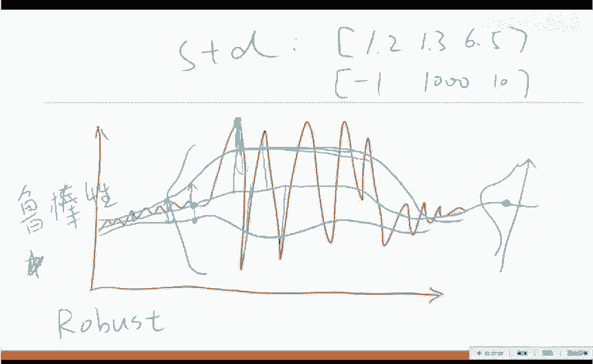

是他认为他建议两个标准差是老中医告诉你的，就是说你加一个加一个加一个这么一个嗯，嗯嗯能够嗯考虑到他的这个波动性的东西，肯定会好，但是为什么是两个标准差，不是1。5个，不是三个，不是八个。

这个是一个大家的一个实操的一个一个东西啊，OK就是说是什么呢，比如说比如说我们的一个简单的一个交易策略，是这样，是偏离我们均线一个点，我们就会嗯买或者卖，但是呢，当我们这个股票的价格波动比较大的时候。

它每一个tick它都会触发你的这个交易，交易策略，这件事情有的人不是很喜欢嗯，标准差怎么算出来，这个很好算的呀，就是说你这个时刻你往前看十个时刻的price。

这十个时刻的price就是任何你只要给我十个数，我就能算出一个标标准差出来啊，你你给我十个数，我我能算出来一个平均值，我也能算出来一个标准差，就是作为一个应该嗯嗯对统计学基础，对另外一个事情呢。

另外一个事情是这样，就是说我们在做量化的时候，比如说比如说我的一个模型，我要求就是说我认为他的这个Y值，它是谁的一个函数呢，它是SMA的一个函数，它是一个momentum的一个函数，它是BB的一个函数。

没有问题吧，但是一个问题是，这些这些X它的取值范围不大一样，就是说比如说一般来说，f ma的取值范围是正-0。5，mental它的取值范围是正-0。5，而BB它的取值范围是正一，还有的参数。

它的取值范围也许是正-10~35，那么如果我们不做归一化做这个事情的话，那取值比较大的，它它这个系数永远会占一个主导性的作用，就让其他的参数基本没用了，举个比较简单的例子。

如果Y等于嗯AX1加上BX2加上CX3，如果X3的取值比X2跟X3，要大十倍或者100倍的话，学出来的模型这两个系数值不管有多大，这个Y值基本上都靠X3就被干掉了，所以说我们一定要做一个归一化的事情。

规划的事情就是说是什么呢，我们每次得到了，比如说我们针对于嗯8万个时时间点，就是我T比如说是从一到8万，每一个T我会计算出这三个数，对不对，那么我们对于每一列呢，我们要做一个这个规划的这个这个操作。

就是说它的值减去它的所有取值的平均值，除以他的这个stard deviation，就是说除以它的这个方差，这样的话那就让每个值能够在0~1之间了，这样的话呢就能够让每一个feature它的这个权重。

都就是说大家都是嗯就就嗯就嗯可以可以看成，就是说大家都是嗯一样重要的，也也不能这么说，因为就是说就是说可以避免一些嗯，统计学上的一些常见的错误，就是说大家要要要做做量化的时候。

很多人嗯不知道去归一化这个事情，你的模型就不会有很大的用处。

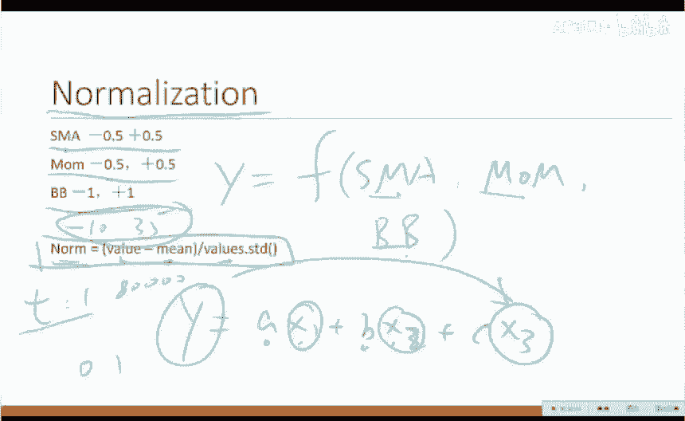

Ok。

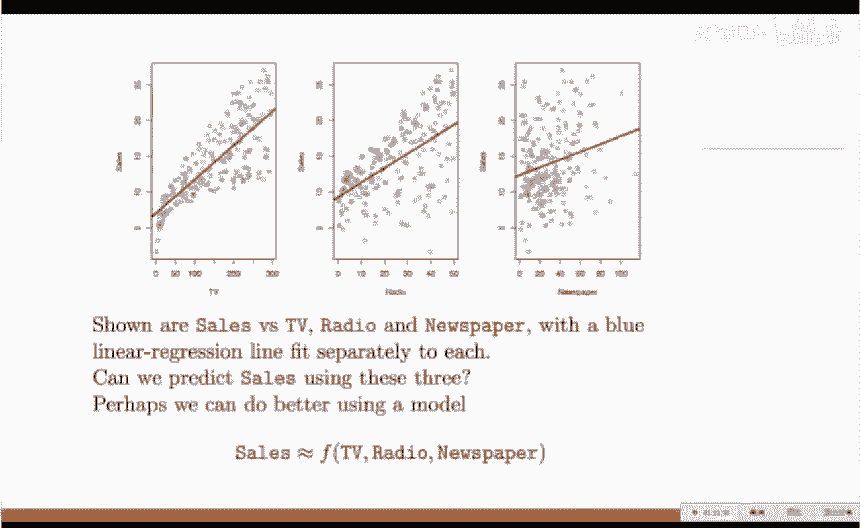

那么接下来我们就会正式进入到。

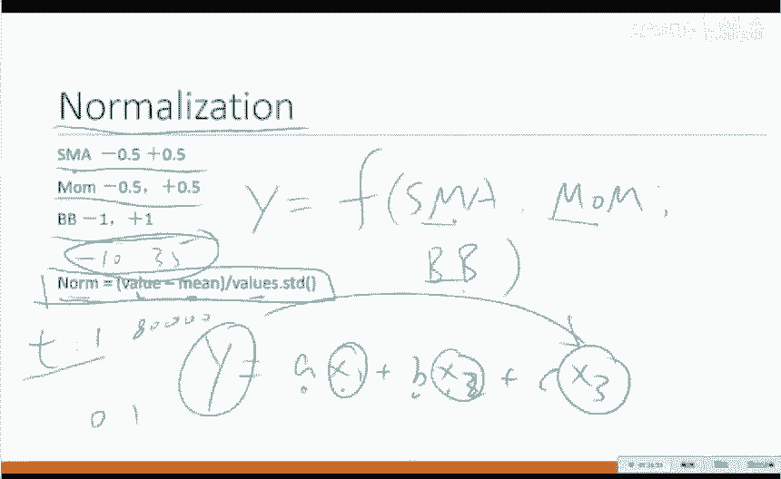

这个东西的学习，我们现在怎么样搞，就是说我们现在就是说怎么样学出来一个F，怎么样选出来这些X这个F到底长什么样子，这个F的参数是什么，哎这个是机器学习干的事情，那么，举个简简单的例子，就是说。

比如说我们认为一个公司的这个收入，取决于他在TV上做广告的投放量，他在radio上做广告的投放量，跟他在新闻上做广告的投放量，如果你认为这个公司的收益是这三个，这三个变量的一个函数的话。

那么你就可以这就是你的模型，比如说你你就可以画出来这个分别的，比如说你你你公司肯定是有这个数据的，这是一列，这是一列，这是一列，这是你公司今年的这个收入，那么你把这两两变量，你可以画出来一个这个嗯。

这个所谓的scatter plot，那么你啊你通过就是说你看完这些图之后。

你觉得哎这三个变量跟Y都是蛮有关系的，所以我就说通过画图啊，我我我认为这三个变量影响了我今年的消息，没有问题，那么你机器学习的问题，就是说我怎么样学出来一个合适的F，那么如如果要用向量化的表示。

就是说这个X是一个向量，它是三呃3×1的啊，然后那么这个Y呢，这个Y就是F的一个呃呃，Y是X的一个函数，F是什么呢，F是从这个X33维到一个实数的一个映射，你给我一个X，我给你个Y，给我一个X。

给你个Y，但是由于你也不是上帝，你这个F肯定是不完美的，同时你在观测的时候，即使你的F是完美的，你在观测的时候也会有一定的噪声，以至于你就算你这个F值是完美的，你在真实情况下。

它也会跟它有一个小的一个偏移量，这个东西呢就是所谓的埃XC龙项，而一般来说呢大家认为EPFC龙的这个啊，它的这个均值呢是零，OK这个是呃监督学习的一个最general的，最最普适性的一个模型呃。

一个表述，那么不同的F你线性模型，就是就是就是认为FF是线性的，非线性模型呢，你也可以用任何的，比如说SVM呀，kernel trick呀，哪一股贝叶斯啊，随机森林啊，无所谓，你想用什么用什么。

但是呢关键到最后呢，都是在说我们怎么样表示这个XX从哪来，因为我们在实际应用中，我们是不知道X是什么的，这个得由你来定义，其次呢有了X之后，我怎么样找F两件事情对。

那么就是说，就是说基于这个F的这个复杂度啊，我们就有可能来理解了，每一个X对Y的这个跟Y的这个这个关系。

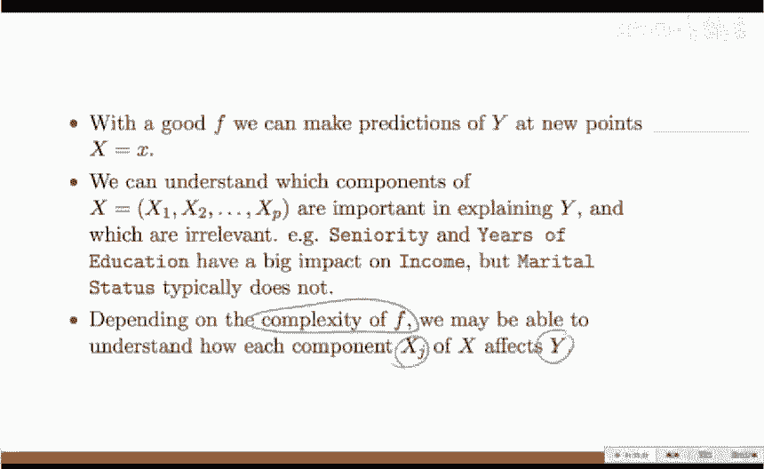

最简单的模型是这样嗯，最简单的模型就是所谓的KN什么意思呢，比如说我假如说我们回到了这个，假如说是一维的哈，就比如说我这个YY是一维的，X也是一维的，那么我们的训练集是什么呢。

训练集就是说我们的历史数据你总得有吧，我历史数据画出来是这么多个点，这是我们的历史数据，那么我们要干的事情，这个model是什么，这个model是一个非参数的一个model，就是说我这个F没有参数。

我F怎么来呢，当我来一个新值的时候，比如说当我比如说我历史数据已经都画，都画出来了，我来一个新数据，比如说这个新数据X是5。7，然后我就会问你说哎X等于5。7的时候，Y等于多少。

因为你不是告诉我Y等于FX吗，然后那么现在来一个新的X，X等于5。7的时候，这个Y等于多少呢，那么最简单最难义务的一个方法就是我查表，我查历史数据中X有没有等于过5。7，哎X等于过5。7。

但是有有一次X等于5。7的时候，Y等于它有一次Y等于X，X等于5。7的时候，YY等于它，有的时候X等于5。7的时候，Y等于它，比如说我查的这个表，查的这个表里头，当我X为5。7的时候，出现了三次。

他分别来分别是1。2。

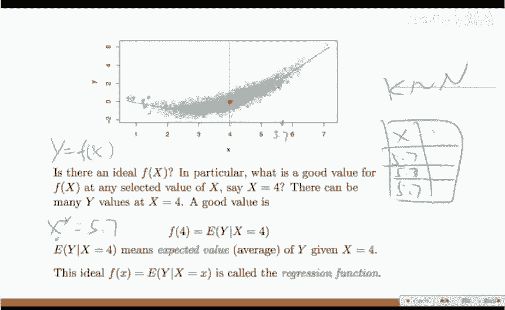

3。6和2。0，这个是完全有可能发生的，因为这个世界是有噪音的，并不是说我有一个XY必须得是多少，对不对，那么一个最简单的方法就是，我发现我历史数据中，X出现了X为5。7的时候，我出现了三次。

Y也出现了对应的三次，我把这YY值我求一个平均值，我给你就行，那么你新来又来一次X等于多少啊，又来一次X等于5。7的时候，我就告诉你Y值应该等于这三个数的一个平均，没有问题吧，这是最简单的一个方法。

这就是这这其实就是KN了，比如说当我问你，X等于5。710932的时候，你历史数据中哎我操没有没有怎么办，没有，你就找这个离5。710932，最近的那个X的Y值的平均值，这就是KNN了，就是最近邻。

就是说当我这个亲有的这个X值，不在这个我的这个历史数据中的时候，那我就在这个X的周围这个区间里头，我把所有Y值求一个平均返回给你，那么这么做的有一个非常明显的一个，那么最大的问题是，当我X的维度。

就是说当我的X的，当我的dimension就是一维的时候，这么做没有问题，那非效果很好，就是说并不是就是一点也不丢人，但是当我的X的维度非常大的时候，比如大大于十的时候，我要做这个最近邻搜索的时候。

它的效果就比较差了，问题在哪呢，问问题就在于有一个在机器学习学界里头，有一个所谓的叫做维护灾难的问题，就是说你嗯嗯用浅显的角度来说呢，就是说当我的维度很高的时候，所以就造成了。

你基本上把整个数据库都找着了，那么这样的话呢你这个平均数就不是很好，OK那么基于高维的这个数据，我们就需要来研究一些啊，比较啊复杂的一些模型来做一个预测，有问题没有，高维就是说我X的维度，这个X是一维。

对不对，当我们X等于就是说你看这个X就是三维的。

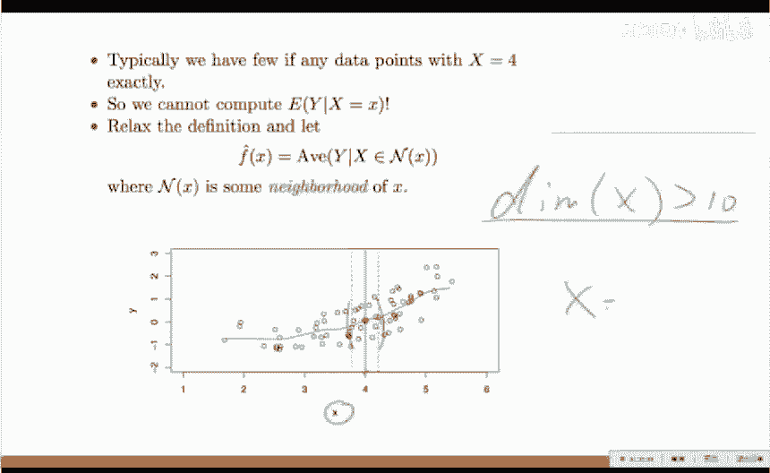

就是我就是我的变量有三个对啊。

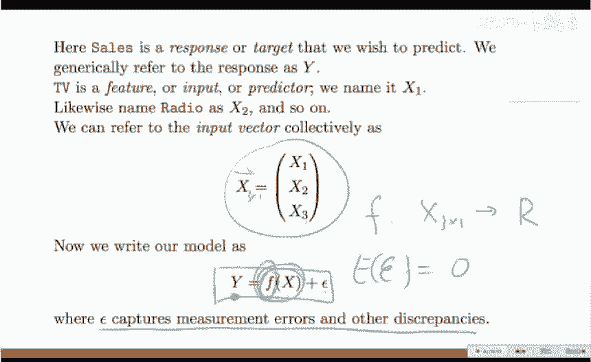

一维呢就是说我X变量只有一个，就是我刚才那个看看吧，猫model它只有一个变量，就是一维的啊。

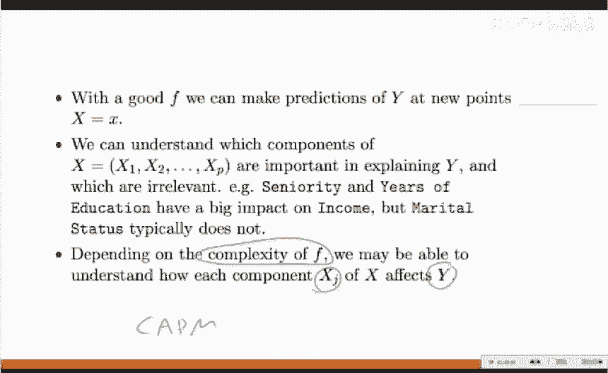

高维就是说我今天的股价的price等于一个函数，它大概是ma5对吧，ma10啊，再加上一个momentum吗啊五那么这个就是三维的，好再说一遍啊，因为嗯维数灾难是一个比较理论的一个事情。

你们首先要记住的是什么呢，首先要记住，这个是你要记住的，原它背后的原因是叫做为数三难，维数灾难描述的是什么呢，一搜把所有人都搜出来了，这样是不好的，不是多因子选股的时候，因子非常适合多于十个。

只不过你不要用最近邻搜索来搜你，你你你你这么多好模型在那，你干嘛非要用这个最近邻呢，就是说这个最近邻是最傻的一种方法，就是说我们实在没办法了，我是一个码农，我没学过机器学习，但是我有一个历史数据。

你告诉过我X等于5。7的时候，Y等于多少，你又来了一个新的X等于5。7的时候，我这码农我拍拍脑袋说哎，这六个数据说过X等于5。7的时候，我把所有的Y值的平均数给你啊，那也蛮好的一件事情。

理论也能证明确实有一些比较好的语文性质啊，但是呢你这个就是说你你可以，你可以定其他各种各样的其他的模型，有有整个机器学习这个这个这个领域，你怎么办，你总不能我有十维，我非选三维，是因为高维的不能用。

那这个就太傻了对吧。

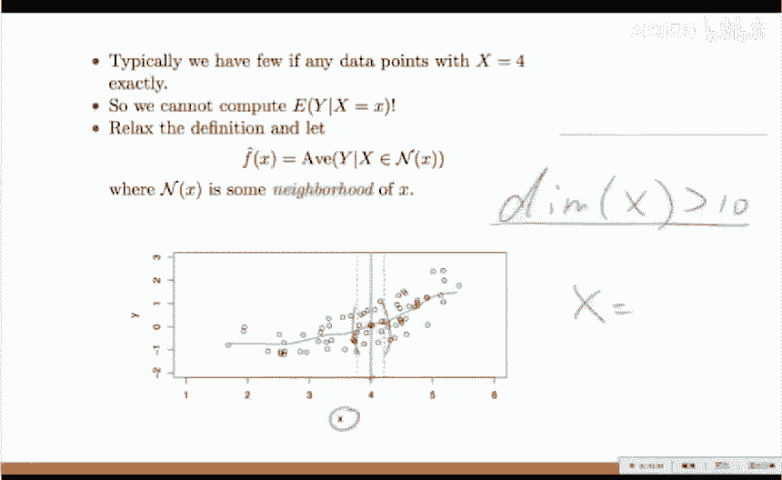

OK比如说一个简单的干高维的一个事情，那么线性呗，比如说我X有比如说有P为这个，比如这个就是TV对吧，你可咱们说成股票，比如这个是我们的ma5，这个是比如说ma10。

这个F呢预测的就是我这个X的一个啊啊啊，这这这个时刻股票的价值，那么我最简单的一个模型，就是说我认为这些变量满足一个线性的模型。

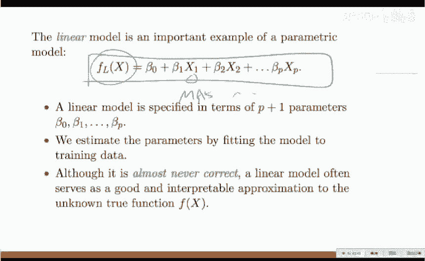

什么意思呢，就是说我把每一个变量，它的一个加权的权重加起来，就会得到我呃我的这个目标变量啊，这个是啊，其实嗯其实说实话深深度学习嗯，它的根本也是一个线性的，为什么呢。

因为深度学习现在大部分的这个非线性变换，用的是所谓的RU，它是一个已经是非常接近于线性模型的，一种非线性变化了，其次呢它的这些全职的连接呢也是线性的，所以说现在大部分的深度学习模型。

其实它是一个非常复杂，你可以看作一个嗯嗯嗯，比线性的线性系统更要复杂一点点的一个模型，为什么我敢说这句话呢，因为有一篇最近的一篇就是蛮著名的一个文章，叫做怎么样的，附你的这个deep的这个CN。

就是说我能制造很多对抗性的样本，来让我的这个深度学习的模型不work，而它背后的原理，其实就是基于深度学习模型里的，非常线性的一些结构，这个说深了，那么你们能记住。

希望大家记住的就是说线性模型一点也不丢人，而基于线性模型有很多嗯很啊啊啊啊很，就是说基于线性模型有很多呃很重要，就是呃那就是说已经是效果很好的模型，他们他们其实就是线性的就行了。

OK比如说一个线性模型呢，他干的就是说我历史数据是这些点，那么我一个线性模型就是说我找一条线，这条线，张三说长这个样子，李四说长长这个样子，到底哪个线好呢。

那么就叫做比如说我们叫做啊mean square啊，还有就是说让每一个点，比如说张三说现在应该长这个样子，那么你就算一下每一个点，每一个历史数据中的点到这根线的这个距离，你把这些和求一下。

比如说这根线的MSE是二百五，然后李四说不对不对，这根线应该长这个样子，那你就把这个这个样子的线呢，这到他的距离，一求你一求他的这根线的距离MSE哦，它的这个距离我操到了800了。

那明显的这这个200的这根线，要比800这根线要好，那么机器学习其实线性线性拟合的关键就在于，它自动的学出来一个，就自动的需要学出来一条线，要求它在理论上就得是最小的，那么这个就是所谓的最简单的线性。

回归模型的本质，而sk learn里头，已经别人已经帮你写好了这个东西了，你只需要干的事情，就是说model表fit你的X值是很多行的数，Y值是很多行的数，然后再来一个新值的时候，你再predict。

X6，那么它就会给你返回这个线性模型中的，这个预测啊，我在课前10分钟的时候提到过sk learn，希望大家回去学会用线性模型啊，学会用sk learn来做一些线性模型的拟合，就一句话就搞定了哈。

嗯好那么一个二次模型呢，你你比如说我我画完这个图，你就说卧槽这图明显不像线性的呀，你非认为世界是线性的，你你就算他的这个error你minimize了，它的error也是蛮大的。

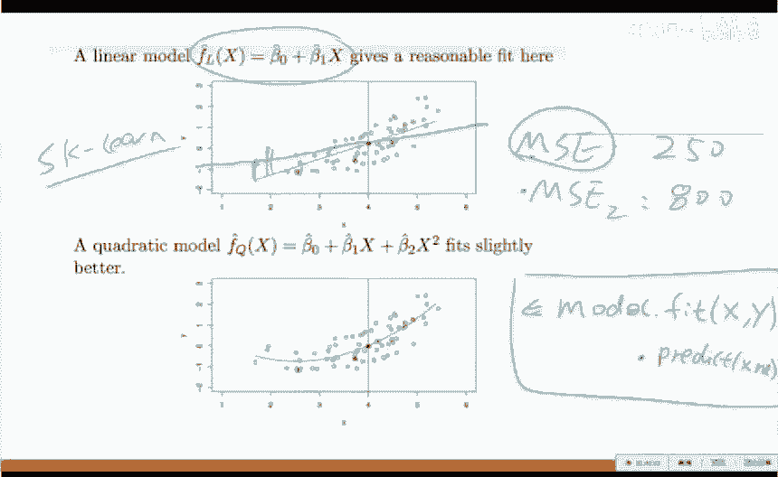

是因为这世界他妈就不是线性的呀，比如说我画一个非线性的一个二次的这个东西，我拟合完了，我的MICE很可能比它要小的，那么到底是选111次的，还是选这个二次的呢，这个就取决于你对这个模型的这个。

你对这个世界的这么一个理解，跟你的一个假设，同时呢你还要留出来一点的这个数据，当测试集就是你还要留出来一点数据呢，是什么呢，就是说比如说我分别拟合了一个线性模型，跟一个非线性模模型。

然后呢你要拿出来一些数据，这两个模型都没见过的数据，就这两个模型一定要都没见过，这个是关键，然后再分别的计算一下，它在测试集上的ms se的误差，你然后再进行一选择哪个小选哪个，很多人这一步是不做的。

那么这一步就不行了，你光分别在两个训练集上选，你选了一个他的错误最小的，那么大家经常会听到的一个词叫所谓的过拟合，Overfit，指的就是这个问题，我马上就会讲到，OK比如说对于这个这个这个嗯。

这个蓝色的这个蓝色的这个这个曲面，就假如说你开启了上帝视角，这个蓝色的曲面是真实的曲面，而这些红色的点呢是你在现实生活呃，在现实世界中观测到的点，是因为你认为这个模型是蓝色的，这个曲面的这个产生的值。

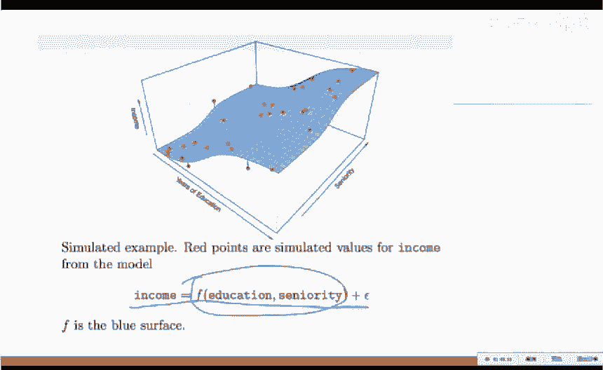

加上一个小小的随机噪声，OK如果你用线性模型来干的，就是说我拟合出来的是一个线性的一个超平面，然后在这个超平面上，我们的这个错误错误的和是最小的，如果你认为是非线性的话，你可以让每一个点都在你。

你拟合的这个这个超平面上，那么就让你的训练的误差就最小了，但是问题是在这种情况下就过拟合了，什么意思呢，就是说你仅仅在你观测到的数据，你让他的错误最小了，但是新只要一旦新来数据之后。

你立马你这个错误就上去了，就所谓的模型的泛化能力。

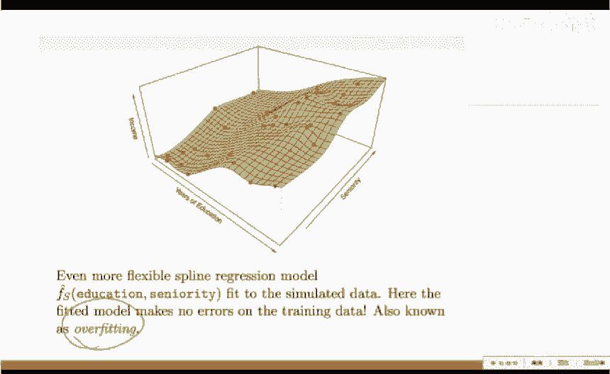

他们讲的是一个事情，那么这个最关嗯啊。

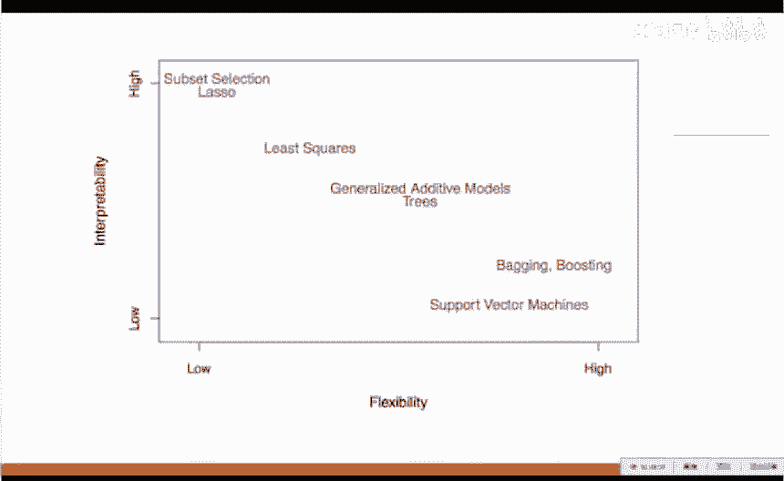

那么就是说嗯嗯你看线性的模型，它是非常简单的，但是嗯这个非线性的模型呢它就比较复杂。

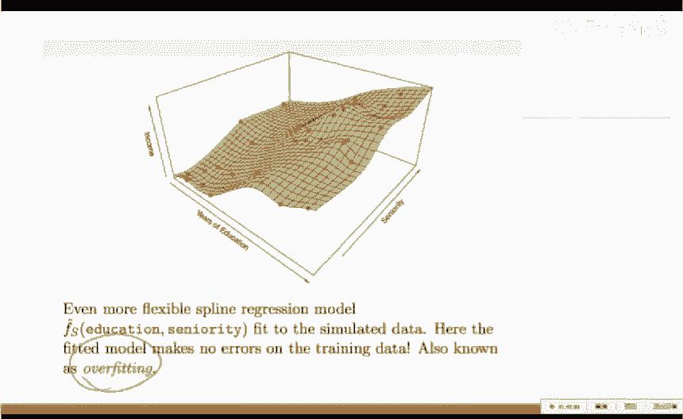

这个表给你的就是什么呢，就是这个模型的这个这个灵活度，其实也叫模型复杂度，模型复杂度越高，它的这个模型学出来的就就越越非线性，模型复杂度越低，它就越线性。

比如说这个subset selection或者LASO的话呢，它就是一个嗯比较简单的一些呃线性模型，而比如说SVM呀，或者说啊神经网络呀，它的这个啊模型复杂度啊就比较高。

同时呢它这个可解释性也就越来越低了，OK那么我们再看啊，这个这个不用对，这个是我们主要要看的一个事情，就是说嗯这个你要做机器学习，一定要听的一个词。

就是所谓的这个BIOS跟varitrade off什么意思呢，就是说是是这样，我说一遍哈，BIOS跟virus trade off是是这样，对于一个数，对于一些数据，对于这些数据我们拟合出来了一个模型。

在这个训练集上，在这个训练集上，如果我们在这个训练集上，这个模型它的这个错误非常小，就是如果就是说如果我们在这个训练集上，当我们在这个训练集上，我拟合出来的这条线，刚好每个每个点都能在这个线上的时候。

我这个BIOS是最小的，因为我每一个都预测对了，但是我的vs很大，什么叫vs很大呢，只要我再给你换一套另外一套训练集，就当然假设的是这些数据都满足一个分布，当我再给你换一套数据的时候。

你的这个误差一下就上去了，所以说我要尽可能的避免让这个啊，就是说如果如果它很小的时候，它就很大了，如果它很大的时候，就是说比如说我走一个线性模型，它肯定不会让每个点都在这根线上，如果让他大的时候呢。

这个VARI就就小了，那么我们机器学习的核心就在于，如何选择一个好的组合，让整个模型的错误推小，VARI是方差，就是说嗯大家一定要嗯回去一定要复，就是说第一次如如果第一次接触这个词的话。

你们回去一定要去查一下这个概念，就是所谓的BIOS ference trade off，我再说一遍，我再说一遍，说是什么呢，当我们一个模型在一个比如说这个训练集是比。

比如说是2015年全年的这个股票数据，我们在2015上，515年全年的股票数据上训练了一个模型，训练完了模型之后，这个模型上你只要给我，2015年任何一天的这个东西，模型都能给你返回exactly。

完全正确的一个结果的话，这就叫OVERFIT了，为什么叫OVERFIT呢，是因为如果我们在2015年的这些数据上，训练完了模型，他的这个bias，就是他的这个错误率非常小的时候呢。

只要我把2015年的数据，换成了2016年的数据，你在做预测的时候，你就会发现就非常不准了，为什么这个现象会发生呢，是因为能够证明出来，你这个模型这两个项是此消彼长的一个问题。

就是说当我们在训练集上的误差特别小的时候，我们的模型的泛化能力就会很小，当我们换一套新的数据的时候，他就不认识了，就跟你，其实就跟就就跟我们身边的这个学霸一样，就是你你你把这个书背的太厉害了。

你来一道新题你就不会做了，相反的，如果你把这书你学的学的大致的学明白了，但是来一道新题呢，你你你用发散思维的形式，你再你再想一想，你也就想出来了，那么这个是我们追求的一件事情啊。

而我们的模型的泛化能力呢，就是为了想追求一个一个好的一个平衡，就说我们在训练集上有错没关系，只要我们在测试集上做得好就行，OK那么，今天回顾一下今天讲了些什么，首先今天给大家公布了一坨需要自习的东西。

要学会Python，要学会这个number派，要学会这个pandas，要学会这个sk learn，这是第一，第二呢我们讲了怎么样的从看盘model啊，他的这个这个模型从机器学习角度对它的阐释。

以及从这个模型，我们引入了机器学习的这个概念，同时呢，我们看到了利用机器学习来做量化的一线曙光，因为你会发现哎，这这两个不是大差不差的一回事吗，所以说我们下节课呢，就会真实的来获取真实的数据。

来在真实的数据上提取一些特征，来在真实的数据上提取特征，完了之后建立一些模型，来看一下我们的表表表现，那么从下节课开始呢，我们就会把今天讲的各种的知识，以这个啊编程的这个形式来做一个验证。

嗯最后给大家留3分钟的时间进行提问啊，强化学习啊，其实我是既有呃，有计划给大家教强化学习怎么做的啊，但是具体如果要专门的把它跑完的话，很可能需要整整一节课的时间，这个我会根据大家对强化学习的这个需要。

来来看这个事情啊，啊这个多因子用哪种方法弄比较好，说实话有什么多因子，这这种词我听起就觉得就实在是太土气了，就玩，而且是这个是明显的嗯，二三十年前的搞统计的这帮人，他们在提的事情。

现在没没有人再提什么多因子这些词儿了，或者说嗯OK啊，需要自习的内容在PPT上是有写的，嗯各种指标的全集这个定义不完的，因为你想你只你可以就是这个是一个统。

就是嗯就相当于这个combinatorics exploration，就是说相当于一个统计爆炸，你只要你221组合，221组合，331组合，331组合，你能造出来无限度的嗯。

就是说如果这位同学问的多因子，用哪种方法比较弄好，如果你想问的是我们的X是多维的，我们用什么模型来拟合这个东西啊，那这个我可以回答这个嗯，这个我们下节课就会讲嗯，比如说我们其中的一个X变量。

就可以是我第一节课说过的文本的信息，比如说就是说啊，关于这支股票的新闻的一个情感，就可以放成一维里头，就能放进去，就能放到我们的FX里头去，因为这俩X不是一个多维的一个事情吗。

你某一维的变量就可以是关于他的所有新闻的，一个情感，0~1的一个值，那OK多因子是多个特征的意思，但是我很不喜欢多因子这个词，因为它太啊太统计了，统计就是啊太统计了，太统计的问题就在于嗯嗯嗯嗯。

统计学他们研究的数数实在是太少了，统计作用很大，就是说现在统计学其实跟机器学习，他们的这个界限已经越来越清了，就是嗯统计学也搞大数据，这个我如果大家有学学统计的，肯定不服气。

我刚才说的话说我们统计的也搞大数据，但是嗯那个风味不一样，你明显能感觉到啊，这个人是搞统计的，或者这个人是搞人工智能的，就是他那个那个感觉是不大一样的，多因子这边券商用的多的原因是嗯啊算了，不说了。

嗯啊自然语言处理会应会讲会讲，就是因为我们第一节课就告诉大家了，就用这个自然语言处理中的呃，自然语言处理的方式就可以输入一段话，输出一个0~1的一个值，这个是非常现成和简单的一个事情。

可以用可以用为这个宏观分析啊，嗯好接下来的项目，我们在第一页的这个啊PPT中有写，你们回去看一下就就OK啊啊装完了空大之后，它会自带一个Python，你就不用再装了啊，再说一下平台。

建议LINUX或者这个啊Mac os啊，对啊，这个风之秋雨给的这个嗯嗯PPT很好，因为其实今天关于就是后面这几章的PPT。

我是用用用的是就是现在统计学习的一本圣经。

叫做要做这个书嗯，跟大家说一下嗯，就是从这一页开始，我用的是叫element，Of statistical learning，这个是嗯在统计学习里头的额，三个天神级别的人物写的书啊，我我不认为我有能力。

比他们把这个事情讲的更清楚，所以我把他们的这个PPT啊拿过来了，但是我为什么还要花时间讲呢，是我担心大家如果自己去直接读这个东西的话，会很头疼，而且会发比半个小时要更多的时间，但是啊这个书是啊。

大家可以尝试着去读一下，你就知道我为什么要花时间给大家讲，因为嗯这个书还是蛮难的，嗯嗯不是NG上的，NG是不会上这么难的书，你目前的雷NOVO还需要装一个LINUX，你目前的雷OO应该装的是PC。

如果是PC的话，你可以装一个LINUX，你也可以用完，那空A也也没有问题啊，虚拟机太慢了，就是说嗯嗯因为现在嗯就说是什么底线是这样，底线是这样，好吧好吧，大家肯定是大部分人在用windows。

那我就不做太乔布斯式的要求了。

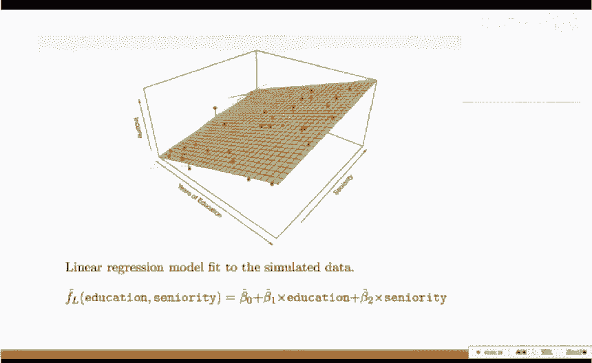

但是底线是这样，底线是底线是你你能够跑起来啊。

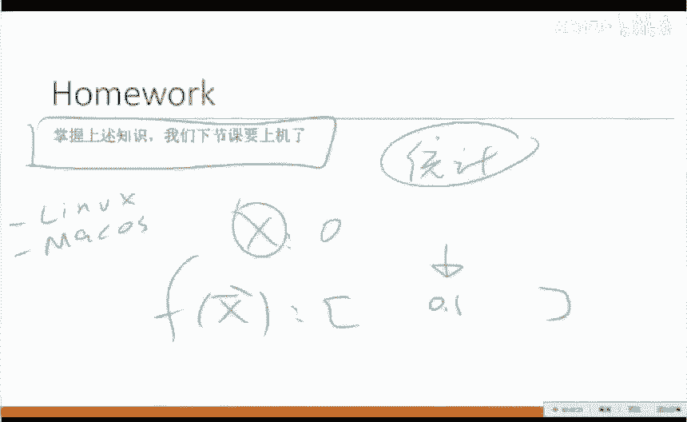

抱歉啊，底线是这样哈。

底线是你能跑起来，Python notebook，然后如果你是windows的话，你更要装安拉空的，因为安达空大带这些东西，就是说如果你是windows，你要干的事情是装一个安达空的。

然后成功的运行起来，Ipad on notebook，然后你能够自如的import，就是能够成功的import sk learn这个包，就你这三件事都能做到的话，嗯嗯我也就不强求了。

OK嗯啊其实没有太大的区别，只不过嗯嗯现在有有一些我担心你们，因为就我担心大家嗯这门课结束之后，一定会去啊，找一些各种各样的一些啊，交易的一些策略来尝试，而目前网上有的这些交易策略，要么它的依赖库啊。

主要是以python2。7来写的，要么是啊这个交易策略本身就是297嗯，就是说会对你日常的生活造来稍许的不便啊，我们上半学期的作业嗯，有就是说大部分的不是说做题。

就是说我们大部分的实验是用notebook来写的，但是我会给大家出一些嗯嗯嗯嗯嗯嗯，就是说嗯到时候要教给我的是表PY，就是说啊Python的这个源码啊，数据库是这样，数据库我下节课会教大家怎么装。

因为下节课上课的时候，我会教大家怎么样的啊，爬爬取数据并存到这个MYSQL里头去，这个不着急，你们预习不要预习那么多了。

那OK我就不再多做要求了，下次上课时间，刚才竹兰好像在群里说到过呃，是嗯10月14号还是几号，嗯啊10月15号好吧，OK啊，终于抓到一个典型问题，如果安装双系统，LINUX系统大概要预留多大的空间啊。

这种问题我刚才说过了，要到论坛上去啊，搞一下今天讲的东西的作用是，如果今天讲的东西啊，你没有听明白的话啊。

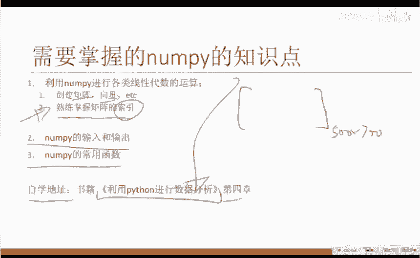

你下节课就就会比较惨，是因为我们下节课就直接的，就要做各种的特征提取和机器学习的东西了，我要说要做一个什么样的模型，你说我操那模型是什么，怎么办，那就没有办法了，小被子啊，所以说今天讲的东西很有用。

因为我下节课的时候，这个项目的量会很大，我会来不及介绍机器学习的嗯一些背景知识，如果我告诉你啊，这个就过拟合了，你说操什么玩意儿，你你你你嗯，对今今天我要我给你打的是理论基础啊。

对嗯小被子一定要复习一下啊，嗯比较担心你啊啊我会我会挑时间啊，我会挑时间放啊，今天学的不够，我我我我我一般很少会啊，每节课的知识很少会让你有一个大的飞跃，就比如说上节课还学加减乘除呢。

这节课你要学积分不会，但是我们要我们有的唯一的飞跃，是我们的这个编程的量会有一定的飞跃啊，啊最后2分钟我说一下双色球的问题哈，这就说明大家还是缺乏一定的统计学的知识的，统计学的知识。

就是说我们提出一个hypothesis，就是说我们认为双色球之间满足一定的规律，你提出来这个hypothesis，然后你就要通过大量的数据来计算一些统计值，来接受他的这个NO hypothesis。

还是accept这个呃呃还是reject这个NO hypothesis，就是你们之前很多年前你们做的这个统计学，假设这个验证干的就是这件事情，你可以你可以，你可以拿这个双色球做一个小实验，你来验证一下。

也就嗯嗯对假设检验对这个词你说的很对，你你可以做一做，蛮蛮有意思的啊，比如说你比如说我比如我给你出道题吧，阿尔法同学啊，比如说你你你可以回去验证一下，这个假设是不是对的，就是说我认为双色球每次啊。

这个6号球出现的概率，比其他的概率有非常明显的嗯不一样，就是说我我认为6号球出现的，比别别的号球出现的要多啊，你请用数据或者说请用统计学的方法来正否，或者说是支持我的这个假设啊。

啊不需要熟练掌握这个模型，我讲这个看盘m model是为了告诉大家，用机器学习的方法来看这个问题，啊啊这请你给我写信啊，嗯好嗯啊不好用啊，说一遍呢，就是因为这个要录下来了，我就不说你问的是谁了。

