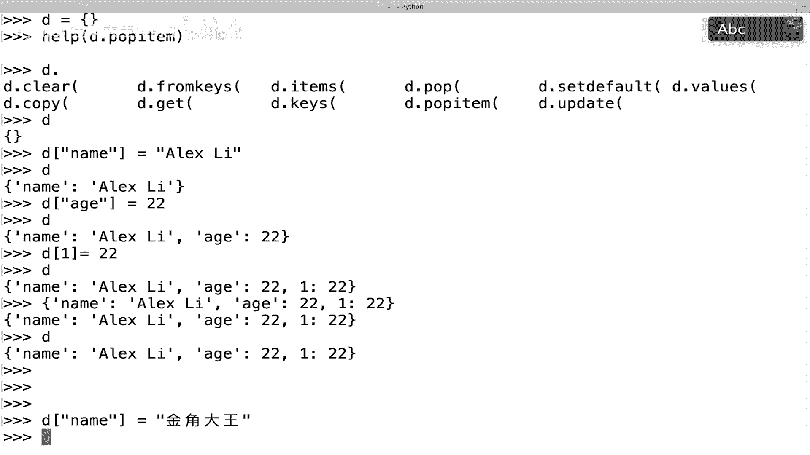
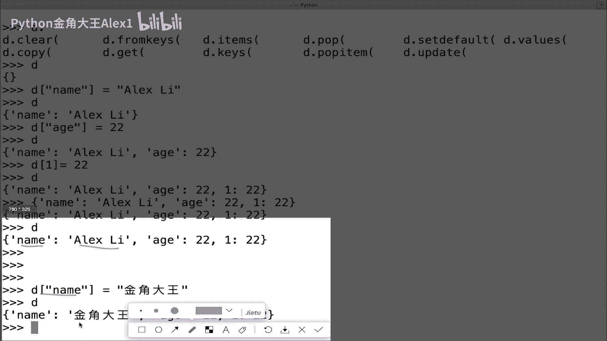
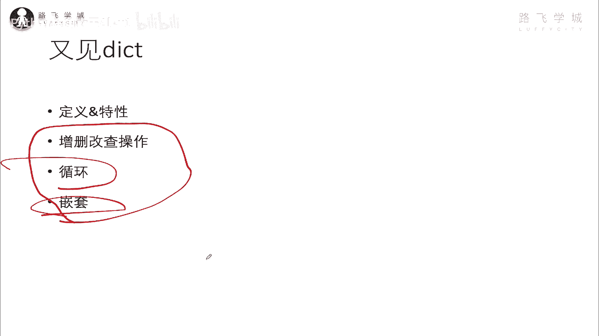

# 【2024年Python】8小时学会Excel数据分析、挖掘、清洗、可视化从入门到项目实战（完整版）学会可做项目 - P34：06 数据类型-字典的各种操作 - Python金角大王Alex1 - BV1gE421V7HF

OK同学们，那这一小节呢我们就学这个字典的增删改查，以及循环和嵌套的操作，好吧，咱们直接切到我们的这个地方，OKOKOKOK在这里啊，在这里在这里先看它的增加的操作，它增加操作很简单，看到没有。

就跟咱们这个列表列表增加一个值是哦，列表增加就是append是吧，那这个字典呢增加一个值，它没有append，它就是人家什么的，直接写一个K名，中括号写K名，看到没有，中括号写K名。

后面就是你的value，可以吧，后面你就是你的value啊，那这个我在在这里给这给大家直接写吧，就是比如说我现在是一个空列表是吧，我现在增加一个值，直接写一个，看到没有，里面就是你的value啊。

这个比如说啊里边就是你的key name，然后ALEX比OK那现在D就有了是吧，那你再增加一个啊，再增加一个，然后啊等一个22，然后呢你这里呃可不可以让数字做K呢，也是可以的啊。

第一等一个随便写了啊是吧，所以你现在有三个K了，注意了，同志们，现在呢你里边有三个值，这就是你的增加，这就是你的增加啊，然后就那么一种方法啊，你就记住这么一种方法就可以了好吗，那如果有同学说了。

如果我在这里加一个值，加的这个值是啊，比如说这个K可能已经存在了，哎sorry怎么过来的啊，可能这个k sorry，可能这个K已经存在了，比如说name我在想重新加一个，加一个name。

再加一个内容对吧，那咱们说了，他这里面只能允许啊，有一个有一个K唯一的K对吧，那你现在又重新加了一个的话，会出现什么情况，同志们看啊，会出现什么情况。

你这时候再看，大家看这发现了一个什么效果呀，你以为你加了一个新的，但其实并不是，他只是把之前的那个name从ALEX，把这个value改成了金角大王。

是不是这意思啊，明白这意思吧，OK所以也就是说增加你增加的时候，增加和修改的方法其实看上去是一样的对吧，只不过呢区别在于你增加的时候，这个列表里它是没有啊，他是没有这个K的。

没有这个HK没有name k你才能增加一个新的，但如果列表里已经有一个name那个K了，你再去这么写，其实是相当于对原来这个就字字典里，这个value的name对应value这个值进行修改OK吗。

所以修改和增加其实是啊，这个写法是完全一样的对吧，写法是完全一样的好吧，OK你看就在这里吗，就是完全一样啊，啊已经在这跟你解释了啊，那好学完这个增加之后，我们再来学这个删除啊，删除的操作有好几种。

一种是pop，一种是delete d e l，这个DL是通用的，在每个数据类型列表啊，字符串里都强调过，然后呢这个就是清空啊，天空当然还会有其他的什么。

有这个你看弟弟还有还有什么pop item这些东西，这个我们现在用不到，我们不讲啊，你就只需要快速记住pop啊，pop这个就可以了，pop和DEL这两种方式就可以了，啊啊那现在我们来删一个。

就是DEL直接用全局的系统，全集的这个直接删这个D下面的一个一，咱就把这个什么呀，是不是给删掉了，对不对，那我们再来上一个D点com啊，pop的话，你在里面你需要输入值，看到没有。

你要指定你要删掉哪个K对吧，假如这个K不存在，这个不KK不存在，它也会报错，报一个什么key error，就是K不存在，那你要确保K存在，就是D点cop，然后输入这个值啊，是name，比如说好吗。

然后这时候你看啊，你你删完之后，它会返回你删掉的这个K对应的value，它会给你返回出来，这个时候是不是就没有了，看这意思吧啊注意了啊，删掉之后他会把删掉在这个key对应的value。

这个值给你返回回来啊，好这个是删除，还有一种就是清空clear是吧，就转全清空了，直接是不是就没有了，哎这个就是字典的删除操作啊，大家自己跟着操作一下啊，那接下来呢这个多一点就是查找的一个操作。

查找也就是取值好吗，取值的话呢他这个hold on hold on hold on，我直接把这个copy过来，后面过来，啊咱们呀呀呀呀，写错了写错了啊，不不不不要管这个，他虽然没报错，但是不要这么写啊。

D等一个哎呀，Sorry sorry，直接copy吧啊DIC是这个，然后呢，同志们，我们想要去取一个值，比如说取这个DIC怎么取呢，取这个ALEX直接写，你就把这个值取出来了吗。

直接写这个K名就把值取出来了，这是取出来，那如果是，如果是我想同时取多个值，可不可以像列表，咱们是不是可以用一个切片的操作，可以同时把中间几个值取出来，是不是这样啊，那字典可不可以呢，我同时取多个值。

比如说把ALEX和黑姑娘一块取出来，也有没有切片的操作呢，我在这里明确的告诉你，没有啊，没有字典，只能一个个的去，没有办法切片的取，好吗啊，没办法切片去啊，那好知道这个之后，我们来看。

那我那那那我要想查，说这个有没有在里面怎么查呢，比如说黑姑娘在不在这个在这个字典里，那是怎么查呢，直接这样name in这个啊，DK就是这个K的值in这个DK看到没有，有的话就返回true。

那有同学说我想查value啊，我想查value，说这个值有没有在这个字典里，那怎么办，对吧，唉，我不想查K，我想查value，NO不能这么长，你要理解字典的这种数据结构是什么。

k value通过K查value，而不是通过value查K，明白吗，就像你查字典一样，你通过索引查这个第多少多少页的数据，而不是说先看到的第多少页的数，第500页的数据。

然后反过来去到这个索引页去看对吧，这个哼它对应的那个索引是哪一，No no no，那就错了，明白吗，一定是正着查，先通过可以查value，而不是通过value查K，所以你那种问法就不成立，明白意思吧。

那有同学说我就是刁钻的，我就想通过，我就想去查value，那没办法了，你只能去循环这个字典，一个一个的去判断FA，这个这个value是不是包含这个对吧，那个value是不是那个耐久效率很低了。

你完全失去了字典它存在的意义，明白这意思吗，好吧，这是查K查一个K在不在字典里，另外下面这三个会给你干DK点，会会会给你产生什么呢，给你咱们都看一下，DK点kiss返回你这个字典，所有的K看到没有。

返回到一个列表的形式里面啊，发现列表形式没所有的K你可以循环这些K啊，循环你直接循环就可以，别说for j k in这个DK点case对吧，然后你直接print k对吧，它是可以直接循环的。

然后呢还有一个DK点values，就是打印所有的values，看到没有，他就把所有的value当做一个列表啊，这样去你依然也是可以循环的好吗，还有一个是DK点atoms哎，这个点items是什么意思呢。

这个再看一下这个item是一个，它变成把一个字典变成一个大的列表，看到把一个字典相当于变成一个大的列表，然后列表里的每一个列表，列表里面好像就是又有每一个元素呢，又是一个小括号。

括起来的小括号其实我大概提过一嘴，就是元组，他跟就你你把它看成是一个列表就行了好吗，你认为它就是一个列表就行了好吧，那所以就是这个这是一个小列表对吧，这一个小列表。

然后就是这一对K和value是一对小列表，然后里面第一个元素是K，第二个元素是value，看到没，他给你转成这种结果，明白这意思吧，转成这种结构了啊，那这种也可以循环它啊，你可以呃。

但这种循环呢你看看for这个for这个，比如说for这个for这个eb in这个DK点items，I sorry，大家看你打印的就是这种格式，是不是你打印的是这种格式，但是其实我告诉你。

你如果想把这个K单独拿出来打印的话，你可以这样，这里我告诉你啊，这个变量我现在咱们一直写循环，都是写一个写一个临时变量，在这是不是注意了，你现在但是它直接是两个值，看到没有，这个小的列表里面它有两个值。

一个是就就它可以有两个元素就对吧，它是有两个元素，你可以在这里直接写KV啊，或者是II1I二都行啊，我随便起的一个是K1个V嘛，我代表这个，所以呢这就是两个变量，那两个变量呢就会循环的时候。

K就代表这个元素，V就代表这个元素，明白这意思吗，你是可以这样写的，如果你有三个元素，你在这里再写一个啊，为什么这都是都是没问题的啊，都是没问题啊，对可以呢，这个顺便就在这里交了啊。

print k v你会发现诶，是不是就单独取到了对吧，单独取到可以单独取到位，OK啊，这是print k v是吧，来看看啊，看我的笔记里有没有记这个东西，是不是在这里在这里你看到没啊，在这里已经写了。

我在这里给你放在这，对吧，KV两个变量好吧，OK同志们，这就是这什么呀，这个这个这个循环items，还是把这个东西给它放到这里吧，啊放在这里好了，那到switch我们的查操作是不是就给大家讲完了。

查操作讲完了之后，接下来给大家讲什么呀，增删改查已经讲完了，给大家讲这个循环循环的方式，其实有好几种，可以直接循环，他的所有的K也可以循环它的这个什么呀，items是吧，KV是不是啊。

循环这两个这种循环也可以没问题，然后还可以直接这样循环啊，并且这里写的是推荐用这种效率速度最快，你直接循环方方就直接是你看啊，你DK在这，我直接for k in这个DK，那不就跟循环列表一样的吗。

那打印一下K这是什么东西啊，大家会发现我在这里打印K它就是循环的话，你这样打印，它只会打印这个K并不会把value打印出来，没有错啊，没有错，你这样情况下它就是这样，相当于就是循环K。

那那说我其实想把value也取出来，怎么办呢，这样啊K然后DK这个可以，这样你就能把这个K和value1块取出来，明白这意思吗，把K和value1块取出来，这个是官方推荐的啊，这个一种取法明白吗。

在这里已经给你列出来了，这是官方推荐的一种想法，那同学就说了，哎那我为什么要这么写呀，我直接我我我我我，我在这里循环的这个K就循环字典，把这个K打印出来，然后再根据K去取这个值。

那我直接在这里什么点items print k v不行吗，都行都可以，但是我告诉你这个效率高，这个效率低，但是具体为什么效率低啊，嗯我大概说一嘴吧，就是咱们items的话，他会把这个什么呀。

把这个字典把这个字典先给你转换成先，是不是先给你先给你转成一个列表啊对吧，先给你转成一个大列表对吧，转成大列表，然后你再去取这个效率，它有转换的过程，效率是很低的，但是像这种的话，像这种的话啊。

这个官方推荐的它不会有什么在转化的过程，它直接就是那先打印1K，然后拿着可以去这个字典里去取这个值就行了，拿着可以去字典里取这个值啊，咱们讲过说，无论你这个字典是有1亿条数据，他去取的话。

速度都跟取一条是一样快的啊，是一样快的，所以你不用担心说啊，我到这里面再去找多方块闹闹闹啊，效率很高的，所以呢这是他推荐的循环方法，明白这意思吗，OK好，那这个循环你也学会了，最后再讲一个知识点。

就是求长度好吗，求长度咱们其实啊求长度，比如说我这个sorry，我这个第四点，我现在是不是有三组数据，三组KV是不是，那但是里边呃我这是因为少嘛，我能肉眼看出来，但是如果里边有1万条是吧。

这个存着1万个学生的或者1万个员工的信息，那我想知道我这里面有多少个员工，多少个员工，你就直接去求长度，length l e n这个方法，LEN这个函数把这个D放进去就行了，他就给你弹出来是三个。

看到没有，你删掉一个就少一个，加一个就增一个好吧，这个LEN是求长度，这个LEN注意了，它是一个系统，就是解释器自带的全局的一个函数，全局的一个函数，那这个函数啊显然是全局的，它不光可以判断字典。

它可以判断列表，可以判断字符串，看到没有，我比如说一个字符串啊，他就给你返回，你是四个字符是吧，四个字符啊，如果是一个原列表，它就会返回有多少个元素啊，那有同学说能不能数字呢，数字不行。

数字没有长度这一块是不是，所以它只能是字符串列表和字典好吗，所以我在这里啊求长度，我要跟你说一下他是这个什么呀啊，叫解释器自带方法自带的函数对吧，是全局的啊，我只是在这里提到了，OK到此为止。

咱们字典的增删改查以及啊循环就讲完了，还有一个啊这个嵌套嵌套没有讲，嵌套其实很简单，比如说我在这里呃，sorry啊，我在这里现在已经是有一个字典，就是就对吧，就是这种key value，然后我再加一层。

我在这里面能不能加一层呢，我直接DIC，然后往里面存一个值，存这个叫啊叫jack是吧，哎，Dc jack，然后呢我在这里给他的value，注意了，我的value，再来一层字典行不行呢，可以的啊。

这个比如说salary是多少呢啊，5000是吧，或者，是25，看到没有，可以的，这个时候哎sorry，这个时候你就形成了看到一个嵌套的字典，嵌套的字典看到没有，这里面是不是又有一个字典呀。

你在这里面甚至还可以再加再加再加，这就是字典的嵌套，嵌多少层，没有限制，没有限制你啊，没有限制你欠多少层，但是也就是说你是可以进行这种嵌套的，但你欠的层次太多了，你再取就不好取，是不是。

那这种时候我要去取这个salary里面的，这个值的话，怎么办，DC然后取到先取到你的K第一层的key jack，是不是啊，然后再取salary，那你就再继续加一个对吧，有的时候会到这里就蒙了啊对吧。

不用蒙，Sorry，不用蒙，是不是就取到他的5000了对吧，写两层就可以了，跟咱们取嵌套列表对吧，就写两个索引是一样的效果，OK啊那这个就是嵌套，到此为止，咱们字典的增删改查都会，也就基本语法都会用了。

那具体是在什么场景下用字典，或者是我在写代码中什么时候用字典，怎么用对吧，哎这个呢我们后面随着后面去不断的学习，你就知道了，然后接下来一会讲一些小练习的时候。

也会用到这个字典。