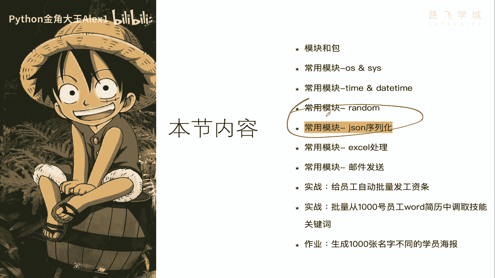
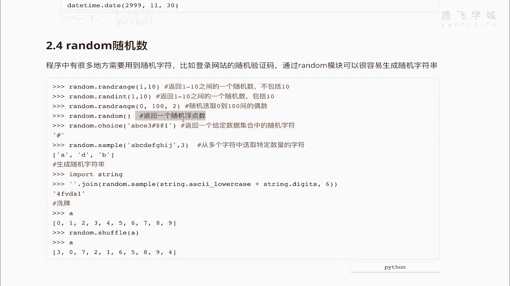
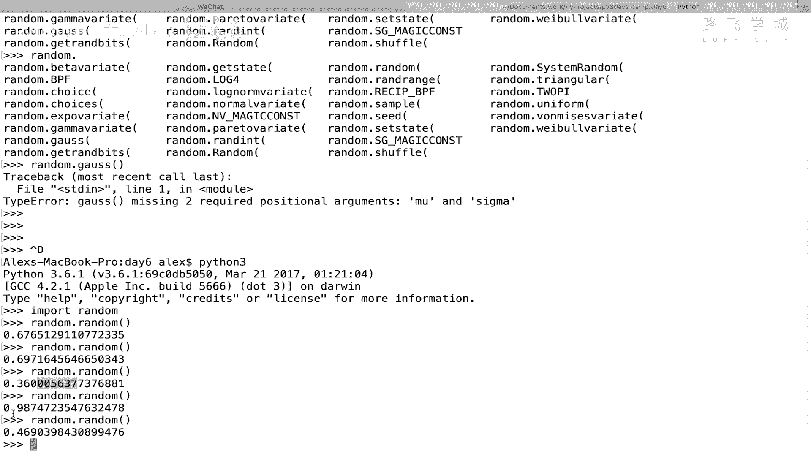
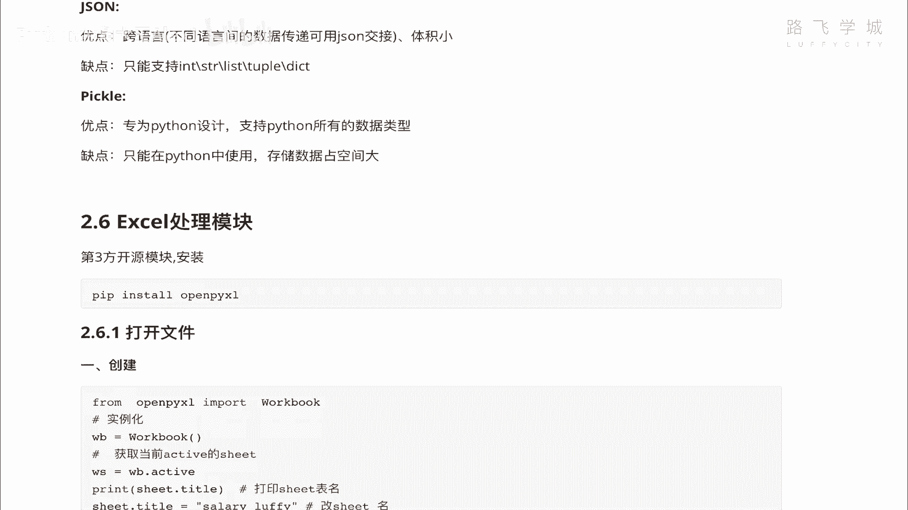

# 【2024年Python】8小时学会Excel数据分析、挖掘、清洗、可视化从入门到项目实战（完整版）学会可做项目 - P75：08 random 随机数模块 - Python金角大王Alex1 - BV1gE421V7HF

OK同学们，这一小节呢咱们来说一下啊，这两个模块，那第一个模块random。

其实我们之前已经讲过了对吧，已经讲过了，再见那个抽奖的程序的时候还是什么程序啊，忘记了啊，那给大家来看一下，咱们再再再来回顾一下吧，呃这个它里面有那么多方法啊，就是生成随机数嘛对吧。

那里面的方法有random range，random range呢返回1~10经验随机数啊，random int呢也是返回1~10之间随机数啊，只不过是上面那个不包括十，这个是包括十啊，就差不多。

然后这个是这是什么呀，哦还可以还可以干嘛，还可以加不长，看完就跟列表一样啊，取之间的偶数啊也是可以的，你可以试一下，然后这个是返回一个随机浮点数。

这个我们并没有试过啊，可以给大家看一下，你看随机浮点数，看到没有啊，random random random都是一些随机的小数。

是小于一的，这种浮点数好吗啊，你可以自己试一下嗯，choice就是对吧，一堆字符串里面它会自动选出来一个值，选出来一个值啊，然后random sample，sample是说。

给一堆字符串里面选出指定的随机几个值对吧，我选出对指定的几个你可以选出来对吧啊，这个炸金花怎么发牌里对吧，50多张牌随机发出来三张牌就可以是吧，那啊另外呢就是什么呀，你可以生成随机字符串啊。

这个string咱们其实也用到过的，看到没有，就是说拿string里面的这个小数额，小写的这个英文字母加上数字拼起来之后啊，给它给它拼起来之后做成random sample，每一次取六个。

再给它装起来对吧，通过这个字符串，然后就变成了这么一个随机字符串，可以做随机密码什么的，是不是还可以加上那个大写字母，和复杂的那个特殊字符啊，特殊字符啊，另外这个呢我忘记有没有讲过了啊，就是洗牌。

洗牌应该应该应该用了吧对吧，就是什么呀，你这有一个列表，然后通过SHUSHUFFLE，shuffle啊，这个呢他就给你给你什么呀，把里面的数据给你打乱了，就洗了次牌好吧。

这其实啊random你会用这些就已经足够了啊，其他里面一些乱七八糟的那些工厂啊，你不用记不用记啊啊就这些就OK好，Random，咱们就给大家快速的将来啊复复习了一遍，过完了。

那接下来这个啊序列化这个模块呢，我其实再三思考，我决定啊在咱们这个集训里不给大家讲，为什么呢，因为啊一讲呢这个又是一个半个多小时啊，至少半个多小时出去了，但是咱们经营的目标是为了让大家快速的入门。

虽然这个模块很重要啊，但是在基础阶段其实是用不到的啊，到后面会用到，所以呢咱们集训营利就不给大家讲，但是我课件其实什么都给大家做好了，都在这做好了，所以我不建议你现在看。

因为咱们的知识点这八天里面其实已经浓缩，就压缩到就已经太多东西了，已经太多东西了哈，就是我这个，这个我我我建议等你集训营结束之后啊，你有兴趣的话，你再回来看这一块，咱们机器人赢是用不到的好吗。

所以呢你就可以直接拿到这个课件，拿这个视频你就跳过啊，跳过不用看，然后咱们直接奔到下一小节，就是excel处理这个模块上，好吧。

