# 少交1元手续费,多赚3.1亿？谁拿了你的股票交易费用？炒股手续费影响有多大？python量化给你答案【量化投资邢不行啊】 - P1 - 量化投资邢不行啊 - BV163qSYuEbm

交易手续费一个看似很少的费用，很多人炒股也从不关心这一毛两毛，但积少成多，手续费可能没有你想的那么微不足道，比如说有这么一个量化策略，他每天都会交一次，从2009年至今。

从初始的一块钱涨到了3万2000多，也就是说翻了3万多倍，年化收益呢高达100%，这样的策略大家看了都会心动吧，但是我要说，但是了这个策略看着很美好，却无法实盘，因为我们在回测的时候。

故意没有计算他的手续费，如果加上的手续费，他的表现就是这样的，虽然最后净值也有800多，但99%的人都不会想，在2017年以后去交易它吧，我们再来算一笔，假如你用1万元去交易这个策略。

没有手续费的情况下，可以轻松赚到3。2个亿，加了手续费呢就只能赚800万，光手续费就交了2000万，比你赚到的还要多，更别提因为手续费影响少赚了几个亿，这个时候你还觉得手续费无足轻重吗，大家好。

我是专注于量化投资的行不行，交易费用和我们炒股的收益息息相关，一般来说啊，交易费用越低，我们的收益就越高，但在日常交流中，我发现很多人啊，他都不知道股票账户的手续费是多少，到底是高是低。

更不用说弄清楚这个费用是怎么构成的，我甚至在面试的时候会抛出这个问题，很多人也答不上来，那么本期视频呢，我们就对交易费用来进行详细的讲解，并且看一下，他对我们交易会产生多么巨大的影响。

首先呢我们讲一下如何去查看你的手续费。

股票账户的手续费啊，不像基金那么公开透明，你可以很方便的查询到。

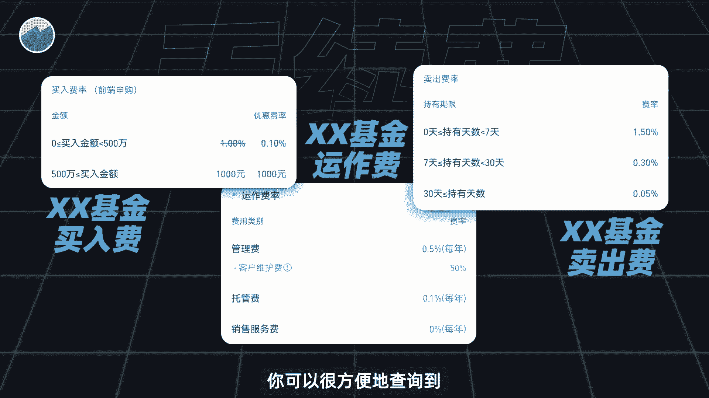

大致方法呢有两种，一个呢是直接找你券商的客户经理去问什么，客户经理，很多人可能从来不知道有客户经理这个存在。

那你其实可以券商电话或者直接去他们营业部，都是可以去询问的，但这样做呢比较耗时耗力。

另一种方法呢也是我推荐的方法，大家可以直接在手机上面用同花顺来查看。

它是一个炒股行情软件，而不是券商，你在同花顺的这个交易页面，选择你的券商，登录你的股票账户之后，点击查询按钮，就可以看到你历史上每笔交易的一个情况，可以看到他具体的金额和费用。

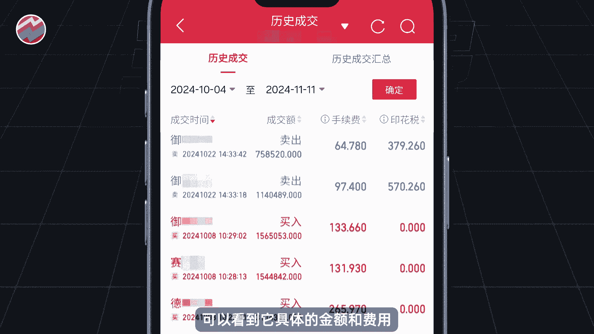

借此我们就可以知道手续费到底是如何构成的，比如说我们看这笔交易啊，它是针对上交所的某只股票，单笔买入的金额呢是499。87万左右，相关的手续费呢是426。89。

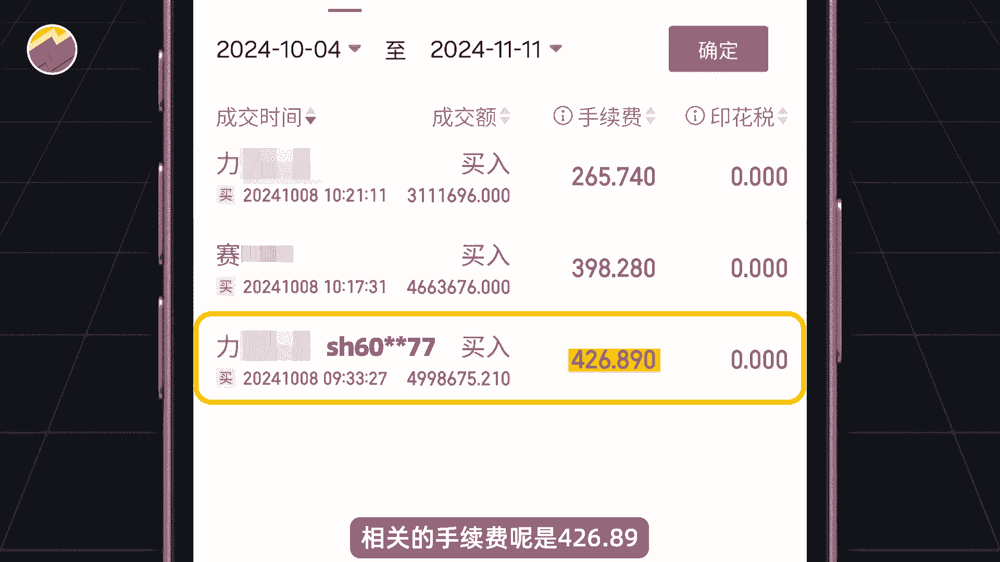

这个钱是怎么算出来的呢，首先呢就是佣金，也就是你交给券商的钱，比如说我在券商的费率是万分之0。754，那么1万块钱就需要交0。754元，那么这499。87万的成交额，也就是376。9元。

除此以外呢还有过户费，他是交给中国结算公司这一家国有机构的，它的费率是万分之0。1，所以算下来呢是49。99元，两项相加呢总共是426。89元，这和我们软件上面显示的是一样的。

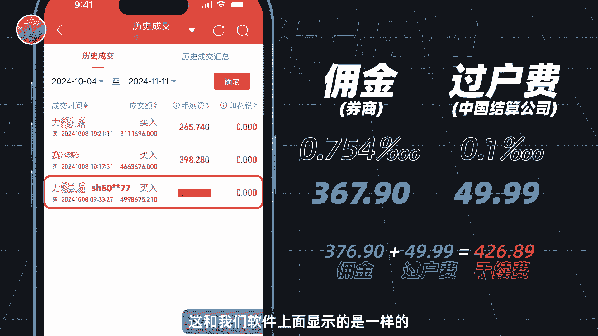

我们再来看看一笔卖出的交易，卖出的金额是144万左右，他的手续费啊是123。12元。

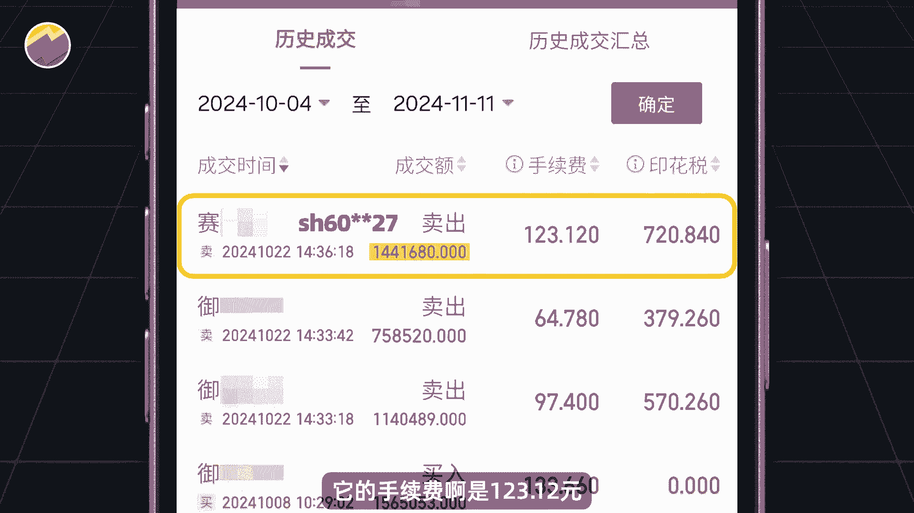

我们还是来看一下这笔交易是如何构成的，首先呢仍然是佣金和买入一样啊，卖出也是需要收佣金的，同样是万分之0。754，收了108。7元，过户费呢也是同样的万分之0。1，也就是14。42元，不同的是啊。

在卖出股票的时候呢，会额外收取印花税，一笔额外的税收，它的费率呢是1‰，去年啊降到了万分之五，所以卖出一百四十十四万的万分之五呢。

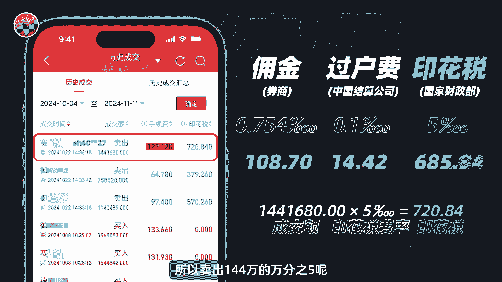

就要交720多，和前面的费率相加就是843。9元，显著的比我们刚刚买入的费用要贵很多啊，所以你知道为什么卖出时候的费用，会比买入高那么多了吧，就是因为有印花税的存在。

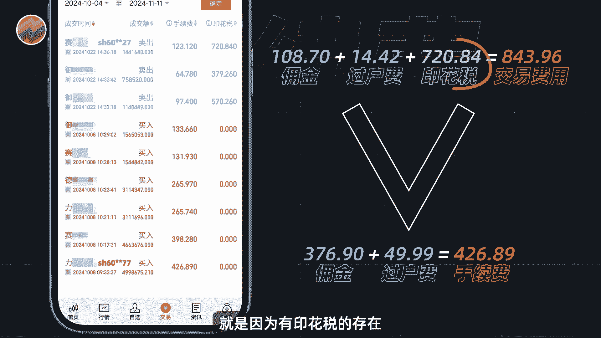

说实话这是挺贵的一笔，但我们股民也可以骄傲的说，003以及后面的004005建造，有我们一半的功劳，至于另一半当然还得是烟草，归正传，这次我们就介绍完了，上交所买卖股票手续费的构成，再来看一下深交所。

其实呢很多人不知道的是，它和上交所是有略微差别的，虽然按照我们这笔156万的交易来说，万分之0。754的券商佣金，和万分之0。1的过户费，对应了118。01元和15。65元，加起来也就是133。66元。

但其实本质上真实的过户费，是包含在佣金里面的，不像护士会额外再收一笔，所以我们这笔交收取的手续费呢，是按照0。854来计算的，当然啊现在券商为了方便，他会直接告诉我们，他给的手续费就是万分之0。

8554，但本质上呢其实是沪市，他的佣金是万分之0。754，我们额外再交万分之0。1的过户费，而绅士呢他的佣金是万分之0。854，有一点点微小的区别。

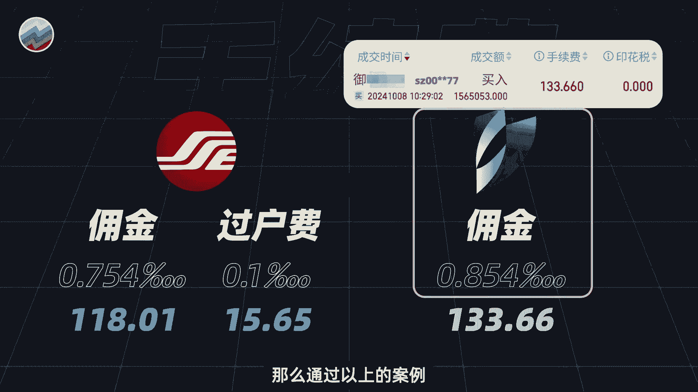

那么通过以上的案例，你应该就可以大致知道，交易手续费是如何构成的了，你也可以自己打开同花顺去算一下，看能不能对得上，或者你也可以用自己的手续费和交易金额，去反推出你证券账户的佣金到底是多少。

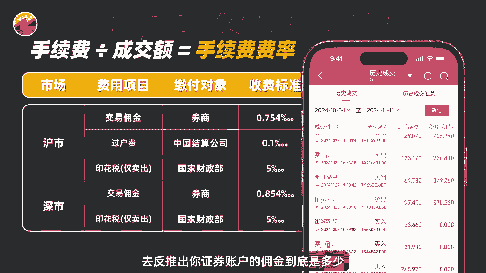

如果你算上来，发现你的佣金是万分之2。5以上，甚至千分之几以上。

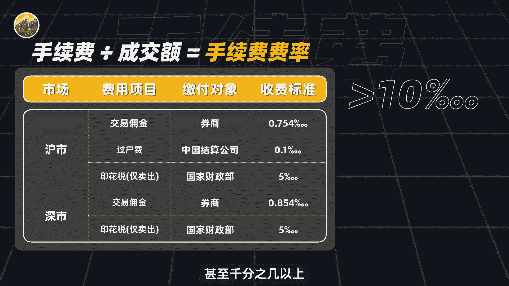

那么恭喜你，你被你的券商坑了，赶紧去商量一下，降低你的佣金吧。

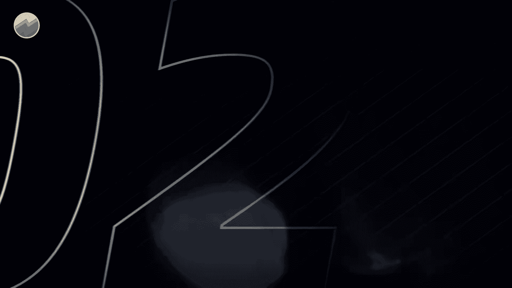

之前的案例中，我们粗略的讲了一下佣金，过户费和印花税，接下来我们详细的看一下他们的构成，首先来看过户费啊，在深圳交易所呢这笔费用已经包含在佣金当中，在上海的交易所呢则是单独收取的。

他在买和卖的时候都需要收费，由中国证券登记结算公司收取，原先的费率是万分之0。2，在24年4月的时候呢，下调过一次，现在呢只要万分之0。1，这个中国结算呢是一家国有机构，是专门登记你股票账户信息的。

它对我们股票交易的主要作用呢是有这些，说实话就是帮你记账的这么多股票分别属于谁，总归得有一个中心化的机构，就像房产登记所一样，帮你记录产权信息，所以呢他从交易中额外收取费用，也是有一定道理的。

另外呢就是印花，他的费率是万分之五，虽然呢仅在卖出的时候有印花税，但这个却是我们交易费用的一个大头。

24年的1月到9月，我们A股股民总共交了712亿，大家可能没什么概念，我们可以看另外一组数据，23年全年累计的印花税呢是1800亿，占全国总税收的1%，而且呢在23年的8月啊，降低到了现在的万分之五。

不然23年的印花税整体会更多，所以啊我们常说炒股也是为国家做贡献。

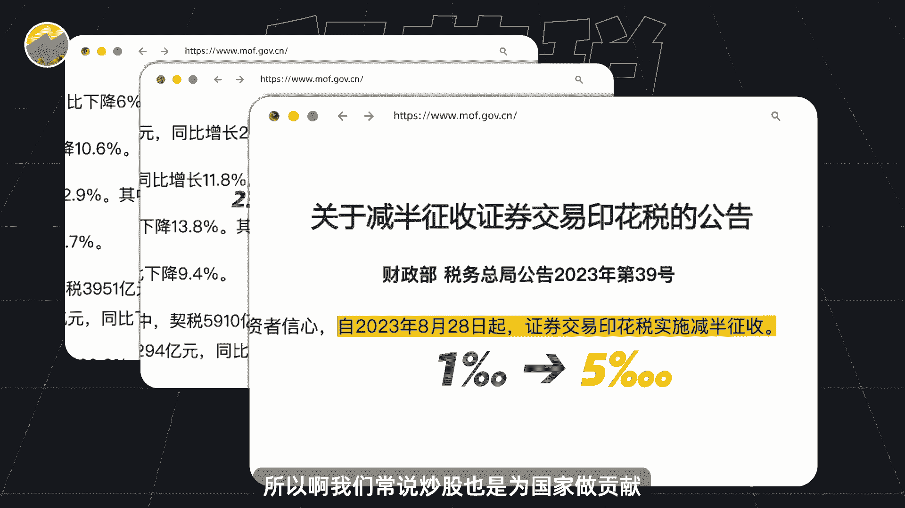

这个话是一点都不假的，然后呢前面说过的过户费和印花税。

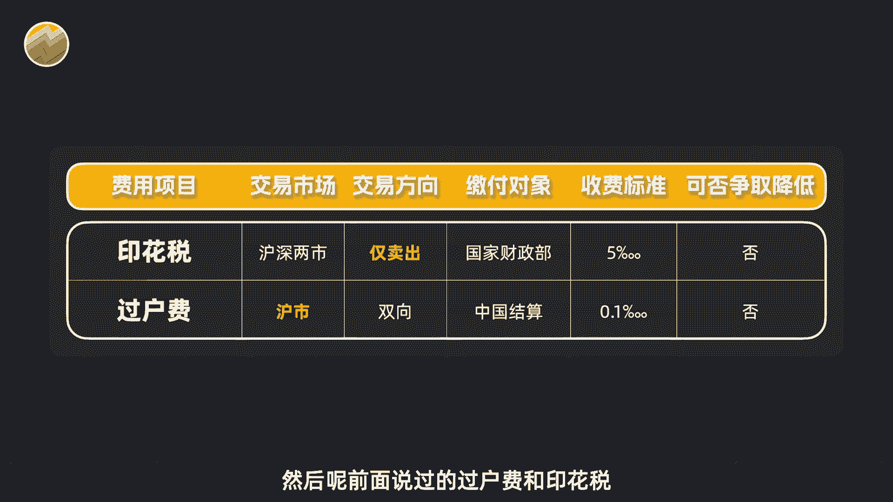

本质上是国家收的变动呢全靠政策，所以我们想要降低自己的交易费用，最关键的还是要降低券商的佣金，接下来我们就看看一下券商佣金的具体构成，它是否还有降低的可能性。

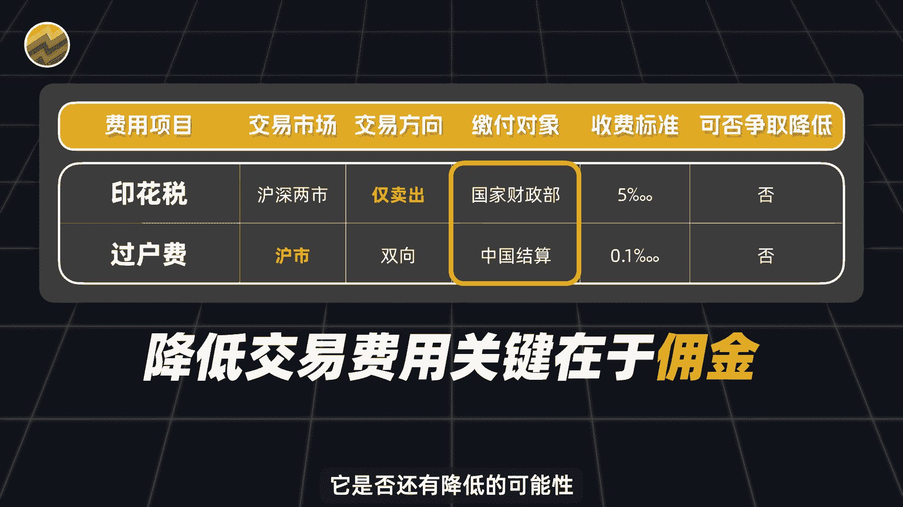

券商佣金啊，就是你交给券商的钱，买卖双向都是要收取的，他的收费标准呢并不统一，市场上最高的是收钱三，并且每笔交易呢最低要收五块钱，现在普通股民去券商开户呢，不管是线上还是线下，佣金。

一般会默认在万分之2。5左右，2。5%当中呢有万分之0。1啊，是前面说的过户费，万分之0。2，是证监会收取的证管费，还有万分之0。341是交易所收取的经手费，这些费用都是交易的必需费用，总共是万分之0。

641，扣除上述费用之后呢，剩下来的钱就是券商的收入，以万分之2。5的佣金来计算的话，在深市还有万分之1。859的利润空间，毕竟人家也是要赚钱的嘛，如果按照我自己账户的手续费来计算呢。

券商的利润就会少很很多，也就只有万分之0。213，所以啊赶紧去算一算，你自己的交易佣金是多少，一般高于万分之一呢，都可以尝试着自己去和券商客户经理沟通，让他来帮你降低交易佣金，实在不行的话。

换一个低佣金的券商开户就可以了，因为他们服务本质上没有什么差，如果以后经手费过户费这些费用再次降低，你完全可以去和券商申请降佣金，这是在保障你自己的权利啊，不然券商就只能含泪赚走这部分钱了。

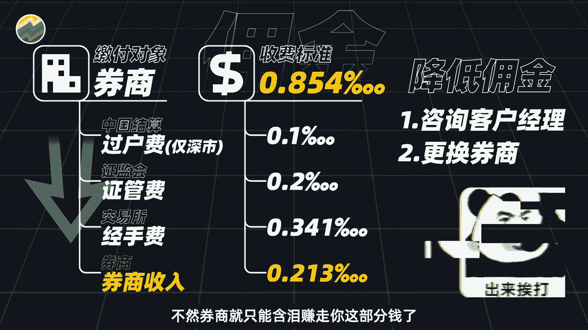

也别觉得不好意思啊，觉得手续费就那么几毛钱，不至于专门去调，下面呢我们就带大家一起去看一下，不同手续费对策略的收益影响到底有多大，我们先从最基础的量化选股策略开始。

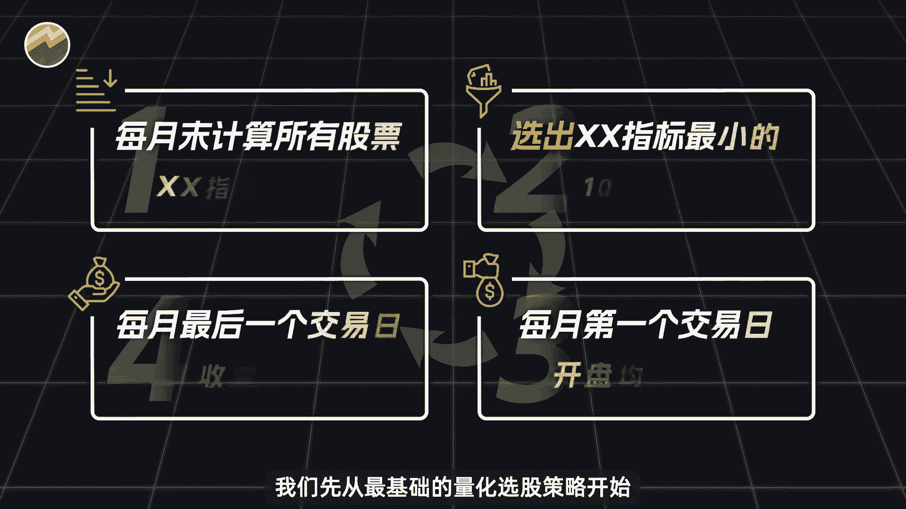

他会每个月交一次策略回测，用到的代码和数据呢已经帮大家准备好了，你只要运行一下代码，就可以得到策略的表现，如果你需要这个代码和数据的话，可以加屏幕右下角或者置顶评论区。

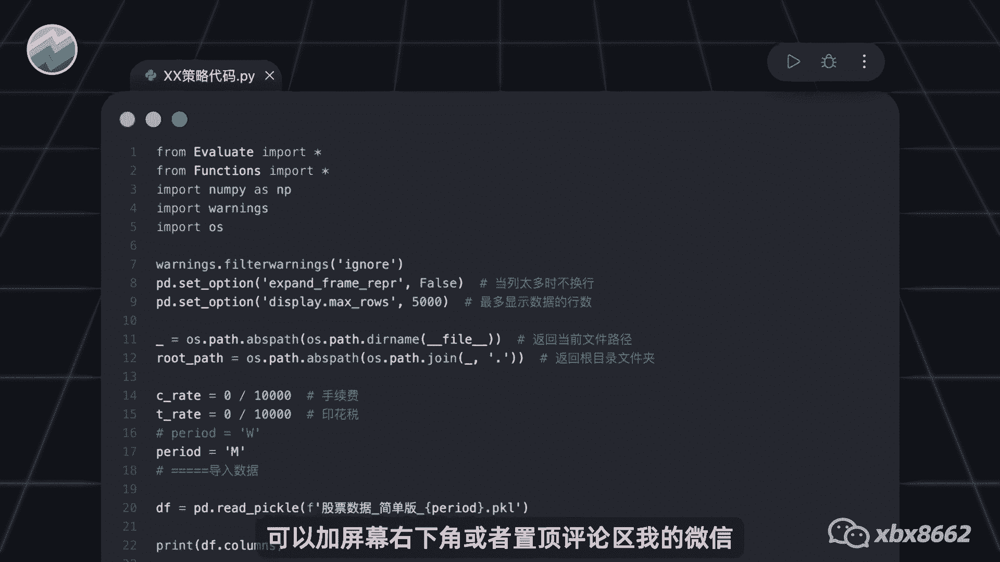

我的微信都是可以直接免费发给你的，如果没有手续费呢，这个策略的表现是这个样子的，整体啊可以翻200多倍。

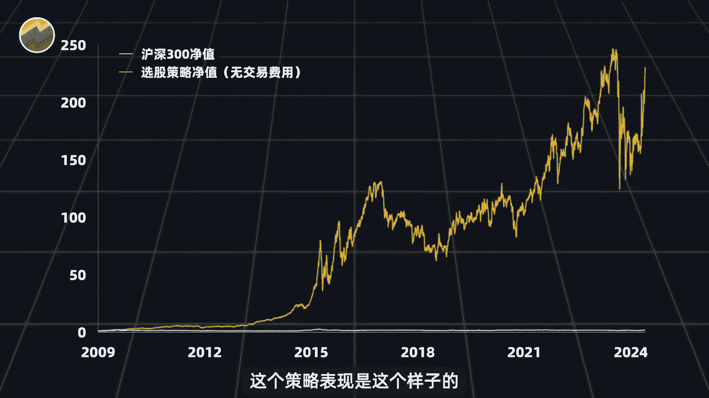

年化收益呢是40%，我们把手续费呢设定成万分之一。

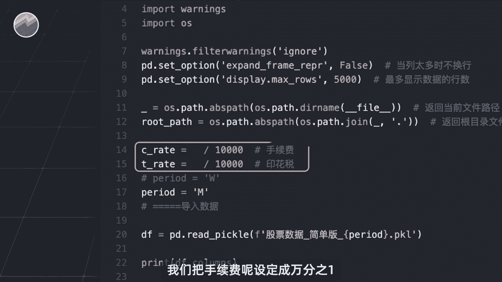

加上印花税，再运行一下程序，结果就会变成这个样子，代表策略的橙色曲线呢，从初始的一块钱涨到182。7，远远跑赢代表大盘的沪深300指数，年化收益是38。86%。

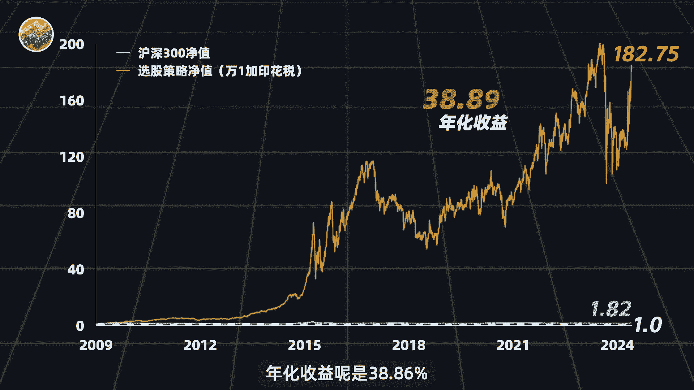

然后呢，我们再把策略的手续费啊，调成为常规的万分之2。5，甚至还能调到一些机构常用的万分之五的费用。

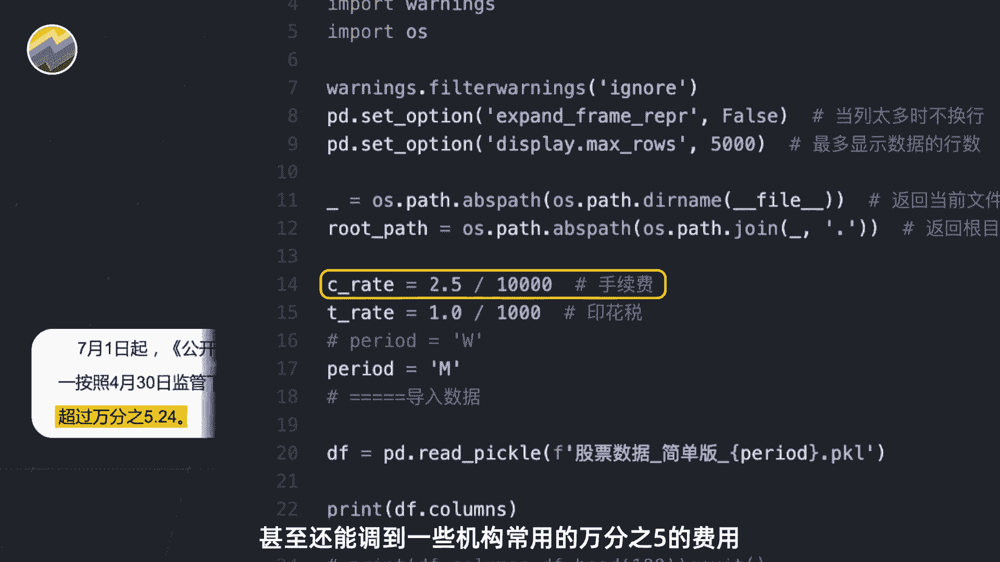

在运行代码计算呢，他们的表现分别如图所示，最直观的是，随着手续费的增加，年化收益开始下滑，最大回撤则逐渐升高，这也是正常的，但总的来看，其实影响并没有很大，因为我们这个策略本身交易频率不是很高。

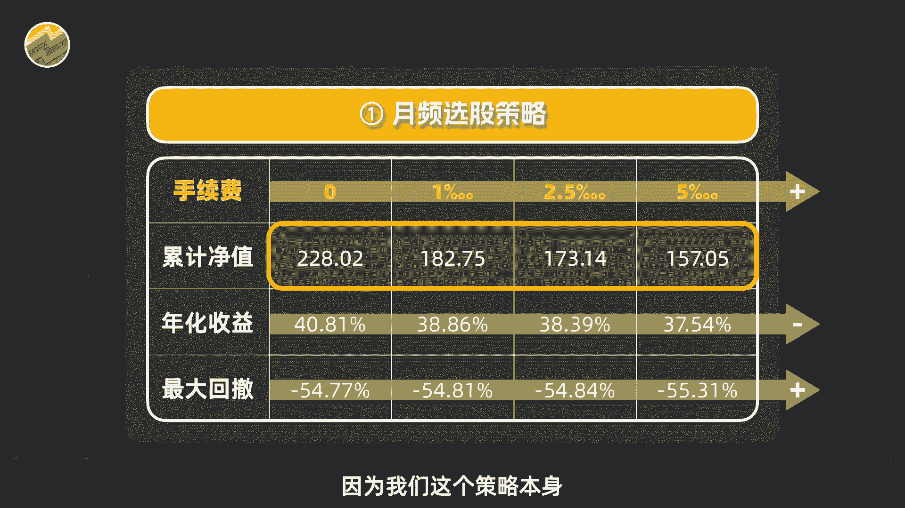

一个月才交易一次，那我们如果修改一下策略的交易条件，把它从每个月交一次，改成每周去交一次，结果会如何呢，要做这样的计算也很简单啊。

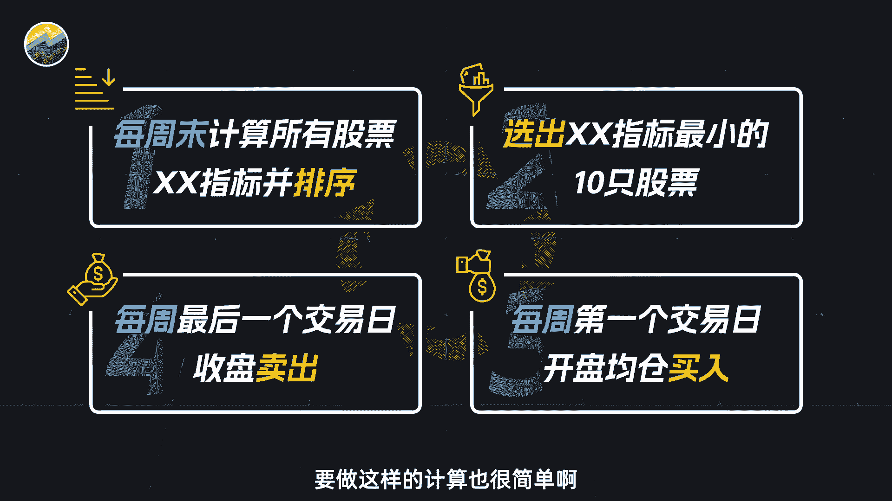

只需要我们拿代码稍作修改，并且我们的程序还能帮你计算出，一共花了多少手续费，我们就假设初始有10万块钱资金去交易。

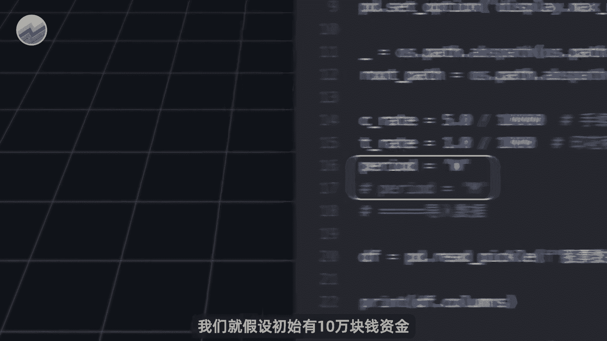

这个策略，结果呢如图所示，首先可以发现啊，周平的策略表现会比乐评更好一点，但手续费也相对更高，仅仅是万一的费率之下，你就会产生1675万的交易费用，比你的本金还多了100多倍，这是一个极其庞大的数字啊。

另外但看上去万分之五的手续费，也就比万一的手续费多交了100多万。

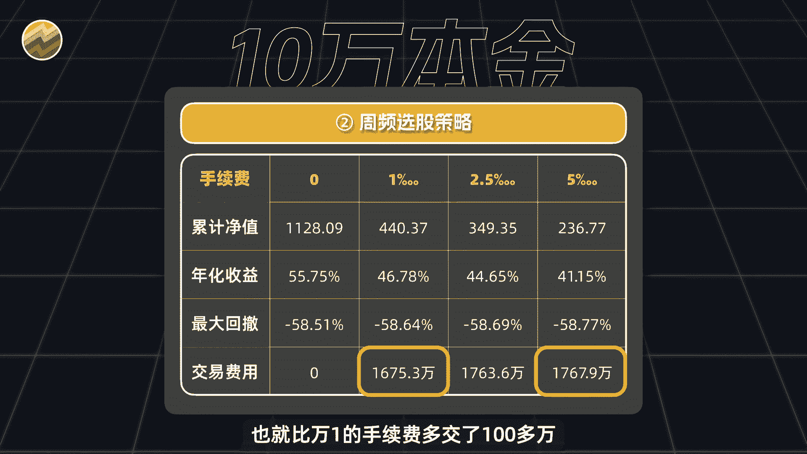

但实际的影响却不止于此，你要知道你每次多交一点手续费，能参与到策略中产生收益的资金就会少一点。

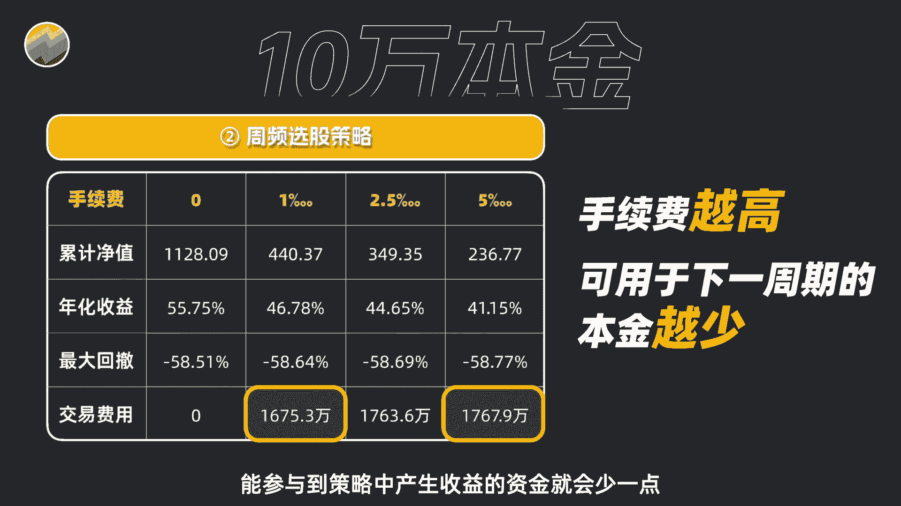

日积月累下来，这个差距会越来越大，直到最后更是差了2000多万，这个时候我们可以发现啊，手续费越高，对策略收影响也就越大，交易越频繁。

手续费的影响也会越大，最后我们找一个每天都会交易的策略，给大家看看，手续费不同能造成多大的差异，这个策略呢，每天都会拿出1/3的仓位去进行交易，也就平均来说三天换一次仓。

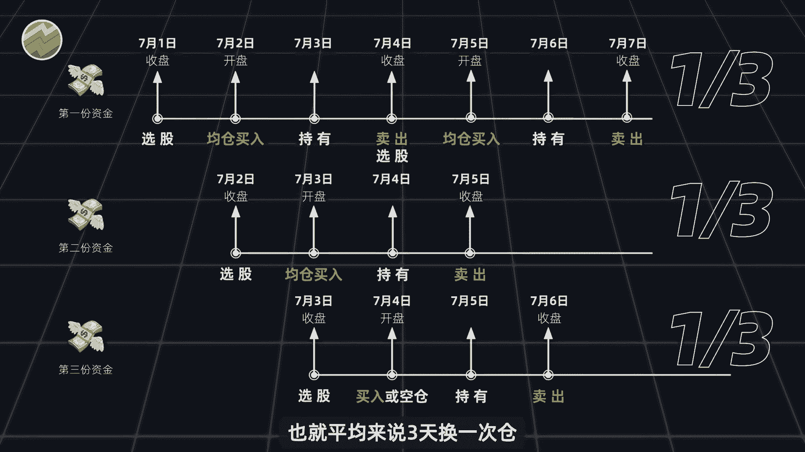

策略的数据和代码呢，我也帮大家准备好了，你只需要拿到资料后，根据教程去做，就能成功运行代码，如果你对相关资料感兴趣的话，可以加屏幕下角或者置顶评论区。

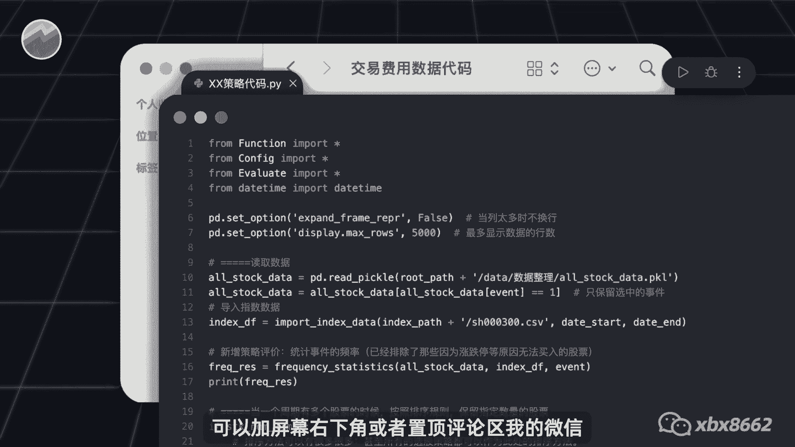

我的微信都是可以直接免费发给你的，我们这里呢就直接运行程序，在万一的手续费下，策略的表现还是比较不错的，从初始的一块钱涨到85块，年化收益的28。46%，但当手续费逐渐增加啊。

同一个策略表现差异就越来越大了，万五的手续费率下，策略净值甚至不及万一手续费下的一半。

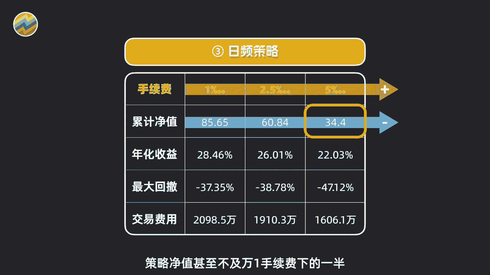

想象一下，如果你用10万块来交易这个策略，按照万一的手续费计算，你最后还有856万，看起来还不错，但作为一个每天都交易的策略，他的手续费更为惊人，高达2000多万，远比你赚的更多。

所以对于喜欢频繁交的人来说，如果没有一个好的策略，那他日积月中，交易费用会达到一个非常惊人的数字，我们接着看万二。5的手续费产生的交易费用，比万一时候的是1900多万，看似好像少交了180万，好像赚了。

但最终策略呢却少赚了248万，这是因为这个策略交易费用更高，导致了他本金积累的速度，比不上手续费更低的策略，所以产生的交易费用并不一定会更高，而如果你是更早之前开户的账号，手续费还是万五的话。

甚至会少赚500多万，这样你还能接受吗，还会觉得频繁交易产生不了多少手续费吗。

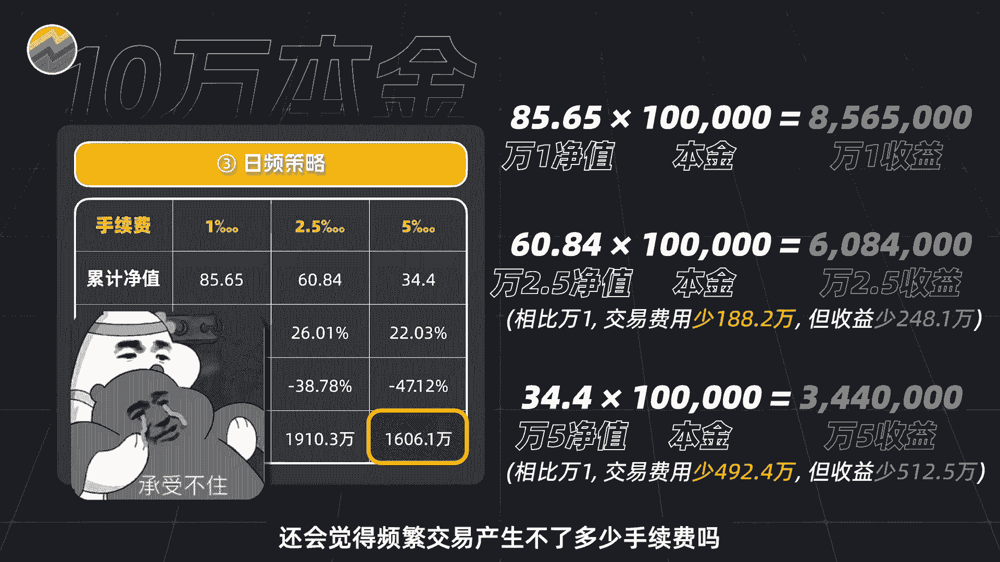

还会认为账户的手续费是无关紧要的吗，好交易手续费呢我们就讲到这里，我们把讲过的交易费用的构成，重新整理成了一张图，你完全可以通过这张图去了解交易费用的明细，第一块是印花税，卖出收万分之五。

是交给国家财税部门的，过户费是万分之零点，一只在沪市单独收取佣金，双向收取，主要是交给券商的，其中有一部分是要交证管费和经手费的，分别是给证监会和交易所，深市的过户，它是包含在佣金里面的。

最后剩余的呢就是券商的收入，那么这个就是我们交易费用的一个完整的明细，很多能知道印花税佣金和过户费，但可能不知道佣金里面还有证管费和经手费，说实话我自己之前也是不知道的好，那么看完本期视频。

你还不赶快行动去联系你的券商，调整你的手续费吗。

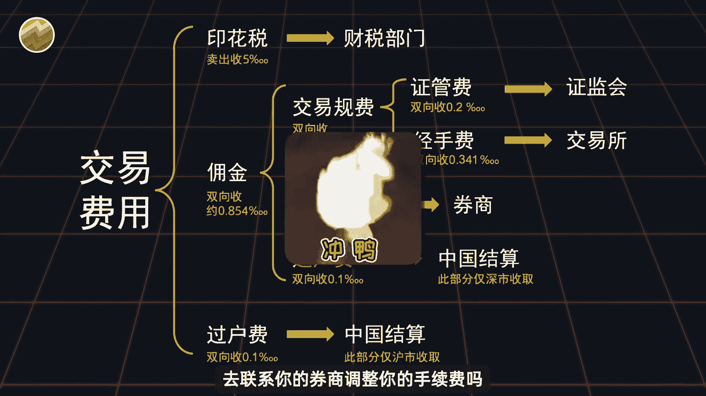

那么本期视频就到此结束，非常感谢大家的点赞收藏和三连支持。