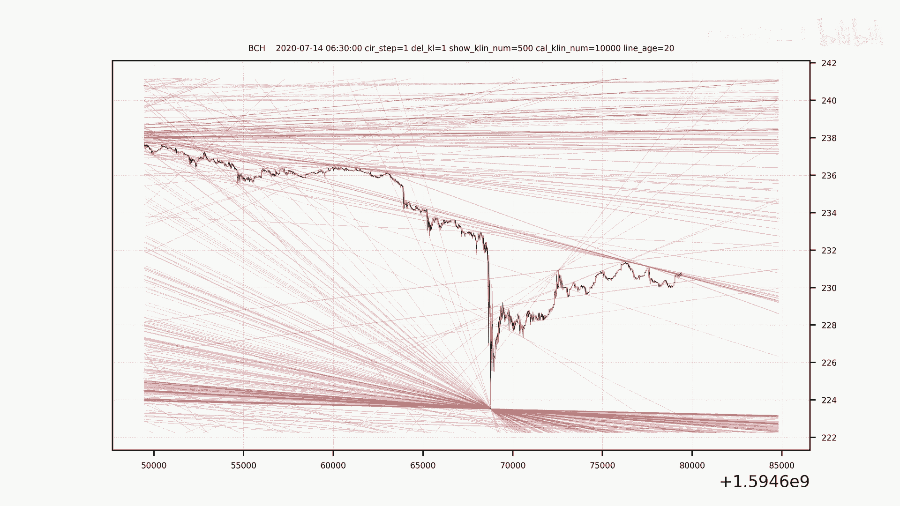
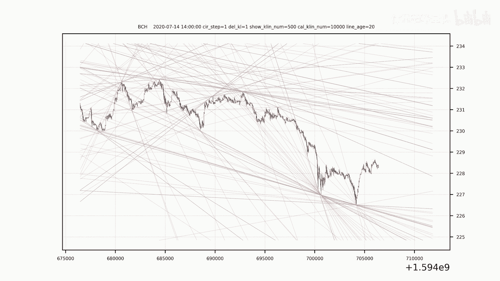

# 市场趋势解析：量化交易如何实现精准预测？ - P1 - 体重趋势量化 - BV12M4m1C7km

🎼。🎼。🎼，🎼，🎼一？🎼き？🎼，🎼，🎼The。🎼。🎼，🎼，🎼，🎼。🎼，🎼，🎼，🎼，🎼。

🎼，🎼，🎼，🎼，🎼，🎼，🎼，🎼，🎼，🎼。🎼。

🎼，🎼。🎼。🎼In。いう。🎼，🎼一？🎼き？🎼。🎼，🎼，🎼，🎼。🎼，🎼，🎼，🎼。🎼，🎼，🎼，🎼。🎼，🎼う。🎼，🎼。🎼，🎼，🎼。🎼，🎼，🎼，🎼，🎼。🎼，Yeah。🎼。🎼。🎼，🎼。🎼一？🎼一？🎼き？🎼，🎼。

🎼，🎼，🎼，🎼，🎼，🎼。🎼。🎼，🎼。🎼い。