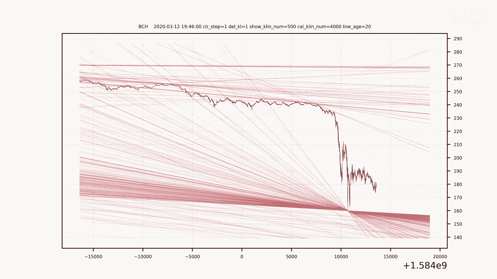
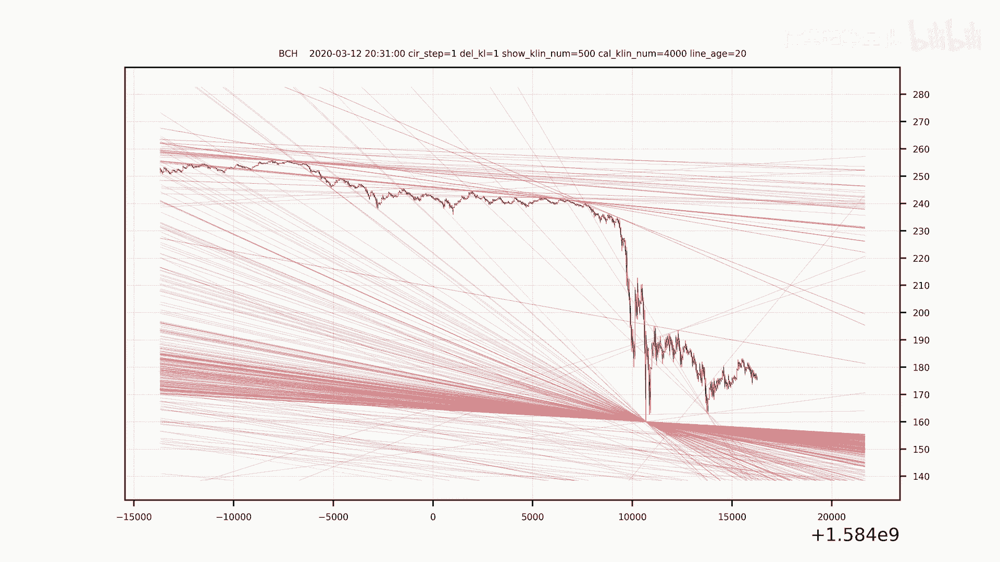
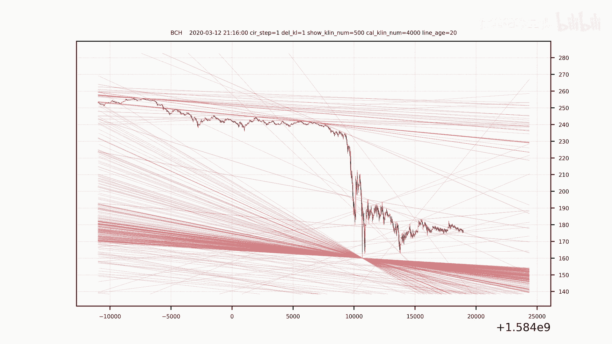
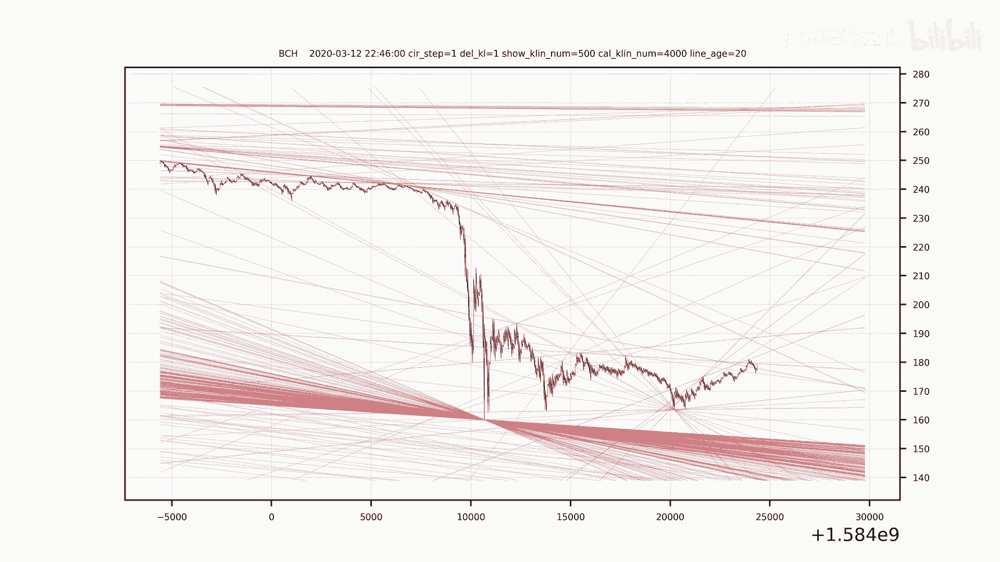
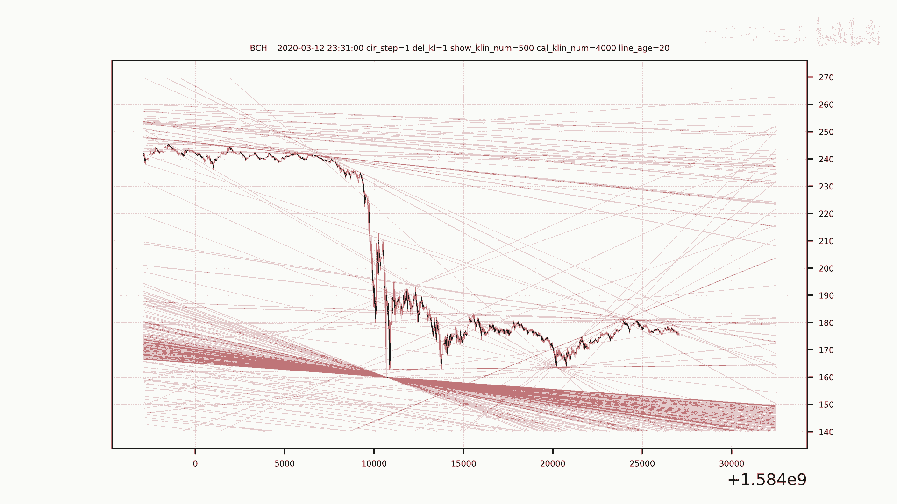
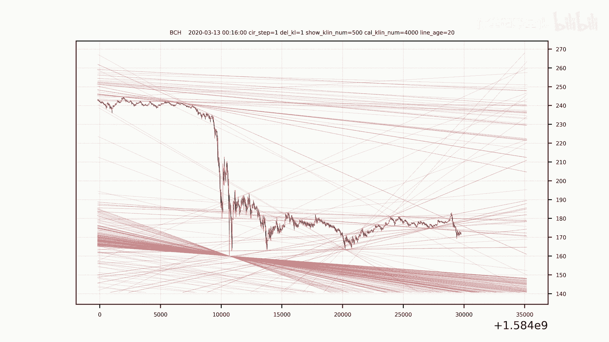
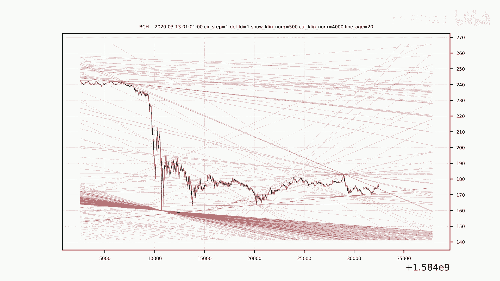
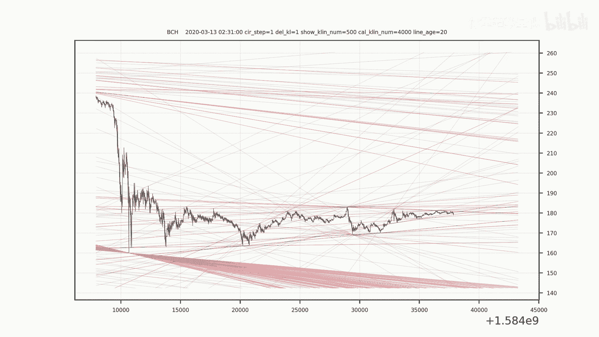
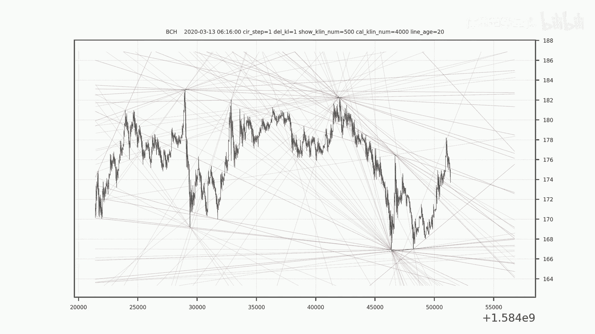
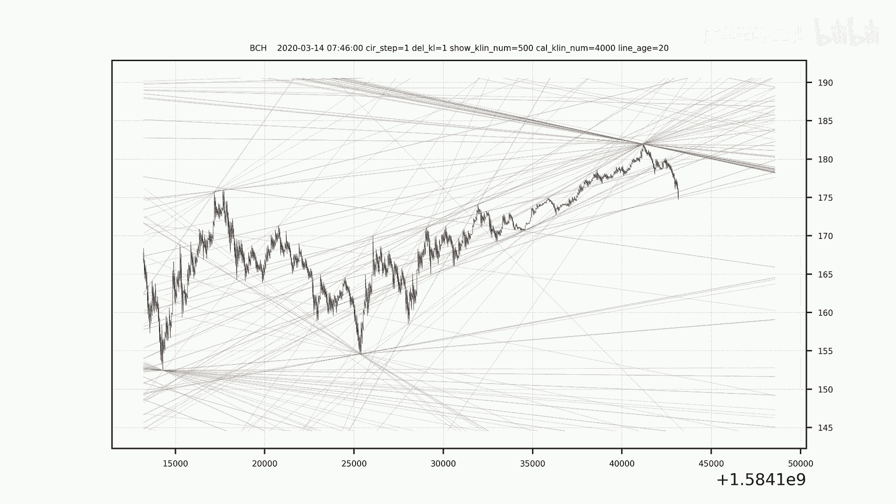

# 市场趋势解析：量化交易如何实现精准预测？ - P1 - 体重趋势量化 - BV1yE421u7yA

🎼。🎼。🎼。🎼The，🎼，🎼一？🎼あ。

🎼。

🎼。

🎼。

🎼，🎼。

🎼。🎼，🎼。🎼Yeah。🎼。

🎼。🎼，🎼，🎼，🎼，🎼，🎼，🎼，🎼。🎼，🎼，🎼，🎼，🎼。🎼。🎼，🎼In。🎼。🎼一？🎼き？🎼あ。🎼，🎼，🎼，🎼，🎼，🎼，🎼。

🎼。🎼，🎼。🎼，🎼。🎼，🎼Yeah。🎼，🎼，🎼，🎼。🎼，🎼，🎼。🎼，🎼，🎼。🎼，🎼，🎼。🎼た？🎼。🎼，🎼。🎼き？🎼The。🎼。🎼，🎼。🎼The。🎼，🎼。🎼，🎼。🎼，🎼，🎼，🎼。🎼，🎼，🎼，🎼。🎼。🎼。

🎼，🎼，🎼，🎼。🎼，🎼。🎼，🎼。🎼。🎼The，い。🎼。🎼ぴ？🎼，🎼，🎼。🎼，🎼，🎼，🎼。🎼，🎼。🎼，🎼，🎼，🎼，🎼，🎼，🎼The。🎼，🎼，🎼。🎼，🎼。🎼，🎼。🎼，🎼。🎼。🎼。🎼，🎼た？🎼。🎼き？🎼，🎼。

🎼The。🎼，🎼，🎼，🎼，🎼。🎼，🎼。🎼，🎼，🎼，🎼。🎼う。🎼。🎼，🎼。🎼，🎼，🎼。🎼。🎼，🎼，🎼，🎼。🎼，🎼，🎼。🎼，🎼。🎼。🎼，🎼た。🎼。🎼き？🎼あ。🎼，🎼。🎼The。🎼，🎼，🎼，🎼，🎼。🎼。🎼。

🎼。🎼，🎼，🎼，🎼。🎼，🎼，🎼，🎼，🎼，🎼，🎼，🎼，🎼，🎼。🎼。🎼。🎼。🎼。🎼。🎼。🎼The，🎼うん。🎼。🎼き？🎼Yeah。🎼，🎼The。🎼The。🎼嗯。🎼い。🎼。🎼，🎼。🎼，🎼，🎼，🎼，🎼The。🎼。

🎼，🎼，🎼，🎼，🎼，🎼。🎼，🎼，🎼，🎼，🎼。🎼，🎼，🎼。🎼。🎼，🎼うん。🎼，🎼一？🎼い？🎼，🎼The。🎼The。🎼，🎼，🎼うん。🎼，🎼，🎼，🎼。🎼，🎼，🎼，🎼，🎼，🎼The。🎼，🎼，🎼。🎼，🎼，🎼う。

🎼，🎼，🎼，🎼，🎼。🎼，🎼。🎼，🎼。🎼。🎼，🎼いん。🎼，🎼一？🎼い？🎼，🎼。🎼。🎼The。🎼The。🎼。🎼，🎼，🎼，🎼，🎼，🎼。🎼，🎼，🎼，🎼，🎼。🎼，🎼，🎼，🎼，🎼。🎼，🎼The。🎼。🎼。🎼。🎼B。

🎼。🎼一？🎼き？🎼，🎼The。🎼The。🎼，🎼，🎼。🎼，🎼。🎼，🎼The。🎼The。🎼，🎼，🎼。