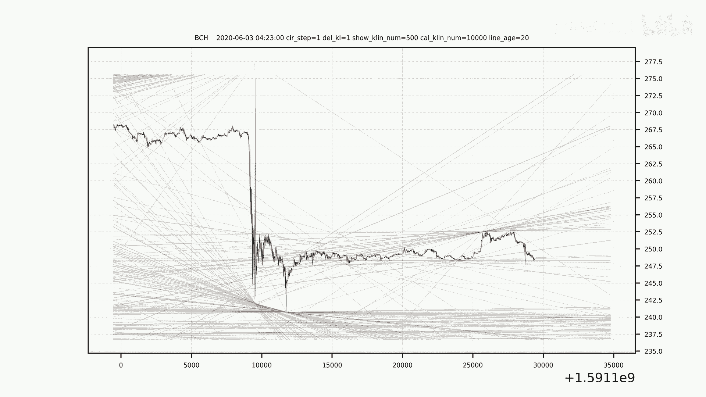
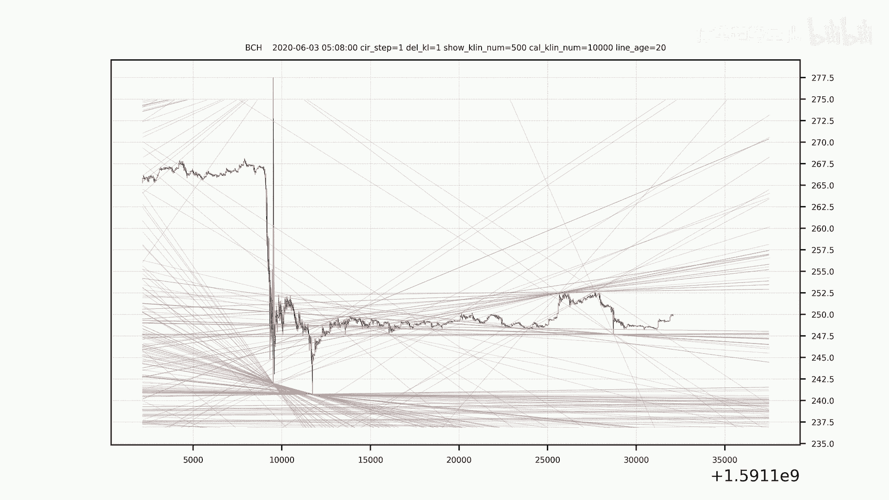
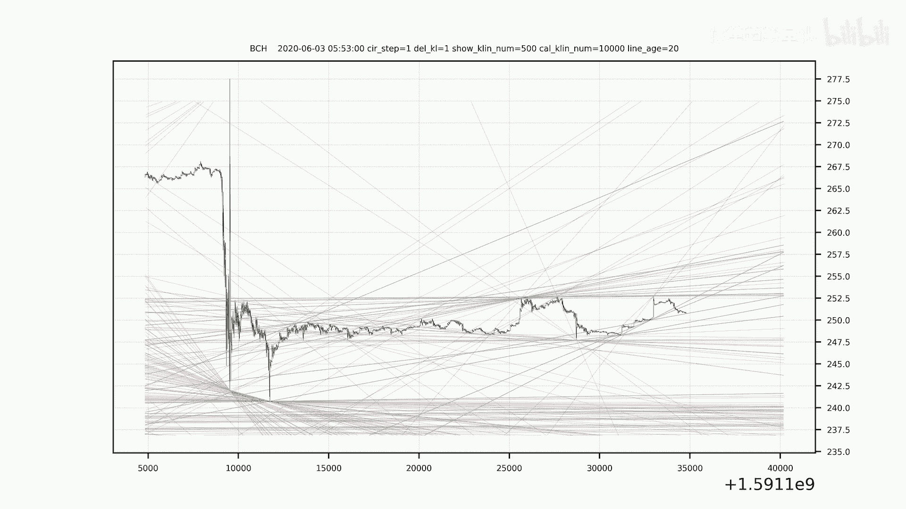
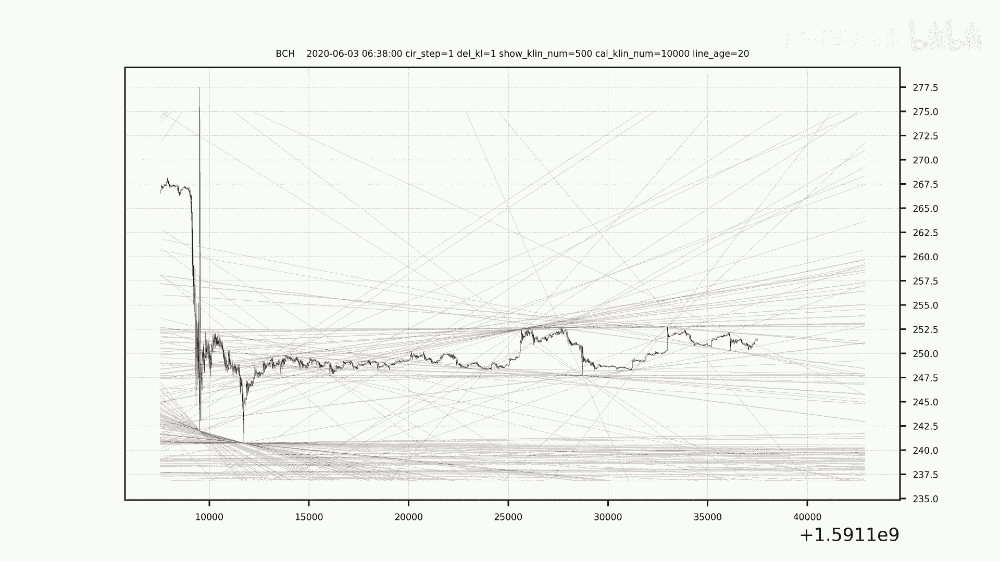
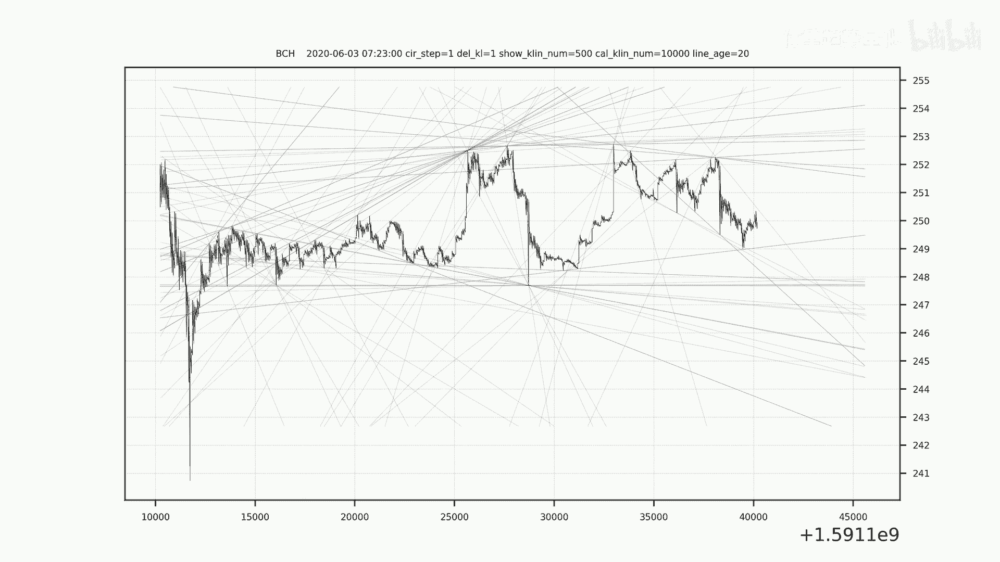
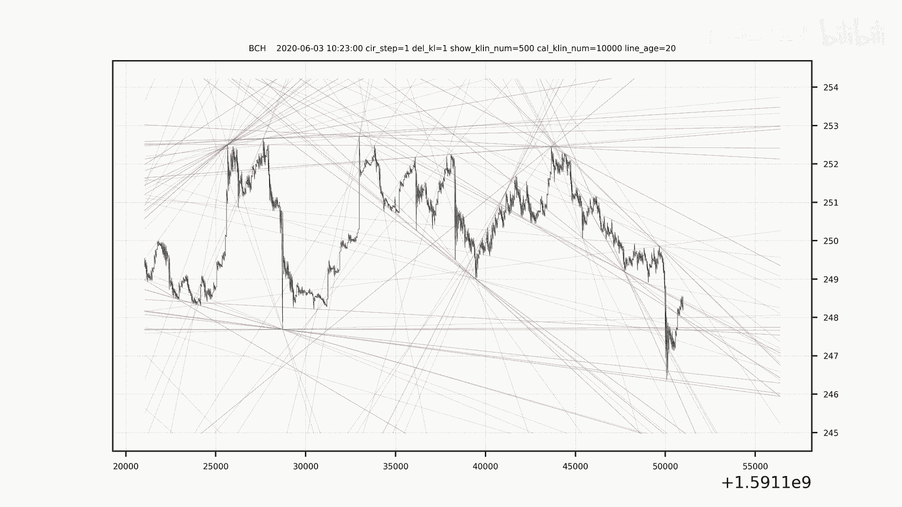
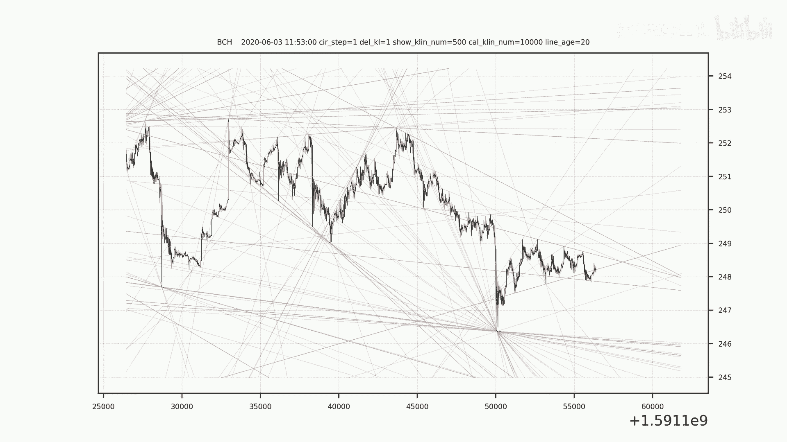

# 市场趋势解析：量化交易如何实现精准预测？ - P1 - 体重趋势量化 - BV1Pi421y7Aa

🎼。🎼。🎼The。🎼，🎼一？🎼い？🎼，🎼，🎼，🎼，🎼。🎼。🎼，🎼。🎼，🎼The。🎼，🎼。🎼，🎼，🎼，🎼，🎼，🎼，🎼，🎼，🎼，🎼。🎼，🎼。🎼。🎼B。い。🎼。🎼？🎼。🎼，🎼。🎼The。🎼，🎼，🎼，🎼，🎼。

🎼，🎼。🎼，🎼。🎼。

🎼。

🎼The。🎼，🎼，🎼，🎼，🎼，🎼。

🎼，🎼，🎼，🎼。

🎼。🎼。

，🎼。🎼あ。🎼。🎼，🎼。🎼い？🎼一？🎼き？🎼，🎼，🎼，🎼，🎼，🎼，🎼。🎼，🎼，🎼，🎼The。🎼，🎼。