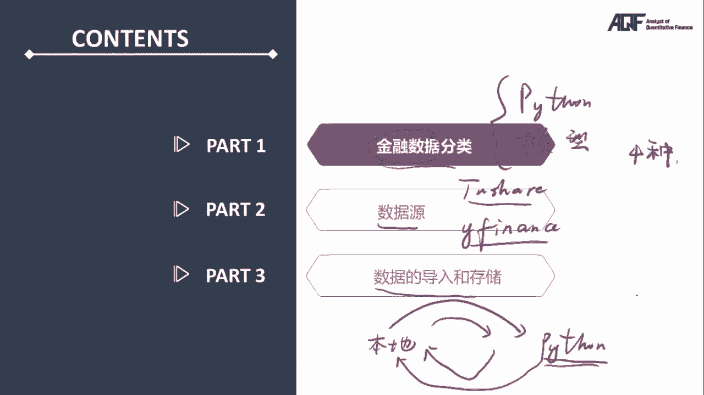

# 2024年金融大神老师讲解量化金融分析师.AQF—量化金融基础知识（完整版课程） - P26：+威❤hhh427501  了解获取全套课程《Python金融数据分析基础》01.金融数据分类 - 量化沿前 - BV1ar421K7Mo

好各位同学大家好，接下来将由我带领大家学习，金融数据源及基本处理这个章节，我是王梦涵老师。

本章节呢主要分成了三个部分，第一个部分金融数据的分类，量化交易的主要研究对象肯定就是金融数据了，那不同类型的金融数据，它所对应的Python处理代码肯定是不一样的，肯定是有区别的。

另外呢在真正研究过程中，对应的肯定是不同的分析模型，所以当你手上有一批金融数据，你在进行研究之前，肯定是要先对这些数据属于什么样的类型，进行一个简单的判断，那这个部分呢，我会介绍四种比较重要的分类方式。

第二个部分数据源，这里面会介绍两个特别重要的工具包，一个呢是to share，用来下载A股数据的，另外一个呢是WIFI用来下载美股数据的，这两个工具包呢当然都是免费的，第三个部分数据的导入和存储。

我们在量化交易研究的时候，肯定是有一些数据啊，这个数据不管你是在网络上面下载过来的，还是从本地上存储的，我们肯定是要先把这些数据导入到我们的Python，研究环境之内，导入到Python的研究环境。

你才能用Python的代码去进行处理，对不对，然后呢我们肯定有一系列的处理方式，最后分析出来一个结果，那这个结果可能是一一个啊，表格可能是一些数据，那这些数据你肯定要保存起来。

那么我们要把这些结果的数据，从Python的研究环境保存起来，保存到一般会保存到本地，这样是一个完整的研究流程，我们可以看到，首先我们会把数据导入到Python的研究环境之内，然后再把结果保存到本地。

这样的一个过程就对应着数据的导入和存储，这个是第三部分的内容，我们接下来先学习一下第一部分。

金融数据的分类，这一个部分，在了解具体的分类方式之前呢，首先我们要弄清楚，为什么要对金融数据进行分类，在实际研究的过程中，我们会发现，不同的数据其实它的区别还是比较大的，这里面列了三个比较重要的区别。

第一点是不同的数据包含的信息是不同的，这一点比较容易理解啊，如果我们现在有某只股票，他的日K线数据，那这个数据包含的是什么信息啊，肯定包含的是行情的信息，如果你有财务报表的数据呢。

那包含的肯定是一个公司财务相关的信息了，这是第一点，不同的数据包含的信息是不同的，第二点，不同的数据分析的工具和模型也是不一样的，刚刚我们提到了日K线，这是属于行情的数据，它是有行情的信息。

那你如果对日K线进行研究和分析，很有可能用到什么工具啊，很有可能用到的是技术指标，那技术指标其实是属于比较简单的数学模型了，如果你对一个公司的估值进行研究呢，肯定用到的是估值的模型。

这对说明不同的数据唉，分析的工具和模型肯定是不一样的，第三点，不同的数据处理的程序编写逻辑是不一样的，刚刚我们说的还是日K线，那日K线我们在Python里面很有可能是一个data frame。

data frame类似一个表格，那这个表格容不容易处理啊，大家都知道这个表格其实是很有规律的，这个格式非常清晰，很有可能他是一这里第一列是日期，后面呢是高开低收，这个价格还有可能有交易量。

拿一个表格进行处理，其实是非常容易去编写对应的程序的，但是如果你要对新闻，假如说这是一个新闻，这是一些文字，对这样一个新闻进行处理的话呢，你就发现编写程序就会非常复杂了，基于以上这几点。

导致了我们在分析的时候呢，首先要知道我们要研究什么样的规律，你要你是想研究行情的规律啊，还是想对估值进行研究啊，你要知道你要研究的规律是什么样的，然后呢你要去选择合适的数据。

这样的数据要包含包含你想要研究的那个规律，所需要的信息之后呢，我们再选择合适的分析模型，分析工具，再编写对应的程序和代码去进行研究和分析，所以最开始我们要知道数据，它大概是什么样的类型。

然后才能够和我们研究的那个规律更好的匹配，然后才能够设计出后续的程序编写的代码，选择合适的模型去进行分析，这就是我们进行金融数据呃分类的一个目的，那接下来我们看具体的分类方式，这里面呢。

我们主要介绍四种比较重要的分类方式，我们分别将金融数据分成了行情，数据和非行情数据，实时数据和历史数据，原始数据和经处理数据，结构化数据和非结构化数据这四种分类方式，那不同的分类方式之下呢。

我们肯定也将金融数据分成了不一样的类型，那不一样类型的金融数据，在代码编写分析的模型选择上，肯定都有一些注意的点，那这些点呢我们在具体的讲解过程中，肯定会给大家讲明白，那我们先来看一下呃。

第一种分类方式，将金融数据分成了行情数据和非行情数据，什么是行情数据啊，行情数据呢其实就是和研究的标记，它的成交相关的数据，成交相关的，比如说威明医药这一支股票，它当前的成交价是26块九毛五。

这是一个价格，另外呢我们在日K线这里也可以看到，这有成交的量，交易量，价格和数量，这都是和成交直接相关的数据，这些呢我们都把它称为行情数据，和行情数据不一样的，其他的这些数据我们都把它归类成非行情数据。

比如说我们对某一只股票还是一样，为民医药这支股票，他的财务状况基本状况进行研究的时候，会形成一个研究的报告，这样一个研究报告其实也是属于一类的数据，那这些数据呢都是属于非行情数据。

因为这些数据都不是和成交直接相关的，这样我们按照是否和交易标的的成交直接相关，将金融数据分成了行情数据和非行情数据，那么接下来呢我们来看一下在研究分析过程中，行情数据和非行情数据有什么区别。

对于行情数据来说呢，如果我们在编写研究和分析的Python代码的时候，我比较建议啊大家使用data frame这种数据类型，为什么呢，因为data frame长得非常像一个表格。

对于初学者来说一个表格啊，因为excel大家都比较常用，这个表格就非常容易理解了，假如你现在保存的是某一只股票日K线的数据，那你这一个data frame第一列就是日期之后呢，是高开低收。

还有成交量这样的一些数据了，如果你想提取其中某一天的数据，直接用到lock或者i lock方法直接去提取就可以了，非常容易操作，也非常容易理解，那如果你是对非行情数据里面，假如说有这样一条新闻。

你对这条新闻进行处理怎么处理啊，首先你肯定会把它储存成字符串，对不对，然后呢才会去进行其他的处理，这里我们就发现对于行情数据来说，我们可以把它保存成data frame啊。

这个也是我自己比较建议大家保存成data frame的，然后非行情数据呢，你可能用到的就是其他的一些数据类型了，这就是行情数据和非行情数据，它们第一个区别就是，我们在编写Python的代码的时候。

其实会有比较大的区别，你要注意一下用到什么样的数据类型比较合适，那第二个区别呢是，如果行情数据我们进行研究分析的时候，可能会进行一些计算，这里先说做一个比较简单的计算。

我们可能会去计算5日的均线怎么计算啊，用到点rolling，五点M这样的一个方法，计算出来的就是5日的均线，前面也提到了，5日均线这种技术指标，其实都是属于比较简单的数学模型，那这样的数学模型。

你能不能直接用到这样的一个字符串上去，进行分析啊，这个新闻上进行分析啊，肯定是不行的，对于这样的一个新闻进行研究和分析，你肯定用到的是自然语言处理，这样的模型，这个时候你就发现对于行情数据来说呢。

我们研究过程中，很有可能用到的是一些数学模型，而非行情数据呢，你可能又要用到其他的一些模型，去进行研究和分析，这就是第二点，分析的模型其实是不同的，好这里我们就知道了。

行情数据和非行情数据比较大的区别有两点，一个呢是我们要编写Python代码进行处理的时候，要选择合适的数据类型和系合适的处理代码，另外分析的模型也要选择比较合适，比如说行情数据也要用数学模型会比较多。

而非行情数据呢，对应的要选择相应的合适的处理的模型，这就是第一种分类方式，我们将金融数据分成了行情数据和非行情数据，那接下来我们看第二种分类方式，我们将金融数据分成了实时数据和历史数据。

这里我们还是举行情数据的例子啊，行情数据的例子，还是看未名医药这只股票的价格，当前呢有一个成交价26块七毛七，这是当前的成交价，当前的成交价对应的是现在这个时间点，现在这个时间点对应的一个价格。

这当然就是实时数据，它是实时更新的，在盘中它是不断的变动的，但是如果我们观察这一支股票它的分时图的话，前面的这一段时间也会有很多的成交价，那么这些成交价呢，都是属于过去的一段时间的数据了。

那这些过去时间的数据都是属于历史的数据，所以将数据区分成实时数据和历史数据，其实也比较容易，就是看他是不是现在当前在当前的，就是实时数据，它是实时更新的，如果是过去一段时间呢，它就属于历史数据了。

这就是第二种分类方式，之后，我们将金融数据分成了实时数据和历史数据，两种不同的数据类型，那同样这两种不同的数据类型，在使用的时候也会有比较大的区别，接下来我们看一下它们的区别到底是什么样的。

还是举一个例子，假如说你现在有一个数据获取的需求，你想要获取某一只股票，假如说这支股票当天的走势是这个样子的，每一只股票当天每隔一小时，它的成交价，那这样的一个成交价是什么样呢，你肯定会在09：

30分获得第一个价格，在10：30分呢获得第二个价格，11。30分，第三个以此类推，一共六个数据，这样的一个数据需求，你可以通过实时数据去满足，当然你也可以通过历史数据去满足。

在编写对应的Python代码的时候，区别其实就体现出来了，我们先来看一下实时数据，如果编写这样的一个Python代码，如何去满足这样的一个数据需求，实时数据前面也提到了。

是当前这一个时间点对应的一个数据，所以如果你编写一个Python代码，去满足每隔一小时获得一个成交价的数据需求，肯定是在09：30分执行，第一次获取数据的操作，要注意啊，是获取数据的操作，09：

30分执行第一次获取数据的操作，10：30分执行第二次获取数据的操作之后，以此类推，获取数据的操作一共执行了几次啊，一共执行了六次，因为有六个价格，但是问题就出现了实时数据。

Python的这样的一个代码，它一共执行了几次呢，获取数据的代码是执行了六次，那你可能在09：30分运行一次Python的代码，去获取一次数据，然后到了10。30分，再手动去执行一次Python的代码。

去获取一个数据吗，肯定是不可能的，那你编写Python代码肯定是包含着一个功能，是对时间进行监控的，当时间到了09：30分的时候，它会执行一次获取数据的操作，当时间到了10：30分的时候。

它会执行第二次获取数据的操作，大家有没有感觉，首先这一个Python代码它是持续运行的，持续运行你肯定要想到while循环，除此之外呢，当什么什么条件满足的时候获取一次操作，那对应的肯定是if条件语句。

对不对，要有这样的感觉啊，不过呢通过这样的一个介绍的过程，你就发现，如果是通过实时数据满足这样的一个数据需求，对应的Python代码肯定是一个循环，而且循环里面会有条件语句，它会比较复杂。

但是呢如果我们通过历史数据来获取，相应的这个数据呢，其实就会比较简单，前面也提到历史数据是过去时间的数据，那我想要获得历史的数据，肯定是要在之后的一个时间点，假如说我们在四点钟获取了历史数据。

历史数据获取的时候呢，给的是一个data frame，这一个data frame它包含了几条数据啊，前面说了六条数据，也就是六行，每一行里面第一行，比如说他是9。30分，然后呢还包含了一个成交价。

比如说是十元，一共六条数据，这还有个10：30分等等，那获取历史数据这个操作执行了几次呢，其实执行一次就够了，一次就可以获得这样的一个data frame，当然后面我们也会介绍到。

其实我们可以通过to share里面get k data，这样的一个函数，直接在里面说明你想要获取数据的起始时间，这里面是09：30，终止时间是下午三点，数据频率是一小时。

它就可以自动返回一个data frame，这一个data frame里面就会包含，你所需要的这样的一个数据，通过刚刚的对比呢，就发现，获取实时数据对应的Python代码其实是比较复杂的。

而获取历史数据的对应的Python代码是比较简单的，当然我们后续的课程里面呢，也主要是通过获取历史数据，这样的方式来进行后续的研究，因为确实比较简单，我们的研究重点在数据的研究分析上，而不是数据获取上。

不过呢我们也会单独抽出一个章节，对如何编写一个Python代码，Python系统获取实时数据，并且将实时数据保存到数据库里，这样的一个Python代码，Python系统也会进行详细的介绍。

会介绍他如何进行设计，如何进行实践，这就是第二种分类方式啊，第二种分类方式，我们将金融数据分成了实时数据和历史数据，实时数据处理起来比较复杂，而历史数据处理起来稍微容易一些好。

那接下来我们看第三种分类方式。

