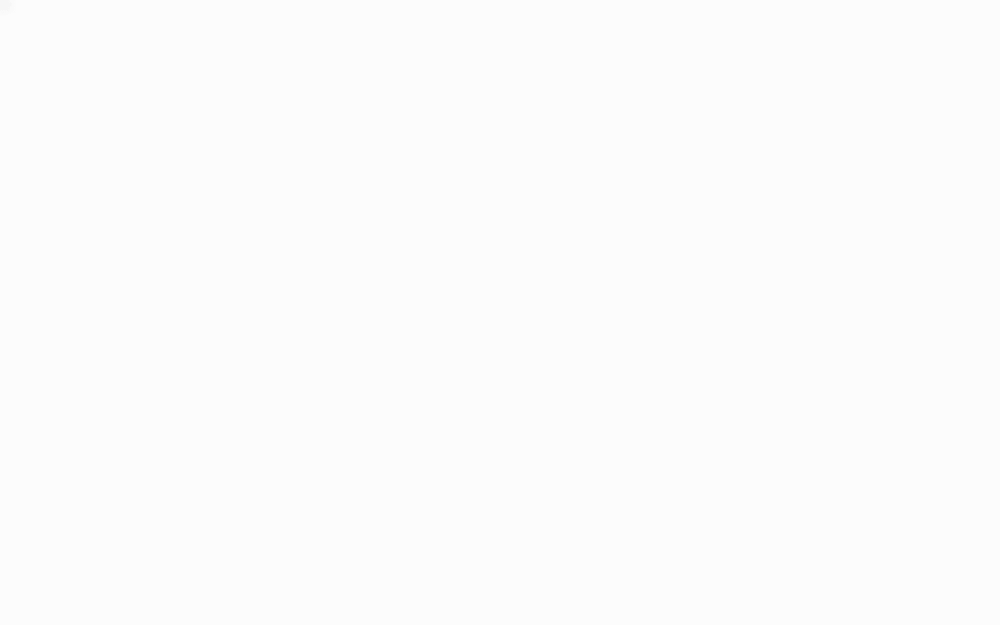
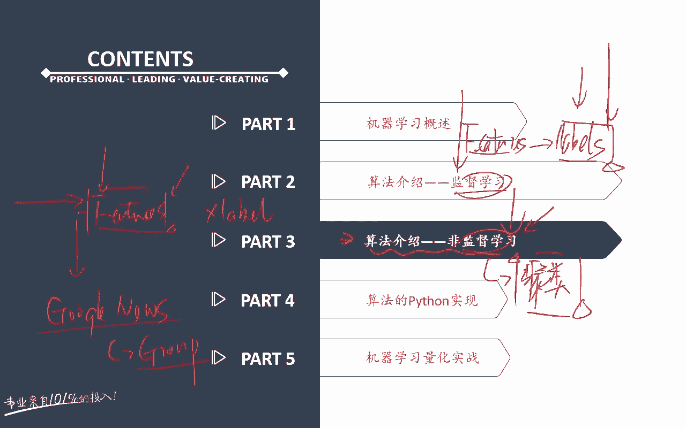
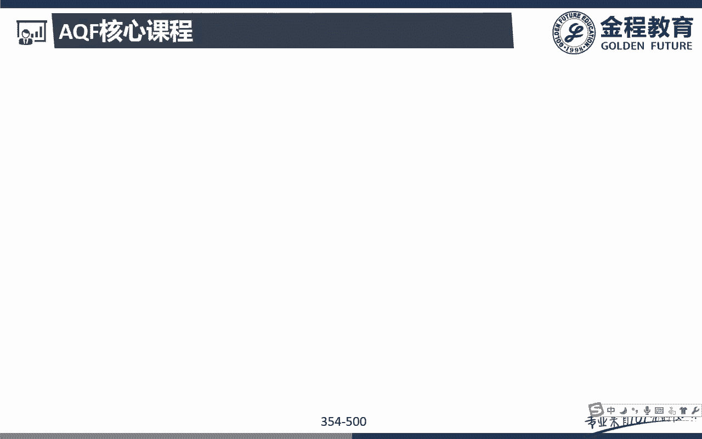
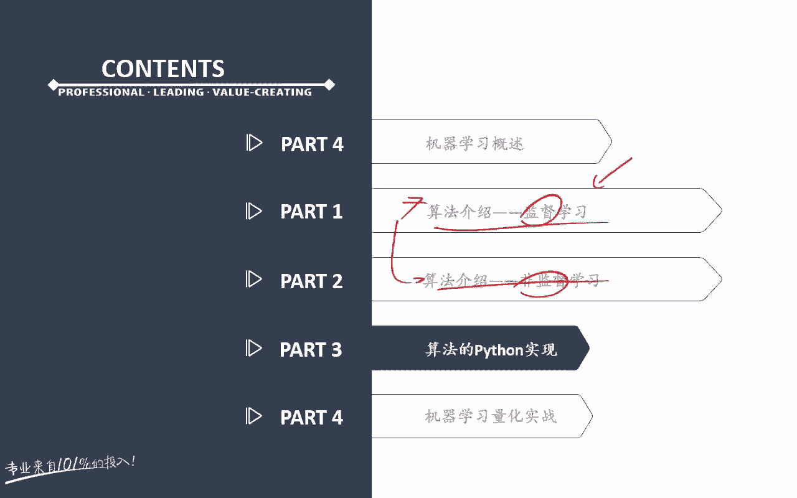
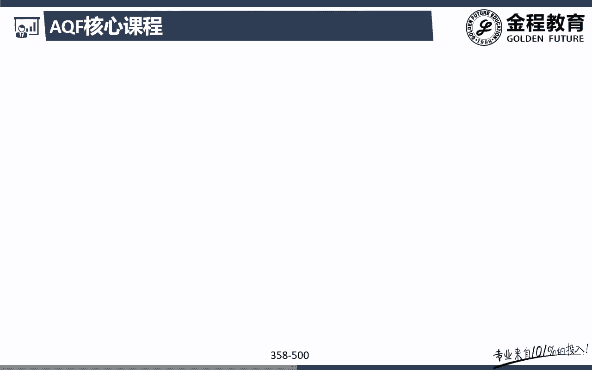
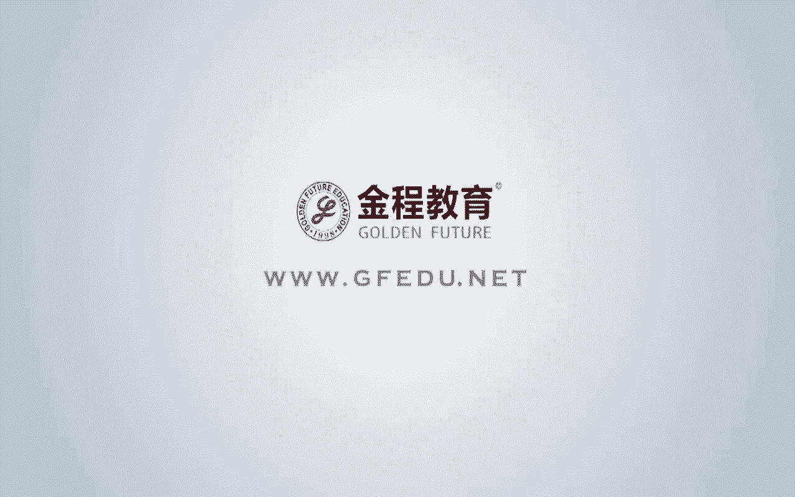

# 2024年金融大神老师讲解量化金融分析师.AQF—量化金融专业知识与实务 - P12：《人工智能与机器学习策略》06.机器学习算法原理_6K-means算法原理和算法总结 - 量化沿前 - BV1oU411U7QM

好各位同学大家好，那么接下来的话呢，我们要跟大家介绍的是我们machine learning里面的，第二大类算法啊，就是啊非监督学习，那么非监督学习的算法的话呢，其实在我们量化投资领域里面。

用的其实并不是特别特别多了，所以在我们这个里面，我们也只给大家介绍一种啊，就是我们用的非常多的kim means k均值，那么呃先来回忆一下啊，什么是我们的监督学习，什么是我们的一个非监督学习啊。

监督学习就是说白了很简单，它有我们的什么futures，每一个futures都有一个什么哎，都有labor，对吧好，那对我们来说，我们分成了训练集和测试集，那么我在训练集里面。

我要让你去怎样进行一个学习，呃，我会告诉你啊，不同的features对应的是什么样的一个label，完了之后呢，有新的data数据进来了之后，我要怎么样嗯，在测试集里面去预测呃。

新的数据的这样一个label，这是不是就是我们这里的监督学习啊，所以你要告诉他futures要告诉我们是吧，Labors，那么当然了，这个labors可以是连续的，也可以是怎样离散的。

连续的话就是回归问题，离散的话就是什么分类问题，没题吧，哎好那么呃后面的话，那我们呃也跟大家简单介绍过啊，什么是我们的一个非监督学习呢，非监督学习指的就是我有特征，我也有features。

但是这个features里面的话呢，我并没有什么哎，他是并没有label的，所以对于我们来说的话呢，我是要让我们的机器，你自己去学习，features里面的一些怎么样内在的一些特征，完了之后的话。

你怎么样在这个features里面，找到这个内在的特征之后，你可以进行各种各样的一个操作，比如说进行分类啊等等对吧，哎那么之前跟大家讲呃，讲到过啊，什么样的一个，其实呃就是属于一个比较典型的一些。

非监督学习的一些例子呢，比如说在我们的网站上啊，可能购买啊某一类产品的这些人，我可能会发现诶这些人他可能都会去，同时又会去购买另外一个类型的一个产品对吧。

包括比如说我们的google google的news对吧，我们前面跟大家讲过啊，啊google news的话呢，它其呃其实是会搜集到市场呃，网上的各种各样的新闻，那么对他来说。

这些新闻都是没有具体的一个标签的啊，但是对google来说，他就把额相同的类似的怎么样，哎这个新闻组合成一个group，完了之后呢，你想看这个专题的话呢，点进去这个呃。

group里面的新闻是不是都是属于这个google嗯，帮我们自动的做了这样一个聚类对吧，所以非监督学习呢，有些时候我们又把它叫做聚类问题，所以呢对我们来说，其实我们是要让注意啊，记录跟分类不一样啊。

分类问题特指的是监督学习下面的啊，聚类问题指的是非监督学习下他什么呃，我要让自己的数据，比如说有特征特别像的那些数据，自己把它聚在一起，然后呢发现嗯我不教我的电脑的，我不教我的机器。

是让他自己去发现我额数据之间的这样，一个特征，或或者说数据之间这样一个关系和规律，明白意思吧。

哎这个就是我们呃跟大家讲的一个，非监督学习啊，好那么呃非监督学习里面的话呢，我们只给大家讲一个啊叫做k means，什么叫做k miss呢，这个K啊就跟我们之前的KNN的，给这个K类似啊。

这个K其实就是呃也是要告诉我们的这个机器，我这个你要做这个聚类，注意这个聚类的话呢，你大致告诉我他有怎么样，哎它有几类，对不对，哎，这是我们这个k miss这个K的这样的一个意义啊。

比如说我可以分成三类的话，那就是什么K等于三对吧，好那么这个k means它是具体是怎么做的呢，它在这个里面啊有这样的一个具体的一个步骤，那么对于我们来说的话呢，这个步骤的话呢我们直接就来看这张图。

这张图是我这个k means算法，我们找到的一个还比较不错的，这样一张解释性的一张图啊，好我们一起来看一下好，那么我们就通过这个例子来看一下啊，那么额首先一起来看一下，首先第一个点的话呢，他说什么嗯。

在我们这个里面我们把这个我要做怎么样，这个聚类对吧，好，这个聚类的话，那我给他一个参数是三，也就是说我最终会分成这样三个聚类，就是三个cluster3个簇，这没问题吧，好那么呃刚开始干嘛呢。

首先第一个我们先随机确定三个点对吧，作为我们的一个圆心或者叫做质心，那么在这三个点的话呢是随机分配的啊，好，那么这个时候的话呢，就可以知道这三个点之后的话呢，我们就可以怎么样啊。

呃分配该执行所对应的这个醋，我们就可以找到了，比如说啊在这个里面我们先怎么样，这三个点我们都是随机的，那么分配了这三个点之后，那么我们就可以找到跟三个这三个点最近的，那些数额，最近的这些点，对不对。

比如说这三个是跟这里的，这四个是跟这里的证明题吧，好那么有了这个过程之后的话呢，接着我们再来干嘛呢，下面一步，随后选取每个簇中的所有点的平均值，作为这个醋的新的质心，那么我们要做一个位置的一个更新移动。

也就是说在这个里面，虽然我们定义好了这三个粗心对吧，好完之后的话呢，我们要做一个怎么样啊，取一个新的一个位置，比如说要经呃经过它的一个圆心，比如说他的这个类更新到这里了，你看从这里更新到这里了。

然后呢绿色的这个条线呢，从会从这个里面变成到这里，完了之后紫色这条线呢，紫色这个点呢会从这里怎么嗯，更新到这里没问题吧，好那么更新完成之后的话，大家会发现啊，原来我们的分类是这么分的对吧，这里是一道。

然后呢怎么样，这里是一道，原来是这么分的，但是呢现在怎么样，我的圆心的位置更新好了之后，那么我们会发现呃，在这个时候我就发生我这个醋啊，就发生了一个改变，我们会发现，原来你看我们红色这个醋里面有三个点。

但是呢我现在红色的圆心，从这里变成了正中的这个这个位置吧，好那这个时候的话呢，我这呃同一时我这个绿色的这条线呃，这不是这条线啊，这个质心从这里位置移到了这里，没题吧，好那么现在的话我们呢我们就会发现。

其实绿色这个醋从原来的这几个，是不是变成了这样两嗯嗯变成了这样两个对吧，好红色的点呢会从怎么样，红色的点，因为原来这个点是属于我红色的啊，现在我绿色上来了，所以它就变成不是红色的。

红色的点就只有什么这两个了，看到没有哎，完了之后的话呢，我原来紫色的点是1234这四个，但是呢我现在紫色离从原来这里移到这里了，所以呢这几个点是不是都变成紫色了，唉那么注意这只是怎么样。

我的这个k means做的什么一次迭代完了之后呢，我们还要做两次迭代，最后直到什么呃，我的这个促心不再发生变化，或者说已经达到我最大的一个迭代次数为止，那么注意啊，这只是我们做了一次迭代。

但是具体的我们应该知道大概是怎么做的，首先第一步我先怎么样随机确定这三个字，心对吧，完了之后呢，找到跟这个知心呃，最近的这些点作为我们的一个什么cluster，做我们的一个促，完了之后的话呢。

我们要更新我的一个圆心，把它怎么样呃，执行更新到我的一个正中间的一个位置，没问题吧，更新到我们正中间的一个位置，好，更新到正中间的这个位置之后呢，我们就会发现原来可能这个点是属于你的。

现在就可能不是属于你了，原来这个点不是属于你的，也有可能变成你的听明S吧，哎那么这个例子因为他只做了一次迭代啊，也不是特别直观，那么在我们这个里面呢，我们给大家画了这样，哼，我又手动画了呃。

这个真的不容易啊，这个我用手绘画了这样几个点啊，带着大家做多次迭代，最终我们就可以找到呃，这三个错了，这三个数据的自己特特有的一个点呃，规律我们就可以找到了，比如说我们在这个里面我们可以看到额。

我们的数据类型啊，非常明显的，可以看到是不是有这样三个数据错啊对吧，这是一个这是一个，还有呢这是一个他其实这三个数据哎，哎看看得见吧，那我们哎，我们来看一下，这其实显然是属于一个数据库。

这里呢也是属于一个库斯特，还有呢这里也是属于一个cost对吧，没问题吧，好那么对于我们来说的话呢，我现在要把这三呃，因为我们肉眼是可能看出来啊，但是机器的话不并不知道，我要让机器自己去学习。

然后呢找到这三个cluster，然后呢怎么把它给我做聚类聚聚合出来，听明白意思吧，哎好那么怎么去聚合呢，因为在这个里面其实我已经知道了，我一共有几个醋啊，三个醋，所以呢我给你的这个k means。

这个K就等于几啊，K等于三问题吧，好那么首先第一步我要干啥，首先第一步我知道了，也反正一共有三个醋，所以呢我在我的点上先随注意啊，这个位置是随机的，先随机出现这三个五角星。

这三个五角星的话作为我们的一个质心问题吧，好那么出现三个五角星之后的话呢，哎我们接下来就可以干嘛，我们就可以开始画累了对吧，哎我们就可以开始画类别了，也就是说这个里面可能这里是这一坨的。

然后呢紫色的呢这几个是属于紫色的，黄色的的话呢，这三个是属于黄色的，挑最近的嘛，对吧好，我们就来看到啊，我们这里已经画好了，那么蓝色的这个注意啊，这蓝色紫色和黄色五角星，我们都是随机出来的问题吧。

好那么可能呃对于我们来说，随机出来了之后呢，我们就随机分成了这三个簇，123分别，这三个离我最近的这个点是不是属于我的，对吧好，那么接下来怎么做啊，注意了，接下来第二步我们说了什么。

我要更新我的这个什么醋的圆心对吧，哎原来呃是在这里的，但是呢因为这个醋一共是这里，所以呢我会更新到这个位置没题，那么我紫色的这个呢，也是要更新到我正中的位置，我黄色的这条线呢。

这个五角星是不是也要更新到我这里，正中的一个位置啊，对吧好，我们来看一下这个里面我们已经更新好了呃，更新好了之后的话呢，怎么样，接着接着的话呢，我们再来看下一步，哎，大家来看啊。

这两个我们是随机切换的啊，因为现在的话怎么样，我现在是不是已经圆心，蓝色的圆心从原来的这个变成到这里了对吧，紫色的圆形呢从原来的这里变成到这里了，好黄色的圆形呢从原来的这里变成这里了，好那么这个时候啊。

我们再来看一下我新的这个分类，可能就是分成什么样子了，蓝色的这个里面或者黄色这个最明显，黄色这个原来只有三颗，现在黄色变到这里了颗，所以呢可能再把黄这一坨，三个是不是都是属于黄色的对吧。

新增了33个变成黄色了，原来的话呢紫色的是在这里的对吧好，那么可能现在呃原来是在这里，现在变成这里之后的话呢，紫色这里哎这几个是不是就会变成紫色了，那么蓝色的话呢呃它可能就什么就少了一个。

就变成这样的一个问题吧，好我们来看一下啊，我们把这个圆呃，五角星从原来的位置移动到我心的位置之后，我们就会发现怎么样呃，就变成了更新了新的这三个醋，没问题吧，哎这三个close好。

那么这三个变成变好了之后，接下来一步还是干嘛一样吧，还是更新对吧，比如说在这里，因为原来少了这一个点，所以呢我蓝色的中心可能往上偏一点，那么紫色的话呢，原来在这里我要回到，我还是要来到这里紫色的中心。

黄色的话呢，在这里我还是要回到我黄色这个点的中心，面对吧，好那么我们这个里面就可以看到，你看又往上是不是都走到了这个紫色的，回到这里，黄色的到这里，蓝色的到这里，注意啊，这已经是我们的第几次迭代了。

呃呃第这是第一次，然后呢这里是不是已经是怎么第二次迭代了，对吧好，那么回到这个里面的时候的话呢，你看原来的蓝色的这个圈圈，从这里回到放到了这里，紫色的针线呢从这里回到了什么，这里没题吧，好。

那么现在我们再来看这个醋，是不是又发生了一个新的变化，我们会发现蓝色的又往上走了，所以现在新的这个蓝色的一坨坨，是不是可能是这一坨，是不是才是蓝色的了，完了之后紫色变到这里了。

所以呢这一坨是不是变成紫色了，黄色的还是这一坨，这没题吧，好那么这个时候我们就可以来看到，我们把我们自己画的啊，你看因为蓝色往上走了啊，所以跟我蓝色有关的，是不是就是这一类了。

然后呢紫色的因为它往从上面走下来了，所以紫色的，是不是现在的这个圆心就变成变到这里了，黄色的圆心还是几乎是还是这里对吧好，那么接下来这一步还是做一个什么东西啊，唉还是做一个回到我这里的圆心。

这个紫色的也回到我这里的圆心，然后黄色的因为没什么太多改变，还是在这里问题吧，好那么在这个里面你看蓝色变到这里，紫色变到这里，黄色变到这里好，最后的话我们就会发现额，这里应该没有这个蓝色的这条条线啊。

所以最后的话我们就会发现这三个五角星诶，正好是不是就回到了我这三个点的正中心啊，哎这三个粗的正中心好，那么接下去其实还可以做第三次，第四次迭代，第五甚至第五次迭代，但是我们会发现在做第四次。

再接着再做迭代的时候回到中心，因为这个时候就已经不发生改变了，因为在什么蓝色，紫色和黄色，这三个是是不是都是在中正中心啊，对吧哎好那么这样的话呢，其实我整个k means的这个做法，我们就已经完成了。

听明白意思吧，哎呃这个已经是我这个能想到的，最简单的一种方法，来去跟大家解释这个k means这个算法了。

问题吧，哎好那么讲到这里的话呢，基本上我们机器学习里面的一些主流的，一个算法都已经跟大家讲完了，那么呃监督学习讲的比较多一些啊啊啊，非监督学习的话呢，我们讲的比较少一些，那么没关系啊。

因为监督学习我们可能用的更多啊，在我们量化领域好，那么最后的话呢，我们就来跟大家总结一下，监督学习和非监督学习的这样的一个特点，零的一个对比好，那么监督学习和非监督学习的一个区别啊。

我们之前就已经跟大家讲过很多遍了对吧，前面在讲非监督学习的时候，也跟大家复习过，那么我们主要来去跟大家去讲一些，监督学习里面的呃方法的一些区别啊。

那么首先来看监督学习里面额，第一个我们换一个颜色啊，嗯嗯supervised learning，监督学习里面的话呢，对我们来说，其实现在知道呃也有点感觉了对吧，分成了两个最主要的一个类型。

一个是分类问题，还有一个是什么，我们的一个怎么样回归问题，对吧好，那么对我们来说它的一个数据类型的话，分类问题的数据类型是怎么样，它是A很好，它是离散的，那么regression的话呢。

它是一个什么连续的这样的一个什么问题对吧，哎那么对于我们来说的话，呃，接着的话呢，这个分类问题其实我们要找到的是什么，诶，找到的是那个最优的决策，什么边界叫做decision boundary。

没问题吧，那么回归问题呢，我们其实找的是最优的那条什么，最好的，可以拟合我数据的那条拟合的那条线问题吧，那么分类问题怎么去评价我的模型的好坏呢，我们可能用的比较多的是我这里的什么。

accuracy准确性对吧，那么等我回归问题的话，我们怎么去评价我们的一个额好坏啊，比如说我们可以用平方额，这个距离的平方和对吧，some of怎么square的什么error对吧，哎。

这其实或者说我们还有一些，在我们CFA2级或者farm里面，跟大家讲过一个什么are square对吧，哎那么这些的话呢，其实都是可以去帮助我们去判断，我们这里的模型的一个好坏啊。

好那么这是一个啊一种我们的一个对比角度好，那么接下来的话呢我们再来看一下额，我们其他的算法之间的这样一个角度啊，所以对我们来说，首先第一个我们来看呃，先来看我们的一个逻辑回归。

Rogistic regression，logistic regression的话呢，它其实做的就是一个分类的一个问题对吧，比如说这里是我们的一个数据组，这里呢是我们的一个数据组。

所以逻辑回归做的就是这样一件事情，怎么样要把这两个数据组把它给切开对吧好，那么这是第一个，那么第二个的话呢，SVM注意SVM其实做的事情，跟我们的逻辑回归差不多，但是SVM他特别关注的是什么。

哎这个我的最优的这个决策边界旁边的那些点，或者哎是不是哎，因为会影响或者决定，我这个决策边界的这些点啊，那么其他的距离更远的那些点呢，其实对我们来说，对我这个SVM的影响是不是比较小。

所以那么说SVM的话呢，可能更专注于什么哎这一个怎么样，这些会影响我这个角色边界的这些点，这些点的话呢，其实我们之前跟大家讲过对吧，这个点叫做什么支持是吧，哎支持向量对吧好。

那么呃接着的话呢再来跟大家看一下，什么是我们的一个，这是我们的这两个算法之间的一个区别对吧，哎那么第三个的话呢，我们还跟大家去介绍了一些这个neural network对吧，就是我们的一个神经网络。

那么神经网络的话呢，它其实最大的一个特征，前面已经跟大家呃强调过额，比如说啊在这个呃这个里面，那么蓝色的这个线呢，比如说在这个呃，好那么还有一些是我红色的嗯，比如说在这里，啧所以对于我们来说的话呢。

我们这个蓝色的这一块的区域，其实就是在做一个什么哎，那么我们的这个神经网络的话呢，它其实是可以切，怎么哎切很多刀，比如说我怎么样去可以把这个蓝色的，把它给画出来对吧，把它给分类分出来呢，很简单。

这个画的不太好啊，那么在我们这个里面，我们可以在上面再给他多加一些数据点好了，那么我们可以来看一下，在我们这个里面，比如说这里也都是红的对吧好，那么对于我们来说，怎么可以把它给切出来呢。

我们可以切多刀对吧，多切几刀，我们就可以把它给切出来了，比如说我们现在这里切一刀，然后呢在这里在这里深，在这里切一刀，那么通过这种切法的话呢，我们是不是神经网络，我可以切多刀对吧。

哎通过我们的这样子的一个什么呃，这个一个神经元，一个神经元之间的这样的一个怎么样，每个程序员之间会产生一个聚合函数对吧，然后呢我的一个神经元的output，可能就是我下一个的什么input。

那么对我们来说，我们就可以切出一个非常复杂的这样的一个啊，不一定是这种图形啊，各种各样乱七八糟的图形，是不是都可以通过我们的这个呃神经网络，都可以把它给切出来，对吧好，那么还有一个呢是嗯。

我们跟大家讲的，SVM里面的一个什么kernel的一个问题对吧好，那么这个科呢的这个问题的话呢也很简单，比如说我在这个里面叉圈圈叉叉叉圈圈圈差好，那么对于我们来说的话，我要把这个数据分类的话呢。

其实我要拿线性分类的话呢，我们是分不出来的，对不对好，那么我现在可以怎么做，我现在可以把它原来是二维的变成一个立体的，或者原来是一条直线，我们变可以把它变成一个二维的对吧。

比如说我现在可以把什么叉叉叉叉叉都放，都把它变到上面去，然后呢最后下面的是什么呃圈圈，然后呢这里有三个圈对吧好，那么原来是一条线，现在的呢我把它变成一个平面，有了这条个平面之后的话呢。

哎我们是不是怎样就可以线性可分了，我可以找到这一条线就可以把它给切出来，能理解意思吧，哎这就是我磕动的一个最核心的一个用法啊，就是把我D为下的线性不可分，变成到了我高维下的一个什么哎。

高位下的一个线性可分，这个是我们克隆的一个算法问题吧，哎好，那么基本上的话呢，就是主要的一些机器算法的一些对比啊，基本上我们呃平时常用的一些东西，我们就都已经给大家讲明白了，那么后面的话呢。

我们要真真正正带着大家来去看代码了啊。

好那么呃机器学习的理论的算法部分，我们就讲到这里。

