# 2024年金融大神老师讲解量化金融分析师.AQF—量化金融基础知识（完整版课程） - P16：《+威❤hhh427501  了解获取全套课程》05.4统计套利量化交易策略 - 量化沿前 - BV1ar421K7Mo

好，那么前面啊，我们是跟大家介绍了整体的量化交易策略的，这种回测框架，那么接下来的话，那我们就可以开始来去看，我们真真正正各种各样的交易策略的一个，核心思想和核心原理，那么首先第一个。

我想先跟大家讲的是一个统计套利的，这样一个策略，好，那么先来跟大家看一下啊，为为什么没要跟大家讲统计套利呢，有这样几个原因啊，第一个这个策略使用起来非常非常广泛，也就是说它是一种，比如说啊。

我们经常所说为所讲的一些指数，增强的一些策略啊，或者说这些是一些主动的一些交易策略里面，我们也会去用到我这个里面的这个统计套利，而且确实从过去的历史经验来看啊，它还是可以给我们带来非常多的一些呃。

阿尔法的，所以它是一个使用非常广泛的一个地方，第二个的话呢，那么它的呃模型的理念啊，各方面相对来说都是比较简单的一些，所以的话呢我是把它放在我们的一个，刚刚开始的一个对吧，它非常适合我们的一个入门啊。

所以的话呢我们大家可以看啊，在我们后面的来去跟大家去做，我们的一个量化交易策略的一个编写的时候，其实用到的那个啊，前面几个核心的一个策略思路，就是我们这里的这个统计套利的这个交易策略，对吧好。

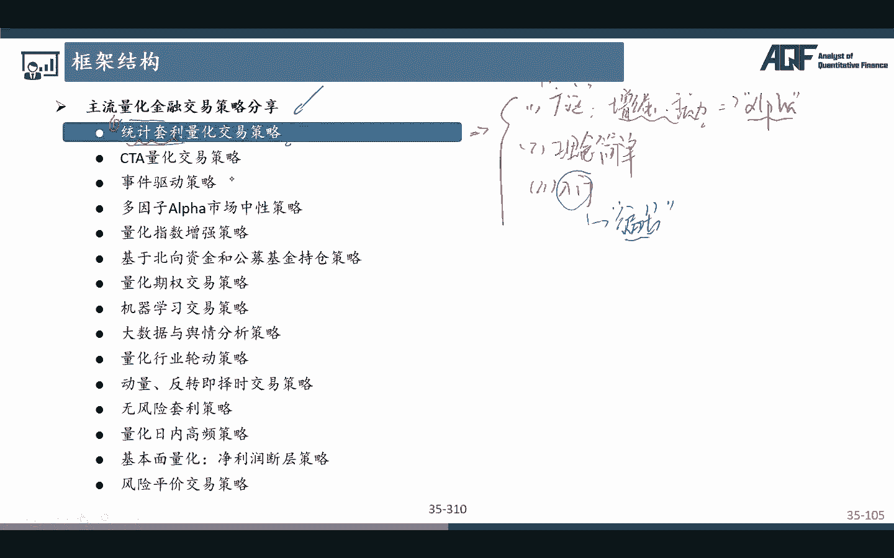

那么在我们这个里面啊，那么呃统计套利到底是怎么做的呢，我们给大家看，首先第一个啊你要去做统计套利的话，那你必须先要验证一下，我们数据与数据之间，是否满足这样的一个谐振关系好，那么来解释一下啊。

什么叫做呃这样一个谐振的这个关系呢，这是统计学上的一个概念啊，跟它相对应的就是一个随机的这样一个过程，如果说是一个随机的一个过程的话呢，它就没法来去预测，当然在我们这个里面。

也就没法来去做我们的这样的一个统计套利了，所以的话呢在我们做统计套利的事先啊，大家首先先要去检验一下，那么这些检验，我们有各种各样的一些检验方法啊，到时候在课程上我们会跟大家提到。

我们要去检验一下我们的这个数据呃，我们的那个数据里面啊，是否满足这样一个谐振关系，还是说它只是一个随机的一个过程，如果是满足随机关系的话呢，呃随机的一个过程的话，那就没法预测。

如果说是满足学者的一个关系的话，那我们就可以以式来，可以去做我们的一个统计套利了，对吧好，那么谐振到底是什么东西呢，我们在这里举了一个比较形象的一个例子啊，他说如果啊你在河里放两条船和的话呢，很宽。

比如说在长江里面放两条船，那么这两条船它你直接放下去之后啊，他们这两条船之间的距离肯定都是随机的对吧，所以的话呢他一会儿可以很远很远，一块可能离得又非常近，甚至可能会呃这个这个嗯有碰撞啊。

什么东西都有可能，所以如果说这两条船是随机放进去的，那么对于我们来说是没法预测的，听明白哎，但是的话呢大家注意谐整的一个关系是什么呢，所谓的谐振的一个关系，他说比如说你现在有两条船，但是呢你放船的时候。

你用个链子把这两条船连起来，假如说这个链子一共有10米长，然后你再把这两条船放在长江里面，这个时候你就会发现它，这两条船作为一个整体的话，它仍然是一个整体的一个随机的一个过程，但是如果说啊。

你看这个用这个绳子连接起来的两条船，这两个船就满足这样一个谐振关系，因为对我们来说，它最远就可以到10米，对不对，因为这个链子最长就是到10米，所以当我发现这个绳子已经到达8米，9米已经很长的时候。

我们大概率就可以知道，两条船接下来的这个距离怎么样，是不是就会慢慢更近了对吧，再比如说两条船，如果说现在的距离已经很近很近了，那么我们会怕，我们会感觉说两个spread已经非常接近了。

那可能将来它变这个spread变大的可能性，也有对吧，哎所以对我们来说啊，在我们这个里面，我们这个其实就是一个这样的一个写减关系，斜线关系就说的是两个数据之间啊，啊他还是有这样的一个内在的一个关系对吧。

他不是说完全就是这样的一个随机的一个过程，没问题吧，好，那么啊到底怎么去去检验，我们是否有这样一个随机的那些过程呢，我们Python里面我们有一些数据的模块，这些数据模块的话呢。

可以帮助我们快速的来去做协整啊，那如果说我们的初始的数据不满整，不满足谐振的条件怎么办呢，我们在后面的策略里面还会给大家讲啊，我们还可以继续做一个difference做拆分。

如果说拆分满足我们的那个谐振关系啊，或者说回归满足我们的一个谐振关系等等，其他的一些方法，其实也都可以来去帮助我们去更好的来去执行。

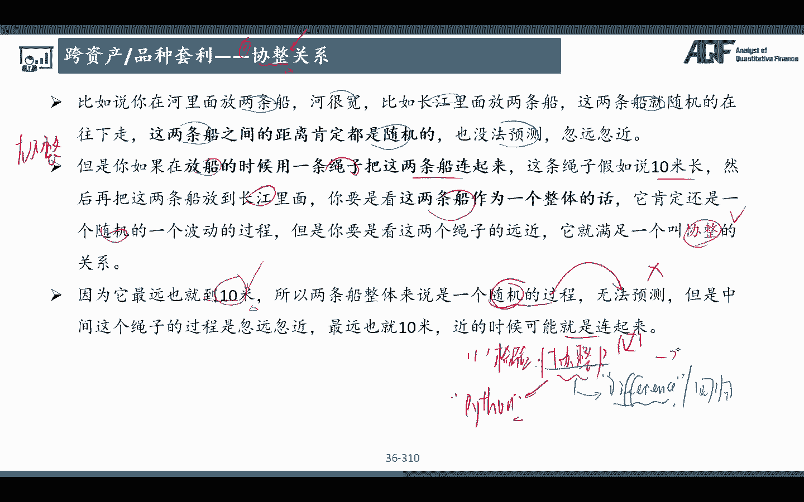

我们这个里面的统计，交易的这些统计套利的这些呃交易策略。

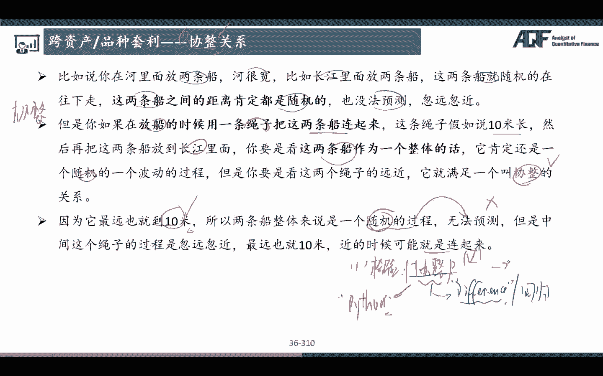

对吧好，那么接下来啊，我们就来带着大家看一些在我们市场上呃，比较常见的这种统计套利的这样一个策略，那么首先来看第一个，第一个的话呢是我们经常讲的呃。

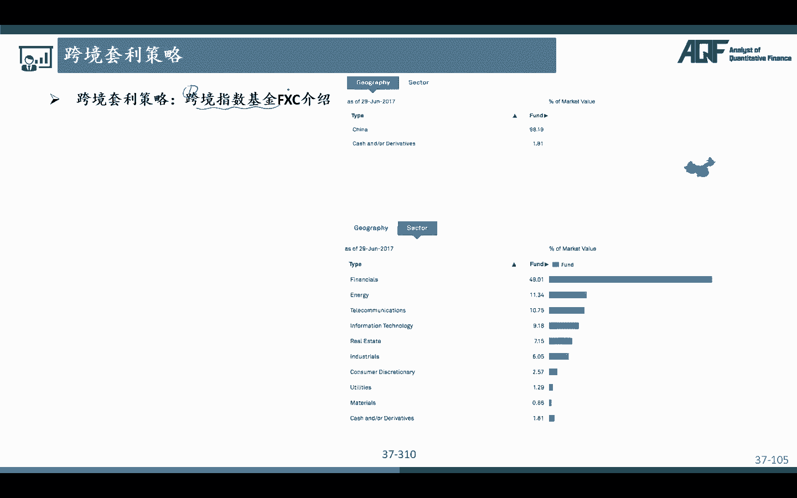

经常听说过的一个啊叫做跨境的一个指数基金，那么有一个这样的一个跨境的一个指数基金啊。

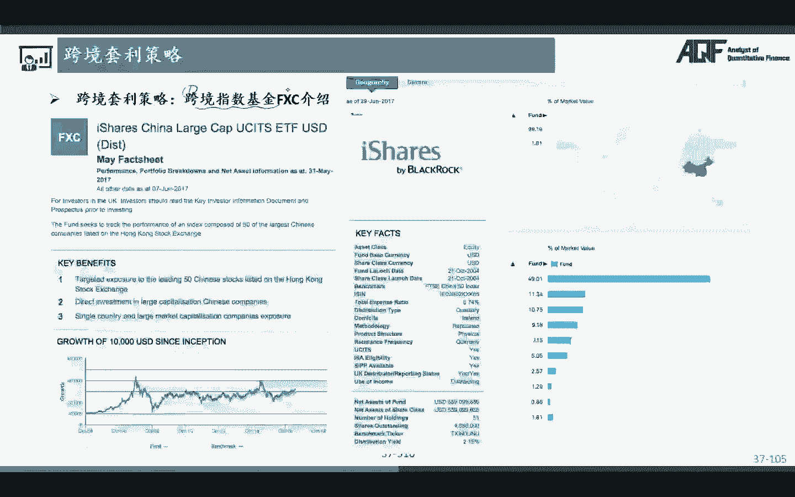

那么也就是说本质大家知道一下，它是一个ETF啊，贝莱德搞的一个啊，他是一个ETF，这个ETF投的是什么呢，这个ETF投资的全都是中国上市，中国的那些比较大型的那些大盘的那些公司，那这50个公司的话呢。

主要是在嗯香港那些交易所上市的啊，他在大家可以看这里的leading fifty fifty呃，chinese stocks没问题吧，好那么对我们来说啊，也就是说这个ETF投资的是中国的50只大盘股。

对不对，好那么大家注意这个ETF啊，他其实是在美国上市的，对吧好，那么现在就会有一个问题，什么问题呢，大家会知道在美国的市场上，美国的交易时间和中国的那个交易时间呃。

其实是怎么样不同的两段不同的两个时间，对不对好，那么现在就可能会有一个问题，在中国开盘交易的时候，其实中国的这50只的股票已经发生了改变，它已经有上涨下跌，上涨下跌对不对，好。

那么这个中国的股票价格的上涨下跌，其实并不能立刻在ETF的这个价格上得到体现，ETF的这个价格要等美股开盘了以后，那么这个它才能在美股的这个ETF的这个价格上，是不是产生一个体现啊对吧。

所以的话呢在这个里面啊，这两个其实会有一个什么样的一个问题呢，这两者之间它其实会有一定的，比如说时间差的一个问题，包括说我们这些定价的一些怎么样，定价的一些有效性的这样的一个问题。

是不是这样一个道理啊对吧，所以对我们来说的话呢，两者之间的spread注意一个是ETF的这个价格，还有一个是中国的50只股票之间的这个价格，他两因为它两者之间是有一定的权重，和这样的一个对应关系嘛。

对吧，哎所以如果说当我们发现ETF的这个价格和大盘，中国的这50只股票的这个大盘股票之间啊，它两者之间的价差如果足够大的话，它两者之间的spread如果足够大，我们就认为可能就能。

我们来去执行这样一个统计套利了，没问题吧，好我们可以来看一下啊，首先先来看一下这里的这个。

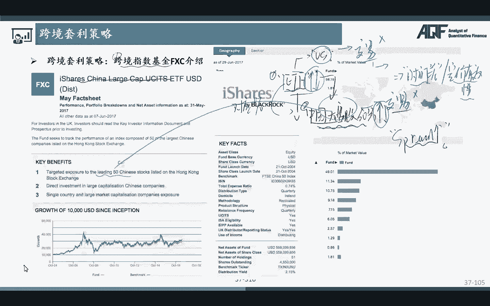

50只股票的那个成分啊，在这个里面他有了对吧，比如说腾讯啊，什么建设银行啊，中移动啊等等等等这些公司啊。

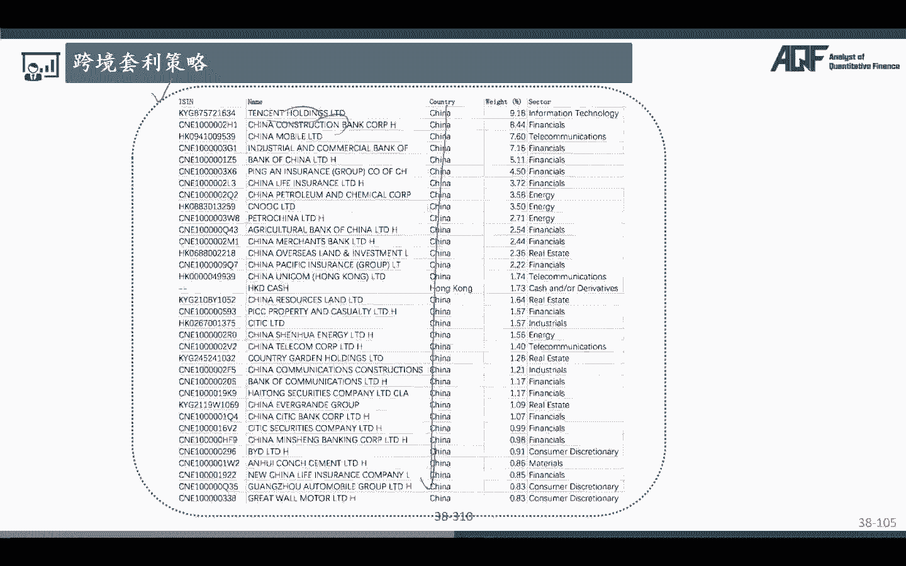

好那么香港上市的这么多的公司对吧好，那么现在的话呢对我们来说啊，这呃它背后的那个原理，我们前面也跟大家讲过，因为这两个资产的交易时间啊，是没有任何的重叠的，所以的话呢这两者的价格啊，就会可能会产生背离。

所以从而会有一些套利的机会，当然这种套利现在已经没有太多的一个空间了，那么这种套利的方法的话呢，在呃之前啊啊早几年的时候啊，如果我们早点去看这种套利机会，因为参与的人少啊，所以海外投行做的还是很多的。

那现在的话呢，基本已经没有什么太多的一个套利机会了，那么在我们这个里面，首先我们要做这样的一个套利，首先问大家一个问题，就是自己要问自己啊，满足不满足一个协整关系，因为对于我们来说，这个是比较特殊的啊。

ETF的价格和它的底层资产之间，他一定是满足我们的一个额，这个这个邪正关系的对吧，因为它的价格就是受到他底层股票的那些，影响的嘛，所以其实在这个case当中啊，我们做不做贤者的一个检验性其实都无所谓。

因为它几乎是从我们的一个统计套利啊，统计套利其实本质上来说它仍然是有风险的，他其实说更多的已经从统计套利，变成了一种无风险的一种逃离了，因为对我们来说，这两者之间的价差，因为真一个是ETF的一个价格。

一个是它底层股票的一个价格，这两个其实都说的是一件一个东西啊，所以可能更多的像是我们这个里面的，无风险套利了，它，所以对我们来说啊，如果说两者之间的背离程度越大的话。

那么我们认为两者他的短期的这个可回归的，这个可能性就越大，对吧好，那么在我们这个里面啊，我们就可以构建一个是它底层资产的时间序列，还有一个呢是ETF价格的这样的一个时间序列，所以我们会发现。

当当我们啊这两个资产的这两者，两个价格序列啊，它两者之间的那个spread足够大的时候，一比如说一个一直在涨，一个一直在跌，或者虽然两个都下跌，但是一个跌的很多，一个跌的很少。

那么这个时候是不是就发生了这种定价不充分，或者说SPAD特别高，所以呢在我们这个里面我们就可以低买，怎么样高卖，如果当我们偏离很大的时候，我们就可以long那个低比较低的那个shot，比较高的那些。

当然啊这个你嗯前提是你可以去shot啊，那如果说shot不了的话，那我们就单边也可以，我们就做多额被低估的那个也是可以的，我们就可以进行这样的一个逃离了，没问题吧，而且这种套利的话呢是几乎没有风险的。

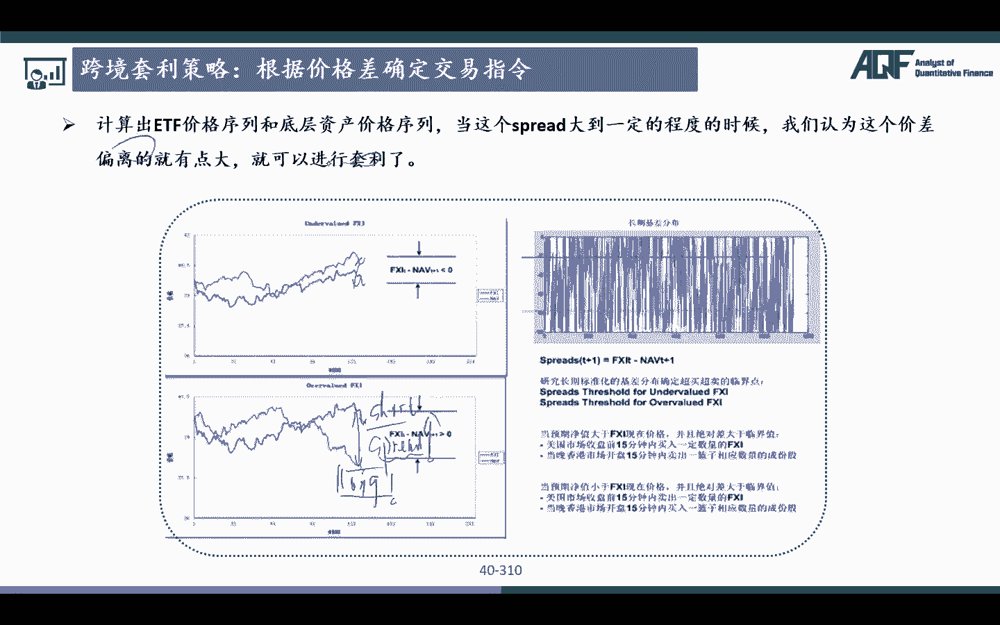

因为这两个其实本质上来说，这两个资产的价格是针对的，同一个东西的一些价格对吧，所以一般来说只要他的壁背离的spread越大，只要我们发现这种机会，我们进入去做的话呢，这个就是一个时间问题。

两者一定是会回归的对吧，哎所以我们说了这种策略，更多的像是呃这个无风险套利。

我们后面讲完这个套利策略之后，再来跟大家讲，统计套利和无风险套利之间的一个区别，好，这是一个我们利用基金嗯的一个海外的这种。

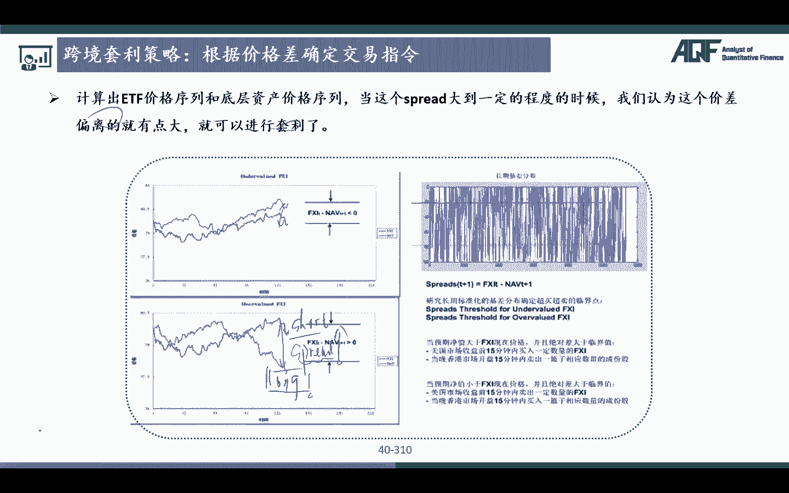

跨境套利的这样一个交易策略，那么我们接着再来看第二种统计套利的特点，第二个统计套利的特点的话呢，类型啊就是我们的一种跨市场套利了，跨市场套利啊，在这个里面的话呢，这是一个额典型的那个统计套利啊。

因为前面那个可能还会有一些那个，无风险套利的那种感觉，但是的话呢这里跨市场套利，就一定是同期套利了，那么我们来看一下呃，在我们这个里面的话呢，它其实涉及到了两个点额，就比如说也是一样，一个是沪铜。

还有一个的话呢是伦敦铜，对吧好，那么大家会注意注意啊，不管是沪铜还是伦敦铜，都是同的一个价格吧对吧，所以的话呢在我们这个里面，我们就可以拿我们的呃互铜去除，以我们的这个伦敦铜的这样的一个比率。

我们来做这样的一个交易策略，因为对我们来说，沪铜和伦敦同这样的一个racial啊，那么他应该是有长期的一个怎么样均值的，对不对，好那么长期的，如果啊假设这个长期的均值在这个里面。

然后的话呢我们向上偏离一倍标准差，或者说向下偏离一倍标标准差，在正一倍标准差范围里面，我们认为都是呃在均值附近啊，政府一倍标准差之内的，我们认为都是一个合理的一个过程对吧。

但是当我们发现如果说这个时候啊，那这个嗯RACHEL这个比值超过一倍标准差了，也就是说沪铜涨得很多，然后呢伦敦铜没有涨那么多，超过了一倍标准差，那么我们就可能会发现，这个时候就可能会有一些统计套利的一。

些机会了，因为当然这个几倍标准差你都可以自己定啊，而且甚至你可以不用标准差的啊，概念你可以用什么布林带，但是布林带本质上来说，也是那个这个这个额标准差对吧，那么比如说你可以自己去定1。25倍啊，或者1。

5倍啊，那两倍啊，这些的话呢你可以自己去设定这个参数，听明白意思吧，好那么在我们这个里面，假设说超过了这里的这一个被的一个标准差，那么因为长期的均值就在这里嘛对吧，所以我们认为怎么样从未来长期来看。

可能这个均值是不是就会它的那个RACIO，可能就会回归啊对吧，所以我们就可以让我们这里的伦敦通去SHT，我们这个里面的互通，那等我将来啊这个两者的比值真的回归的时候，两者之间的价差。

我们是不是就可以赚到这个钱了对吧，那同样的道理，如果说这个比值啊额非常低，低于了我们这个里面嗯，历史平均的一倍标准差以下，那么我们认为同样的，我们认为这个均值可能会回归。

所以我们就可以long胡同去shut，我们这个里面的是吧，论证痛是不是这样的一个过程啊，对吧，哎所以啊在我们这个里面啊，这个其实就是嗯，一个非常典型的一个统计套利了，那么大家注意统计套利。

像类似于这种套利策略啊，他最害怕的是什么，或者说他最最担心的什么，唉，他最最担心的其实就是我这里的这个spread，不回归的一个点，也就是说啊照道理来说，我们认为伦铜和沪铜啊，它其实都是铜，对不对。

但是可能由于比如说呃上海的那个沪通，他受到一些监管政策的一些限制等等，怎么样，那它的价格可能就不随轮同的变化而变化，所以很有可能会发现很可能会发生啊，不是很有可能啊，他有一定的这种可能性。

这个可能性呢虽然相对来说是比较小的对吧，但是也是存在这种可能性的，就是这个价差不回归，或者说两者合约，它的系统性的这个基本面，发生了极大的一个变化，所以原来的这个长期的那个均值可能不再满足。

我现在的新的一个情况，所以当我们spread不回归的时候，这个价差可能长时间一直存在，所以你一直老你做多做空就赚不了钱了，甚至是说因为发生了系统性的改变，所以这个价差可能会进一步的扩大。

如果它进一步的扩大，再跑到长期的一个均衡的一个水平上，那你在这个时候，你用了一个反向的这样的一个统计套利的策略，是不是可能就会发生一个非常大的一个损失啊，没问题吧。

所以统计套利的策略他最担心的就是什么呢，就是类似我前面跟大家讲了，发生了这种所谓的怎么样黑天鹅的事件，可能在99%，或者说95%的情况下，这个策略都能赚到钱，但是的话呢，只要是这个有1%或者5%的这种。

黑天鹅策略呃，这个现象发生我的这个价差不收敛，spread不回归啊，那么这个对我们的这个交易策略，就会产生一个呃毁灭性的影响，所以呢在这种情况下啊，我们一定要去及时的去设置我们的这样的一个，止止损。

止损线，那么设置止损的话呢，对我们来说，万一啊将来这个我这里的spread不回归，至少对我们的影响也不会那么大。

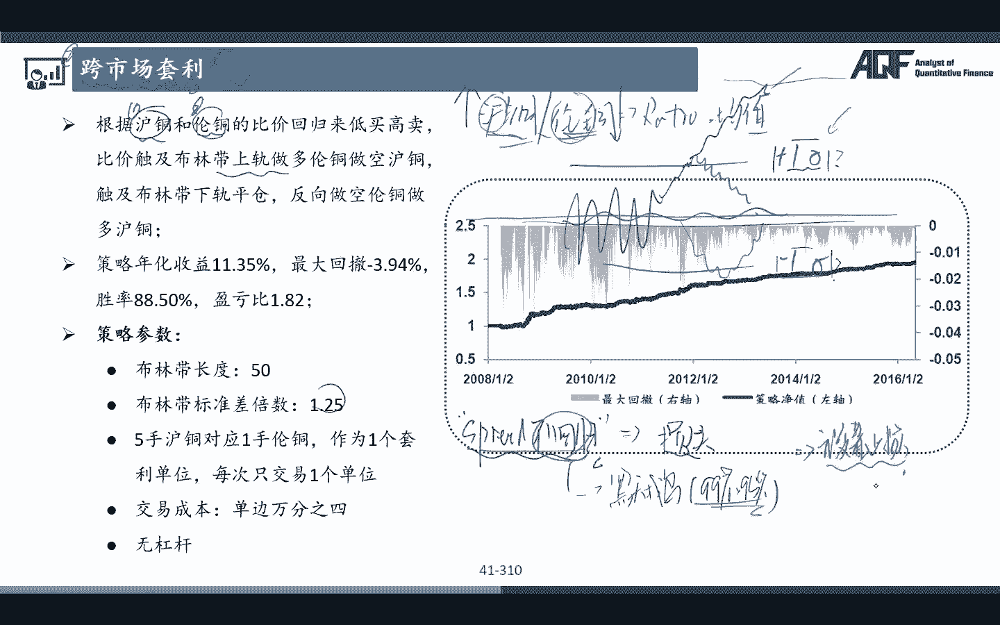

对吧好，那么这里是呃跨品种套呃，跨市场套利的一种点啊，还有一个的话呢，就是呃呃也是跟大家讲的一种比较典型的，这种统计套利的一个思路，这个的话呢就是我们用两个品种之间的，跨品种的一个套利。

也就是说在我们来看啊，在中国也有，海外也有很多啊，这两个不同的期货合约之间，它是有一定的比价关系的，所以我们可以采取趋势套套利或者反转套利，一般啊在我们这个里面统跟统计套利有关的啊。

都是我们的一些反转套利有关的一些对吧，比如说啊我们的呃螺纹钢与铁矿石对吧。

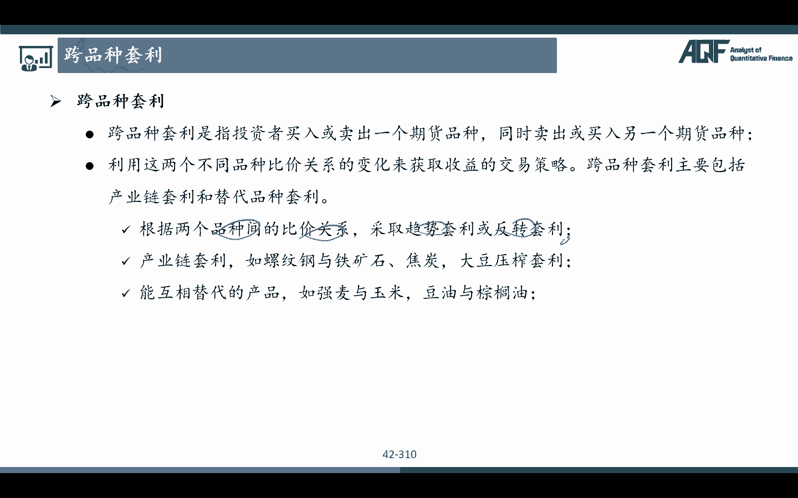

能相互替代的一些东西啊，那么在我们这个里面的话呢，比如说我们在这个里面举个例子啊，跨品种套利里面，在我们黑色产链链当中，我们有一个比较常见的一个组合，就是第一个就是我们的一个螺纹钢。

还有一个是我们的一个热卷板，好，那么一般来说啊，这个我们认为比如说热卷板这个这个这个成本，要比螺纹钢的一个成本高个200元一吨左右，对吧好，那么下图的话呢，是热卷板和螺纹的一个价差的一个走势。

大家可以看到啊，两者的价差就是拿热卷板去减去，我们的这个螺纹钢这个价差的走势，你会发现有些时候高，有些时候低对吧，它有一个均值平均就是多少呢，在过去啊，06年一四年到106年左右啊。

大概是200元一吨左右，所以啊我们认为对于我们来说的话呢，只要我发现两者之间的价差，比如说足够高，或者两者之间的价差足够低的时候，我们认为这个价差是不是又会回归啊，对吧，哎。

所以当我们因为它是围绕在200之间，差不多波动嘛，所以我们的现在的这个量化的这个strategy，我们就很明显了，很简单，就比如说当我们的价差，这个低于50块钱的时候，我们就怎么样，嗯嗯这个做多热卷板。

因为这个一般来说热卷板是不是要比过，比我们贵个两百两百元一吨左右啊，那现在如果这个价差比低于了，我这里的这个咳咳，50的时候，我们就做多热卷板，同样的道理在这个里面，在这个时间段上啊。

我们发现这个价差已经很高了，当额超过350了对吧，所以超过350的时候的话呢，我们会发现这个时候入了卷版，可能就是额价格相对于螺纹就太高了，所以我们就可以做空热卷板去做多是吧。

我们的这个咳啧弱文稿没问题吧，哎所以的话呢在我们这个里面这样的话呢，我们的这个策略也可以获得获得一定的这样的，一个稳定的一个收益啊，当然了，这个策略的一个风险也是我前面跟大家讲的，虽然我们知道啊。

大概率很可能或者说很大的一个概率，这两者的spread会回归对吧，一个做多，一个做空，我们就可以赚到这两者当中的一个差，额的那个spread，但是一但还是那句话，如果说我们的基本面。

发生了系统性的一个改变的话，我热卷板的价格就一直往上涨，它就不会他就不不不和富贵，所以的话呢在这个时候热卷板一直在往上涨，那么我们不断的在去做空热卷，去做多落温钢的话。

这个时候你就会产生一个非常重大的一个损失。

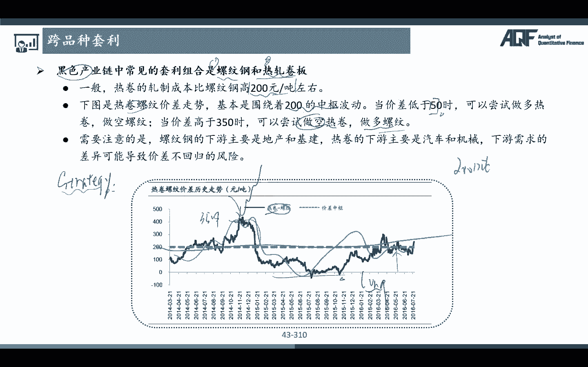

没问题吧，哎好，那么前面啊跟我们我们跟大家讲的都是一些啊。

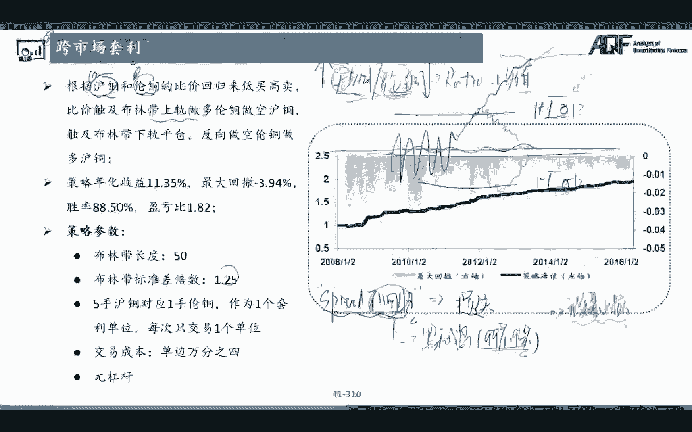

我们市场上看到的一些例子，但是的话呢呃我们接下来要和大家介绍的就是，在我们AQF里面，我们是带着大家完整的去实现了这样的一个，pair trading的这样一个交易策略。

而且我们拿的是股票的这样的两个之间的一个，配对交易啊，呃那么这个策略的话呢，我们后面再讲，我们具体的配对交易的策略的时候，还会来去跟大家讲，那么在这个里面啊，我们是选了两个酒类的一个股票。

因为大家注意我们一般做配对交易，同一般来说我们可以选择同行业的一个股票，对吧好，因为对我们来说，我们选择同行业的一个股票，是因为配对交易，最终我们是要long一个，我们要怎么样shut一个。

所以如果是针对同行业的股票的话，那么整体的这些市场的系统性风险，包括我们所面临的一个行业风险，通过我们的long一个shot，一个是不是这个相互都统统对冲掉了对吧。

那么剩下的就是我们想要图的这个spread，那个价差风险，所以当我们发现这两个股票啊，这个在历史的情况下来看，都是同涨同跌的，或者说有一定的这样的一个比值关系的，但是但是我们发现啊，在某一个阶段。

比如说一只股票一直在涨，另外一只股票呢啊这个啊一直在跌对吧，所以我们可能就会觉得这两者，这两个股票它的价差不应该差的那么多，所以呢我们就分别做多，分别做空，对应的低估和相比较来说啊。

这个相对而言的高估和低估的那个股票，然后呢，最终当我们的这个，我们认为这个spread回归的时候，我们就可以赚到钱了对吧，所以的话呢整个配对交易的这个策略的呢，那个思路。

包括大家可以看我们后面的那个课程呃，我们最终绘制出来的那个净值曲线啊，都是非常不错的，而且这个交易策略，这个策略大家可以好好去学一下，因为对我们来说，不止股票可以这么用，前面跟大家说跨市场啊。

然后呢跨品种之间的那些套利，其实都可以使用这种方法吧对吧，而且是非常非常好用的一个点，那么呃呃因为对我们来说，我们前面跟大家讲过，我们的这个配对交易，是不是可以用来做我们的收益增强啊，对吧。

哎因为在中国啊，我们现在做收益增强的方法，还是相对来说比较有限的，比如什么打新股啊，这些中签率都不一定会很高，但是配对交易的这种，只要我们发现长时间的满足，我们这个里面的这种写证关系。

然后呢两个股票的价差啊，差的原来他可能是在同某一个均值附近，但是的话呢，现在如果差的足够高或者足够小的话呢，我们认为都可能会有这样的一个统计，配对套利的这样一个机会对吧，统计套利的一个机会。

那同样的道理，这个交易策略最大的问题还是什么，唉还是如果这两个股票，由于基本面发生了重大改变，比如说一个正变得非常非常好，一个呢它恶化的非常非常严重，那么历史上的那个均值的那个水平。

他可能都不会不再有效，它的价差又会怎么样，一去不复返对吧，唉所以的话呢在这个时候，这个就是嗯配对交易或者统计套利策略，最大的风险95%，99%的情况，我们可能都是赚钱的，但是只要有1%的那个情况。

我们这个发生了黑天鹅的那个事件，我们就会发生一个比较大的一个损失，没问题吧，哎那么呃不只是统计套利了啊，这个黑天鹅的那些点啊，会运用到非常多的一些方面，那在我们这个里面可以再跟大家讲一个例子啊。

就是LTCM长期资本管理公司的一个case，那么长期资本管理公司啊，他当时就非常厉害对吧，在出事之前啊，每年30%左右的这样的一个增长额，复合收益率，那么而且的话呢，就是很多好几个诺贝尔经济学奖的得主。

是不是在一起搞的这样一个对冲基金啊对吧，那么他当时做的一个策略是什么呢，他就做多什么，他其实有点我们的统计套利的一些意思啊，他就做多一个叫做公司债CORYBD，然后的话呢去做空他的那个什么。

来做空一个到叫做他的一个国债好，那么大家注意啊，在正常情况下，这个策略其实是很能赚钱的，因为做空国债拿了钱之后，我们就可以去买公司债，而且我们知道一般情况下，公司债的收益是不是要比国债的收益。

是不是要来得高啊对吧，同时我买到了公司债之后，我可以抵押出去，我可以拿到钱，接着再买公司债，所以托马说像这个策略，他是举了大量的杠杆的，听明白吧，哎好，那么这个策略在正常情况下都能赚钱。

因为确实这两者之间的那个价差就放在那嘛，对吧，是收益的利差就在那，但是呢他当时发生了一个什么呢，当时他没测算到的是，俄罗斯发生了一个国债违约，俄罗斯说我国债不还了。

那这个时候一个国家的国债发生了一个违约，是不是事成陷入了极度恐慌，所以他又发生了一个叫做flat to quality，大家都去买国债，抛售各种各样的信用债，那么买国债国债价格大幅上升，你是做空的。

你就悲剧了，同时大家都去抛售这种信用债公司债，然后呢你的价格就大幅下跌，但是他的这个交易策略，正好跟市场的那个走势是完全相反的对吧，哎所以托马说啊，包括配对交易，只要涉及到你做多一个做空一个啊。

其实都可能会面临这种价差不回归。

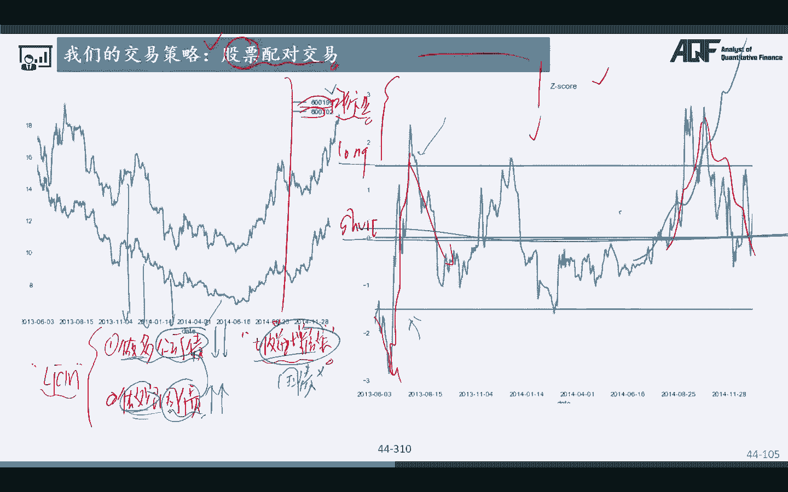

或者说发生黑天鹅的那些事件的那个问题，明明意思吧，好，那么接下来啊。

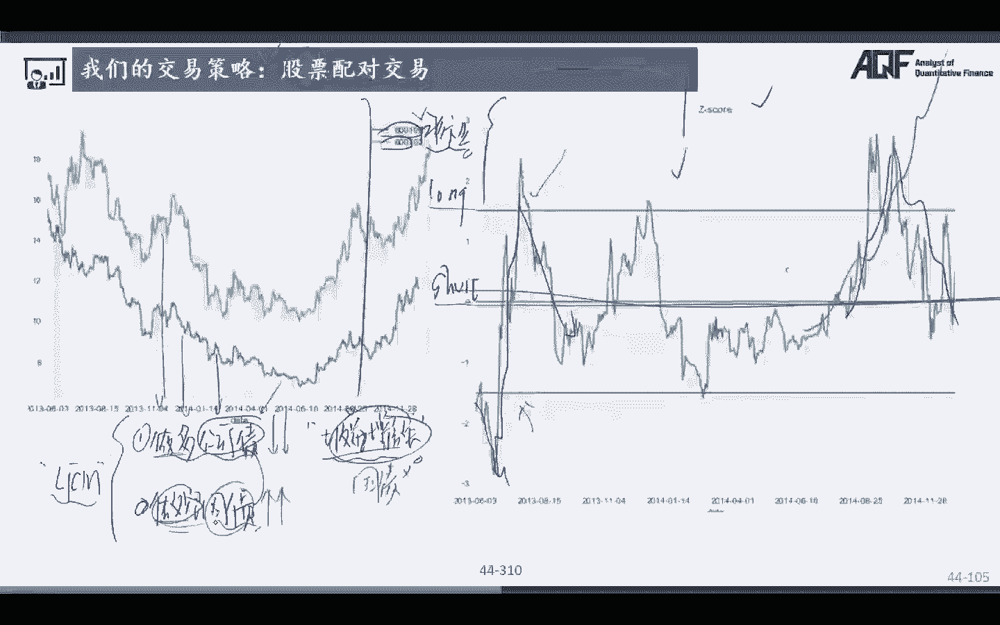

我们再来跟大家总结一下，我们这个里面的统计套利的这个呃，策略的一个思路，那么大家注意这套利的话呢，我们其实哎现在大家可以知道，为什么我们把它叫做统计套利啊，讲完这么多之后，大家就可能感觉出来了。

因为这个策略能否赚钱，是不是依赖于统计学上的一些思路啊，比如说他是否满足我们的这样的一个协整关系，然后呢他满足是否满足我们的之后跟大家讲的，大数的这样的一个均值什么唉，均值回归的这样一个点啊对吧。

所以对马来说，他可能95%，或者是说99%的情况都能赚钱，但是他的一个最大的问题就是，如果说他的基本面发生了恶化，或者说真的类似于发生了一些黑天鹅事件的话，就会对我的这个strategy。

造成我们的一个致命的一个打击，所以的话呢在我们这个里面，策略的止损啊的那些点，其实对我们来说是啊比较重要的，听明白哎，那么跟统计套利相对应的啊，我们跟大家讲过，额，之前也跟大家提到过，叫做无风险套利。

无风险套利有点像什么意思呢，就是这个spread是一定会回归的，我们说套利现在可能有价差，但是这种价差其实是基本上都确定是会回归的，就比如说我们前面跟大家提到过的，我们的ETF跟它的底层价格，资产。

底层资产之间的那个价格算不把万呢，统计套利这个理念啊，嗯毕竟我们也是做多一个做空一个对吧，但是因为ETF的这个价格，就是这些底层资产的这个价格，所以针对的是同样一个东西，所以对于这个来说。

我们认为它发射黑天鹅的这种的分，几乎情这这个风险几乎没有对吧，因为它是针对同一个东西的，听明白，再比如说我们后面会跟大家讲到一些，我们的一些ETF的套利，Etf，其实它有两个价格。

一个是二级市场的price，是二级市场的一个market pass，还有一个的话呢是一级市场的这个基，金的NAAB，因为这两个都是针对某一个ETF的一个价格，只要这两个价格足够大，不相等的话。

我们也会发生产生这样的一个套利机会，而且这个套利的空间是一定会复归的，因为这两个价格针对的是相同的，一个底层的那些资产，听明思吧，所以统计套利和无风险套利，最大的一个区别是无风险套利。

基本上只要发现这个机会，你做多做空好了，这个基本上都是一定，只要你收到期，未来是一定能赚钱的，所以他是无风险的，统计套利的话呢，是依赖于统计上的这样的一个数据呃，现象来进行的这样一个套利。

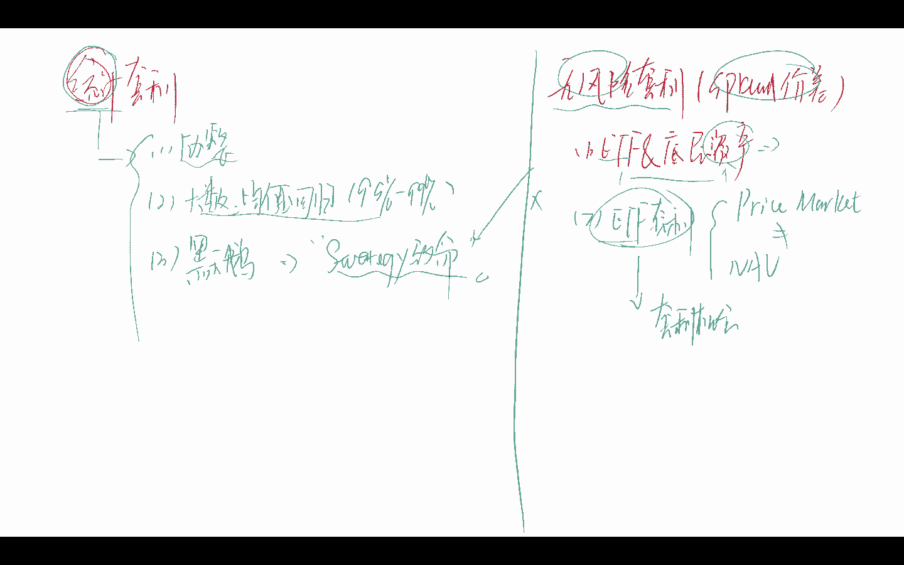

听明思吧，哎好，那么在这个里面的话呢，我们就跟大家介绍完了，第一个统计套利的一个策略。

这个统计套利的话呢，在我们ACFT的课程当中，是有完整的Python的一个实现的，希望大家可以好好啊。

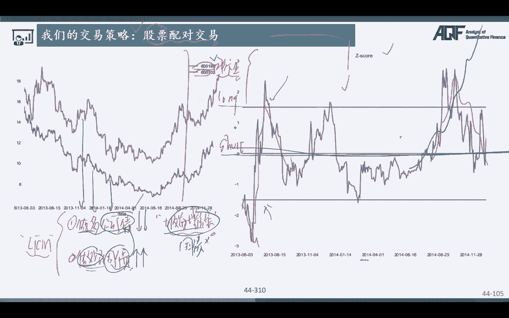

