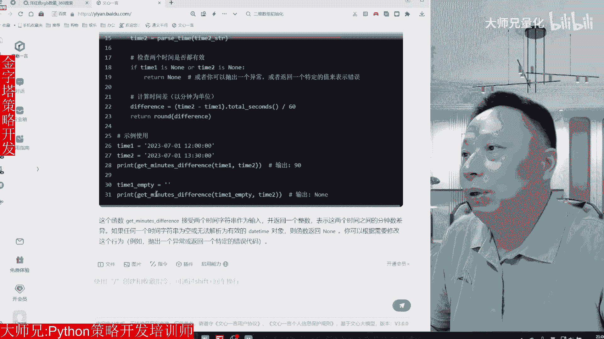
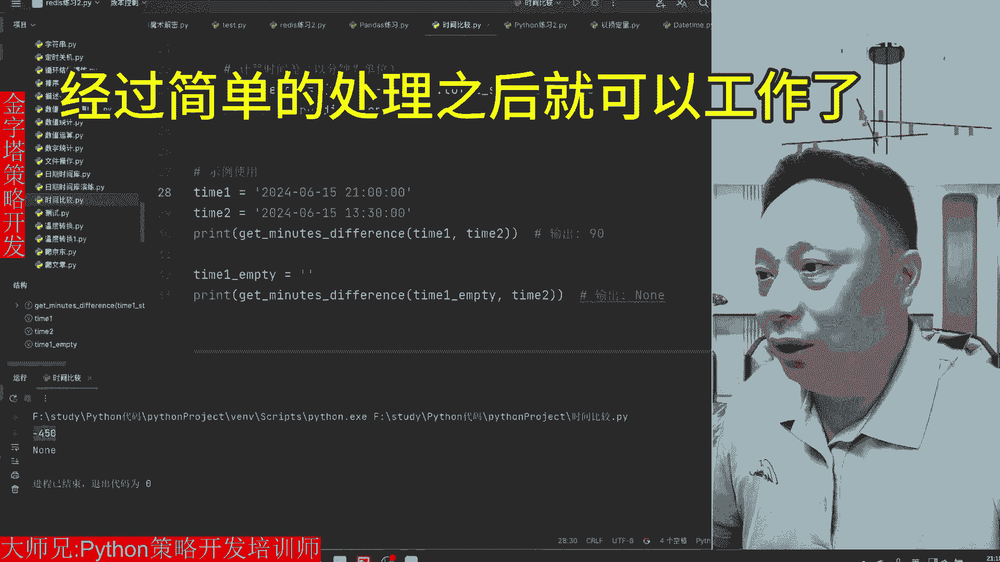
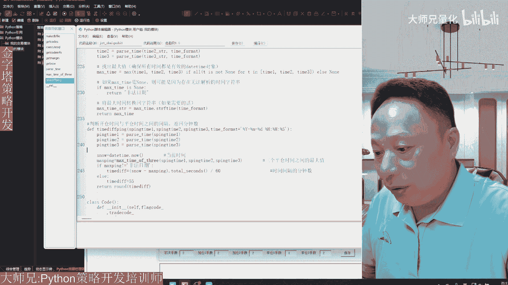
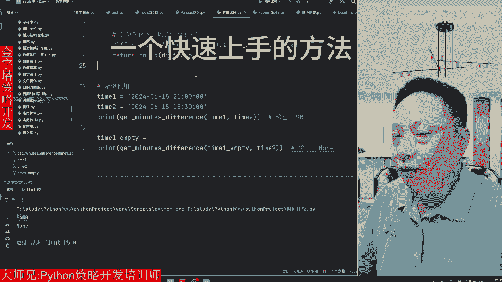

# 平仓之后等待15分钟在开仓，Python代码怎么实现，用AI自动帮你完成！ - P1 - 大师兄量化 - BV1u4421D74N

说一个订单平仓之后，需要间隔至少15分钟才能再次开仓，这样的代码我们用Python来怎么样来实现呢，其实我又又又又偷懒了，这一次我们用文心一言来帮我们来写这个代码，首先呢在文心一言里面提一个问题。

说Python比较两个时间之间的间隔的分钟数，时间值有可能为空，然后呢他就给你回答问题，同时写了一段代码，我们来看这段代码引入了daytime这个时间库。

然后其中包括了data time和这个tan delta这两个对象，然后呢有一个函数，这个函数是得到他两个时间之间的这一个间隔，下面有一个函数呢是对日期进行一个字符串，转日期的一个判断。

如果说他是一个有效的日期字符串，就把它转换成日期型的这一个变量，如果不是一个有效的日期型的，或者是一个空的字符串，那就返回为long，然后呢，下面就对我们传进来的两个变量进行一个。

首先是对它进行数据类型的转换，转换成日期型，然后判断这两个变量是否为long，如果两个其中有一个是NM，也就是它是一个无效的日期值，那么就返回NM，否则呢就计算两个时间之间的间隔。

两个时间之间的间隔呢用的是date2减date1，然后它中间间隔了多少秒，Tter seconds，把这个秒数除以60，就得到分钟数，然后把这个分钟数，把它用四舍五入的方式取整以后，返回给我们的调用者。

这就是整个代码的逻辑，那下面呢还有个例子给你输出了两个两个时间，这个是2023年7月1号12点和，2023年七月一号的1。30分，然后得到他的输出是90分钟。

下面还有一个例子，当有一个时间是空值的时候，它得到两个时间的比值的时候，返回的是long，那我们想验证一下这个代码能不能工作，很简单，我们复制代码对吧，打开PYHR这个开发工具粘贴过来，粘贴过来以后。

我们看看是不是原模原样，然后按右键选择运行时间比较，结果出来以后就是90和NM，是不是跟他那个输出一模一样呢，那如果说我们把这个时间改一下，改成今天现在的时间，2024年，20一点，然后下面是11呃。

下面是13。30分，我们再来输出一下运行，好结果出来了，这个结果是负的450，也就是说下午的01：30分到晚上的九点钟，相差了负的450分钟啊，这是时间的比较。

那把这一个调用到你自己的Python策略中去，经过简单的处理之后就可以工作了。

我们来看一下最终我写的这一个代码，好把这个日期时间转换的这个函数放在这，然后呢这里有一个时间差，时间差传进来参数，然后计算计算的时间差，最终返回到我们想要的那个数值，而是我这里用到了三个日期。

那三个日期呢我要取其中的一个最大的日期，这里面运用的另外一个函数叫做max ten of three，这个呢就是判断三个时间之间的最大值，其实根据刚才那种逻辑，你自己去处理一下，也很容易去理清楚。

这就是我们怎么样来利用AI工具。

来替我们写代码的一个快速上手的方法。

