# 年度最佳,逆势大涨？什么量化策略今年比四大行还猛？甚至半年零回撤？Python量化A股换手率，炒股软件都能实现的简单量化选股策略！【量化投资邢不行啊】 - P1 - 量化投资邢不行啊 - BV1Wz421v7fj

2024年上半年，你在A股赚到钱了吗，还是倒在了，轰轰烈烈的第58次3000点保卫战当中。

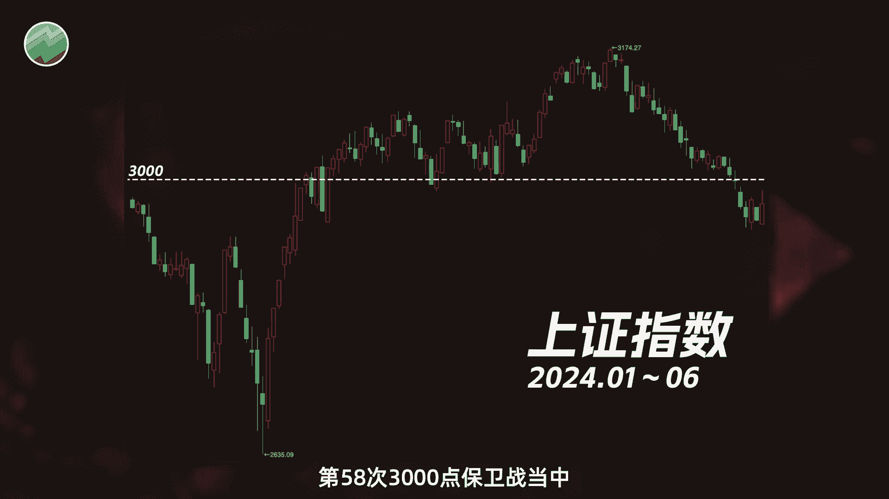

有人说今年的A股买什么亏什么，除非你交易的是那些高息股策略。

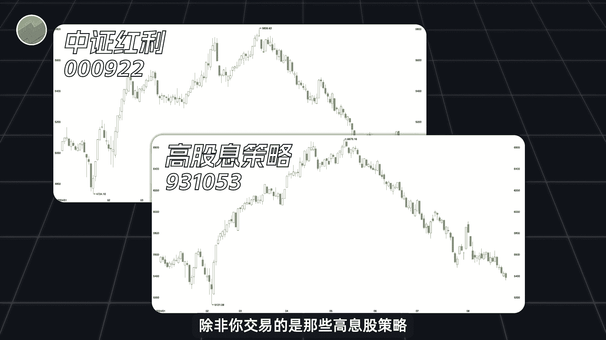

但我说半年多的对家根本轮不到他，比如说图中这个很简单的选股策略，半年内涨了24%，最大的一波回撤也才跌了4%，这难道不比买高息股策略香多了，更关键的是，这个策略一点也不复杂。

只用到了一个非常简单常见的选股指标，那这个策略的原理到底是什么呢，具体又是如何运行的，本期视频我们来做相应的介绍，大家好，我是专注于量化投资的，行不行，今天我们要介绍的策略。

他用到的选股指标呢来源于换手率，有一定市场经验的朋友，应该或多或少都知道换手率这个指标，它的计算公式呢是这个样子的，比如说我们用当天的成交量去除，以这个股票总的流通股数，就可以得到这个股票今天的换手率。

ChatGPT说呢，换手率即是衡量一定时间内，市场中股票转手买卖频率的指标，也是反映股票流通性强弱的一个重要指标，那么说人话就是换手率，可以表示有多少人正在买卖这只股票，一只股票的换手率越高啊。

说明他最近的交易越频繁，对它感兴趣的人越多，他越热门，反之就说明这个股票越冷门，在A股呢有个著名的龙虎榜，上面的股票都是每天表现异常活跃的，登上龙虎榜的条件呢如图所示，只要满足其中任意一个条件就可以。

其中啊和换手与相关的灯榜条件就有三个，可见换手率同样也代表了股票的活跃度，然后呢很多人可能不知道，换手率这个指标不仅仅在股票上会用到，在基金中呢也经常会使用，基金的换手率，反映的是基金投资组合中。

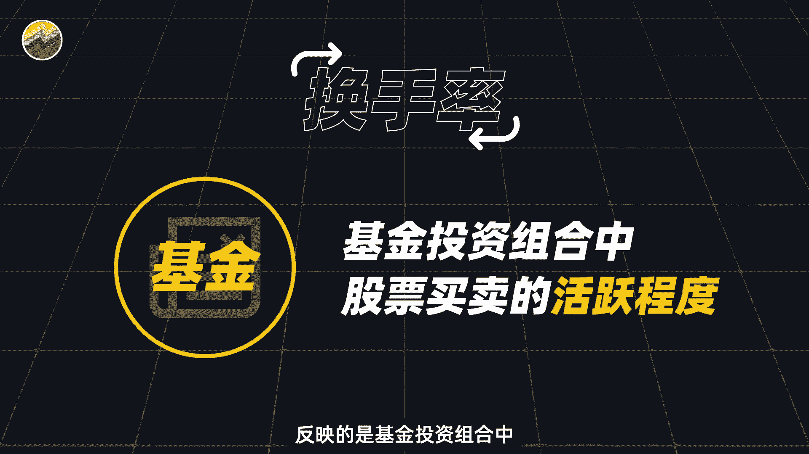

股票买卖的活跃的程度，如果基金换手率很高啊，意味着基金经理在频繁的买卖股票，他的风格呢可能就是交易型或以短线为主，基金换手率低呢，则说明这个基金经理更偏向于长期持有的策略。

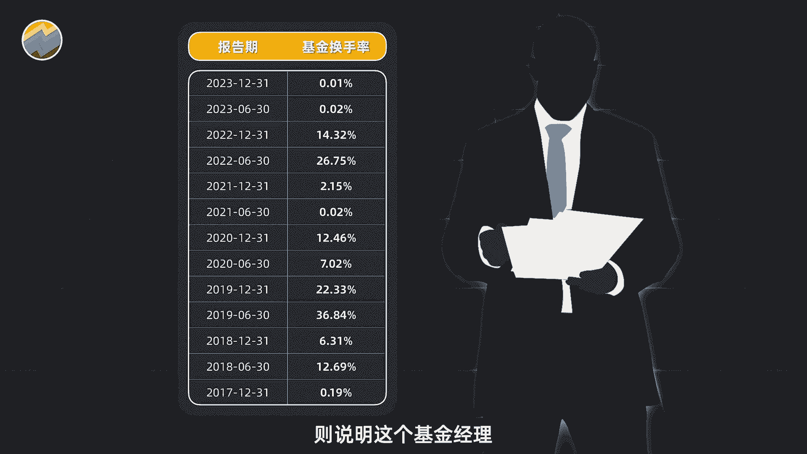

可能是价值型投资的，所以啊在基金评价体系当中，也经常会使用换手率指标来衡量，基金经理的风格是保守还是基金，除此以外。

换手率这个指标呢，甚至还可以用来衡量股市的交易者，很多学术论文一般会认为交易者的换手率越高。

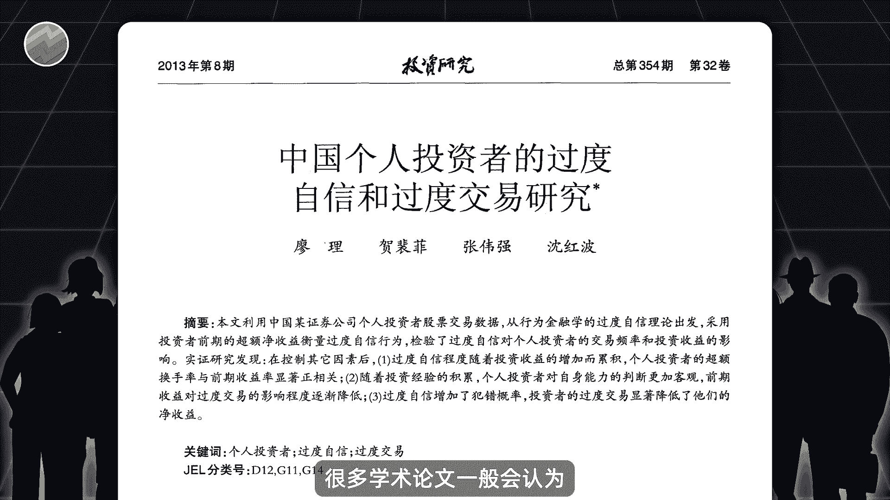

超额收益呢就会越低，也就是说你交易的越频繁，其实会亏的越多，那我们呢就统计了全球各个交易所，投资者的换手率啊，可以比较明显的发现，大A的换手率在全球也是独一档的存在，属于遥遥领先了，这个换手率就相当于。

A股公司平均每年要换2。7次流通股股东。

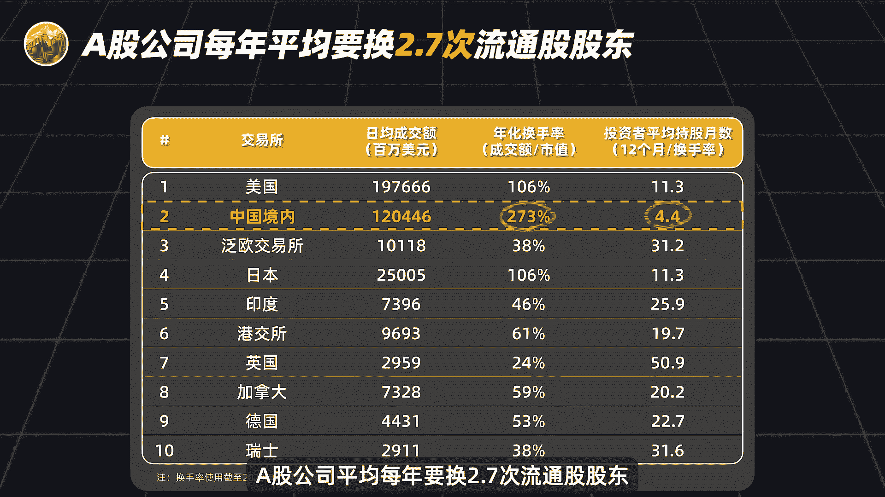

也就是每四个半月就要大换一次血，那么这么高的换手率下，其他市场每天都生活在上涨的恐惧当中。

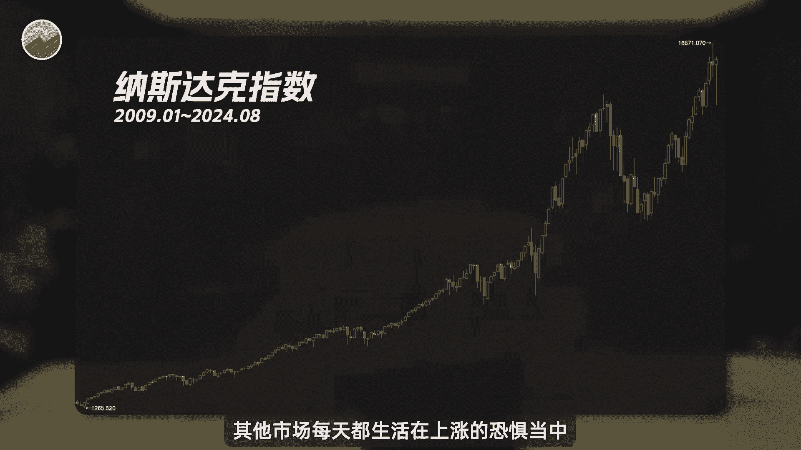

而大金融消费者们每天都在3000点保卫战当中。

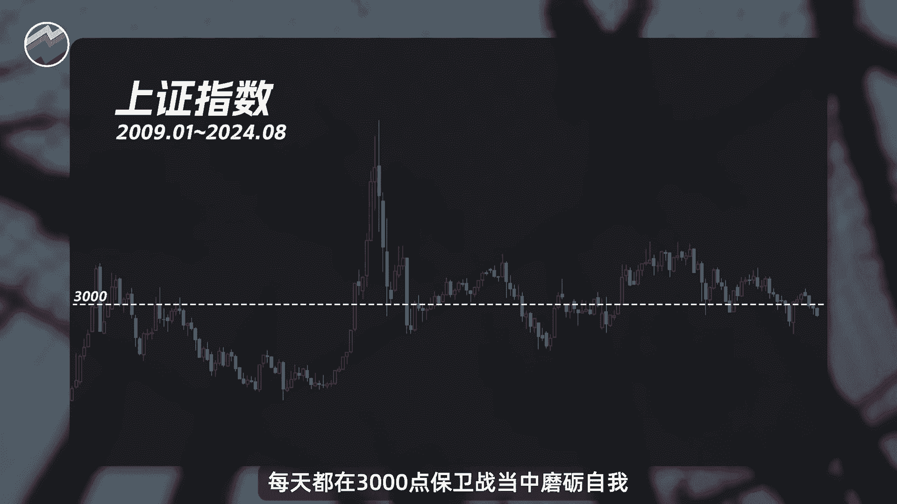

磨砺自我，也就情有可原了吧，但话又说回来，虽然我们交易频繁一直在亏钱，但贡献的交易手续费也比其他市场更多呀，这可是我们股民实打实的功劳，当然我们也有理由相信，未来市场越来越成熟的情况下。

投资者呢也会越来越成熟，市场整体的换手率啊也会向其他市场靠拢，整个市场呢也会越来越好，大家也能真正的在股市当中赚到钱，好说回我们的换手率指标啊，既然换手率越高的股票，它的流动性越好。

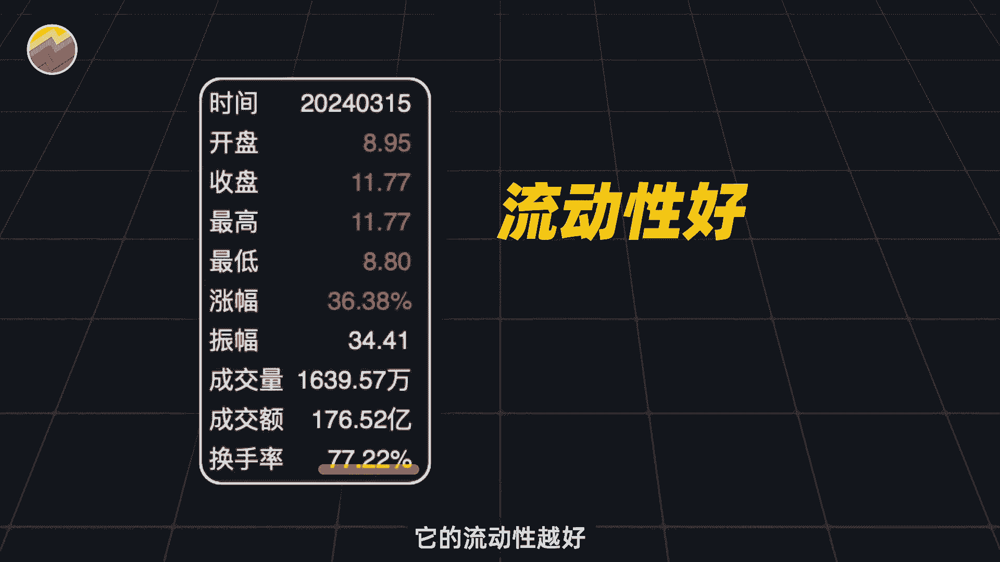

越被市场重视，那么我去买换手率高的股票，他能不能帮我们赚到钱呢。

假设我们在每个月的最后一个交易日结束之后，把所有股票按照过去20个交易日，换手率的平均值从大到小进行排序，当然啊，这边要删除掉那些当时已经s st或者退市停牌，以及上市没有满一年的股票，之后呢。

我们就挑选出此时换手率最大十只股票，然后呢，我们就在下个月第一个交易日的开盘，去均仓买入这十只股票，并且呢会一直持有下个月一整个月，直到次月的最后一个交易日，把它全部卖掉，然后重新去选择次月20日。

换手率最大的十只股票，并且呢在下下个月的第一个交易日去买入，如此循环往复，比如说途中我在24年的5月31号这一天，在所有股票当中选中了这十只股票，因为他们在此时此刻是换手率最高的十只股票。

那么我就在下个月的第一个交易日，也就是6月3日去买入它们，并且呢一直持有到6月28日这一天，持有到这一天之后，我就会卖出手上全部的股票，然后重新选择符合条件的股票，在下个月的第一个交易日进行买入。

那么就是这样一个简单的量化选股策略。

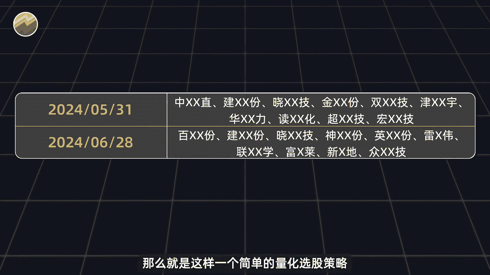

假设我从一开始去投入一笔钱去交易，这个策略最终是会赚钱呢。

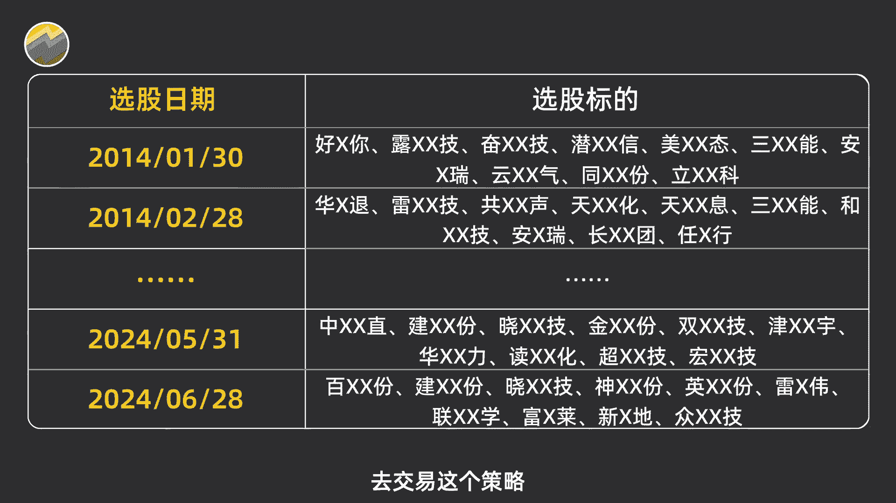

还是会亏钱呢，那么这个其实就是我们量化投资当中，最朴素的一个想法，就是用历史数据去验证一下，我们觉得可行的交易思路。

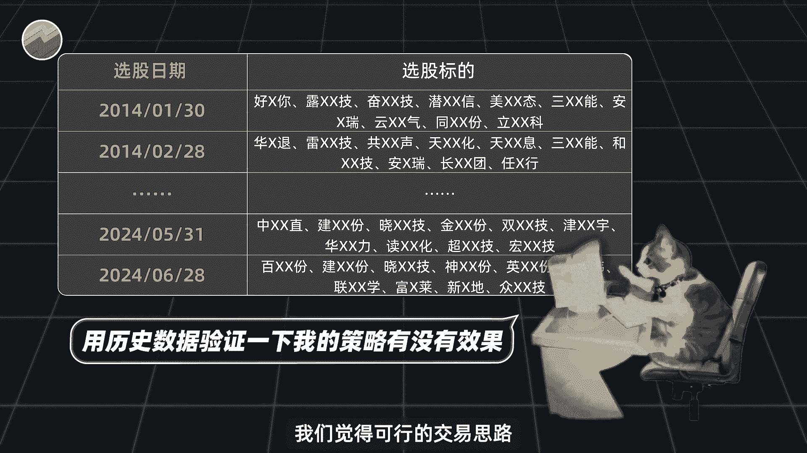

去看一下这个思路在历史上到底能不能赚钱，那要验证我们这个实验的想法。

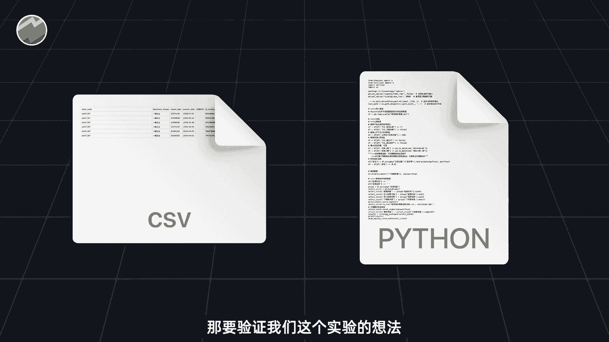

就需要借全部的历史数据和Python代码，那么相关的数据和代码，我都已经给大家准备好了。

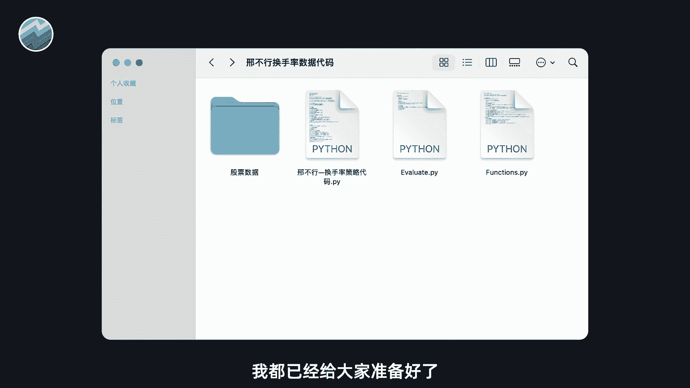

你只需要根据我给的教程去运行代码，就可以看到结果，如果你需要这个资料的话。

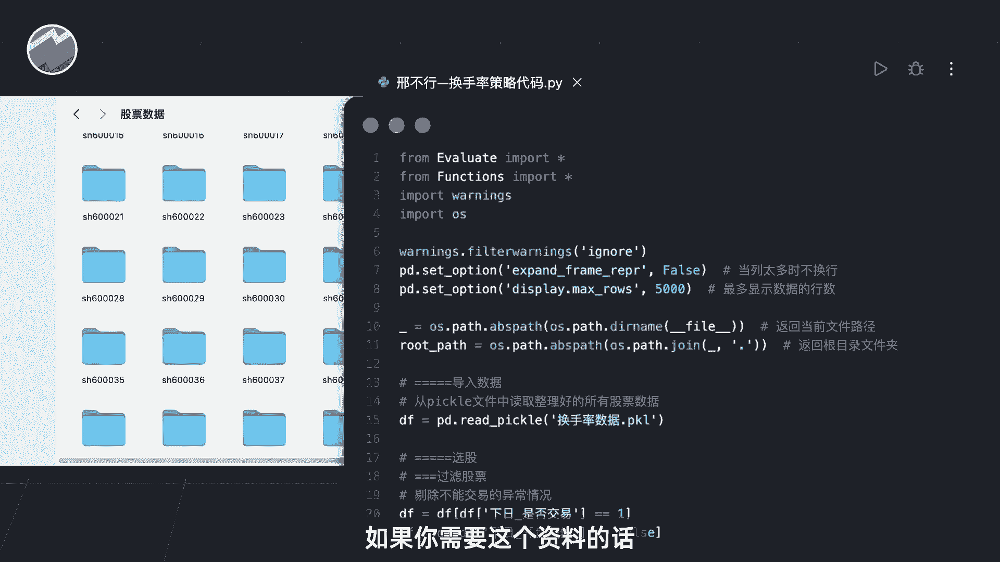

可以加指点评论区，我的微信都是可以直接发给你的，好那么我们来运行一下程序，看看结果如何。

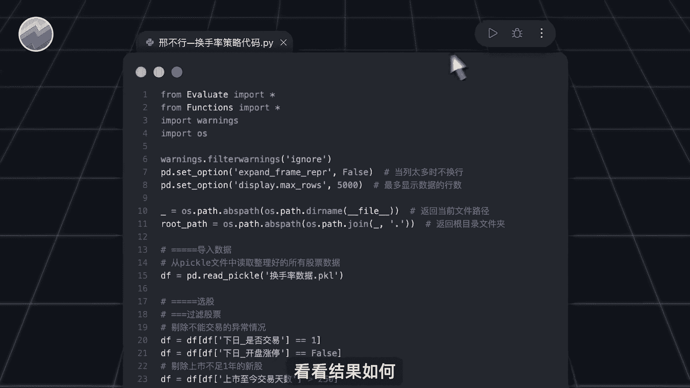

在看程序运行结果之前，先插一个题外话，很多人问我小白如何入门量化投资，有什么资料分享，所以呢我特意为大家准备了一个量化投资，新手学习的大礼包。

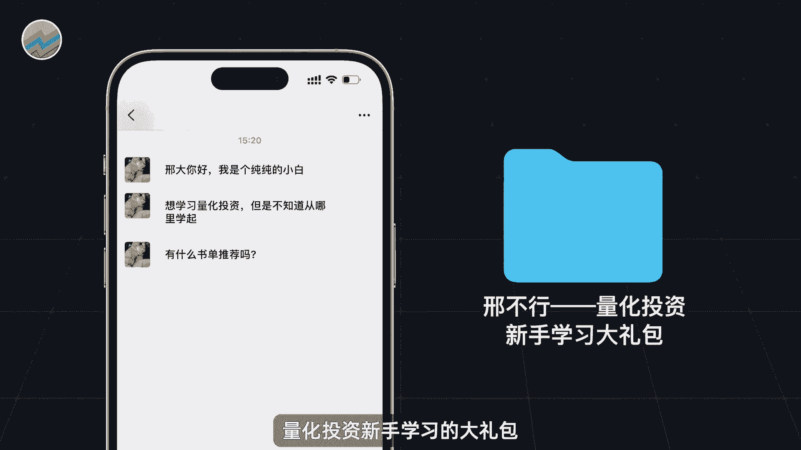

你打开这个文件，它包含非常多的内容啊，首先这个word文档呢是我们自己总结的。

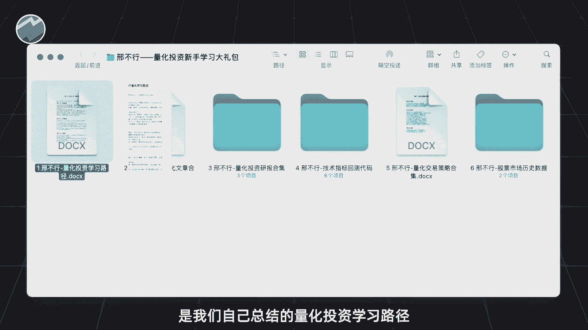

量化投资学习路径，很适合零基础的新手，让你知道自己一步一步需要达到什么样的阶段。

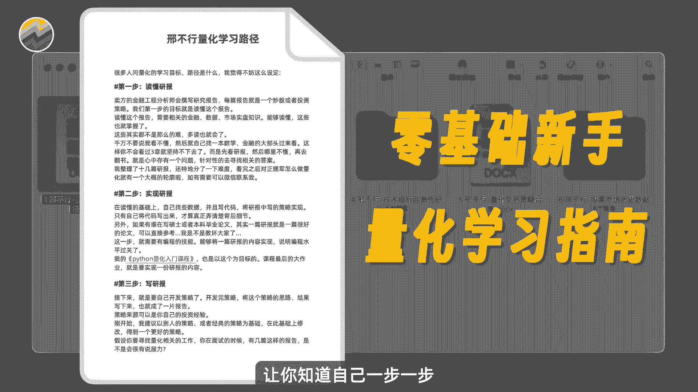

看完学习路径后呢，就可以通过我整理的量化文章合集，来更全面的了解量化投资到底是什么，然后呢，我还精选了适合各个学习阶段的策略研报合集，正如我一直说的，量化研报是很好的，量化实践项目。

深度研报可以显著提升你的量化水平，还有这一份代码呢，则适合所有喜欢技术指标的人，你可以跟着教程轻松计算出所有的技术指标，并测试这个指标是否有效，如果你有一定的基础，你还可以尝试回测一些策略。

我为你准备好了十几个不同类型的经典策略，和他们的代码，相信总有一个适合你自己去魔改开发，运用到实盘，当然最后也是最关键的，量化的基础就是准确的历史数据，我会送你一份股票，历史日线数据和一份财务数据。

你可以用它来像我一样，去测试所有的技术指标和财务指标，以及大部分的策略，所以这个大礼包的内容真的非常的丰富啊，如果你需要的话呢，可以加置顶评论区，我的微信都是可以直接免费发给你的。

好我们回来看程序运行的结果。

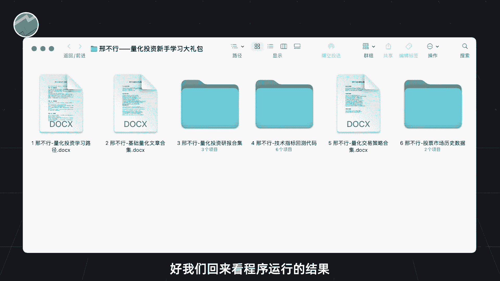

图中的橙色曲线呢是同期的沪深300大盘指数，而蓝色的曲线呢就是我们这个策略的表现，他从初始的一元钱变成了最后的0。01元。

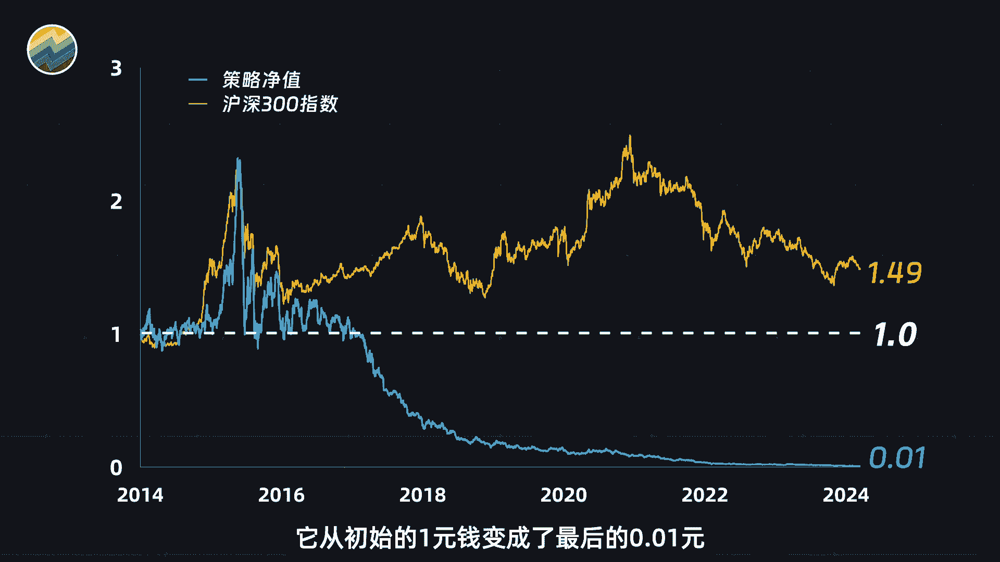

这个表现啊说是倾家荡产也不为过吧，也就是说我不断的去买入那些换手率最高，最活跃的股票，那么我很快就会把钱亏光，看来和交易者的换手率一样啊，高换手率的股票呢也是让人亏钱的，也不能碰。

这也再次证明了金融市场里面的一个铁律。

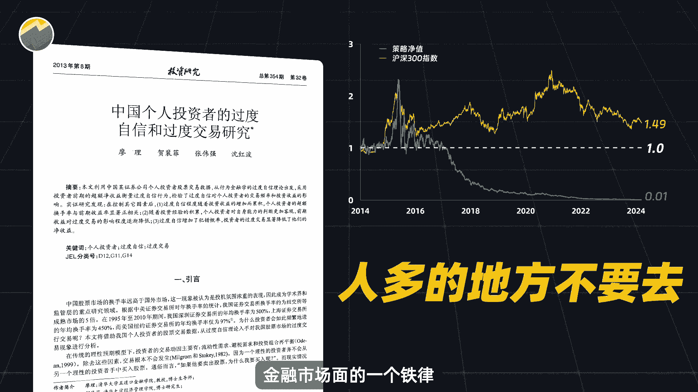

人多的地方不要去想想呢，其实也很正常，高换手率本来就代表了不同投资者，对这支股票的看法分歧极大，看好和看空的人一次次在盘口上擦肩而过，互道一声，当无法产生一致性的预期的时候，反而会压制股价的上涨。

那既然换手率高的股票不赚钱，我们反过来去想一想，去买入换手率低的股票又会怎么样呢。

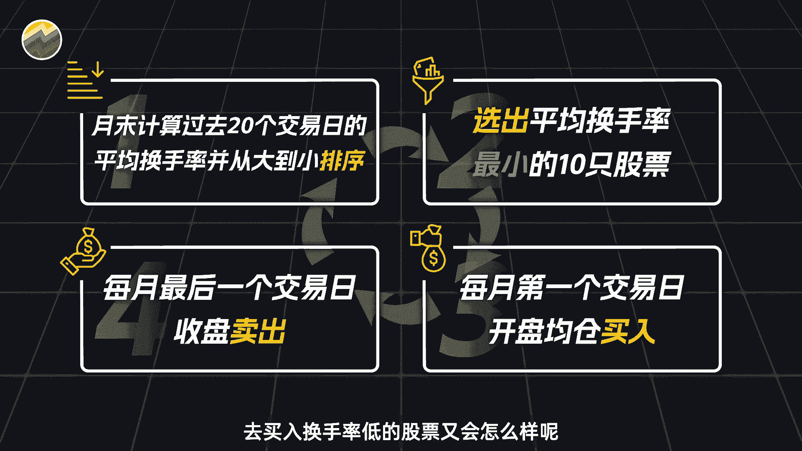

说干就干啊，因为我们之前已经准备好了代码和数据，这里面呢只要稍微改一下代码就可以。

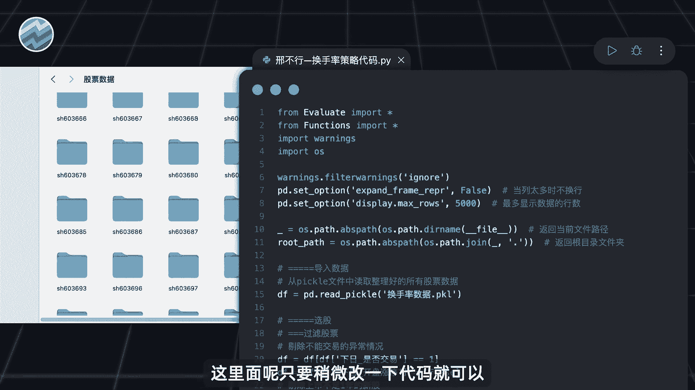

我们把选股条件改成，选择换手率最低的十只股票。

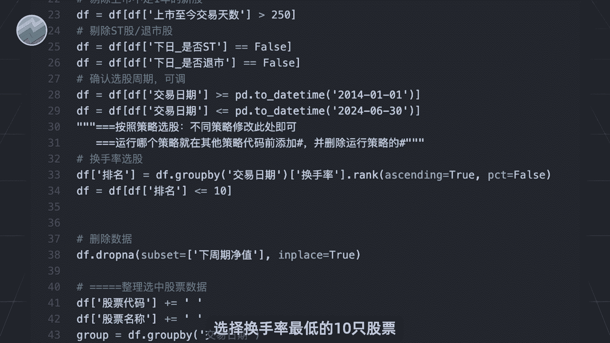

其他条件呢完全不变，那么修改后的结果就是这样子的，从2014年至今啊，代表这个策略的蓝色曲线，从初始的一块钱变成了4。88元，也就是说翻了接近五倍，远远跑赢代表了大盘的沪深300指数，年化收益的16%。

而且你看整体的曲线向上涨的是比较平稳的，也可以明显的看出，这个策略在24年的上半年表现极为优异，单独拎出来看呢，是这样的，上半年策略收益24%，最大回撤呢才4%，这个表现啊。

估计能跑赢今年99%的股民了。

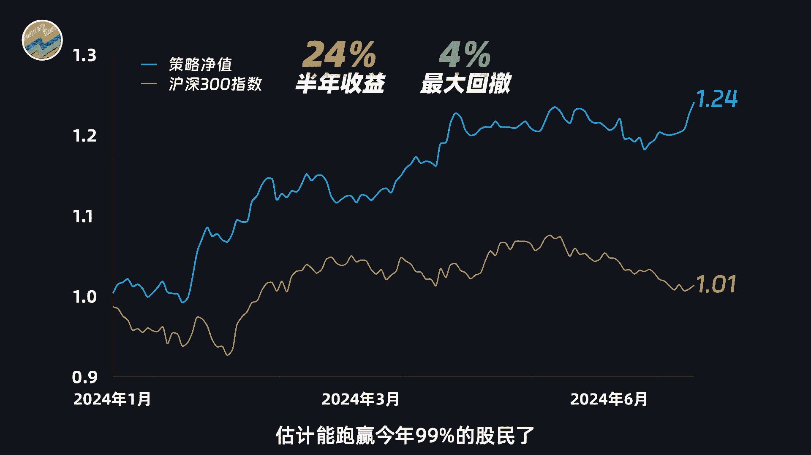

就连今年被无数的机构和散户以及公众号，追捧的额外拥挤的高分红策略。

上半年的表现呢也没有那么稳定，不光如此啊，我们也可以看一下这个策略，历史上的具体的选股，看一下这个策略到底喜欢买什么样的股票，如果你仔细观察的话，你会发现大部分都是那些基本面良好。

暴雷风险很小的大市值行业龙头，所以哪怕当市场不好，面临巨大回撤的时候，这个策略呢你也是比较有信心能够持续持有的。

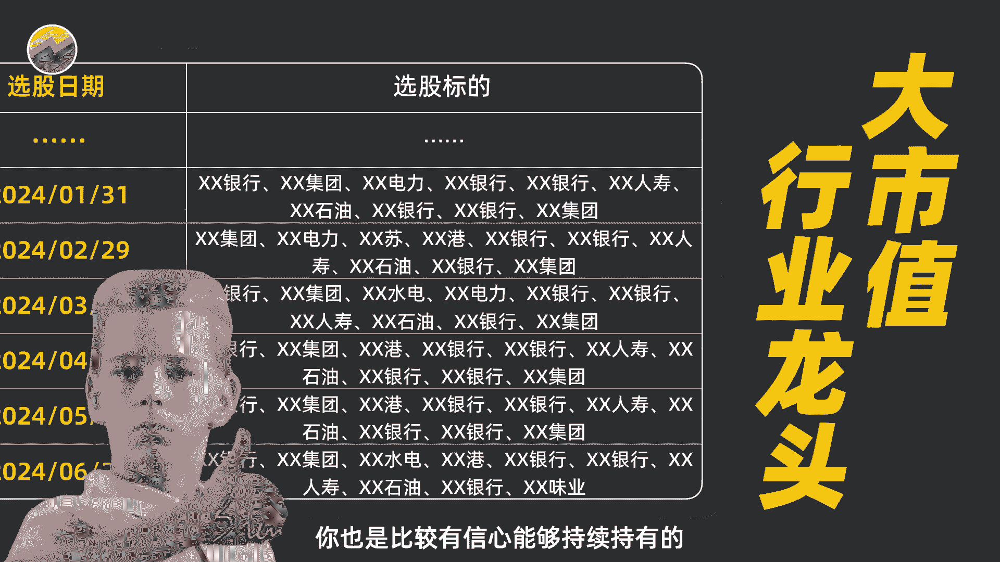

甚至啊，你完全可以把这个策略当做一个指数去投资，但是呢他又会比常见的指数更加的稳定，收益也更高，一个月呢也只需要交一次，非常适合工作学习生活比较忙碌的人去交易。

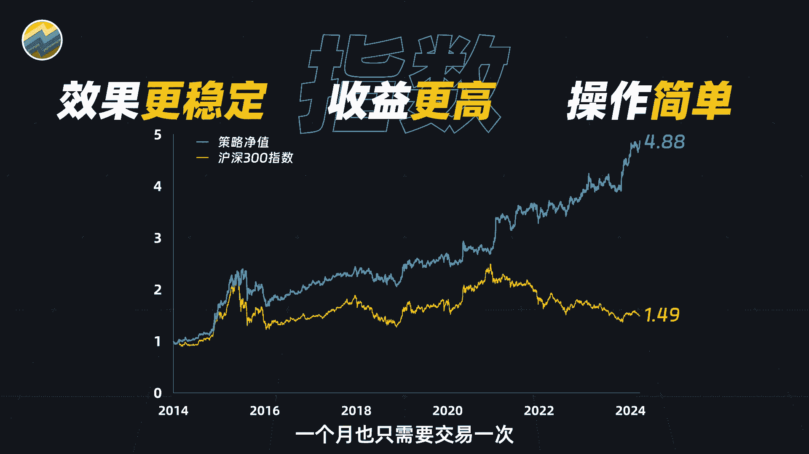

我也比较推荐加置顶评论区，我的微信问我要的数据和代码，亲自去尝试一下这个测评，甚至去魔改后运用到你自己的实盘当中。

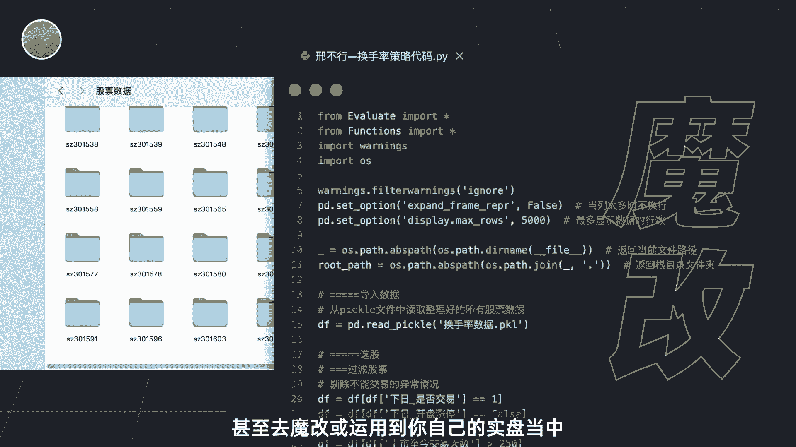

下面呢我们还会给大家提供一些新的思路，去魔改这个策略。

除了去选换手率低的股票外，我们也可以看看换手率稳定的股票，量化交易中啊，一般会用标准差来衡量数据的稳定性，标准差越小就代表换手率，数据之间的波动越稳定，当我们把策略改成去选择换手率。

标准差最低的十个股票之后呢，他的表现是这样的，又或者我们可以试着用换手率的变换率，去构建策略，他的表现呢是这样的，甚至啊你也可以加入其他的因素和换手率。

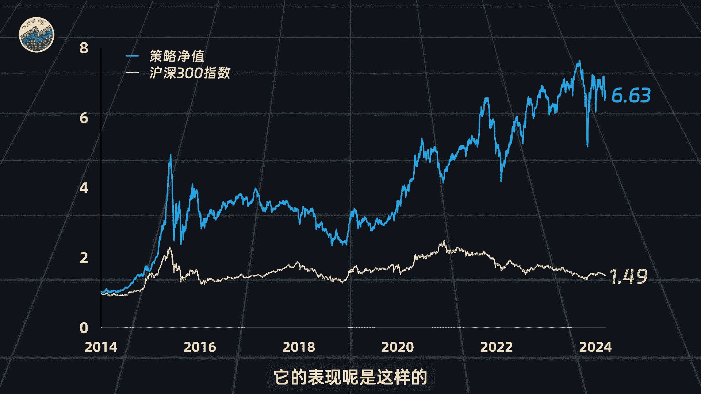

一起去进行选股，这些呢我们都帮大家归纳。

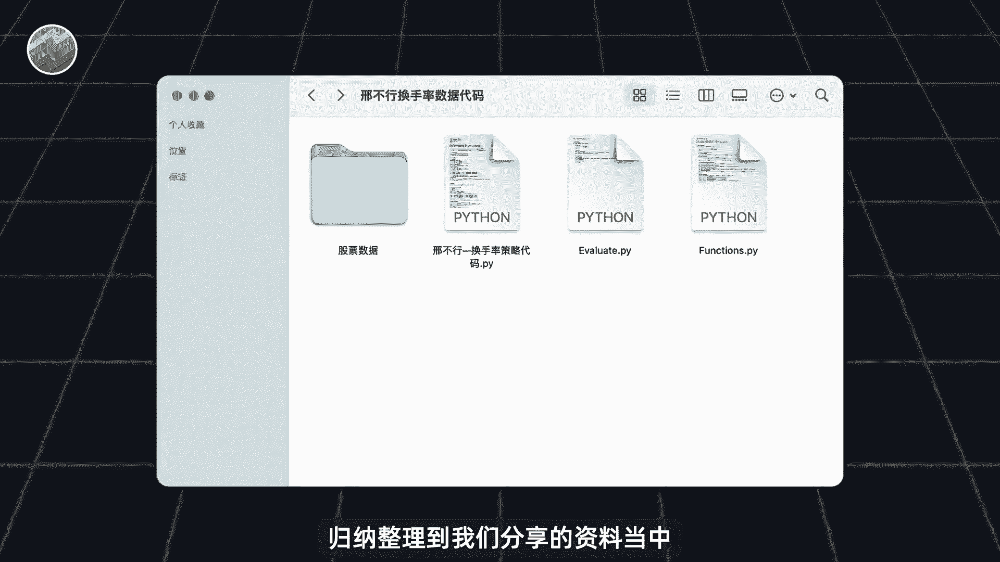

整理到我们分享的资料当中，你可以拿到数据和代码后，根据教程自己把玩去尝试，找到最适合你自己的那个策略，相信这样一份资料，可以让你切实体会到量化投资的感觉。

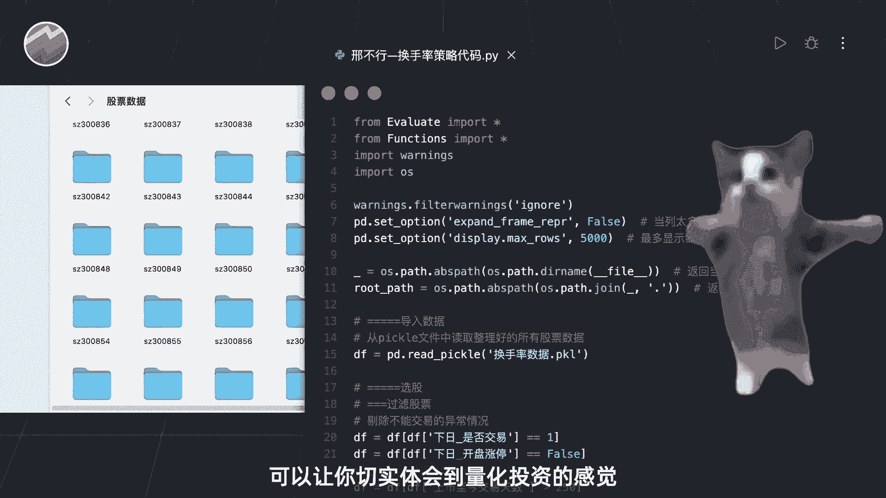

那么本期视频就到此结束，感谢大家的点赞，收藏和转发。

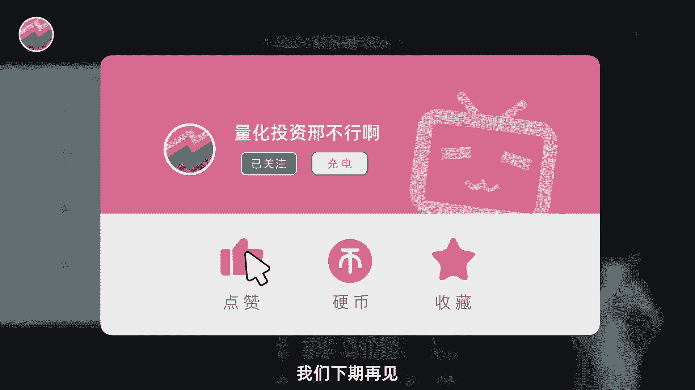