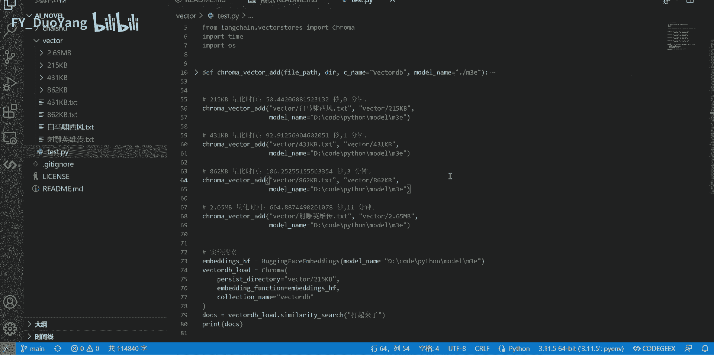
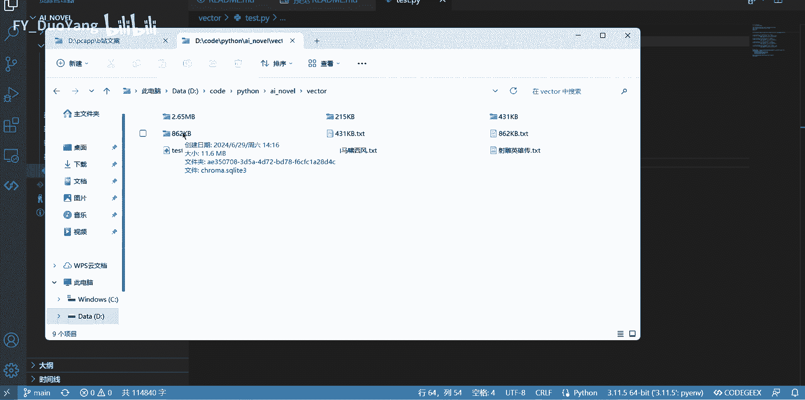
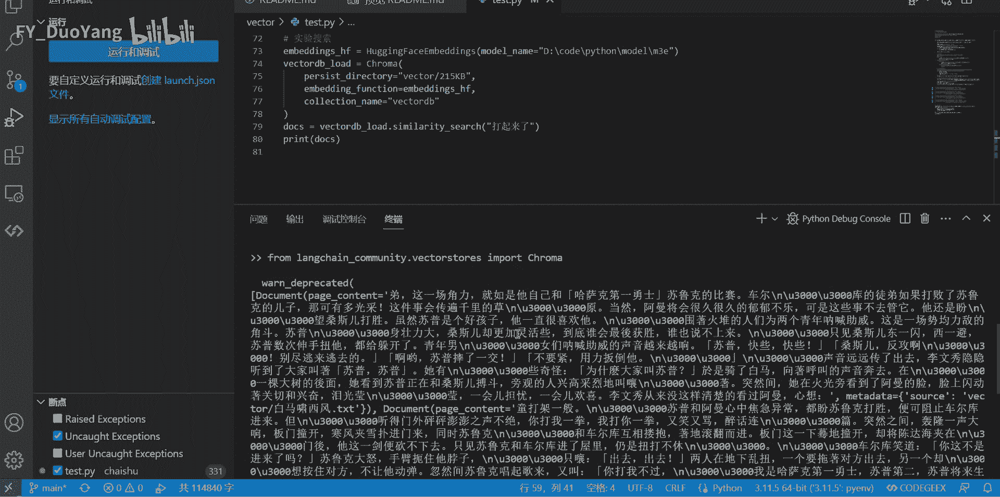

# 开源，向量化时间，大小，解答ai问答知识库，不按照上传知识回答原因 - P1：开源代码，本地文本向量化，1MB文本多久能向量化成功？ - FY_DuoYang - BV1LM4m1U7g5

很多本地AI知识库项目都需要一个必要的步骤向量化，通过把文本向量化，实现rag，从而提升AI回答质量。本地程序大多还是小机器，还是以CPU为主。这里实验CPU下不同量的文本向量化后。所需要的时间。

占应盘资源的大小。代码通过github开源，你给我一颗星星就行。向量化模型选的是对中文友好的M3E下载地址在gitthub项目中。向量化的时间已经标记出来了。接下来看下箱量化后的大小。

很多AI知识库，你发现自己的提问，不会经过知识库的内容，就是由于本地向量化还没完成。向量化时，CPU是一直高负载，其他程序打开就会卡。简单讲一下代码。读取的是本地模型，不是经过API减少网络交互时间。

这是影响向量化时间的参数。文本分割大小，分割文本越小越多。所需要的时间，硬盘资源越大。如果你直接向量化1个EMB文件，速度很快，但没意义。最后看下搜索的效果。

