# 强推！这可能是B站最全的【Python金融量化+业务数据分析】系列课程了，保姆级教程，手把手教你学 - P37：01 昨日回顾&今日内容介绍 - python数字游侠 - BV1FFDDYCE2g

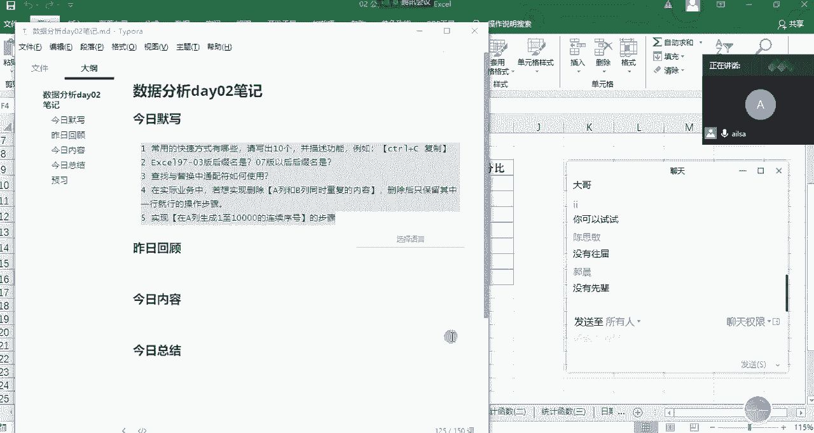

好吧，那我们进入到昨日的啊，昨昨天的讲解内容哈，那我在进行这一块儿的啊，回顾的过程当中，我们采取哈我们才去啊提问的方式啊，啊我都没有听过大家的声音啊，所以说我这边来抽取啊人员进行一个提问哈。

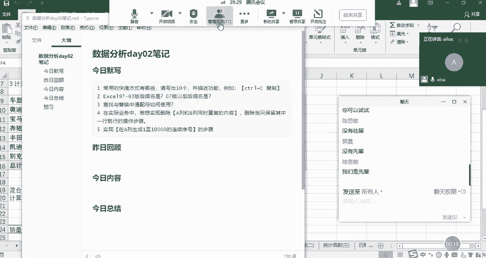

嗯首先呢我先提问一下谁呢，啊看看啊提问建号吧，啊建号我这边给你解除静音了啊，嗯能正常发言吗，Hello，喂建浩，我这边需要提问，需要你回答问题啊，来吧，别不好意思，咱们就这几个人啊，别耽误时间哈。

Hello，hello啊，快点啊，唉建浩同学你好，啊好的，那我们先说一下啊，昨天啊我们讲了哪些内容啊，你这边来带着大家一起来回顾一下哦，那首先呢先讲了额数据分析嗯，一些发展方向。

以及数据分析工程师的一些基本的嗯技能，之后呢简单的介绍下excel这个软件的嗯，就是数据表格软件的发展历史，然后呢详细介绍了一下嗯历史电子表格哈，点电啊发展历史啊，还有呢，然后呢就详细介绍excel。

是怎么从这些中脱颖而出的啊对啊，您接着说嗯，然后呢嗯就是开始介绍excel这些操作了，这些基本概念，什么是工作部啊，工作部工作表啊，以及一些功能区数据啊等等嗯，单元格一些概基本概念嗯。

那我们讲到工作表的一些操作的时候啊，大概都有哪些还记得吗，嗯就是移动复制啊，然后给它加加颜色啊，还有呢添加颜色嗯，我我我简简单只能继续提下，就OK啊，重命名哈，对不对，嗯OK哈啊那对这个其实不用记哈。

因为在我们工作当中用熟了，其实啊都知道了啊，好还有吗，嗯之后就开始讲一些快捷键嗯，OK快捷键是嗯啊那我这边简单提问你一下，我们对于快捷键啊，对我我只提问几个，因为我们今天已经默写过了哈。

啊首先嗯如果说我想啊快速选中某个区域啊，就是某个区域你有哪几种方式额选中的话，就CTRL加shift呃，然后上下左右好啊，不不是吗啊，就比如说我想选中前两列，那就是用鼠标直接点点前两页啊。

啊那OK哈哦我这样吧，我我现在打开excel哈。

我们打开我们昨天的啊，这样的一个去回顾会更好一些哈，嗯我看一下啊，我们的快捷键，稍等一下。

哎你比如说我想选中啊前三列，然后包括下面所有的行，我该怎么去操作哦，Ctrl shift加下啊，Ctrl shift加下哈啊我给你纠正一个小的点哈，就是如果说我们在咳，快速选中某一部分数据区域的时候。

没有向上的箭头啊，只有下和右，明白了吗，对只有不按住shift键的时候，是control，加上下，左右箭头去定位到我们数据区域的各个边角，明白了吗，哦对啊，您刚才可能说的啊，有点啊有有有点模糊哈啊。

所以说快速选中区域是啊，我们可以先啊CTRL加shift啊，Shift，然后再加向右或者是向下的箭头，对吧嗯对向右向下对向右对向下箭头好啊啊，然后如果说我想啊选中啊，选中啊一个数据区域的啊。

啊就是边边就是四个角啊，四个角啊该怎么实现嗯，CTRL键加上下左右啊，对CTRL加啊上啊下左右啊箭头啊，这样子哈，OKOK您的提问就到这里哈，接下来我要换一个人了，嗯这是我啊可以了，你可以关麦了嗯。

OK那这其实就是我们的嗯就是excel基础操作啊，大概大家都可以掌握这些内容就可以了，那我们的快捷键包含啊比较基础的，然后还有就是啊其他的一些啊，大家只要掌握自己熟悉的就行，没必要全部都掌握哈。

OK那我们再接下来另外一个知识点的话，就excel的啊操作技巧啊，下面我要再提问啊，一位同学哈，好我们看一下啊，看一下嗯，想想啊，那就保贺吧，宝贺我已经给你解除静音了，哈喽哈喽哎哈喽啊，宝贺同学。

我感觉我有点像博主，哈哈是吧，OK那您说一下嗯，我们在讲excel操作技巧的过程当中，咱们昨天都讲了哪些东西，嗯操作技巧有定位，定位定位的快捷方式是CTRL加G对，还有吗，嗯还有那个呃快速填充好。

我说卡定位的快捷方式还有吗，哪还有个FF12还是F5F5哈，F5，OK啊，您接着往下说，嗯接下来就是那个选择性粘贴啊，选择性粘贴，选择性粘贴，我们在昨天讲的时候都有哪两个应用场景啊，嗯一个是工资。

工资的加减，就是说集体的工资加减，还有还有还有一个就是呃统计呃，是删除公式吧，嗯对嗯，对你，你描述第一个问题的时候，我们应该这么去描述，就是说我们在对某一列数据进行一个啊，集体更更新的时候。

我们可以选择选择性粘贴，粘贴当中一个计算的方式叫加哎，这样的一个方式去实现，当然你可以选择其他的公式去计算，也可以实现，那第二个选择性粘贴，就是我们在进行excel的处理当中，有一些公式唉。

我们需要去除啊，这个时候我们可以选择选择性粘贴粘贴值，好，对不对是吧，OK啊对定位选择性专题还有吗，还有那个查找查找和替换，查找与替换，查找是那个CTRL加F替换是CTRL加H嗯，OK哈。

这个我们还会讲了通配符的查找和替换是吧，对比如那个星就是说匹配零个或者多个问号，是匹配一个字符，OK好的啊，还有吗，还有就是日期啊，日期时间格式是吧，OK这嗯你说啊你说你说你说啊，您您说就可以了。

对这就是那个日期格式，可以直接通过那个啊转换，OK哈那个嗯对OK好的，等会我会再重新演示一下这个这个内容哈，因为有更简单的一个方法哈，好的日期时间格式啊，还有吗，还有还有驱虫啊，去重复值是吧。

OK去重复值，好的还有吗，还有还有什么，还有还有CCTRL加E啊，CTRL加E哈，这个是一个快捷方式哈，啊啊这个不是我们呃我们昨天讲的内容啊，也是哈，但不是一个啊，那个啥可以可以可以写。

CTRL加E也是个很强大的功能哈，还有啥啊，有人已经给你提示了啊，看一下看一下哈哈嗯啊分分裂啊，分裂合并，分裂与合并是吧，嗯我们昨天讲了七个哈，123456，还差一个还差还差一个还差一个什么定位。

选那个店，快速填充啊，快速填充对，快速填充，我们啊讲的一个啊原理是什么呀，啊原理的话就是有一个选项里面有那个嗯，自定义或者那个excel带的定义的一些啊，设定好的一些就是选项吧。

OK就是如果说你想实践实现自己的一个，日常的一个需求的话，可以自己来定义对吧，唉因为它系统默认自带了一些常用的啊，然后你可以根据自己的一个需求，然后进行自定义的呃，呃形式去实现对吧。

OK好OK您可以关麦了啊，谢谢嗯，好的再见啊，哈哈好嘞哈，那其实我们刚才啊那个啊，建号和保号已经带着我们回顾了，昨天要讲的内容哈，昨天已经讲过的内容啊，其实我们可以发现也不是特别多。

然后在大家掌握的也也已经很好了，也已经很不错，然后啊怎么着听不见，哈哈哈好啊，那个OK那我们在啊昨天的内容。

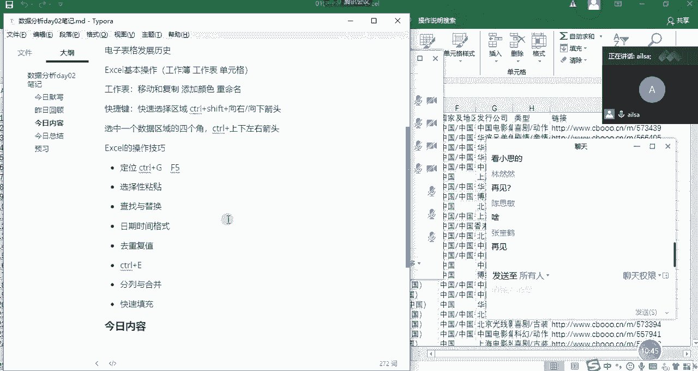

我再稍微补充一个点哈，就是啊刚才说到的啊。

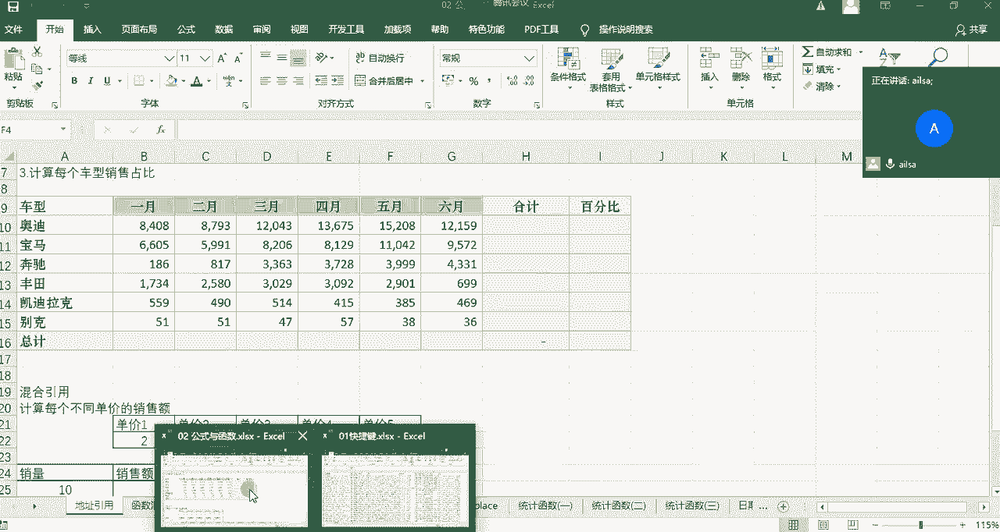

刚才说到的一个啊啊日期时间格式的啊，那个操作我再给大家重新演示一下啊。

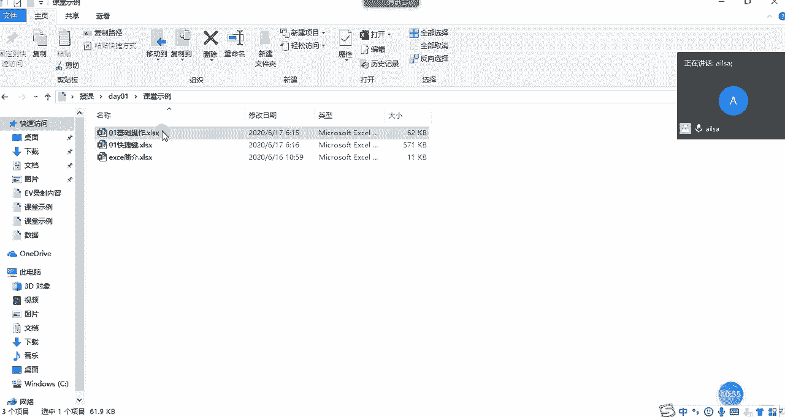

我今天专门把文件又更新了一下哈，因为昨天本来想演示的啊，但是啊啊现在网络状况怎么样好，如果可以的话，大家给我扣个一。

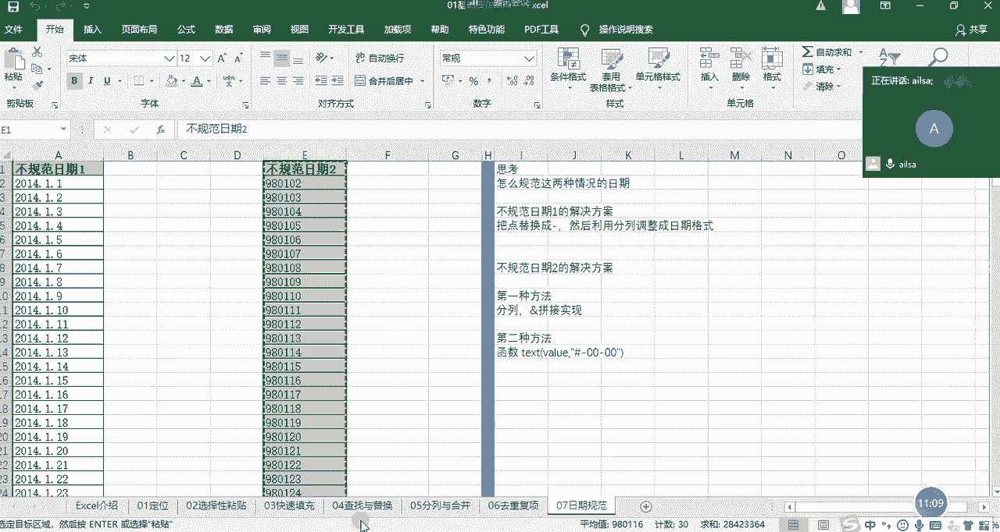

我这边显示网络状态不佳，同志们，好OK啊，OK那我们在昨天讲这个日期啊，我们要对它进行一个啊格式调整的时候，我这边采用的是分裂，然后步骤比较麻烦啊，但是其实随着我们版本的不断更新，它整个的一个呃呃。

就是实现的方式也越来越简单，越来越智能，那对于这样的一个形式的话，我们可以可以采取这样的一个分裂形式，就是在我们的数据选项卡下面还是选择分裂。

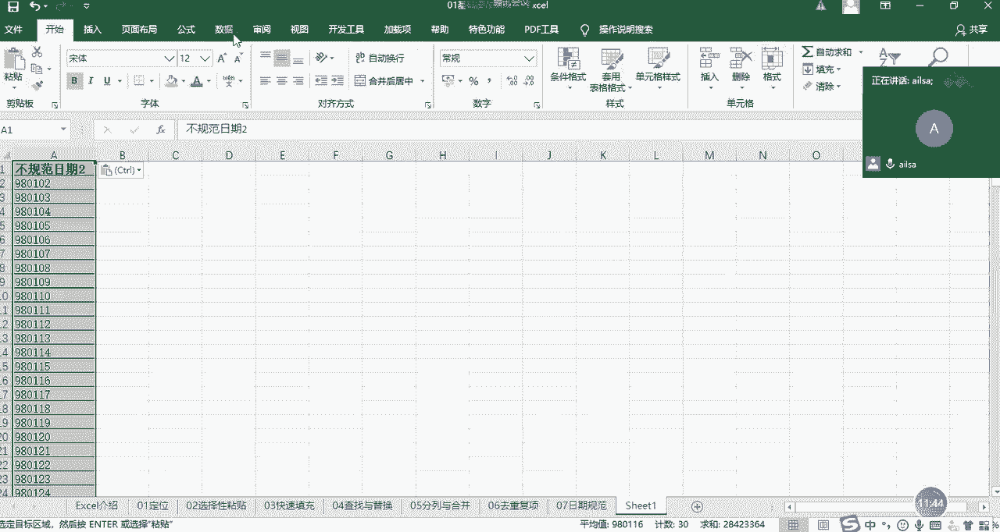

那在分裂的过程当中，我们可以选择固定宽度啊，也可以什么都不选，然后我们点击下一步，这个时候我们就不在这里做任何操作了，也就是说我不用先下拉了哈，不做任何操作，然后再点击下一步，这个时候我输出的时候。

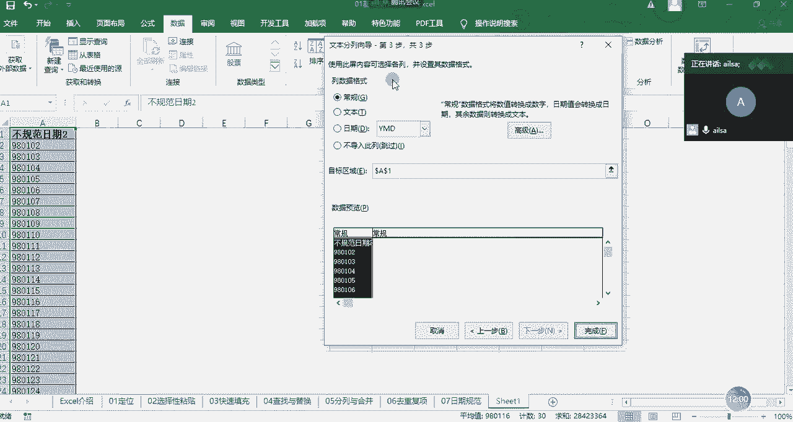

输出日期格式点击完成，大家可以看一下，它已经完全就可以识别出来，哎这是一个日期，然后并且知道你想要做什么啊，这样的一个过程，所以说我简单补充一下啊，我们昨天讲的一个小论点，好吧，嗯啊这个听明白了吗。

嗯听明白给我扣个一，同志们，OKOK哈，可以了哈，嗯那我们啊昨天的内容回顾已经讲完了。

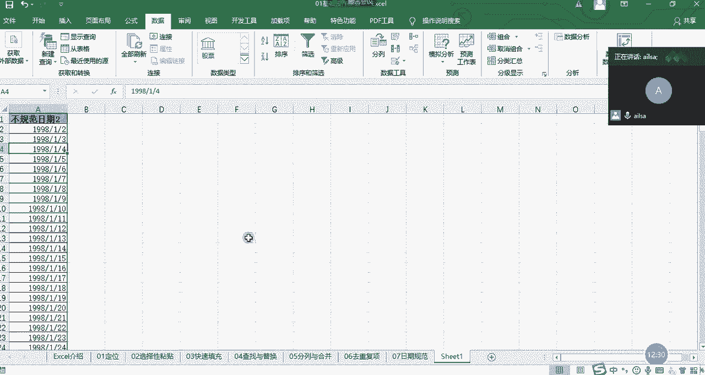

接下来我们就讲解啊，今天的内容，我们先看一下今天主要讲什么内容哈。

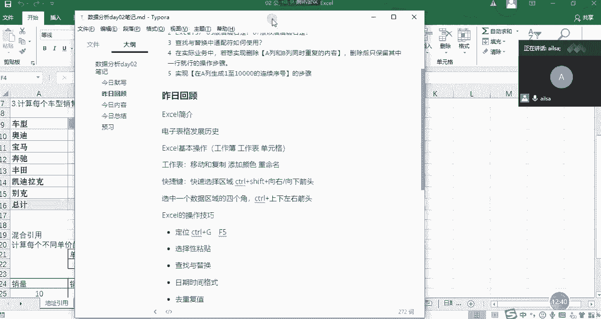

你先看一下今天讲解的内容，今天讲解的内容主要分两大块啊，我把我的大家的一个啊聊天调出来。

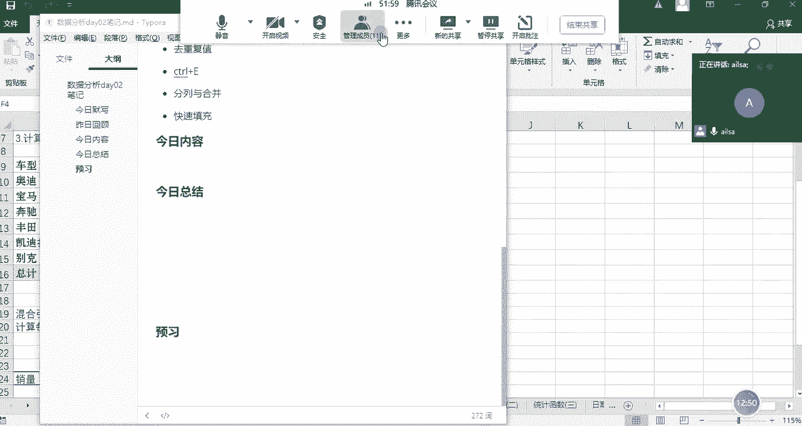

OK讲两大块内容，首先第一个啊就是我们的公式与函数，本来是要你昨天下午去讲的啊，但是因为它也比较重要啊，加上我这个嗓子又不是特别好，所以说啊我说放到今天上午去讲，效果会更好一些，公式与函数啊。

这是我们讲的第一个大块，第二个的话会讲一下数据透视表啊，这两个大块的内容，那公式与函数我们会讲哪些呢，可以看一下我这个的一个知乎的文章，我们大概会讲这么多，我复制过来啊。

我们会讲它的一个公式与函数的概念，公式与函数的概念，然后我们会讲一下什么是运算符，然后以及啊我们单元格有地址，对不对，那我们对于地址的引用是怎么样子的，然后以及我们接下来就讲函数了。

那函数呢它有不同的分类，它可以分为逻辑函数，文本函数，统计函数以及查找和引用函数，还有最后的一个日期函数啊，这么多内容，这是我们公式与函数的讲解内容，那数据透视表我们要讲什么呢。

我们看一下数据透视表的话啊。

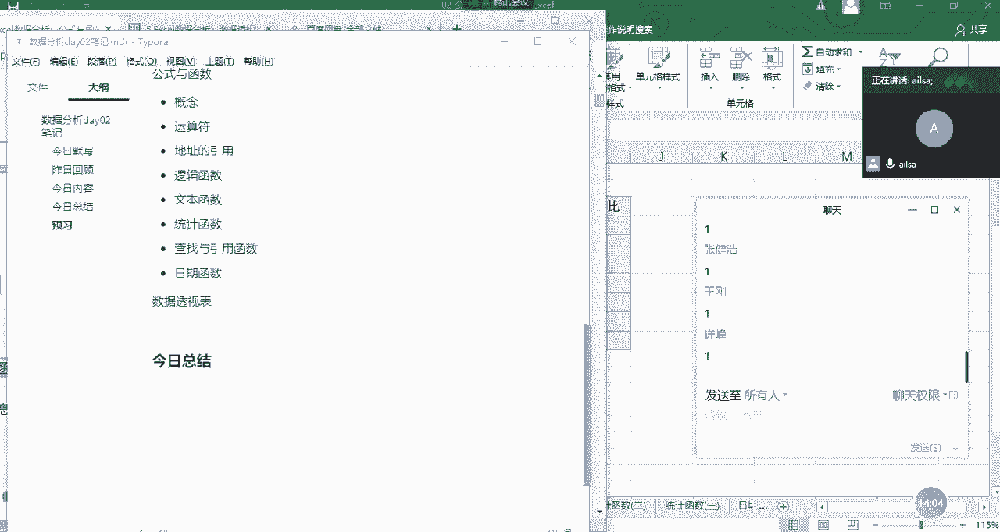

我们大概讲的内容啊也比较啊。

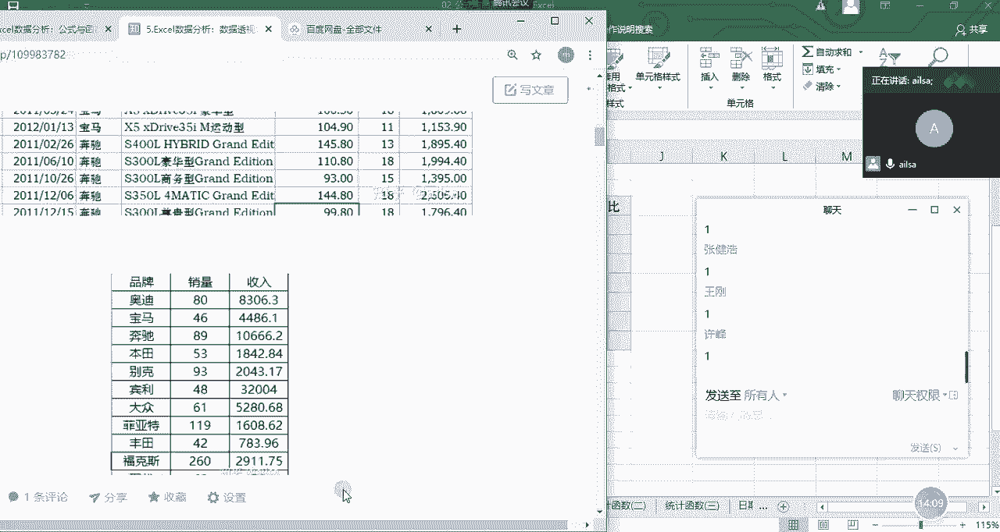

也算是比较系统一些了，就数据透视表的内容基本上都在这里了。

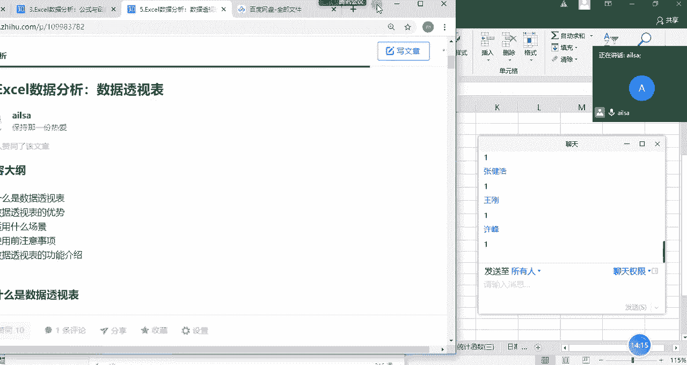

我们会讲一下，我把它复制过来，我们会讲一下什么是数据透视表，以及数据透视表的优势有哪些，然后适用场景啥的注意事项，还有数据透视表的功能的一个介绍，那我在讲数据透视表的时候。

我会结合我们实际的一个呃呃工作场景，然后给大家进行，把这些知识点进行串联起来就可以了啊，这就是我们今天要讲的内容，如果说我们讲完了之后还有时间，那我会把昨天的作业给大家再讲一下，因为我们是呃首届学生哈。

所以说啊不管是作业啊，我布置的作业还是我们课堂上的知识点，都会以最详细的呃呃讲解方式给大家，给大家全部讲完，然后以防止后面的啊，后面的学弟学妹去进行一个系统的学习哈，好的啊。

那就是昨日回顾和今日内容我已经说完了。

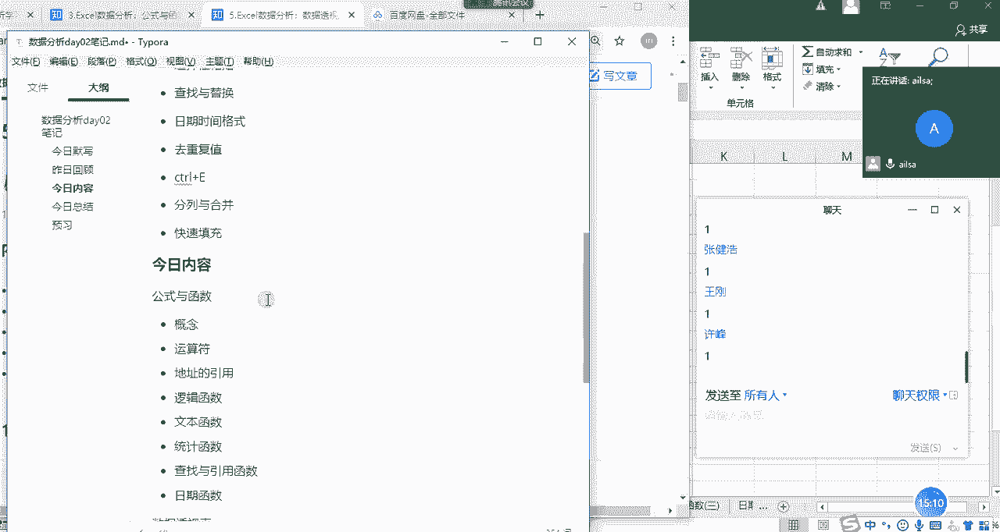