# 强推！这可能是B站最全的【Python金融量化+业务数据分析】系列课程了，保姆级教程，手把手教你学 - P38：02 公式与函数介绍&地址引用的三种方式 - python数字游侠 - BV1FFDDYCE2g

那我们讲公式与函数。

讲公式与函数哈，啊那我们在啊啊我们先说公式哈，我们提到公式之后，哎大家想诶这个公式是什么呢，啊什么是公式呢。

啊其实这个问题一点都不难，为啥呢，我们在小学一年级的时候就学了什么是公式啊，那大家都学过1+1=2吧，啊其实这就是公式，那在我们的excel当中啊，我的公式该怎么去定义呢，你比如说在excel当中啊。

我要新建一个哈，在excel当中唉，我输入1+1诶，他好像也没有啊，也没有什么大特别大的变化，对不对，这个时候如果说我在它前面输入一个等号，我们都知道1+1=2，对不对。

那我按N键试一下A是不是它变成了二，那其实啊那我们就可以呃发现哈在excel当中，这个等号啊啊其实我们的数学啊，符号等号是在后面的，那它呢是放在前面，目的是为了告诉excel哎我想要计算一些东西。

所以说它放到最前面，那我们的公式的定义就是以等号开头，然后啊就是说得比较高大上一点哈，就是建立数据之间的一个一种关联关系，关系的一种实现的一个算法啊，是不是很高大上，你看1+1=2。

就是建立了数据之间的一个联系，然后实现了某种加法，加法也是一种算法哈，啊就是最简单的一种算法。

这就是我们公式的一个定义啊，我们可以看一下公式啊，就是啊简单来说的话，它就是以等号开头对地址进行引用的计算形式。

哎你这个说的不对哈，你这明明是对数进行一个引用嘛，对不对，那为什么说是对地址呢，因为我们excel其实它就是由一个个的单元格，地址组成的，那我在这里面输入了1+1。

其实没没有很好的利用excel的一个特点，因为我最好是在这里面单元格里面输入值，然后在这里面写等于一啊，加一啊，这单元格地址进行一个引用，然后等于二，这样的一个好处是什么呢。

就是说我单元格地址里面的值发生了变化，它就发生了变化，对不对，非常的智能，你也不用一个个去修改了，所以说公式的话。

它就是以等号开头，对地址进行一个引用的计算形式，那说的高大上一点，它就是确立数据之间的关联关系，实现的一种算法，然后我们的结果啊就1+1啊，等啊，你就是我们的一种算法，然后结果为二来描述这种关系。

一和一什么关系呢，就是它俩相加等于二这样的一个关系啊，是不是很高大上哈啊这是我们的公式，其实哎这个概念没有什么好介绍的哈。

因为大家都知道，那我们再说到函数，大家大家对于函数其实是不陌生的，因为什么呢，我们在Python当中哈，我们在Python当中经常是不是要定义定义什么。

定义我们的啊，定义我们的函数。

那我们定义这个函数的目的是什么呢，就是为了实现某一个功能的一个呃就是什么呢，功能模块啊，就是把它封装在一起，然后下一次我如果再实现这个功能的时候，我就可以进行一一个调用就可以了。

那函数也是在excel当中。

函数也是一样，它也是为了实现某个功能而封装的，封装起来的一种公式，所以说我们可以说啊，函数是一个定义好了的公式啊，它可以啊啊，输入一些参数，来实现我们所想要的效果就可以了。

因为我们自己定义函数不是也要输入参数吗，啊对吧，是这样的一个定义，那公式啊，公式啊，什么玩意，公式啊，公式我们可以把它概念是是这个样子啊。

就是确立数据之间的一个关联关系，我把它写到我们的笔记当中，公式啊它是啊，它是确立数据之间的关联关系实现的一种算法，通过其结果来描述这种关系，那函数呢它就是啊定义好了的啊好了的公式啊。

实现啊某种啊或者是某类啊功能的啊，一一个集合吧，或者是嗯呃呃呃就是呃实现某类功能的啊，一个啊函数啊啊一一人呃，一个封装好的公式啊，嗯那它可以通过输入，通过输入参数啊来达到想要的结果啊。

就这样的一个呃定义和概念哈，就是公式这个函数，那我问大家一下啊，公式与函数的一个啊概念，大家听明白了吗，听明白给我扣个一，多元一次方程啊也可以哈，这种也是公式啊，OK这比较简单哈，啊，那我们既然说啊。

公式它是确立数据之间的一个关联关系，我们都知道，那呃要计算公式的话，他肯定要有一些运算符，对不对，那我们看一下它都有哪些运算符。

运算符的话最简单的加减乘除乘方对吧，这些都知道哈，然后啊百分号这里的话应该是嗯百分比啊，就是一个展现的一个形式啊，这样的就是我们主要记加减乘除乘方啊。

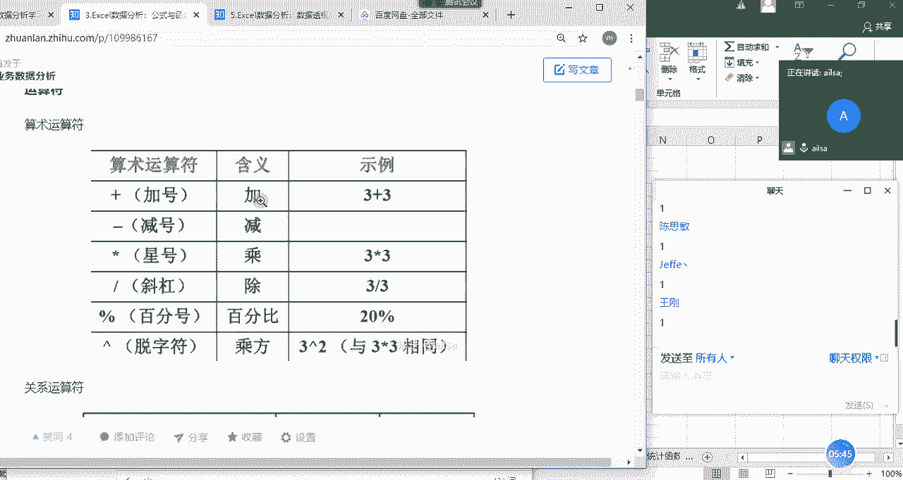

很简单，excel当中真的是啊比较简单一些哈啊。

然后下面又是一个关系的运算符啊，等号大于小于大于等于小于等于不等于啊。

这样的一个啊啊运运算符啊。

跟我们在日常工作当中和啊学习当中啊。

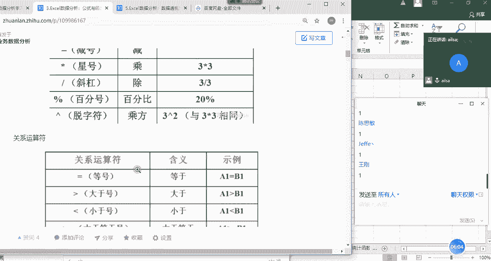

差不多啊，都差不多是一样的啊，这是我们的运算符，我就不在这里详细的去讲了啊。

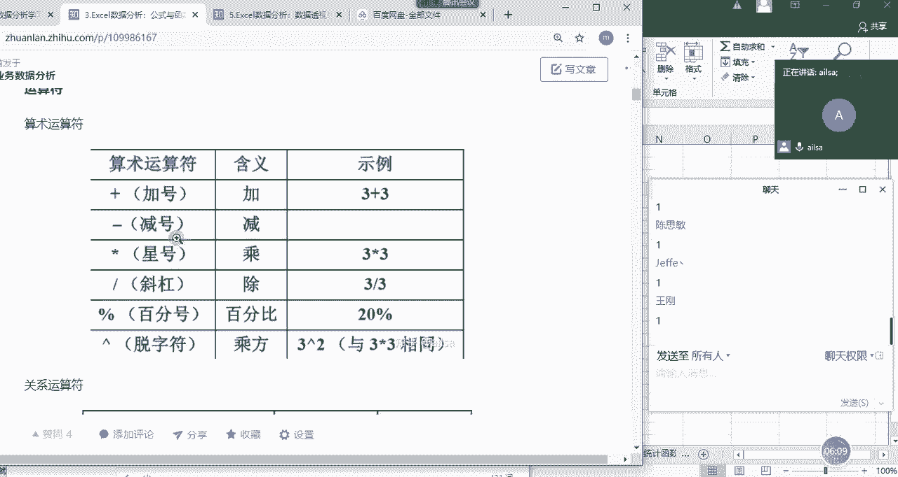

简单啊那个说一下就可以了，嗯那前面其实是比较呃呃简单的内容。

我们接下来就要看单元格地址的一个引用了，嗯那我们都知道哈，我们都知道我们在进行一个啊，单元格的选用的时候，它的一个而地址的话是由列和行组成，对不对，这是单元格，这里面的话就叫A1单元格，对不对。

那我们在进行一个单元格引用的时候，我们需要注意点什么呢，接下来我就跟大家跟大家讲一下，我们单元格地址引用的三种分类。

OK那我们还是结合实例去讲解哈，因为这样会更具有代入感，你比如说现在有三啊三道题。

我们要一个个去啊解答，首先第一个啊，大家看这张表啊，这是每款车型它的一个销量的情况，现在我想计算一下啊，这款车型在前半年的一个总和啊，这样的一个计算我们之前也讲过哈，我们的求和计算是等于sum对吧。

等于sum来给它计算，然后选择我们的数据区域，也就是这些值进行一个加和就可以了，我们按按推键哎，实现了之后，我们在这里看哈，在这里看它的一个选择的区域呢是B时到计时，也就是从这里到这里，对不对。

那呃很多时候我们都知道excel有自动填充的功能，那我的公式它是不是也可以实现自动填充呢，这个时候我往下拉试试啊，往下拖动诶，会发现它的值确实发生了相应的变化，是不是它就会根据我往下拖动的。

这样的一个形式来自动计算这一行的一个数据，这一行的一个数据，然后我们看一下它实际的公式内容是什么啊。

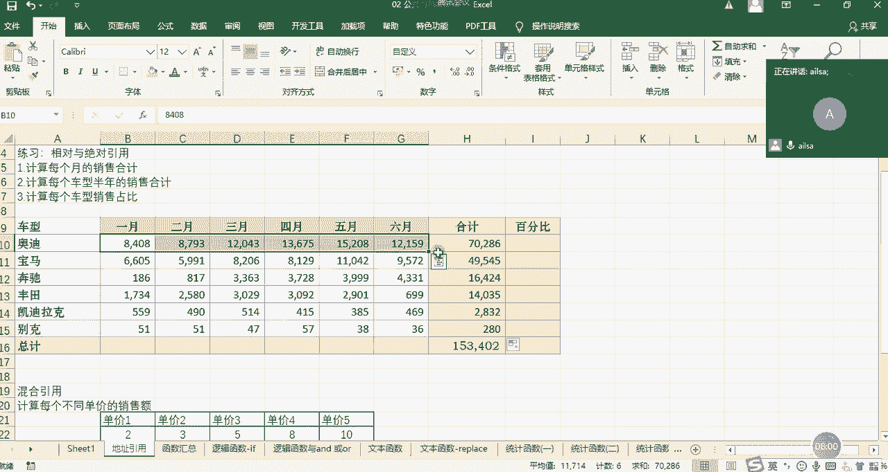

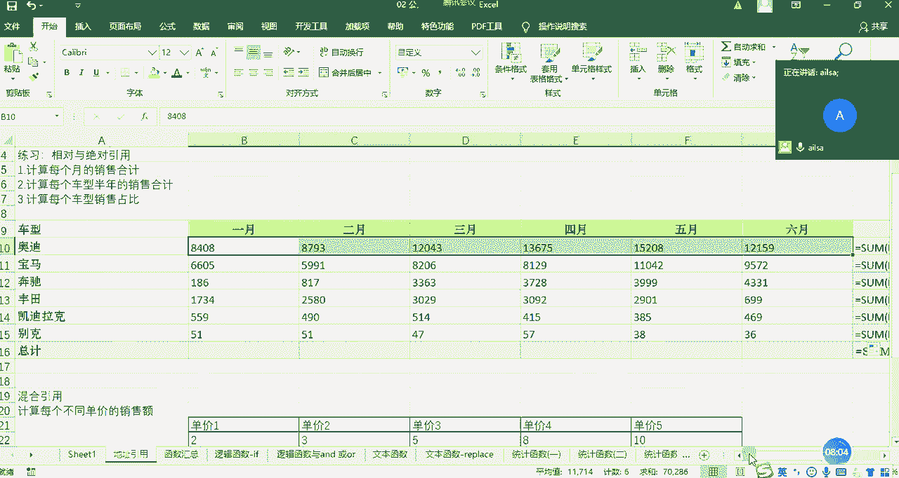

大家看哈，大家看，我在第一行的时候，我就在第十行的时候，我输入的公式是B10到G10，那我再往下拖动的时候，这个地方可不是我输入的，我往下拖动了一行，我们会发现它的列其实并没有发生什么变化。

但是它的行却变成了11，再往下拖变成了12，他也太智能了吧，对不对，他竟然知道我想要什么，然后这变成十三十四十五对吧，哎这样的一个形式发生了变化，那呃我们就呃总结这样的一个规律，就是说行的话。

我往下拖动一行，它就会变一行，那这种形式的一个引用叫什么呢，这种形式的引用叫相对引用啊，也就是说它相对于这个往下走了一行，你走了一行。

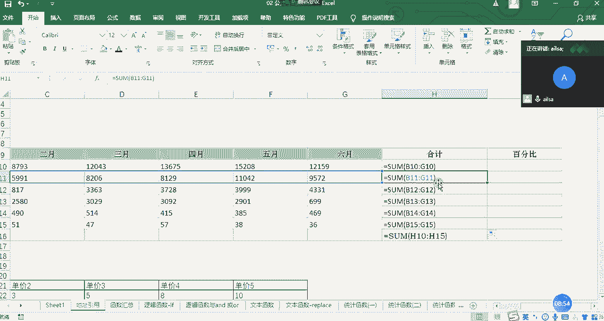

他也走了一行，这叫相对引用，然后我这边也就是给它起了一个特别好的啊。

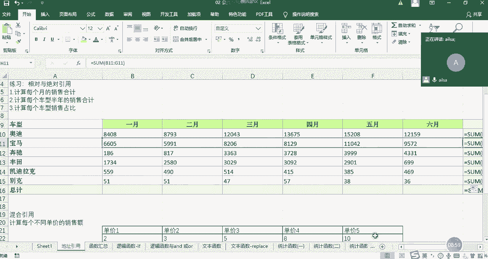

一个说法吧，呃容易让大家去记忆，就是说相对引用的话，就是你变它就变，你往下走一行，它就往下走一行，它就像你的影子一样，如影随形跟着你走啊，明白了吗，就是A2到A5这样的一个形式，大家记住哈，列啊。

这是列和行列和行，我们看到他真的是单纯的啊，前面什么都没有哈，只有列和行这样的一个形式，OK这就是我们的相对引用，那我们看了行，这样去发生变化，我们再看一下列会发生什么样的变化，在这里面。

比如说我输入的等于啊，等于我直接输输入等于G2啊，点击enter键，比如说G2的值是四啊，我现在不往下拖动了，我往啊我往右拖动哈，我往右头等，大家看一下，哎好像都是四哎，它怎么来实现的呢。

我们看一下它具体的一个值哈，我这里面是四，没有毛病，那在这里面它是等于G2，等于这个是不是我在往右拖动的过程当中，我们会发现它的列随之发生了变化，从G变成了HG变成了H，然后从H变成了I对吧。

那也就是说嗯，嗯我在列方向进行一个拖动的时候，它会随着列啊随之发生变化，行方向拖动的时候，它会随着行发生变化，这就是我们的相对引用。

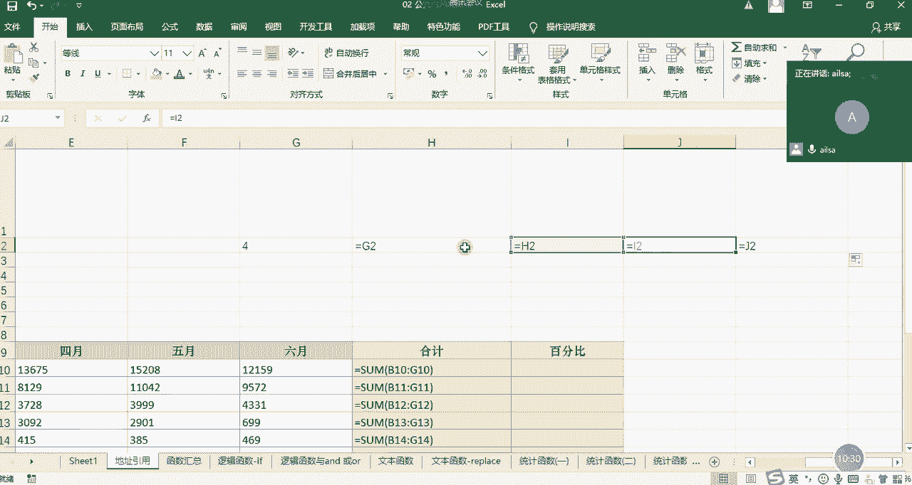

OK那我问一下大家啊。

我们的相对引用这一块听明白了吗，听明白给我扣个一，不明不明白的话扣个二，然后有问题抛出来啊，对啊是的，建号费很聪明哈，CTRL加波浪号是显示我们所有的一个原始的值，不仅仅是显示公式啊。

因为啊你我们从肉眼去看的话，我们只看到他的一个结果，但它实际内容是公式，嗯嗯好，那相对引用大家明白了之后，我就讲第二个需求，第二个需求是什么呢，就是我要计算一下每一个月啊。

就是每一款车型它的一个半年的呃。

一个销量了之后呢，我想知道每一款车型它的一个占比情况，这是它的总和啊，这是它的总和，然后那我也就是说，我把每款车型的一个销量除以他的总计，就可以了，对不对，那就是百分比，这个时候我还按照刚才那种经验啊。

选择它，然后除以我的总数，按enter键哎，这个时候啊我们看一下，因为我这边的一个格式啊。

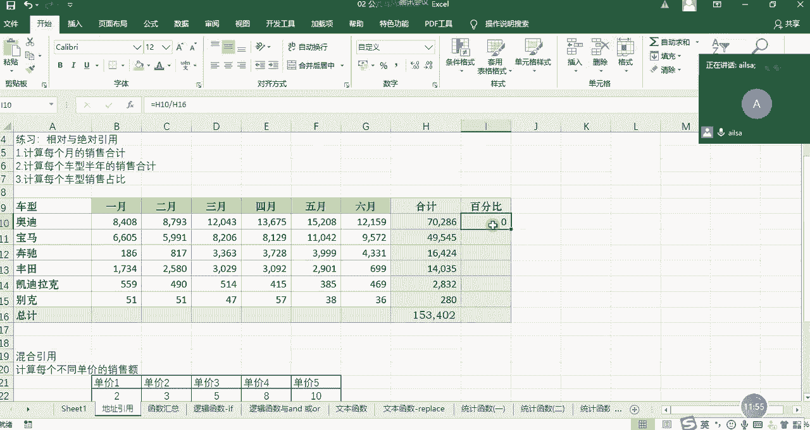

应该是整数，我们CTRL加一选择什么呢，选择我们的百分比啊，我们的小数变成两位，点击确定就可以了。

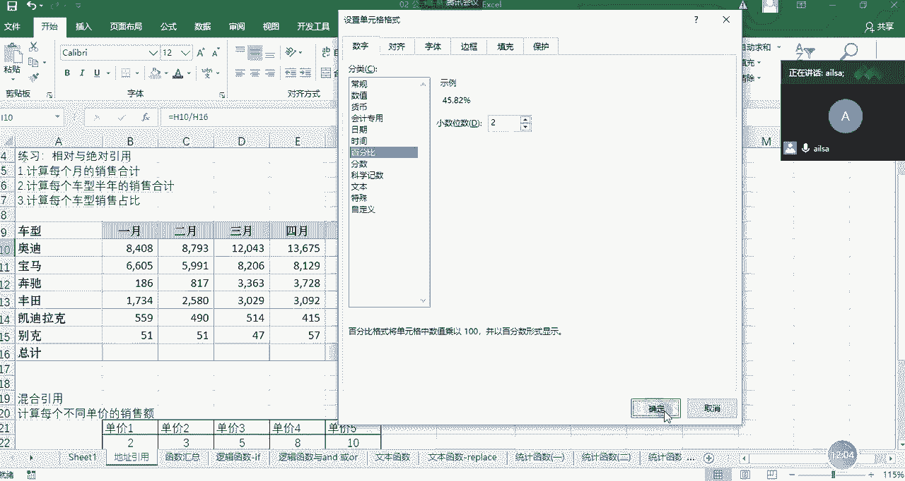

它就实现了我们整个的一个百分比的展示效果，这个时候我还按刚才那种方式往下拖动，往下拖动，哎不对呀，他怎么报错了，我们看一下这个错误是什么意思哈，它有一个杠，有一个零代表什么意思呢，诶好像是我的。

因为我这是一个除法啊，对吧，那我的分母不应该为零，对不对。

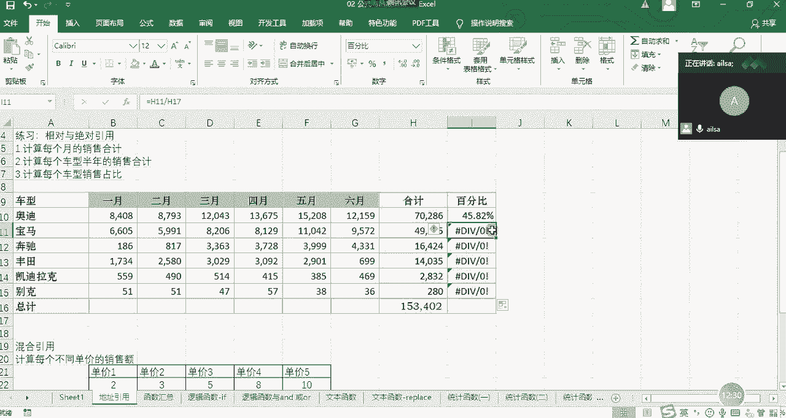

如果为零就没有意义了，所以他报错了，那我们再看一下，它整个的一个原理是什么样子的。

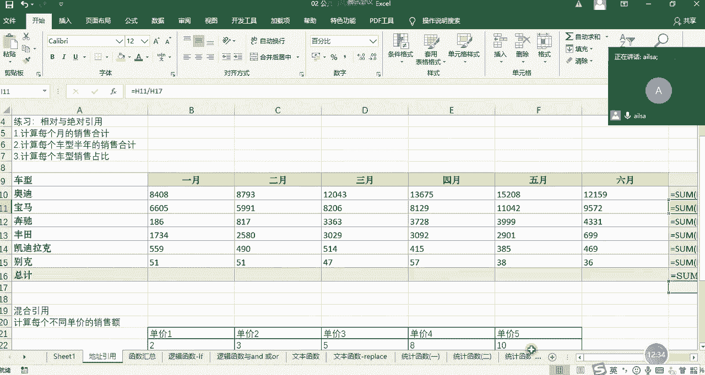

我这个百分比啊，我第一款车型除以我的总的销量啊，那是没有问题的，但是我在往下拖动的过程当中，我们会发现我的啊，这款啊就是我的宝马这款销量，然后除以它的总计的时候，它也往下走了一行，也就是说他走了一行。

那你这个随之他也走了一行，对不对，那它就往下走一行之后，我们会发现它没有值，那没有值肯定就会报错了啊，那这个时候，其实我们想要达到一个什么样的效果呢，就是我这个分子啊，我往下拖你变。

但是你这个分母是不能变的，我们怎样才能保证这个分母不变呢。

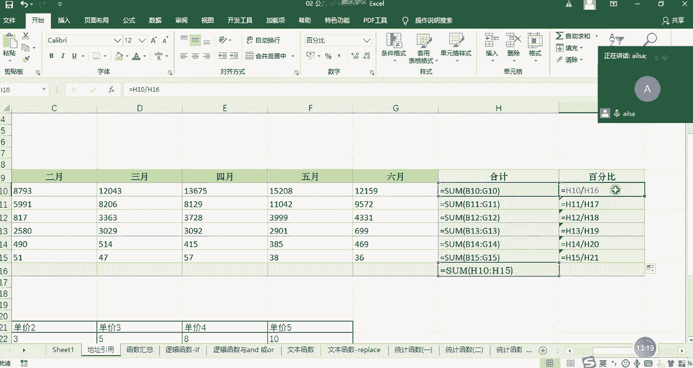

唉这个时候我们也是有法保证的哈。

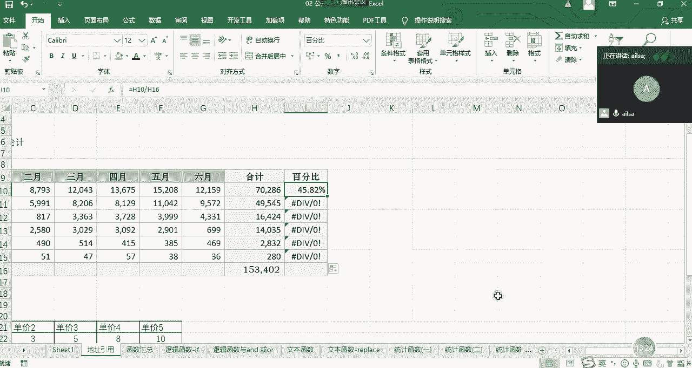

啊就是我们要讲到的绝对引用，那我们如果想保证它不变的话，我们需要在这个列方向和行，因为它整个单元格都不变，所以我们需要在列方向和行方向，都加一个高乐符。

这个dollar福的添加是按住shift键加上哦四啊，来实现的，shift键加上四，如果行和列都加上了dollar符，代表是绝对引用，也就是说你加上了刀乐福，就像小别针一样，你别住了它。

它就在不管是往哪个方向去拖，它都不会再发生任何变化了，这个时候我们按enter键，然后再进行一个往下的拖动，是不是实现我们所想要的效果，那对于这个行和列都加刀乐符的这种情况，我们叫绝对引用。

那绝对引用的话，它是应用于什么场景呢，就是你的某个单元格不希望它发生变化的时候，往下拖动或往右拖动的时候，不希望它发生变化，那你就需要给它进行一个啊DOLF的添加，小别针的，别住它，别到墙上帮他动啊。

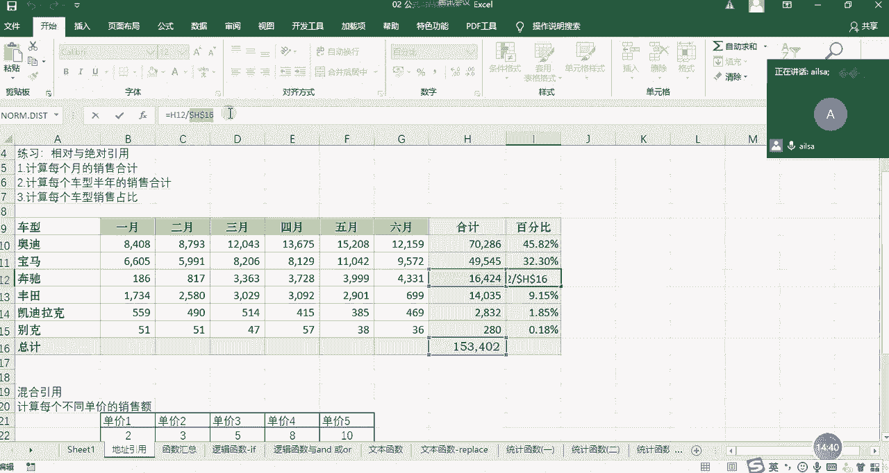

这样的一个意思哈，那我也给他起了一个外号叫什么呢，叫以不变应万变，就是我不管你其他人怎么变，反正我就是不变，但是我这个不变呢刚好满足你的需求，所以叫以不变应万变，它的一个形式就是高乐福的啊。

行和列上都有添加嗯。

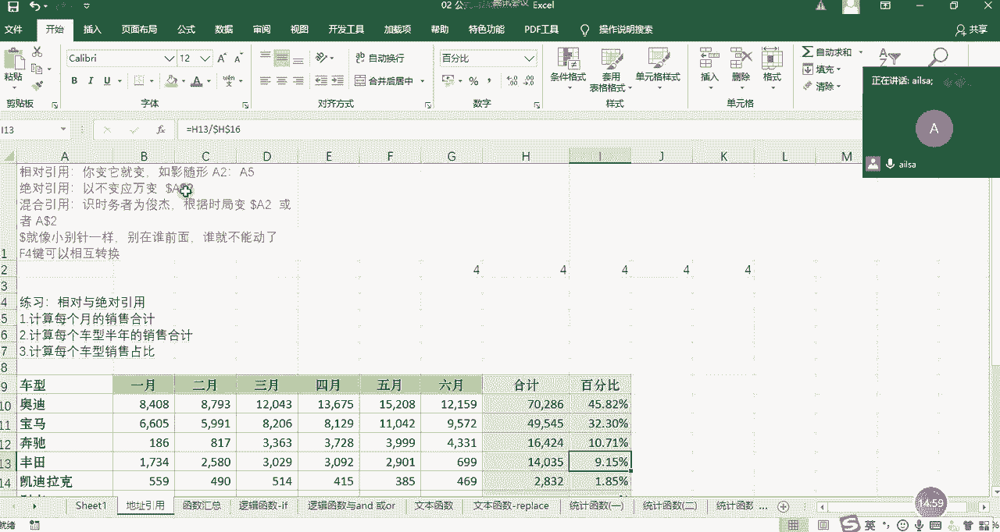

OK啊啊，同志们啊，对于绝对引用大家还有什么问题没有啊。

如果没有问题，给我扣个一啊，好的没有好好的嗯，那我们讲完了相对引用，讲了绝对引用，接下来就讲一个最难的哈，什么呢，叫啊混合引用嗯，OK那我们还是结合一个业务场景去讲解。

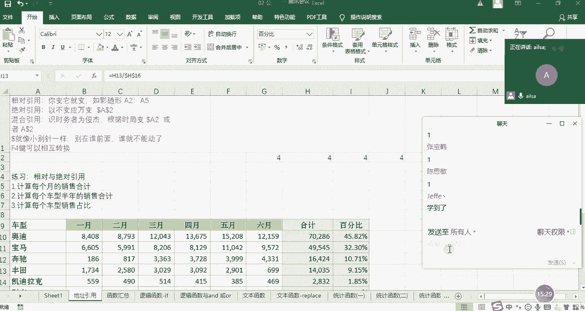

我们看一下。

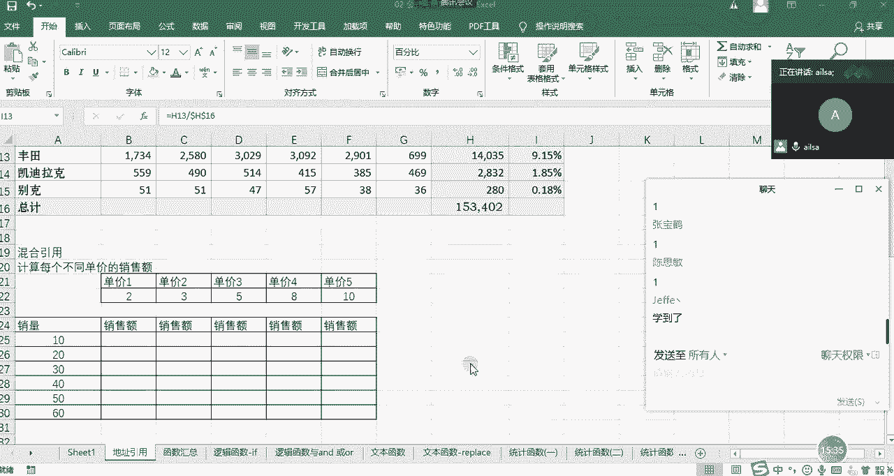

我们看一下这样的一个实例哈，啊这样的一个实例，就是说唉我们有时候对于产品定价的时候，拿不准，所以说我们会有很多个产品的一个定价，然后呢我们想看一下在不同销量的情况下，它对应的销售额是大概多少。

也就是说啊公司大概能赚多少钱，类似类似于这样的一个需求，那你想一下我呃，我首先要说明第一个点，就是说我们在对于嗯，我们在对于一个公式的，或者是函数的使用的时候，一般情况下，比如说这种连续性的区域哈。

我们只会在一个地方输入完公式之后往下拖动，往右拖动，然后就可以实现了，我们我们没必要一个一个去输入函数啊，这样的话太不智能了，也不利于我们整个的一个工作效率的提升，所以说我们在这里计算销售额啊。

在这里面输入一个公式之后，我们希望说它能适用于整个的一个连续区域，那我们看一下我们的销售额该怎么来计算，首先我们都知道销售额是单价乘以销量对吧，那这里我直接用简单的公式就可以实现了，单价乘以啊。

我们的销量输入完了之后，这个时候我们现在什么情况都不考虑，我们直接往下拖动啊，往下拖动，这个时候我们会发现有问题哈，没关系，有问题。

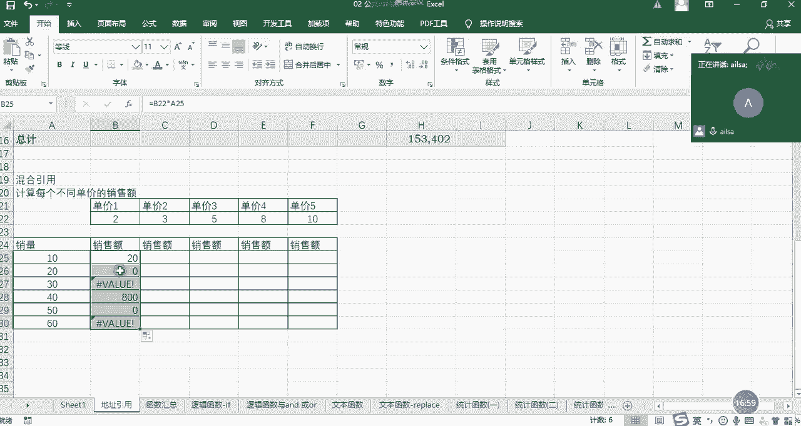

我们可以去分析到底是什么问题造成的啊，CTRL加波浪号，我们看一下我们的销量啊，对应的是啊A25，我们的单价对应的是二，那我在往下拖动的过程当中，我其实是希望我的销量随之发生变化。

但是我的单价我不希望它变，对不对，但是其实我没有，我们没有给它进行一个dollar符的添加，所以说我们在往下拖动的过程当中，发现我这个单价也往下拖动了，所以说我们需要给单价加上一个，绝对引用的符号。

唉那我们这里把单价是B22，所以说我们在B22这里加上dollar f，刚才有人啊，刚才可能大家在操作的时候，都是一个个添加dollar福的比较麻烦，在这里给大家给大家介绍一个快捷的方式啊，按F4啊。

按一次F4，大家看一下就已经全部添加上了，那如果你再按一次F4，我们可以再看一下哈，哎啊数字前面加了叨乐福，我再按一次F4啊，字母前面加了DOLF，我们再按一次F4哎，没有DOLF了。

所以它可以在啊整个的一个啊，就是行和列方向的一个加刀，乐福的这样的一个切换啊，所以F4啊这样的一个快捷方式啊，大家可以去使用一下，那我们啊说回来，我们把单价定到绝对引用了之后，我们再往下拖动。

我们再往下拖动，OK二十四十啊，60没有问题，那我们这一列已经实现了我们想要的操作，接下来我们是不是想让它往右拖动啊，我们先不看我们这个公式到底对不对，我们直接拖动，看一下它会达到什么样的一个效果。

哎拖动了之后呃，二十六十哎，不对呀对吧，应该是哎三十三十，这怎么变成40啊，这好像不太对哈。

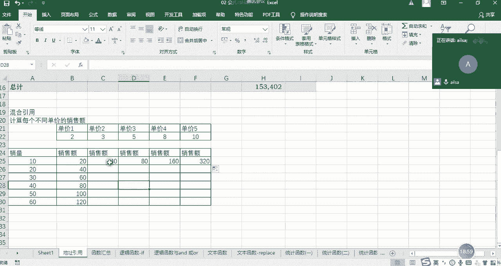

那我们看一下它的公式里面到底是什么内容，那我从这里啊，B22乘以我的销量是没有问题的，那我在往右拖动的过程当中，我是不是希望我的单价诶，单价列发生变化，对不对，但是我们要同时满足向下拖动的时候。

行不发生变化，那其实就是说嗯对于单价而言，我们只要对啊行加上绝对引用就可以了。

列我是希望它发生变化的，所以我们这个时候需要在这里面进行一个更改，我们的单价，把列上面的这个dollar符去掉，我在往右拖动的过程当中，希望它发生变化，OK我们改完了之后，我们再往右拖动。

我们发现如果诶好像不太对哈。

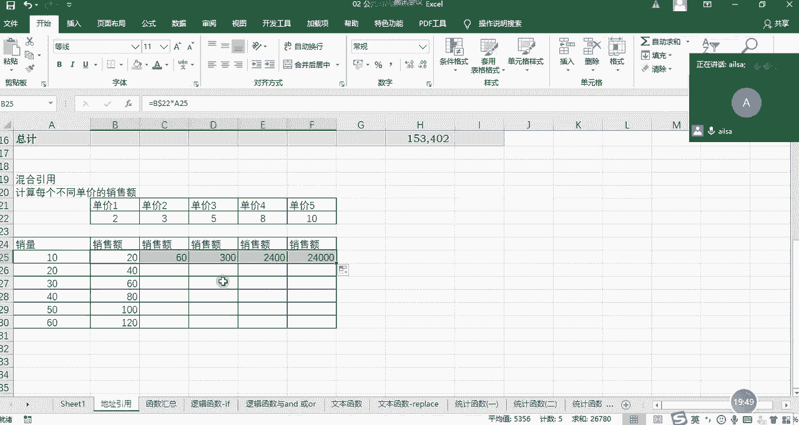

这值没这么大，怎么还不对呢，我们再看一下啊，我们再看一下这个呃，我们既然这个单价从B22到C，22到D22，OK没有问题，是我所想要的效果，接下来我们再看我们的销量，销量是A25。

我往右拖动了一列之后啊，它变成了B25，那B25其实不是销量，那就销售额了，所以会越乘越大，那这个时候我们就在想，对于销量而言，我们想要实现什么效果呢，那就是销量我们在往右拖动的过程当中。

不希望它列发生变化，但是我们在往下拖动的过程当中，是希望它行发生变化的，那也就是说唉我们在这里的时候，需要对它的列进行一个刀乐福的添加。

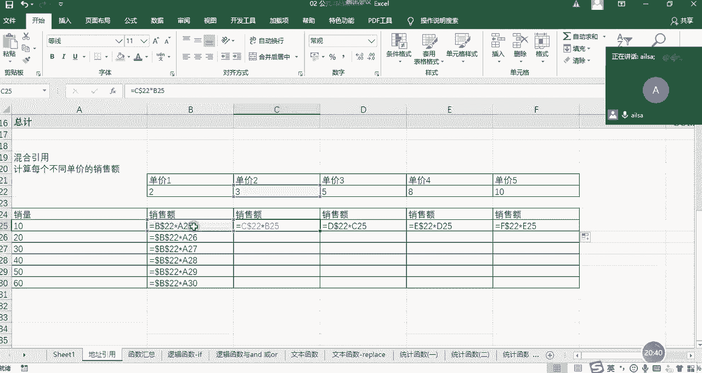

那我们再回来，然后再啊，我们的销量的列方向上加一个dollar for，然后再按enter键，然后再往右拖动，诶好像没有问题了，对不对，然后我们再往下拖动，OK这这6010啊，600对吧。

这已经是没有问题了，然后我们再回到我们的公式这里啊，我们可以看到对于我们的单价而言，我们希望它列方向方向发生变化，但是行方向不变，所以说我们在列方向没有加到了负，行方向加了到了负，那对于销量而言。

我们希望它呃呃行方向是变化的，所以说行方向没有遭到负，但是列方向我们是不希望它发生变化的，所以列方向是有道洛夫的，那像这种根据实际情况的行或列啊，前面加dollar f的情况，我们称之为混合引用。

那混合引用在我们的实际当中啊，有什么特点呢，其实就是说啊识时务者为俊杰哈啊，顺应时代的变化啊，来满足各种需求啊，这样的一个啊非常灵活的一种操作方式哈。

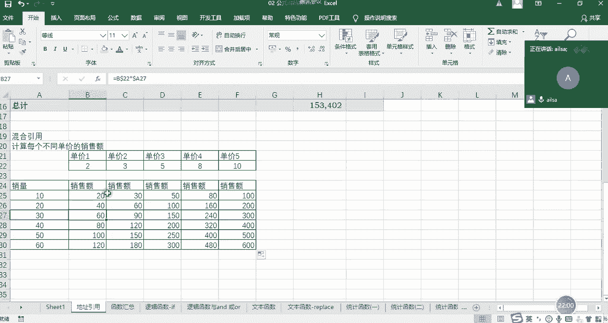

所以说这就是我们的混合引用，OK啊。

同志们混合引用有不明不明白的地方，然后可以啊说然后如果都没有问题，扣一，好的应该我这一块讲的算是很清楚了啊，啊比较清楚了啊，所以说大家只要记住一点，你不想让谁不想让谁动，你就给它加上小别针就可以了啊。

基本上我们用的比较多的，还是啊，那个绝对引用和相对引用会用的多一些哈，混合会少一些，因为它比较难啊啊所以这一块的话一定要掌握，因为我们在后面使用公式，使用公式或者函数的时候。

多多少少都会用到引用这三种方式，OK那我们再来总结一下哈。

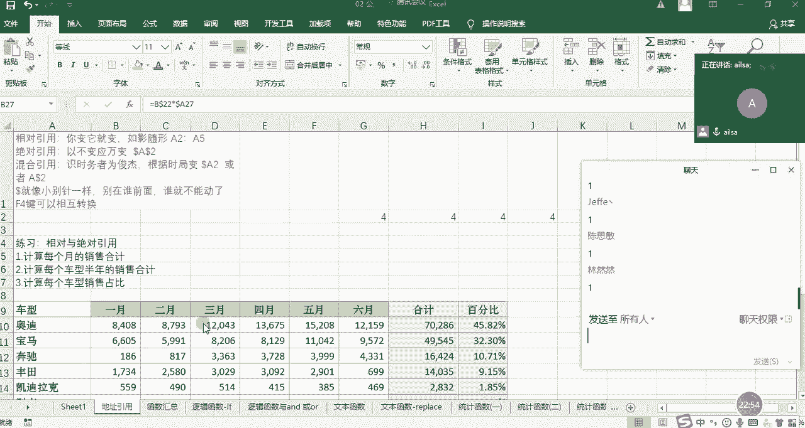

啊总结一下我们的啊地址的引用，地址的引用我们会分三种啊，三种，一种是相对引用，一种是绝对引用，还有就是混合啊，引用大家一定要听明白了哈，因为我们公式与函数，这部分的作业是有点难的哈。

它在我讲的基础之上还进行了一些灵活的调整，那相对引用的话就是啊啊就是说嗯如影随形哈，如影随形啊，你变他就变啊，类似于什么呢，类似于A1啊，冒号B2，类似于这样的啊，这样的一个形式。

就是行和列都没有道乐符，那绝对引用的话就是以不变啊，应万变啊，它的就是它的特点就是啊行和列都有dollar佛，类似于这样的啊，混合引用的话就是行或列，行或列会存在DOLF行啊，叫识时识时，务者为俊杰。

非常灵活啊，行或列，啊存在dollar for啊，存在dollar f，类似于这样的啊，类似于A啊，Dollar f1，或者是叨乐福A1啊，这样的一个形式，行和列会存在一个dollar符嗯。

那就是我们这三种引用的方式，大家一定要掌握，OK啊，我看一下哈啊09：30我们要休息一下哈。

