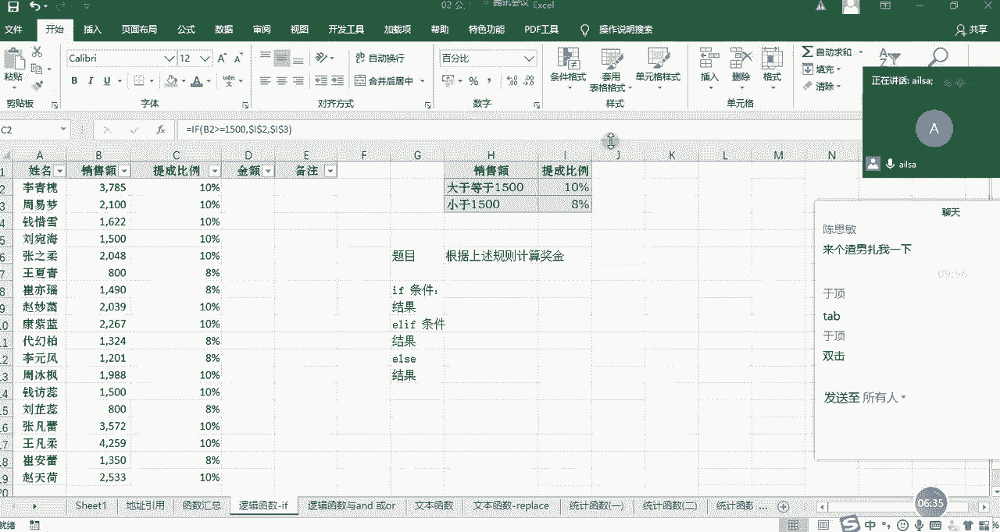
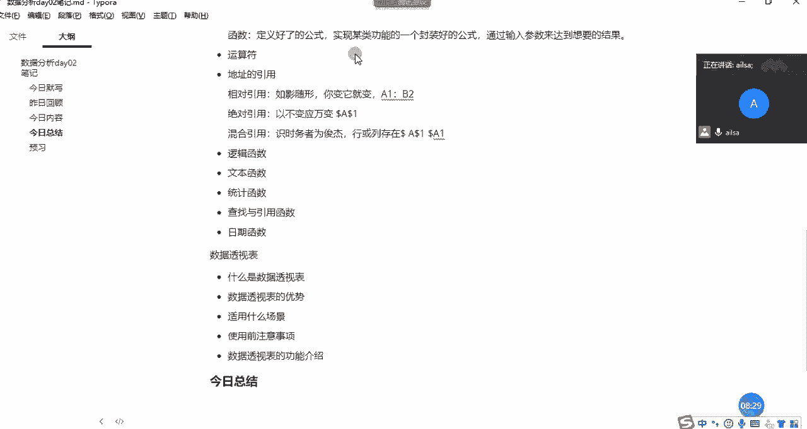
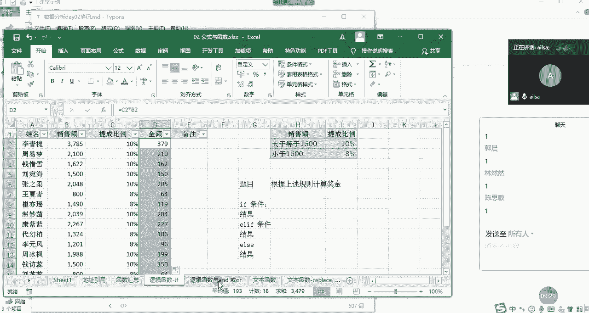
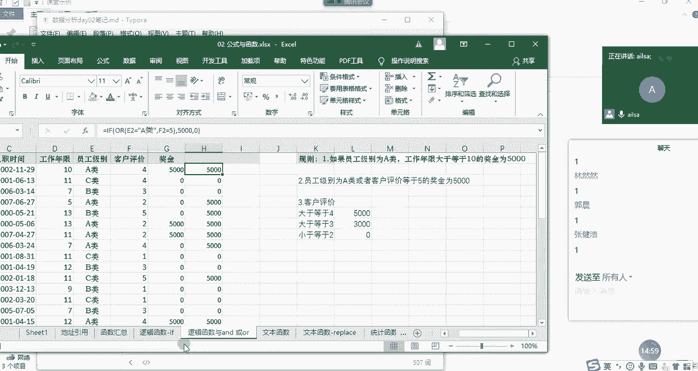
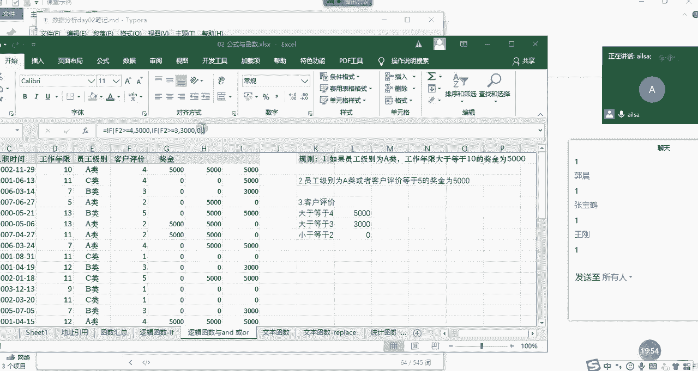
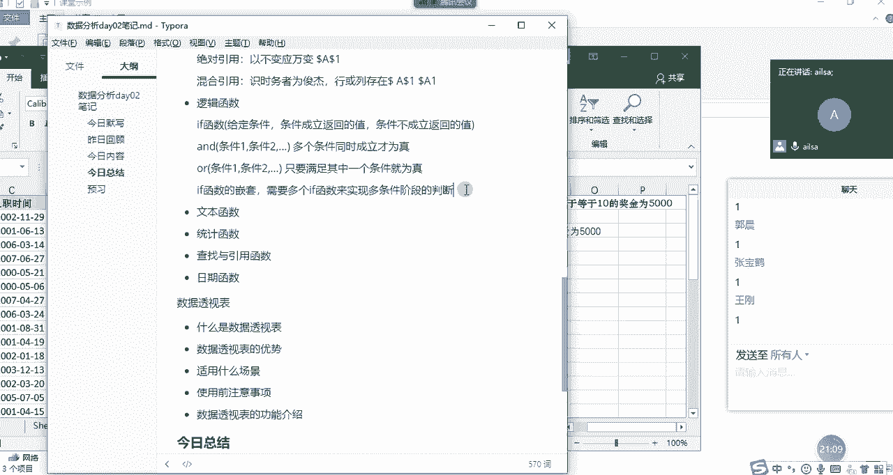

# 强推！这可能是B站最全的【Python金融量化+业务数据分析】系列课程了，保姆级教程，手把手教你学 - P39：03 逻辑函数 - python数字游侠 - BV1FFDDYCE2g

嗯OK我们讲的函数的话主要是有逻辑函数，文本函数以及我们的查找和引用函数，还有统计函数，日期函数啊，这样的啊一些内容，那在啊讲这些东西的时候，大家的一个学习的思路，就是我们会介绍每一个函数的应用场景。

以及它的函数的组成部分，嗯它的组成部分就是它的参数啊，大家就可以想象一下自己之前啊在写Python的时候，设计的一些功能，它都会传参进去，那它的传承的目的就会实现，就是为了实现这个这个函数的一个啊。

适用不同的应用场景来达到不同的效果啊，这样的一个呃函数的基本的思想啊，知道这个就可以了，那我们首先介绍的是逻辑函数，什么是逻辑函数，就是判断为是或否返回的结果是true false，这样的一个函数。

逻辑函数我们最开始学的是if if函数，我们看一下这样一个实例哈。

嗯因为我们在嗯嗯在Python当中，我们学的逻辑函数就是if啊，给你一个条件，如果条件成立啊，条件哈我可以在这里面写一下，假如条件啊啊如果成立啊，他就返回一个啊一个结果，哎else或者是LF哈。

LF如果他又给你一个条件，然后又返回一个结果，然后巴拉巴拉一堆，然后到最后的是else啊，如果说以上条件都不符合，再返回一个结果，这样的一种逻辑表达关系对吧，那在excel当中也跟这个其实是差不多的。

只是它的写法上略微有所不同，我们看一下怎么来实现哈，你比如说我们就说最简单的啊逻辑判断，现在这是一个啊销售人员的啊，提成比例的计算啊，这是姓名，这是销售额，那对于提成而言，我们都知道它是有分阶段的嗯。

你比如说现在给你的规则是大于等于1500，销售额大于等于1500的时候，它的提成比例是10%，进行一个奖金的提取，如果小于1500，那就是8%进行一个提取，我们会发现它其实就是一个if else。

的这样的一个呃两个条件的一个判断，满足这个条件返回10%，不满足这个条件返回8%，那我们看怎么去写哈，在excel当中写函数的话，首先还是得先输入等号，输入完等号之后，输入我们的函数名。

if输入完了之后，我们需要输入的是英文状态下的括号，这个时候你就输入英文状态括号就可以了，它输入完了之后，他会给你提示每一个函数的组成部分，那有的人就说诶有没有什么快捷的方式，当然也有啊。

比如说你输入一个I，它就会给你提示有I相关的一些函数，那这个时候你可以直接按一下tab键啊，tab键啊，就他直接就把这个函数补全，并且给你加了一个左括号，我跟大家说是哪个哈，好tab键哈，TAAB啊。

tab键，然后去给你填充这一部分内容，等于if啊，这我我就我直接就打了一个I，然后按tab键啊就出来了，我们看一下这个函数的组成部分，可以看到它是通过英文状态下的一个逗号，隔开的。

它的组成部分总共是三个，第一个组成部分叫logical test，它其实我们就简单理解为就是它的一个条件，那我们的这个条件是什么呢，销售额大于等于五呃，1500，那我们就选择销售额大于等于1500。

这就是我们的条件，如果这个条件成立啊，这个时候他就会返回一个什么呢，value唉，If if true，就是如果这个条件成立，你返回的一个值是什么，我们返回的值是不是提成比例为10%。

那我可以在这里面直接写10%，也可以选择这个单元格，来进行一个内容的引用啊，那如果说这个条件不成立啊，Value if false，就如果不成立，它返回的一个值就是8%，对不对。

唉那这样这就是一个最简单的if if条件的判断，就是给你一个条件，他如果条件成立，返回一个值，条件不成立，又返回一个值，这个时候我按右括号补全，再按enter键就可以了。

这个时候我们就知道3700返回的是10%，那我们在前面讲单元格的引用的时候，我们都知道我们写完之后是不是想往下拖动啊，那我们在往下拖动的过程当中，需要注意的一个点。

就是我们的啊地址的引用是否要加dollar f，我们看一下，如果往下拖动我们的整个的一个啊销售额，我们是希望它发生变化的，但是我们的提成比例是不是死的呀，我们是不希望它往下随之发生变化的。

所以说我们的提成比例，要使用的是绝对引用的符号，加上一个dollar符啊，行和列都加，我们先选中，选中它，然后按F4就可以实现，然后再按enter键，我们鼠标定位到这里。

然后双击就可以实现我们所想要的效果了啊，大家看到没有，8%哎，这就是小于1500的啊这样的一个形式，那接下来大家就自己在电脑上啊，手动的操作一遍，因为数据我已经发给你们了，昨天就已经发了哈。

因为本来昨天要讲，但没有讲成啊，现在呢就是大家手动操作一遍，嗯啊手动操作一遍，如果没有问题，给我扣个一啊。

如果没有问题，给我扣个一哈，我再简单的说一下，首先我们先输入一个等号，再输入if if啊，你可以双击哈，双击也可以，但是我刚才也说了，我们如果能用键片呃，键盘就不用，能能够用键盘就不用鼠标哈。

因为我们的大家知道，我们作为啊整个经常打电脑的人来说，我们的手指其实是有存在很大问题的啊，我们如果用键嗯，就是键盘上的东西的话，这样对手指的一个呃呃保护还是有的，所以说我一般习惯是用table键。

然后我们的第一个组成部分是我们的条件，第二个组成部分是我们条件成立返回的值，第三个组成部分是我们条件不成立的时候，返回的值，如果说大家已经实现这种效果了啊，在我们的聊天里扣个一，好的啊，预定可以了。

减号嗯，好的思敏呢，嗯我们稍等一下哈，等半分钟，好的啊，那应该都差不多了哈，OK都可以了哈，8~9个人啊，那我们啊那我们这个操作完了之后，那接下来我们计算金额就很方便了，那就是等于我们的提成比例乘以诶。

我们的销售额，这就是我们的金额啊，就可以了啊，我们双击下来，这就是它的一个提成金额，我们就计算出来了。

那对于if函数而言，我在这边做一下笔记，然后进行一个啊。

再进行一个啊重复哈，或者是进行一个强调和总结，那逻辑函数我们首先讲的是if啊，函数if函数的话它有哦三个组成部分啊，第一个组成部分是条件给定的条件啊，给定条件，第二个组成部分是条件成立，返回的值。

或者是你给它定义的值啊，返回的值，第三个是条件不成立啊，返回的值，大家记函数的话，首先啊要知道这个函数是干什么的，逻辑判断啊，对，然后第二个的话，我们要知道这个函数的组成部分有哪些。

也就是说它的参数有哪些，只有知道了它的参数，你才能够去更方便地使用它。

这样的一个学习的思路，好吧，这是if if函数，接下来我们再介绍，跟F函数进行一个联合使用的，也就叫嵌套使用的and或or啊。

这两个函数唉，我们还是在一定的业务场景下啊，现在我把这些数据先删掉，那先删掉，OK那我们看一下给定的一个啊。

给定的一个问题是什么哈，啊就是说如果员工级别为A类，工作年限大于等于十的奖金为5000，那我们可以看到他这个奖金的计算哈，啊啊他这个奖金的计算会条件会多一些，因为呃它涉及到了工作年限，员工级别对吧啊。

这两啊这两列的一个条件进行一个计算，那这个时候我们就在想，他需要同时满足员工级别为A类，工作年限大于等于十，这个时候他的奖金才为5000，否则为零啊，我们这样的一个条件判断，我们可以这么来写哈。

我们还是进行一个，大家这个时候可以跟我一起练习哈，因为我讲的比较慢哈，还是等于if啊，if这个时候我们之前学习的是啊一个条件，现在是两个条件同时成立，我们就可以用and来进行一个搭配使用啊。

或嵌套使用and啊，它怎么来使用的呢，它，它就是啊，它就是在里面输入两个条件就可以了啊，输入两个条件，Logical1 logic，二就指的我们的条件，第一个条件就是员工级别，我们可以选择这个单元格。

然后员工级别等于A类，嗯等于A类，我们在这里输入文本型的时候，是需要加上双引号哈，记得一定是双引号，你单引号都不行哈，我之前使用Python使用习惯了，然后后来我又转为写函数的时候，我就使用单引号。

他一直报错，我我就觉得很奇怪啊，后来我才后来我又看了一下，我改成双引号就可以了，他这个就是在excel当中必须是双引号才可以，对于文本的引用，OK这是一个条件，那我们只要用英文状态下的逗号隔开就可以了。

第二个条件的话是工作年限大于等于十，那我们选择啊这个D列的工作年限，然后大于等于十，这就是我们两个条件同时成立，然后如果它同时成立，它返回的值就是5000对吧，那如果不成立，它返回的值就是零。

然后我们再按N键哈，诶那这几个就实现了我们所想要的效果，我们可以看到and的使用方法就是and啊，前面是函数，后面是跟每一个条件，它们之间是同时成立的啊，那大家把这个练习一下，如果没有问题，给我扣个一。

啊我我在没有扣一之前，然后我再跟大家简单的再说一遍，他这个and是跟if f进行一个嵌套使用实现，然后多列的一个多条件的同时成立的情况，嗯如果说完成的话，在啊在群里扣个一啊，在我们的聊天里扣个一啊。

饱和可以了啊，好的，我们等半分钟，好的思敏可以了，四个人可以了哈，嗯冉冉也可以了，好好嗯，差不多了，那我们这是讲完and的，然后我们再介绍一下all啊，all的话我就嗯我就不会啊，再等大家了。

因为它的用法几乎是一模一样的，我们看一下怎么去使用哈啊，那就是or的话，就我们看这个事例，就是员工级别为A类，或者是客户评价等于五的奖金为5000，其实对于or而言的话，它就是或者的意思。

也就是说只要有其中一个条件满足，那就成立，那我们来写一下，还是等于if嗯，然后我们在这里输入or啊，输入二之后输入我们的每一个个条件，第一个条件是员工级别等于A类，然后输入它等于A类，A类。

然后第二个条件是什么呢，第二个条件就是啊我们的客户评价等于五，选择客户评价，然后等于五，这就是我们的或者啊二者选其一，二者有一个条件成立就可以了，它成立的话，它返回的值就是5000。

否则啊返回的值就是零，哎我们看一下整个的一个效果，唉，是不是也实现了我们所想要的效果，这就是and和or与if函数进行一个嵌套使用，达到多条件判断的一个效果啊，我们把这个笔记做一下。

把这个笔记做一下啊，and啊and或者or的话，它的函数组成部分是啊是什么呢，就是条件一啊，逗号，条件二，逗号等等等啊，这样的，然后代表的含义就是多个条件同时成立，才为真啊，才为真。

就是才会才会满足这个呃呃结果，然后all all的话就是，or的话就是还是条件一条件二这样的，你把它复制下来，all的话是直要，只要满足其中一个条件啊，就为真，就为真啊这样的一个使用。

那F和F和and all他们的联合使用，就这样的一个效果，那大家对于啊if and和or这样的一个使用方法，没有问题的话，给我扣个一，啊好的啊好的。

那我们接下来讲啊，讲一个if函数的嵌套，什么意思呢，因为我们在这里面介绍的时候，其实我们会发现他就给了一个条件，但是在我们的实际的啊实际的工作当中，它其实可能会存在多个条件，你比如说像这个案例。

我们对于客户评价而言，他如果大于等于四，唉我们就给他奖金是5000，那如果大于等于三呢，我们给他的奖金就是3000，其实是什么意思呢，就是说大于等于四，奖金是5000，小于四，大于等于三。

奖金就是3000，那小于三啊啊额小于啊，看啊呃小于三啊，这样的也就小于等于二还为零哈，因为他这个客户评价没有小数啊，所以说是这样的一个多层啊，我们可以看到它是三个条件进行一个判断的。

那对于这个我们一个if if函数，它只能进行一个呃呃一个条件的进行一个判断，那对于这种的话，我们需要用到的是多个F函数进行一个判断，怎么来实现呢，哎等于if f啊，我们先输入第一个条件。

就是客户评价大于等于四，我们选择客户评价，然后大于等于四，等于四了之后，它返回的结果是5000对吧，如果说它大于等于四，返回的结果就是5000，但是如果说它小于四呢，它是不是又分两种情况。

一种是大于等于三，一种是啊小于等于二这两种情况，那我是不是还要在这里面再加一层if，if函数的判断，所以说它多层条件是这么来实现的，再加一个if if，然后就是我们在这里，还要再对客户评价进行一个输入。

很多人在这里会犯一个错误哈，什么错误呢，有些人就在这里面输入if啊，F2小于四哈，他会先写上小于四，大于等于三这样一个条件，其实小于四是没必要写的，为什么呢，我们再重新看一下if函数的一个组成部分。

它大于等于四，返回的是5000，如果说它小于四的时候，直接就走下面这一个逻辑了，所以说在这个逻辑里面，它默认就已经是小于四了，我们在这里只要写大于等于三就可以了，然后如果说它大于等于三。

哎我们返回的就是3000啊，那它如果不大于等于三呢，A那就是小于三，小于三，也就是小于等于二对吧，小于三就是小于等于二，那它返回的就是零，然后我们这个函数写完了之后，需要加一个括号。

它扩的是这个if函数，我们外层还有一个if函数，我们还需要再加一个括号扩到这里，然后再按enter键，那这才实现了我们所想要的一个效果啊，这就是我们if if函数的嵌套，就是对于多个条件而言。

你需要用多个if if函数进行一个判断，当它满足的时候返回一个值，当它不满足的时候，再加一个if f函数，进行一个二次条件的判断，OK同志们，对于if if函数的嵌套，大家都理解了吗，如果理解的话。

给我扣个一，不理解扣二，然后说问题，嗯好的好的啊，我们主要是逻辑，大家都明白，主要是为了给大家讲一下，我们想要实现这种方式的话。

该怎么去写啊，那下面我把我的笔记啊补充一下，还有就是if函数的嵌套，if if函数的嵌套，然后它这个的话就是呃，嘘需要多个if if函数来啊实现啊，来实现多条件啊，多条件阶段的判断啊，这样的我们会发现。

and和or它可能是针对于多列啊，比如说唉那个我们的评分列，我们的等级列，我们的工作年限列，然后用and和or，但是对于同一列而言，它不是分不同的阶段嘛，哎你比如说大于等于三，唉小于二或者是大于等于四。

这样对于同一列不同阶段来说，我们可能要用if if函数的嵌套来进行一个实现，唉这样的一个应用场景哈，那逻辑函数我们就讲这么多，而且我们在学函数的时候，首先第一个学到的就是if if函数，大家也都知道。

我们在学Python的时候学学逻辑判断啊，if else也是我们第一个学的，说明它就是一个比较常用，也比较简单的一个函数的呃，体现方式嗯。

那下面我就是切一下啊。