# 强推！这可能是B站最全的【Python金融量化+业务数据分析】系列课程了，保姆级教程，手把手教你学 - P40：04 文本函数 - python数字游侠 - BV1FFDDYCE2g

函数。

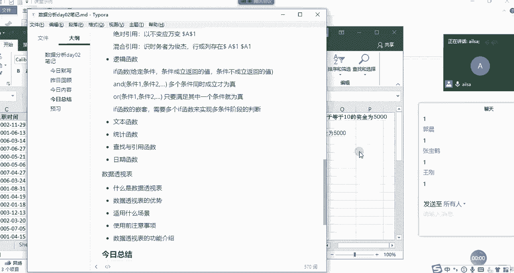

文本函数的话，其实它是相对于文本而言哈，啊相对于文本而言啊，我这个鼠标坏了啊，稍等。

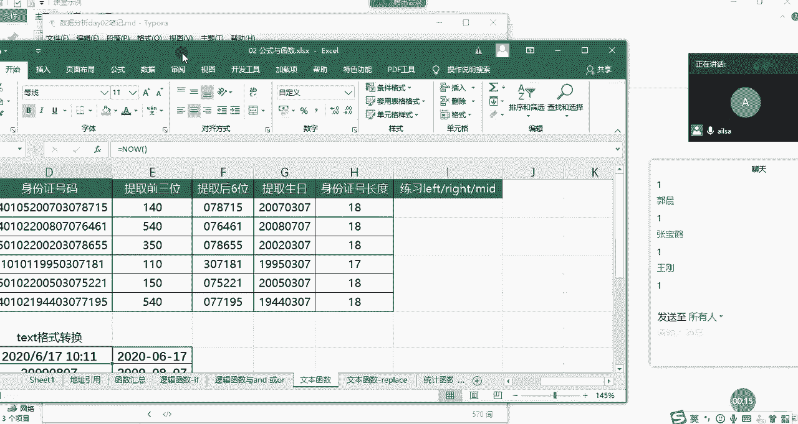

我们可以看到哈，他这个是我们的身份证号码，我们都知道，身份证号码里面包含了很多很多个信息哈，啊啊有我们的省份的编号呀，啊还有我们的啊出生日期呀啊，还有就是性别呀，这些都可以通过身份证号码去判断。

那接下来呢，我就想从这个18位的身份证号码当中，提取一部分我所想要的信息，这个时候我们用到的就是文本函数，那文本函数的三剑客就是left right meet啊，就是左右中啊，从左边开始取。

从右边开始取，从中间开始取，这啊三个嗯的一个不同的取值方式，我们在这里面去写，跟他进行一个核对哈，那你比如说我想提取前三位的时候，那我们想一下前三位，然后对于我们而言，它就属于是左手边的前三位哈。

所以说他啊就是我们面对电脑的左手边，要等于left啊，Left，然后我们看一下它的组成部分，函数的组成部分是有两个，第一个是text，也就是我们的文本，也就是说你想对文本进行一个操作。

你到底是对哪个文本进行一个操作呢，这个时候我们是对它进行一个操作，那你想去它左边几个啊，几个字符的长度呢，这里面的啊字符的话就是一个数字算一个字符，一个汉字还是算一个字符，一个英文单词也是算一个字符。

在这里没有什么啊长度啊，到底内存地址或者是啊占位符啊等等，这些都没有哈，我们都默认是一个就可以了，这个都比较呃比较那个统一一些，所以说我们left，然后取前三位，那我们在这里面输入三就可以了。

number杠chars，就是你输你截取几个东西哈，截取多少个，我们按右括号，然后我们可以看一下啊，双击下来唉，这就是我们所想要的效果，一百四五百四三百5110啊，这样的一个结果啊，这是left啊。

我讲完left right和me之后，在啊跟大家进行一个互动哈，大家现在也可以自己手动操作一下，那我们看一下write函数啊，也是一样的，就是从我们我们的手的右边进行一个取值哈，面对电脑RIGHT啊。

write函数它的组成部分也是一样，一个是文本，一个是取的长度，那我们的文本还是我们的身份证号码，那我们的长度呢就是后六位，那我们就输入六就可以了啊，输入六，然后我们看一下哎，好像结果也是一样的。

好结果也是一样的啊。

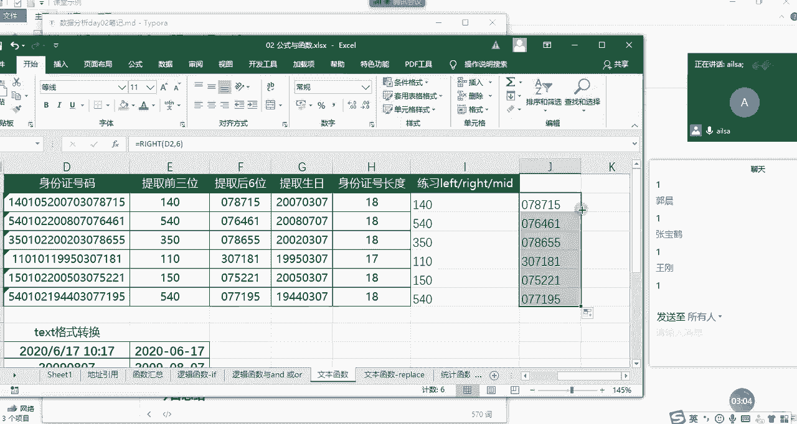

那接着我们看一下，我们如果说想从中间取值的话，稍等啊，我现在没有鼠标啊，有点费劲，我们现在想从啊中间取值的话啊。

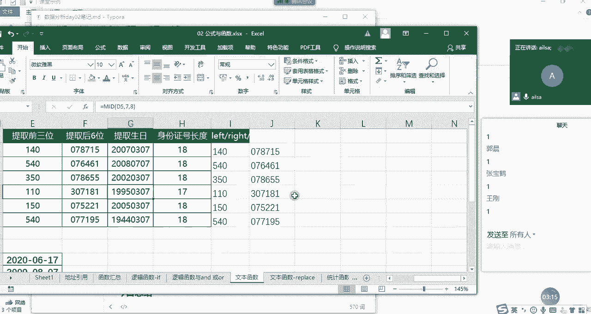

中间取值啊。

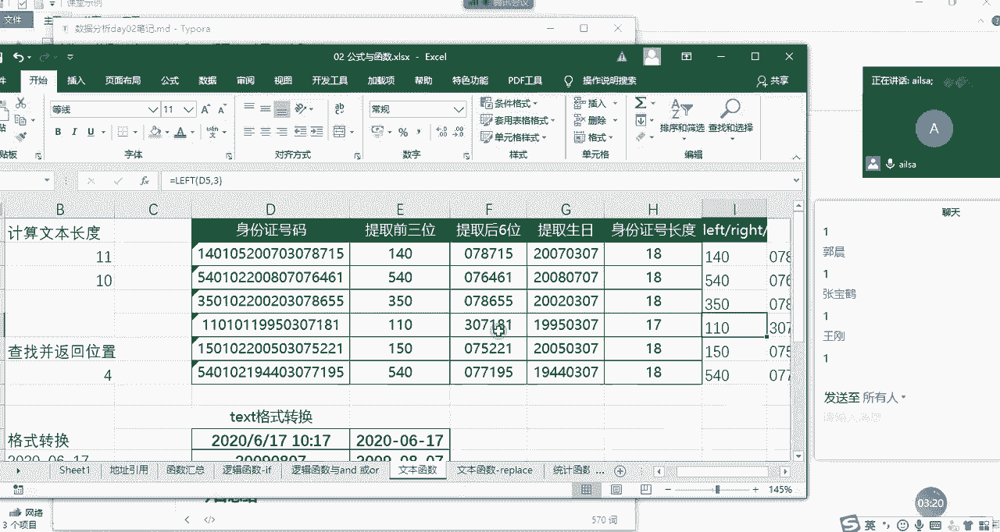

我们可以看一下，那也就是要提取生日，我们都知道生日的话是我们的第几位啊，啊生日应该是我们的，我们数一下哈，123456，第七位开始对吧，第七位开始，然后是年是四个啊，然后取多长呢。

年是四个月和日是分别两个，那就是取八个对吧，取八位，然后啊我们从D也就是说从D啊，我看看啊，从第啊七个啊，这里面的位置的第七个开始，然后取八个这样的一个长度，然后跟大家说一下。

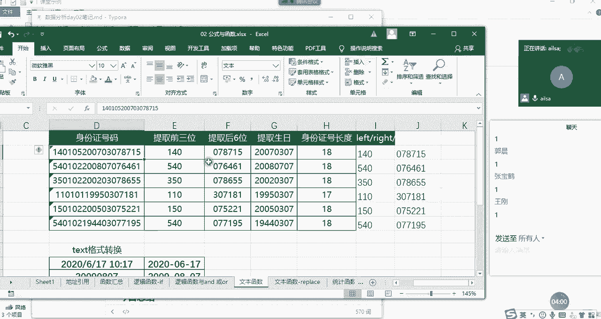

在我们excel当中，它的未知区不是从零开始的，是从一开始的哈，所以说是mid，然后我们的text还是选择我们的身份证号码，然后从start number呢就从第几个开始取，我们刚才数了。

从第七个开始取，然后取多长呢，number差就是取八位啊，我们看一下所想要的效果，唉，那就是我们最终得出来的就是我们的啊，年月日的一个出生日期的啊，这样的一个结果。

这就是left right和mid函数，我们在对于when文本进行一个啊，操作和截取的时候，主要使用这三个兄弟函数啊，大家对于这三个有什么疑问没有啊，没有疑问的话，扣一有疑问扣二，然后抛出问题，好的啊。

好的都没有什么问题是吧好，那我们接着讲一个叫LN函数的哈，LN函数就是我们的长度啊，我们在Python当中也都学，那其实这个就是很简单，那什么时候我们会用到LN函数呢，就是在我的工作当中。

我经常用到的就是有一些啊，有一些长度它是固定的，你比如说手机号码，身份证号码啊，或者是那个邮编啊等等这些，它的长度是固定的，但是有有时候你需要检查一下，就是数据清洗的过程当中。

你需要检查一下它的它到底数据是不是准确的，你就可以通过它的长度去判断你，比如说这个身份证号码它就是18位，我们看看它有没有啊，填错的哈，因为一般情况下，身份证号码都是手工进行一个记录的。

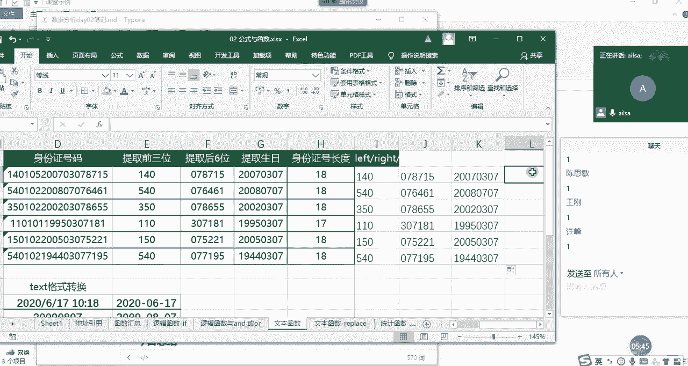

然后等于LN，然后他这个函数的组成部分就只有啊。

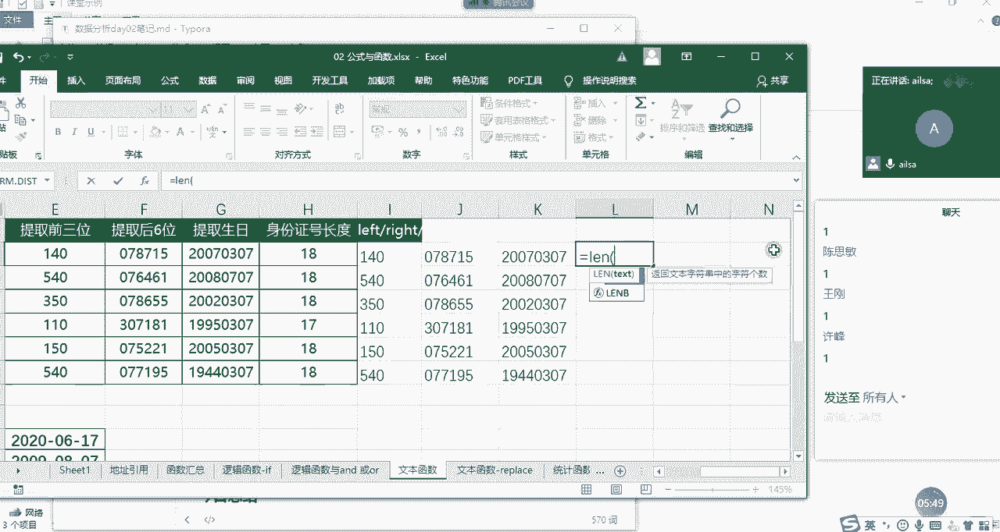

就只有很简单，就只有我们的文本，我们选择它啊，我们选择它，然后在这里写哈，因为我现在表格已经过不来了啊。

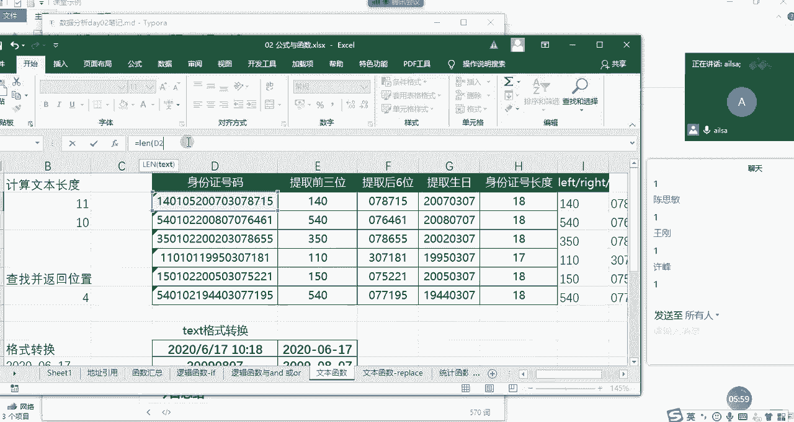

我们选择enter键，我们可以看到是18位，然后我们再双击下来啊，双击下来为我们看到有一个17位的，那说明啊。

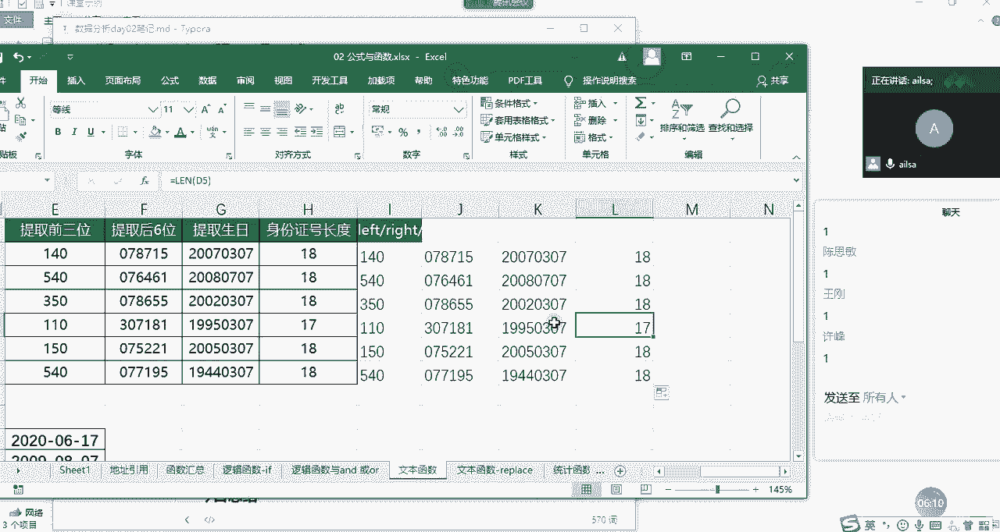

这个啊这个啊身份证号码就少了一位啊，那就存在录入错误的问题，你就要去跟相关的人员去核对啊，然后他正确的身份证号码是什么，对于一些很重要的数据而言，我们可能真的是需要一个个去核对它的一个，准确性的问题啊。

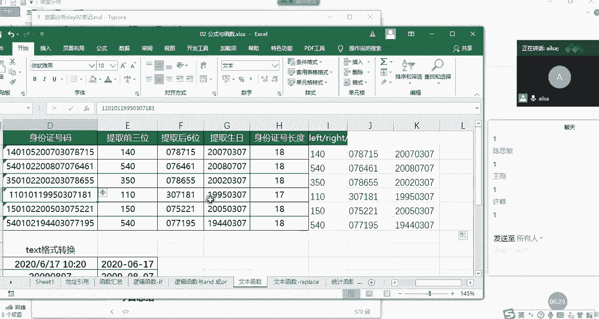

这是啊alone函数，我们再接着往下走，看text函数，text函数也是文本函数，但是它主要是对于格式的转换，我们在昨天讲那个呃日期时间格式的时候，也说过text啊。

我们看给定这样的一个日期时间格式之后，我如果想让它转成这样的话，我们可以第一步操作就是CTRL加一。

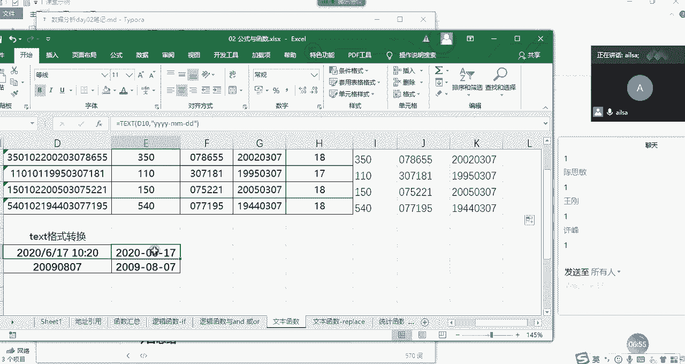

然后把它设置成日期格式就可以了，因为这种有很多种形式对吧。

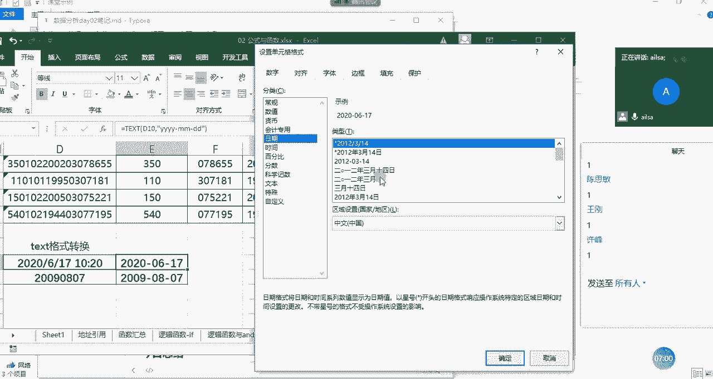

你设置成哪种形式都可以，那第二种方式的话，你就是可以用text啊，text我们看一下它函数的组成啊，它函数的组成的话，第一个就是value，也就是说你要针对哪一个啊，单元格里面的值进行一个格式的设置。

我们选择它，那第二个我们看到format就知道是格式化了，对不对，哎我要对它进行一个格式化，要设置成什么样呢，这个时候我们可以把它设置成啊YYYY啊，就是年啊，杠啊啊，直接是杠，然后是MM啊。

杠DD啊这样的一个形式，然后输入完了之后，我们按右括号，我们可以看到就可以达到我们所想要的效果，那对于text格式的转换，它还有一个很重要的功能在于什么呢。

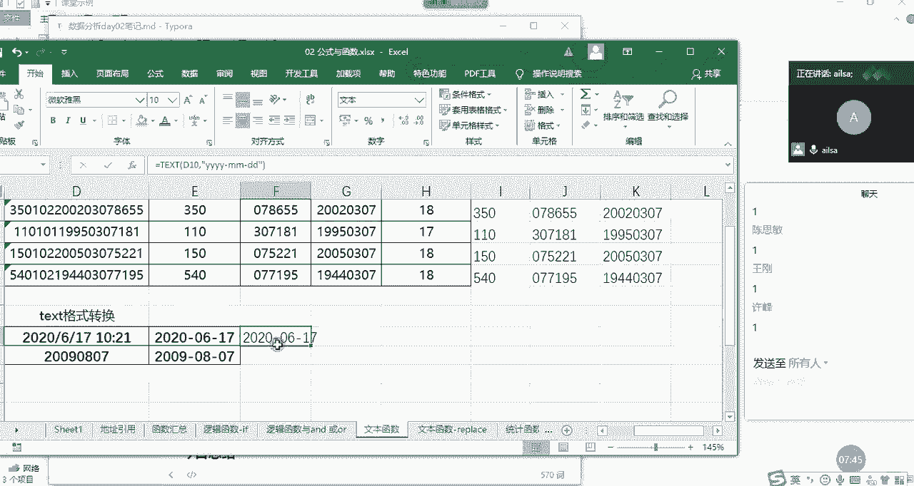

我们可以看到就是设置单元格格式，有一个自定义啊，这里面有很多自定义的一些格式，大家可能都看不懂啊，就是如果呃你想对它进行一个就特殊，特殊格式的一个自定义的时候，你可以用text。

然后按照这里面的一些书写方式，来实现自己的一个个性化的格式设置啊，因为这个有点难哈，所以说啊大家目前不用掌握啊，我就跟大家说一下，有这样的一个功能就可以了啊。

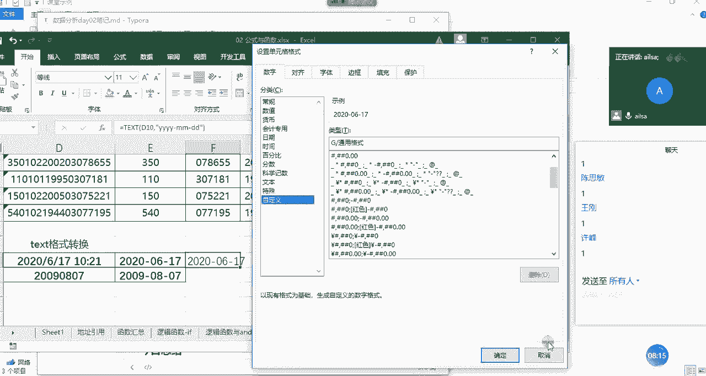

呃我们接下来我把笔记给大家做一下，那我们的文本函数的话，我这边讲了啊，left啊，Right，R r i g g bright，然后还有我们的mid函数啊，以及嗯我们的LN函数和text函数。

那对于left函数而言，它的组成部分第一个就是文本啊，你要对哪个文本进行操作，那第二个组成部分就是它的长度，你要截取多长的字符，这里面的字符的话啊，就是呃不管是数字字母还是汉字都是一个啊。

长度都是一哈啊，write也是一样，文本嗯，文本啊，然后是长度啊，然后密的函数稍微啊多了一个参数就是什么呢，首先是文本，第二个就是它的啊起始位置，因为它是从中间截，你要告诉他一个位置叫起始啊位置。

然后第三个啊，第三个的话就是它的长度啊，记得我们所有的逗号都是英文状态下的，不仅仅是逗号，包括我们的括号也是英文状态下的啊，不然你输入中文它就会报错，learn的话就只有一个就是我们的文本啊。

那text它由两部分组成，第一个的话就是文本啊，第二个就是你要转换的一个格式啊，这个格式可以是自定义的啊，按照一定的书写规则，就可以实现我们所想要的效果啊，那这个就是文本函数，我就讲这么多。

然后大家对于文本函数有什么问题，没有没有什么问题，扣一，嗯好的。

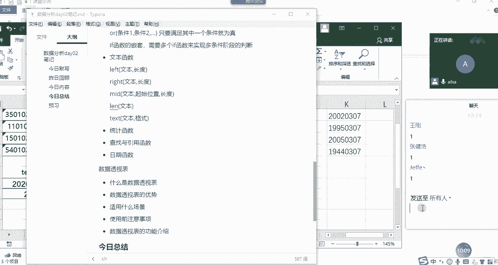

那我啊断一下啊。