# 强推！这可能是B站最全的【Python金融量化+业务数据分析】系列课程了，保姆级教程，手把手教你学 - P41：05 统计函数 - python数字游侠 - BV1FFDDYCE2g

计函数哈。

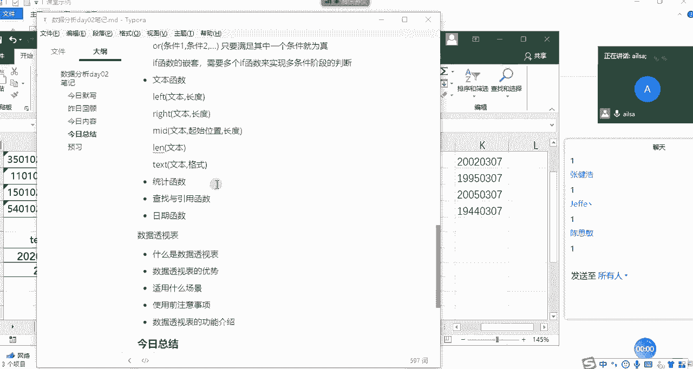

接下来我们要讲解的是统计函数嗯，桶啊还少一个replace哈，OK啊，replace啊，那我们再补一个补一个replace哈，replace函数的话相当于是一个替换，也就是替换文本里面的内容。

那我们该怎么去操作呢，我们先把它打出来，看一下replace里面都有哪些组成部分啊，我们可以看到第一个是old的杠text，也就是说你既然要对它进行一个替换，你替换的原始的文本是谁。

那我们肯定是手机号码，然后你要就是它你要替换，你不可能替换所有的，你可能是只替换其中一部分，那你从哪个地方开始替换，也就是跟密的里面的一个呃，起始位置是一个意思，那这个时候比如说现在我们想隐藏的是啊。

8~10位，那就是从第八位开始啊，第八位开始，然后你要替换多长的啊，一个文本内容，我们看是三个对吧，那它的长度就是三，那你要替换成啊，把这三啊三个呃字符你要替换成什么内容呢。

这个时候啊我们要替换成三个星，我们把星输入进来三个星哈，那你要写一个星，它就会只替换一个啊，替换成一个星，然后这个时候我们按enter键，它就所达到了我们所想要的效果。

那也就是说replace它的组成部分，第一个就是你的原始的啊，原始的文本，第二个就是你要替换的起始位置，然后第三个就是你整个替换的长度，最后一个就是它啊，我们啊就是你要替换成的一个新的文本内容。

你指定的啊这一部分替换成了一个新的内容啊。

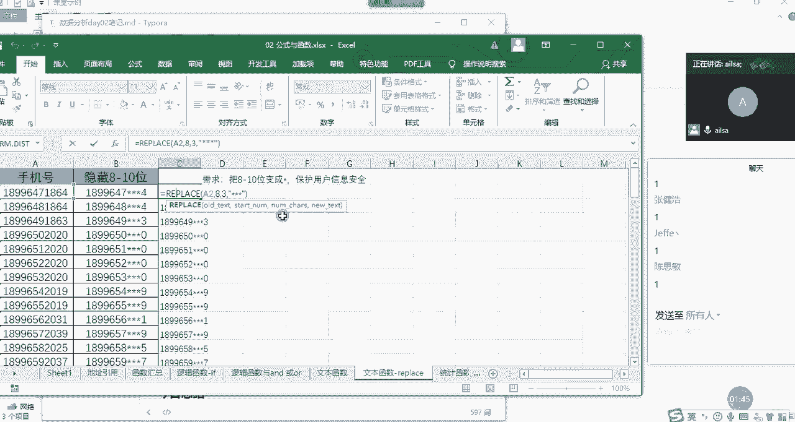

我们补充一下replace，OK我们最后还有一个replace，IPLACE哈L啊，其实对于每一种呃每一种方式而言，你只要掌握它的语法就可以了，他最终的呃呃思想是万变不离其宗的啊。

replace第一个就是我们的原始啊文本啊，第二个就是它的替换起始位置，那第三个是他的啊，第三个是它替换的长度哈，啊文本啊，替换长度啊，第四个的话就是它的替换的新值啊，就是替换的新内容啊。

啊这是我们的replace，让大家大家对于replace啊有什么问题没有，现在可以自己操作一下哈，操作一下啊，如果操作完没有问题，我们就讲下面的文和统计函数，没有问题的话，给我扣个一哈，操作完之后。

跑的还挺快哈，看来我讲的是比较简单一些哈，大家大家都学会了，很开心。

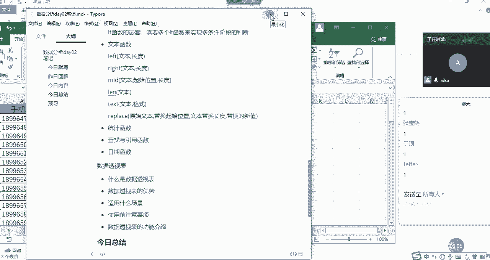

好的那我们说下面的一个啊统计函数，统计函数的话，其实就是嗯这是我们在计算数的当中的一些啊，应用哈，用的不多啊，这个真的是用的不多啊，首先我们先看第一个啊，第一个向下取整哈，向下舍入取整啊。

这跟四舍五入还有点差别，什么意思呢，你比如说啊int函数，我们在这里啊，这给了几个数值，然后我们看一下他所想要的效果啊，int啊它只有一个啊，它只有一个参数，就是number啊，你给一个值。

然后他给你向下舍入取整，什么叫向下舍入取整呢，哎我们看一下啊。

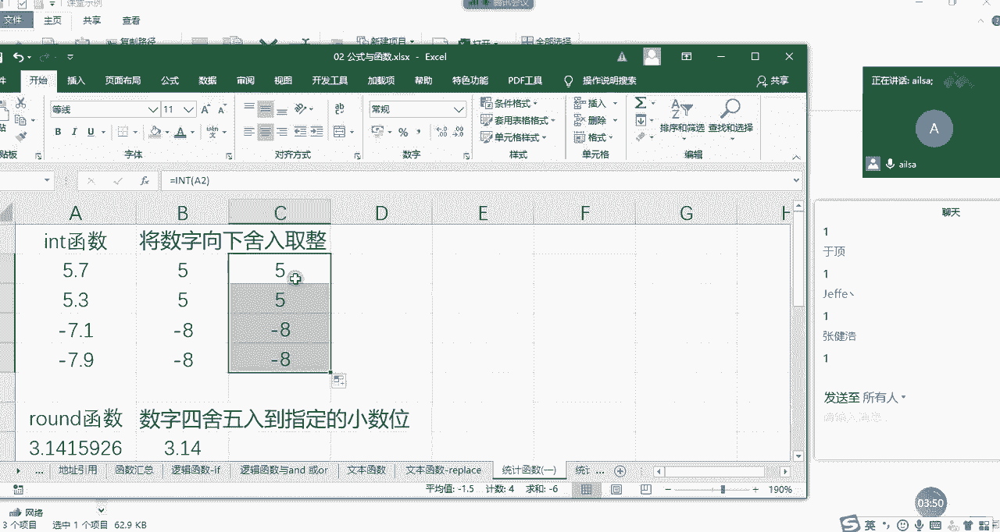

我们啊需要画一个图哈，需要画个图。

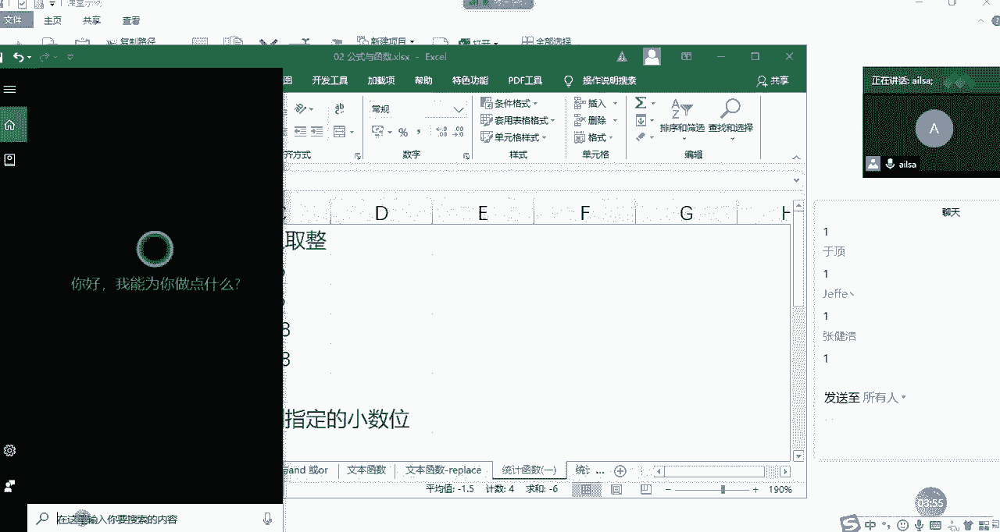

我给大家解释一下什么叫线下收入取整哈，我滴妈呀，我的鼠标坏了嗯。

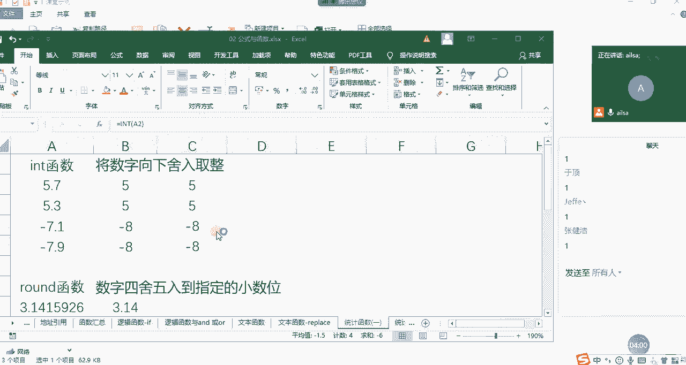

我这是灵魂画着哈，希望大家理解一下，没有鼠标啊，然后这个时候这里面是零啊，哎呀妈呀，真的是零，然后这个是呢，这个是五，啊五啊，然后这个是八，难为我了，付吧哈付吧，然后这个是啊，假设哈大家不要看长度哈。

长度的话就不合理啊，这个是负，七啊，这个是我们看一下这个值哈啊，这个是呃六，啊六来同志们，我们看一下它整个的一个啊整个的一个值哈，5。7啊，5。7是在大概这个位置啊，这个位置好，我们换个颜色啊。

用刷子啊，5。7大概是这个位置对吧啊，这个位置，那它向下收入取证，指的是向它就是在这个它相邻的整数当中，偏小的这个那5~6之间偏小的整数就是五，对不对啊，是这样，那我们对于正数而言其实特别好理解。

就是它相邻的那个小的那个整数啊，取整就可以了，那对于小数而言，大家需要有一个思维哈，就是小数的话数值就这个我们不看负号值越大，它越小，所以说你看-7。1大概是在这个位置对吧，那它在这两个相邻的整数当中。

偏小的是八啊是吧，所以它返回的是八，而不是七，大家这个一定要扭转过来就可以了。

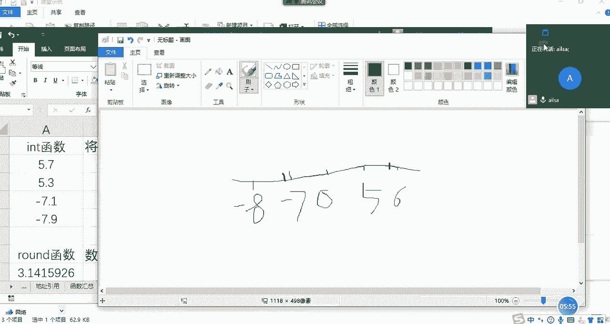

我主要想强调的是这个嗯啊这个明白了吗。

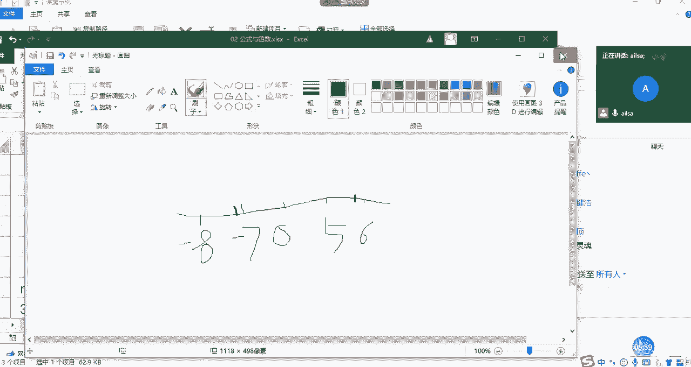

啊哈哈，我这个鼠标啊，真的是啊啊鼠标真的是啊非常给力哈，在我需要它的时候，它真的是没电了哈啊他的电池啊，大家这个明白了没有明白，给我扣个一啊，别别管是不是灵魂画者了，OK哈啊，这是向下舍入去整啊。

嗯OK这是int哈，然后我们再看一下run的函数，run的函数我们都学过哈，就是四舍五五入，这个就没有什么好说的了，我们看一下它的函数的组成部分，我看函数组成部分就是把它函数输入进来。

然后看一下诶它到底是怎么来呃，呃你呃怎么来组成的哈啊啊，首先他第一个就是你要进行一个小数位的啊，啊四舍五入，你肯定要输入你的数字对吧，第二个你要啊计算小数位，你得告诉我他这个唉你要保留几位，对不对。

很简单啊，我们一般是两位啊，选择它直接就出来了啊，这个就很简单哈对啊，四面说的没有问题，就是比它小的整，有时候理解起来有点费劲，画个图就可以了哈，画个图就比较简单一些，然后round函数我已经讲完了哈。

现在已经到round函数了，然后看mod函数哈，mode函数就是取余数吗，两数相乘取余数啊，这个的话它就等于mod啊，我们看下组成，第一个就是我们的除数，我们的除数是五，然后被除数是三啊。

然后我们看一下得出来的结果就是二啊，5÷3啊，就等于二，就是它的组成部分，一个是除数啊，一个是除数，一个是被除数啊，mod函数，我们可以看到，统计函数还相对的比较简单一些哈，我看还有没有，OK没有了哈。

我们讲了一个int函数，round函数，还有就是我们的mod函数这三个啊，这三个函数啊，这是我们的统计函数的一个简单应用哈。

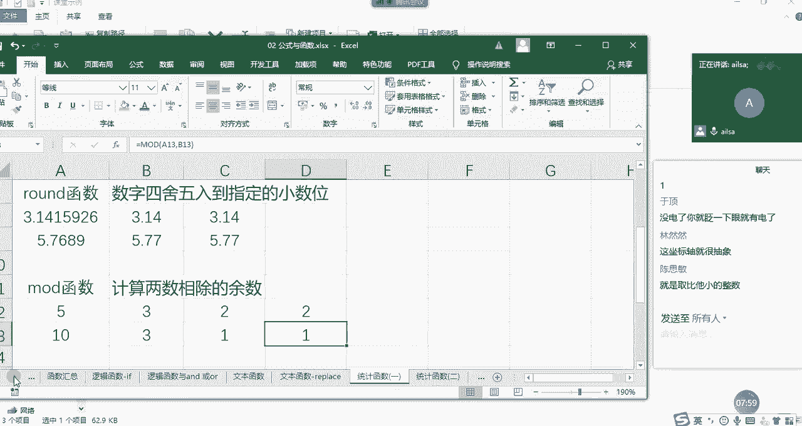

啊当然了，不仅仅是这些啊，我这边先做一下我们的笔记，给大家总结一下我们的int函数啊，还有就是呃around函数，r o u n d round函数，还有就是mood函数啊，mod函数。

然后int函数的话啊，它们的组成部分其实都一样啊，就是我的number啊，是用数字，然后第二个就是啊啊啊这个只有一个啊，只有一个number，二数字round函数的话，第一个是数字。

第二个就是你取得小数位对吧，小数位数嗯，那mood的函数mod函数第一个是啊我们的除数，第二个被除数，对吧啊，这样的一个组成部分，这三个就已经讲完了，然后啊我们再解释一下哈，int函数就是向下舍入啊。

取整，舍入，摄入取整，OK然后run函数就是啊保留啊保留几位小数，然后mod函数就是我们的呃，呃整除取余取余数对吧，OK这是我们的统计函数的前几个，然后大家对于这三个函数有没有什么问题，没有问题的话。

扣一，嗯相信大家都具有数学背景的。

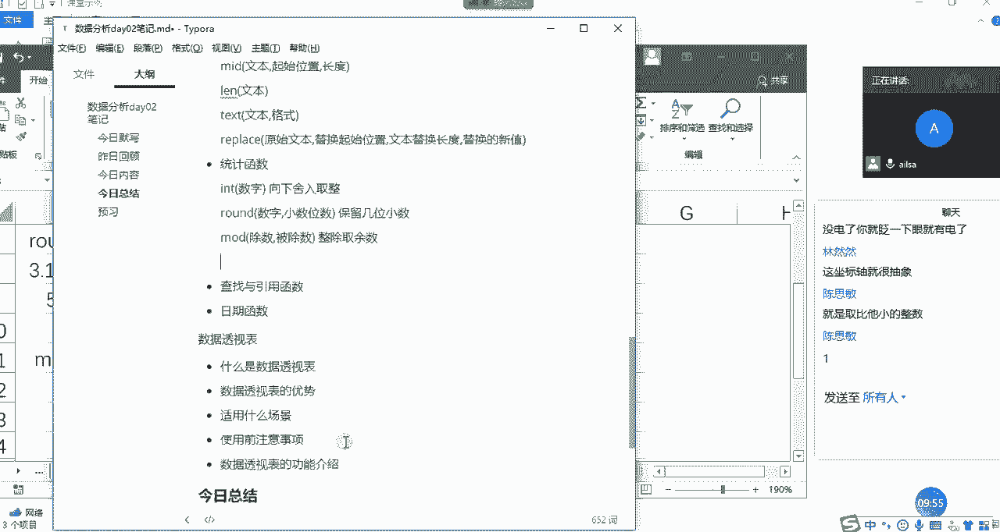

应该都不难哈，啊都不难，我们再看一下，再看几个比较简单的，余数应该没有小数吧，你见过余数是小数的吗，对吧嗯我们再看一下哈，OK其他人还有没有什么问题，没有问题，给我扣一，我看还有没扣的啊，还真能小说。

OK那我们私下聊一下啊，私下我们再讨论一下，好那我再接着介介绍，我们统计函数的第二个部分，也是比较简单的，最大值，最小值，均值求和计数哈，比如说哎这是我们之前一个班的一个成绩。

然后我以他为例来给大家讲一下啊，这个就啊一带而过哈，这个大家经常用哈，那最大值我们都知道什么max对吧，哎一组数据当中最大值，那我们可以知道它的组成部分，就是给你一组数据，那对于一组数据而言。

然后我们可以单独一个一个数字进行输入，如果是连续的数据区域的话，我们直接选择啊我们的数据区域就可以了哈，啊我们看到啊还挺长，这没鼠标的日子稍等啊，啊还好我有快捷方式哈，OK那我们选择这个东西之后。

然后我们按enter键，那接下来，这个就是我们在我们的这组数据当中的，一个最大值，然后我们看最小值，它就等于什么，等于mean对吧，一组数据灯的最小值啊，那就是B啊，我们还是看笔试成绩啊，B几呢啊。

B3啊，B2啊，B2到多少呢啊，我这边先写B1哦，60应该够了，那我们看一下A46，我们看它是到啊，B63哈，改一下我们这个区域的选择，可以自己手动输入哈，也没必要说非得啊怎么怎么去选。

OK最小值是44，最大值是68，那均值怎么来写呢，就是average a v aav12AGE，就是这个值返回它的算术平均值，OK那它也是啊这样的一个组成B1啊，到B63，嗯10~63吗。

KB1到B63，这就是我们的一个均值的啊，计算好，那下面求和哈啊求和没有关系哈，嗯没鼠标也没有关系，然后我们求和也是从B1啊，然后到B啊，63啊，这样的话是3580，OK没有问题啊，这是大家记一下哈。

我们最大值是max，最小值是min，均值是average啊，然后是求和是sum啊，然后计数是count啊，啊这个跟我们学的是一模一样啊，然后是B1啊，不是为了给你们讲课吗，我也没招啊，啊对吧。

我我等一会儿去看一下我们家里有没有电池啊，OK哈就是我们的啊最大值最小值均值啊，均值求和和计数。

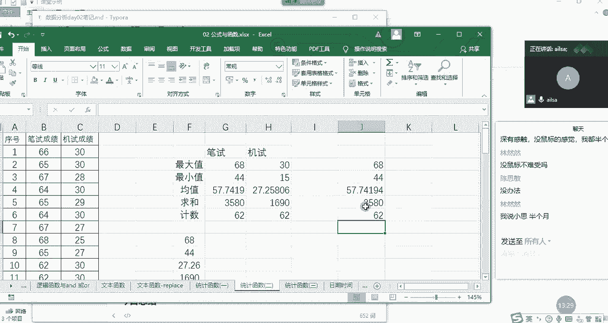

我们接下来总结一下啊，我们总结完了之后就休息哈，我去找个电池啊，然后我们再想一下哈，最大值max啊，最小值min，然后均值AVERAGEAVERAGE均值，然后是sum求和啊，然后count计数对吧。

这种都是最简单最简单的统计函数了，那它的组成部分都一样，是什么呢，都是我们的数据区域啊，都是我们的数据区域啊，我这边就只写一个，然后这边啊我在啊最大值啊，最小值最小值，然后是平均值，平均值啊。

这是我们的求和求和，然后是奇数啊对吧，基数啊这样的一个计算方式啊，就可以了，好的，那我们啊那我们10。38，我们休息一下啊，休息10分钟，休息10分钟，然后到呃到50啊，我们到五十十。50集合啊。

不什么集合。

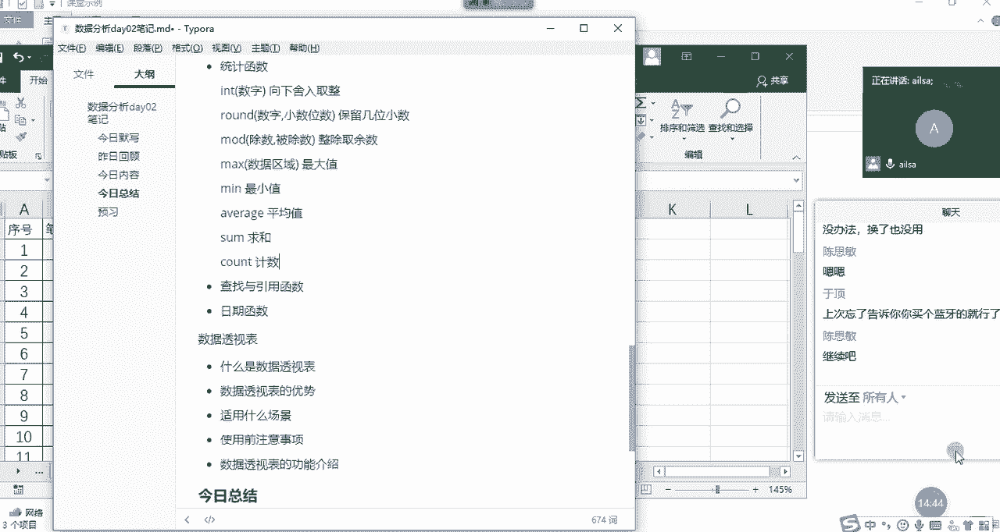