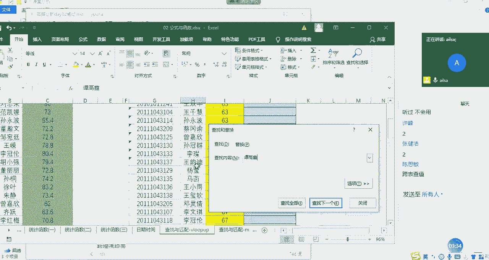
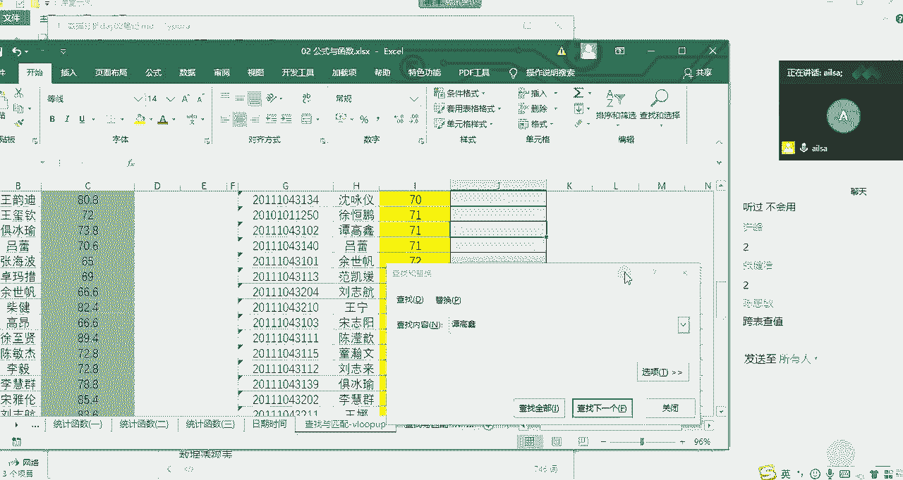

# 强推！这可能是B站最全的【Python金融量化+业务数据分析】系列课程了，保姆级教程，手把手教你学 - P43：07 查找与匹配函数 - python数字游侠 - BV1FFDDYCE2g

啊我们的查找与引用函数了哈。

日期函数我们最后讲哈查找与引用函数哈，啊OK我现在先不讲这个东西，我问一下大家啊，有没有人听说过we look up，有的话扣一哈，没有的话扣二，你看啊思敏应该啊，思敏应该用过哈。

因为we look up函数在我们的啊，它号称明星函数哈，也就是说几乎在很多啊工作当中，或者很多岗位当中啊，很多做数据分析的，做用excel的人来说都是经常用到的，跟大家举一个就比较逗的事例哈。

我之前有个学生啊，然后呢，嗯他嗯，他也是想从事数据分析方向的一个呃岗位的，然后他在这，但是他在这学的是开发，然后来呢他在处理一些数据的时候，然后用到了we look up，然后他又找我。

然后我就给他详细讲了一讲，唉该怎么去使用，注意事项是什么什么，然后他后来找了一份数据分析的工作，她跟我说，她前一个月全靠we look up支撑她度过的难关，然后就说老师，你教的一个知识点，竟然就是。

解决了我工作当中大部分的一个问题哈，当然了，他因为他刚去的时候呃，刚去的时候是个小白嘛，所以说主要是做数据处理啊等等清洗啊，这样的一些工作啊，那所以说这个函数还是非常重要的啊，大家一定要好好学哈。

嗯那我讲一下这个函数的应用场景啊，什么情况下我们需要使用we look up呢，啊就是比如说唉你想做一个啊一个表，唉，这个表呢它的数据源啊是类似的，哈格式是类似的，但是它的数据源来源于不同的地方。

比如说有别的部门啊，统计的有从系统中导出来的啊，但是它都属于同一类型，你比如说都是人员相关的数据，比如说成绩，你的大学的计算机的成绩，数据库的成绩，你的统计学知识的统计，这些成绩可能都来源于不同的系统。

然后你需要把它归纳到一个表中，然后去看这个人所有科目的成绩，这样的一个需求的时候啊，那我们有的人说，那你直接复制粘贴过来不就可以了吗，啊当然也可以，但是你有没有考虑过一个问题。

我们在进行系统开发的过程当中，导出来的人的姓名的排序真的是一模一样的吗，不可能吧，对不对，有的是这个顺序，有的是那个顺序，有的是乱七八糟的顺序，有的是按A到Z怎么怎么着，反正就很乱。

那我们如果说想从这边啊，这边这个表在这里找到这个人，然后并把成绩匹配过来的时候，那我们如果不会we look up的话，那我们只有一个个找啦对吧，我们在这里面找到弹高薪。

然后在这里面去找找啊找啊找CTRL加F对吧，有的人说哎CTRL加F我去找到它啊，我们可以CTRL加F1下啊，试试啊。

要复制一下啊，稍等，那我们演示一下，如果说不会we look up的话，该怎么去操作哈，CTRL加C啊，对CTRL加F。

然后粘贴过来好看再插入下一个A，找到了弹高金啊，非常好啊，找到了弹钢琴，他的成绩是多少呢，我们看一下弹高薪的成绩是额82。8，然后我们就可以把弹高薪啊。

的成绩写在这里对吧，82。8啊啊，谈高薪的成绩没有鼠标，真的好麻烦，再拉一下啊，这个时候我们在这里面写上82。8对吧，那这这这这个唉这种超市好像好像也行啊，但是真的真的好笨呐啊。

或者说如果你的人特别多的时候，你一个个进行查，岂不是哦要废了。

对不对啊，所以说我们面对这种情况，那就是跨表的查值查。

就是你这个表达也可以，但是我们更多的是啊强调的是他的一个匹配，哎，就是我从这边找到这个人，把他的值匹配过来啊，就是我们叫查找与匹配啊，这样的一个函数，那怎么来操作呢，首先我们在这里输入等号。

然后输入我们的we look up啊，we look up函数，然后我们看一下它它的函数组成部分，第一个是look up value，就是你要跟你要查找的对象是什么，大家可以理解为查找的对象。

这个时候我们可以根据学号进行查找，我们也可以根据姓名进行查找，但是有时候姓名有可能重名，对不对，所以说我们会根据学号，学号是唯一的啊，那我在这里演示的时候是根据姓名哈，因为姓名我这边都查过了。

都是没有重名的啊，这个就看大家的一个需求就可以了啊，我选择姓名，这就是我查找的对象啊，那既然你有了查找对象，你这个table garray大家都知道array是数组的意思，那我们再理解一下。

它就是列表的意思，那你在哪个表里面，或者哪个表里的某个区域去找这个姓名呢。

那我们是在唉这个表当中的这些区域当中去找，对不对，那我们选中一下啊。

我选到这里，然后这就是我们的查找区域，我们叫查找区域哈，查找区域，然后我们可以啊在这里写哈，然后第三个组成部分是什么呢啊sorry我写错了哈，这边应该是B列到C列哈，我们的查找区域啊，它不是单独的一列。

它是一个啊，它是一个区域啊，我们查找的是从姓名开始后面的这些值啊，大家明白了吧，嗯那我们查找区域确定了之后，第三个组成部分是，我们可以看到COL是什么意思呢，就是我们的columns就是我们的列啊。

index就是位置的意思，number哈，也就是说你在这个区域里面，根据这个姓名去查找，你最后想得到一个啊哪一列的值啊，我们想得到的是不是啊，数据库与技术这样的一个成绩的值啊。

那它在这个区域当中是属于第几列，它是从一开始的哈，这是第一列，你选择区域的第一列，第二列，所以我们在这里面输入的是二，那第三个啊组成部分啊，这是第一个，第二个，第三个，那第四个组成部分就是你的查找方式。

到底是近似查找还是精确查找，那近似查找的话就是它比如说这里面有黄的，他都会给你找到，那如果是精确查找，就必须叫黄书欣的，他才能给你找到，一般情况下，我们在进行为look up匹配的时候。

都采用的是精确查找，因为模糊查查找的话，它的呃错误率太高了啊，一般选择是零啊，零作为我们的精确查找，作为false，零是false，一为true啊啊我们这边看一下enter键，然后64。8。

这就是我们找到的这个成绩，我再来解释一下这个函数哈，因为刚才有个地方稍微说的不是特别准确，首先第一个你要查这个姓名在这里面啊，它对应的值，你是不是想要想要这样的一个效果，这个时候我们第一个组成部分。

就是我们的查找对象，第二个组成部分就是我们的查找区域唉，那你这个你在哪个区域里面去找这个，学这个姓名，并且你想找到什么值，在这里面需要强调一下，你的这个查找对象必须是在查找区域的第一列，什么意思呢。

你是根据姓名进行查找的，你的区域不不可能要选择，而需要选择ABC这三个列，如果你选择的话，那它就找不着，它就识别不了，所以这个姓名必须是在你选择区域的第一列，嗯啊你跟因为你是根据姓名进行查找的。

然后后面的话对应的是你到底想查找什么值，我们想查找的是这个成绩，那这个成绩在你选择区域的第几列，你要告诉他，那这边的话，它的列的选择不是根据ABC来源的，它是根据你选择区域的第几列。

那默认是从第一列开始，第一列，第二列，第三列这样子，所以我们选择的是二，最后一个就是你查找的方式，你到底是精确查找还是模糊查找，一般情况下默认的都为零，是我们的精确查找，我们按enter键。

这个时候我再往下拖动的时候，大家会发现一个什么问题，我们这个区域是不能发生变化的，对不对，所以说我们需要加上绝对引用的符号啊，加上绝对引用的符号啊，按F4enter键好，这个时候我们再双击一下。

双击下这个我们就达到了我们所想要的效果，可能有人说哎这里面会有报错啊，那当然了，你在进行一个v look up匹配的过程当中，肯定会有没匹配上的，这个很正常，因为他有可能这个人没有成绩。

或者还有可能是因为你进行的是一个精确匹配，有可能这里面的姓名加了一个空格呀，啊你看不到，所以他也匹配不上，你需要进行一个一一的核查，然后现在我问一下大家，对于we look up有什么问题没有啊。

有问题就说啊，因为这个稍微有点难，OK啊，有问题有问题扣二，然后抛问题没有问题扣一，啊这个一定要下去的话，一定要练习哈，我们也有对应的一个练习题啊，啊这个大家倒是放心，绝对让大家练够了。

今天的作业会有点多啊，所以做好心理准备啊，好的，那没有什么问题啊，其实你们那应该再抛出一个问题啊，给我如果能抛出这样的问题的话，我觉得你们的思路还是能打开的，什么意思呢。

就是说啊我们在进行数据匹配的过程当中哈，假设啊假设这两张表都很重要，我既然是以这个表匹配为主的，那会不会存在在这个表里，没有这个表里有的成绩，而我却没有统计上呢啊会存在这样的问题吗。

啊啊如果认为会存在的话，扣一然后啊对会存在，那我们该怎么去解决呢，嗯啊我们的解决方案有两种啊，第一种的话，如果别人就告诉你告诉你说，我只统计这些人的成绩，那你就不用管了，对不对，那如果别人告诉你说啊。

我需要看数据库与技术，整个的一个成绩体现的话，我们还需要在这里啊重新匹配一下，看看啊，看看哪些人漏掉了，那就是哪些人报错了，如果他报错了，说明他在这里没有，你就需要把它复制过来啊，进行一个结合好。

这个大家能听明白吗，思敏能听明白吗，就是再反向匹配一下，如果没匹配上，说明啊，这个人在这里没有，你把它复制过来就可以了，这主要是根据实际的业务场景啊来去区分哈啊，其他人呢，其他人听明白了，给我扣个一。

我们就接着往下讲，match函数，OK哈，OK那我们等会儿讲完了match函数，再给大家做这个笔记哈，match函数呢它也是匹配函数，但是它跟we look up之间有什么不一样的地方呢。

首先啊它比vue up要简单啊，我告诉大家它所应用的场景是什么样子的，就是就跟刚才有点像哈，其实刚才我说反向去匹配，这个时候可以用match函数，什么意思呢，就是说假设这个这一列当中啊有这么多人啊。

这类当中也有这么多人，现在我想知道啊，我想知道H列啊啊这边应该是应该是呃IF列，F列的姓名在A列啊，在A列的位置就是什么意思呢，就是说呃我想知道这些人好，这些人是不是都存在在这个表里。

也就是进行一个相互的啊相互的匹配，看啊这里的这些人是否都在这里，或这里的这些人是否都在这里，就是两个表进行一个互相匹配啊，看有没有差异的人员，然后进行一个的操作，我们先给大家做操作哈。

大家看一下就明白了，你比如说啊，你比如说现在我在这里写上match函数mat，它返回的就不是值了，它返回的是一个位置，他的第一个组成部分还是look up value，也就是我要查找的对象啊还是一样的。

第二个就是look up杠array，也就是我查找的区域啊，我们在这个区域进行一个查找，那第三个组成部分就是你的一个，我们看一下哈，我把鼠标定位到这里，第三个组成部分就是呃你的大于小于等等，这些啊。

我们就我们一般情况下使用的都是精确匹配哈，我们直接选择零就可以了，那我们在这个过程当中，需要对我们的数据区域进行一个绝对影音的啊，使用哈，所以加上F4啊，然后我们按右括号NT键让我们看一下。

我们看一下这个返回的四到底是什么，柳完海对吧，它的它在这个位置，它这个四代表什么意思呢，稍等哈。

我拉一下，我们会发现诶这个四好像是对应的第四行吧，它在整个数据区域的是不是也是第四行啊，那它这个四其实返回的就是什么，它所在选择区域的位置，它返回的是一个位置，如果说它能够返回这个位置的话。

那就说明它在这里面是存在的，如果它返回的不是，那说明这个人是不存在的，你比如说哎后面这几个人，他在这个表里就没有返回位置，那说明这个人在这里边儿就不存在，我们就要去核对这些人到底是什么情况啊。

这样的一个操作手段，就是去判断两两个不同的啊，就是表之间他们的人员的差异，或者是说他们的数据的差异啊，这样的一个应用场景，它返回的是这个数据，在这个选择区域里面的位置，如果说能返回位置，那说明存在。

如果不能返回，报错了，那说明不存在啊，是这样的一个结果，大家对于match函数啊能够理解吗，理解扣一啊啊如果能理解就扣一哈。

谢啊自己在自己可以手动的操作一下哈。

嗯它主要就是为了匹配两列之间的一些，额存在与否的值，然后返回的是他的位置，记住这一刻就可以了啊，嗯OK哈，那我看都都差不多了。

我们这边记一下笔记嗯，查找与引用函数，我们啊讲的是we look up，we look up一定要练哈啊我讲的是最基本的用法哈，它还有跟其他函数进行一个嵌套使用啥的啊。

这个我们只要知道函数的一个用法之后，后面就可以自己去琢磨去研发了哈，他这个其实啊其实是师傅领进门修行靠个人啊，we look up的第一个组成部分就是我们的查找对象，第二个组成部分啊，我要加几个逗号。

第二个组成部分就是我们的查找区域啊，第三个组成部分就是我们的啊啊，就是我们的要返回的，返回的值所在所在区域第几列，所在区域的列啊，所在区域的第几列吧，第几列啊，然后最后一个就是查找方式，精零代表精确。

一代表模糊，嗯查找方案，这是我们的一个啊查找匹配函数，查找匹配函数，那match函数呢我们可以对比一下看看啊，match函数，它第一个组成部分就是我们的查找对象对吧。

然后第二个组成部分就是我们的查找区域，第三个组成部分啊，你看它没有返回的列哈，它直接就是啊查找方式，因为它不需要返回值啊，所以他不需要指定你到底给我带过来啊，哪个哪返回哪个值。

它只要说呃你到底查找的方式是什么就可以了，所以它少一个参数，OK啊，这就是我们的呃呃怎么写，这儿来了，没有鼠标，没有鼠标没有关系，OK我们的match函数啊，放在这里啊。

这就是我们的一个也是查找与匹配函数，好吧嗯，下面我们讲最后一个日期时间函数哈。

