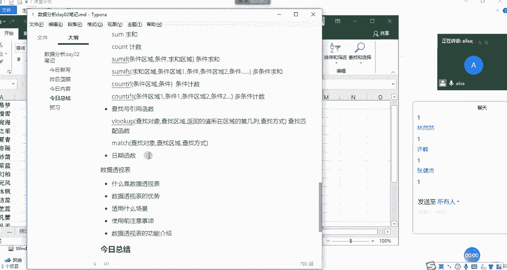
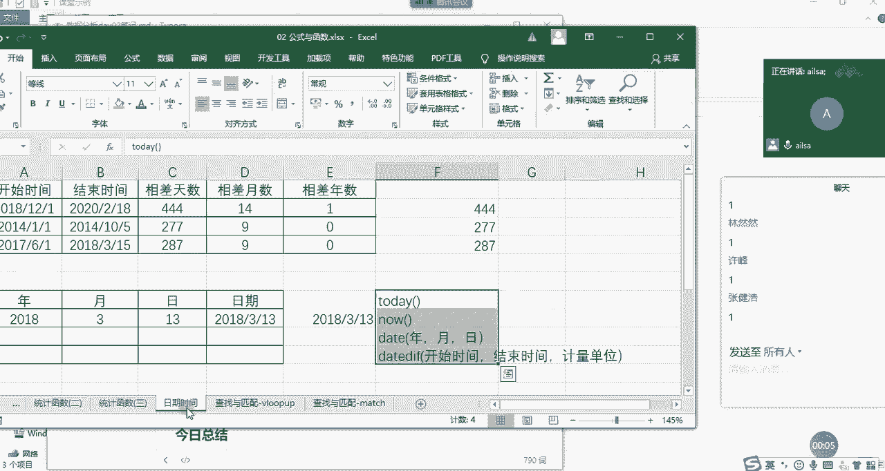
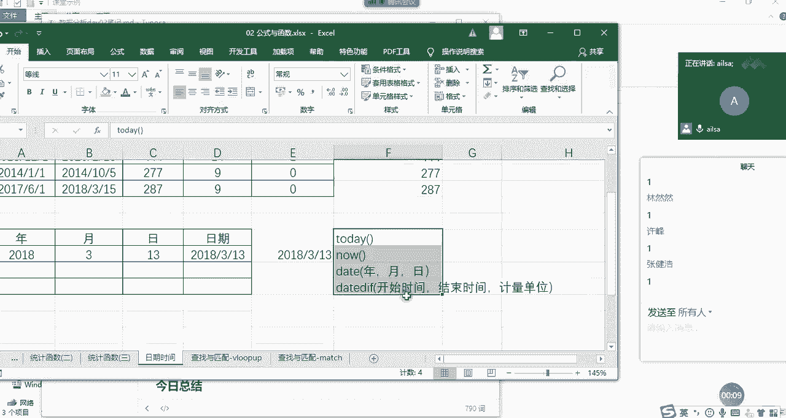
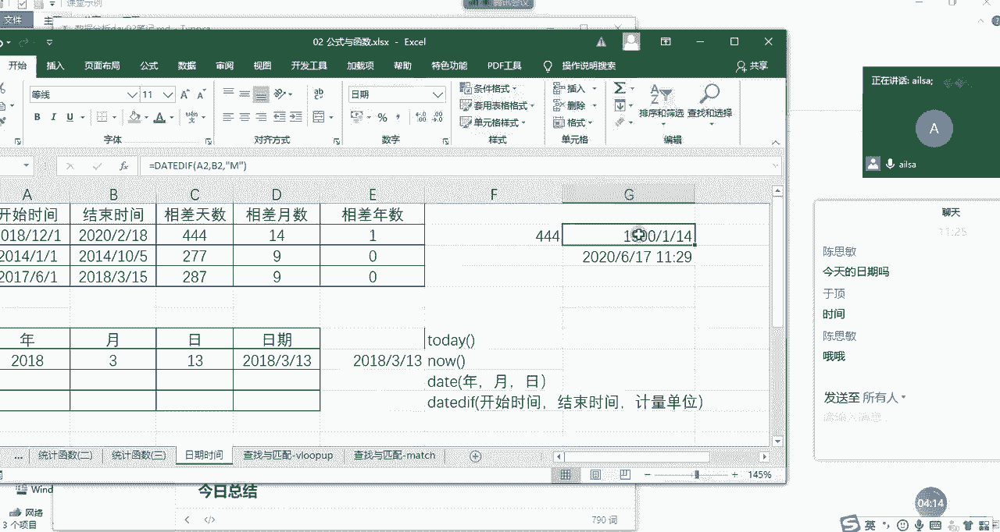
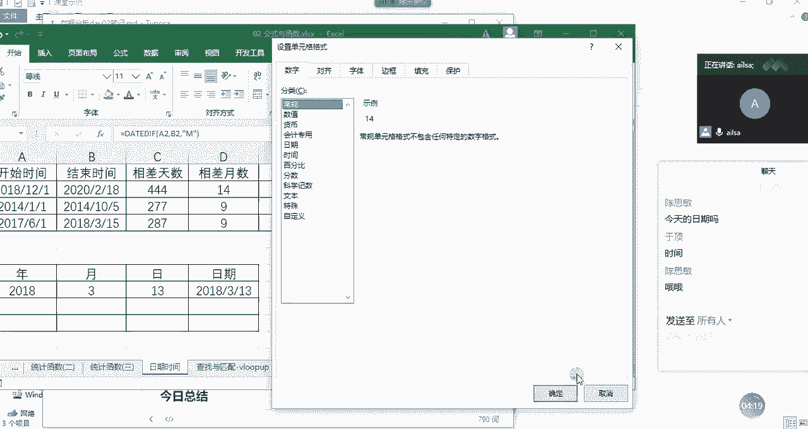
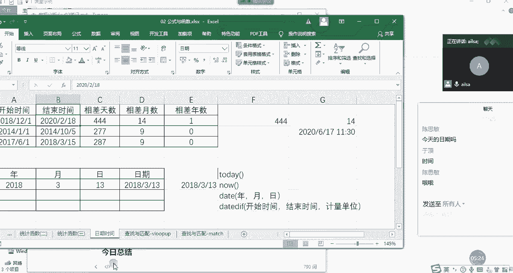
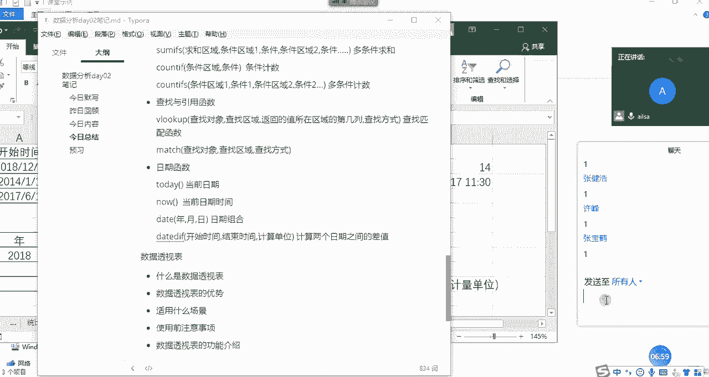

# 强推！这可能是B站最全的【Python金融量化+业务数据分析】系列课程了，保姆级教程，手把手教你学 - P44：08 日期时间函数 - python数字游侠 - BV1FFDDYCE2g

好日期时间函数就简单了哈，好放松一下啊啊OK我们先讲啊。

系统自带的一些日期时间函数哈。

首先第一个就是today，来我们看一下，我们在这里面输入today会发生什么奇妙的变化，to d a y today啊，来4米，你说会发生什么样的变化，它会返回什么，思敏在吗，嗯非常的聪明哈。

返回今天的日期，那我如果输入now呢，嗯输入now，现在，有人知道吗，对返回日期和时间，也就是现在是2020年6月17号的十，01：26分啊啊啊，因为我们显示的话它应该啊他应该会到秒。

但我们显示到到这个地方就可以了，然后today和now显示的是一个是日期，一个是时间，这是我们的日期，时间函数的一个自动带的一个东西哈，这是大家了解就可以了哈，然后我们再讲一下啊，再讲一下。

我们在工作当中经常会用到的一个啊是函数，叫date函数，大家一看这个就知道啊，好像是跟日期有关系哈啊那它是怎么来组成的，它就是date啊，我们看一下哈，它A你看一看就知道它函数组成部分有三个，一个是年。

一个是月，一个是日，那就特别简单了，如果你有现成的年，然后有现成的月啊，有现成的啊日啊，这样的数据得出来的就是我们的日期时间格式，这就是我们的date函数嗯，它一般用于我们。

如果说对某一列啊进行一个拆分之后，想把它快速的转换为日期格式的话，就可以这么来去操作嗯大家会发现一个问题，就是说我们想实现某一项功能的时候，我们用操作也可以实现，我们用函数也可以实现。

我们啊用其他的一种方式也可以实现对吧，所以说我们实现某一项功能的方式有很多，就看你啊喜欢哪一种就可以了哈，这是我们的date函数，然后我们还有一个叫date date的函数哈，它是计算啊。

它是计算我们的嗯，稍等我把这个数据删一下，它是计算啊，我们的一个相差的啊，相差的呃，呃计算单位哈，比如说你可以计算相差的天数，相差的月数，相差的年数，这在excel当中是一个啊是一个什么函数呢。

是一个隐藏函数，什么意思呢，就是说你看我输了这个东西之后，他并没有提示嗯，当然它没有提示，我也记得它的组成部分哈，第一个就是我们的开始时间也很简单，第二个就是我们的结束时间。

第三个啊就是你不是想计算相差的天数吗，啊你不是想计算相差的一个单位时间吗，这个时间呢如果是天，我们就我们就我们就啊怎么说啊，我们就自己想象一下啊，天是day，我输入D会不会实现我所想要的效果，诶。

好像是对的哈，相差44天，444天，然后如果说我们要计算相差月数的话，我们可以在这里写哈，等于啊还是我们的D，if f只是我们的单位可能会发生变化了啊，还是开始时间一定是先开始时间再结束时间。

然后在这里面既然是相差的月数月不是貌似吗，我在这里面输入M会不会就可以了，OK啊因为这里面啊你看它显示的是1900杠，一杠14，看不懂是不是没有关系哈，因为因为时间的本质。

日期的本质也是数字哈。

因为我刚才还显示的是日期格式，那我们把它改成啊数字就可以了，它就是14个月，那如果说是啊，如果说是啊，相差年数的话，年数的话也是一样哈，等于data data tdf，然后是我们的开始时间。

哎呦没有鼠标的日子开始时间啊，然后结束时间嗯，然后我们的年是year2，对不对，我们在这里面直接输入，直接输入Y啊就可以了，year嘛对吧，所以英文好还是占优势的，OK相差一年啊。

啊我们使用这个函数去计算出来的相差天数，月数和年数的话会更精确一些啊，有的人说你直接两个日期进行一个相减，不就可以了吗，啊当然也是可以，但它好像最终计算出来的是相差的天数哈。

如果是月数和年数的话就不太准了啊，大家如果知道这个函数的话，还是尽量使用这个函数会更精确一些，嗯那我们来总结一下我们的日期函数。

我们讲了有什么呢，有啊有我们的today啊，T o d a y today，T o d a y today，函数返回的是当前日期嗯，第二个就是我们的now，返回的是啊当前日期时间。

那第三个我们讲的是date哈，就是啊日期啊，它的组成部分就是年月，就是啊就是，日期组合，然后还有一个data df啊，它的组成部分是它的组成部分是开始时间结束，结束时间，啊以及它的一个呃计算单位。

我们可以理解为计算单位，然后是计算两个日期之间的差值啊，这么去理解，这就是我们的日期时间函数嗯，同志们有什么不理解的吗，不理解的扣一啊，不理解的扣扣二哈，有没有问题，扣一，好的。

那我们日期时间先讲到这里。

