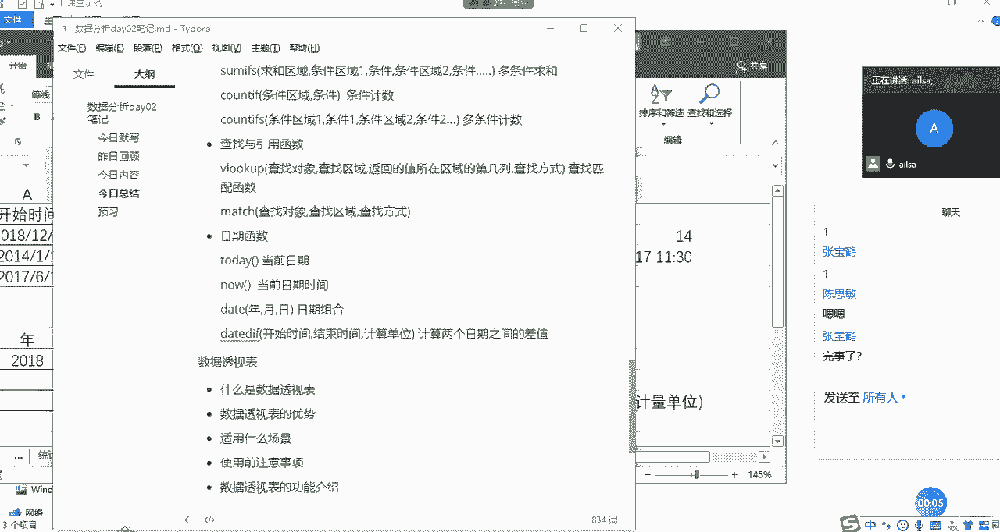
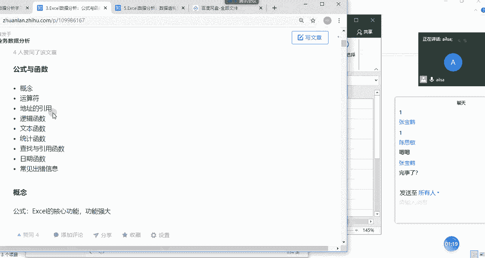
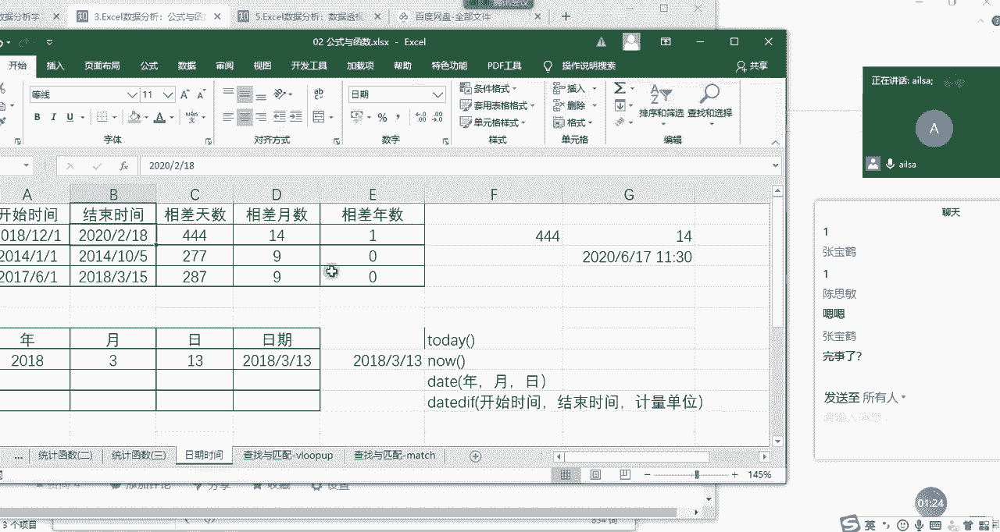
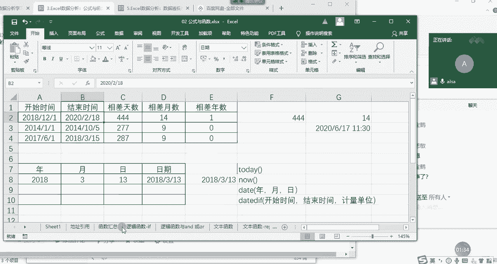
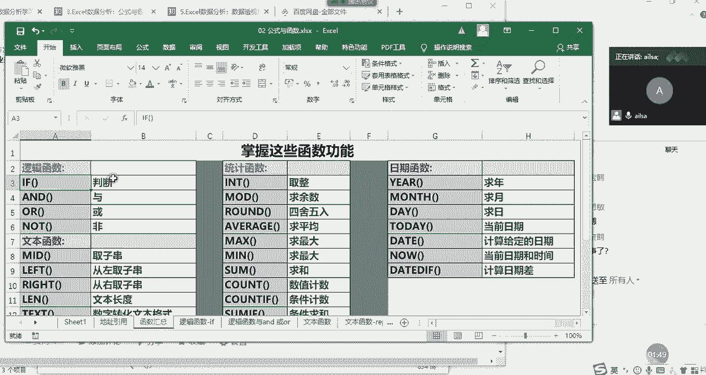
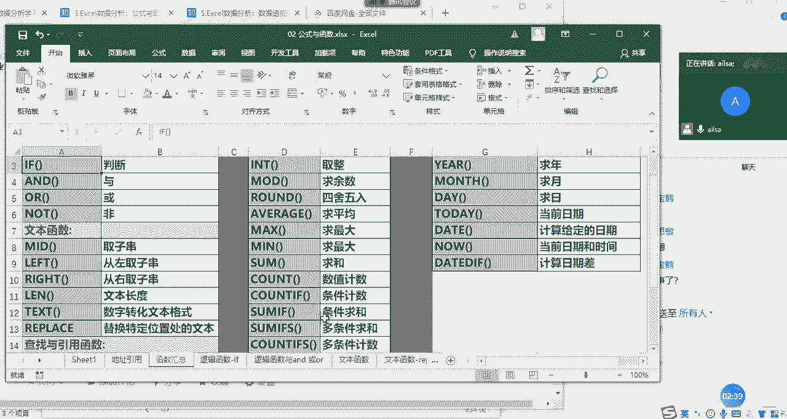
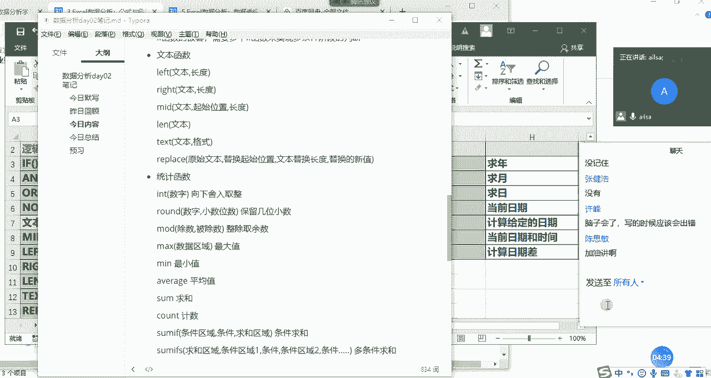

# 强推！这可能是B站最全的【Python金融量化+业务数据分析】系列课程了，保姆级教程，手把手教你学 - P45：09 函数总结 - python数字游侠 - BV1FFDDYCE2g

好我们先做一个简单的总结哈，因为我害怕到后面又没有时间了。

OK我们看一下啊，我们今天讲的内容是公式与函数对吧，我们讲了它的概念，什么是公式呢，它其实就是嗯以就是以等号开头，然后建立数据之间的一个某种联系的一种算法，然后它需要用到运算符，所以说我们讲了运算符。

那我们在进行一个公式的使用的时候，我们用到了地址啊，对于地址而言的话，我们讲到了相对引用，绝对引用和混合引用，大家跟着我的思路去想哈，什么是相对引用，那就是那就是你走他也走，如影随形对吧。

那绝对引用就是以不变应万变啊，就说别人该怎么变怎么变，我就是不变啊，那混合引用就是识时务者为俊杰啊，根据时势的变化来进行自适应啊，自己会相应的发生变化，那来决定这个引用的啊。

一个的符号呢就是我们的dollar符，在哪个地方上加了DOLF，它就不可以变了啊，这是我们的地址的引用，然后我们再看逻辑啊，接下来就是我们的函数了。

逻辑函数，那我们看我们的函数都讲了哪些哈。

把我们的表打开一下，我们的函数啊，我们函数看一下汇总。

我们函数讲了逻辑函数，逻辑函数讲了if函数以及if if函数，以and和or函数的进行一个判断啊，没有讲到的函数非这个用到的不多啊，我们还讲到了一个if if函数的嵌套。

这是我们的逻辑函数，文本函数我们讲了啊，left right和mid，还有LN函数和text函数啊。

以及我们的replace函数，这是我们的文本函数，查找与引用函数呢。

我们讲了被look up啊，讲了match函数，讲了啊，roll和呃column column啊，还没有讲，我等会儿给大家讲一下啊。

那我们的统计函数讲的比较多哈，我们讲了取整int函数，取余mod函数，我们的四舍五入run的函数啊，average求平均，Max mean some count，Count，if啊啊sum是求和。

count是计数，Sum if account，if呢是条件计数，SUMF是条件求和。

加了一个S以后，就是多条件求和和多条件计数嗯。

那我们的日期函数啊，Year month day，这个大家就自己回去啊，试一下，这个就比较简单，Today，然后now啊，date函数以及我们的data data函数啊。

这是我们今天讲的所有的函数啊，我们在这里都有一一的总结，那对于函数的学习的话，就是啊它有很多很多个函数excel当中，所以我们没必要一个个都学，我们只要把常用的学完了就行，然后如果以后遇到了啊。

就是更难更有难度的，或者是说自己没见过的啊，上网找一下资料，然后我们快速的知道这个函数的组成部分，以及应用场景，其实就可以实现了嗯，大家对于我们以上讲的内容有什么问题没有啊，有问题。

然后我们就先解答了大家的问题，嗯呐，没有是吗，其他人呢，没关系没关系，没记住是没有，嗯就是啊没问题就可以听懂就可以了，嗯好的哈，那我们今天的时间啊安排稍微有点尴尬哈，啊这样吧，大家休息5分钟。

我们接着再讲一下数据透视，看能讲多少是多少，讲不完，下午再讲好吧，可以不，啊因为我我没事多练几次就行了，熟练就行了，哈哈我嗓子稍微有点受不了了，啊啊我们再休息5分钟啊，我上个厕所啥的，大家上个厕所。

好吧嗯好。