# 强推！这可能是B站最全的【Python金融量化+业务数据分析】系列课程了，保姆级教程，手把手教你学 - P47：11 数据透视表注意事项 - python数字游侠 - BV1FFDDYCE2g

嗯好的，同学们，我们从啊现在开始进入我们的课堂啊，迷糊的同学就不要再迷糊了哈，你看我就立马就状态就来了哈啊哦，那我们看一下我们今天上午都讲了哪些内容啊，我们看一下今天上午我们讲了公式与函数对吧。

我们介绍了什么是引用地址的引用，这个非常非常重要，就是相对引用，绝对引用以及混合引用的使用，因为它奠定了我们后面讲函数的一个基础，那我们都讲了哪些函数呢，我们讲了逻辑函数啊啊有if啊。

and all啊啊文本函数也就是left right啊，Mid alone text replace，我们还讲了统计函数啊，巴拉巴拉这么多啊，都是比较常见的啊，那重点记得就是我们some if啊。

some EFS以及count if和count if s，相对来说有一呃有一点点难而已，然后下面就是查找与引用函数，那这个非常重要哈，这个在我们的工作当中使用的频率非常高。

大家必须掌握we look up和match函数，那他俩相比谁的重要性比较大呢，那当然是we look up，他这个是我们的一个明星函数，所以这个是必须要掌握的，那we look up它有啊，1234。

它有四部分组成，第一个部分就是我们的查找对象，第二个部分就是我们的查找区域，第三个部分就是返回的值所在区域的第几列，第四个就是查找方式，那这边有一个注意事项，也就是说我们的查找对象。

必须是在我们查找区域的第一列，就比如说你查找姓名的，那你的区域当中姓名这一列必须是在第一列，它才能够进行一个正确的查找啊，不信大家可以回去试一试啊，你不把它作为第一列啊，试一下就明白了嗯。

下面就是match函数啊，这是也是一个啊查找函数，但它返回的不是你要查找的值，而是返回的就是你查找对象所在，查找区域的位置而已，嗯接下来就是日期函数。

日期函数我们主要使用的比较频繁的就是today now，还有我们的date以及dd啊，这几个的啊使用大家掌握一下就可以了。

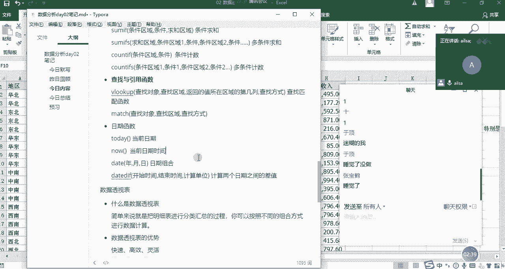

嗯那这就是我们今天上午讲的所有的内容，我们可以看一下，对于函数的学习，一定要说是嗯你掌握几个比较常用的，然后对于一些啊你从来没有见过的啊，那些函数的话，你只要去网上查一些资料就可以了。

因为它有很多你没必要全部都掌握哈，就像我们的呃呃汉汉语词典似的啊，就是你只有用到它的时候，你去查一下就可以了，但是呢你又要掌握一些最基本的，不然你不可能说用到一个查一个啊，是吧好，那我们啊函数啊。

公式与函数之分，这部分呢，我们花了一上午的时间给他给大家去讲，然后相信大家也都学明白了哈，那我们啊在上午的最末尾呢，我们讲了一下什么是数据透视表啊，数据透视表我们再来看一下嗯，数据透视表的话。

它其实啊我们通过我们在课上的时候。

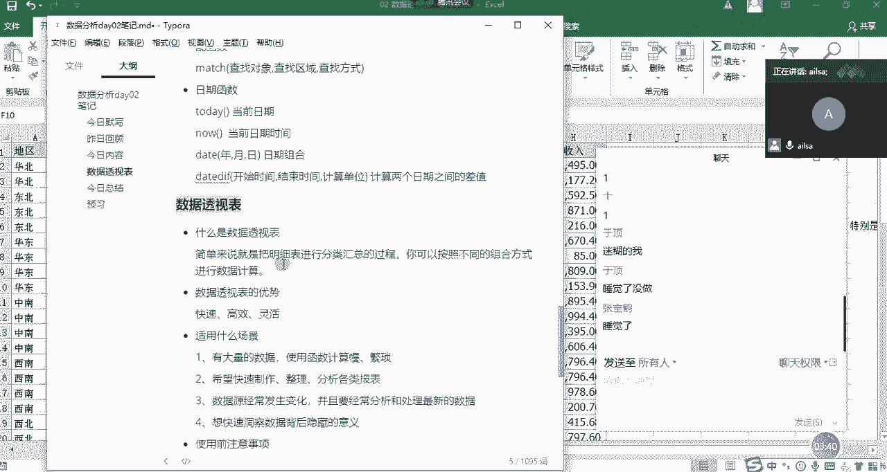

通过一个案例啊，就是说领导给你派了一个任务。

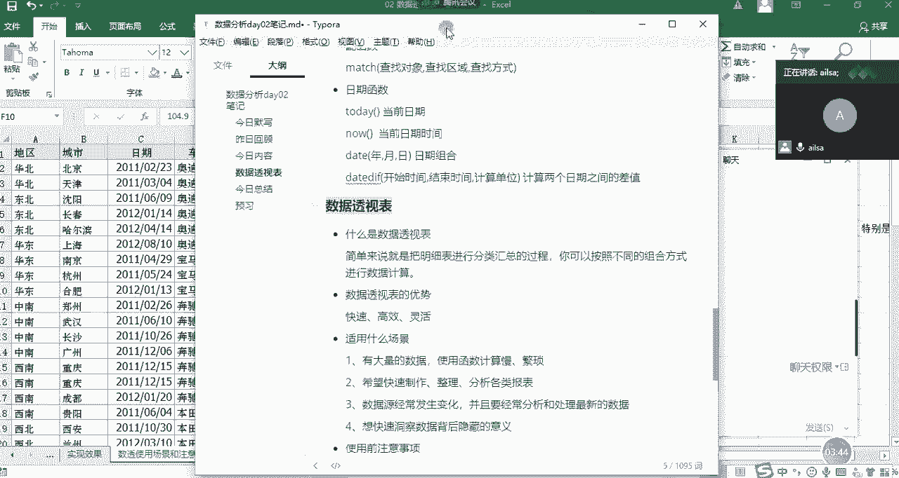

让你啊对某一个数据进行一个快速的分类，汇总的时候，我们尝试了筛选功能唉，就是一条一条去筛选这样的一个计算，还尝试了函数这种方法嗯，那我们会发现它虽然都可以实现，但是却没有那么智能，而最后我们采取的啊。

数据透视表这样的一个方法的话啊。

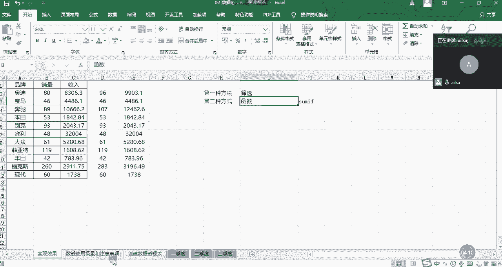

是最高效的啊，所以说我们的数据透视表它的作用就是啊，你可以按照不同的组合方式进行一个计算啊，这就是我们的数据透视表，那我们从啊上面的实例当中。

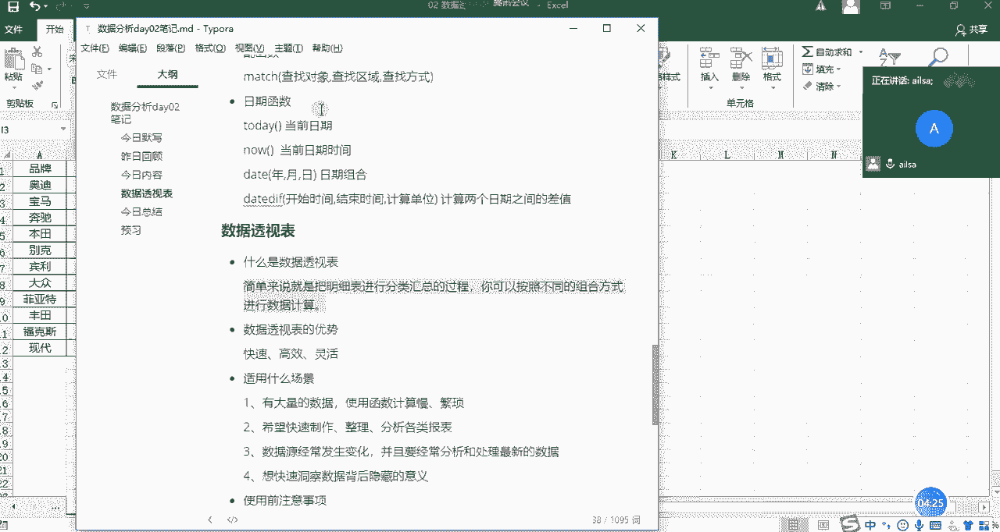

我们也可以看出我们的数据透视表的优势，它就是什么快速高效灵活对吧，那它适用于哪些场景呢，啊首先是数据量大啊，第二个就是你要快速的对它进行一个啊，分类汇总计算，这样还有就是你的数据源如果经常变化的话。

你也可以使用数据透视表，我们在下午的时候会讲哈，然后最后一个就是说诶，你想快速的进行一个分析，去发现数据背后存在的一些意义的时候，也可以使用数据透视表啊，就是我们在什么场景下使用，那啊说了这么多呢。

啊我们在最后的上午的尾声讲了一下，使用数据透视表的注意事项啊，可能啊很多人呃呃讲的不是特别清楚哈。

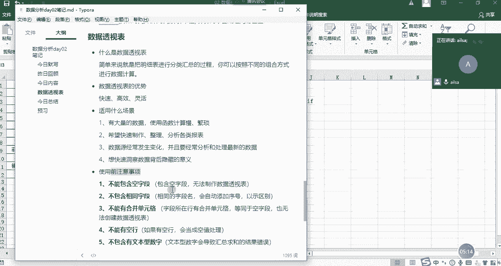

那接下来我们就一个一个来试一下，如果说我们啊我们这么做了之后，我们的数据透视表会出现什么样的问题。

OK我们来演示哈，比如说现在有这样的一个数据透视表啊，跟刚才的表是一样的，那我既然说了啊，这五个注意事项你不能犯，那我们看我们如果触犯了这五个注意事项，会有什么样的一个效果，你比如说唉现在这个车型哈。

你看这个车型啊，其实这个应该是叫啊，应该是叫类型啊，我们假设哈这个叫类型，然后这个叫车型啊，啊品牌这个叫品牌哈，什么这叫品牌哎，这个叫车型，那我对它进行数据透视表，我们再来回顾一下我们是怎么来操作的。

首先我们要把我们的啊鼠标，也就我们的数据区域定位到我们的啊，整个的一个要做数据透视表的当中，不要在这儿哈，不要定位到这里，定位到这里，然后点击插入选项卡，然后插入选项卡下面的第一个数据透视表诶。

它出现了一个数据，创建数据透视表的这样的一个对话框，那这里呢就是我们所选择的啊，我们要创建数据透视表的一个区域啊，它默认啊已经是我们所想要的，这样的一个区域了，那第二个呢。

就是说我们要把数据透视表放在哪个位置，上午的时候我已经演示了，放在现有工作表的位置，那今天呢我就给大家给大家演示一下，放到一个新的工作表的位置的一个体现，比如说现在我点击确定。

你看他是不是建了一个新的啊，对然后出现了我这么想要的一个效果，这还是一个数据透视表的一个字段，那我们看一下，我们如果说对品牌进行一个销量的计算的话，我们就可以把品牌拖到行或者是拖到列。

我们看一下有什么变化，我们拖到行诶，它会在行横方向上去显示啊，大家看一下是不重复的哈，所以说它是不重复的这些标签，然后我针对啊我这个品牌，然后进行一个销量的计算，这个时候我的计算啊的方式呢。

我们选择的是求和点击确定，OK它就出来了，那我对于收入而言也可以这样子，对不对，那这就是我们刚才回顾的，如何创建一个啊啊，数据透视表的一个最基本的操作，哎那现在呢我把这个全部都取消掉啊，怎么回事呢。

我把这个品牌啊也取消掉，我把品牌拖到列方向看一看诶，它是不是在列方向去显示了，然后我再把销量拖到我们的值，让我们看一下，它是不是相当于是在列方向上去显示，每一款车型的它的销量的总和呀。

但是我们会发现这种的一个展示形式，跟我们日常的一个行为习惯并不是特别一致，所以说我们一般情况下是拖刀行就可以了，这样的话啊，好像更适合我们去看唉整个的一个表的呈现，嗯啊那接下来我再给大家演示第一个啊。

第一类错误啊，就是列标题啊，不能为空假设哈，假设这个品牌或这个车型啊，这个车型为空啊，这个字段为空，我把它删掉了，这个时候我们再重新去做我们的数据透视表，我先删掉哈。

我们再重新去做，然后鼠标定位到我们的数据区域，点击插入，点击数据透视表，点击啊，直接点击确定，然后这个时候我们会发现一个什么样的问题呢，诶华北这是什么东西啊，哎你是不是看着有点别扭啊，哎华北北京哦。

这这这这啊这是不是没有标题了啊，是不是，你看我们可以看一下华为北京什么2013啊，2013奥迪它是不是因为它为空值，所以说他把啊2495。00249，他是不是把这一行作为我的标题了，那这呃就很尴尬了。

其实你就看不懂他到底想要的一个，什么样的效果了，所以说我们的标题不能为空，如果为空的话，它就啊往下又自动选了一行作为它的标题，这种话完全不是我们所想要的效果，所以说我们要把它改回来。

我们要把它改成车型啊，啊然后我们再重新的啊，重新的生成一下我们的数据透视表，点击插入数据透视表，然后新工作表确定，这个时候诶我的字段又回来了。

就这就是我们不能犯的第一类错误，列标题不能为空，Ok。

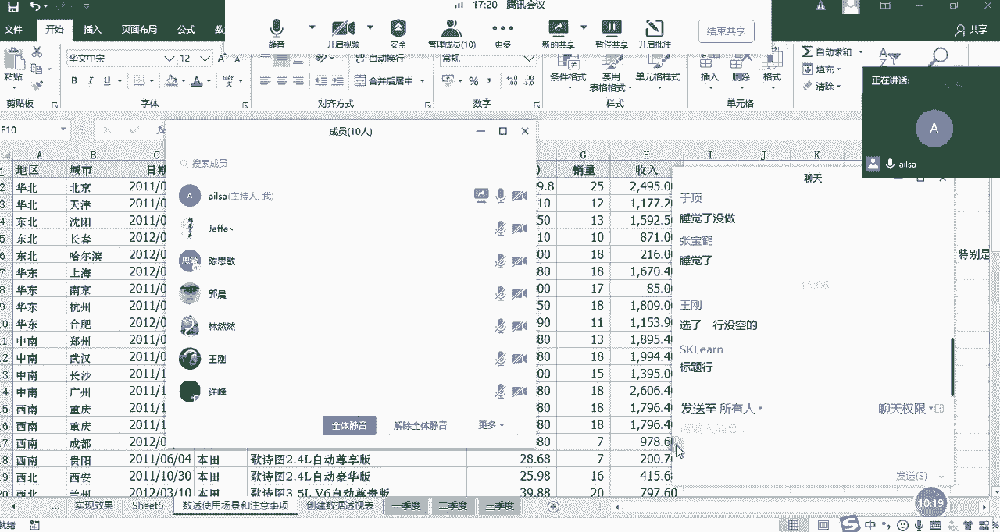

对啊对，然后大家对于我刚才讲的这个事例有什么问题。

没有没有问题，扣一就是我们的列标题不能为空啊，六个人回复了啊，其他人呢其他人还没睡醒吗，我们至少还有两到三人，OK啊，OK好嘞嗯好嘞，大家都没有问题，那我接着讲第二类错误叫列标题不能重复，那还是这里哈。

比如说我这里面把品牌啊，这里也叫品牌，这里也叫品牌，我们看一下它会发生什么奇特的效果，哎那我们还把它删掉哈，还把它删掉，然后重新再创建一个数据透视表，哎这就这就不给大家啊再重复的去演示了。

确定我们会发现啊，我们看字段哈，我们会发现它字段里面出现了一个品牌啊，品牌二，如果说大家对于这个表里面的结构哈，或者是列明特别特别多的时候，其实我们分不太清楚，品牌到底和品牌二之间有什么关系。

他们俩之间到底谁是品牌，对不对，那你这么来看的话，其实就会影响到你对数据做的一个判断啊，呃因为他俩都叫品牌，到底我用哪个品牌，是不是啊，如果是你自己做的表，唉你知道这个品牌就叫车型。

然后你大概也就清楚了，但是你把这个数据发给别人之后，别人再做二次处理的时候，他就很头疼了，你这个为什么两个都叫品牌，是他俩都是品牌，还是说呃一个不是品牌，一个是品牌这样的一个效果。

所以说我们尽量保证我们的标题不要重复，不要带来歧义哦，是这个意思啊，所以说我们这边还要改回车型，然后我们再看一下，我们改完了之后它的一个字段的啊效果。

我们点击啊确定。

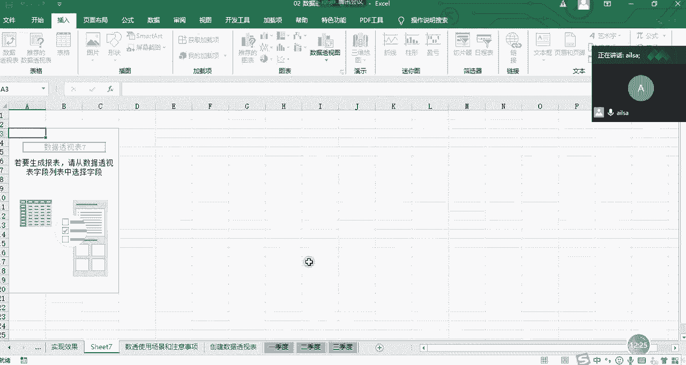

然后我们看一下品牌车型，其实是因为我们要对整个的一个列标题，进行一个分组啊，这样的一些操作，所以说我们尽量保证我们的标题，要唯一要完整啊，是这个意思好。

那大家对于这个问题听明白了没有听明白，给我扣个一。

好啊好的，没有问题哈，没有问题啊，因为上午的时候哦，在最后的时候，不是有同学说，想把这个呃情况再给大家演示一下啊，这边应该都听明白了，然后我们再看啊，第三个不能有空行，然后不能有合并单元格。

保持数据类型一致，这个不能有空行，我就不我就不演示了哈，什么意思呢，就是说我们呃，为了防止数据透视表出现一些，这样或那样的问题，我们尽量啊不要有，比如说啊那我演示一下吧，还是比如说唉这个宝马啊。

它空了一个单元格，我们不知道这个品牌是什么，这个时候我再对它进行一个数据透视表的，创建的时候，大家看一下会出现什么样的问题，这个时候我把品牌哎，你看我们的字段没有什么问题了啊，因为现在不是字段的问题。

而是内容的问题，我把品牌拖到行，然后把我们的销量拖到我们的计算求和项，这个时候我们会发现有一个空白，17对不对，那对于这个嗯品牌是空白的这一个东西，我该怎么去判断呢，我就不知道了，是不是。

那这个时候我还要回过头来，把这个时期这个我查出来品牌为空值的，我还要去判断它到底是哪款车型，然后给它填写完整哎，那就这个意思，所以说它不能有空的啊，这是我们的类别当中不能有空的。

如果是我们的数值当中的话啊，尽量也不要有空的啊，呃应该啊影响不是特别大，但是为了保证我们万一它有影响呢，所以说我们尽量保证我们的数据啊是没有空的，然后如果数值就填为零，如果是这种文本型的。

我们尽量保证它呃是准确的啊，完整的这样子啊，这是我们的空行，我再给大家演示一下合并单元格，合并单元格是什么意思呢，啊我们还拿啊，我们还拿这个品牌为例哈，你看这里不是这么多奥迪吗，我把它合并一下。

我们看一下会出现什么样的问题，这边是合并单元格，对不对，奥迪然后我们给他做数据透视表，插入，然后数据透视表点击确定，OK我们把品牌拖到行，把销量拖到啊，我们的计算项当中，我们会发现我们的啊。

我们的奥迪啊，他的我看其他地方还有没有奥迪啊，没有了，我们的奥迪，大概的一个销量的计算的话是113对吧，113，然后他这边显示的奥迪是25，你们想一下为什么啊，为什么它的空白是88。

而它这里面的奥迪确实25呢，现在给大家抛出这个问题。

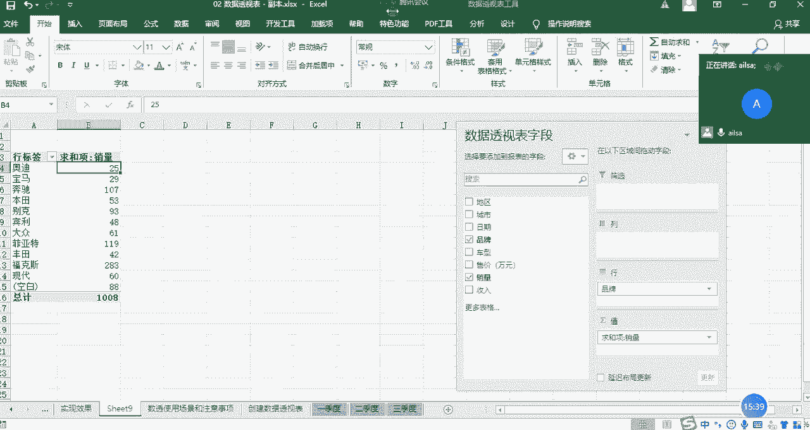

我们想一想。

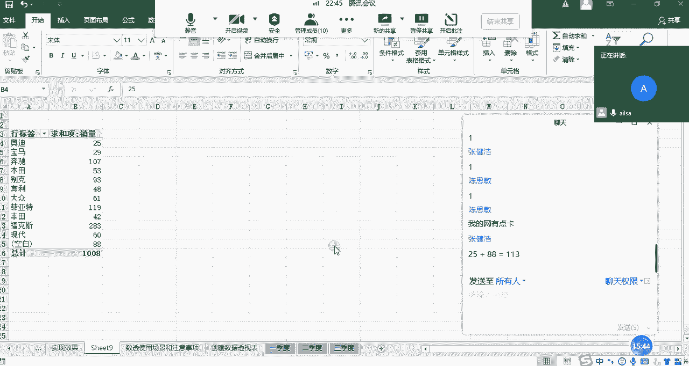

对25+88=113啊，你的数学功底还可以哈，看来后面讲统计学的时候，我得出点口算题了，嗯对啊，非常好，于鼎说出了我们整个的一个问题的核心是什么，意思呢，就是说我合并了单元格之后。

我们把鼠标定位到这个单元格，我们发现一个问题，在这个名称框里面，它显示的是第二，第二其实就是这个第一，就是这个合并单元格的一个最左上角这个位置，那它默认的意思就是说，它只会代表左上角这一行的数据。

所以说是25，那接下来这部分数据的话，它都会默默认为空，所以你在进行数据透视的时候，它会显示空白，那其实对于你来说，你在进行处理的时候就特别不方便，如果有很多杂七杂八的一些合并单元格的话。

你处理起来是非常非常费劲的，所以你要给它取消掉啊，啊大家知道我们在嗯就是合并单元格批量取消，有什么快捷方式吗，啊我给大家演示一下哈，因为这里只有一个啊，所以说呃我可以简单演示一下啊，首先我们先取消掉。

然后啊我好像忘了哈，CTRL加G啊，定位到什么呢，空值啊，然后直接等于上一个单元格CTRL加enter啊，就实现了，我再给大家演示一下哈，如果说你的呃某一列当中有很多个嗯，有很多个空白单元格。

有很多个合并单元格，你想给它批量的去除的时候啊，你没有必要一个个去粘贴哈，我们再撤销回来，你很多人的操作是这样的，比如说这个宝马啊，好吧，我拿三个进行一个演示哈，比如说现在有这么多合并单元格。

你想对它进行一个批量处理的时候，很多人就是先取消掉，然后再复制粘贴对吧，取消掉啊，CTRL加D对，CTRL加D啊，往下来走，这样啊，这样也可以挺快的啊，但是如果是批量的话，就比较费劲了。

那我们这边有一个方法，就是先选中它，然后取消啊，合并后居中这样的，然后我们点击定位，定位条件，选择空值，然后确定，然后等于上一个啊，等于上一个单元格，然后点击Ctrl enter就可以实现了啊。

这是一个这是一个插入的哈，啊大家这个快捷方式听明白了吗，听明白给我扣个一，我就是刚才想起来啊，给大家演示一下哈，OK哈啊，这就是我们批量啊啊批量去合取消合并，我们的单元格的操作方式啊。

呃那大家刚才也明白了，哎就是如果有合并单元格的话，其实对于我们的数据分析或者数据处理，还是很不好的，那我给大家说一下，在我们整个的一个工作当中，我们在进行数据啊展示的时候，你可以有合并单元格。

这样看起来更加美观，但是我们在进行数据处理的过程中，比如说那些详细的数据哈，一般情况下都很少有合并单元格，明白了吗，只有在数据展示，你比如说你给别人展示某个事业部，下面有多少个部门，这个时候事业部啊。

这个肯定是合并单元格，然后对应的一个部门，它的每一个汇总好的数据啊，这种是允许用合并单元格的，但是对于明细数据而言，我们很少啊，很少有合并单元格，因为这样的话，不利于我们后期的进行的数据处理。

OK那我们再说最后一个问题就是第五个啊，保持数据类型一致啊，你比如说现在还是奥迪哈，奥迪这里的销量啊，我给它设置成文本格式，我们可以看一下现在它是文本格式哈，文本格式。

然后嗯那我们再进行一个啊数据的重新的啊，生成，我们生成一下我们的数据透视表确定，OK然后我们再把品牌拖到我们的行，然后把收把销量拖到我们的值里面啊，这里面是计数了，大家看到没有，它为什么变成了计数呢。

其实就是因为里面有个文本，它识别不了，他以为你要记住，这个时候我们给它强行改成求和确定，唉我们会发现奥迪的书销量不是变小了吗，25没有了，那说明这个文本我们看这里是不是文本，这个文本其实是不参与计算的。

那其实对于你来说，你是想让他参与计算的，但是他我无形之中设置了文本格式，那就不参与计算，所以说我们的数据得出来就是不对的，而且这种的话如果你做数据透视表，你不是特别熟的话，你也发现发现不了什么问题。

因为也不是你一个个数的对吧，也不是你一个个加和的。

是系统自动生成的啊，所以说我们要把它改成啊，我们要把它改成数字啊，怎么去改呢啊比如说对于这一个单元格而言，我们可以直接转为数字就可以了啊，如果说是多个哈，给大家给大家演示一下哈，这也是一个小技巧哈。

比如说这个也是啊，我一般情况下只有前面有绿绿尖角的这种，我才会认为是一个文本哈啊OK这有三个文本，难道啊我们我们可以选中这三个，直接啊转为数字，这样也可以哈，还有一种方式就是我们选择这一列。

然后进行什么呢，分裂啊，分裂是一个很好的操作方式。

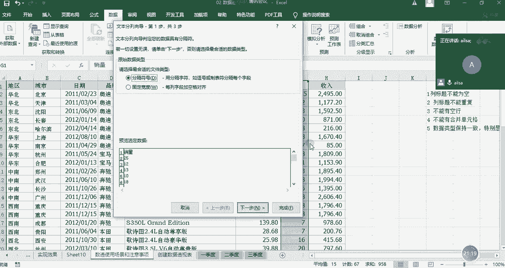

我看能不能实现哈啊完成啊，这个时候你看就已经实现了，跟大家说有一些格式的转换，特别是文本日期和数字之间啊，进行一个转换的时候，我们都可以采用分列进行一个啊，单列的批量转换啊的实现方式，好吧啊。

那啊同志们啊，那对于整个的一个我刚才讲的内容，大家有什么方法啊。

大家有什么呃问题没有，如果没有什么问题扣一哈，对分裂方法很好啊，啊好的啊，好的都没有什么问题，那我们接下来就讲解我们数据透视表的一些，常用功能了啊，这些只是最基本的啊，网不好是吗，是我说话断断续续啊。

还是你那边嗯怎么回事，嗯嗯OK那我稍微讲慢一些哈，讲慢一些。