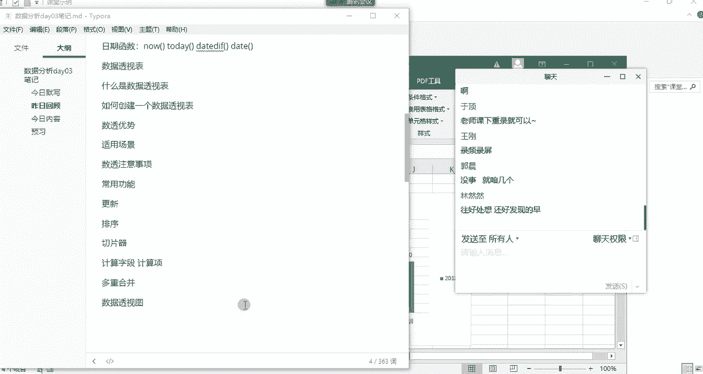
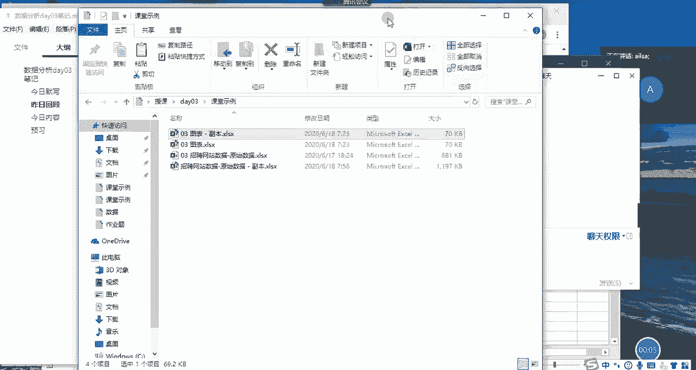
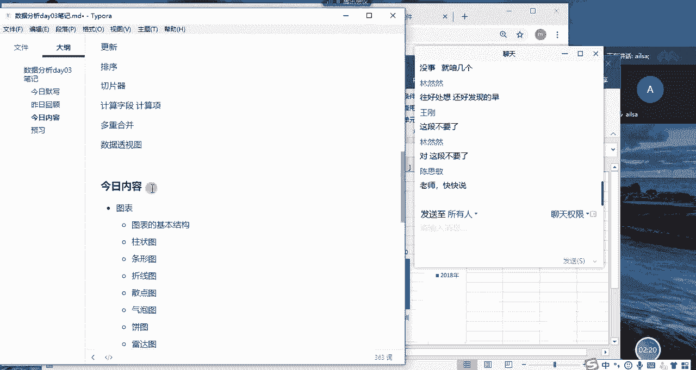
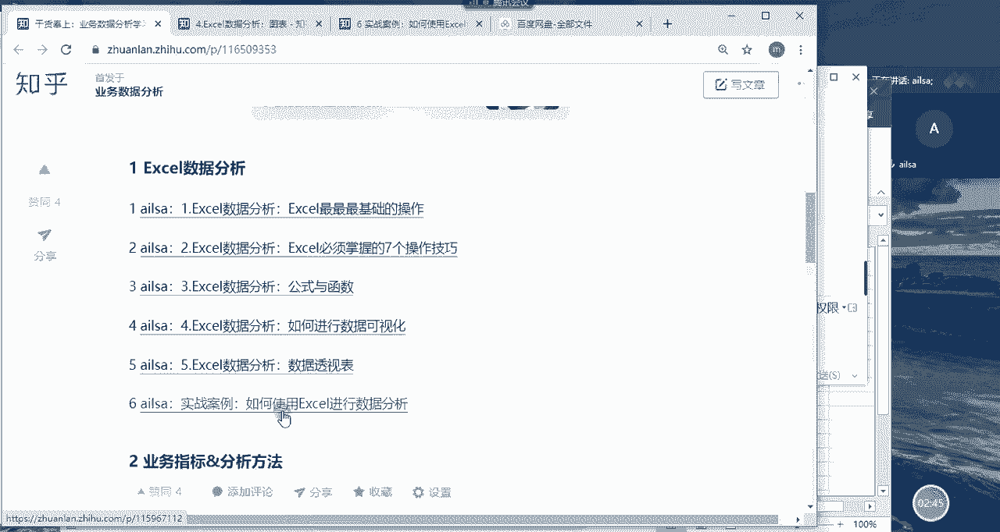
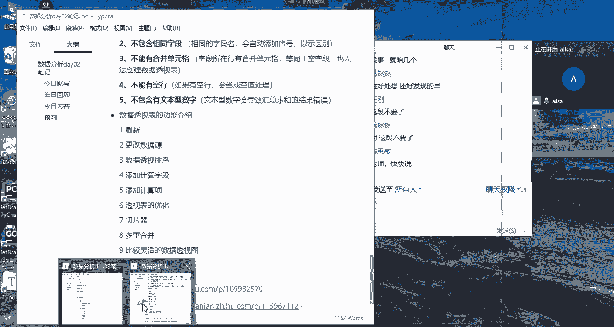

# 强推！这可能是B站最全的【Python金融量化+业务数据分析】系列课程了，保姆级教程，手把手教你学 - P50：01 昨日回顾&今日内容 - python数字游侠 - BV1FFDDYCE2g

我们嗯哎我我先看一下啊。

他在这里啊。

主要是因为我们是第一期上课，所以说啊我尽量把我所讲的内容都录下来啊，都录下来，然后以方便后面的学生去学习哈，OK哈没有关系哈，我们进入到今呃，进入到我们的昨日回顾哈，我们看一下昨天我们都讲了哪些内容哈。

我们主要讲的是两大块啊，一个是公式和函数，一个是我们的数据透视表啊，那对于公式与函数而言呢，我们主要讲的就是啊，地址的一个引用是一个很重要的点，那还有就是我们按照不同的类型分为逻辑函数。

文本函数统计函数查找与引用函数，日期函数对吧，那我们每一个类型的函数，也都介绍了相关的常用的操作哈，相信大家昨天也都已经嗯，有了一个很全面的认识以及练习啊，那这第二块内容就是我们的数据透视表。

那数据透视表，它是一个快速的对数据进行一个分类，然后汇总计算的啊一种操作方式，它在我们的excel当中属于比较灵活的啊，高效的一个使用方法，也是我们在工作当中非常常见嗯，和常用的一种啊使用方式啊。

所以说啊我们要学他，这样的话，我们的工作效率就会提高很多，那他有他有他自己的优势，也有它而使用之前的一个注意事项，我们在昨天都已经说过了，还有它常用的一些功能啊，包括我们的更新操作啊，排序操作。

切片器的一个操作，以及如何贴计算字段，计算项，还有多重合并和数据透视图这样的一个操作啊，啊所以说这这就是我们昨天讲的内容哈，我们可以看出来昨天讲的内容，其实啊其实比前天量要大一些。

但是也没有相对来说也没有那么多哈，啊所以说呃我们还是稳稳稳的啊往前进行哈，那这是我们昨天讲的内容，我们看一下今天我们讲什么内容哈，我们今天讲的内容就是图表了啊，那我跟大家说一下。

我们之前再看我们整个的一个啊，数据分析的一个呃课表的时候，我们就会发现我们讲excel数据分析的话，就讲操作公式与函数以及数据透视表，还有最后一个就是图表，我们讲完了之后。

我们excel相关的内容就已经讲完了，那接下来就是这一个案例的话，就是我们对它进行一个实际的练习。

那我们今天就进入到的是啊，excel的最嗯嗯excel的最后一项内容啊。

也就是我们的图表操作，那我们图表的话主要讲的是，首先我们会介绍一下图表的基本结构，然后我们会介绍不同类型的图表有哪些呢，有柱状图，条形图啊，折线图，散点图，气泡图，饼图，雷达图，面积图和组合图。

这些图介绍完了之后啊，大家对于图表的创新的话，应该都都已经很熟悉了，那么我们讲完图表之后，我们会讲一个案例，这个案例呢就是针对我们从boss上，然后采集下来的，关于啊我们数据分析师招聘岗位的一些信息。

我们针对这个数据，然后结合我们之前所学的所有的内容，然后进行一个excel的数据清洗，然后以及简单的数据分析，这就是我们今天讲的主要内容哈。

