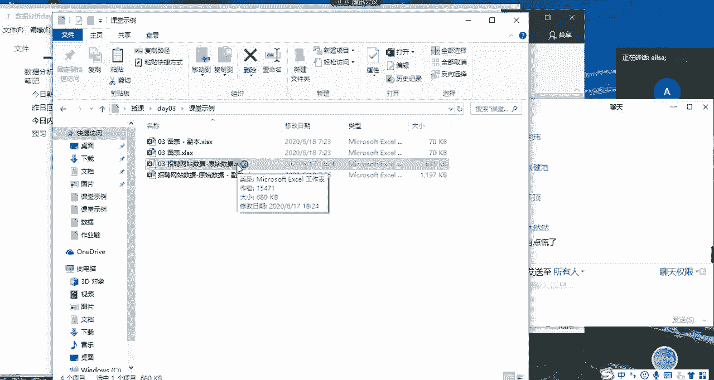
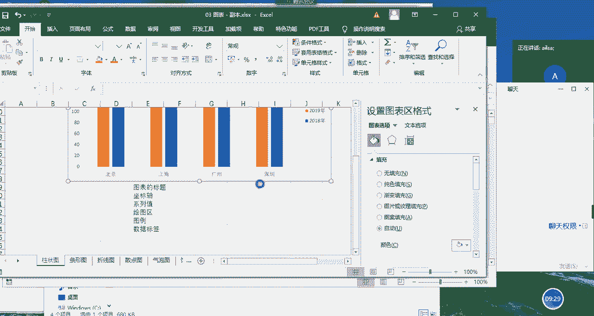
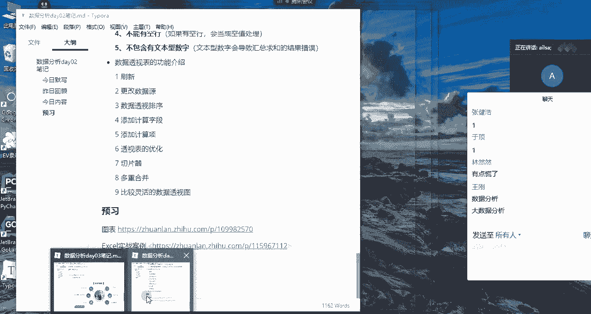
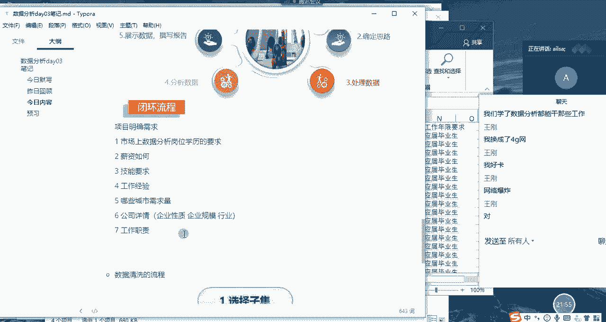

# 强推！这可能是B站最全的【Python金融量化+业务数据分析】系列课程了，保姆级教程，手把手教你学 - P53：04 数据分析流程 - python数字游侠 - BV1FFDDYCE2g

这个就呃这个就啊进正式进入到啊，我们的一个额数据分析的，接下来的一个课程内容当中了哈，那在实际的工作当中嗯，我们接上接到了一项需求任务了之后，哎我们该怎么去做分析啊，大家想一下呃，我跟大家大家说哎。

比如说嗯比如说我给了你一套数据，我说你给我做一个分析吧，其实你在想的时候，哎呀妈呀，那我该做做什么对吧，是不是有点头大，你又没有告诉我你想要什么，那我怎么去做呢，那所以说从这个角度来说的话。

我们第一个啊，第一个任务就是要明确我们的需求，一般情况下我们做分析都不是我们自发的啊，都是领导安排的嗯，那领导根据业务当中存在的一些问题说诶，要不你去分析一下吧，啊，那这个时候我们在跟领导进行一个。

沟通的时候啊，他有时候表达需求并不是特别明确啊，啊你比如说哈，你比如说呃，他说我们举一个最简单的例子吧，就说公司最近网站运营情况不是特别好，唉你给我分析一下吧，啊这个时候其实就感很尴尬哈。

因为这个网站运营涉涉及到的内容太多了，你要分析的话，你每个维度都要进行分析的话，其实你完全啊嗯你也一个月两个月都做不出来，而且你分析的问题也会比较泛，因为你没有聚焦，所以说你需要跟领导再次确认。

你想看你想看哪个哪个方面的维度的一个分析，公司目前运营方面到底存在了哪些问题，然后你要针对这些问题啊，然后展开一步一步一步的分析，记住我们数据数据分析不是简单的数据呈现啊，真的不是简单的数据呈现。

很多人很多人在做数据分析的时候都是啊，就是唉目前公司赚多少钱，唉目前公司有多少个课程，目前公司啊有多少人类似于这样的一个形式，那这种形式的话，如果说你把你的整个这个汇报的结果，给到领导之后。

领导会觉得说啊，这是个人都能做，我要你干什么，所以我们数据分析师最重要的一个目的啊，你要明白他肯定是要针对某一项问题去发现啊，就把这个问题挖掘出来，发现了，然后并且提出自己的一个建议方案。

然后这个方案能够落地是最好的啊，如果落地了并且达到一个很好的效果，那你这个价分析价值就是有意义的，那我们在做所有的这个达到这个目的之前，我们第一个就是要明确需求，我们要提出啊。

就是领导想要解决的这些关键的核心的问题，OK那第二个如果说你明确了需求之后啊，那第二个就是确定思路了，你该怎么怎么去分析，对不对啊，那你比如说采用什么样的分析方法啊，使用啊，到底是使用excel来实现。

思路啊，这样第二个就是就是你自己干的事了，针对这些问题，然后你确定你的分析思路，那第三个呢就是你的思路确定了之后，你就要去找数了哈，找数，然后看到底是需要数据库的数据，还是说别人别的部门需要提供的数据。

还是怎么怎么着啊，就把数据找出来之后，然后进行一个清洗，我们大部分时间都花在这了哈，大部分时间都是在做清洗数据哈，然后数据清洗完了之后，哎我们就可以做分析了，哎从通过我们提出的这些问题。

然后一步一步的进行一个分析，然后我们找出来一些问题啊，或者是分析出来一些原因，然后把这些原因或者是整个的一个分析的过程，进行一个结果的呈现，然后输出我们的那个报告，但这个报告的撰写的话。

我们主要看我们整个嗯，整个你接到这个分析项目的一个重要程度，如果是一个简单的分析，那你可以不写报告，如果是一个比较规范的啊，或者大型的我们可能要写报告，那最后的话就是你把这个报告要汇报给你的呃。

就相关负责人谁让你做这个的啊，你要汇报给他们，然后汇报给他们之后，他们会进行一个相对应的方案的落地，你要进行一个跟进，到底效果怎么样啊，有没有说给公司带来好的一个影响啊，如果没有啊，如果没有哈。

公司目前某些某个业务问题还一直存在，那不好意思，你可能还要再重新来一遍啊，对还要再重新来一遍，这样子，只有这就是一个数据分析的一个基本的流程哈，那我结合啊，我结合我们今天要讲的啊。

嗯没有没有没有那么夸张哈，其实我跟大家说一个特别特别普遍的一个现象，就是你不要以为说你在呃公司做数据分析师，你一下子就能给公司带来几千万，或者是多少万的一个收益哈，唉你做出来的分析效果啊。

所有的你做出来的效果都特别明显，都一眼就看穿了啊，公司内部存在的核心问题啊，没有啊，真的真的不会有，可能你干个一两年啊，你才有可能去发现一些问题啊，而且很每家公司都有自己的，就是那个不可解决的问题。

而且还牵涉到一些某些人的利益啊，所以说嗯你做数据分析师的话，其实就是一个得罪人的活，为啥呢啊，你说啊，比如说你分析出来，市场部存在很大的一个啊什么什么问题，你就把市场部市场部给人给得罪了哈。

假设领导觉得说你说的对，你就把市场部的人给得罪了，然后你又说唉，你又通过一些数据分析，发现财务部那边也存在很大的问题，那不好意思，你把财务部的人也得罪了啊，因为这些问题啊，不是说大家不知道。

只是说看你愿不愿意去解决啊，有一些问题是这样的啊，当然也有一些也这是一个就是不太好的一面，如果从好的一面去讲的话，就是说确实是很多人都，比如说运营过程当中，很多人都想唉。

为什么我这个活动的效果特别不明显的，我该怎么办呢，这个时候你通过你数据的形式，给它做一个很好的呈现，或者说你发现了A，是不是你在这个月活活动过程当中，某一个小的细节没有做好，唉造成的。

你给他提出了这样的一个建议方案之后，他改进了，那它的活动效果突然就变好了，给公司带来了很大的一个收益，节约了不少成本的时候，这个时候你就是有也有有价值有意义的了啊，明白了吗，啊啊对数据分析。

他对于啊我我只说业务数据分析哈，你要说机器学习，数据挖掘那方面的话，它对于业务要求不是特别高的时候倒还好，但是他只要牵扯到业务，就会牵扯到很多部门了啊，所以对于个人的一个沟通表达能力啊。

还有你的整个的一个情商啊，还有你的一个协协调能力啊等等，这方面都要做好充分的准备啊，不然很容易就得罪人了，啊啊啊，还有很多数据分析师在工作当中嗯，就很没有地位，为什么呢。

是因为他们没有给公司带来很大的一个价值，所以公司就认为说好像有你，没你都一样的那种感觉的时候，这个时候就很尴尬啊，好吧嗯，那我再呃我就呃大家分析流程听明白了没有，就是我们啊很多人很多人在接到一项任务。

需求啊，数据分析的需求的时候，很多人啥都不想，直接就来第三步了哈，直接就找数去了，然后做了一堆分析啊，然后也没有发现特别大的一个问题的时候啊，其实你都做的是无用功，有可能你的根本就没有聚焦到某一个点啊。

我们做数据分析一定是专而精，而不是广而泛啊，专而精哈，针对某个问题开展的，你不可能把公司所有的业务都做一遍啊，这不可能啊，一定是专而精的，嗯专而精而不是广而犯哈，广而泛的东西做出来没有意义。

因为你分析不透，数据分析一定要分析透了啊，某个点就像针扎了一样啊，扎到你出血，那你这个分析就有价值了，就什么叫痛点啊，就这个意思嗯，大家对于分析流程了解明白了吗，啊明白了扣一。

OK哈那我们啊那我们想一下哈，我们打开我们今天要讲的实例，我们今天要讲的是，其实今天要讲的东西的话，真的是就相当于我们是业务方了，为什么呢，你看我们现在想从事数据分析这个岗位的工作。

对不对。

那我们对于这个岗位呢其实并不是特别的了解，那我们就想知道唉。

这个岗位目前啊有什么样的一个啊要求啊，或者是哪些公司招这个岗位啊等等，这些我们需要知道这些东西的时候，相当于我们是业务方，对不对，那比如说呃你你找到数据分析师，你说我最近在找数据分析相关的工作。

你给我分析一下，我应该从哪个嗯，从嗯去哪个城市去找，应该做什么准备，唉类似于这样的啊，我们如果作为业务方，我们想一下，我们想啊想分析得到什么样的一个结果。

假设你是业务方唉，你想提需求啊，比如说啊我我我作为你们的数据分析师，你想给我提需求，你说你给我分析一下，目前市场上数据分析岗位的一个情况嗯，你们能提哪些需求呢，就是你想得到哪些信息呢。

啊大家这个时候可以畅所欲言了，啊这是我们的一个提出问题的一个环节哈，好第一个就是明确需求，对我们就可以直接从自身出发哈，啊你看有的人就想知道啊，第一个就想知道，就是说目前市场上啊。

数据分析岗位对于学历的要求对吧，学历学历的要求对吧，然后还有就是薪资怎么样对吧，就业环境，就业环境，你这个就说的有点大了哈，你这个就业环境就类似于嗯，就是没有表达表达清楚啊，什么叫就业环境啊。

要求的技能啊，这个是没有问题的，啊就是啊工作经验呗对吧，要技能要求，哦第四是工作经验，还有吗还有吗，还有没有人想知道什么，没有人想知道啊，对工作地点就是哪些城市啊，需求量需求量比较大对吧啊。

城市城市的位置啊，这个就有点细了吧啊，就是说我觉得应该是哪些城市啊，需求量，比如说我比如说假设哈，我现在在成都，哎，我就想知道成都目前的一个数据分析师，的一个需求量如何跟全国一个对比的话。

它这个量到底是量大还是量小，男女比例啊，男女比例这个可啊，男女比例数据分析师哈，业务数据分析师大部分都是女生哈，因为女生首先在软实力方面是占很大优势的啊，她的整个的一个沟通表达，她的一个情商。

还有他的整个的一个数据分析过程当中的，一个谨慎的思维，还有细心啊，这些他都是占优势的，男生的话更偏向于说呃就是大数据分析，或者说数据挖掘方向，因为它的理工科思维很强，就是它整个的一个逻辑能力。

还有他的一个代码能力啊，这个呃是有是有倾向性，但不是绝对的，如果你真的想找啊，想找个对象，那你可以去做业务数据分析哈，女生还是挺多的啊，在我原来的部门的话，是男女比例是一比一左右的一个啊状态。

因为我们部门还承接了其他的一个研发的内容，所以他们会有一部分男生啊，女生偏少啊，我们部门是女生偏少，男生会稍微多那么一两个，OK男女比例单身情况哈啊公司详情，OK公司详情啊，公司详情。

其实你主要了解的就是它的一个啊，企业的性质哈啊企业的性质，比如说是民营啊，到底是民营的企业多呀，还是国企多呀，还是说啊那个上市的公司多啊，这样的一个企业的性质，还有就是企业的规模啊。

到底哪些规模的公司需要数据分析，还有就是嗯嗯还有就是什么啊，你想想啊，还有就是他的行业，公司所处的行业，到底哪些行业需要的，数据分析师的一个量比较大对吧，唉那还有什么呢，我们看一下，但是单身情况。

这个这哎呀你这个的目的就有点不太纯了，你知道吗，你这个就不是去找工作了，你这是找对象去了啊，工资发展啊与房价涨幅哈啊工资啊，工资情况哈，也就是目前这个岗位他的啊薪资啊，平均水平在哪个啊，哪个水平上对吧。

那房价涨幅的话，这个其实是跟城市有关系的啊，你就不应该是放在这里了，因为我们主要说的是啊，工资那个数据分析师岗位的啊，你房价涨幅其实是跟工作没有太大关系啊，而是说这个城市嗯对，工资发展前景哈。

这个前景啊你可能得用到预测了啊，我们现在只能是通过过往的数据，然后去得出目前处于什么样的一个水平啊，还有吗，同志们，大家就是散发性思维哈，你就你你当你作为一个业务方。

然后你去跟一个数据分析师提要求的时候啊，你就会发现你自己的想要的东西特别特别多，然后我作为数据分析师呢，我就得给你，我就得给你，是有舍有也就是有舍有取，我不可能全部都接受，因为有些东西压根就没数。

我就没办法给你做分析，然后当你们换位思考，换位思考，就是说你作为数据分析师，我再给你提了一堆需求之后，你肯定也是说唉我能满满足你80%，但那剩下的20%我是满足不了的。

如果说你每一次都满足了别人所有的需求，那你接下来所有的工作就会比较累了啊，因为他会认为说哎你这个人好像比较好说话，我给你提的所有的需求你都能帮我做，那是不是以后我就可以给你提那种天花乱坠的。

各种各种需求，对还是有啊，有取舍哈，有取舍真的是你自己当别人给你，其实当别人给你提出，他要对接某项业务的一个数据分析需求的时候，你的脑海里就要想一想，你目前手里都有哪些数据啊，这个时候你要对数据特别熟。

你有哪些数据，你能实现哪些东西啊，你心里有个底，不然你答应了之后，你没做出来，人家就觉得你这个人能力有问题，明白吧，OK那基本上哈，我们对于整个的一个目前的一个项目啊，项目需求哈。

项目需求啊我们已经明确了，大概也就以下八种八种哈，第一个就是说目前市场上，数据分析岗位的一个学历要求啊，到底是什么个样子的，那肯定是占比情况对吧啊，到底本科多少啊。

本科多还是大专多还是硕士多这样的一个情况，然后第二个就是他的薪资情况是如何的啊，这工资情况重复了哈啊，薪资啊如何就是这个岗位啊，目前的一个薪资是如何的，第三个就是对于技能啊。

数据分析岗位的技能要求有哪些，第四个和第四个的话就是工作经验啊，哪哪个时间段的工作经验要求的呃，占的比例比较大啊，还有就是哪些城市的一个需求量比较大啊，其他人呢其他人呢加班情况。

加班情况一般情况下就很难做统计，因为公司在招聘简章上不会给你啊，体现他整个的一个加班情况啊，不卡是吗，嗯OK哈，然后男女比例哈，男女比例这个啊，这个在我们的招聘的里面也没办法去体现哈。

所以这个也做不到啊，这个也做不到啊，然后第呃六个的话是可以的，公司的详情，啊工作流程都是什么啊，每家公司都不一样，我跟你说啊，真的每一家公司都不一样，你这个问的问题只能说呃。

只能说你在面试到某一家了之后啊，然后你问他你们具体的工作流程是什么样子的，真的是每一家公司都不一样啊，每一家公司有每一家公司的文化啊，这个肯定我敢给你保证哈，嗯那我们就把刚才跟大家沟通的过程当中。

不太一样，这个数据分析师，他目前的岗位发展没有像其他岗位那么成熟，他还是处于嗯就是就是就是什么呢，唉我就我就是我，我就每个公司就觉得哎我这么做对，唉我就这么做啊，基本上都是全包啊。

跟大家说数据分析师很少有外包的情况哈，啊除了你是咨询啊，我们数据分析师是有这样的一个岗位的，有两种公司类型，第一种公司类型就是自己家公司，然后开的一个数据分析师的岗位。

数据分析师基本上外包的特别特别少啊，啊基本上都是自己公司内部的人，因为数据分析师他的工作时间越长，对于公司的一个呃，是对于公司的一个价值就越大，他如果采取外包的话啊，不太好啊，没有什么价值和意义。

因为他需要培养这个人，而成为他们公司的一个呃技术人才，或者是很有能力的这样一个人，他要培养，他不会外包，因为外包的话外包的一个风险在于什么呢，就是说他如果公司目前不需要这个岗位了啊，他们这个项目做完了。

然后他就可以啊，把他这个人撤掉了啊，数据分析师不是他做的时间越久，对于公司的价值就越大，那第二种就是咨询公司，就是这个公司呢，就是他专门给其他公司做数据分析的，也就是说其他公司呃不想去养这一帮人啊。

我可能就是针对某些业务问题，然后去做一做数据分析就可以了，这个时候他就可以找到这个咨询公司，给他们做一次啊这种啊分析的项目啊，这种公司是专门给其他公司做分析的，那他们的分析师也是全包的，也没有外包啊。

我们学了数据分析都能干些哪些工作啊，啊那就是嗯那其实就是我们的什么呢，就是我们的一个嗯工作职责呗对吧，我们在招聘简章里会有写啊啊工作职责对吗，就是说你负责哪些工作啊，做什么东西，对吧啊。

每家公司的业务都不一样，所以说他们对于数据分析师，分的工作岗位也略有不同，我们可以从我们的工作职责里面去啊，去看到啊，王刚是这个意思吗，现在还卡吗，啊我是说你这个，OK哈我是想问你这个呃。

你刚才问的问题，学了数据分析能干些哪些工作，指的是我们在此次的一个分析当中啊，就是每一个公司它所对应的工作职责详情吗，对OK哈，那也就是说，我从大家的整个的一个需求来说的话，我们有以下七个点。

哎刚才又重复过了哈啊那些需求量，然后公司的详情，然后工作职责啊这样一些东西，OK那我们需求确定了之后，接下来唉我们就可以确定我们的思路，该怎么去分析了啊。

