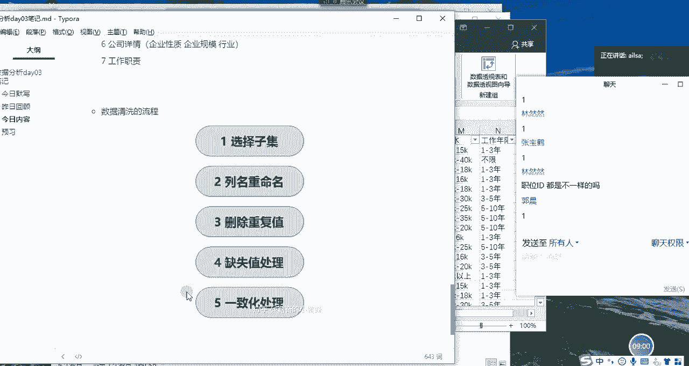
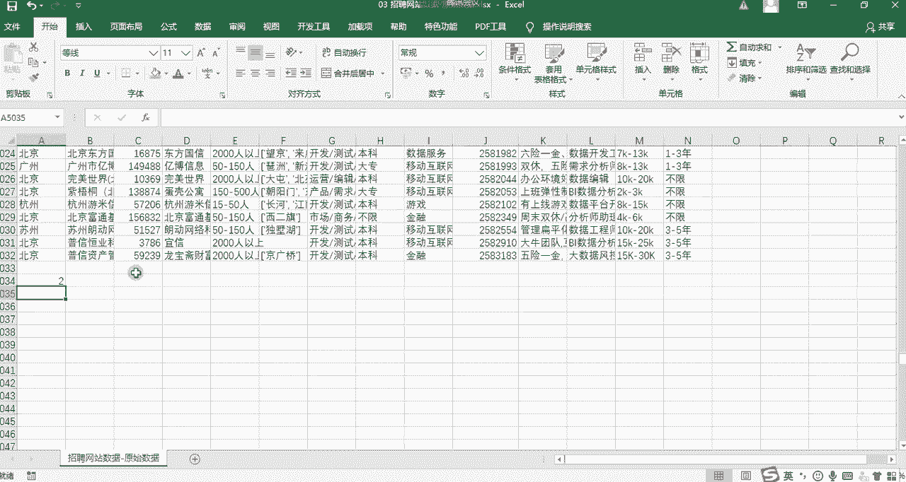
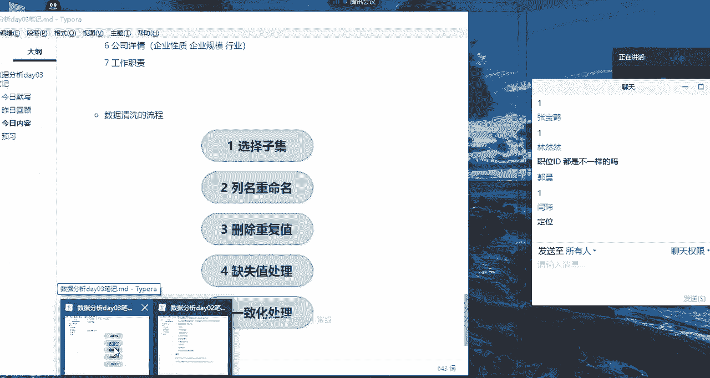
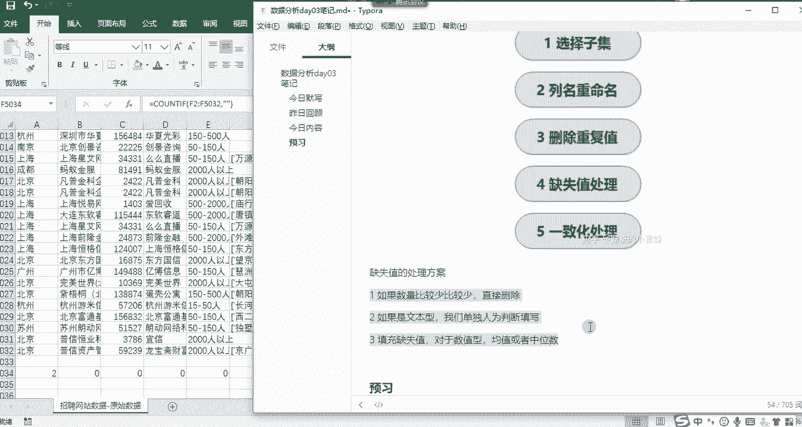
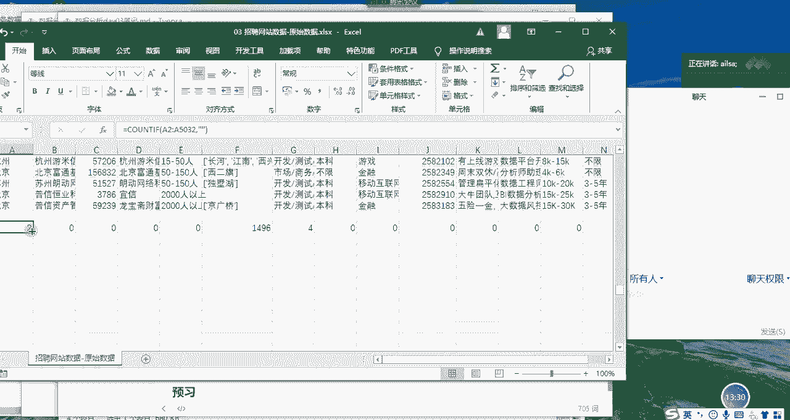
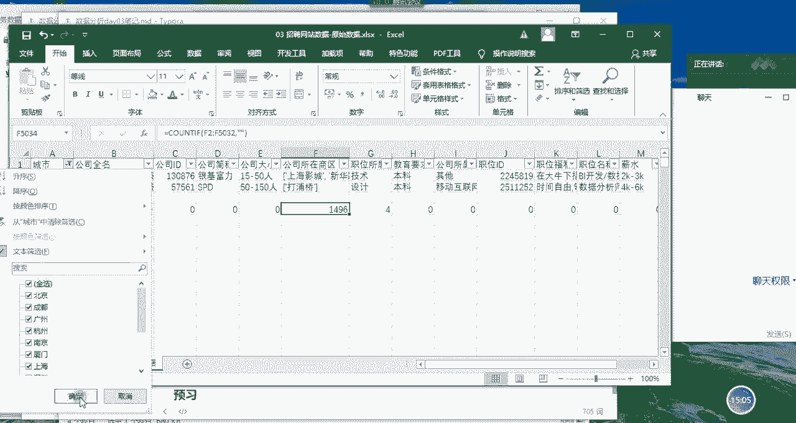
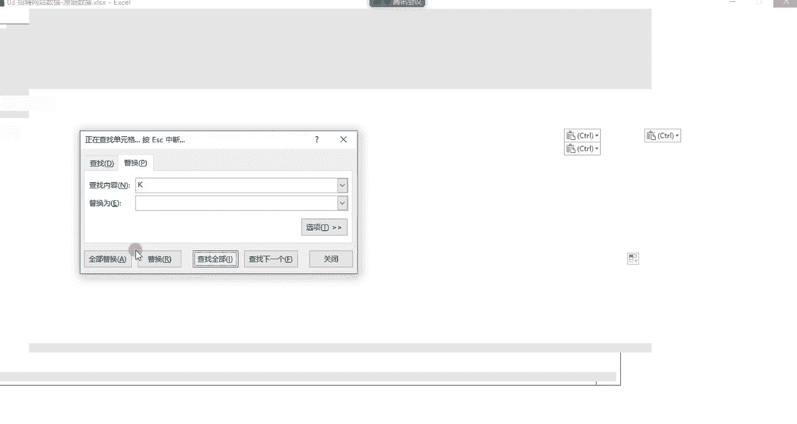
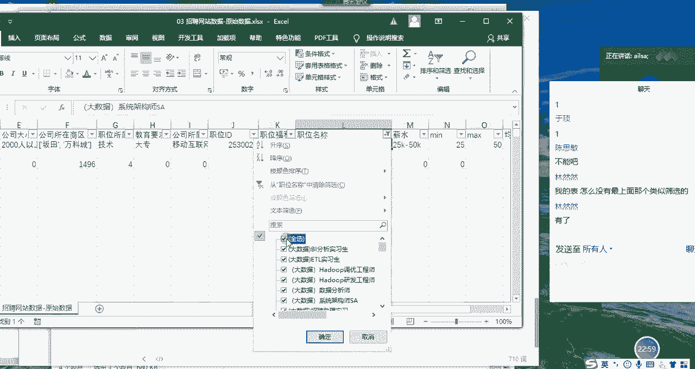
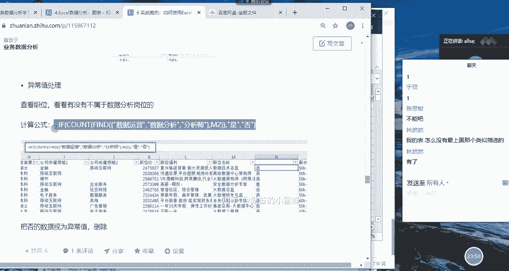

# 强推！这可能是B站最全的【Python金融量化+业务数据分析】系列课程了，保姆级教程，手把手教你学 - P54：05 数据清洗 - python数字游侠 - BV1FFDDYCE2g

好我们有空可以再闲聊哈啊，那我们说回到我们的一个数据分析岗位的呃，需求，然后大家目前想了解的是这么多内容，那我针对这些需求之后，然后哎我们大概的一个思路就可以确定下来了。

因为嗯我们这个是一个比较简单的入门的啊，数据分析，所以说我们呃并不用采用特别高大上的，数据分析的方法呀，或者是模型，然后进行搭建，那我们可以看到这些呃需求的话，大概通过对比分析啊。

然后通过展示的形式就可以实现了啊，所以说我们这边的分析思路的话，相对来说就比较简单一些，就是采用你比如说他这个学历的要求，那我就看一下，展示一下他呃，目前也就是说本科有多少啊，各岗位需求。

然后哦大专有多少，然后是研究生博士这样的一个啊对比分析，所以说主要采用的就是对比分析，然后进行一个维度的拆解啊，这样的一个思路，那我们在啊确定了思路之后，那我们就进行第三个步骤。

就是我们来去获取我们的数据。

那大家看到这个数据呢我已经拿到了，就是我们啊在呃那个某网某招聘网站上，然后他的对于啊数据分析师岗位的啊，一些招聘的信息啊，这只是我们之前爬，就是采集的一个部分的信息啊，在这里去呈现嗯，大家以后啊。

大家到后面的课程学了爬虫之后啊，就可以在重新获取一下，我们目前最新的市场上的数据分析岗位的啊，这些基本的信息哈，那我们拿到这个数据之后，我们肯定是要对它进行数据清洗的，对不对啊。

我先带大家去做如何进行数据清洗，然后接下来的分析你们就自己做啊，自己下午的时候呃抽时间去做，然后你们自己提出的问题，看能不能自己去实现啊，我先做数据清洗哈，我们数据清洗的步骤啊也是有的哈。

我们看一下我们数据清洗的步骤分以下几种，这在我们做分析之前都是类似的嗯，第一个就是选择子集，什么意思呢，就是说我们在做这个分析的过程当中，我要判断一下，是不是这边所有的列都是有必要进行分析的。

如果有必要唉，我就分析，如果没必要，我就可以删掉或者是隐藏啊，就是对于内容的一个筛选，当然在这里的话，我们就默认所有都需要就可以了啊，这是一个，然后第二个的话就是列名重命名。

就他这个列名到底有没有说存在瑕疵的，不明确的，我们需要对它进行一个更新啊，那在这里也没有啊，我们就看一下就可以了啊，第三个的话就是删除重复值啊，第四个是缺失值处理，第五个是一致化处理，跟大家说。

后面三个是我们经常用到的数据处理，的一个操作方式，这也是为什么我们在就是在操作技巧的时候，也讲了这么多哈，那我看删除重复值对于这张表而言什么啊，什么不能重复，你想一想我们是不是对于职位啊，就是岗位。

然后进行了分析啊，那他的岗位肯定是不能重复的，那我们看一下他的职位啊，他这边有职位的id，那每一个职位应该是对应一个职位id，如果只为id重复的话，那就代表该职位重复了，对不对。

而这个时候有的人就说你直接删掉的话，我也分析不出来它到底是因为什么重复，那在这里，我可不可以先把重复的内容给它筛选出来，看一下，没有问题了，我再删除啊，当然是可以的哈，这一操作步骤我可是没讲的哈。

所以说大家认真听我讲，OK我录着它，OK那我选择我们的职位id这一列，点击条件格式，先选择突出显示单元格规则，选择重复值A，我们直接默认它填充为深红色文本就可以了，点击确定。

我们这个时候好像看不出来什么东西是吧，我们点击筛选就知道了，点击我们的筛选，看数据量有点大，所以说它这个就有点慢，按颜色筛选，我们点击这个颜色，有点慢哈啊，哎那我们就筛选出来了，我们可以看到哎这两啊。

这两行好像是一模一样的，同时重复，那我们就可以完全删掉了，对不对，哎，那接下来好像，那我还我还是他们的顺序有点模糊，对不对，那我们还可以对它进行一个排序，什么呢啊点击这个呃呃筛选按钮哈，有点慢。

按颜色排序啊，按颜色排序，点击确定，哎没有时间是吗，OK这边是有没有关系，我们还可以再进行另外一个操作步骤的，嗯我们先把取消掉，然后点击好排序，升序降序都可以哈，程序加就可以，A我排序完了之后。

这个时候我就可以看到这些重复的内容了，我们再点击筛选也是可以的，有点慢了哈，你看这才几千条数据，它就有点慢了哈，哎我们会发现这两行是重复的，这两行也是重复的，说明它是一模一样的，对数据对不对。

那我们就可以直接把我们的职位id，然后给它啊，重复的删掉就可以了，删掉重复值的话，我们都学过了，对吧啊，选中它，然后点击我们的数据选项卡，有一个删除重复值，点击它，然后点击删除重复值。

我们选择选择id啊，选择职位id，在这里找到它，点对勾，点击确定，点击确定，OK他发现了1844个重复值，将其删除，保留了5032个每一值，点击确定，这个时候我们就啊全部都没有红色，红色的内容了吧。

说明它都是唯一的了啊，这就是我们删除重复值的一个操作，以及如何查看重复值的操作，那大家可以跟着我的步骤去这么去操作，如果没有问题，给我扣一，因为你要不跟着我去操作的话，也没有关系。

你下午的时候可以自己再重新操作一遍，但是好，我们接下来的分析是建立在这个基础之上的啊，OK私密已经完成了，其他其他其他同学呢，OK啊，预定完成了，我这个应该是讲清楚了啊，已经讲的不不快哈。

好我们再等半分钟哈，嗯这是我们第一个操作，删除重复值，啊啊啊，然后我们把职位id作为我们的唯一选项，然后进行的操作，好的，五个人完成了，对职位id在我们这这个题当中，我们就理解为一个职位只能有一个id。

它是唯一的，好吧嗯，那这是我们删除重复值的操作，接下来啊我们进行第二个操作，我们看一下我们的提示啊，第二个是缺失值的一个处理。

对不对，那缺失值代表就是空值呗，啊是吧，那空值唉我们该怎么去判断呢，我们怎么知道这里面有没有空值呢，啊有的人说很简单呐对吧，你筛选，然后点击它拉到最后，哎我看一下有空白，那说明它就有空值。

难道我要一个一个的去看吗，啊会不会特别麻烦，这个时候我们可以采用什么方式呢，采用我们的函数啊，怎么办呢，啊我们看这里面是有个空格的哈，再往下走，OK啊，这里面又有个空格啊，唉我这个到最后了哈。

我们如果说想看每一列它是否有控制的时候，我们可以采用我们昨天学过的count if啊，方法啊，这个在我的笔记里面是没有的哈，我们选择我们的区域，我们的区域是从啊A2啊，然后到哪儿呢，稍等等。

我删了一部分数据，它会往下拖的特别厉害，OK到A啊，A5032选择它，A选择完了之后，这是我们的条件区域，对不对，那我们的条件是什么呢，我们的条件是空，唉就是没有值，所以说我们直接输入空就好了。

我们按右括号按的键，它又出现了二。

说明这里面有两个空值，我们再往右拖动，哎我们会发现啊，这个啊就是这个城市有两个空值，然后这个应该是我们的地址啊，唉就是说公司啊所在地址啊，所在商区有1000多个空值对吧，那我们对于空值稍等，我用这个。

那我们对于空值的一个啊处理方案是什么呢，有三种处理方案哈，我在这里面给大家写一下，啊空就是我们也叫缺失值哈。

也叫空值，那空值啊的叫缺失值吧，专业一些缺失值的处理方案，第一个啊，如果说它的数据量比较小，它这个缺失值比较少，那你就可以直接删掉就行了，把整行都删掉哈，直接去掉啊，直接如果数据量数量比较少，比较少啊。

直接删除啊，而且还不是特别重要，它直接删除就可以了啊，比如说他有100万条，然后你有呃100条是空的，那直接删掉，对整个数据都不受影响，第二个的话，如果说啊是文本型的啊，文本型我们都知道。

它们列跟列之间是有相互的一个关联关系的，所以我们可以单独啊单独拿出来做判断，单独人为判断，认为判断填写啊，这是第二种方案，第三种方案，如果说缺失量比较大，并且说你这个数列数据量也不是特别大的时候。

它占了一定很大的比例，你删掉对你的整个的一个效果，或整个分析会有影响的时候，我们可以啊，可以啊，可以填充缺失值哈，那对于啊数值型啊，数值型的啊，我们一般可以选择均值或者是中位数啊，来进行一个填充。

这是我们三个缺失值的处理方案。

那这个是缺失值啊，这个大家听明白了没有，啊听明白给我扣个一，啊刚才说定位指的是定位到空值，对不对，但是你这边有很多个列的话，你定位到空值的话啊，你只是仅仅是定位到了啊，你并不知道它有多少个控制。

所以说我们还是用函数的话会更方便一些嗯，那我说了这三个类别的一个处理方案之后，在本道题当中我们可以看到这个城市是两个啊，那我们其实删掉也可以啊。

我们有5000多个数据呢，对不对，那当然了，它是文本型的，我们也可以做它对它进行一个判断，给它填充一下也可以，那对于这个商区有1400多条啊，那这个其实是有点多了哈，我们删掉它好像不太合适。

但是我们要进行人为填充又有点多，那该怎么办呢，啊我们可以选择放置，不管哎我们对整个列，整个F列它相关的东西，我们都不对它进行一个分析了啊，它就放在这就可以了，因为它缺失值太明显了啊。

相当于就是说我们这一列不要了啊，我们不对这个做分析，所以说接下来我们做的操作，就是对于这个城市啊，这两个空值我们进行一个啊人为的判断，我们先把它找到啊，找到看一下哎，这有两个。

是不是我们可以从公司的名字上来知道，他应该是上海的，对不对，那我们就可以直接把它填成上海的，这个其实没有特别说啊，你怎么这么不严谨啊，其实差不多就可以了，而且我们可以看到他所在的商区哈。

这两个商区也是上海的，所以说那他肯定是上海的公司填上就可以了，那对于这个商区缺失了1496，调数据的话，我们没办法人为的进行一个修改，我们也没办法去删除这么多，因为它会影响我们的结果。

所以我们就干脆就选择不，对这列进行一个分析了，空着就空着了，因为它确实值太明显了啊，这就是我们对于缺失值的处理。

那接下来我们再看对于呃一致化的处理啊，什么叫一致化呢，啊就是我们啊把数据的一些内容给他做规范啊，就要一致化处理啊。

在我们的表格当中，有哪些需要进行一致化的处理呢，我们可以看一下城市唉，没有问题，公司全称也没有问题，公司id也没有问题啊，公司规模大小也没有问题啊，我们当我们看到这个薪水的时候啊。

你看薪水这个是一个区间范围，但是我们接下来的一个需求呢，可能要做一些均啊工资的一些啊，均值啊或者是呃水平啊这样的一些计算的时候，他这个它这个范围好像不太合适，对不对，我们需要对它进行一个一致化的处理。

那该怎么进行一个一致化的处理呢，我们可以看到他这个薪水是一个范围啊，那我们可以把它的最大值和最小值啊，最小值都求出来啊，放在这里，然后如果说我们想计算，这个岗位的一个工资的话。

我们可以取它的均值是不是更好一些对吧，那我们可以把它的最大值提出来，然后最小值提出来，然后我们还可以再计算它的均值对吧，唉这样的一个形式，那我们该如何对这一列进行一个最大，最小均值的计算呢。

我们很明显第一个思路就是分裂对吧，我们发现它的整个的中间有一个非常大的特点，就是它一杠作为区分的，所以接下来我们就对它进行一个啊分裂的操作，好，我们先插入一行，把原数据先复制出来。

我们一般情况下很少对原数据进行一个修改哈，选择这个列，然后数据选项卡，然后分裂唉，我们在这里面选择是分隔符号，点击下一步选择其他选择杠对吧，分隔符A你看是不是已经分隔出来了，分隔出来了，点击下一步。

点击完成好，点击确定，哎，这个时候我们的最大值max啊，最小值min啊，是不是已经出来了啊，说反了哈，最小值啊，min最大值max啊已经出来了，那我们看它，既然我们等会要对它进行一个计算的话。

我们希望它是数字而不是文本，那我们要先把K去掉，是不是，那我们先选择这所有的数据，然后CTRL加H进行一个替换，把K替换成空就可以了，对不对，我们查找全部啊，查找全部有点慢哈，大家看到没有。

这里面一直在动，疯了吗。

稍等啊，OK可以哈，然后我CTRL加A啊，CTRL2全选，大家看我选到了哈，然后全部替换哎他说我完成了啊，这多少多少数替换，点击确定哎，我们看它是不是已经变成数字了对吧，已经变成数字了。

我们在这里面进行一个看一下，哎好像都是数字没有问题了哈，在这里哎哎会发现出存在问题哈，它这个有一些不是区间对吧，有一些是什么什么以上以上唉，那对于以上这些词，其实我们没必要要对吧。

我们可以直接把以上这个词也去掉，那主要是在这个啊里面我们选择它，然后再CTRL加H把以上，啊选中空就行了，这个时候你不要替换其他的地方啊，不然会受影响，CTRL加A全部替换，确定关闭。

哎我们再看一下我们想要的效果哈，啊我们想要的最小值哎，还有个以下哈，OK等会儿再说啊，然后我们再看最大值，OK没有问题，然后我们再把啊以下替换掉，啊查找全部CTRL加A全部替换，没有了哈，是吧，OK哈。

那我们这个时候我们的整个的一个薪资啊，啊整个的一个薪资就计算完了，最小值，最大值，平均值，然后就是我们取一个average就可以了，取一个平均，它们俩相加除以二这样的一个形式嗯，那，OK好。

那大家对于刚才我对薪水这个分类的操作，有什么问题，没有没有问题，扣一，嗯自己操作完了吗，自己操作完了啊，自己操作完了是最好的，好的哎，那我们对于这个哦一致化的处理，哎我们算处理完成了对吧。

那我们后面还要再看一下它这个异常值啊，什么意思啊，小于2000的吗，还在还在纠结，我把这个均值再写上AB1AVERIG哈，OK这这都是以千为单位的哈，大家一定要OK啊，没有问题了啊。

这是我们的薪资已经完成了啊，现在已经完成啊，接下来我们看一下已知画啊，已致化，还有一个叫啊异常值，什么意思呢，就是说我们这个爬取过来的数据啊，没有上面筛选是吗，嗯筛选需要自己找出来哈，嗯这个是在啊。

我们选择第一行或者选不选都行，第一行，然后在开始选项卡下面有一个筛选按钮，我们一点就没有了，再一点就有了啊，你尝试一下，尝试一下，如果没有问题，给我扣一，我等你一下，嗯然然还什么有了好嘞嗯好嘞。

可以了哈，那我们接着往下讲，那我们看一下它整个的一个职位名称啊，我们都知道我们要找的是数据分析师的岗位，那我们看一下它整个的一个数据啊，数据啊整个岗位的一个名称哈，我们会发现嗯。

我也发现他这个他这个还是挺杂的，你比如说像这个大数据什么high do不调优工程师，它就不属于我们数据分析师的一个范围，它就属于啊数据工程师，挖掘那方面的一个东西了，我们这边主要是对于分析师而言。

所以说我们需要对于它的内容，进行一个过滤和判断，然后再呃提取一部分我们最想要的信息，大家可以我可以给大家看一下哈，这个他们的工资应该挺高的啊，啊还好哦还好不是特别高，大数据的工资不高吗，啊这个是高的。

你看这系统架构师，就不是说我们所想要的一个效果了，对不对，所以说我们要需要再过滤一部分唉。

我们想要的那部分的数据分析，这个就需要用到啊，需要用到我们这边的一个处理方案，我看一下哈，我这边有没有我这边啊，在进行一个薪资核算的时候，我采用的是我采用了另外一种就是嗯函数哈，就比较麻烦啊。

大家有兴趣可以看一看，如果觉得太麻烦也可以不看哈啊，我们看一下异常值的一个处理，也就是说我们对于岗位而言的话，我们需要就是过就是获取到的就是数据运营，数据分析分析师这些东西，其他的我们就不需要了。

所以说我们需要再加一层判断，然后把为否的过滤掉。

我们再看一下这个公式，放到我们整个的一个岗位的职称名称的后面，它只要包含这些东西就可以了哈啊，我们看一下哈啊find啊，大家知道find这个函数的用法吗，OK给大家看一下啊。

等于find它返回的是一个位置哈，你看返回一个字符，在另外一个字符当中出现的起始位置，什么意思呢，它有啊，它有三个组成部分，第一个你要找什么，比如说我要找数据这个词啊，这个组成呃。

这个单啊这个内容哈数据，然后我们再往下走看一下，第二个是你要在哪个内容里面去找，我要在这里面去找啊，然后第三个啊，第三个可以直接忽略啊，忽略不写，因为他是想问你，你从这个单元单元格里面哪个位置开始找。

我们可以不指定，然后我们直接右击唉，会发现它返回的是一，因为数据的数在整个的一个单元格的位置里面，出现的是第一位，它也是从一开始的明白了吗，它返回的是一个位置O那我们再来分析啊，分析我这个单词哈。

嗯因为他我这个犯的，他找到的，他找的这个呃内容呢不止一个，所以说他用了大括号去括起来，来代表多个的意思，然后我要找数据运营，数据分析分析师，然后在这个职称名称里面去找，我这边改一下，改成L2哈啊。

改成L2，我在这里面去找，然后如果说啊你找着了，你看find的它返回的是一个什么，它返回的是一个数字，我给它建一个count计数，因为count只会针对于数字进行计数，它如果啊计数大于零啊。

大于零说明它为true，它就会返返回式，如果它不为零，就它它它为零哈，就是否就返回否，那他这样的话，我们就可以看一下它这个整个的一个结果，就会过滤出来我们所想要的啊，效果我再讲一遍哈，我再讲一遍嗯。

大家认真听哈，嗯在这个职位名称里面，我们可以看到它有很多，你比如说像N点net大数据啊，啊什么什么这些对于我们做数据分析师啊，就目前这个岗位业务数据分析师而言的话啊，并不是我们所想要的啊。

你比如说还有什么策略产品经理，这些都不是我们所想要的，所以说我们只想过滤出真正是数据分析师的，那些人啊，这样的话我们在做其他的一些分析维度的时候，会更客观一些，所以我们要把这一部分人找着。

那我们找的内容大概有数据运营，数据分析和分析师这几种工作岗位，因为find的它前面第一个参数是找的内容，如果你是单个内容直接写就行了，如果是多个内容，你用大括号写起来就括起来就行了。

然后第二个内容是你在哪个单元格里面去找，然后它返回的是这个内容，在整个单元格里面的起始的位置，你比如说数返回就是一啊一的位置，但是他如果找不到，它返回的就是零，那account呢它只会针对数值啊。

数值进行一个计数，那你这边如果返回的是零，它就记为零，零的话，if if0就是否啊，就是不满足条件，就是否，如果说它返回的值是123，这样的话它一计数的话就是一啊，因为它只会记一个一哈。

然后又返回的是是啊，这样的一个结果啊，大家听明白了没有听明白，给我扣个一，好的，好的啊，那我在做完了这个数据之后，我需要把是的啊筛选出来，然后重新复制到另外一个新表当中啊，我们尽量就不在原表删除了哈。

然后复制到一个新表啊，我一般喜欢啊选择性粘贴啊，我看一下啊，我一般喜欢是用，这个格式不用啊。

就这个吧，第一个吧啊啊我们粘贴过来，粘贴过来之后，这一列就可以不要了，因为它都是士嘛，把它删掉，那对目前来说啊，对目前来说，我们整个数据清洗就完成了，那我跟大家说一下，在这个过程当中。

我带大家去做数据清洗的过程当中，这只是我在工作当中，日常做的最普遍的一种处理方式吧，也是不算特别繁琐，你没见过特别特别烂的数据哈，你做数据清洗都清洗好几遍，而且还不一定能够啊，清洗的完。

里面还有很多特殊的情况，但是我们在做数据分析的时候，如果数据清洗的不好，那你的分析结果肯定是不准确的，这是毋庸置疑的，所以说啊数据清洗还是要花功夫，花花时间，然后去把它做好啊。

所以这也就为什么说我们上来就要学excel，因为你不学的话，你在做数据清洗的过程当中也是比较麻烦的，对不对，因为你不知道怎么去操作，然后你操作的步骤呢也比较呃，效率比较低啊。

那那其实做着做着都觉得这个工作好难啊，好累啊啊就不太好，OK那我再总结一下我们今天讲的内容啊，我们今天主要讲的是图表啊，我就不再重复了哈，因为我讲完图表之后跟大家又啰嗦了一遍哈，今天主要讲的是图表。

然后还讲了我们数据分析的入门的实战，然后在这个讲之前，给大家介绍了我们数据分析的流程，第一步很重要，我们要明确我们的需求，然后啊23456啊这样的一个闭环的流程，那我们结合我们的这个数据分析岗位。

唉这样的一个分析需求，然后提出了我们的一些问题，确定了我们的一些分析思路，然后我们对数据进行了清洗，然后现在目前拿到手里的数据，就是比较干净的了，嗯那接下来我们就要做数据分析了，既然大家这么想啊。

这么想了解这些问题，那你们何不利用这个数据，进行自己的依次分析呢，是吧，嗯有信心没有啊，我就讲到这儿哈，接下来你们就自己做了，同志们啊。

给我个响应。