# 强推！这可能是B站最全的【Python金融量化+业务数据分析】系列课程了，保姆级教程，手把手教你学 - P57：08 数据透视表作业 - python数字游侠 - BV1FFDDYCE2g

我也嗯大家能听到吗。

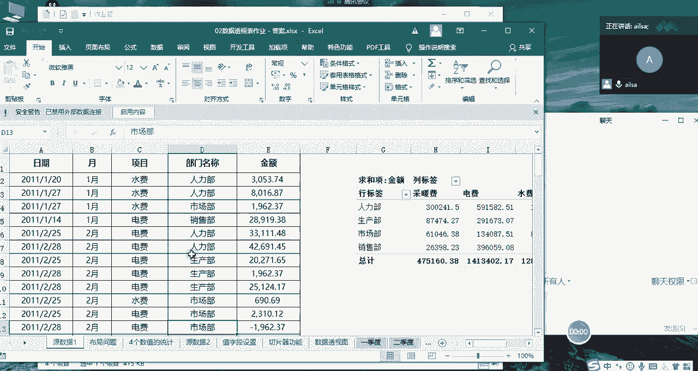

因为我这边网络好像是有点不太好啊，同志们听得到，好嘞好嘞，这个电脑哎可能晚下下回不能晚上讲了，晚上好像好像是人用的有点，但是我这是读网线的哎，OK那我们不管这个了哈，我们接着讲啊，我们先看第一道题啊。

这是我们的原数据啊，这是我们的一个唉你看也是水费电费哈，看来嗯能在外部找到数据源的，也就啊公开数据源的也就这么多哈，其实我们在做我在做数据分析课程的时候，很难的一个点，就是我找这些数据的时候特别费劲。

首先数据对于一个公司而言是属于保密状态的，所以说你不可能去找到公司的核心的数据啊，那你就得去各方资源上去找一些网站上公开的，或者是说嗯啊别的地方的啊，就是训练的练习的数据，这样的话那才可以。

所以这个也费了费了挺大劲，我们接着看我们的题哈，然后第一道题呢，就是他想让我们做出以下的一个格式，哎我们看一下，首先我们看这个，这个其实就是我们要计算每一个部门，它的啊金额啊。

他的一个就相当于它的消费吧，啊它的整个的一个水费电费哎，他的一个消费啊，然后还有他的一个还有第二个金额，哎，我们会会发现他说这个金额占总金额，一个占比情况，对不对。

那我们看一下这样的一个效果该怎么来实现，我们回到我们的原数据，然后点击插入推荐的啊数据图表啊。

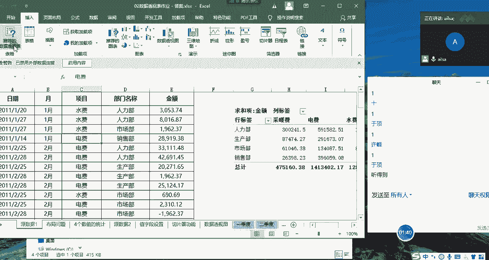

啊数据透视表，然后我们点击确定，那在这里呢我们首先啊我们首先先实现第一个，然后就是我们的部门啊，然后还有我们的金额的进行一个计算，接下来我们要给它计算，它到底占的百分比是多少。

这个时候我们可能最开始想到的是，我们之前不是讲过计算项目，计算字段吗，那在这里可不可以实现呢，好像不太行，因为我们的计算字段，是对于两个字段之间的一个关系，进行一个计算的。

但这里呢它只是它们之间的一个关系对吧，那这个时候我们就可以采用另外一种方式，我们还是把金额拖到我们这里的求和项，然后点击进来，我们选择值字段设置在里面，这里面有一个值显示方式啊，我们看一下唉。

这边有一个总计的百分比，我们点击确定O这就是我们所想要的效果，也就是说我们在课上的时候没有去讲，我们只讲了值汇总方式还有这么多，但是呢我们的值显示方式也有这么多，可以去选择哈。

所以说它还是比较灵活和智能的。

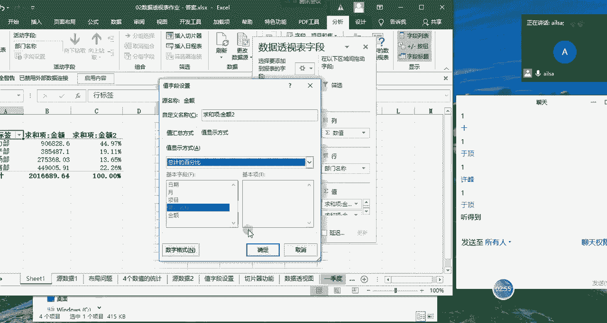

嗯点击确定，OK这就实现了我们所想要的效果，我们再看第二个啊，第二个的话是呃我们的一个啊展示效果哈，但大家可以看到这张表，如果你们在大学里学过统计学的话，都知道这个在竖额横就是在横。

横就是在我们的竖轴哈，呃其实是横坐标哈，呃就这个地方呃，横列和我们的数列啊，有这些不同的分类的时候，这个形式叫列联表哈，列联表啊这样的一个形式，那我们怎么来实现呢，其实特别简单，那就是我们把项目名称啊。

拖到我们的列方向上啊，然后我们把值先都去掉啊，全都去掉，这个时候我们的啊，行方向有我们的部门的分类对吧，然后我们的列方向有我们不同类型的一个，费用的分类，然后我们再进行一个金额的一个计算。

诶我们就计算出来了，每一种分类它的一个金额，在每一个部门，它的一个金额就这么来呈现就可以了啊，这就是在行方向上和列方向上的一个啊，二维的一个形式的一个呈现，这个叫列联表啊，列联表。

内联表列联表就是长这个样子啊。

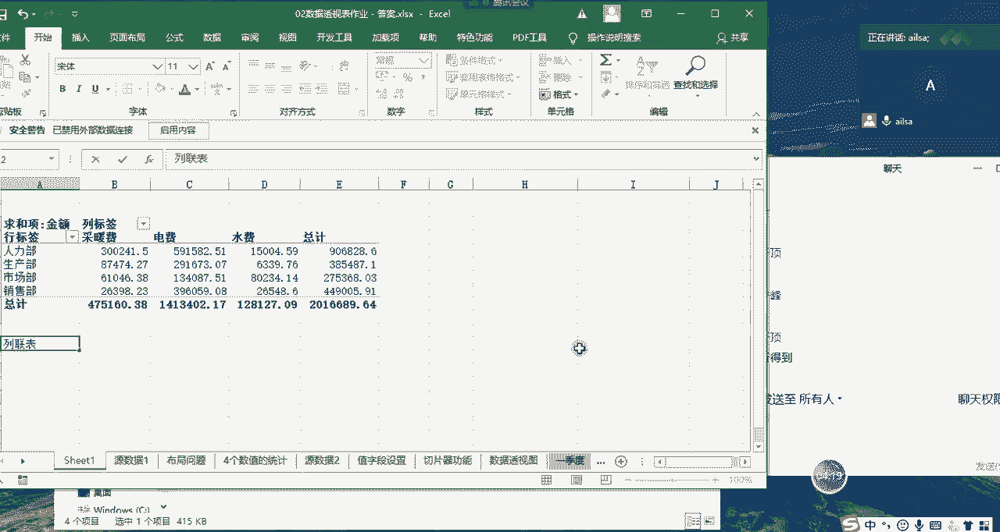

大家对于这个有什么问题，没有没有什么问题给我扣一，OK没有什么问题是吧，好的那我们接下来看啊，看第二个题哈，第二个题我这里就不讲了哈。

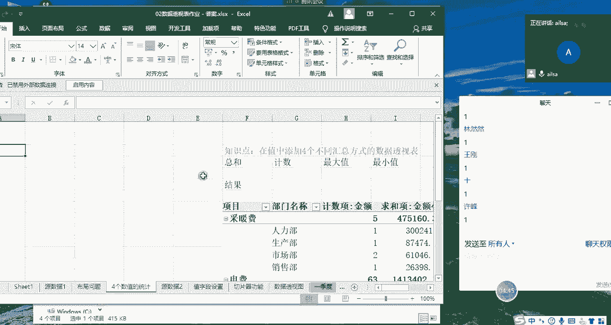

啊这个就比较简单了啊，四个数值的计算，我们主要考察的就是对于值字段设置啊，就最大值最小值求和和计数啊，这样的一个呈现，这个我就不讲了哈，这个比较简单。

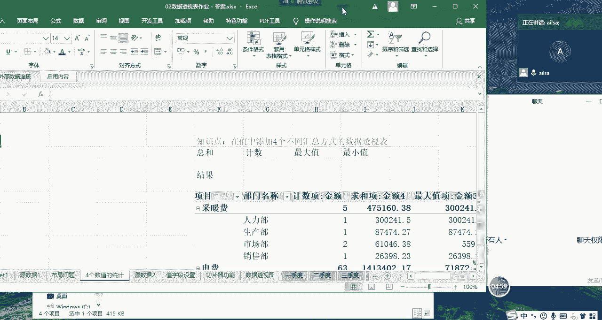

OK那我们看第二个数据源二啊。

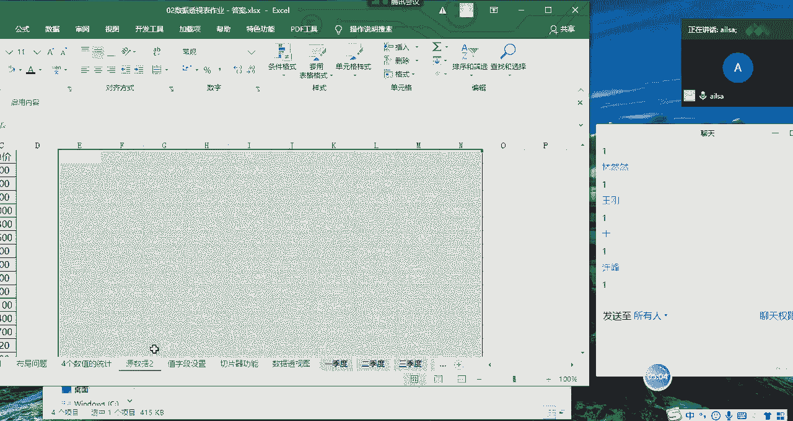

数据源二的话它的一个，它的一个呃内容就是我们的采购的年份。

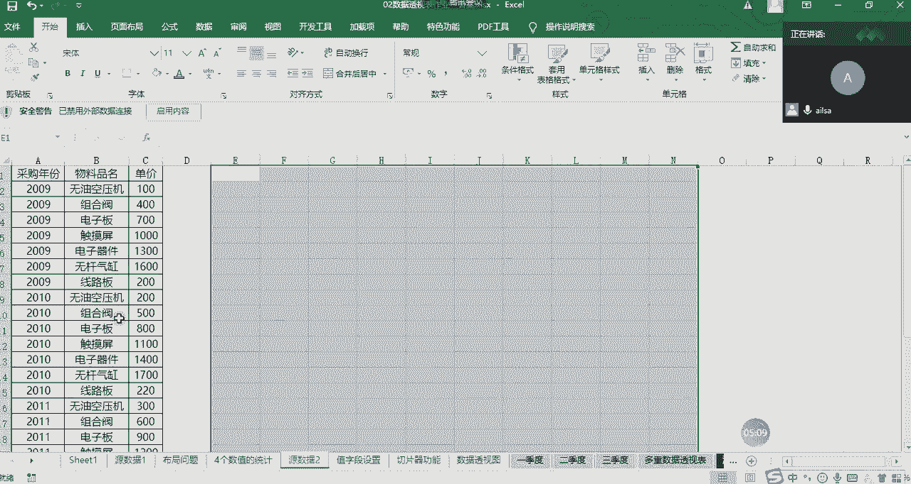

然后还有我们的物料的名称以及我们的单价，那在这里呢我们我们直接忽略哈，因为这个单价的求和计算呢，倒不是有特别大的意义啊，在这里我们就就就是纯拿它来练手的就可以了，我们看一下它主要嗯。

让我们达到的一个效果是什么样子的哈，首先他想让我们啊显示对，相对于2009年而言，其他年份增加的比例值，唉，也就是说我们这个价格啊，到底调整的比例值是什么样子的，相对于2009年。

那这个功能其实啊我们在上课的时候也没有讲，现在我给大家演示一下该怎么来实现。

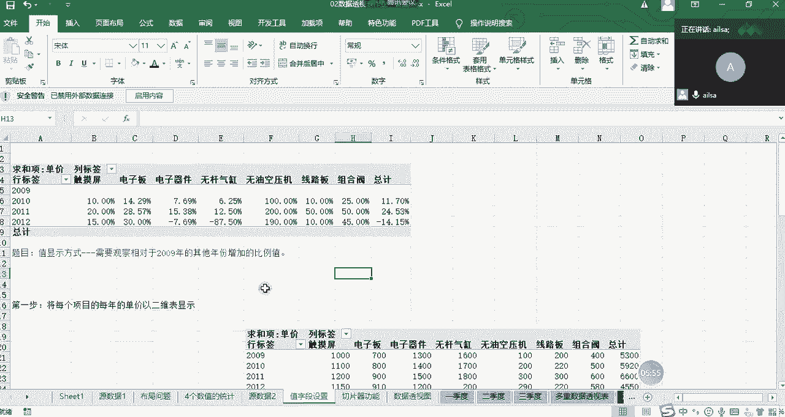

那就是选择我们的插入和数据透视表，我们直接在这里面去演示啊，现有工作表啊，现有工作表。

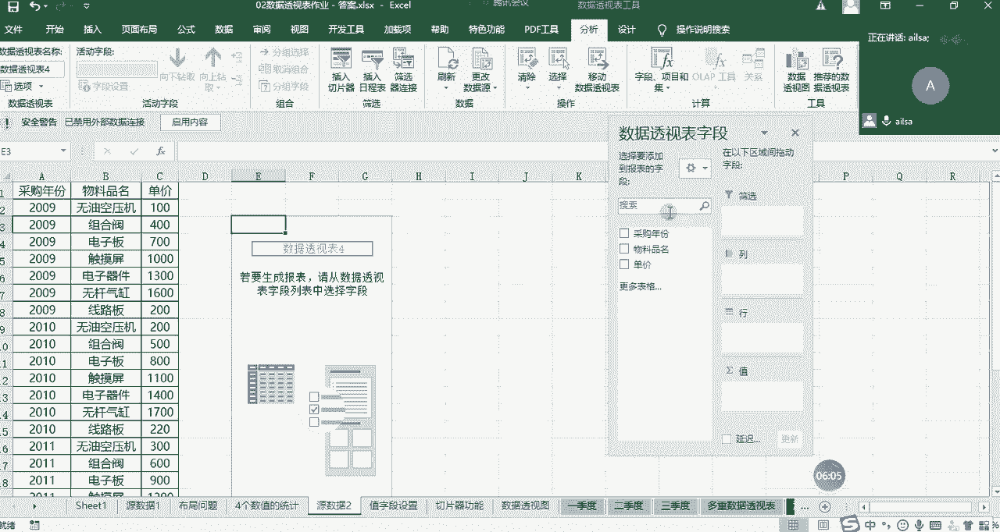

然后我们先把啊我们看一下它的一个效果，我们先把年年份啊选到这里。

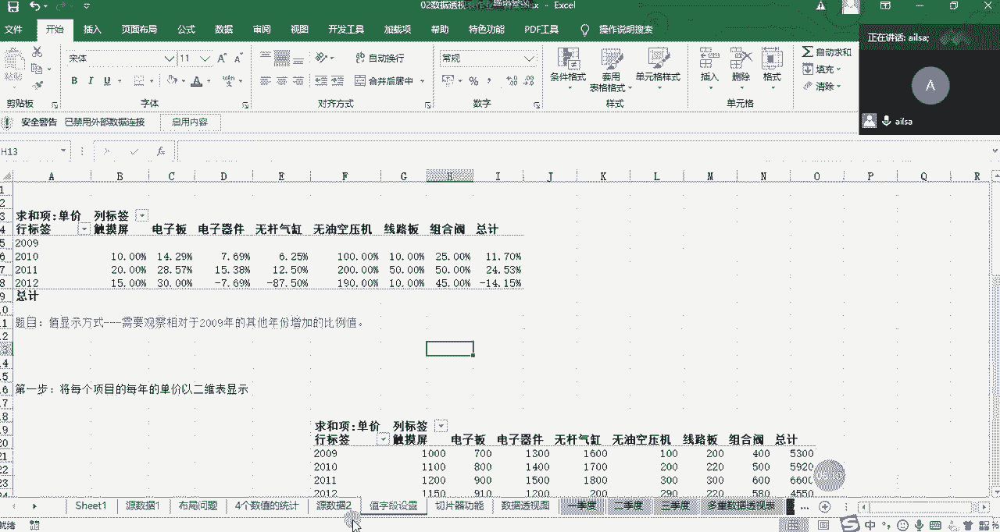

也就是我们的采购年份选到行方向，然后物料名称显到列方向，对吧啊，然后再把我们的单价写到我们的直方向，这个时候我们在这里设置的时候，就要对它进行一个特殊形式的设置了，我们需要在值显示方式的当中显示的是。

我们看一下显示的是百分比哈，相对于2009年而言，也就是说你比如说这个是1000，这个是啊1100，那他如果是百分之百的话，它就是110%，对不对，我们看一下唉，唉是的，它就是相对于他而言。

它所占的比例，它就是一个基数，它就是一，然后这个除以它这个一到底占多大比例，我们就这么来计算的，然后但这并不是我们所想要的效果，我们想要的是它们之间的一个差值，也就是说它跟它相差的是嗯10%，对不对。

我们想要这样的一个效果，那该怎么去更改呢，就是有一个叫差异百分比的啊，还是相对于2009年而言，它们之间的一个差异，点击确定，这个时候这就是我们所想要的效果了，也就是说，2010年触摸屏的价格。

相对于2009年而言增长了10%，然后2011年增长了20%，2020年，它是都是相对于2009年而言的哈，增长了15%啊，这样的一个价格的一个变化趋势啊啊啊，那从这个角度来说，其实也是有意义的哈。

我以为他们是要计算一个什么求和啥的啊，OK那这个就没有什么问题，这个就是我们的一个价格的变化趋势啊。

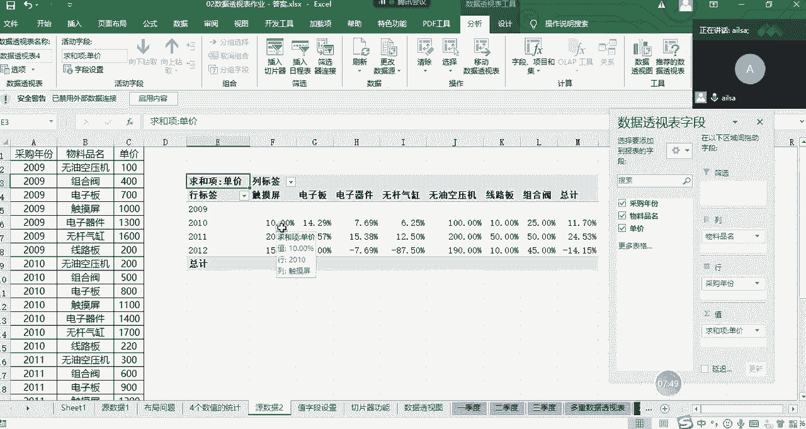

这样的一个呈现好吧，那大家对于这个有什么问题没有啊，没有问题给我扣个一，OK哈OK没有问题哈，嗯那这个就我们就过了哈，我们主要考察的就是这个值字段设置，这样的一个啊这样的一个功能啊。

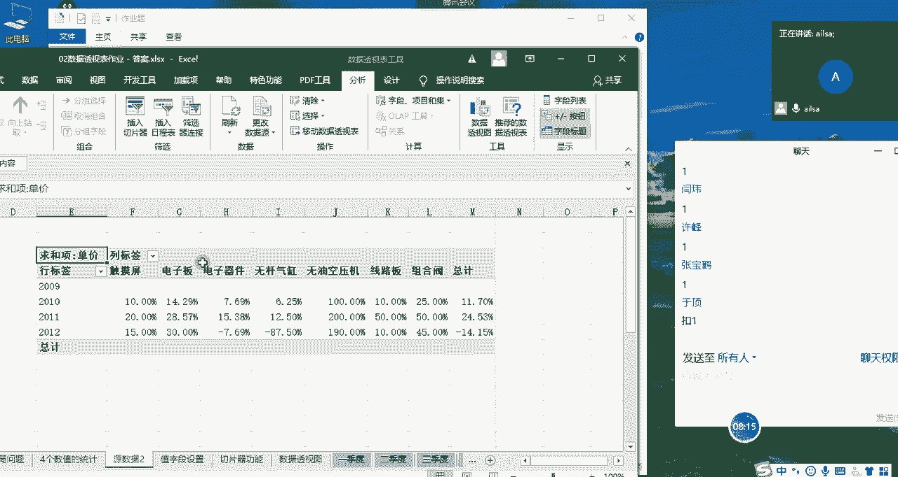

那我们看切片器啊，切片器我就不说了哈，因为我们在上课的时候都讲过了啊。

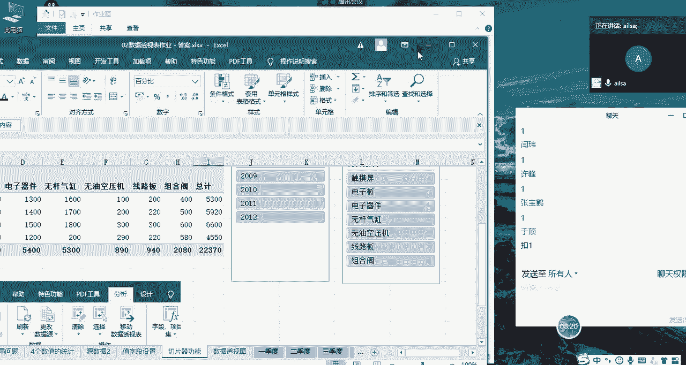

啊怎么去操作，大家都会吧，嗯这个我就不讲了，这个有不会的吗，有不会的就提出来啊，这个就没有什么没有什么好讲的，嗯没有问题是吗，嗯好那我们数据透视图啊。

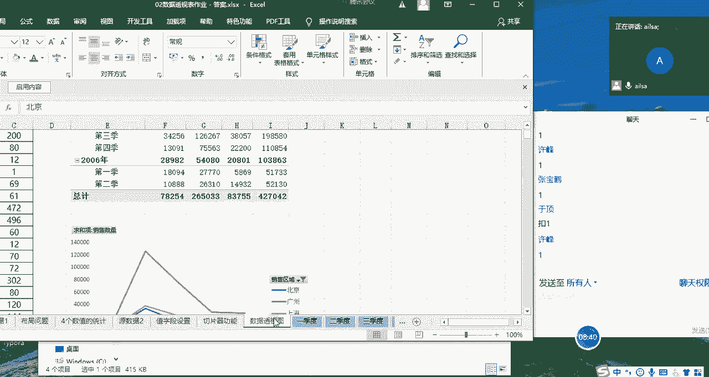

数据透视图在这里我简单说一下哈，我简单说一下后面这个多重合并啊，也是自己去做哈，我就不讲了，然后我们看一下这个数据透视图，他的需求是什么呢，就是说对北京上海，广州的销量进行一个对比分析。

要求使用数据透视表和数据透视图，就是他这边指定了我们的类别，就是北京上海广州对吧，然后我们的啊我们的这个横坐标啊，或者说我们的一个行行方向，行方向是我们的时间，那我们该怎么去做呢。

我们点击插入选择数据透视表。

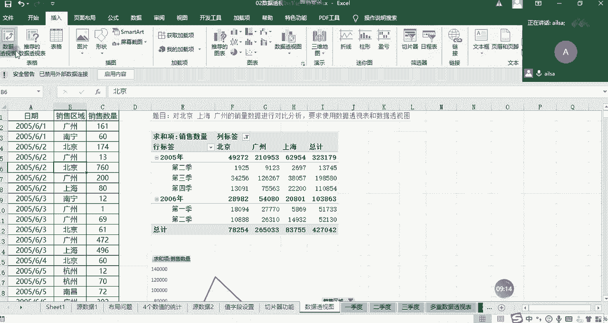

我在新的工作岗标准给大家去显示，这里我主要强调的一个点在于我们的日期，如果说啊如果说我们的这个数据透视，我们的这个原数据当中，这个日期是正确的日期格式的话，那你在进行数据透视表的时候是有很大优势的。

我把日期拖到行方向上，大家看到没有，它已经能够识别它的年，他的季度，他的月份都会有，对不对，哎这样的一个形式，所以说就比较的智能一些，但是如果说你输入的不是日期格式，它就会默认为文本。

所以说不利于我们对于日期的一个处理，然后我们再把我们的销售区域拖到列方向，它是不是显示所有的数据啊，但是啊哦是这样，感觉数据不太对呢，OK啊我们想要的是啊有哈，我们想要的是北京啊，北京上海广州啊。

这几个的数据，北京广州啊，上海这几个的数据，我们直接筛选这一部分数据就可以了，然后是它的销量，我们拖动到这个地方，那它的值就显示出来了，那在这个基础之上，我们就可以对它进行一个数据透视图的显示。

我们可以显示为折线图给它的一个变化，然后大家看一下我啊，我在这里进行一个简单的操作，它这个图就会再发生变化，在哪里呢，你比如说现在我想看一下每个月的变化趋势，我就可以点这个加号诶。

我点了之后大家看到没有，这里变成了月，我再点这个加号啊，它变成了789，看到没有，然后再点这个哎，它这里面所有的月份都呈现出来了，然后我们再点击这个它所有的都出来了，也就是说我这个数据透视表的一个啊。

详细程度跟我这个图表是一一对应的，他们俩之间是有密切的关联关系的，那嗯今天下午的时候有人就会问唉，我想选择我的原数据啊，选择数据为什么它是灰的呢，其实是因为它这个数据和这个数据透视表，之间是绑定的关系。

也就是说他在这个基础上建的这个数据透视图，所以它的所以他的这个区域呢都是固定好的，如果说你想更改它的区域的话，你只能进行一个筛选，或者是在原来的数据透视表上进行一个更新啊。

就是再重新设计一下这样的一个效果才可以，不能你不能再进行一个自定义的选择区域了啊，是这样的一个结果啊。

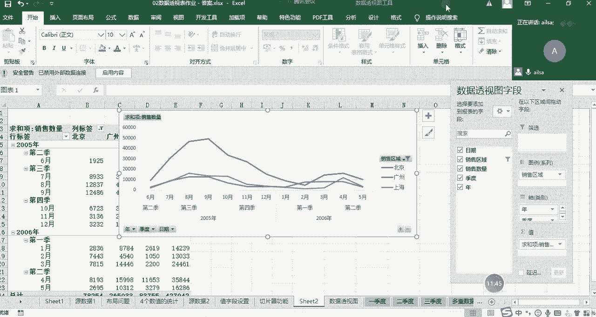

大家对于这个有什么问题没，有没有问题给我扣个一，嗯OK那我们最后一个就是多重合并，我们就不讲了，因为他跟我们上课的例题是一模一样的，啊啊你上课听懂了，这个也自然能做出来哈。

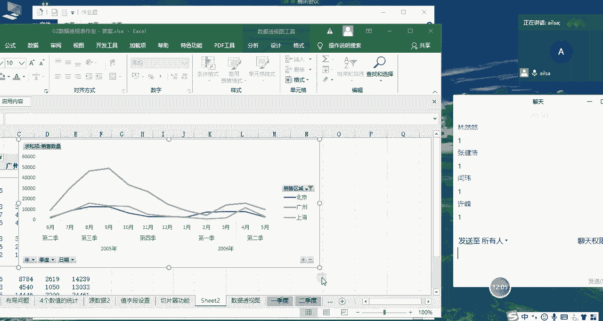