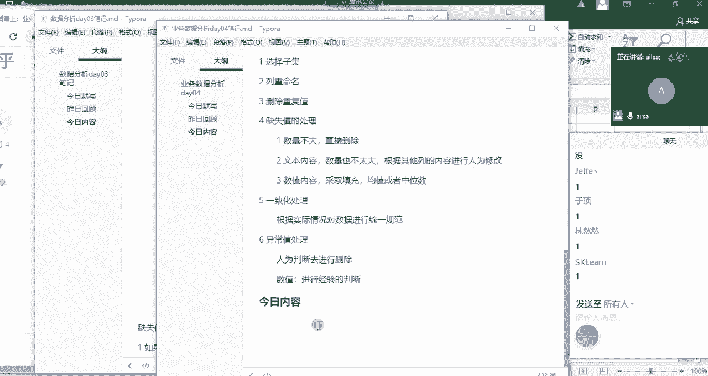
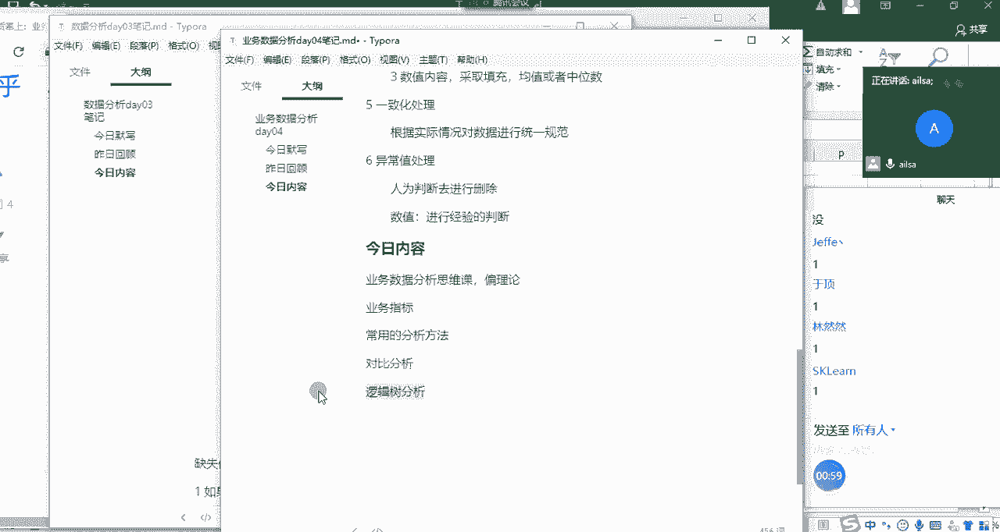
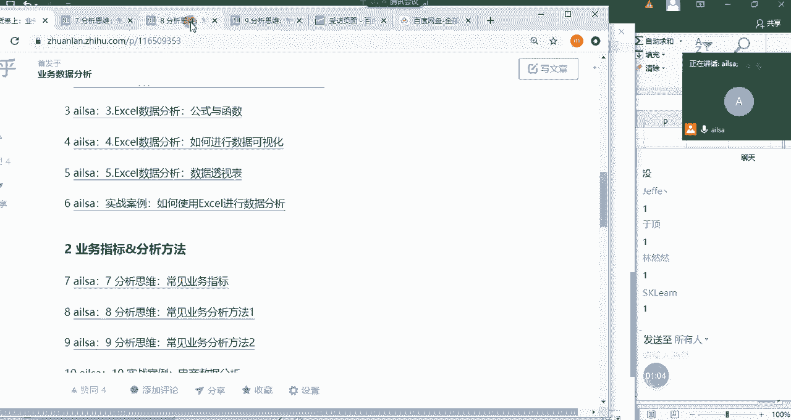
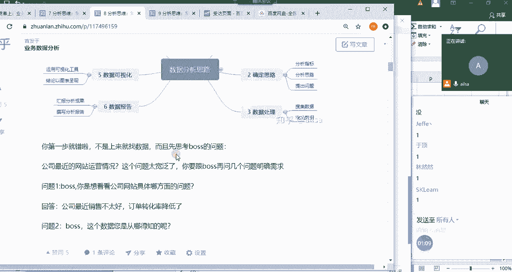
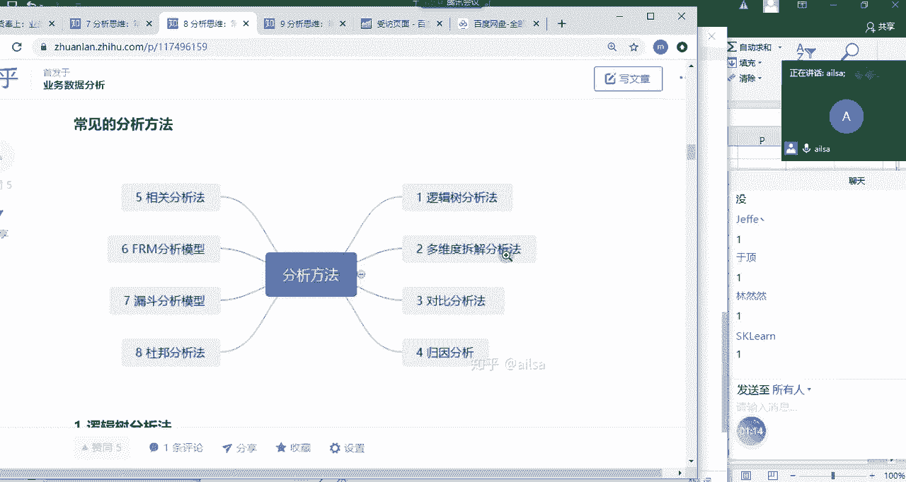
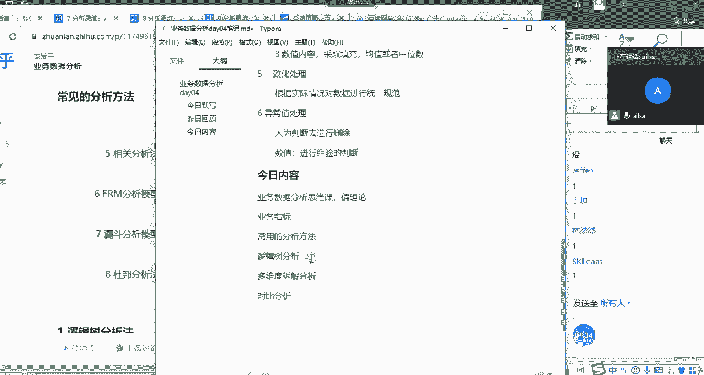
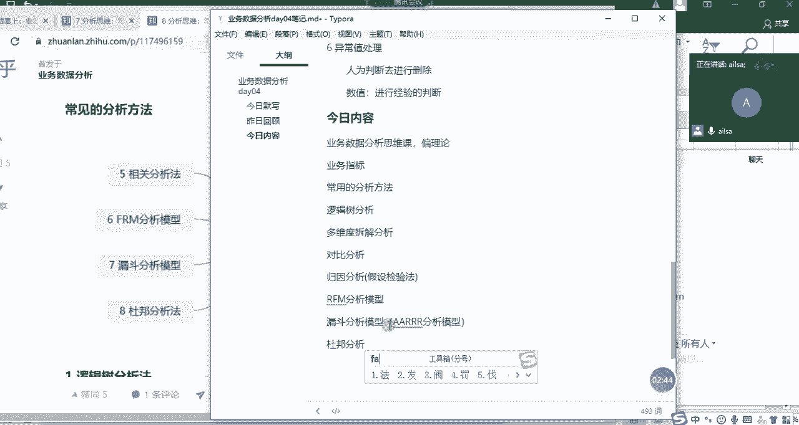
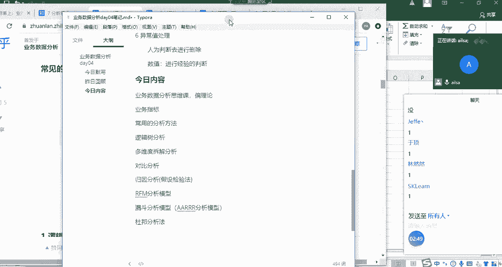
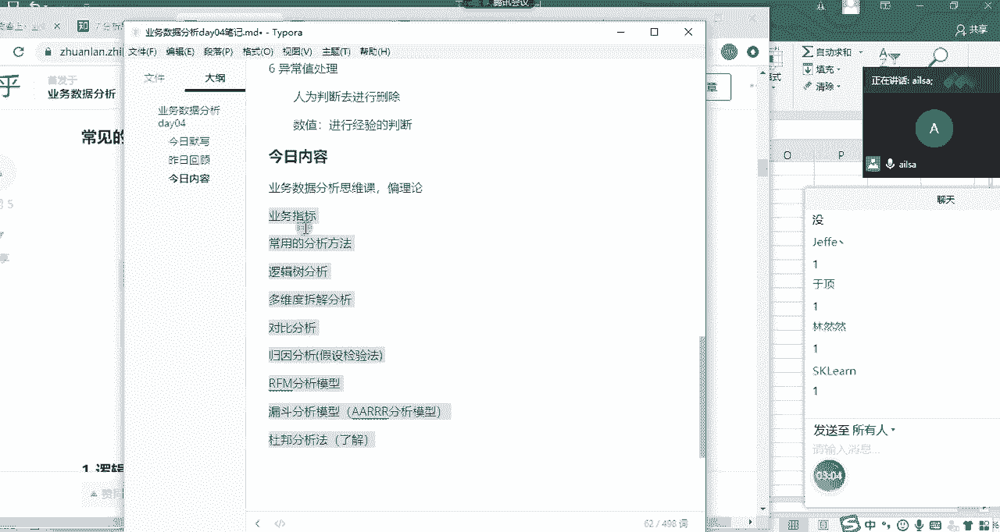
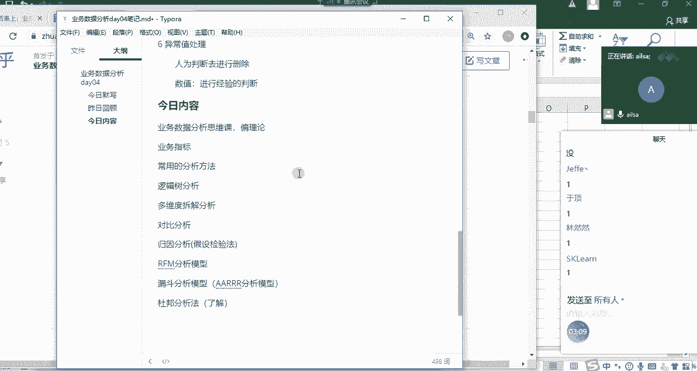

# 强推！这可能是B站最全的【Python金融量化+业务数据分析】系列课程了，保姆级教程，手把手教你学 - P60：02 今日内容 - python数字游侠 - BV1FFDDYCE2g

我们先看一下今天主要讲什么啊。

啊今天主要是一个嗯业务数据分析思维课，业务数据分析思维课，他就是偏理论哈，但是我不会把它讲得特别嗯特别空，特别虚啊，或者特别理论化啊，我会结合我们实际的生活过程当中，唉，我们的能够接触到的一些东西。

进行一个综合的讲解，所以我们今天讲的第一个内容叫业务啊，指标啊，就是业务指标唉，啊第二个就是我们的常用的啊分析方法，那我们的分析方法大概有哪些，我先跟大家介绍一下我们的分析方法，有对比分析。

这个应该经常用哈，然后还有一个逻辑术啊，分析这个的话其实是锻炼个人的一个思维的哈，逻辑指数分析应该是放在它的前面。

然后我们再看一下啊。

看一下我们moon这是我们的一个过程啊。

逻辑数啊，还有一个多维度拆解分析法。

多维度拆解，也就是说我们对于一个总体的数据啊，给到了我们之后，我们要分析的时候，需要通过不同的维度去拆解，去细化到某一个可以进行分析的点啊，多维度拆解分析啊。

多做拆解分析，那下面就是对比分析，还有一个是归因分析哈，嗯归因分析就是我们如何针对某项业务问题，去查找原因啊，归因分析我们也可以叫它什么呢，嗯假设检验法就是我们推测，我们推测是因为这个呃情况造成的。

然后去寻找证据，然后去证明它我们的假设是正确的，所以叫假设检验法啊，假设检验法，然后后面我会介绍两个模型，一个叫啊RFM啊，我这边写错了哈，是RFMRFM分析模型，还有一个就是我们的漏斗分析模型。

漏斗分析模型里面我们会介绍一下AA222啊，分析模型，这也是一个漏斗哈，但是它是针对整个客户生命周期而言的啊，一个东西，然后最后一个会介绍一个财务的杜邦啊，杜邦分析法，但是对于财务这个杜邦分析法呢。

我这边啊几乎是没有接触过，所以说嗯嗯需要大家自我。

因为我写的已经已经足够详细了，所以说这个是了解的内容，大家自己啊看我的写的文章，然后自己去了解就可以了啊，这就是我们今天要讲的内容啊，就是非常的一个学术哈。

嗯嗯嗯呃可能我得多费点口舌。

然后才能够给大家讲明白哈。