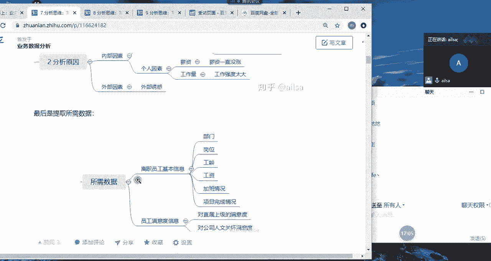
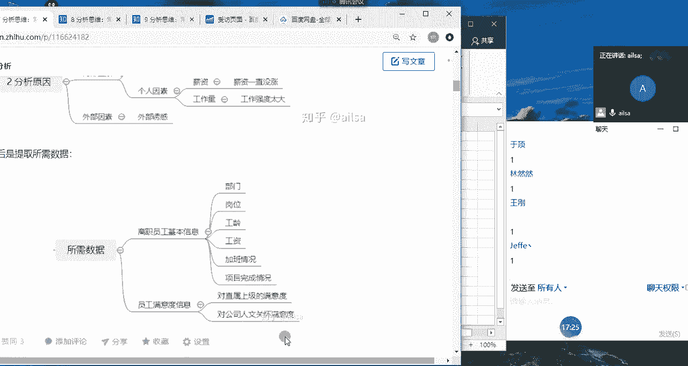

# 强推！这可能是B站最全的【Python金融量化+业务数据分析】系列课程了，保姆级教程，手把手教你学 - P61：03 指标介绍 - python数字游侠 - BV1FFDDYCE2g

业务指标之前先嗯代入一个我在工作当中的啊，啊一个啊场景吧啊一个场景啊，我们讲指标的话会讲什么是指标，然后我们是以电商数据为例，讲常用的指标，然后再讲，既然我们学了这么这么多指标。

我们该怎么选择我们的业务指标啊，这样的一个过程哈啊我们会讲这么多东西，然后在讲这个指标之前啊，我给大家举一个，我在实际工作当中的一个小例子啊，你比如说唉你比如说现在啊，现在我升级了哈。

现在我是你们的boss啊，拿谁呢啊，拿建号来说哈，哎我说建号已经呃，你已经在我们公司入职一个月了，然后对于公司业务了解的也差不多了对吧，那你帮我分析一个问题呗，啊你既然作为一个数据分析师。

你是不是得干点活啊啊对。

然后给你的一个需求是什么呢，我给你的一个需求是啊，就是最近啊来嗯。

大家这个时候可以跟我互动。

我会问问题哈啊最近公司的离职率稍等。

最近嗯公司的离职率有点高，你能帮我分析一下是什么原因吗，来建浩，如果说我给你抛出了这样的一个问题。

你该怎么回答我呢，建豪在吗，工资低嗯，工资不到位，OK嗯建号已经开始提问了哈，嗯嗯哪个部门的离职率偏高，OK还有吗，待遇不好，OK你看啊，我们先想到这里哈，首先你是一个数据分析师啊。

我我你在没有做任何的啊，数据分析的这样的一个过程，你直接给我的得得出的结论就是工资低，待遇不好，那你告诉我啊，你告诉我工资工资低体现在哪些方面啊，待遇又体现在哪些方面，你是怎么得出这样的一个结论的。

你要有数据作为依称的对吧，你不可能你不可能像一个啊非专业人士一样，然后上来就是主观臆断啊，做数据分析师最切记的就是主观臆断，然后凭借自己的一个经验思维，然后去说哎大概就是这个原因造成的。

那如果是这样的话，呃那他们还要我们数据分析师做什么呢，他们直接他他们直接就呃，就是找那些问那些有经验的老员工不就可以了，对吧啊，我直接问比较资深的人力啊，他们应该也会懂一些，对不对。

他们会比我们经验会更丰富一些，OK好的嗯好的，建号啊，这边这这个这个思路是对的，但是态度有点强硬哈，啊我先直接就是说给我这些部门的数据，我是你的boss，你自己不会去找吗，嗯你给我要数据吧。

你是数据分析师，你手里没数据吗，OK哈，哈哈好的，那我我跟大家啊，我现在呢就给大家演示一下，如果说作为一个专业的合格的数据分析师，面对这样的一个需求，我们该怎么啊，该怎么去分析哈。

要有自己的一套一套思路的，首先哈啊boss给了你这样的一个问题，离职率有点高，然后帮我分析一下，首先我们对于boss这样的一个威严哈，你们在这里跟我说的啊，就是天花乱坠说啊怎么怎么着。

如果真的是你的boss给你啊，就是当面说诶，你给我分析一下公司的离职率，其实，其实你还是有点胆怯的，你肯定说好的对吧，然后接下来苦逼的就是你了，因为你根本就不知道怎么去分析，嗯嗯嗯对。

所以说我们第一个我们第一个思路哈，一定要明确我们的问题，我们不要把啊，我们不要把老板啊，我们不要把老板想得特别的权威，有能力，然后对各个方面都特别精通哈，啊不是因为老板对于管理公司啊。

对于啊市场的一个敏感度啊，或者对于整个行业的一个掌握能力，他们是非常强的，但是并不是说他样样都很厉害，那他提出这样的问题之后，我们要有自己的一个质疑的精神，也就是说我们要从从呃从自己专业的角度。

然后去跟他做一再做一次深度的沟通，首先公司的离职率啊，对于这样的一个问题而言，他是非常非常宽泛的啊，就说如果说你们公司是1000多人，那这个离职率有点高，到底指的是什么，谁告诉你的公司离职率就高了。

我觉得我们部门离职率一点都不高，我们公司的这今年前半年都没有一个人动过，怎么就离职率高了，是不是这个这个这你心里该打鼓了，但是你作为数据分析师，你应该站在呃老板的角度去思考，那我们第一个明确问题的话。

我们可以通过啊时间啊，地点啊和事件啊这样的一个思路去分析啊，怎么怎么什么叫是什么叫什么叫时间呢，就是说你说这个离职率最近哎，指的是哪个时间段啊，你比如说到底是第一季度的离职率高，还是第二季度的离职率高。

是1月份的，2月份的，3月份的，你要最近这个时间，你要给我一个框定范围，因为你给我框定了这个范围，我就知道要要获取哪哪个时间段的数据了，对不对，所以说它应该指的是时间。

指的是哪个哪个时间啊段嗯嗯的一个离职率啊，离职率我们要精确，就是你要你要说的是月，那就是精确到哪个月，你要说的是季度就精确到哪个季度，这是要精确到哪个时间段，第二个是地点，什么意思呢。

就是说你所谓的这个啊离职率有点高啊，他这个数据是谁告诉你的，你不可能作为老板自己去分析的吧，肯定是有人给你汇报了，所以说是哪个啊部门啊给你给你提供的啊，这个数据告诉你利润率有点高啊。

呃然后我们需要呃跟啊这个部门去详细沟通，比如说他们说是销售部给他们啊，在上周末做汇报的时候，说，他们想要想要加人，原因是因为他们离职的离职率太高，人手不够了，所以说那这个时候我们就要找到销售部。

然后去跟他们沟通，你这个离职率是怎么来计算的，你这个数据是从哪获取的，我们要去确认这个离职率的计算和获取源，是不是按照我们公司统一的一个标准，数据是否是正确啊，我们先确定这个事情。

那这个事件呢指的就是说唉到底啊，到底是全公司的离职率高，还是啊个别啊个别事业部啊，或者是个别部门啊，都精确到到到底是哪个呃范围内啊，我们要精确的是一个范围啊，范围内的一个离职率啊。

这样的话你看我们通过这三个事件，首先通过时间和事件，我们就大概能够确定说是哪个时间段，然后是哪些部门，这个时候我们的数据已经是，框定在一定范围内了对吧，那框掉一个范围内，我们再去跟这个部门去详细沟通啊。

详细沟通这个数据的来源是否准确，计算，是否按照统一标准，那如果说是OK的，那相对来说，我们已经把这个范围聚焦到很小的一个点了，那接下来这样我们还要再去，我们还要再去分啊，明确第二个啊，前两还要分析啊。

一个就是这个离职率啊，它到底是怎么来计算的啊，离职率的计算哈跟大家说，不同的公司有不同的计算标准，但都大差不差啊，基本上离职率的计算都是离职人数啊，大家听我说哈，离职人数啊，假设我们计算的是月离职率啊。

月离职率，月离职人数，比如说是1月1月离职人数除以什么呢，大家听我说哈，除以1月离职人数加上月末，1月末在职人数，也就是说嗯，也就是说我的这个离职率的计算，就是我当月的所有的离职人数。

加上我当月月末的在职人数，那月末的在职人数它包括哪些呢，就包括啊就是1月份所有的在职人数，再加上入职的人数，还有什么转岗的人数等等，这些都在1月末在职的，我们都称为1月末在职的人数，然后加上离职人数。

然后他的分子是离职人数这样的一个计算方式，就是离职率的计算，那第二个问题啊，我们他既然说最近离职率有点高，是跟谁比高呢，跟谁比高，你说你说你这个你说你这个就是有点高，他这个肯定是有个对比对象啊。

你对比对象到底是谁，你是1月比2月高还是1月比啊，上上一年度的1月高呢，就是你到底是同，就是还是说1月比12月份这个离职率高呢，到底是怎么个对比对象哈啊，我们要把这些问题都确定好了之后。

我们才能进行下一步的一个开展，假设我们最后得出的结论是，得出的结论是啊，得出的结论是啊，呃假设哈3月啊，3月离职率比2月离职率啊高啊，三个百分点啊，然后是销售部门，哎我们的对象是销售部门，销售部啊。

销售部门唉，整整个销售团队，他们的3月离职率比2月离职率高三个百分点，那我们把这个问题确定了之后，我们的数据我们就心里就在想了，这个时候其实我们确定了我们的问题之后，我们就在想这个数好不好搞，对不对啊。

首先销售部门的离呃，就是整个的一个啊离职人员和在职人员的数据，我能不能不能获取到，对不对，然后第二个就是呃呃就是它的3月啊，3月比2月的话，相当于这两个月的数据我肯定是要有的。

那如果说我只有这两个月数据不好用的话，我可不可以获取更多的数据，来进行一个走势的一个对比，对不对，唉这样的一个结论我们就完成了，这就是我们前期要做的一个工作，很多人呢前期不做这个工作的时候。

他后面进行一个分析的时候就特别特别费劲，明白了吗，OK那大家对于这个确定问题有什么疑问，没有觉得有哪些地方还需要再添加嗯，同志们，同志们啊，我们还有什么地方需要添加的没有。

大家有什么好的想法也都可以说嗯，如果没有就扣一，我要看到大家的一个反应，OKOKOK嗯，嗯好的，那我们接下来就要就要进行一个分析了，对不对，那现在就是说现在问题已经抛出来了，离职率高啊，而且是销售部门。

3月离职率比2月离职率高了三个百分点啊，那我们接下来就要进行一系列的分析，我们分析呢呃有从，我们就是要一步一步拆解着去分析，那怎么对于这种问题的分析，首先我们的思路有很多哈，首先我先跟大家说啊。

第一个思路哈啊第一个思路嗯，那我们离职啊，对于离职而言的话啊，我们一般啊会分啊两大群体什么呢，一个叫老员工啊，一个叫新员工，如果我们要对，就是说我们把这个人员调出来看到底是啊，这就属于多维度拆解了哈。

我拆解老员工和新员工两个维度去分析，那如果说是新员工离职率高，因为新员工跟老员工之间他是有不同的特点的，如果说是新员工离职率高，那我们就可能要分析的是他入职了之后，我们有没有给他好的体验对吧。

你比如说有没有入职啊，培训对吧，入职啊，就是如果入职了之后不知道自己干啥，那他可能也也就待了几天就走了，入职培训啊，有没有什么入职关怀啊，就比如说什么叫入职光寒呢，就是说你第一天来到这个公司。

然后入职到这个部门，部门领导啊，本应该哈本应该中午的这个饭，应该是领导带着你去吃的，因为啥呢，因为你对这个环境不熟悉，然后如果说啊又没有人叫着你去吃饭，然后然后你就你也不跟别人进行一个沟通的话。

你有可能中午就是饿肚子了，但是对你的体验就不好，你觉得你融入不到这个团体当中，所以你可能就会选择走啊，假设啊假设是这样一个例子哈，所以入职关怀，还有就是啊薪资啊啊薪资这么一个情况。

就是呃你入职的时候跟你说啊，你给你开的工资是15K，结果你第一个月第一个月发了工资之后啊，到手只有10K，然后你问啊到底什么原因，他们说这个因为你第一个月没有绩效，所以说我们绩效是5000等等之类的。

你就觉得会被坑了，是不是有这样的一个一个情况，还有就是啊整个对于公司的一个满意度，唉就是一般情况下离职都会调研嘛，就是说哎你看到底是我们哪些方面做的不好，然后怎么怎么着，我们再进行一个详细的分析。

还有就是员工的一个加班情况，比如说他一上来啊，就是新入职，一来就给你，就跟你各种加班啊，各种加班啊，然后你肯定也受不了，所以就会走啊，可能新员工更关注的是这些，那对于老员工而言啊，老员工而言。

我们也要从不同的维度进行一个分析，你比如说老员工的话，一般情况下唉我们的分析维度会从内外部，其实新员工也可以从内外部哈，我们刚才讲的都是内部的啊，我们也可以从内部和外部啊，我们先说外部哈。

对于老员工而言，他有一定的啊，他有一定的工作经验了，所以说它外部会存在外部诱惑哈啊而不诱惑，什么意思呢，就是说这个员工特别有能力，他也在这个行业积累了一定的经验，那外就是外外部的公司啊。

有或者是同行业的一个公司，有没有挖他的一个可能，然后给他更高的一个薪酬，这样的更好的一个福利待遇，所以说啊有可能是外部环境而造成的，这个员工的离职，那对于内部而言的话啊，内部而言的话。

其实对于老员工而言，更多的是啊薪酬啊，薪酬与啊薪酬与付出啊是否成正比对吧，也就是说嗯你你天天比如说我给你调出来，这个员工天天加班，天天加班，但是他的薪酬在两年内都没有涨，那他很可能就离职了。

所以说主要考察就是薪酬与付出是否成正正比，还有一个就是啊整个的一个啊员工的关怀啊，员工的关怀，还有就是我们的啊一个满意度啊，这方面如果说我们大概确定了是，就是其实这些都是我们的猜测。

哎我们可能猜测是因为外部诱惑，可能是因为薪酬与付出不成正比，可能是因为这是可能是因为，那我们猜出了这些东西之后，我们是要拿数据去进行证明的。

对不对，那我们的数据该从哪些维度去考虑呢，然后你看啊，我看啊啊我们的数据的话，就啊就会要是从啊不就是这个数据的话。

因为离职率是属于员工的基本信息，所以说有可能就需要跟人力进行一个沟通，他们那边记录的员工的基本情况，或者是说你们公司有完整的一个数据仓库的话，它也有专门针对人的一些记录，你可以把这些数据调取出来。

进行按照你的猜测，然后进行一步一步的去分析，最后分值分析出来什么原因哈，嗯但是啊这个离职率而言的话，因为我们有一个满意度的调查，哎，就是说我们每就员工走的时候，会调查你这个到底是为什么离职。

但是很多时候他都不说真实原因啊。

就说其实有可能是对领导不满意，但是呢他又说啊是职业发展的问题，因为不想得罪领导嘛，对不对，所以说这个还是有一定的啊不合理性啊，啊嗯呃总体来说的话啊，我们做数据分析，只要以我们的数据为准就可以了啊。

如果说呃你的数据啊原是有很有价值的，那你分析出来可能会更好一些，如果没有的话，那你也只能分析个大概出来，比如说确实是薪酬与付出不成正比，这个人加班加加班特别多啊，然后这种情况造成的员工的幸福指数啊。

叫幸福指数下降，然后他有可能就会选择离开，然后我们确定了这样的一个思路之后，唉我们接下来就可以啊调取我们的数据，然后针对这些不同的维度拆解，然后进行一步一步的详细的验证和分析，就可以了，嗯OK同志们啊。

大家对于这个的分析思路，然后听明白了吗，听明白给我扣个一，好的好的，就是我先跟大家说一下，我们在分析问题的时候，首先离职率这个东西啊，离职率这个东西其实它是一个什么呢，它是一个反映员工啊。

反映企业哈企业员工稳定性的一个衡量指标，衡量指标对吧，衡量指标，然后如果说一个公司的离职率特别高，代表什么呢，离职率啊，离职率高啊，代表是员工的流动性很大啊，说明极其不稳定，那说明这个公司在管理上。

肯定会存在很大的问题，那有的人就说你这个离职率高高到什么时，什么程度算离谱呢，也就是说啊它只要啊达到5%到10%，或者是及以上，就是呃5%，我们可以拿5%作为一个中间点吧，就是800%分之十。

这种的话就已经属于很高了啊，员工的流动性太大了啊，这就说明公司的管理上比较混乱啊，有员工来了就走，员工来了就走啊，这是离职率高，离职率太低哈，也不好，为啥呢，你比如说啊国企。

他们的离职率有可能在3%以下，3%啊，3%以下就1%，2%，这种就比较低了，那员工的离职率低，他会有一个不好的现象，就是啊养老哈就是因为没有新鲜血液的注入，但大家的竞争意识就不是特别强。

然后干的活也都是那些，所以说嗯就是比较安逸啊，那还有可能就是如果说他的离职率特别低的话，来了一个就是比较积极上进，比较有竞争意识的员工，有可能会被排挤走，因为他不适合这里面的养老的环境啊。

所以说离职率要有一定的啊，不能说你们公司没有一个人离职，那说明你们公司就非常好，不是的啊，离职率要保持在啊，离职率要保持在怎么说呢，他没有一个标准，可能我就拿啊5%左右吧，5%左右啊。

尽量不要高于5%啊，3%到5%之间，然后的话它既有一定新鲜新既有啊既有新鲜啊，血液的注入，血液的注入啊，又有啊又有啊实力员工啊，就是有实力的员工，老员工又有实力员工的保有，啊保有啊。

那这样的话对于一个部门来说，既有竞争意识，然后又有啊实力的干活的人，那整个部门才是健康的，整个公司也才是健康的啊，所以说是这样的一个指标衡量，所以说我们会发现对于一个指标的理解的话，如果你理解到位了。

那他就可以很好的，然后帮助你更好的去管理你的公司，然后去管理好你的人员，去做好你的业务，对不对，是这个意思哈，那大家对于这个啊有什么问题没有，我们可以参与讨论哈，啊同志们，hello啊。

有什么问题没有没有问题是吗，好的嗯对是的，是有的嗯，这个离职率啊，不管是月啊，季度年这个百分比的话，基本上都差不多是这个水平啊，这个主要看你在分析的时候啊，因为这个率的话。

其实啊其实啊它只是一个时间范围内的啊。

哦我嗯我们暂且理理解为他是嗯月吧，先理解为是月的离职率啊，这个如果你在面试的时候，就是你你可以给别人讲一讲啊，就说哎我们公司啊，对于就是如果说别人说，你对一个指标的理解的时候，如果你扯不太多业务的时候。

你可以扯一下啊，就是员工的管理，因为这个员工的管理在每一个公司都会有的啊，就说诶这个离职率，其实是反映员工稳定性的一个重要的衡量指标，那他太高也不好，太低也不好，然后的话它保持在一定水平有什么样的好处。

相当于你对于指标的一个意识还是非常强的，没有没有啊，所以说啊所以说你们要明白，就是说我们做数据分析的时候，以衡量一个业务好坏的一个指标，它不是说越低越好，也不是说越高越好，而是它健康就好，嗯OK哈。

那我们对于课前示例啊，就讲到这哈。